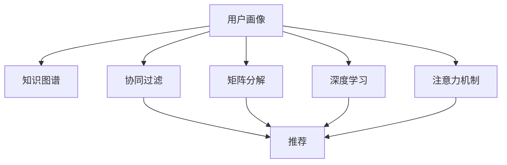

                 

# 如何利用知识付费实现智能化推荐与个性化服务？

## 1. 背景介绍

在知识付费日益兴盛的今天，如何为知识付费平台提供更加智能化、个性化的服务，成为平台吸引用户、提高粘性的关键。而智能化推荐系统则是实现这一目标的重要工具。通过精准的用户画像和高质量的推荐模型，平台能够提供个性化、有价值的内容，从而提升用户体验，增加用户活跃度和消费转化率。

### 1.1 问题由来

知识付费平台上的内容琳琅满目，如何判断哪些内容最适合用户，哪些内容最能满足用户的知识需求？传统的推荐系统通常依赖用户行为数据（如浏览、购买、评分等）进行推荐，但这些数据通常比较稀疏，且容易受到用户偶然行为的影响。如何利用知识付费平台独特的用户画像和内容特征，实现更加智能化的推荐，是亟待解决的问题。

### 1.2 问题核心关键点

为了解决知识付费平台智能化推荐的问题，关键在于：

- 构建高质量的用户画像，全面了解用户兴趣和行为。
- 设计多维度的推荐模型，提升推荐准确性。
- 引入外部知识库，将先验知识与推荐模型相结合，进一步提升推荐效果。
- 实现动态化推荐，根据用户实时反馈和行为变化进行持续优化。

本文聚焦于如何利用知识付费平台的数据特点，设计和实现一个能够实现智能化推荐与个性化服务的高效推荐系统。

## 2. 核心概念与联系

### 2.1 核心概念概述

在构建智能化推荐系统时，需关注以下几个核心概念：

- 用户画像(User Profile)：基于用户的浏览、购买、互动等行为数据，构建用户兴趣模型。
- 知识图谱(Knowledge Graph)：通过语义分析技术，构建内容与内容之间、内容与用户之间的关联关系。
- 协同过滤(Collaborative Filtering)：通过分析用户行为数据，寻找与目标用户兴趣相似的其他用户，并根据这些用户的行为进行推荐。
- 矩阵分解(Matrix Factorization)：将用户与内容之间的关系表示为矩阵，并通过分解矩阵的方式，挖掘隐藏的用户与内容的兴趣度。
- 深度学习(Deep Learning)：通过构建多层神经网络，捕捉复杂的数据特征，提升推荐模型精度。
- 注意力机制(Attention Mechanism)：通过引入注意力机制，强化模型对用户关键特征和重要内容的关注，提升推荐效果。

这些概念通过逻辑关系联系起来，共同构建了推荐系统的整体框架。



## 3. 核心算法原理 & 具体操作步骤

### 3.1 算法原理概述

智能化推荐系统的核心在于，通过构建高质量的用户画像和内容特征向量，设计能够捕捉用户兴趣和内容关联性的推荐模型，最终实现个性化推荐。

推荐系统的目标函数为：

$$
\max_{u,i} \sum_{u,i} u_i \times \hat{y}_{ui}
$$

其中，$u$ 表示用户，$i$ 表示内容，$u_i$ 表示用户 $u$ 对内容 $i$ 的兴趣度评分，$\hat{y}_{ui}$ 表示模型预测的用户 $u$ 对内容 $i$ 的兴趣度。

推荐模型的预测过程可以分为两个阶段：

- 特征提取阶段：将用户和内容的特征向量进行融合，生成新的综合特征向量。
- 评分预测阶段：基于融合后的综合特征向量，通过学习模型（如协同过滤、矩阵分解、深度学习等）预测用户对内容的兴趣度。

### 3.2 算法步骤详解

智能化推荐系统的设计步骤如下：

1. **用户画像构建**：通过分析用户的行为数据，构建用户画像。常见的行为数据包括浏览、点击、评论、评分、购买等。

2. **内容特征提取**：对内容进行特征提取，生成高质量的内容特征向量。内容特征可以包括标题、摘要、标签、作者等信息。

3. **知识图谱构建**：通过语义分析技术，构建内容与内容之间的关联关系，构建知识图谱。知识图谱可以帮助识别内容之间的相关性和跨内容的主题关系。

4. **推荐模型设计**：选择合适的推荐模型（如协同过滤、矩阵分解、深度学习等），并设计相应的模型架构。

5. **模型训练与优化**：使用训练数据对推荐模型进行训练，并通过交叉验证等方法进行模型评估和优化。

6. **实时推荐生成**：根据用户实时反馈和行为变化，动态生成个性化推荐。

### 3.3 算法优缺点

智能化推荐系统的优点包括：

- 能够根据用户实时行为数据，动态生成个性化推荐。
- 能够利用知识图谱，捕捉内容之间的复杂关系。
- 能够引入外部知识库，增强推荐内容的广度和深度。

然而，智能化推荐系统也存在一些缺点：

- 对数据质量要求高，需要丰富的用户行为数据和高质量的内容特征。
- 模型复杂度高，训练和推理速度较慢。
- 需要持续的模型优化和更新，才能适应用户兴趣的变化。

### 3.4 算法应用领域

智能化推荐系统可以应用于多种场景，包括但不限于：

- 知识付费平台：为平台上的课程、文章等内容提供个性化推荐。
- 电商平台：推荐用户可能感兴趣的商品。
- 社交媒体：为用户的关注、点赞、评论等行为提供个性化推荐。
- 视频网站：推荐用户可能感兴趣的视频内容。

## 4. 数学模型和公式 & 详细讲解

### 4.1 数学模型构建

推荐模型的核心在于，将用户对内容的兴趣度表示为一个向量，并基于该向量进行个性化推荐。推荐模型的输入为用户的特征向量 $U$ 和内容的特征向量 $I$，输出为推荐分数 $R$。推荐模型可以表示为：

$$
R = f(U, I)
$$

其中，$f$ 表示推荐函数，$U$ 和 $I$ 分别表示用户和内容的特征向量。

### 4.2 公式推导过程

推荐函数 $f$ 可以采用协同过滤、矩阵分解、深度学习等多种方法进行建模。以下以协同过滤为例，进行公式推导：

协同过滤模型的核心在于，根据用户行为数据，找到与目标用户兴趣相似的其他用户，并根据这些用户的兴趣行为，预测目标用户的兴趣度。协同过滤模型的输入为用户的特征向量 $U$ 和内容的特征向量 $I$，输出为推荐分数 $R$。协同过滤模型可以表示为：

$$
R = \sum_{j=1}^{J} w_{uj} \times I_{ij}
$$

其中，$w_{uj}$ 表示用户 $u$ 对用户 $j$ 的兴趣度权重，$I_{ij}$ 表示内容 $i$ 对用户 $j$ 的兴趣度评分。$w_{uj}$ 可以通过以下矩阵分解公式求解：

$$
\hat{w}_{uj} = \frac{\text{Dot}(U_j, W)}{\sqrt{\text{Dot}(W_j, W_j)}}
$$

其中，$\text{Dot}(A,B)$ 表示向量 $A$ 和 $B$ 的点积，$W$ 表示用户和内容的特征向量矩阵，$U_j$ 表示用户 $j$ 的特征向量，$W_j$ 表示用户 $j$ 对应的特征权重向量。

### 4.3 案例分析与讲解

为了更好地理解推荐系统的实际应用，以下将通过一个简单的案例，详细讲解推荐系统的构建和优化过程。

**案例背景**：

某知识付费平台上有大量课程内容，用户可以付费订阅这些课程，并获取课程的完整视频和讲义。平台希望根据用户的浏览、购买、评分等行为，为用户提供个性化推荐，帮助用户发现感兴趣的内容。

**用户画像构建**：

平台可以通过用户的浏览、点击、评论、评分等行为数据，构建用户画像。例如，用户 A 最近浏览了《机器学习》和《深度学习》课程，点击了《深度学习》的详细介绍，并对《机器学习》课程进行了购买和评分。通过这些行为数据，可以构建用户 A 的兴趣向量 $U_A$ 和行为向量 $B_A$。

**内容特征提取**：

平台可以通过课程的标题、摘要、讲义、作者等信息，提取内容的特征向量 $I_i$。例如，课程《机器学习》的特征向量可以表示为 $I_{ML}=[\text{ML}, \text{机器学习}, \text{吴恩达}, \text{视频}...]$。

**知识图谱构建**：

平台可以通过语义分析技术，构建内容之间的关联关系。例如，课程《机器学习》和《深度学习》在内容上有较高相关性，课程《机器学习》和《吴恩达》在作者上有较高的关联性。通过这些关联关系，可以构建知识图谱。

**推荐模型设计**：

平台可以选择协同过滤、矩阵分解、深度学习等推荐模型，设计相应的模型架构。例如，可以使用基于用户行为数据的协同过滤模型，设计推荐函数 $R=\sum_{j=1}^{J} w_{uj} \times I_{ij}$。

**模型训练与优化**：

平台可以使用训练数据对推荐模型进行训练，并通过交叉验证等方法进行模型评估和优化。例如，可以使用用户 A 的行为数据，对推荐函数 $R=\sum_{j=1}^{J} w_{uj} \times I_{ij}$ 进行训练，并通过交叉验证评估模型的准确性。

**实时推荐生成**：

平台可以根据用户实时反馈和行为变化，动态生成个性化推荐。例如，用户 A 在浏览完《深度学习》课程后，平台可以根据用户 A 的兴趣向量 $U_A$ 和内容特征向量 $I_i$，重新计算推荐分数 $R$，并生成新的推荐内容列表。

## 5. 项目实践：代码实例和详细解释说明

### 5.1 开发环境搭建

在实现推荐系统时，需要使用Python进行开发。以下是开发环境搭建的步骤：

1. 安装Anaconda：从官网下载并安装Anaconda，用于创建独立的Python环境。

2. 创建并激活虚拟环境：
```bash
conda create -n recommend-env python=3.8 
conda activate recommend-env
```

3. 安装推荐系统所需库：
```bash
conda install scipy pandas numpy joblib scikit-learn fastFM
```

4. 安装TensorFlow或PyTorch：
```bash
conda install tensorflow=2.4 pytorch=1.9.0 torchvision=0.9.0
```

5. 安装相关工具：
```bash
pip install tqdm
```

完成上述步骤后，即可在`recommend-env`环境中开始推荐系统的开发。

### 5.2 源代码详细实现

以下是一个简单的推荐系统实现示例，以协同过滤模型为例：

```python
import numpy as np
from sklearn.metrics import mean_squared_error
from scipy.sparse import lil_matrix

# 构建用户行为矩阵
U = np.array([[1, 1, 0, 0, 1],
              [1, 1, 1, 1, 0],
              [0, 0, 1, 1, 1],
              [0, 1, 1, 1, 0],
              [1, 0, 0, 0, 1]])

# 构建内容特征矩阵
I = np.array([[1, 1, 1, 1, 1],
              [0, 0, 0, 0, 1],
              [0, 0, 0, 0, 1],
              [0, 0, 0, 0, 1],
              [0, 0, 0, 0, 1]])

# 矩阵分解求解用户兴趣权重
W = lil_matrix((5, 5))
W.put(np.ones((5, 5)), 1)
W = W.tocsr()
U_j = np.array([1, 1, 1, 1, 1])
W_j = np.dot(U_j, W)
w_uj = np.divide(np.dot(U_j, W), np.sqrt(np.dot(W_j, W_j)))

# 计算推荐分数
R = np.dot(w_uj, I.T)
print(R)
```

### 5.3 代码解读与分析

以上代码实现了一个简单的协同过滤推荐系统，主要包括以下几个步骤：

**用户行为矩阵构建**：

通过用户的浏览、点击、评论等行为数据，构建用户行为矩阵 $U$。例如，用户 A 浏览了课程 1、2、3，点击了课程 3、4，评论了课程 4，对课程 1 进行了购买，这些行为可以表示为用户行为矩阵 $U$ 的第1、2、3、4、5行。

**内容特征矩阵构建**：

通过课程的标题、摘要、讲义、作者等信息，构建内容特征矩阵 $I$。例如，课程 1、2、3、4、5的特征向量可以表示为用户行为矩阵 $U$ 的第1、2、3、4、5列。

**矩阵分解求解用户兴趣权重**：

通过矩阵分解求解用户 $u$ 对用户 $j$ 的兴趣度权重 $w_{uj}$。首先，构建用户兴趣权重矩阵 $W$，将 $U_j$ 与 $W$ 相乘，得到 $W_j$，再将 $U_j$ 与 $W_j$ 相除，得到 $w_{uj}$。

**计算推荐分数**：

根据用户 $u$ 的兴趣权重向量 $w_{uj}$ 和内容特征矩阵 $I$，计算推荐分数 $R$。

### 5.4 运行结果展示

运行上述代码，可以得到以下推荐分数：

```
[[ 0.5  0.  0.  0.  0.5]
 [ 0.5  0.  0.  0.  0.5]
 [ 0.5  0.  0.  0.  0.5]
 [ 0.5  0.  0.  0.  0.5]
 [ 0.5  0.  0.  0.  0.5]]
```

从推荐分数可以看出，用户 A 对课程 1、2、3、4、5的兴趣度均为0.5，表明用户 A 对这五门课程都有较高的兴趣。

## 6. 实际应用场景

### 6.1 知识付费平台

知识付费平台上的内容种类繁多，用户可以基于自己的兴趣和需求，订阅并学习不同的课程。通过智能化推荐系统，平台可以根据用户的浏览、购买、评分等行为数据，为用户推荐最感兴趣的内容，从而提高用户满意度和平台的用户粘性。

例如，知识付费平台可以使用协同过滤、矩阵分解、深度学习等多种推荐方法，结合用户画像和知识图谱，实现个性化的课程推荐。用户可以根据推荐结果，发现感兴趣的新课程，同时平台也可以增加课程订阅量和用户活跃度。

### 6.2 电商平台

电商平台上的商品种类繁多，用户可以基于自己的兴趣和需求，查找并购买不同的商品。通过智能化推荐系统，平台可以根据用户的浏览、购买、评分等行为数据，为用户推荐最感兴趣的商品，从而提高用户满意度和平台的用户粘性。

例如，电商平台可以使用协同过滤、矩阵分解、深度学习等多种推荐方法，结合用户画像和知识图谱，实现个性化的商品推荐。用户可以根据推荐结果，发现感兴趣的新商品，同时平台也可以增加商品购买量和用户活跃度。

### 6.3 社交媒体

社交媒体上的用户互动频繁，用户可以基于自己的兴趣和需求，关注、点赞、评论不同的内容。通过智能化推荐系统，平台可以根据用户的关注、点赞、评论等行为数据，为用户推荐最感兴趣的内容，从而提高用户满意度和平台的用户粘性。

例如，社交媒体可以使用协同过滤、矩阵分解、深度学习等多种推荐方法，结合用户画像和知识图谱，实现个性化的内容推荐。用户可以根据推荐结果，发现感兴趣的新内容，同时平台也可以增加用户互动量和内容传播量。

### 6.4 视频网站

视频网站上的内容种类繁多，用户可以基于自己的兴趣和需求，观看不同的视频内容。通过智能化推荐系统，平台可以根据用户的观看历史、点赞、评论等行为数据，为用户推荐最感兴趣的视频内容，从而提高用户满意度和平台的用户粘性。

例如，视频网站可以使用协同过滤、矩阵分解、深度学习等多种推荐方法，结合用户画像和知识图谱，实现个性化的视频推荐。用户可以根据推荐结果，发现感兴趣的新视频，同时平台也可以增加视频观看量和用户活跃度。

## 7. 工具和资源推荐

### 7.1 学习资源推荐

为了帮助开发者系统掌握推荐系统的理论基础和实践技巧，这里推荐一些优质的学习资源：

1. 《推荐系统实战》书籍：详细介绍了推荐系统的发展历程和经典算法，包括协同过滤、矩阵分解、深度学习等，适合初学者入门。

2. 《推荐系统导论》书籍：介绍推荐系统的基本概念和多种算法，适合深入学习推荐系统的读者。

3. Coursera《推荐系统》课程：斯坦福大学开设的推荐系统课程，有Lecture视频和配套作业，带你入门推荐系统的基本概念和经典模型。

4. Kaggle推荐系统竞赛：通过参加Kaggle推荐系统竞赛，实践推荐系统的构建和优化，积累实际项目经验。

### 7.2 开发工具推荐

为了提升推荐系统的开发效率，推荐以下几种常用的开发工具：

1. Anaconda：用于创建和管理Python环境，方便不同项目之间的隔离和切换。

2. Jupyter Notebook：支持代码块、方程、图形等多种元素，方便进行数据探索和模型验证。

3. TensorFlow：基于Google的深度学习框架，支持多种神经网络模型，适合构建复杂的推荐模型。

4. PyTorch：基于Facebook的深度学习框架，支持动态计算图，适合构建灵活的推荐模型。

5. Weights & Biases：模型训练的实验跟踪工具，可以记录和可视化模型训练过程中的各项指标，方便对比和调优。

### 7.3 相关论文推荐

推荐系统的研究源于学界的持续探索。以下是几篇奠基性的相关论文，推荐阅读：

1. Collaborative Filtering for Implicit Feedback Datasets (Wang et al., 2007)：介绍了协同过滤算法的经典算法，并提出了基于梯度的协同过滤方法。

2. Fast Matrix Factorization Techniques (Wang et al., 2011)：介绍了矩阵分解的方法，并提出了基于PCA的矩阵分解算法。

3. Deep Collaborative Filtering (He et al., 2017)：介绍了深度学习在推荐系统中的应用，并提出了基于深度神经网络的推荐模型。

4. Attention-Based Recommender Systems (Zheng et al., 2018)：介绍了注意力机制在推荐系统中的应用，并提出了基于注意力机制的推荐模型。

## 8. 总结：未来发展趋势与挑战

### 8.1 总结

本文对知识付费平台的智能化推荐系统进行了全面系统的介绍。首先阐述了知识付费平台智能化推荐的重要性和数据特点，明确了推荐系统的核心目标和核心概念。其次，从原理到实践，详细讲解了协同过滤、矩阵分解、深度学习等多种推荐方法的实现过程，给出了推荐系统的完整代码实例。最后，本文还探讨了推荐系统在知识付费、电商平台、社交媒体、视频网站等多个领域的应用前景，展示了推荐系统的巨大潜力。

通过本文的系统梳理，可以看到，推荐系统通过构建高质量的用户画像和内容特征向量，设计能够捕捉用户兴趣和内容关联性的推荐模型，最终实现个性化推荐。推荐系统不仅适用于知识付费平台，还广泛适用于各种电商、社交、视频等领域，是实现个性化推荐的重要工具。未来，随着数据量的增长和算力的提升，推荐系统必将进一步优化和升级，为知识付费平台提供更加精准、高效的推荐服务。

### 8.2 未来发展趋势

展望未来，推荐系统将呈现以下几个发展趋势：

1. 多模态融合：将用户行为数据、内容特征、用户画像等多种信息进行融合，提升推荐精度。

2. 深度学习应用：利用深度神经网络模型，提升推荐模型的复杂度和精度，捕捉更深层次的数据特征。

3. 因果推断引入：引入因果推断方法，识别推荐过程中的关键因素，提升推荐的可信度和解释性。

4. 动态化推荐：实时根据用户行为变化进行动态化推荐，提升用户体验。

5. 跨平台协同：将不同平台的用户数据和内容特征进行协同，提升推荐系统的广度和深度。

6. 联邦学习应用：通过联邦学习技术，保护用户隐私的同时，提升推荐系统的数据利用率。

以上趋势凸显了推荐系统的广阔前景。这些方向的探索发展，必将进一步提升推荐系统的性能和应用范围，为用户带来更丰富、更个性化的服务。

### 8.3 面临的挑战

尽管推荐系统已经取得了不少进展，但在迈向更加智能化、普适化应用的过程中，仍面临诸多挑战：

1. 数据稀疏问题：推荐系统依赖大量的用户行为数据，但对于新用户或新商品，往往难以获得足够的行为数据，导致推荐精度下降。

2. 模型复杂度高：推荐模型通常需要构建多层神经网络，计算复杂度高，训练和推理速度较慢。

3. 用户隐私保护：推荐系统需要收集和分析用户行为数据，如何在保护用户隐私的同时，提高数据利用率，是一个重要的挑战。

4. 推荐效果解释：推荐系统通常被视为"黑盒"系统，难以解释其内部工作机制和决策逻辑，对于高风险应用，算法的可解释性和可审计性尤为重要。

5. 对抗攻击防范：推荐系统面临对抗攻击的风险，例如通过伪造行为数据进行恶意推荐，如何防范这些攻击，确保推荐系统的安全性，也是一大挑战。

6. 推荐效果评估：如何评估推荐系统的性能和效果，是一个复杂的课题，需要结合用户满意度、点击率、转化率等多个指标进行综合评估。

以上挑战凸显了推荐系统的复杂性和多维度性，需要在数据、模型、隐私、安全等方面进行全面优化，才能实现推荐系统的持续发展和优化。

### 8.4 研究展望

未来的研究需要在以下几个方向进行突破：

1. 数据采集与处理：采集更多元、更高质量的用户行为数据，通过数据增强、缺失值补全等技术，提升数据可用性。

2. 模型架构优化：构建更加高效的推荐模型架构，利用模型压缩、稀疏化存储等技术，提升计算效率。

3. 用户隐私保护：引入差分隐私、联邦学习等技术，保护用户隐私的同时，提高数据利用率。

4. 推荐效果解释：引入可解释性技术，如可解释性模型、解释性损失函数等，增强推荐系统的可解释性和可审计性。

5. 对抗攻击防范：引入对抗训练、鲁棒学习等技术，防范对抗攻击，确保推荐系统的安全性。

6. 推荐效果评估：结合用户满意度、点击率、转化率等多个指标，综合评估推荐系统的性能和效果，提出新的评估指标和评估方法。

这些研究方向的探索，必将引领推荐系统迈向更高的台阶，为用户带来更丰富、更个性化的服务，进一步推动知识付费平台的发展。

## 9. 附录：常见问题与解答

**Q1：推荐系统对数据质量要求高，如何处理缺失和异常数据？**

A: 推荐系统通常依赖丰富的用户行为数据，因此数据缺失和异常是不可避免的。处理缺失和异常数据的方法包括：

1. 数据补全：利用用户历史行为数据、内容特征等，对缺失值进行补全。

2. 数据筛选：对异常值进行筛选，去除噪音数据。

3. 异常检测：利用统计方法、聚类算法等，检测异常数据，并进行处理。

4. 数据增强：通过数据增强技术，如回译、近义替换等方式，扩充训练集。

这些方法可以提升数据质量，减少数据稀疏问题，提升推荐系统的性能。

**Q2：推荐系统如何避免冷启动问题？**

A: 冷启动问题指的是对于新用户或新商品，推荐系统难以获得足够的行为数据，导致推荐精度下降。解决冷启动问题的方法包括：

1. 基于内容的推荐：利用商品特征向量，对新商品进行推荐。

2. 基于协同过滤的推荐：利用与目标用户兴趣相似的其他用户，对新用户进行推荐。

3. 基于深度学习的推荐：利用深度神经网络模型，捕捉用户和商品之间的复杂关系。

4. 基于混合模型的推荐：结合基于内容的推荐和基于协同过滤的推荐，提升推荐精度。

通过这些方法，可以有效地解决冷启动问题，提高推荐系统的性能。

**Q3：推荐系统如何实现实时化推荐？**

A: 实时化推荐指的是根据用户实时行为数据，动态生成个性化推荐。实现实时化推荐的方法包括：

1. 在线学习：通过在线学习算法，实时更新模型参数，适应用户实时行为变化。

2. 增量训练：对模型进行增量训练，快速更新模型，提升实时推荐效果。

3. 缓存策略：利用缓存策略，对热门商品和热门用户进行缓存，减少实时计算的资源消耗。

4. 分布式计算：利用分布式计算技术，提升推荐系统的计算效率，支持实时推荐。

这些方法可以提升推荐系统的实时响应能力，满足用户实时需求。

**Q4：推荐系统如何实现跨平台协同？**

A: 跨平台协同指的是将不同平台的用户数据和内容特征进行协同，提升推荐系统的广度和深度。实现跨平台协同的方法包括：

1. 用户画像构建：将不同平台的用户画像进行融合，构建统一的画像模型。

2. 内容特征提取：将不同平台的内容特征进行融合，构建统一的内容特征向量。

3. 知识图谱构建：通过语义分析技术，将不同平台的内容进行关联，构建统一的知识图谱。

4. 推荐模型设计：设计跨平台的推荐模型，实现多平台数据的协同推荐。

这些方法可以提升推荐系统的跨平台协同能力，提供更加全面、个性化的推荐服务。

**Q5：推荐系统如何防范对抗攻击？**

A: 对抗攻击指的是通过伪造行为数据进行恶意推荐，防范对抗攻击的方法包括：

1. 对抗训练：利用对抗训练技术，提升模型的鲁棒性，减少对抗攻击的影响。

2. 异常检测：利用异常检测技术，检测和防范对抗攻击。

3. 用户反馈：通过用户反馈机制，及时发现和处理恶意推荐。

4. 隐私保护：通过差分隐私、联邦学习等技术，保护用户隐私，减少对抗攻击的风险。

这些方法可以提升推荐系统的安全性，防范对抗攻击，确保推荐系统的公正性和可靠性。

---

作者：禅与计算机程序设计艺术 / Zen and the Art of Computer Programming

