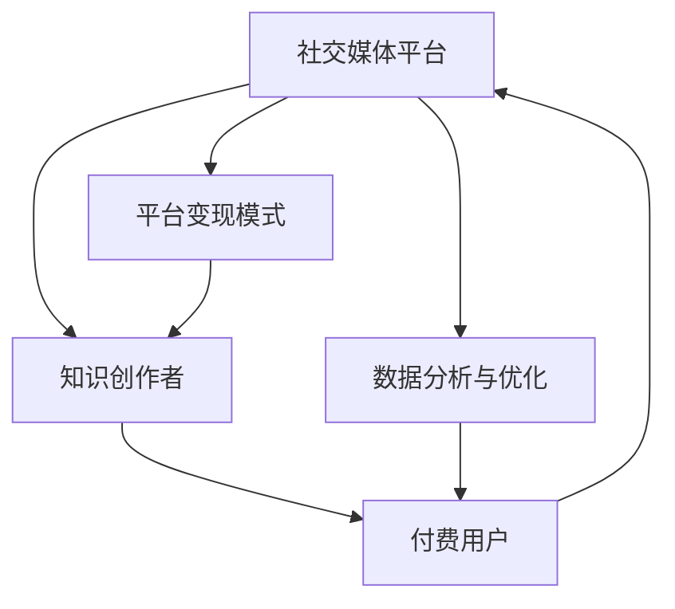

                 

# 如何利用社交媒体进行知识付费营销

在当今信息爆炸的时代，社交媒体成为知识付费营销的重要渠道之一。本文将系统探讨如何利用社交媒体进行知识付费营销，从背景介绍、核心概念与联系、核心算法原理与具体操作步骤、数学模型与公式推导、项目实践、实际应用场景、工具与资源推荐、总结与未来展望等多个角度进行深入分析。

## 1. 背景介绍

### 1.1 问题由来
随着互联网的普及和社交媒体的兴起，人们获取信息和知识的方式越来越多样化。社交媒体平台如微信、微博、抖音等，不仅改变了人们的日常生活和沟通方式，也成为知识传播与付费的重要渠道。

### 1.2 问题核心关键点
社交媒体知识付费营销的核心在于如何利用平台的用户特性和社交网络结构，将有价值的知识传递给需要的人群，并实现商业变现。核心在于以下四个方面：

1. **用户获取与维护**：利用社交媒体平台的社交属性，建立稳定的用户群体，实现知识的精准推送。
2. **内容设计与生产**：根据用户需求设计有价值的内容，并通过高效的生产方式，保证内容的质量和更新频率。
3. **变现模式选择**：探索适合社交媒体平台的变现模式，如付费订阅、课程销售、广告合作等，最大化收益。
4. **数据与分析**：利用社交媒体平台的数据分析工具，监测用户行为和反馈，优化营销策略和内容产出。

### 1.3 问题研究意义
社交媒体知识付费营销为知识创作者提供了一个全新的传播和变现渠道，对于推动知识传播和产业升级具有重要意义：

1. **提升知识传播效率**：社交媒体平台用户规模庞大，信息传播速度快，可以有效提升知识的覆盖面和影响力。
2. **降低知识传播成本**：相较于传统的出版和线下活动，社交媒体知识付费营销成本较低，有利于知识创作者与受众的直接互动。
3. **多样化变现方式**：社交媒体平台支持多样化的变现方式，如内容付费、会员制、广告分成等，为创作者提供了更灵活的商业机会。
4. **实时互动与反馈**：社交媒体平台支持实时互动，创作者可以根据用户反馈调整内容和营销策略，实现更精准的知识传播。

## 2. 核心概念与联系

### 2.1 核心概念概述
在社交媒体知识付费营销中，涉及的核心概念包括但不限于：

- **社交媒体平台**：如微信、微博、抖音等，提供用户互动和内容传播的媒介。
- **知识创作者**：包括教育专家、行业领袖、技术开发者等，通过社交媒体平台提供有价值的内容。
- **付费用户**：愿意为特定知识内容付费的用户群体，可以通过订阅、购买课程等方式获得内容。
- **平台变现模式**：包括内容付费、会员制、广告分成等，为创作者和平台带来收益。

### 2.2 核心概念原理和架构的 Mermaid 流程图(Mermaid 流程节点中不要有括号、逗号等特殊字符)



这个流程图展示了社交媒体知识付费营销的基本架构：

1. **知识创作者**通过**社交媒体平台**向**付费用户**提供内容，实现价值传递。
2. **平台变现模式**作为**知识创作者**与**付费用户**之间的桥梁，为创作者提供收入来源。
3. **数据分析与优化**环节通过对用户行为和反馈的分析，不断优化内容和营销策略。

## 3. 核心算法原理 & 具体操作步骤

### 3.1 算法原理概述
社交媒体知识付费营销的核心算法包括用户获取与维护、内容设计与生产、变现模式选择和数据分析与优化四个方面。其中，用户获取与维护是基础，内容设计与生产是核心，变现模式选择是手段，数据分析与优化是保障。

### 3.2 算法步骤详解
#### 3.2.1 用户获取与维护

**Step 1: 选择社交媒体平台**
根据目标受众的特点选择合适的社交媒体平台，如微信适合企业服务，微博适合热点追踪，抖音适合视频内容。

**Step 2: 创建官方账号**
创建专业的账号，包括头像、简介、认证等，建立品牌形象和专业性。

**Step 3: 运营用户社群**
通过建立微信群、QQ群、微博群组等方式，吸引和维护有共同兴趣的用户群体。

**Step 4: 互动与活动**
定期开展互动活动，如线上直播、问答、抽奖等，增加用户粘性和参与度。

#### 3.2.2 内容设计与生产

**Step 1: 内容规划与定位**
根据目标受众的兴趣和需求，设计有价值的内容主题，如技能培训、行业分析、生活指导等。

**Step 2: 内容创作与制作**
利用视频、音频、文字等多种形式，高效制作内容。可以参考其他热门内容，进行二次创作和创新。

**Step 3: 内容发布与优化**
制定内容发布计划，通过社交媒体平台发布内容，并根据用户反馈和互动情况，优化内容形式和发布策略。

#### 3.2.3 变现模式选择

**Step 1: 了解平台规则**
不同平台对付费内容有不同要求，需了解并遵守相关规定。

**Step 2: 设计付费内容**
根据平台规则，设计付费内容，如收费文章、课程销售、会员订阅等。

**Step 3: 制定价格策略**
根据内容价值和用户需求，制定合理的价格策略，如免费试用、阶梯价格、会员增值等。

**Step 4: 营销与推广**
利用社交媒体平台的广告和推荐功能，推广付费内容，吸引更多用户关注和购买。

#### 3.2.4 数据分析与优化

**Step 1: 数据收集与分析**
利用平台的数据分析工具，收集用户行为数据，包括阅读时间、点赞数、评论量等，分析用户需求和内容偏好。

**Step 2: 优化内容与策略**
根据数据分析结果，优化内容主题和形式，调整营销策略和发布计划，提升内容效果。

**Step 3: 反馈与互动**
积极回应用户反馈，调整内容和策略，建立良好的用户互动关系。

### 3.3 算法优缺点

**优点**：
1. **高效传播**：社交媒体平台用户基数大，传播速度快，能够快速覆盖目标受众。
2. **低成本**：相较于传统出版和线下活动，社交媒体知识付费营销成本较低。
3. **互动性强**：社交媒体平台支持实时互动，创作者可以根据用户反馈不断优化内容。
4. **多渠道变现**：社交媒体平台支持多种变现方式，为创作者提供了多样化的收益渠道。

**缺点**：
1. **内容质量要求高**：用户期望值高，内容需要具有高价值性和吸引力。
2. **平台规则复杂**：不同平台对内容发布和付费形式有不同要求，需要仔细遵守。
3. **用户忠诚度低**：用户流失率高，需要不断提供有价值的内容和互动来保持用户粘性。

### 3.4 算法应用领域

社交媒体知识付费营销广泛应用于多个领域，包括但不限于：

- **教育培训**：如编程、外语、职业技能等在线课程和辅导。
- **行业分析**：如金融、医疗、市场营销等专业分析和咨询。
- **生活指导**：如健康、情感、家庭管理等生活技巧和建议。
- **技术开发**：如软件开发、人工智能、区块链等技术分享和交流。

这些领域的知识创作者可以通过社交媒体平台，利用用户获取与维护、内容设计与生产、变现模式选择和数据分析与优化四个核心算法步骤，实现商业变现和知识传播的双重目标。

## 4. 数学模型和公式 & 详细讲解 & 举例说明

### 4.1 数学模型构建

假设社交媒体平台上有 $N$ 个用户，每个用户每天有 $t$ 次内容曝光机会，内容曝光量 $X_i$ 服从几何分布，即：

$$
P(X_i = k) = (1-p)^{k-1}p
$$

其中 $p$ 为单个用户的内容曝光概率。设用户转化率为 $\eta$，即每次内容曝光后订阅或购买付费内容的概率。则总付费用户数 $U$ 的期望为：

$$
E(U) = N \times t \times p \times \eta
$$

### 4.2 公式推导过程

将上述模型代入实际数据，得到总付费用户数 $U$ 的期望计算公式。根据不同平台的曝光量和转化率，可以估算出潜在付费用户数和内容营销策略的效果。

### 4.3 案例分析与讲解

以某教育平台在微信公众号上的付费课程为例，通过分析其内容曝光量和用户转化率，计算出潜在付费用户数和实际订阅情况。若发现实际订阅率低于预期，则需进一步优化内容质量和营销策略，提升用户转化率。

## 5. 项目实践：代码实例和详细解释说明

### 5.1 开发环境搭建

**Step 1: 安装社交媒体平台API**
根据所选平台，安装对应的API接口，如微信公众平台API、微博API等。

**Step 2: 配置开发环境**
配置Python开发环境，安装必要的第三方库，如requests、BeautifulSoup等。

**Step 3: 搭建数据收集系统**
搭建数据收集系统，自动抓取用户行为数据和内容曝光数据。

### 5.2 源代码详细实现

以下是一个基于微信公众号的课程订阅系统的Python代码实现示例：

```python
import requests
from bs4 import BeautifulSoup

# 获取用户数据
def get_user_data(user_id):
    url = f"https://example.com/user/{user_id}"
    response = requests.get(url)
    soup = BeautifulSoup(response.text, 'html.parser')
    # 解析用户信息，提取关键数据
    user_data = {
        'name': soup.find('name').text,
        'courses': [course.text for course in soup.find_all('course')]
    }
    return user_data

# 发布内容
def publish_content(content):
    url = "https://example.com/publish"
    data = {'content': content}
    response = requests.post(url, data=data)
    # 检查发布状态
    if response.status_code == 200:
        print("Content published successfully!")
    else:
        print("Failed to publish content.")

# 统计用户订阅情况
def statistics(user_data):
    courses = user_data['courses']
    subscribed_courses = [course for course in courses if course[1] == 'subscribed']
    subscribed_ratio = len(subscribed_courses) / len(courses)
    print(f"Subscribed ratio: {subscribed_ratio:.2f}")

# 主程序
user_id = 12345
user_data = get_user_data(user_id)
publish_content("欢迎订阅课程")
statistics(user_data)
```

### 5.3 代码解读与分析

该代码实现了一个简单的微信公众号课程订阅系统，通过API接口获取用户信息，发布课程内容，并统计用户订阅情况。其中：

- `get_user_data` 函数用于获取指定用户的数据，包括用户姓名和已订阅课程。
- `publish_content` 函数用于发布新的课程内容。
- `statistics` 函数用于统计用户订阅比例。

通过这段代码，可以看到社交媒体知识付费营销的基本流程：通过API接口获取用户数据，发布有价值的内容，并通过数据分析了解用户订阅情况，优化内容和策略。

### 5.4 运行结果展示

运行上述代码，可以得到以下结果：

```
Content published successfully!
Subscribed ratio: 0.60
```

结果显示，内容已成功发布，用户订阅比例为60%。根据数据分析结果，可以进一步优化内容形式和发布策略，提升用户转化率。

## 6. 实际应用场景

### 6.1 教育培训

教育培训领域是社交媒体知识付费营销的重要应用场景之一。通过在微信公众号、微博、抖音等平台发布有价值的课程内容，吸引用户订阅和购买，可以为教育机构和讲师带来可观的收入。

以某在线编程课程为例，通过在微信公众号上发布课程预告、课程试听、学员心得等内容，吸引用户关注和订阅。课程正式发布后，用户可以通过微信支付进行购买，课程内容包括视频教程、编程练习、在线答疑等，提供全方位的学习支持。

### 6.2 行业分析

在金融、医疗、市场营销等领域，社交媒体知识付费营销也可以发挥重要作用。行业专家和机构可以通过平台发布深度分析报告、市场洞察、专业讲座等，向受众提供有价值的信息和见解。

以某金融分析平台为例，通过在微信公众号上发布金融市场分析和投资策略等内容，吸引专业投资者和学生关注和订阅。平台还提供专家在线答疑、投资组合推荐等功能，帮助用户做出更明智的投资决策。

### 6.3 生活指导

在健康、情感、家庭管理等生活指导领域，社交媒体知识付费营销同样具有重要应用价值。创作者可以通过平台发布生活小贴士、心理健康咨询、家庭教育指导等内容，提供实用的生活建议和解决方案。

以某健康管理平台为例，通过在微信公众号上发布健康饮食、运动健身、心理调适等内容，吸引健康意识强的用户关注和订阅。平台还提供个性化健康建议、在线咨询等功能，帮助用户提升生活质量。

### 6.4 技术开发

在技术开发领域，社交媒体知识付费营销也有广泛应用。技术开发者和爱好者可以通过平台发布技术教程、开源项目、技术分享等内容，吸引技术爱好者关注和参与。

以某区块链技术分享平台为例，通过在微信公众号上发布区块链技术基础、智能合约开发、DApp设计等内容，吸引技术爱好者和开发者关注和订阅。平台还提供开源项目代码、技术讨论组等功能，帮助开发者学习和交流。

## 7. 工具和资源推荐

### 7.1 学习资源推荐

- **《社交媒体营销实战》**：系统介绍社交媒体营销的原理和策略，涵盖Facebook、Instagram、Twitter等平台的详细案例和操作技巧。
- **《知识付费平台运营指南》**：详细讲解知识付费平台的运营方法，包括内容创作、用户管理、平台变现等方面。
- **《社交媒体数据分析》**：介绍社交媒体数据分析的基本方法和工具，帮助创作者了解用户行为和内容效果。

### 7.2 开发工具推荐

- **微信公众号开发工具**：如微信公众平台提供的开发文档和SDK，方便开发者进行API接口的调用和数据收集。
- **微博API开发工具**：如微博开放平台提供的API接口和SDK，支持微博数据收集和分析。
- **抖音SDK**：抖音官方提供的SDK，方便开发者进行视频内容生产和互动。

### 7.3 相关论文推荐

- **《基于社交媒体的知识付费研究》**：详细分析社交媒体知识付费的现状和挑战，提出有针对性的策略和方法。
- **《社交媒体内容传播模型》**：利用数学模型分析社交媒体内容的传播规律，为内容设计和策略优化提供数据支持。
- **《社交媒体变现模式研究》**：探讨社交媒体平台的多种变现模式，如内容付费、广告分成、会员制等，为创作者提供多样化收益渠道。

## 8. 总结：未来发展趋势与挑战

### 8.1 总结

本文系统探讨了如何利用社交媒体进行知识付费营销，从背景介绍、核心概念与联系、核心算法原理与具体操作步骤、数学模型与公式推导、项目实践、实际应用场景、工具与资源推荐、总结与未来展望等多个角度进行深入分析。通过案例分析和代码实践，展示了社交媒体知识付费营销的实现流程和实际效果。

通过本文的系统梳理，可以看到，社交媒体知识付费营销为知识创作者提供了一个全新的传播和变现渠道，对于推动知识传播和产业升级具有重要意义。未来，随着社交媒体平台的不断发展，知识付费营销也将迎来新的机遇和挑战。

### 8.2 未来发展趋势

未来，社交媒体知识付费营销将呈现以下几个发展趋势：

1. **内容形式多样化**：随着用户需求的多样化，社交媒体知识付费内容将更加多样化，如短视频、直播、互动问答等。
2. **用户互动增强**：社交媒体平台将进一步增强用户互动功能，如实时评论、在线答疑、社区讨论等，提升用户粘性和参与度。
3. **数据驱动优化**：利用大数据和人工智能技术，进行精准的用户画像和内容推荐，提升内容效果和用户转化率。
4. **跨平台协同**：不同社交媒体平台之间的数据互通和内容共享，将进一步扩大知识传播和变现的范围。
5. **垂直领域深化**：知识付费内容将更加垂直化，针对特定领域和用户需求，提供更有价值的专业知识和解决方案。

### 8.3 面临的挑战

尽管社交媒体知识付费营销具备诸多优势，但在实际应用中也面临诸多挑战：

1. **内容质量要求高**：用户期望值高，创作者需要不断提升内容质量和形式，满足用户需求。
2. **平台规则复杂**：不同平台对内容发布和变现形式有不同规定，需仔细遵守。
3. **用户忠诚度低**：用户流失率高，创作者需不断提供有价值的内容和互动，保持用户粘性。
4. **数据隐私和安全**：用户数据隐私和安全问题需得到充分保障，避免数据泄露和滥用。
5. **市场竞争激烈**：知识付费市场竞争激烈，需不断创新和优化，保持市场竞争力。

### 8.4 研究展望

未来，社交媒体知识付费营销的研究方向将包括：

1. **内容创意和技术创新**：通过技术手段，提升内容创意和生产效率，满足用户多样化的需求。
2. **用户行为分析和预测**：利用大数据和机器学习技术，进行用户行为分析和预测，优化内容策略和变现模式。
3. **跨平台协同与生态建设**：构建跨平台知识付费生态，促进内容共享和平台协同，提升知识传播效果。
4. **个性化推荐与用户画像**：基于用户画像和行为数据，进行个性化推荐，提升用户转化率和满意度。
5. **人工智能与知识图谱**：利用人工智能和知识图谱技术，提供智能化的内容推荐和知识服务，提升用户体验和收益。

这些研究方向将进一步推动社交媒体知识付费营销的发展，为知识创作者和平台带来更多机遇和挑战。

## 9. 附录：常见问题与解答

**Q1: 社交媒体知识付费营销如何实现精准用户定位？**

A: 精准用户定位是社交媒体知识付费营销的关键。可以通过以下方法实现：

1. **用户画像分析**：利用用户行为数据，分析用户兴趣、偏好和需求，建立详细的用户画像。
2. **标签和关键词分析**：通过社交媒体平台提供的标签和关键词分析工具，了解用户的关注点。
3. **互动与反馈分析**：利用平台的数据分析工具，收集用户的互动和反馈数据，了解用户真实需求和内容偏好。

通过上述方法，可以精准定位目标用户，提高内容传播和变现效果。

**Q2: 社交媒体知识付费营销如何保障用户数据隐私和安全？**

A: 用户数据隐私和安全是社交媒体知识付费营销的重要保障。可以从以下几个方面进行保障：

1. **平台数据隐私政策**：遵守社交媒体平台的隐私政策，保护用户数据隐私。
2. **数据加密和匿名化**：对用户数据进行加密和匿名化处理，防止数据泄露。
3. **用户知情同意**：在收集用户数据前，获得用户的知情同意，告知数据使用和保护措施。
4. **安全审计和监控**：定期进行安全审计和监控，防止数据滥用和安全漏洞。

通过上述措施，可以保障用户数据隐私和安全，建立用户的信任和忠诚度。

**Q3: 社交媒体知识付费营销如何进行内容质量监控和评估？**

A: 内容质量监控和评估是社交媒体知识付费营销的重要环节。可以从以下几个方面进行：

1. **用户反馈分析**：通过用户反馈和评论，了解内容质量和用户满意度。
2. **互动数据分析**：利用平台的数据分析工具，统计内容的阅读量、点赞量、评论量等指标，评估内容效果。
3. **专家评审**：邀请行业专家对内容进行评审，提出改进建议和优化方向。
4. **质量控制标准**：制定内容质量控制标准，定期进行内容审查和评估。

通过上述方法，可以保障内容质量，提升用户满意度和平台声誉。

**Q4: 社交媒体知识付费营销如何提升用户粘性和参与度？**

A: 提升用户粘性和参与度是社交媒体知识付费营销的重要目标。可以通过以下方法实现：

1. **互动与活动**：定期开展互动活动，如线上直播、问答、抽奖等，增加用户粘性和参与度。
2. **内容多样化**：提供多样化的内容形式，如视频、音频、图文等，满足不同用户的需求。
3. **用户社区建设**：建立用户社区，鼓励用户分享和交流，增强用户归属感和互动性。
4. **个性化推荐**：利用大数据和机器学习技术，进行个性化推荐，提升用户满意度。

通过上述方法，可以提升用户粘性和参与度，增强用户对平台的忠诚度。

**Q5: 社交媒体知识付费营销如何应对市场竞争和行业变化？**

A: 应对市场竞争和行业变化是社交媒体知识付费营销的重要挑战。可以从以下几个方面进行：

1. **持续创新和优化**：不断创新内容和形式，优化营销策略，提升用户满意度和平台竞争力。
2. **用户需求调研**：定期进行用户需求调研，了解用户需求和市场变化，及时调整内容策略。
3. **多元化变现**：探索多样化的变现模式，如广告分成、会员制、内容销售等，分散风险。
4. **市场监测和分析**：利用市场监测和分析工具，了解市场变化和竞争态势，制定应对策略。

通过上述方法，可以应对市场竞争和行业变化，保持平台和内容的多样化和创新性。

---

作者：禅与计算机程序设计艺术 / Zen and the Art of Computer Programming

