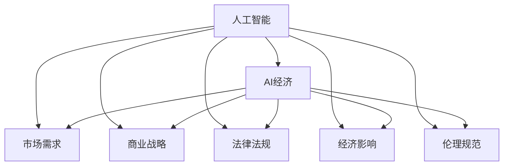

                 

# 如何在AI经济中把握商业大势

## 1. 背景介绍

### 1.1 问题由来

当前，人工智能(AI)已经成为一个国家竞争力的重要指标。AI技术在各行各业的应用，正在以前所未有的速度推动着社会的进步。从智能制造到无人驾驶，从医疗诊断到金融风控，AI技术已经深入到经济社会的每一个角落，改变了传统产业的运营模式，催生了全新的商业生态。然而，随着AI技术的广泛应用，其带来的经济影响和社会影响也越来越受到关注。如何在AI经济中把握商业大势，成为了摆在每个企业家和决策者面前的重要课题。

### 1.2 问题核心关键点

在AI经济中把握商业大势的核心关键点包括以下几个方面：

1. **技术演进趋势**：了解AI技术的发展方向和最新进展，是把握商业大势的基础。只有站在技术前沿，才能准确预判市场变化。

2. **市场需求变化**：分析不同行业对AI技术的实际需求，是把握商业大势的出发点。市场需求的变化直接影响AI技术的市场应用和商业价值。

3. **法律法规与伦理规范**：理解AI技术的法律法规和伦理规范，是把握商业大势的保障。AI技术的快速发展离不开法律法规的规范和伦理道德的约束。

4. **商业应用案例**：研究成功的AI商业应用案例，是把握商业大势的参考。案例可以提供宝贵的经验和教训，指导AI技术的应用和推广。

5. **经济影响评估**：评估AI技术对经济的影响，是把握商业大势的必要环节。只有对经济影响进行全面评估，才能制定科学的商业策略。

### 1.3 问题研究意义

在AI经济中把握商业大势，对于推动AI技术的健康发展和促进社会经济的可持续发展具有重要意义：

1. **提升企业竞争力**：了解AI技术的发展趋势和市场需求，可以帮助企业制定科学的市场战略，提升竞争力。

2. **优化资源配置**：准确把握AI技术的经济影响和商业价值，可以优化资源配置，促进AI技术的商业化应用。

3. **防范风险**：理解AI技术的法律法规和伦理规范，可以有效防范技术风险，保障社会稳定。

4. **推动行业发展**：研究和分析成功的AI商业应用案例，可以为其他企业提供参考，推动整个行业的发展。

5. **创造社会价值**：评估AI技术的经济影响，可以明确技术应用的潜在社会价值，指导社会资源的合理分配。

## 2. 核心概念与联系

### 2.1 核心概念概述

在AI经济中把握商业大势，需要理解以下几个核心概念：

- **人工智能(AI)**：通过计算机模拟人脑进行信息处理的智能技术。AI的核心是机器学习、深度学习等算法。

- **AI经济**：以AI技术为基础的经济体系，包括AI技术的研发、应用、市场和商业模式等。

- **市场需求**：由经济系统内各类主体的实际需求构成的市场条件，包括消费者、企业和政府的需求。

- **商业战略**：企业为实现经营目标而制定的长远规划和策略，包括市场定位、产品开发、渠道建设等。

- **法律法规**：规范AI技术应用的法律规范，包括隐私保护、知识产权、伦理规范等。

- **经济影响**：AI技术对经济系统的综合影响，包括对就业、产业结构、企业竞争力等的影响。

- **伦理规范**：指导AI技术应用的伦理道德规范，包括公平性、透明度、责任性等。

这些核心概念之间的关系可以用以下Mermaid流程图来展示：



## 3. 核心算法原理 & 具体操作步骤
### 3.1 算法原理概述

在AI经济中把握商业大势，需要通过一系列的核心算法和操作步骤来实现。具体步骤如下：

1. **市场调研**：通过调研市场数据，分析市场需求变化趋势。
2. **技术分析**：通过技术分析，了解AI技术的最新进展和应用方向。
3. **法规政策研究**：研究AI技术的法律法规和伦理规范，确保技术应用合法合规。
4. **经济影响评估**：评估AI技术对经济的影响，包括就业、产业结构、企业竞争力等。
5. **商业战略制定**：根据市场需求、技术趋势和法规政策，制定科学的商业战略。
6. **技术应用优化**：优化AI技术的实际应用，提升技术效果和商业价值。
7. **风险防范**：防范AI技术的风险，包括技术风险、伦理风险和市场风险等。

### 3.2 算法步骤详解

以下详细介绍基于上述步骤的AI经济中商业大势把握的具体操作步骤：

**Step 1: 市场调研**

- **收集数据**：通过网络爬虫、调查问卷等方式，收集市场数据。
- **数据处理**：对收集到的数据进行清洗和预处理，去除无效和重复数据。
- **分析需求**：使用统计学方法，分析市场需求变化趋势，识别出市场需求的热点和痛点。

**Step 2: 技术分析**

- **文献综述**：查阅最新的AI技术文献，了解最新进展和技术趋势。
- **技术试错**：进行小规模技术试错，验证新技术的可行性和效果。
- **合作研发**：与科研机构、高校等合作，获取技术支持和研究资源。

**Step 3: 法规政策研究**

- **法律法规**：研究AI技术的法律法规，包括隐私保护、知识产权等。
- **伦理规范**：了解AI技术的伦理规范，确保技术应用符合伦理要求。
- **政策导向**：关注政府和行业协会的政策导向，制定符合政策规范的商业战略。

**Step 4: 经济影响评估**

- **就业影响**：评估AI技术对就业市场的影响，包括岗位流失和就业结构变化。
- **产业结构**：分析AI技术对产业结构的影响，识别出新兴产业和高增长领域。
- **企业竞争力**：评估AI技术对企业竞争力的影响，识别出技术优势和竞争劣势。

**Step 5: 商业战略制定**

- **市场定位**：根据市场需求和技术趋势，确定企业的市场定位和目标客户。
- **产品开发**：开发符合市场需求的新产品，提升产品竞争力。
- **渠道建设**：建立合适的销售和营销渠道，提升市场覆盖率。

**Step 6: 技术应用优化**

- **优化算法**：优化AI技术的算法和模型，提升技术效果。
- **降低成本**：优化技术应用成本，提高技术效益。
- **提高用户体验**：优化技术应用的用户体验，提升用户满意度。

**Step 7: 风险防范**

- **技术风险**：防范技术风险，包括数据泄露、算法偏差等。
- **伦理风险**：防范伦理风险，包括算法歧视、隐私侵犯等。
- **市场风险**：防范市场风险，包括市场需求变化、竞争加剧等。

### 3.3 算法优缺点

基于上述操作步骤的AI经济中商业大势把握方法，具有以下优点：

1. **全面性**：覆盖了市场调研、技术分析、法规政策研究、经济影响评估、商业战略制定、技术应用优化和风险防范等多个方面，全面分析了商业大势。

2. **系统性**：各个步骤之间相互关联，形成了一个完整的系统性解决方案，确保了商业大势把握的全面性和系统性。

3. **实用性**：步骤详细明确，易于操作和实施，具有较强的实用性。

4. **灵活性**：可以根据实际情况灵活调整和优化步骤，适应不同的商业环境和需求。

同时，该方法也存在一些缺点：

1. **数据依赖**：对市场调研和数据处理依赖较大，数据的准确性和全面性直接影响结果的可靠性。

2. **技术复杂**：涉及的技术分析、法规政策研究、经济影响评估等多个环节，技术复杂度较高。

3. **风险高**：技术应用和商业策略的制定过程中，存在一定的技术风险和市场风险，需要谨慎处理。

4. **成本高**：市场调研、技术分析、法规政策研究等环节，可能需要较高的成本投入。

尽管存在这些局限性，但就目前而言，基于上述操作步骤的AI经济中商业大势把握方法仍是一种较为成熟和实用的解决方案。

### 3.4 算法应用领域

基于上述操作步骤的AI经济中商业大势把握方法，在多个领域具有广泛的应用，包括：

- **智能制造**：通过AI技术优化生产流程，提升生产效率和产品质量。
- **金融风控**：利用AI技术进行风险评估和预测，降低金融风险。
- **医疗健康**：使用AI技术进行疾病诊断和预测，提升医疗服务的质量和效率。
- **智慧城市**：通过AI技术提升城市管理水平，优化城市资源配置。
- **教育培训**：利用AI技术进行个性化教学和评估，提升教育效果。

## 4. 数学模型和公式 & 详细讲解 & 举例说明
### 4.1 数学模型构建

在AI经济中把握商业大势，需要进行一系列的数学建模和计算。以下详细介绍几个常用的数学模型：

**市场调研模型**

- **需求预测模型**：使用时间序列分析或回归分析，预测市场需求的变化趋势。
- **市场细分模型**：使用聚类分析或主成分分析，将市场分为不同的细分市场。

**技术分析模型**

- **技术趋势模型**：使用指数平滑或ARIMA模型，预测AI技术的未来发展趋势。
- **技术效果评估模型**：使用A/B测试或交叉验证，评估AI技术的效果。

**法规政策研究模型**

- **法律法规风险评估模型**：使用专家评估或模型评估，评估AI技术应用的法律法规风险。
- **伦理规范模型**：使用伦理框架或模型评估，确保AI技术应用的伦理规范。

**经济影响评估模型**

- **就业影响模型**：使用劳动力市场模型，评估AI技术对就业市场的影响。
- **产业结构模型**：使用投入产出模型，分析AI技术对产业结构的影响。
- **企业竞争力模型**：使用SWOT分析或PEST分析，评估AI技术对企业竞争力的影响。

**商业战略模型**

- **市场定位模型**：使用SWOT分析或PEST分析，确定企业的市场定位和目标客户。
- **产品开发模型**：使用创新扩散模型或竞争策略模型，开发符合市场需求的新产品。
- **渠道建设模型**：使用渠道优化模型或渠道竞争模型，建立合适的销售和营销渠道。

**技术应用优化模型**

- **算法优化模型**：使用优化算法或模型评估，优化AI技术的算法和模型。
- **成本优化模型**：使用成本效益分析或优化算法，优化技术应用成本。
- **用户体验优化模型**：使用用户反馈分析或模型评估，优化技术应用的用户体验。

**风险防范模型**

- **技术风险模型**：使用风险评估模型或专家评估，防范AI技术的风险。
- **伦理风险模型**：使用伦理框架或模型评估，防范AI技术的伦理风险。
- **市场风险模型**：使用市场分析模型或竞争策略模型，防范AI技术的市场风险。

### 4.2 公式推导过程

以下以需求预测模型为例，介绍需求预测模型的数学推导过程：

假设市场需求 $D_t$ 可以用时间序列模型 $D_t = \alpha + \beta X_t + \varepsilon_t$ 来描述，其中 $\alpha$ 为常数项，$\beta$ 为时间趋势系数，$X_t$ 为影响需求的自变量，$\varepsilon_t$ 为随机误差项。则需求预测的数学模型为：

$$
\hat{D}_{t+1} = \alpha + \beta X_{t+1} + \varepsilon_t
$$

其中，$\hat{D}_{t+1}$ 为下期预测需求。

### 4.3 案例分析与讲解

假设某智能制造企业需要预测未来一年的市场需求，以制定生产计划。根据历史数据，市场需求 $D_t$ 与时间 $t$ 的关系可以用时间序列模型 $D_t = 100 + 0.2t + \varepsilon_t$ 来描述，其中 $\varepsilon_t$ 服从正态分布 $N(0, \sigma^2)$。

- **Step 1: 数据收集**：收集过去一年的市场需求数据 $D_1, D_2, \ldots, D_{12}$。
- **Step 2: 模型训练**：根据时间序列模型，对历史数据进行拟合，得到模型参数 $\alpha = 100$，$\beta = 0.2$，$\sigma^2$。
- **Step 3: 预测未来**：根据训练好的模型，预测未来一年的市场需求 $\hat{D}_{13}, \hat{D}_{14}, \ldots, \hat{D}_{24}$。
- **Step 4: 结果分析**：分析预测结果，调整生产计划，确保市场需求满足。

## 5. 项目实践：代码实例和详细解释说明
### 5.1 开发环境搭建

在进行AI经济中商业大势把握的实践前，我们需要准备好开发环境。以下是使用Python进行项目实践的环境配置流程：

1. 安装Anaconda：从官网下载并安装Anaconda，用于创建独立的Python环境。

2. 创建并激活虚拟环境：
```bash
conda create -n ai-economic env python=3.8 
conda activate ai-economic
```

3. 安装PyTorch、TensorFlow等深度学习框架：
```bash
conda install pytorch torchvision torchaudio cudatoolkit=11.1 -c pytorch -c conda-forge
conda install tensorflow
```

4. 安装相关的数据处理和分析库：
```bash
pip install pandas numpy matplotlib seaborn scikit-learn statsmodels
```

完成上述步骤后，即可在`ai-economic`环境中开始项目实践。

### 5.2 源代码详细实现

以下是一个使用Python进行市场需求预测的简单示例：

```python
import pandas as pd
import numpy as np
import matplotlib.pyplot as plt
from statsmodels.tsa.arima_model import ARIMA

# 读取历史数据
data = pd.read_csv('demand.csv', index_col='date', parse_dates=True)
data.index = pd.to_datetime(data.index)

# 拆分数据集
train_data = data[:'2020-12-31']
test_data = data['2021-01-01':]

# 构建ARIMA模型
model = ARIMA(train_data, order=(5,1,0))

# 训练模型
model_fit = model.fit()

# 预测未来数据
forecast = model_fit.forecast(steps=len(test_data))

# 绘制预测结果
plt.plot(train_data.index, train_data.values, label='Training Data')
plt.plot(test_data.index, test_data.values, label='Test Data')
plt.plot(forecast.index, forecast.values, label='Prediction')
plt.legend()
plt.show()
```

### 5.3 代码解读与分析

让我们再详细解读一下关键代码的实现细节：

**数据读取**

- `pd.read_csv()`：读取CSV格式的市场需求数据，`index_col`参数指定日期列作为索引。

**数据拆分**

- `[:'2020-12-31']`：使用切片操作，拆分出训练数据集。

**ARIMA模型**

- `ARIMA(train_data, order=(5,1,0))`：使用statsmodels库的ARIMA模型，指定模型的阶数。

**模型训练**

- `model_fit.fit()`：训练ARIMA模型，得到模型参数。

**预测未来数据**

- `model_fit.forecast(steps=len(test_data))`：使用训练好的模型，预测未来一年（即测试集）的市场需求。

**结果可视化**

- `plt.plot()`：绘制训练数据、测试数据和预测结果的折线图。

通过这个简单的示例，可以看到使用Python进行市场需求预测的基本步骤和实现方式。

## 6. 实际应用场景
### 6.1 智能制造

在智能制造领域，AI技术广泛应用于生产优化、质量控制、供应链管理等环节。通过AI技术，企业可以实现智能制造，提升生产效率和产品质量。例如，使用AI技术进行设备故障预测和预防性维护，可以大幅降低设备故障率，提高生产线的稳定性。

### 6.2 金融风控

金融行业面临的风险较大，AI技术在金融风控中有着广泛的应用。利用AI技术进行风险评估和预测，可以有效识别高风险客户和交易，降低金融风险。例如，使用AI技术进行信用评分和欺诈检测，可以显著提升金融机构的信用管理和风险控制能力。

### 6.3 医疗健康

AI技术在医疗健康领域有着广阔的应用前景。通过AI技术进行疾病诊断和预测，可以提高医疗服务的质量和效率。例如，使用AI技术进行影像分析，可以准确诊断疾病，减少误诊和漏诊。使用AI技术进行流行病预测和公共卫生管理，可以有效控制疾病传播，保障公众健康。

### 6.4 智慧城市

智慧城市建设需要大量AI技术的支持。通过AI技术，城市管理可以更加智能化和高效化。例如，使用AI技术进行交通管理，可以优化交通流量，减少拥堵。使用AI技术进行公共安全管理，可以提高安全防范水平，保障城市安全。

## 7. 工具和资源推荐
### 7.1 学习资源推荐

为了帮助开发者系统掌握AI经济中商业大势把握的理论基础和实践技巧，这里推荐一些优质的学习资源：

1. **《AI经济学》**：李笑来著，全面介绍了AI技术对经济的影响和应用。
2. **《AI商业策略》**：陈晓东著，详细讲解了AI技术在商业中的应用和策略。
3. **Coursera的《AI与商业战略》课程**：由斯坦福大学教授主讲，介绍了AI技术在商业中的应用和战略。
4. **IEEE的《AI与商业应用》专题**：IEEE组织的专题讨论，汇集了AI在商业领域应用的最新研究成果。
5. **谷歌的AI商业应用指南**：谷歌官方发布的指南，提供了大量的AI应用案例和实践经验。

通过对这些资源的学习实践，相信你一定能够快速掌握AI经济中商业大势把握的精髓，并用于解决实际的AI应用问题。

### 7.2 开发工具推荐

高效的开发离不开优秀的工具支持。以下是几款用于AI经济中商业大势把握开发的常用工具：

1. **Jupyter Notebook**：交互式的开发环境，支持代码编写、数据处理和结果展示。
2. **TensorFlow**：Google开发的深度学习框架，支持分布式计算和大规模数据处理。
3. **PyTorch**：Facebook开发的深度学习框架，支持动态图和GPU加速。
4. **Keras**：高级神经网络API，支持多种深度学习框架，易于使用。
5. **Scikit-learn**：Python的机器学习库，支持多种机器学习算法和模型评估。

合理利用这些工具，可以显著提升AI经济中商业大势把握任务的开发效率，加快创新迭代的步伐。

### 7.3 相关论文推荐

AI经济中商业大势把握的研究源于学界的持续研究。以下是几篇奠基性的相关论文，推荐阅读：

1. **《AI技术对经济的影响》**：Jarrett J. Leahy著，详细分析了AI技术对经济的影响和应用。
2. **《AI与商业战略》**：Michael Porter著，探讨了AI技术在商业战略中的应用。
3. **《AI技术的伦理规范》**：Marcus Hutter著，提出了AI技术的伦理规范和道德要求。
4. **《AI与就业市场》**：Alan Krueger著，分析了AI技术对就业市场的影响。
5. **《AI技术的法律法规》**：Gillian Kemp著，详细介绍了AI技术的法律法规和伦理规范。

这些论文代表了大语言模型微调技术的发展脉络。通过学习这些前沿成果，可以帮助研究者把握学科前进方向，激发更多的创新灵感。

## 8. 总结：未来发展趋势与挑战
### 8.1 研究成果总结

本文对AI经济中商业大势把握方法进行了全面系统的介绍。首先阐述了AI经济的发展背景和重要意义，明确了AI技术在经济中的应用前景。其次，从技术演进趋势、市场需求变化、法律法规与伦理规范、商业应用案例和经济影响评估等方面，详细讲解了AI经济中商业大势把握的核心关键点。最后，提供了具体的项目实践和实际应用场景，展示了AI经济中商业大势把握的广泛应用和深远影响。

通过本文的系统梳理，可以看到，AI经济中商业大势把握方法正在成为AI技术应用的重要范式，极大地拓展了AI技术的商业应用边界，为经济社会发展带来了新的动力。

### 8.2 未来发展趋势

展望未来，AI经济中商业大势把握技术将呈现以下几个发展趋势：

1. **跨学科融合**：AI技术与经济、社会、法律等多学科的深度融合，将进一步推动AI技术的商业化应用。
2. **自动化决策**：通过AI技术，企业可以实时进行数据分析和决策，提高决策的准确性和效率。
3. **数据驱动**：AI技术将更多依赖数据驱动，通过大数据分析，优化资源配置和市场策略。
4. **智能化管理**：AI技术在管理中的广泛应用，将提升企业的智能化水平，优化运营效率。
5. **全球化竞争**：AI技术将推动全球化竞争，企业需要具备全球视野和战略思维。

以上趋势凸显了AI经济中商业大势把握技术的广阔前景。这些方向的探索发展，必将进一步提升AI技术的商业化应用水平，为社会经济的发展注入新的动力。

### 8.3 面临的挑战

尽管AI经济中商业大势把握技术已经取得了瞩目成就，但在迈向更加智能化、普适化应用的过程中，它仍面临着诸多挑战：

1. **技术复杂性**：AI技术的应用需要深厚的技术背景和经验积累，技术复杂性较高。
2. **数据隐私**：AI技术的应用涉及大量数据，如何保护数据隐私和信息安全是一个重要问题。
3. **伦理风险**：AI技术的伦理风险和道德挑战，如算法偏见、决策透明性等，需要引起重视。
4. **法规政策**：AI技术的应用涉及复杂的法律法规，如何在合规的前提下应用AI技术，是一个重要挑战。
5. **市场变化**：市场需求和商业环境的变化，对AI技术的适应性和灵活性提出了更高的要求。

### 8.4 研究展望

面对AI经济中商业大势把握所面临的挑战，未来的研究需要在以下几个方面寻求新的突破：

1. **跨学科研究**：推动跨学科的研究和合作，结合经济学、社会学、法律学等学科，深入分析AI技术对经济的影响。
2. **技术简化**：开发更加易于理解和使用的AI技术，降低技术应用门槛，提高技术的普及性和应用效果。
3. **伦理规范**：建立AI技术的伦理规范和道德准则，指导AI技术的应用，保障其安全性和可靠性。
4. **法规合规**：研究AI技术的法律法规，制定符合法律法规的AI技术应用标准和规范。
5. **市场分析**：深入分析市场需求和商业环境的变化，制定科学的商业策略和市场计划。

这些研究方向的探索，必将引领AI经济中商业大势把握技术迈向更高的台阶，为经济社会发展注入新的动力。面向未来，AI经济中商业大势把握技术还需要与其他人工智能技术进行更深入的融合，如知识表示、因果推理、强化学习等，多路径协同发力，共同推动人工智能技术的应用和普及。只有勇于创新、敢于突破，才能不断拓展AI技术的边界，让智能技术更好地造福人类社会。

## 9. 附录：常见问题与解答

**Q1：AI经济中商业大势把握的核心关键点有哪些？**

A: 在AI经济中把握商业大势，需要关注以下几个核心关键点：

1. **技术演进趋势**：了解AI技术的发展方向和最新进展。
2. **市场需求变化**：分析不同行业对AI技术的实际需求。
3. **法律法规与伦理规范**：理解AI技术的法律法规和伦理规范。
4. **商业应用案例**：研究成功的AI商业应用案例。
5. **经济影响评估**：评估AI技术对经济的影响，包括就业、产业结构、企业竞争力等。

**Q2：如何进行市场调研？**

A: 市场调研是AI经济中商业大势把握的基础。具体步骤包括：

1. **收集数据**：通过网络爬虫、调查问卷等方式，收集市场数据。
2. **数据处理**：对收集到的数据进行清洗和预处理，去除无效和重复数据。
3. **分析需求**：使用统计学方法，分析市场需求变化趋势，识别出市场需求的热点和痛点。

**Q3：如何选择技术分析方法？**

A: 技术分析方法的选择需要结合具体的应用场景和数据特点。以下是几种常见的技术分析方法：

1. **时间序列分析**：适用于市场需求、技术趋势等时间序列数据。
2. **回归分析**：适用于因果关系明确的预测问题。
3. **A/B测试**：适用于评估技术效果，如算法优化、产品开发等。
4. **交叉验证**：适用于模型评估和选择，确保模型的泛化能力。

**Q4：如何进行技术风险防范？**

A: 技术风险防范是AI经济中商业大势把握的重要环节。以下是一些常用的技术风险防范措施：

1. **数据泄露**：通过加密和匿名化处理，保护数据隐私。
2. **算法偏见**：通过公平性评估和算法调整，消除算法偏见。
3. **模型鲁棒性**：通过对抗训练和鲁棒性测试，提高模型鲁棒性。
4. **模型解释性**：通过可解释性模型和因果分析，提升模型解释性。

**Q5：AI经济中商业大势把握的难点有哪些？**

A: AI经济中商业大势把握的难点主要包括以下几个方面：

1. **技术复杂性**：AI技术的应用需要深厚的技术背景和经验积累，技术复杂性较高。
2. **数据隐私**：AI技术的应用涉及大量数据，如何保护数据隐私和信息安全是一个重要问题。
3. **伦理风险**：AI技术的伦理风险和道德挑战，如算法偏见、决策透明性等，需要引起重视。
4. **法规政策**：AI技术的应用涉及复杂的法律法规，如何在合规的前提下应用AI技术，是一个重要挑战。
5. **市场变化**：市场需求和商业环境的变化，对AI技术的适应性和灵活性提出了更高的要求。

**Q6：如何进行商业战略制定？**

A: 商业战略制定是AI经济中商业大势把握的重要环节。以下是一些常用的商业战略制定方法：

1. **SWOT分析**：分析企业的优势、劣势、机会和威胁，制定战略计划。
2. **PEST分析**：分析政治、经济、社会和技术环境，制定市场策略。
3. **五力模型**：分析市场竞争环境，制定竞争策略。
4. **价值链分析**：分析企业的价值链和价值流，制定运营策略。

通过本文的系统梳理，可以看到，AI经济中商业大势把握方法正在成为AI技术应用的重要范式，极大地拓展了AI技术的商业应用边界，为经济社会发展带来了新的动力。

---

作者：禅与计算机程序设计艺术 / Zen and the Art of Computer Programming

