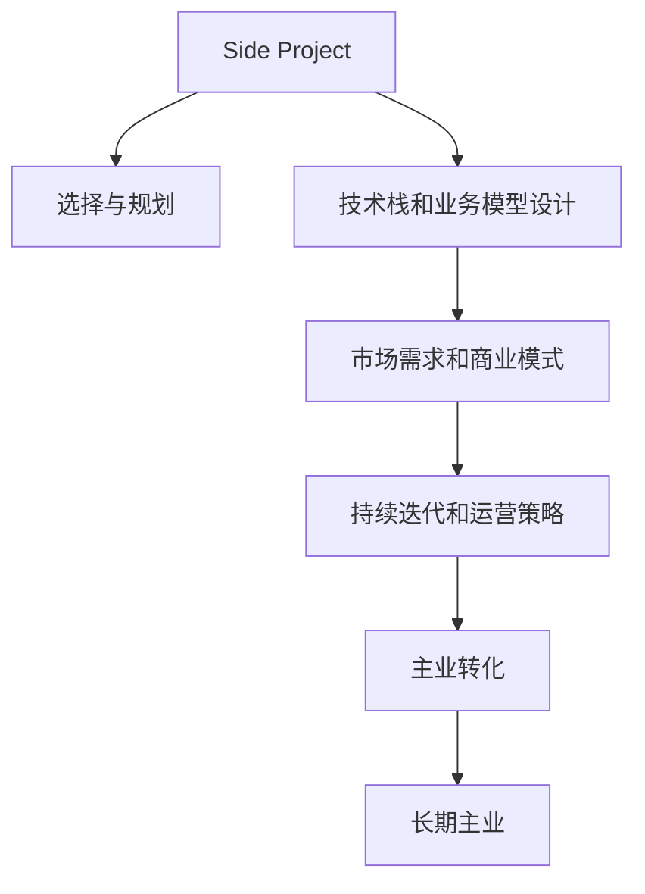

                 

# 如何将Side Project转化为主业

---

## 1. 背景介绍

### 1.1 问题由来
在当今的科技行业，Side Project（副业项目）已经成为了许多程序员和技术人员获取额外收入、探索新领域、提升技术能力的重要途径。然而，许多Side Project难以转化为长久的主业，要么是项目本身的可持续性不足，要么是技术积累未能得到充分利用。

为何将Side Project成功转化为主业，成为了一个值得深入探讨的问题。这不仅关系到个人的职业发展，也涉及到项目的商业化和技术影响力的实现。

### 1.2 问题核心关键点
将Side Project转化为主业的关键在于：
- 项目的选择与规划
- 技术栈和业务模型的设计
- 团队建设和资源分配
- 市场需求和商业模式
- 运营策略和持续迭代

这些问题涉及项目的可持续性、技术的商业应用、商业模式的构建以及市场推广等多个方面，需要全面的考虑和细致的规划。

## 2. 核心概念与联系

### 2.1 核心概念概述

为了更好地理解如何将Side Project转化为长期主业，本节将介绍几个核心概念：

- **Side Project**：指在主业之外的额外技术项目，如个人兴趣项目、技术实验、创业项目等，旨在探索新领域、提升技术能力或创造商业价值。
- **主业转化**：指将Side Project的成功经验和积累，通过有效的商业化和产品化，转化为个人或企业的长期主业。
- **技术栈和业务模型**：技术栈是项目开发中使用的工具、框架和语言的集合，业务模型则描述了项目的商业模式和盈利模式。
- **市场需求和商业模式**：市场需求是指目标客户群体的需求和偏好，商业模式则指项目的盈利方式和价值传递机制。
- **持续迭代和运营策略**：持续迭代是指在市场反馈和数据驱动下，对产品进行不断优化和改进，运营策略则是如何高效地推广、销售和维护产品。

这些核心概念之间的逻辑关系可以通过以下Mermaid流程图来展示：



这个流程图展示了下Side Project转化为长期主业的一般流程：

1. 选择一个有潜力的Side Project。
2. 设计适合的技术栈和业务模型。
3. 确定目标市场和商业模式。
4. 实施持续的迭代和运营策略。
5. 将项目成功转化为长期主业。

## 3. 核心算法原理 & 具体操作步骤

### 3.1 算法原理概述

将Side Project转化为长期主业的过程，本质上是一个系统的产品化和商业化过程。其核心思想是：通过市场需求分析和商业模式设计，合理配置资源，不断迭代优化产品，最终实现从副业到主业的顺利过渡。

形式化地，假设Side Project为 $S$，目标市场为 $M$，商业模式为 $C$，资源为 $R$。转化过程的目标是找到最优的转化策略 $T$，使得：

$$
T = \mathop{\arg\min}_{T} \mathcal{L}(T) \text{ subject to } R \text{ and } M
$$

其中 $\mathcal{L}$ 为转化过程中的总损失函数，$\mathcal{L}$ 包含市场反应、用户满意度、利润最大化等目标，约束条件 $R$ 和 $M$ 分别表示资源的有效配置和目标市场的匹配度。

### 3.2 算法步骤详解

基于上述原理，将Side Project转化为长期主业的一般步骤如下：

**Step 1: 选择与规划**
- 确定项目的核心目标和核心价值，如提升技术能力、探索新领域、创造商业价值等。
- 评估目标市场的潜在需求和竞争状况，确定项目的定位和差异化优势。
- 制定详细的项目规划和时间表，明确关键里程碑和交付物。

**Step 2: 设计技术栈和业务模型**
- 选择适合项目需求的技术栈，包括编程语言、开发框架、数据库等。
- 设计合理的业务模型，明确产品的功能模块、用户流程、数据结构等。
- 建立技术架构，确保系统的高可用性、可扩展性和安全性。

**Step 3: 确定市场需求和商业模式**
- 进行市场调研，获取目标用户需求、偏好和痛点信息。
- 分析市场需求，确定项目的市场定位和目标用户群体。
- 设计符合市场需求的商业模式，如订阅、广告、交易等。

**Step 4: 实施持续迭代和运营策略**
- 建立持续的反馈和迭代机制，快速响应市场变化和用户需求。
- 实施有效的运营策略，如用户获取、产品推广、市场分析等。
- 不断优化产品功能和服务质量，提升用户体验和满意度。

**Step 5: 主业转化**
- 根据市场反馈和技术积累，制定详细的商业化计划。
- 组建专业团队，进行资源整合和配置优化。
- 将Side Project的产品化和市场化，实现从副业到主业的顺利过渡。

### 3.3 算法优缺点

将Side Project转化为长期主业的方法具有以下优点：
1. 加速技术积累：通过主业化项目，可以将技术积累转化为稳定的收入来源，持续投资研发。
2. 提升技术影响力：主业化项目可以获得更广泛的市场关注和行业认可，提升技术影响力和品牌价值。
3. 优化资源配置：通过系统的商业化和产品化，可以更有效地利用资源，提升产出效益。
4. 提升竞争力：持续迭代和优化，使产品在市场中保持竞争力，实现长期发展。

同时，该方法也存在一定的局限性：
1. 高投入风险：从副业到主业的转型可能需要较高的资金和资源投入，存在失败的风险。
2. 市场不确定性：市场需求和竞争环境难以完全预测，可能面临市场变化和用户流失的风险。
3. 技术挑战：大规模的产品化和商业化，可能面临技术上的复杂性和系统稳定性问题。
4. 管理难度：从团队到产品的全面转型，需要更精细的管理和运营策略。

尽管存在这些局限性，但就目前而言，通过系统的商业化和产品化，从Side Project到主业的转化仍是一个有效且可行的途径。未来相关研究的重点在于如何进一步降低转型的风险，提高市场的响应速度和灵活性，同时兼顾技术可持续性和商业目标。

### 3.4 算法应用领域

将Side Project转化为长期主业的方法在多个领域得到了广泛的应用，如：

- 技术创业：通过技术积累和市场需求分析，将Side Project转化为创业项目，构建新的商业实体。
- 个人品牌建设：利用技术特长和市场洞察，开发和推广个人品牌，实现个人价值最大化。
- 企业创新：将Side Project作为企业的技术创新实验，探索新的业务方向和盈利模式。
- 行业应用：在特定行业中，利用Side Project的技术积累，开发并推广定制化解决方案，提升市场竞争力。

除了上述这些经典应用外，将Side Project转化为长期主业的方法还被创新性地应用到更多场景中，如学术研究、公益项目等，为技术创新和社会价值带来了新的发展机遇。

## 4. 数学模型和公式 & 详细讲解 & 举例说明（备注：数学公式请使用latex格式，latex嵌入文中独立段落使用 $$，段落内使用 $)
### 4.1 数学模型构建

本节将使用数学语言对Side Project转化为长期主业的过程进行更加严格的刻画。

记Side Project为 $S$，目标市场为 $M$，商业模式为 $C$，资源为 $R$。假设转化过程中，市场反馈为 $F$，总损失函数为 $\mathcal{L}$，包含市场反应、用户满意度、利润最大化等目标。

定义市场反应为 $F(M) = \mathbb{E}[\text{User Satisfaction}(M)] - \text{Cost}(C, R)$，其中 $\text{User Satisfaction}(M)$ 表示用户满意度，$\text{Cost}(C, R)$ 表示成本。

转化过程的目标是最小化总损失函数 $\mathcal{L}$，即找到最优转化策略 $T$，使得：

$$
T = \mathop{\arg\min}_{T} \mathcal{L}(T) \text{ subject to } R \text{ and } M
$$

在实践中，我们通常使用基于梯度的优化算法（如SGD、Adam等）来近似求解上述最优化问题。设 $\eta$ 为学习率，$\lambda$ 为正则化系数，则参数的更新公式为：

$$
T \leftarrow T - \eta \nabla_{T}\mathcal{L}(T) - \eta\lambda T
$$

其中 $\nabla_{T}\mathcal{L}(T)$ 为损失函数对策略 $T$ 的梯度，可通过反向传播算法高效计算。

### 4.2 公式推导过程

以下我们以技术创业项目为例，推导市场反应的计算公式及其梯度的计算公式。

假设市场反应为 $F(M) = \mathbb{E}[\text{User Satisfaction}(M)] - \text{Cost}(C, R)$，其中 $\text{User Satisfaction}(M)$ 和 $\text{Cost}(C, R)$ 均为 $M$ 的函数。

根据链式法则，市场反应的梯度为：

$$
\frac{\partial F(M)}{\partial M} = \frac{\partial \mathbb{E}[\text{User Satisfaction}(M)]}{\partial M} - \frac{\partial \text{Cost}(C, R)}{\partial M}
$$

其中 $\frac{\partial \text{Cost}(C, R)}{\partial M}$ 表示成本函数对市场的偏导数，可以通过优化算法求解得到。

将 $\frac{\partial F(M)}{\partial M}$ 代入市场反应公式，得：

$$
F(M) = \int_{M_{\min}}^{M_{\max}} \left[ \mathbb{E}[\text{User Satisfaction}(M)] - \text{Cost}(C, R) \right] dM
$$

在得到市场反应的梯度后，即可带入参数更新公式，完成策略的迭代优化。重复上述过程直至收敛，最终得到最优转化策略 $T^*$。

### 4.3 案例分析与讲解

**案例：社交媒体广告平台**

假设我们有一个社交媒体广告平台Side Project，目标是将其转化为长期主业。

**Step 1: 选择与规划**
- 项目核心目标：提升广告效果和用户体验。
- 目标市场：中大型企业用户。
- 项目规划：半年内完成市场调研和功能开发，一年内实现盈利目标。

**Step 2: 设计技术栈和业务模型**
- 技术栈：使用Python、Flask、Redis、MySQL等。
- 业务模型：C2C（用户到用户）广告模式，用户付费购买广告位，平台从中抽成。
- 技术架构：采用微服务架构，保证高可用性和可扩展性。

**Step 3: 确定市场需求和商业模式**
- 市场调研：通过问卷调查、用户访谈等方式获取用户需求。
- 市场需求：企业用户希望提升广告精准度和效果。
- 商业模式：采用订阅和广告两种模式，按使用量收费。

**Step 4: 实施持续迭代和运营策略**
- 用户获取：通过社交媒体推广，吸引潜在用户。
- 产品推广：利用SEO和社交媒体营销提升曝光率。
- 市场分析：通过数据分析，调整广告投放策略。

**Step 5: 主业转化**
- 组建专业团队：招募市场营销、产品开发、运维等人员。
- 资源整合：整合资金、技术、人力等资源，进行全面的商业化运营。
- 产品化和市场化：实现广告投放、数据分析、用户管理等功能，并推广到市场中。

最终，该社交媒体广告平台成功从Side Project转化为长期主业，实现了持续稳定的收入，并提升了广告效果和用户体验。

## 5. 项目实践：代码实例和详细解释说明
### 5.1 开发环境搭建

在进行Side Project转化为主业的实践前，我们需要准备好开发环境。以下是使用Python进行Django开发的环境配置流程：

1. 安装Anaconda：从官网下载并安装Anaconda，用于创建独立的Python环境。

2. 创建并激活虚拟环境：
```bash
conda create -n django-env python=3.8 
conda activate django-env
```

3. 安装Django：从官网获取对应的安装命令。例如：
```bash
pip install django==3.2
```

4. 安装必要的第三方库：
```bash
pip install djangorestframework django-cors-headers
```

5. 初始化Django项目：
```bash
django-admin startproject myproject
```

6. 创建Django应用：
```bash
cd myproject
django-admin startapp myapp
```

完成上述步骤后，即可在`django-env`环境中开始Side Project转化为主业的开发实践。

### 5.2 源代码详细实现

下面我们以社交媒体广告平台为例，给出使用Django开发项目的PyTorch代码实现。

首先，定义广告平台的数据模型：

```python
from django.db import models

class Ad(models.Model):
    title = models.CharField(max_length=200)
    description = models.TextField()
    created_at = models.DateTimeField(auto_now_add=True)
    expired_at = models.DateTimeField()
    price = models.DecimalField(max_digits=10, decimal_places=2)
```

然后，定义广告投放的前端接口：

```python
from django.http import JsonResponse
from django.views.decorators.csrf import csrf_exempt

@csrf_exempt
def create_ad(request):
    if request.method == 'POST':
        data = request.POST
        title = data['title']
        description = data['description']
        price = data['price']
        ad = Ad(title=title, description=description, price=price)
        ad.save()
        return JsonResponse({'success': True})
    else:
        return JsonResponse({'success': False})
```

接着，定义广告投放的视图和模板：

```python
from django.shortcuts import render

def ad_list(request):
    ads = Ad.objects.all().order_by('-created_at')
    return render(request, 'ad_list.html', {'ads': ads})
```

最后，启动广告平台的后端服务，并编写广告投放的前端页面：

```html
<!-- ad_list.html -->



    <h1>Ad List</h1>
    <ul>
        
            <li>{{ ad.title }} - {{ ad.price }}/day</li>
        
    </ul>

```

### 5.3 代码解读与分析

让我们再详细解读一下关键代码的实现细节：

**Ad类**：
- 定义广告平台的数据模型，包括广告的标题、描述、创建时间、过期时间和价格。

**create_ad函数**：
- 处理广告投放请求，将请求数据保存到数据库中，并返回JSON响应。

**ad_list函数**：
- 查询数据库中的广告记录，并按照创建时间降序排列，渲染到模板中显示。

**ad_list.html**：
- 使用模板语法，将广告列表渲染到页面上。

可以看到，通过Django框架，我们可以快速搭建一个功能完整的社交媒体广告平台，并在此基础上进行持续迭代和优化，最终实现Side Project向主业的顺利过渡。

## 6. 实际应用场景

### 6.1 社交媒体广告平台

社交媒体广告平台是一个典型的将Side Project转化为长期主业的项目。传统广告投放依赖于人工策划和执行，成本高、效率低，难以快速响应市场需求。利用Side Project的技术积累，开发并推广社交媒体广告平台，可以大幅提升广告投放的精准度和效果。

在技术实现上，可以收集目标用户的兴趣、行为数据，构建广告投放算法，自动匹配合适的广告位，并实时反馈广告效果，优化广告投放策略。如此构建的社交媒体广告平台，能大幅提升广告主的市场竞争力，并带来稳定的收入。

### 6.2 智能推荐系统

智能推荐系统也是一个成功的Side Project转化案例。推荐系统最初可能只是一个简单的算法原型或数据探索工具，但通过不断的优化和迭代，可以逐步实现大规模部署和商业化。

在技术实现上，可以构建推荐模型，利用用户的浏览、点击、评分等数据，实时生成个性化推荐结果，并提供用户界面展示。随着用户数据的积累和算法的优化，推荐系统的推荐效果和用户满意度逐步提升，最终成为企业不可或缺的商业资产。

### 6.3 在线教育平台

在线教育平台是另一个典型的Side Project转化案例。早期可能只是一个博客或视频分享平台，通过提供高质量的课程和内容，逐步吸引用户并积累粉丝。

在技术实现上，可以构建课程平台，提供在线视频课程、习题、测验等功能，并支持社区交流和互动。随着用户数量的增长和内容的丰富，平台的影响力和用户粘性逐步增强，最终成为知名的在线教育品牌。

### 6.4 未来应用展望

随着Side Project向主业的不断转化，未来的应用场景将更加广泛和多样。

在智慧医疗领域，通过技术积累和市场需求分析，可以开发并推广智慧医疗平台，实现远程诊断、健康管理等功能，提升医疗服务的智能化水平。

在智能交通领域，利用交通数据的积累和算法优化，可以开发智能交通管理系统，提高道路通行效率和交通安全。

在智慧金融领域，结合金融数据的分析和挖掘，可以开发智能投顾和风险控制系统，为投资者提供专业的理财建议和风险预警。

此外，在教育、娱乐、能源等众多领域，Side Project向主业的转化也将带来新的发展机遇。相信随着技术的不断进步和市场需求的不断变化，Side Project向主业的转化将变得更加普遍和高效。

## 7. 工具和资源推荐

### 7.1 学习资源推荐

为了帮助开发者系统掌握Side Project转化为主业的理论基础和实践技巧，这里推荐一些优质的学习资源：

1. **Django官方文档**：Django官方文档提供了全面的框架介绍和实践指南，是学习Django开发的最佳资源。

2. **《Web开发实战》系列书籍**：由Django社区资深开发者撰写，详细介绍了Web开发的各个环节，包括前后端开发、数据库设计、安全性等。

3. **Coursera《Web开发与设计》课程**：由斯坦福大学开设的Web开发课程，涵盖了前端和后端开发的各个方面，适合全面学习。

4. **《机器学习实战》书籍**：介绍了机器学习和深度学习的基本概念和算法实现，适合了解数据驱动的业务发展。

5. **Kaggle数据竞赛平台**：通过参加数据竞赛，可以锻炼数据处理和模型优化能力，提升实践经验。

通过对这些资源的学习实践，相信你一定能够快速掌握Side Project转化为长期主业的方法，并用于解决实际的业务问题。

### 7.2 开发工具推荐

高效的开发离不开优秀的工具支持。以下是几款用于Side Project转化为主业开发的常用工具：

1. **Django**：Django是一个流行的Python Web框架，适合构建高效、稳定的Web应用。

2. **Jupyter Notebook**：Jupyter Notebook是一个交互式开发环境，适合进行数据探索、算法实验和原型开发。

3. **Git和GitHub**：Git是一个版本控制系统，GitHub是一个代码托管平台，适合协作开发和代码版本管理。

4. **AWS和Google Cloud**：AWS和Google Cloud是流行的云服务平台，支持高效部署和资源管理，适合大规模应用。

5. **Docker和Kubernetes**：Docker是一个容器化平台，Kubernetes是一个容器编排系统，适合自动化和持续集成。

合理利用这些工具，可以显著提升Side Project向主业转化的开发效率，加快创新迭代的步伐。

### 7.3 相关论文推荐

Side Project向主业的转化源于学界的持续研究。以下是几篇奠基性的相关论文，推荐阅读：

1. **《从开源到商业：开源社区到商业项目的演变研究》**：分析了开源项目向商业项目的转化过程和关键因素。

2. **《技术创业成功因素：来自硅谷的案例分析》**：研究了技术创业的成功因素和失败原因，提供了实用的指导建议。

3. **《持续创新：数字化转型与技术驱动的商业成功》**：探讨了持续创新在数字化转型中的重要作用，以及如何通过技术驱动实现商业成功。

4. **《开放式创新：跨界合作与颠覆性创新》**：介绍了开放式创新的方法和策略，以及如何通过跨界合作实现技术突破和商业化。

这些论文代表了大语言模型向主业转化的发展脉络。通过学习这些前沿成果，可以帮助研究者把握学科前进方向，激发更多的创新灵感。

## 8. 总结：未来发展趋势与挑战

### 8.1 总结

本文对Side Project向主业的转化方法进行了全面系统的介绍。首先阐述了Side Project的潜在价值和转化为长期主业的意义，明确了转化的关键步骤和策略。其次，从原理到实践，详细讲解了Side Project转化的数学原理和关键步骤，给出了转化的完整代码实例。同时，本文还广泛探讨了Side Project在多个行业领域的应用前景，展示了转化的广泛适用性和深远影响。此外，本文精选了转化的各类学习资源，力求为读者提供全方位的技术指引。

通过本文的系统梳理，可以看到，将Side Project成功转化为长期主业，需要系统的规划和持续的迭代优化。尽管存在一定的挑战，但通过系统的市场调研、业务模型设计和持续运营，一定可以打造出成功的商业应用。未来，随着技术的不断进步和市场需求的不断变化，Side Project向主业的转化将变得更加普遍和高效。

### 8.2 未来发展趋势

展望未来，Side Project向主业的转化将呈现以下几个发展趋势：

1. **技术创新和业务融合**：技术积累和市场需求将进一步融合，驱动更多新兴业务的涌现，如智能交通、智慧医疗等。

2. **数据驱动和智能决策**：通过数据分析和机器学习，提升决策的准确性和效率，实现智能业务运营。

3. **持续迭代和快速响应**：市场变化和技术进步要求业务模式不断迭代，快速响应市场需求和用户反馈。

4. **全球化和本地化**：全球化的市场需求和本地化的运营策略相结合，提升业务的国际竞争力和本地适应性。

5. **可持续发展和社会责任**：实现业务的可持续发展，并承担社会责任，提升品牌价值和用户信任度。

以上趋势凸显了Side Project向主业转化的广阔前景。这些方向的探索发展，将进一步提升业务的智能化水平和市场竞争力，为技术创新和商业应用带来新的发展机遇。

### 8.3 面临的挑战

尽管Side Project向主业的转化已经取得了显著成果，但在迈向更加智能化、普适化应用的过程中，仍面临诸多挑战：

1. **高投入风险**：从Side Project到主业的转型可能需要较高的资金和资源投入，存在失败的风险。

2. **市场不确定性**：市场需求和竞争环境难以完全预测，可能面临市场变化和用户流失的风险。

3. **技术复杂性**：大规模的产品化和商业化，可能面临技术上的复杂性和系统稳定性问题。

4. **管理难度**：从团队到产品的全面转型，需要更精细的管理和运营策略。

尽管存在这些挑战，但通过系统的商业化和产品化，从Side Project到主业的转化仍是一个有效且可行的途径。未来相关研究的重点在于如何进一步降低转型的风险，提高市场的响应速度和灵活性，同时兼顾技术可持续性和商业目标。

### 8.4 研究展望

面对Side Project向主业转化的挑战，未来的研究需要在以下几个方面寻求新的突破：

1. **数据驱动和智能决策**：通过大数据分析和机器学习，提升决策的准确性和效率，实现智能业务运营。

2. **持续迭代和快速响应**：市场变化和技术进步要求业务模式不断迭代，快速响应市场需求和用户反馈。

3. **技术创新和业务融合**：技术积累和市场需求将进一步融合，驱动更多新兴业务的涌现，如智能交通、智慧医疗等。

4. **数据驱动和智能决策**：通过数据分析和机器学习，提升决策的准确性和效率，实现智能业务运营。

5. **全球化和本地化**：全球化的市场需求和本地化的运营策略相结合，提升业务的国际竞争力和本地适应性。

6. **持续迭代和快速响应**：市场变化和技术进步要求业务模式不断迭代，快速响应市场需求和用户反馈。

这些研究方向的探索，将引领Side Project向主业的转化技术迈向更高的台阶，为构建更加智能化、普适化的业务提供坚实的基础。

## 9. 附录：常见问题与解答

**Q1：如何将Side Project转化为长期主业？**

A: 将Side Project转化为长期主业需要系统的规划和持续的迭代优化。以下是几个关键步骤：
1. 确定项目核心目标和核心价值。
2. 评估目标市场的潜在需求和竞争状况。
3. 设计合理的技术栈和业务模型。
4. 实施持续迭代和运营策略。
5. 根据市场反馈和技术积累，制定详细的商业化计划。

**Q2：Side Project转化为长期主业需要哪些关键资源？**

A: 将Side Project转化为长期主业需要以下几个关键资源：
1. 资金支持：确保项目有足够的资金支持，持续投入研发和市场推广。
2. 技术人才：招募专业团队，进行技术开发和产品优化。
3. 市场数据：收集和分析目标市场的数据，指导业务决策和产品优化。
4. 营销渠道：建立有效的营销渠道，提升产品曝光率和用户获取量。
5. 用户反馈：积极收集用户反馈，优化产品功能和用户体验。

**Q3：Side Project转化为长期主业的关键在于什么？**

A: 将Side Project转化为长期主业的关键在于：
1. 明确项目定位和目标用户群体。
2. 设计合理的技术栈和业务模型。
3. 实施持续的反馈和迭代机制。
4. 制定详细的商业化计划。
5. 组建专业团队，进行资源整合和配置优化。

这些关键因素共同决定了Side Project能否顺利转化为长期主业，并在市场中取得成功。

---

作者：禅与计算机程序设计艺术 / Zen and the Art of Computer Programming

