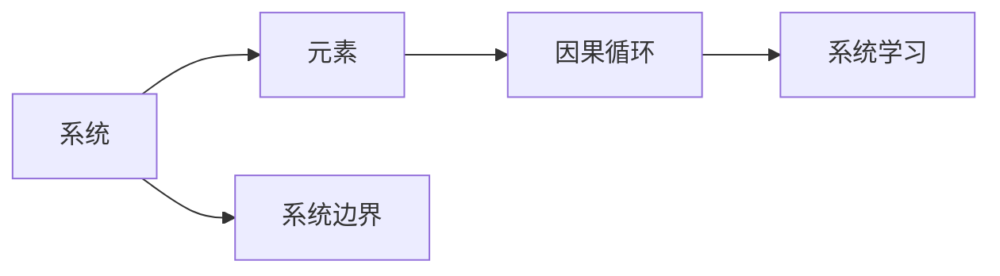

                 

## 1. 背景介绍

在快速变化、复杂多变的环境下，企业需要不断地调整其策略以适应市场变化。系统思考（Systems Thinking），作为一种全面的、整体性的管理方法，能够帮助企业及其管理团队理解系统中各要素间的相互关系和影响，从而提高组织在复杂环境下的适应力和竞争力。本文将深入探讨如何系统思考应用于团队管理，并通过一系列的案例分析，详细阐述其应用价值和具体操作方法。

## 2. 核心概念与联系

### 2.1 核心概念概述

系统思考（Systems Thinking）是一种整体的、动态的、系统的思考方式，它关注系统内部各元素间的相互关联和作用，旨在通过改变系统中部分元素的行为来优化整体系统的表现。其主要概念包括：

- **系统：** 由相互关联的元素组成的整体，具有复杂性、动态性和目的性。
- **因果循环：** 系统中因果关系的网络，可能形成正反馈或负反馈循环。
- **系统边界：** 系统与其他环境之间的界限，决定了系统的内部行为与外部互动。
- **系统学习：** 通过不断调整系统结构和行为，以增强系统的适应性和生存能力。

### 2.2 核心概念原理和架构的 Mermaid 流程图



这个简单的流程图展示了系统思考的核心概念，系统由元素组成，元素间通过因果循环相互作用，而系统与外部环境通过边界进行交互，最终系统通过学习不断进化。

### 2.3 核心概念联系

- **系统与元素**：系统由各种元素组成，元素是构成系统的基本单位。
- **因果循环与系统行为**：因果循环决定了元素间的相互作用，影响系统的整体行为。
- **系统边界与环境**：系统边界决定了系统与环境的互动方式，影响系统的适应性。
- **系统学习与进化**：系统通过不断的学习，优化其结构和行为，以提高适应性和生存能力。

这些概念彼此关联，共同构成了系统思考的理论基础。

## 3. 核心算法原理 & 具体操作步骤

### 3.1 算法原理概述

系统思考在团队管理中的应用，主要体现在以下几个方面：

- **系统视角：** 采用系统的观点看待团队，识别团队内部各要素间的关系和影响。
- **因果识别：** 识别团队中的因果循环，分析其对团队表现的影响。
- **边界调整：** 根据外部环境和团队需求，调整团队与外部环境的互动方式。
- **学习促进：** 通过系统学习，持续改进团队结构和运作方式，提升团队适应性和效率。

### 3.2 算法步骤详解

1. **系统视角：** 从系统的角度审视团队，识别团队中的主要元素及其关系。可以通过问卷调查、访谈等方式收集信息，构建团队系统的模型。
   
2. **因果识别：** 分析团队中各元素间的因果关系，识别正反馈和负反馈循环。可以使用因果图、鱼骨图等工具辅助分析。
   
3. **边界调整：** 根据外部环境的变化，调整团队与外部环境的互动方式。例如，根据市场需求调整团队任务和目标。
   
4. **学习促进：** 通过持续的反思和改进，提升团队的系统学习能力。例如，定期举行回顾会议，总结经验教训。

### 3.3 算法优缺点

**优点：**

- **全面性：** 系统思考提供了一种整体性的方法，能够全面考察团队中的各种要素和关系。
- **适应性：** 通过调整系统的边界和元素，系统能够更好地适应外部环境的变化。
- **持续改进：** 系统思考强调持续的学习和改进，能够不断优化团队运作方式。

**缺点：**

- **复杂性：** 系统思考涉及多个维度，需要复杂的分析和建模。
- **技术要求：** 需要一定的理论和技术基础，才能有效应用系统思考方法。
- **实施难度：** 实施系统思考需要投入较多时间和资源，短期内难以看到显著效果。

### 3.4 算法应用领域

系统思考在团队管理中的应用领域包括但不限于：

- **团队结构优化：** 通过系统视角识别团队中的主要元素及其关系，优化团队结构。
- **任务分配和目标设定：** 识别团队中的因果循环，调整任务分配和目标设定，提高团队效率。
- **团队沟通与协作：** 调整团队边界，促进团队内部和外部的沟通与协作。
- **团队学习和改进：** 通过系统学习，持续改进团队运作方式，提升团队适应性和生存能力。

## 4. 数学模型和公式 & 详细讲解 & 举例说明

### 4.1 数学模型构建

在系统思考中，可以使用以下数学模型来描述系统的结构和行为：

- **系统动力学模型（System Dynamics Model）**：使用微分方程和差分方程来描述系统动态变化。
- **因果图模型（Causal Loop Diagram, CLD）**：通过节点和连线表示系统中的因果关系。

### 4.2 公式推导过程

以因果图模型为例，其基本的组成部分包括：

- **节点（Nodes）**：代表系统中的元素或变量。
- **连线（Links）**：表示元素之间的因果关系。

下面是一个简单的因果图示例：

```plaintext
                              需求增长
                               |
             价格上升         |
               |               |
             减产            减产
               |             |
     新产品开发      加大投资
               |             |
             增产            增产
               |             |
         产量提升         产量提升
               |             |
         销售增长         销售增长
```

这个因果图表示了市场需求增长导致价格上升，进而引起减产和新产品开发，最终导致产量和销售增长。

### 4.3 案例分析与讲解

**案例：敏捷开发团队**

某敏捷开发团队在实施敏捷开发过程中，发现团队的工作效率低下，项目延期频繁。通过系统思考，团队成员发现以下因果循环：

- **任务过多**：由于每个迭代的任务量增加，导致团队成员的工作负荷过重。
- **疲劳和压力**：高负荷工作导致团队成员疲劳和压力增加。
- **质量下降**：疲劳和压力导致代码质量和代码审查质量下降。
- **返工增加**：低质量代码导致后期返工增加。
- **客户不满**：返工和项目延期导致客户不满。

通过调整任务量、改善工作环境、引入自动化测试等措施，团队最终成功提升了工作效率和客户满意度。

## 5. 项目实践：代码实例和详细解释说明

### 5.1 开发环境搭建

为了实现系统思考的模型构建和分析，需要搭建如下开发环境：

1. **安装 Python 和相关库**：
```bash
pip install pandas numpy matplotlib
```

2. **安装 Python 可视化库**：
```bash
pip install plotly
```

3. **创建 Python 开发环境**：
```bash
conda create -n system_thinking python=3.8
conda activate system_thinking
```

4. **安装 System Dynamics Model 库**：
```bash
pip install pyodes
```

### 5.2 源代码详细实现

以下是一个简单的 Python 代码示例，用于构建和分析因果图模型：

```python
import pyodes as pyo
from pyodes import system_dynamics_model as SDM

# 定义因果图
graph = SDM.CausalGraph()
graph.add_node('需求增长')
graph.add_node('价格上升')
graph.add_node('减产')
graph.add_node('新产品开发')
graph.add_node('增产')
graph.add_node('产量提升')
graph.add_node('销售增长')
graph.add_edge('需求增长', '价格上升')
graph.add_edge('价格上升', '减产')
graph.add_edge('减产', '新产品开发')
graph.add_edge('新产品开发', '增产')
graph.add_edge('增产', '产量提升')
graph.add_edge('产量提升', '销售增长')

# 构建系统动力学模型
model = SDM.SystemDynamicsModel(graph)

# 运行模型仿真
model.run_simulation(start_time=0, end_time=100, initial_values={'需求增长': 100})

# 输出仿真结果
print(model.simulation_results)
```

### 5.3 代码解读与分析

1. **导入库**：使用 `pyodes` 库构建和分析因果图模型。
2. **定义因果图**：通过 `SDM.CausalGraph` 类定义系统的因果图，并添加节点和连线。
3. **构建系统动力学模型**：使用 `SDM.SystemDynamicsModel` 类构建系统动力学模型。
4. **运行仿真**：使用 `run_simulation` 方法运行仿真，指定仿真时间和初始值。
5. **输出结果**：使用 `simulation_results` 属性获取仿真结果。

### 5.4 运行结果展示

运行上述代码后，将输出仿真结果，显示系统各节点的变化情况。

## 6. 实际应用场景

### 6.1 团队结构优化

某公司发现其销售团队在面对市场变化时反应迟缓，难以快速调整策略。通过系统思考，公司管理人员识别出以下因果循环：

- **市场变化**：市场环境的变化导致原有销售策略失效。
- **销售策略滞后**：由于销售策略更新不及时，导致销售业绩下降。
- **团队结构不合理**：销售团队结构不合理，难以快速响应市场变化。
- **培训不足**：销售团队缺乏必要的市场洞察和策略更新培训。
- **管理不善**：管理层对市场变化反应不及时，导致整体策略滞后。

通过调整销售团队结构、加强市场洞察培训、优化管理流程等措施，公司成功提高了销售团队的快速响应能力和市场竞争力。

### 6.2 任务分配和目标设定

某软件开发团队在开发新项目时，发现任务分配不合理，导致开发进度严重滞后。通过系统思考，团队识别出以下因果循环：

- **任务过多**：新项目任务量过大，导致开发时间不足。
- **任务优先级混乱**：任务优先级未明确，导致开发人员在重要任务上投入不足。
- **沟通不畅**：团队内部沟通不畅，导致任务分配不均衡。
- **资源浪费**：由于任务分配不合理，导致资源浪费。
- **项目延期**：任务延误导致项目延期。

通过重新评估任务优先级、加强团队沟通、优化资源分配等措施，团队最终提高了开发效率和项目进度。

### 6.3 团队沟通与协作

某跨国企业面临团队沟通和协作方面的挑战，团队成员之间的信息交流不畅，导致项目进度受阻。通过系统思考，企业识别出以下因果循环：

- **信息孤岛**：各部门之间信息孤岛现象严重，导致沟通不畅。
- **缺乏协作机制**：缺乏有效的协作机制，导致团队协作效率低下。
- **责任不清**：责任不清导致任务推诿现象严重。
- **反馈机制缺失**：缺乏反馈机制，导致问题难以及时解决。
- **文化差异**：不同国家文化差异导致沟通障碍。

通过建立协作机制、加强信息共享、明确责任等措施，企业成功改善了团队沟通和协作效率，提升了项目成功率。

## 7. 工具和资源推荐

### 7.1 学习资源推荐

1. **系统思考入门书籍**：
   - 《系统思考：迈向思维革命的新范式》：作者：彼得·圣吉（Peter Senge），详细介绍了系统思考的原理和应用。
   - 《系统思考与创新》：作者：戴维·西蒙斯（David J. Western），介绍了系统思考在创新管理中的应用。

2. **在线课程**：
   - Coursera上的《系统思考》课程，由耶鲁大学提供。
   - edX上的《系统思考基础》课程，由达特茅斯学院提供。

3. **培训和研讨会**：
   - 参加系统思考的培训和研讨会，如国际系统动力学协会（ISDA）主办的会议。

### 7.2 开发工具推荐

1. **系统动力学建模工具**：
   - AnyLogic：用于构建和仿真系统动力学模型的商业软件。
   - Vensim：用于构建和仿真系统动力学模型的开源软件。

2. **可视化工具**：
   - Plotly：用于数据可视化和互动式图表的Python库。
   - Tableau：用于数据可视化的商业软件。

### 7.3 相关论文推荐

1. **系统动力学模型**：
   - 《系统动力学：建模与仿真》（System Dynamics: Modeling for Organizations）：作者：约翰·戈登（John W. Gordon），详细介绍了系统动力学模型在组织管理中的应用。

2. **因果图模型**：
   - 《Causal Loop Diagrams in the Study of Organizational Behavior》：作者：戴维·西蒙斯（David J. Western），介绍了因果图模型在组织行为研究中的应用。

## 8. 总结：未来发展趋势与挑战

### 8.1 研究成果总结

系统思考在团队管理中的应用，已经被证明是一种有效的管理方法。通过系统视角、因果识别、边界调整和学习促进，团队能够更好地理解系统行为，提升管理效率和效果。

### 8.2 未来发展趋势

未来，系统思考在团队管理中的应用将更加广泛和深入：

1. **智能化**：通过引入人工智能技术，自动分析系统动态变化，优化系统结构和行为。
2. **自适应**：系统能够根据外部环境的变化，自动调整系统结构和行为，提高适应性。
3. **协同化**：通过协同工作平台，促进团队成员间的协作和信息共享。

### 8.3 面临的挑战

尽管系统思考在团队管理中有诸多优势，但实施过程中仍面临一些挑战：

1. **复杂性**：系统思考涉及多个维度，需要复杂的分析和建模。
2. **技术要求**：需要一定的理论和技术基础，才能有效应用系统思考方法。
3. **实施难度**：实施系统思考需要投入较多时间和资源，短期内难以看到显著效果。

### 8.4 研究展望

未来的研究方向可能包括：

1. **算法优化**：开发更高效的系统动力学模型和因果图模型，优化计算和分析过程。
2. **跨领域应用**：系统思考在更多领域的应用，如医疗、制造、金融等。
3. **人机协同**：系统思考与人机协同技术结合，提升团队管理效率和效果。

## 9. 附录：常见问题与解答

### Q1：如何构建系统的因果图？

A：构建因果图需要明确系统中的元素和因果关系。可以从系统的核心目标开始，逐步识别影响因素，构建因果图。可以使用因果图工具如CausalImpact等辅助构建。

### Q2：系统思考是否适用于所有团队？

A：系统思考适用于具有复杂结构和动态行为的团队。对于简单的任务和团队，可能不需要采用系统思考方法。

### Q3：系统思考如何与敏捷开发结合？

A：系统思考可以在敏捷开发中作为团队自我反思和持续改进的工具。例如，团队可以定期进行回顾会议，识别因果循环，优化团队结构和运作方式。

### Q4：系统思考在哪些领域有应用案例？

A：系统思考在多个领域有应用案例，包括但不限于：
- 制造业：通过优化生产流程，提高生产效率。
- 医疗领域：通过优化患者治疗路径，提高治疗效果。
- 金融领域：通过优化风险管理，提高投资回报率。

通过系统思考的应用，这些领域的企业和组织都能获得显著的管理提升和效益改善。

---

作者：禅与计算机程序设计艺术 / Zen and the Art of Computer Programming

