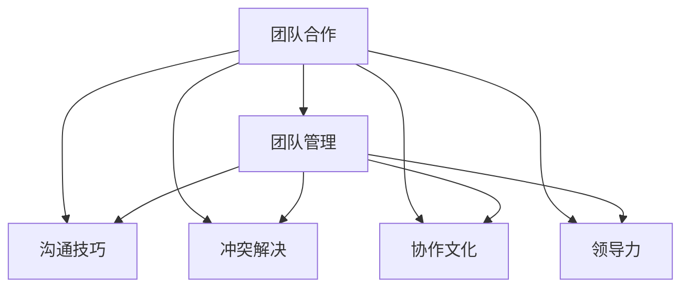

                 

# 如何进行团队合作：如何与团队成员有效合作？

> 关键词：团队合作,团队管理,沟通技巧,冲突解决,协作文化,领导力

## 1. 背景介绍

### 1.1 问题由来

随着技术的发展和企业的壮大，团队合作已经成为现代项目管理中不可或缺的一部分。在数字化时代，跨部门、跨地域、跨文化的团队协作变得越来越频繁和复杂。然而，团队合作也面临着诸多挑战，包括沟通不畅、目标不一致、冲突频发等问题。如何有效提升团队合作的效率和质量，成为了项目管理中一个重要的课题。

### 1.2 问题核心关键点

团队合作的核心在于如何构建一个高效的团队协作体系，包括明确的目标、清晰的沟通、有效的任务分配、合理的资源管理、及时的反馈与调整等。在实际工作中，团队合作的效果往往取决于以下几个关键点：

- 团队成员之间的沟通与协作。高效的团队需要保持良好的沟通，及时共享信息和反馈。
- 团队目标与个人目标的一致性。团队成员需要明确共同的目标，并在此基础上协调各自的行动。
- 团队中的领导与成员之间的互动。团队领导需要提供正确的方向和资源支持，而团队成员则需要积极主动地参与和贡献。
- 团队冲突的解决。面对团队中的不同意见和冲突，需要建立有效的解决机制和流程。
- 团队文化的建设。一个积极、开放、包容的团队文化可以大大提高团队合作的效率和满意度。

本文将围绕上述关键点，深入探讨如何进行团队合作，如何与团队成员有效合作，希望能为项目管理者和团队成员提供一些有价值的参考和建议。

## 2. 核心概念与联系

### 2.1 核心概念概述

为更好地理解如何进行团队合作，本节将介绍几个密切相关的核心概念：

- 团队合作(Team Collaboration)：指团队成员之间通过协作，共同完成项目目标的过程。
- 团队管理(Team Management)：指通过有效的组织和协调，实现团队成员之间的有效合作。
- 沟通技巧(Communication Skills)：指在团队合作中，如何进行有效的信息传递和反馈。
- 冲突解决(Conflict Resolution)：指在团队中遇到不同意见或争议时，如何有效解决。
- 协作文化(Collaborative Culture)：指团队内部形成的合作、共享、支持的价值观和行为规范。
- 领导力(Leadership)：指在团队合作中，如何引导和激励团队成员共同达成目标。

这些概念之间的逻辑关系可以通过以下Mermaid流程图来展示：



这个流程图展示了一支高效的团队合作，从沟通、冲突解决、文化建设到领导力，各个环节密不可分，共同构成了团队合作的核心要素。

## 3. 核心算法原理 & 具体操作步骤
### 3.1 算法原理概述

团队合作的算法原理可以从以下几个方面来理解：

- 目标一致性(Consensus Alignment)：确保团队成员对项目目标有共同的理解和承诺。
- 沟通机制(Communication Mechanisms)：建立有效的沟通渠道和反馈机制，促进信息共享和决策透明。
- 任务分配(Task Assignment)：根据成员的技能和资源，合理分配任务，实现高效的资源利用。
- 冲突管理(Conflict Management)：制定明确的冲突解决流程和策略，及时解决团队中的分歧和争议。
- 文化建设(Culture Building)：通过培训、活动和日常管理，营造积极的团队文化。
- 领导支持(Leadership Support)：团队领导提供明确的方向和资源支持，引导团队成员实现共同目标。

这些原理相互依存，共同构成了一个高效的团队合作系统。

### 3.2 算法步骤详解

一个高效的团队合作系统通常需要经历以下几个关键步骤：

**Step 1: 确定项目目标和范围**
- 明确项目的愿景和目标，确保所有团队成员对项目的意义和方向有清晰的认识。
- 确定项目的范围和关键成果，确保项目任务的合理性和可行性。

**Step 2: 组建团队和分配任务**
- 根据项目需求，组建多元化的团队，确保每个成员都能发挥其专业技能。
- 明确每个成员的职责和任务，避免重复和遗漏。

**Step 3: 建立沟通机制**
- 确定团队的沟通渠道和频率，如每日站会、周报等，确保信息及时传递。
- 制定沟通规范和反馈机制，如问题报告、反馈表单等，促进团队成员之间的互动。

**Step 4: 制定冲突解决策略**
- 建立明确的冲突解决流程，如协商、调解、仲裁等，及时解决团队中的分歧和争议。
- 提供培训和资源支持，提高团队成员的冲突解决能力。

**Step 5: 营造协作文化**
- 通过团队建设活动、表彰奖励、日常管理等方式，营造积极的团队文化。
- 鼓励知识共享和协作，促进团队成员之间的相互支持和合作。

**Step 6: 提供领导支持**
- 团队领导应提供明确的方向和资源支持，确保项目顺利推进。
- 关注团队成员的成长和福利，建立互信和支持的关系。

### 3.3 算法优缺点

团队合作的算法具有以下优点：
1. 提高效率。通过明确的沟通和任务分配，可以避免重复劳动和资源浪费，提高项目执行效率。
2. 增强协作。团队合作促进了成员之间的互动和信息共享，增强了团队的凝聚力和协作能力。
3. 提升质量。多方面的协同工作可以提升项目成果的质量，减少错误和遗漏。
4. 促进创新。多样化的团队成员带来了不同的视角和经验，有助于创新和问题的解决。

同时，该算法也存在一定的局限性：
1. 协调成本高。在复杂项目中，协调团队成员之间的协作可能耗时耗力。
2. 沟通障碍。成员之间沟通不畅、信息不对称可能导致误解和冲突。
3. 领导依赖。团队合作的效果高度依赖于领导的引导和支持，领导不当可能导致团队分裂。
4. 文化差异。不同成员的文化背景和价值观可能带来合作中的冲突。

尽管存在这些局限性，但通过科学的规划和执行，团队合作仍然是一种高效的项目管理方法，能够提升团队项目的成功率和成员的满意度。

### 3.4 算法应用领域

团队合作的算法原理和操作步骤在多个领域得到了广泛的应用，例如：

- 软件开发：软件开发项目通常涉及多个团队成员的协作，团队合作是确保项目按时完成的关键。
- 市场营销：市场团队的协作有助于信息共享、策略一致和客户反馈的及时处理。
- 产品管理：产品团队的多元协作可以确保产品的市场定位、功能和用户体验的一致性。
- 教育培训：教育团队成员之间的协作可以提升课程设计、教学方法和学生反馈的质量。
- 医疗健康：医疗团队成员之间的协作可以提升诊断的准确性、治疗的连续性和患者的满意度。

除了上述这些常见领域，团队合作还可以应用于更多场景中，如城市规划、环境保护、社会治理等，为跨领域、跨学科的合作提供新的模式。

## 4. 数学模型和公式 & 详细讲解 & 举例说明
### 4.1 数学模型构建

团队合作的数学模型可以从以下几个方面来构建：

- 目标函数(Objective Function)：定义团队合作的最终目标，如项目按时完成、预算控制在一定范围内等。
- 约束条件(Constraints)：定义项目的范围、时间、资源等限制条件，确保项目目标的实现。
- 优化目标(Optimization Objective)：通过优化算法，在约束条件下最大化目标函数。

一个简单的数学模型可以表示为：

$$
\min_{x} f(x) \quad \text{subject to} \quad g_i(x) \leq 0, i = 1, ..., m
$$

其中，$f(x)$ 为目标函数，$g_i(x)$ 为约束条件。

### 4.2 公式推导过程

在实际应用中，可以使用优化算法（如线性规划、整数规划等）求解上述数学模型。例如，线性规划模型可以表示为：

$$
\min_{x} c^T x \quad \text{subject to} \quad A x = b, \quad x \geq 0
$$

其中，$c$ 为权向量，$A$ 为约束矩阵，$b$ 为约束向量，$x$ 为决策变量。

使用拉格朗日乘数法求解上述模型，可以得到最优解为：

$$
x = \arg \min_{x} L(x, \lambda) = c^T x + \lambda^T (b - Ax)
$$

其中，$\lambda$ 为拉格朗日乘数向量，$L(x, \lambda)$ 为拉格朗日函数。

### 4.3 案例分析与讲解

以软件开发项目为例，我们可以将问题表示为线性规划模型：

- 目标函数：最小化项目完成时间。
- 约束条件：确保每个任务按时完成，资源（如人力、设备）不超支。

具体来说，可以将任务表示为向量$x$，项目完成时间表示为目标函数$f(x)$，任务完成时间和资源约束表示为约束条件$g_i(x)$。通过优化算法求解，可以找到最优的任务分配方案。

## 5. 项目实践：代码实例和详细解释说明
### 5.1 开发环境搭建

在进行团队合作的项目实践前，我们需要准备好开发环境。以下是使用Python进行PyTorch开发的环境配置流程：

1. 安装Anaconda：从官网下载并安装Anaconda，用于创建独立的Python环境。

2. 创建并激活虚拟环境：
```bash
conda create -n pytorch-env python=3.8 
conda activate pytorch-env
```

3. 安装PyTorch：根据CUDA版本，从官网获取对应的安装命令。例如：
```bash
conda install pytorch torchvision torchaudio cudatoolkit=11.1 -c pytorch -c conda-forge
```

4. 安装Transformers库：
```bash
pip install transformers
```

5. 安装各类工具包：
```bash
pip install numpy pandas scikit-learn matplotlib tqdm jupyter notebook ipython
```

完成上述步骤后，即可在`pytorch-env`环境中开始项目实践。

### 5.2 源代码详细实现

下面我们以软件开发项目为例，给出使用Transformers库进行团队合作分析的PyTorch代码实现。

首先，定义团队合作的目标函数和约束条件：

```python
import numpy as np
from scipy.optimize import linprog

def objective_function(x):
    # 目标函数：最小化项目完成时间
    return x.sum()

def constraint_function1(x):
    # 约束条件1：确保每个任务按时完成
    return np.array([1 - x[i] for i in range(len(x))])

def constraint_function2(x):
    # 约束条件2：资源不超支
    return np.array([x[i] - 1 for i in range(len(x))])

# 构建线性规划模型
c = np.array([1]*len(x))
A = np.array([[1, 1], [0, 1]])
b = np.array([1, 1])
x0_bounds = (0, None)

# 求解线性规划模型
result = linprog(c, A_ub=A, b_ub=b, bounds=x0_bounds)
print(result)
```

然后，根据求解结果，给出最优的任务分配方案：

```python
print("Optimal task allocation:", result.x)
```

### 5.3 代码解读与分析

让我们再详细解读一下关键代码的实现细节：

**Objective Function**：
- 目标函数定义为所有任务完成时间的总和，最小化项目的完成时间。

**Constraint Functions**：
- 约束条件1定义为每个任务的完成时间不得超过1天。
- 约束条件2定义为资源（如人力、设备）不得超支，即每个任务至少需要1个人力。

**Linear Programming**：
- 使用Scipy库中的`linprog`函数求解线性规划模型，得到最优的任务分配方案。

**Interpretation**：
- 根据求解结果，输出最优的任务分配方案，即每个任务分配多少人力和时间。

可以看到，使用数学模型和优化算法，我们可以对团队合作进行定量和定性的分析，得出最优的任务分配方案，从而提升项目执行效率。

## 6. 实际应用场景
### 6.1 软件开发

在软件开发项目中，团队合作至关重要。软件开发通常涉及多个团队成员的协作，包括需求分析、设计、编码、测试和维护等多个阶段。团队合作可以提高代码质量、加速开发进程，减少错误和重复劳动。

在实践中，可以使用项目管理工具（如JIRA、Trello等）来协调团队成员的任务分配和进度跟踪。通过定期的站会和周报，确保团队成员之间的信息共享和反馈，及时解决问题和调整计划。

### 6.2 市场营销

市场营销团队通常需要处理大量的市场调研数据和客户反馈，团队协作可以确保信息的及时传递和整合，提升市场分析和决策的准确性。团队成员之间需要密切合作，共同制定市场策略、设计广告和活动方案，并进行多渠道的推广和执行。

在实际应用中，可以使用市场营销平台（如HubSpot、Salesforce等）来协调团队的各项工作，通过数据分析和预测工具，提高市场决策的科学性和精确度。

### 6.3 产品管理

产品管理团队需要协调市场、研发和运营等多个部门，共同推进产品的开发和迭代。团队协作可以确保产品功能和用户体验的一致性，提升产品的市场竞争力。

在实践中，可以使用敏捷开发框架（如Scrum、Kanban等）来协调团队的任务和进度，通过持续集成和交付，提升产品开发的效率和质量。

### 6.4 未来应用展望

随着技术的进步和协作模式的演变，未来团队合作将呈现以下几个发展趋势：

1. 自动化工具的引入：AI和自动化工具可以辅助团队协作，自动化重复性任务，提高工作效率。
2. 远程协作的普及：远程协作工具和平台将进一步普及，打破地理位置的限制，扩大团队的协作范围。
3. 实时协作的增强：通过实时通讯和协作工具（如Zoom、Slack等），实现团队的实时协作和互动。
4. 多学科融合：跨学科团队协作将成为新常态，融合不同领域的知识和技能，提升团队的创新能力。
5. 数据驱动的决策：大数据分析和机器学习技术可以辅助团队进行决策，提高决策的科学性和精确度。

这些趋势将进一步提升团队合作的效率和效果，推动项目管理的数字化和智能化发展。

## 7. 工具和资源推荐
### 7.1 学习资源推荐

为了帮助开发者系统掌握团队合作的技术基础和实践技巧，这里推荐一些优质的学习资源：

1. 《高效团队合作》系列博文：由项目管理专家撰写，深入浅出地介绍了团队合作的理论基础和实践方法。

2. 《敏捷项目管理》课程：由项目管理机构PMI认证的课程，涵盖敏捷项目管理的方法论和工具，帮助你提升团队协作的效率。

3. 《团队协作的艺术》书籍：详细介绍了团队协作中的沟通、冲突解决和文化建设等核心技能，是提升团队合作能力的好书。

4. 《领导力与管理》课程：由知名大学开设的课程，涵盖领导力理论和管理实践，帮助你提升团队的领导力和执行力。

5. 《团队协作框架》书籍：介绍了多种团队协作框架，如Scrum、Kanban等，提供了实用的工具和模板，帮助你进行项目管理。

通过对这些资源的学习实践，相信你一定能够掌握团队合作的精髓，提高团队的协作能力和项目管理的效率。

### 7.2 开发工具推荐

高效的团队协作离不开优秀的工具支持。以下是几款用于团队协作开发的常用工具：

1. JIRA：项目管理工具，支持任务分配、进度跟踪、缺陷管理等功能，帮助团队高效协作。
2. Trello：任务管理工具，通过看板的形式展示任务状态和进度，便于团队成员之间的协作。
3. Slack：实时通讯工具，支持多渠道的消息传递和文件共享，方便团队成员之间的互动。
4. Zoom：视频会议工具，支持高清视频、语音和屏幕共享，实现团队的远程协作。
5. Microsoft Teams：综合通讯和协作平台，支持聊天、视频会议、文件共享等功能，适用于多种场景的团队协作。

合理利用这些工具，可以显著提升团队协作的效率和效果，加快创新迭代的步伐。

### 7.3 相关论文推荐

团队合作的研究源于学界的持续研究。以下是几篇奠基性的相关论文，推荐阅读：

1. 《Team Collaboration Dynamics》：分析团队协作的动态过程，揭示团队合作的关键因素。
2. 《Collaborative Problem Solving》：研究团队成员在解决复杂问题时的协作行为和效率。
3. 《Leading and Managing Teams》：介绍团队领导和管理的方法论，提升团队协作的效果。
4. 《Conflict Resolution in Teams》：探讨团队冲突的解决策略和机制，提升团队合作的稳定性。
5. 《Collaborative Culture Building》：分析团队文化建设的方法和策略，营造积极的团队氛围。

这些论文代表了大团队合作的研究方向，通过学习这些前沿成果，可以帮助研究者把握学科前进方向，激发更多的创新灵感。

## 8. 总结：未来发展趋势与挑战
### 8.1 总结

本文对如何进行团队合作，如何与团队成员有效合作进行了全面系统的介绍。首先阐述了团队合作的背景和意义，明确了团队成员之间沟通、目标一致性、任务分配、冲突解决、协作文化和领导力等关键要素。其次，从原理到实践，详细讲解了团队合作的数学模型和具体操作步骤，给出了团队合作的项目实践代码实例。同时，本文还广泛探讨了团队合作在软件开发、市场营销、产品管理等多个领域的应用前景，展示了团队合作的巨大潜力。此外，本文精选了团队合作的各类学习资源，力求为读者提供全方位的技术指引。

通过本文的系统梳理，可以看到，团队合作是项目管理中不可或缺的一部分，能够显著提升项目的执行效率和质量。未来，伴随技术的不断进步和协作模式的演进，团队合作将迎来更加高效和灵活的实践。

### 8.2 未来发展趋势

展望未来，团队合作的趋势将更加多样化，以下为主要的发展方向：

1. 自动化与智能化：AI和自动化工具将进一步普及，帮助团队进行自动化重复性任务，提高工作效率。
2. 跨地域协作：远程协作工具和平台将进一步发展，打破地理位置的限制，支持团队成员的远程协作。
3. 数据驱动的决策：大数据分析和机器学习技术将辅助团队进行决策，提升决策的科学性和精确度。
4. 多学科融合：跨学科团队协作将成为新常态，融合不同领域的知识和技能，提升团队的创新能力。
5. 实时协作：实时通讯和协作工具将进一步发展，实现团队的实时协作和互动，提升协作效率。

这些趋势将进一步提升团队合作的效率和效果，推动项目管理向数字化、智能化方向发展。

### 8.3 面临的挑战

尽管团队合作的技术和管理方法在不断进步，但在实践中仍面临诸多挑战：

1. 文化差异：不同成员的文化背景和价值观可能带来协作中的冲突。
2. 沟通障碍：成员之间沟通不畅、信息不对称可能导致误解和冲突。
3. 领导依赖：团队合作的效果高度依赖于领导的引导和支持，领导不当可能导致团队分裂。
4. 目标一致性：团队成员对项目目标的理解可能存在差异，需要有效的沟通和协调。
5. 资源管理：资源（如人力、设备）的合理分配和管理可能存在困难。

尽管存在这些挑战，但通过科学的规划和执行，团队合作仍然是一种高效的项目管理方法，能够提升团队项目的成功率和成员的满意度。

### 8.4 研究展望

面对团队合作所面临的挑战，未来的研究需要在以下几个方面寻求新的突破：

1. 引入数据驱动的管理方法：通过数据分析和机器学习，辅助团队进行决策和管理，提升协作效率。
2. 开发自动化协作工具：利用AI和自动化技术，辅助团队进行自动化重复性任务，提高工作效率。
3. 建立协作文化：通过培训、活动和日常管理，营造积极的团队文化，提升团队协作的凝聚力。
4. 优化任务分配：通过算法优化和任务分解，提高任务分配的合理性和效率。
5. 提升领导能力：通过培训和实践，提升团队领导的引导和支持能力，确保团队合作的高效性。

这些研究方向的探索，必将引领团队合作的实践迈向更高的台阶，为项目管理者和团队成员提供更科学、更高效的协作方法。

## 9. 附录：常见问题与解答

**Q1：团队合作是否适用于所有项目？**

A: 团队合作适用于绝大多数项目，特别是涉及多个团队成员协作的任务。但在一些简单、单一的项目中，可能需要更灵活的协作模式。

**Q2：团队合作中的沟通如何进行？**

A: 团队合作中的沟通需要建立有效的沟通渠道和反馈机制，如每日站会、周报等，确保信息及时传递。同时，使用协作工具（如Slack、Trello等）可以促进成员之间的互动和信息共享。

**Q3：团队冲突如何解决？**

A: 团队冲突的解决需要建立明确的解决流程和策略，如协商、调解、仲裁等。同时，团队成员需要提升冲突解决能力，通过培训和学习，掌握有效的冲突解决技巧。

**Q4：团队合作中的资源如何管理？**

A: 团队合作中的资源管理需要合理分配任务和资源，避免资源浪费和过度利用。可以使用项目管理工具（如JIRA、Trello等）进行任务和资源的协调，确保项目的顺利推进。

**Q5：团队合作中的文化建设如何进行？**

A: 团队文化建设需要从日常管理、团队活动、表彰奖励等多个方面入手，营造积极、开放、包容的团队氛围。可以通过团队建设活动、文化宣传等方式，提升团队成员的凝聚力和合作意愿。

这些问题的解答展示了团队合作在项目管理中的重要性和挑战性，为项目管理者和团队成员提供了有价值的参考和建议。

---

作者：禅与计算机程序设计艺术 / Zen and the Art of Computer Programming

