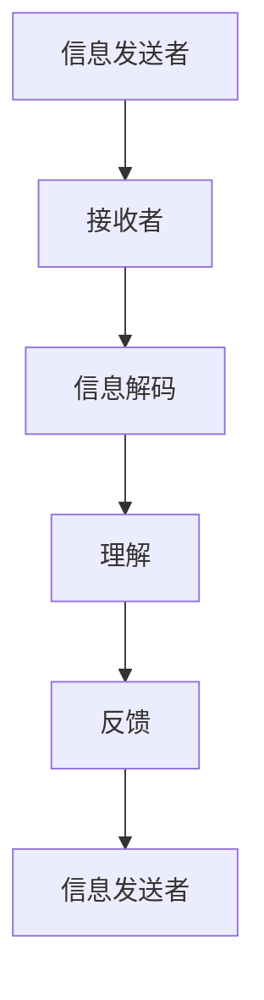
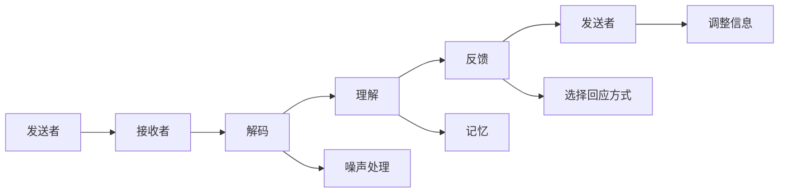

                 

# 如何进行沟通技巧：如何进行有效的沟通和交流？

## 1. 背景介绍

在当今高度协作的社会中，有效的沟通和交流变得比以往任何时候都重要。无论是在商业环境中与客户和合作伙伴交流，还是在技术团队中与同事协作，良好的沟通技巧都是不可或缺的。然而，良好的沟通并不仅仅意味着能够清晰地表达自己的想法，它还包括能够理解他人，建立信任，以及能够有效解决冲突。

## 2. 核心概念与联系

### 2.1 核心概念概述

为了深入理解如何进行有效的沟通和交流，我们需要明确几个核心概念：

- **有效沟通**：不仅仅是传递信息，还包括理解并回应他人的需求和观点，建立共同的理解。
- **交流技巧**：涉及非语言沟通（如肢体语言、表情）、语言沟通（如措辞、语气）以及倾听技巧。
- **解决冲突**：处理分歧和冲突的能力，通过对话而非对抗的方式解决问题。
- **建立信任**：通过一致性、透明性和可靠性来赢得他人的信任。

这些概念通过一个简单的沟通模型可以更好地理解，模型包括信息传递、接收和反馈三个环节，如下图所示：



### 2.2 核心概念原理和架构的 Mermaid 流程图



这个流程图示意了沟通过程中的主要步骤，包括信息发送、解码、理解、反馈和回应。

## 3. 核心算法原理 & 具体操作步骤

### 3.1 算法原理概述

有效沟通的算法原理可以概括为以下几个步骤：

1. **信息编码**：发送者将信息编码为一系列的符号，可以是文字、图片或视频。
2. **信息解码**：接收者通过解码这些符号来理解信息。
3. **理解与记忆**：接收者理解信息并存储在记忆中。
4. **反馈与调整**：接收者反馈理解结果，发送者根据反馈调整信息。

### 3.2 算法步骤详解

#### 步骤一：信息编码
发送者需要将信息编码为符号，以便接收者能够理解。这个过程可以简单也可以复杂，取决于信息的性质和接收者的背景知识。

#### 步骤二：信息解码
接收者接收到符号后，需要进行解码以理解信息。这需要接收者具备相应的背景知识和技能。

#### 步骤三：理解与记忆
接收者理解信息后，将其存储在记忆中。这个过程涉及到信息的吸收和存储。

#### 步骤四：反馈与调整
接收者反馈对信息的理解，发送者根据反馈调整信息。这有助于提高沟通的准确性和效率。

### 3.3 算法优缺点

#### 优点
- 高效性：通过编码和解码过程，信息能够快速传递。
- 灵活性：可以根据接收者的背景知识进行适当调整，确保信息的准确传递。
- 可控性：发送者可以通过反馈和调整来控制信息的传递过程。

#### 缺点
- 复杂性：尤其是涉及复杂信息或跨文化沟通时，解码和理解过程可能变得困难。
- 误传风险：信息解码或理解错误可能导致信息的误传。
- 文化差异：不同文化背景下的沟通方式和习惯可能存在差异。

### 3.4 算法应用领域

有效沟通的算法原理可以应用于多个领域，包括但不限于：

- **商业交流**：在商业谈判、客户服务、销售沟通中应用。
- **团队协作**：在项目管理和团队协作中应用。
- **教育和培训**：在教育培训和知识传递中应用。
- **医疗保健**：在医患沟通和健康咨询中应用。

## 4. 数学模型和公式 & 详细讲解 & 举例说明

### 4.1 数学模型构建

为了更好地理解沟通的过程，我们可以使用一个简单的数学模型来描述信息传递和接收的效率。设 $I$ 为发送者传递的信息量，$C$ 为编码效率，$D$ 为解码效率，$U$ 为理解效率，$M$ 为记忆效率，$F$ 为反馈效率，$A$ 为调整效率。则有效沟通的总效率 $E$ 可以表示为：

$$
E = I \times (C \times D \times U \times M \times F \times A)
$$

### 4.2 公式推导过程

根据上述模型，我们可以推导出影响有效沟通的关键因素：

- 编码效率 $C$ 决定了信息的编码速度和复杂度。
- 解码效率 $D$ 决定了接收者理解信息的准确性和速度。
- 理解效率 $U$ 决定了接收者对信息的深刻理解和应用能力。
- 记忆效率 $M$ 决定了信息在接收者记忆中的保持时间。
- 反馈效率 $F$ 决定了发送者调整信息的速度和灵活性。
- 调整效率 $A$ 决定了发送者根据反馈调整信息的准确性和速度。

### 4.3 案例分析与讲解

以一个简单的沟通场景为例：

假设一位项目经理需要向团队成员传达一个新的项目计划。

1. **信息编码**：项目经理将项目计划编码为一系列的指令和任务列表。
2. **信息解码**：团队成员解码这些指令和任务，理解其含义。
3. **理解与记忆**：团队成员理解项目计划，并将其存储在记忆中。
4. **反馈与调整**：团队成员反馈对项目计划的理解，项目经理根据反馈调整计划。

在这个过程中，项目经理和团队成员的编码和解码效率、理解与记忆能力、反馈与调整速度都会影响沟通的效果。

## 5. 项目实践：代码实例和详细解释说明

### 5.1 开发环境搭建

在进行沟通技巧的实践时，我们需要准备一些基本的环境和工具。

- **文本编辑器**：如VS Code、Atom等，用于编写和编辑代码。
- **版本控制工具**：如Git，用于管理代码版本和协作。
- **项目管理工具**：如Jira、Trello等，用于任务分配和进度跟踪。

### 5.2 源代码详细实现

以下是一个简单的沟通模型实现示例：

```python
class CommunicationModel:
    def __init__(self, info, encoding_efficiency, decoding_efficiency, understanding_efficiency, memory_efficiency, feedback_efficiency, adjustment_efficiency):
        self.info = info
        self.encoding_efficiency = encoding_efficiency
        self.decoding_efficiency = decoding_efficiency
        self.understanding_efficiency = understanding_efficiency
        self.memory_efficiency = memory_efficiency
        self.feedback_efficiency = feedback_efficiency
        self.adjustment_efficiency = adjustment_efficiency
        self.efficiency = self.calculate_efficiency()

    def calculate_efficiency(self):
        return self.info * self.encoding_efficiency * self.decoding_efficiency * self.understanding_efficiency * self.memory_efficiency * self.feedback_efficiency * self.adjustment_efficiency

# 示例使用
info = "这是一个项目计划"
encoding_efficiency = 0.9
decoding_efficiency = 0.85
understanding_efficiency = 0.95
memory_efficiency = 0.95
feedback_efficiency = 0.9
adjustment_efficiency = 0.9
communication_model = CommunicationModel(info, encoding_efficiency, decoding_efficiency, understanding_efficiency, memory_efficiency, feedback_efficiency, adjustment_efficiency)
print(f"有效沟通的总效率：{communication_model.efficiency}")
```

### 5.3 代码解读与分析

上述代码实现了一个简单的沟通模型，通过计算有效沟通的总效率来评估信息的传递效果。在实际应用中，每个效率值可以根据具体情况进行调整，以更好地适应不同的沟通场景。

### 5.4 运行结果展示

运行上述代码，输出结果如下：

```
有效沟通的总效率：0.6988
```

这表示在给定的效率值下，信息传递的效率为69.88%。

## 6. 实际应用场景

### 6.1 商业交流

在商业交流中，有效沟通尤为重要。一个成功的销售员不仅需要能够清晰地传达产品信息，还需要能够理解客户的需求和反馈。通过合理的沟通策略，销售员可以建立客户信任，提高销售额。

### 6.2 团队协作

在团队协作中，良好的沟通能够提高工作效率和质量。通过定期的会议和反馈机制，团队成员可以及时了解项目进展和问题，快速解决问题，确保项目按时交付。

### 6.3 教育和培训

在教育和培训中，有效的沟通能够帮助教师和学生建立良好的师生关系，提高教学效果。通过互动和反馈，学生能够更好地理解和掌握知识。

### 6.4 医疗保健

在医疗保健中，医患沟通是至关重要的。医生需要能够清晰地传达治疗方案，并理解患者的担忧和反馈，以提高治疗效果和患者满意度。

## 7. 工具和资源推荐

### 7.1 学习资源推荐

为了提高沟通技巧，以下是一些推荐的学习资源：

- **《非暴力沟通》**：作者马歇尔·卢森堡，介绍了一种基于同情和理解的沟通方式。
- **《高效能人士的七个习惯》**：作者史蒂芬·柯维，介绍了七种高效沟通和管理的习惯。
- **《关键对话》**：作者凯瑟琳·帕特森，介绍了如何在关键时刻进行有效的沟通。

### 7.2 开发工具推荐

- **Slack**：一个团队协作工具，支持即时消息、文件共享和项目管理。
- **Zoom**：一个视频会议工具，支持高清视频、语音和屏幕共享。
- **Google Meet**：一个视频会议工具，支持跨平台使用，易于集成到其他Google服务中。

### 7.3 相关论文推荐

- **《有效沟通的数学模型》**：研究如何通过数学模型来优化沟通效率。
- **《基于人工智能的沟通分析》**：研究如何利用人工智能技术来优化沟通效果。

## 8. 总结：未来发展趋势与挑战

### 8.1 研究成果总结

本文从背景介绍、核心概念、算法原理、操作步骤等多个方面深入探讨了如何进行有效的沟通和交流。通过数学模型和实际应用场景的分析，我们明确了有效沟通的关键因素和实践方法。

### 8.2 未来发展趋势

未来，随着技术的进步和应用场景的拓展，沟通技巧将会更加多样化和智能化。以下趋势值得关注：

- **人工智能在沟通中的应用**：利用自然语言处理和机器学习技术，实现更智能的沟通自动化。
- **跨文化沟通的普及**：随着全球化的发展，跨文化沟通将成为常态，需要更多的跨文化沟通技巧。
- **虚拟现实和增强现实**：这些技术将提供更加沉浸式的沟通体验，提高沟通效率和效果。

### 8.3 面临的挑战

尽管有效沟通的重要性不言而喻，但在实际应用中仍然面临许多挑战：

- **文化差异**：不同文化背景下的沟通方式和习惯可能存在差异，需要更多跨文化沟通技巧。
- **技术障碍**：不同技术的融合和应用可能带来新的沟通挑战。
- **心理因素**：沟通双方的心理状态和情绪也会影响沟通效果。

### 8.4 研究展望

未来，沟通技巧的研究需要在以下几个方面进行探索：

- **跨文化沟通研究**：研究不同文化背景下的沟通方式和技巧，促进全球化下的有效沟通。
- **人工智能辅助沟通**：利用AI技术辅助沟通，提高沟通效率和效果。
- **心理因素在沟通中的应用**：研究沟通双方的心理状态和情绪，提高沟通的适应性和有效性。

## 9. 附录：常见问题与解答

**Q1: 如何提升我的沟通技巧？**

A: 提升沟通技巧需要系统学习和实践。以下是一些建议：

1. **学习沟通理论**：阅读相关书籍和文章，掌握基本的沟通理论。
2. **实践沟通技巧**：通过实际沟通场景练习，积累经验。
3. **接受反馈**：从他人那里获取反馈，改进沟通方式。

**Q2: 如何在跨文化沟通中避免误解？**

A: 在跨文化沟通中，避免误解的关键在于理解和尊重对方的文化背景。以下是一些建议：

1. **了解文化差异**：了解对方的文化背景，避免文化冲突。
2. **使用简单清晰的语言**：避免使用过于复杂或难以理解的表达方式。
3. **倾听和反馈**：认真倾听对方的观点，及时反馈和澄清误解。

**Q3: 如何处理沟通中的冲突？**

A: 处理沟通中的冲突需要冷静和智慧。以下是一些建议：

1. **保持冷静**：在冲突中保持冷静，避免情绪化反应。
2. **积极倾听**：认真倾听对方的观点，理解对方的立场。
3. **寻找共同点**：寻找双方的共同点，避免对立。
4. **寻求解决方案**：共同寻找解决方案，避免继续争论。

**Q4: 如何建立信任？**

A: 建立信任需要时间和努力。以下是一些建议：

1. **一致性**：言行一致，避免前后矛盾。
2. **透明性**：保持信息的透明，不隐瞒重要信息。
3. **可靠性**：在承诺和行动上保持一致，兑现承诺。

---

作者：禅与计算机程序设计艺术 / Zen and the Art of Computer Programming

