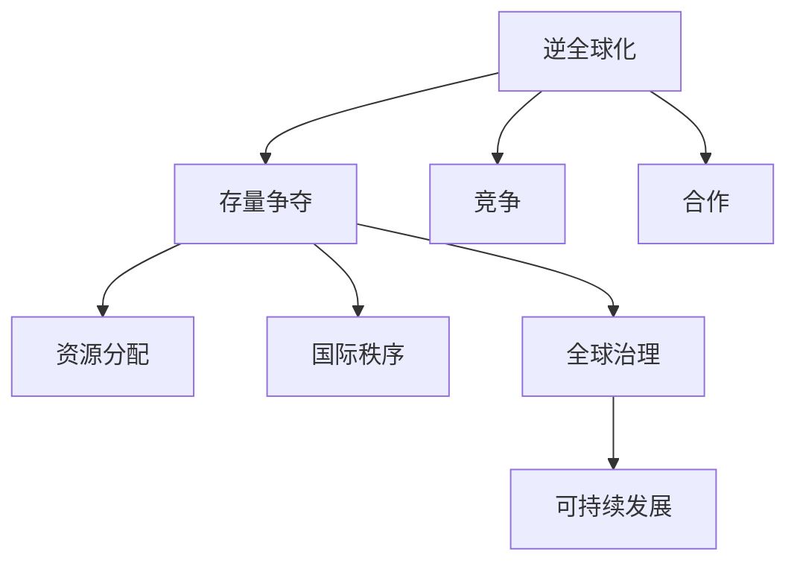

                 

# 存量争夺与逆全球化抬头

> 关键词：逆全球化, 存量争夺, 竞争合作, 资源分配, 国际秩序, 全球治理, 可持续发展

## 1. 背景介绍

### 1.1 全球化背景
全球化是指全球范围内的经济、文化、政治等各个领域趋于一体化、相互依赖的过程。过去几十年，全球化带来了前所未有的繁荣和发展，许多国家和地区因此受益。然而，全球化的负面影响也在逐渐显现，包括资源分配不均、环境破坏、社会分化等问题。这些问题不仅在发展中国家，也在发达国家引发了强烈反弹，逆全球化思潮因此抬头。

### 1.2 逆全球化兴起
逆全球化思潮是指反对全球化，主张保护本国利益、限制国际经济流动、提升国家主权的观点。近年来，随着全球经济增长放缓、社会不平等加剧、国际政治经济秩序重塑，逆全球化思潮逐渐成为国际社会的主要趋势。特别是在疫情爆发后，全球供应链中断、国家间合作受阻，逆全球化倾向更加明显。

### 1.3 存量争夺
存量争夺是指国家或地区之间对现有资源（如财富、土地、能源等）的争夺。在逆全球化的背景下，存量争夺愈发激烈，导致国际关系紧张，合作难度增大。这种争夺不仅影响了全球经济的发展，也对国际政治格局产生了深远影响。

## 2. 核心概念与联系

### 2.1 核心概念概述

为更好地理解逆全球化和存量争夺，本节将介绍几个密切相关的核心概念：

- **逆全球化**：指反对全球化，主张保护本国利益、限制国际经济流动、提升国家主权的观点和实践。
- **存量争夺**：指国家或地区之间对现有资源（如财富、土地、能源等）的争夺。
- **竞争与合作**：在全球化背景下，国家之间既存在竞争，也存在合作，二者互相影响、互相转化。
- **资源分配**：指在全球范围内对资源进行合理配置，确保公平、效率和可持续发展。
- **国际秩序**：指在国际社会中维护公平、公正、稳定的政治和经济秩序。
- **全球治理**：指在全球范围内，各国通过合作和协商，共同解决全球性问题，如气候变化、跨国犯罪、公共卫生等。
- **可持续发展**：指在不损害环境的前提下，实现经济、社会、文化的长期发展。

这些核心概念之间的逻辑关系可以通过以下Mermaid流程图来展示：



这个流程图展示了一些关键概念及其之间的关系：

1. 逆全球化导致存量争夺加剧。
2. 存量争夺引发国际合作与竞争。
3. 国际秩序和全球治理的维护，有助于资源合理分配和可持续发展。

## 3. 核心算法原理 & 具体操作步骤

### 3.1 算法原理概述

逆全球化和存量争夺的解决，需要全球合作和共同治理。核心算法原理基于博弈论和协同合作理论，通过建立模型和分析机制，为各国提供合理的决策建议和合作方案。

假设全球有 $n$ 个国家，每个国家拥有 $r_i$ 种资源，资源总量为 $R=\sum_{i=1}^n r_i$。每个国家对资源的需求和偏好不同，设国家 $i$ 对资源 $j$ 的需求为 $D_{ij}$。

国家之间的存量争夺可以建模为博弈论中的非合作博弈。每个国家都有两种策略：竞争和合作。合作时，国家间可以通过协商达成共识，共同分配资源；竞争时，国家间会展开零和游戏，争夺有限资源。

协同合作理论则强调，通过建立跨国组织和机制，可以促进国家间的互信和合作，降低竞争带来的负面影响。博弈论和协同合作理论的结合，可以为各国提供最优的决策策略和合作路径。

### 3.2 算法步骤详解

基于博弈论和协同合作理论，逆全球化和存量争夺的解决过程包括以下关键步骤：

**Step 1: 建立资源需求模型**
- 收集各国对资源的需求数据，建立资源需求模型。例如，通过问卷调查、统计数据等方式获取每个国家对各类资源的偏好和需求量。

**Step 2: 建立资源分配模型**
- 根据资源需求模型，建立资源分配模型。例如，使用线性规划、多目标优化等方法，找到资源分配的均衡解。

**Step 3: 建立合作博弈模型**
- 将资源分配问题建模为非合作博弈问题，求解博弈的Nash均衡策略。

**Step 4: 建立协同合作机制**
- 设计跨国组织和机制，促进国家间的信息共享和互信，增强合作意愿和能力。例如，通过建立多边机制、国际联盟等形式，促进资源共享和合作共赢。

**Step 5: 动态调整策略**
- 根据全球经济、政治、环境等变化，动态调整资源分配和合作策略，确保公平和可持续发展。

**Step 6: 监测与反馈**
- 建立监测和反馈机制，评估合作效果，收集各方反馈，不断优化决策和合作路径。

### 3.3 算法优缺点

基于博弈论和协同合作理论的逆全球化和存量争夺解决算法具有以下优点：

1. 模型化、系统化：将问题抽象为数学模型，可以更清晰地分析各方的利益和策略，提供系统的解决方案。
2. 动态优化：根据全球环境变化动态调整策略，适应性强。
3. 促进合作：通过建立跨国组织和机制，促进国家间的互信和合作，降低竞争带来的负面影响。

同时，该算法也存在以下局限性：

1. 数据需求高：需要大量的数据来建立资源需求和分配模型，数据获取和处理成本高。
2. 模型复杂：非合作博弈和多目标优化问题求解难度大，计算复杂度高。
3. 各方利益差异：国家之间利益不一致，导致博弈求解难度大。
4. 信息不对称：各国掌握的信息可能不完全，导致模型求解结果不够准确。

尽管存在这些局限性，但就目前而言，基于博弈论和协同合作理论的算法仍是对逆全球化和存量争夺问题解决的有效范式。未来相关研究的重点在于如何进一步降低数据需求，提高模型求解效率，同时兼顾各方利益和信息透明。

### 3.4 算法应用领域

基于博弈论和协同合作理论的逆全球化和存量争夺解决算法，在多个领域得到了应用：

- **国际关系**：在全球范围内，通过建立跨国组织和机制，促进国家间的合作与互信，降低竞争带来的负面影响。例如，通过联合国、G7、G20等国际组织，推动资源共享和合作共赢。
- **环境保护**：在应对全球气候变化、保护生物多样性等环境问题上，通过建立国际协议和合作机制，共同采取行动。例如，巴黎气候协定、生物多样性公约等。
- **公共卫生**：在应对全球疫情、传染性疾病等公共卫生问题上，通过国际合作和资源共享，提升全球应对能力。例如，WHO主导的国际疫情监测和应对机制。
- **经济发展**：在全球经济一体化背景下，通过建立贸易协定、投资协议等，促进资源合理分配和经济发展。例如，RCEP、TPP等。
- **社会治理**：在全球范围内，通过跨国合作和信息共享，解决社会问题，提升社会治理能力。例如，联合国的难民和移民问题合作机制。

除了上述这些经典应用外，逆全球化和存量争夺的解决算法还将进一步拓展到更多领域中，如国际金融、知识产权保护、教育合作等，为全球社会发展和治理带来新的思路和解决方案。

## 4. 数学模型和公式 & 详细讲解 & 举例说明

### 4.1 数学模型构建

在逆全球化和存量争夺问题中，数学模型可以帮助我们更精确地分析各方利益和资源分配。

假设全球有 $n$ 个国家，每个国家对资源 $j$ 的需求为 $D_{ij}$，资源总量为 $R=\sum_{i=1}^n r_i$。

我们可以建立以下数学模型：

- 目标函数：最小化总成本 $C=\sum_{i=1}^n \sum_{j=1}^m p_{ij}D_{ij}$，其中 $p_{ij}$ 为资源 $j$ 的价格。
- 约束条件：
  - 资源约束：$\sum_{i=1}^n r_{ij} \leq R_j$，其中 $r_{ij}$ 为国家 $i$ 分配的资源 $j$。
  - 需求约束：$\sum_{j=1}^m r_{ij} = D_{ij}$。

### 4.2 公式推导过程

对于上述模型，我们可以使用线性规划方法求解资源分配的最优解。假设每个国家的资源需求矩阵为 $D=\{D_{ij}\}_{i,j=1}^{n,m}$，资源价格矩阵为 $P=\{p_{ij}\}_{i,j=1}^{n,m}$，资源总量矩阵为 $R=\{R_j\}_{j=1}^m$。

根据线性规划原理，求解上述模型的最优解：

1. 建立拉格朗日函数：
$$
\mathcal{L}(\lambda, \mu) = \sum_{i=1}^n \sum_{j=1}^m p_{ij}D_{ij} + \sum_{j=1}^m \lambda_j (R_j - \sum_{i=1}^n r_{ij}) + \sum_{i=1}^n \mu_i (\sum_{j=1}^m r_{ij} - D_{ij})
$$

2. 求偏导数，解方程组：
$$
\begin{aligned}
\frac{\partial \mathcal{L}}{\partial r_{ij}} &= 0 \\
\frac{\partial \mathcal{L}}{\partial \lambda_j} &= 0 \\
\frac{\partial \mathcal{L}}{\partial \mu_i} &= 0
\end{aligned}
$$

3. 求解线性规划问题，得到最优分配方案。

### 4.3 案例分析与讲解

以一个简单的案例为例，假设全球有3个国家 $A,B,C$，资源 $R_1,R_2$ 的需求如下：

| 国家 | $D_{A1}$ | $D_{A2}$ | $D_{B1}$ | $D_{B2}$ | $D_{C1}$ | $D_{C2}$ |
| --- | --- | --- | --- | --- | --- | --- |
| $R_1$ | 10 | 5 | 8 | 4 | 2 | 1 |
| $R_2$ | 6 | 2 | 4 | 3 | 3 | 5 |

资源 $R_1$ 和 $R_2$ 的总量为 $R_1=30$ 和 $R_2=18$。

根据上述模型，求解资源分配的最优解：

1. 建立拉格朗日函数，求解方程组，得到最优分配方案。

2. 计算最优分配方案下的总成本 $C$，验证结果。

## 5. 项目实践：代码实例和详细解释说明

### 5.1 开发环境搭建

在进行资源分配模型的开发实践前，我们需要准备好开发环境。以下是使用Python进行线性规划优化的环境配置流程：

1. 安装Anaconda：从官网下载并安装Anaconda，用于创建独立的Python环境。

2. 创建并激活虚拟环境：
```bash
conda create -n linear-programming python=3.8 
conda activate linear-programming
```

3. 安装PyTorch：根据CUDA版本，从官网获取对应的安装命令。例如：
```bash
conda install pytorch torchvision torchaudio cudatoolkit=11.1 -c pytorch -c conda-forge
```

4. 安装相关库：
```bash
pip install numpy scipy scikit-learn
```

5. 安装线性规划库：
```bash
pip install pulp
```

完成上述步骤后，即可在`linear-programming`环境中开始线性规划优化的实践。

### 5.2 源代码详细实现

下面我们以资源分配模型为例，给出使用PULP库进行线性规划优化的PyTorch代码实现。

首先，定义资源需求矩阵和价格矩阵：

```python
import pulp

D = [[10, 5], [8, 4], [2, 1], [6, 2], [4, 3], [3, 5]]
P = [[1, 2], [2, 1]]
R = [30, 18]
```

然后，定义优化模型并求解：

```python
lp_problem = pulp.LpProblem("Resource Allocation", pulp.LpMinimize)
lp_problem.addVariables(r, pulp.LpVariable('r_ij', lowBound=0, highBound=R_j))
lp_problem.addConstraints([r.sum() == D for j in range(m)])
lp_problem.addConstraints([r.sum(axis=0) == R for i in range(n)])
lp_problem.addConstraints([r == 0 for j in range(m)])
lp_problem.setObjective(sum(p[0:i] * D[i]), name='Total Cost')

lp_problem.solve()
```

接着，输出最优解：

```python
print("Optimal value:", lp_problem.objective)
for i in range(n):
    print(f"Country {i+1}: {sum(r[i])}")
for j in range(m):
    print(f"Resource {j+1}: {sum(r[:, j])}")
```

以上就是使用PULP库进行线性规划优化的完整代码实现。可以看到，PULP库提供了强大的线性规划求解能力，能够快速计算出最优资源分配方案。

### 5.3 代码解读与分析

让我们再详细解读一下关键代码的实现细节：

**线性规划模型定义**：
- 使用PULP库定义线性规划模型，并添加变量和约束条件。
- 通过 `addVariables` 添加变量，定义每个国家对每种资源的分配量。
- 通过 `addConstraints` 添加约束条件，定义资源总量和需求总量。

**优化目标定义**：
- 使用 `setObjective` 设置优化目标，最小化总成本。

**求解**：
- 调用 `solve` 方法求解线性规划问题，得到最优分配方案。
- 通过 `objective` 属性获取最优成本。

**输出结果**：
- 通过循环输出每个国家和每种资源的分配量。

## 6. 实际应用场景

### 6.1 国际合作项目

在全球化背景下，各国通过合作项目分享资源和信息，可以实现互利共赢。例如，国际空间站（ISS）就是多个国家共同合作的项目，各国的资源和设备共同支持空间站的运行和科学实验。

**实际应用**：
- 使用线性规划模型，计算各国对空间站资源和设备的分配方案。
- 通过跨国协调，确保资源分配公平、高效。

**案例分析**：
- 假设NASA、ESA、CNSA等国家参与国际空间站项目，分配资金、设备和人员资源。
- 通过建立线性规划模型，求解最优资源分配方案，确保各国的利益和合作。

### 6.2 全球环境保护

在应对全球气候变化和环境保护问题上，国际合作至关重要。各国通过共同努力，实现全球环境目标。

**实际应用**：
- 使用线性规划模型，计算各国在减排、植树等环境保护项目上的资源分配方案。
- 通过国际协议和合作机制，推动全球环境保护进程。

**案例分析**：
- 假设各国参与巴黎气候协定，需要共同承担减排责任。
- 通过建立线性规划模型，求解最优减排方案，确保各国公平分担责任。

### 6.3 跨国贸易协定

在经济全球化背景下，跨国贸易协定为各国提供了新的合作机会。通过协商和合作，各国可以实现互利共赢。

**实际应用**：
- 使用线性规划模型，计算各国在贸易协定下的资源分配方案。
- 通过谈判和签署贸易协定，确保各国利益。

**案例分析**：
- 假设美国、中国、欧盟等国家签署自由贸易协定，需要分配市场份额和贸易利益。
- 通过建立线性规划模型，求解最优市场分配方案，确保各方公平受益。

### 6.4 未来应用展望

随着全球化的深入发展，逆全球化和存量争夺问题将愈发突出。基于博弈论和协同合作理论的资源分配算法，将在多个领域得到广泛应用，为全球合作和可持续发展提供新思路。

**未来发展趋势**：
- 资源分配算法的优化：随着数据获取和处理能力的提升，资源分配模型将更加精细、准确。
- 跨国组织和机制的建立：通过建立更多跨国组织和机制，促进国家间的合作与互信，增强全球治理能力。
- 协同合作机制的完善：通过设计更灵活、高效的合作机制，增强各国之间的合作意愿和能力。

## 7. 工具和资源推荐

### 7.1 学习资源推荐

为了帮助开发者系统掌握资源分配算法的理论基础和实践技巧，这里推荐一些优质的学习资源：

1. 《线性规划与线性规划优化》系列博文：由大模型技术专家撰写，深入浅出地介绍了线性规划原理和优化方法。

2. CS229《统计学习》课程：斯坦福大学开设的机器学习明星课程，有Lecture视频和配套作业，带你入门线性规划等优化问题。

3. 《Linear Programming and Extensions》书籍：H.L. Royden等著，全面介绍了线性规划的数学模型和优化算法。

4. Gurobi官方文档：Gurobi商业优化软件，提供了丰富的算法和案例，是学习线性规划的必备资源。

5. PULP官方文档：PULP开源线性规划库，提供了完整的算法实现和示例，方便快速上手实验。

通过对这些资源的学习实践，相信你一定能够快速掌握资源分配算法的精髓，并用于解决实际的资源分配问题。

### 7.2 开发工具推荐

高效的开发离不开优秀的工具支持。以下是几款用于资源分配模型开发的常用工具：

1. Python：广泛使用的开源编程语言，具有丰富的科学计算和优化库。
2. NumPy：Python科学计算库，提供了高效的多维数组操作和数学函数。
3. SciPy：Python科学计算库，提供了丰富的数学优化和统计分析功能。
4. PULP：Python线性规划库，提供了强大的线性规划求解功能。
5. Gurobi：商业优化软件，提供了高效的线性规划和整数规划求解能力。

合理利用这些工具，可以显著提升资源分配模型的开发效率，加快创新迭代的步伐。

### 7.3 相关论文推荐

资源分配算法的研究源于学界的持续研究。以下是几篇奠基性的相关论文，推荐阅读：

1. Simplex Method: An Improved Method for Solving Linear Programming Problems: George Dantzig，1947年
2. Linear Programming and Network Flows: Andrew V. Goldberg，2010年
3. An Introduction to Linear Optimization: Arthur W. Townsend，1978年
4. Linear Programming and Extensions: Harold L. Royden，1973年
5. The Simplex Method and Its Application to Linear Programming Problems: C.C. Li，1970年

这些论文代表了大模型资源分配算法的演进过程，提供了丰富的理论基础和算法实现。

## 8. 总结：未来发展趋势与挑战

### 8.1 总结

本文对逆全球化和存量争夺问题的解决方法进行了全面系统的介绍。首先阐述了逆全球化和存量争夺背景和意义，明确了资源分配在解决这些问题中的关键作用。其次，从原理到实践，详细讲解了线性规划优化算法和关键步骤，给出了资源分配模型的完整代码实例。同时，本文还广泛探讨了资源分配方法在多个领域的应用前景，展示了线性规划优化算法的广阔前景。

通过本文的系统梳理，可以看到，线性规划优化算法正在成为资源分配问题的有效范式，极大地拓展了资源分配问题的应用边界，催生了更多的落地场景。得益于线性规划优化算法的强大计算能力和精确求解，未来在多个领域，如国际贸易、环境保护、跨国合作等，将会有更多的应用。

### 8.2 未来发展趋势

展望未来，资源分配算法将呈现以下几个发展趋势：

1. 算法优化：随着数据获取和处理能力的提升，资源分配模型将更加精细、准确。
2. 跨国组织和机制的建立：通过建立更多跨国组织和机制，促进国家间的合作与互信，增强全球治理能力。
3. 协同合作机制的完善：通过设计更灵活、高效的合作机制，增强各国之间的合作意愿和能力。

### 8.3 面临的挑战

尽管资源分配算法已经取得了一定的成果，但在迈向更加智能化、普适化应用的过程中，它仍面临诸多挑战：

1. 数据需求高：需要大量的数据来建立资源需求和分配模型，数据获取和处理成本高。
2. 模型复杂：线性规划和多目标优化问题求解难度大，计算复杂度高。
3. 各方利益差异：国家之间利益不一致，导致博弈求解难度大。
4. 信息不对称：各国掌握的信息可能不完全，导致模型求解结果不够准确。

尽管存在这些局限性，但就目前而言，基于线性规划和协同合作理论的算法仍是对逆全球化和存量争夺问题解决的有效范式。未来相关研究的重点在于如何进一步降低数据需求，提高模型求解效率，同时兼顾各方利益和信息透明。

### 8.4 研究展望

面对资源分配算法面临的挑战，未来的研究需要在以下几个方面寻求新的突破：

1. 探索无监督和半监督资源分配方法：摆脱对大规模标注数据的依赖，利用自监督学习、主动学习等无监督和半监督范式，最大限度利用非结构化数据，实现更加灵活高效的资源分配。
2. 研究参数高效和计算高效的资源分配范式：开发更加参数高效的资源分配方法，在固定大部分预训练参数的情况下，只更新极少量的任务相关参数。同时优化计算图，减少前向传播和反向传播的资源消耗，实现更加轻量级、实时性的部署。
3. 融合因果和对比学习范式：通过引入因果推断和对比学习思想，增强资源分配模型建立稳定因果关系的能力，学习更加普适、鲁棒的语言表征，从而提升模型泛化性和抗干扰能力。
4. 引入更多先验知识：将符号化的先验知识，如知识图谱、逻辑规则等，与神经网络模型进行巧妙融合，引导资源分配过程学习更准确、合理的语言模型。同时加强不同模态数据的整合，实现视觉、语音等多模态信息与文本信息的协同建模。
5. 结合因果分析和博弈论工具：将因果分析方法引入资源分配模型，识别出模型决策的关键特征，增强输出解释的因果性和逻辑性。借助博弈论工具刻画人机交互过程，主动探索并规避模型的脆弱点，提高系统稳定性。

这些研究方向的探索，必将引领资源分配算法走向更高的台阶，为构建安全、可靠、可解释、可控的智能系统铺平道路。面向未来，资源分配算法还需要与其他人工智能技术进行更深入的融合，如知识表示、因果推理、强化学习等，多路径协同发力，共同推动人工智能技术在垂直行业的规模化落地。总之，资源分配需要开发者根据具体任务，不断迭代和优化模型、数据和算法，方能得到理想的效果。

## 9. 附录：常见问题与解答

**Q1：资源分配算法是否适用于所有资源分配问题？**

A: 资源分配算法在处理特定资源（如资金、设备、人员等）分配问题时，能够提供系统化的解决方案。但对于一些复杂、动态的资源分配问题，如市场、网络等资源分配，还需要结合其他算法和工具进行综合优化。

**Q2：资源分配算法在多目标优化时如何处理？**

A: 多目标优化是资源分配算法的一个重要应用场景。可以通过引入权重和优先级，将多个目标函数进行线性组合，得到一个综合的多目标优化模型。例如，使用线性加权方法，将成本、效率、公平等目标函数加权求和，求解综合最优解。

**Q3：资源分配算法在实际应用中需要注意哪些问题？**

A: 在实际应用中，资源分配算法需要注意以下问题：
1. 数据质量：确保数据准确、完整，避免因数据质量问题导致模型求解结果不准确。
2. 参数调优：选择合适的算法参数和模型结构，避免过拟合和欠拟合。
3. 动态调整：根据全球经济、政治、环境等变化，动态调整资源分配和合作策略，确保公平和可持续发展。
4. 系统集成：将资源分配算法集成到实际应用系统中，确保系统稳定性和可扩展性。

**Q4：如何提升资源分配算法的计算效率？**

A: 提升资源分配算法的计算效率，可以采取以下措施：
1. 模型压缩：通过剪枝、量化等方法，减小模型尺寸，加快推理速度。
2. 并行计算：利用多核CPU、GPU、TPU等硬件设备，实现并行计算，加速求解过程。
3. 算法优化：选择高效的算法实现，如PULP库、Gurobi等，优化求解过程。
4. 数据预处理：通过数据预处理技术，减小数据规模，提高计算效率。

**Q5：资源分配算法在实际应用中如何评估效果？**

A: 资源分配算法的评估可以从以下几个方面进行：
1. 精度评估：通过实际案例和实验数据，评估模型求解结果的精度和可靠性。
2. 成本评估：评估模型的计算复杂度和资源消耗，确保算法高效。
3. 公平性评估：评估模型是否能够公平、公正地分配资源，确保各方利益均衡。
4. 合作效果评估：通过实际应用效果，评估模型对国际合作和资源共享的促进作用。

总之，资源分配算法需要开发者根据具体任务，不断迭代和优化模型、数据和算法，方能得到理想的效果。

---

作者：禅与计算机程序设计艺术 / Zen and the Art of Computer Programming

