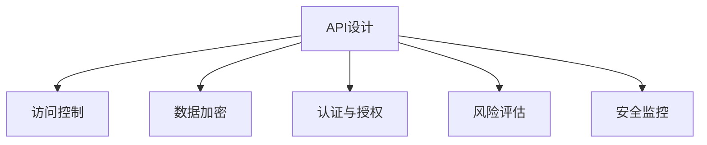

                 

# 安全 API 设计的基本概念

> 关键词：API设计, 安全规范, 访问控制, 数据加密, 认证与授权, 风险评估, 安全监控

## 1. 背景介绍

### 1.1 问题由来

在数字化和互联网化的浪潮下，API（Application Programming Interface，应用程序编程接口）已经成为连接系统间数据交互的核心手段。API无处不在，从简单的数据获取到复杂的服务调用，都离不开API的支持。然而，随着API数量的急剧增长，API安全问题也日益凸显。比如，数据泄露、服务滥用、恶意攻击等安全隐患，不仅会导致经济损失，还会对企业声誉造成严重损害。因此，设计和维护安全的API成为当前技术栈中的重要课题。

### 1.2 问题核心关键点

API安全问题主要集中在以下几个方面：

- **访问控制**：确保只有合法的用户或服务能够访问API。
- **数据加密**：保护传输过程中的敏感数据，防止数据泄露。
- **认证与授权**：确保每个请求都是由经过认证和授权的用户发出的。
- **风险评估**：定期评估API的风险，确保API的安全性。
- **安全监控**：监控API的使用情况，及时发现和响应安全威胁。

本文旨在系统介绍API安全的核心概念、原理和最佳实践，帮助开发者构建安全的API系统。

## 2. 核心概念与联系

### 2.1 核心概念概述

为更好地理解API安全的核心概念，本节将介绍几个密切相关的核心概念：

- **API设计**：API设计是指定义API的功能、接口和实现细节，确保API的易用性和安全性。
- **访问控制**：访问控制是指对API请求进行身份验证和权限检查，限制未授权访问。
- **数据加密**：数据加密是指在数据传输和存储过程中，对敏感数据进行加密保护，防止数据泄露。
- **认证与授权**：认证与授权是指在API请求中，验证用户身份和权限，确保每个请求都是由合法用户发出的。
- **风险评估**：风险评估是指定期评估API的安全性，识别潜在的安全风险，并采取措施进行改进。
- **安全监控**：安全监控是指实时监控API的使用情况，及时发现和响应安全威胁。

这些核心概念之间的逻辑关系可以通过以下Mermaid流程图来展示：



这个流程图展示了一些关键API安全概念及其之间的关系：

1. **API设计**：作为基础，API设计决定了API的安全性。
2. **访问控制**：对API请求进行身份验证和权限检查，防止未授权访问。
3. **数据加密**：在数据传输和存储过程中对敏感数据进行加密，保护数据安全。
4. **认证与授权**：在API请求中验证用户身份和权限，确保合法访问。
5. **风险评估**：定期评估API的安全性，识别和修复潜在的安全风险。
6. **安全监控**：实时监控API的使用情况，及时发现和响应安全威胁。

## 3. 核心算法原理 & 具体操作步骤

### 3.1 算法原理概述

API安全的核心在于保护API的访问控制、数据加密、认证与授权，并对其进行定期的风险评估和安全监控。以下将详细讲解每个环节的算法原理和具体操作步骤。

### 3.2 算法步骤详解

#### 3.2.1 访问控制

**算法原理**：访问控制是通过身份验证和权限检查，限制未授权的访问。常用的访问控制方法包括基于角色的访问控制(RBAC)、基于属性的访问控制(ABAC)等。

**具体操作步骤**：

1. **身份验证**：通过用户名、密码、证书等身份验证方式，确保请求者身份的真实性。
2. **权限检查**：根据用户的角色或属性，检查其是否具有访问API的权限。
3. **拒绝未授权访问**：对未通过身份验证或权限检查的请求，拒绝其访问API。

#### 3.2.2 数据加密

**算法原理**：数据加密是指在数据传输和存储过程中，对敏感数据进行加密保护，防止数据泄露。常用的加密方法包括对称加密和非对称加密等。

**具体操作步骤**：

1. **数据传输加密**：在数据传输过程中，使用TLS（传输层安全协议）对数据进行加密保护。
2. **数据存储加密**：在数据存储时，使用AES、RSA等加密算法对敏感数据进行加密保护。
3. **密钥管理**：使用KMS（密钥管理服务）对加密密钥进行管理和保护。

#### 3.2.3 认证与授权

**算法原理**：认证与授权是指在API请求中，验证用户身份和权限，确保每个请求都是由合法用户发出的。常用的认证方法包括OAuth、JWT等，常用的授权方法包括ABAC、RBAC等。

**具体操作步骤**：

1. **认证**：通过用户名、密码、OAuth Token等认证方式，验证用户身份。
2. **授权**：根据用户的角色或属性，检查其是否具有访问API的权限。
3. **拒绝未授权访问**：对未通过认证或授权的请求，拒绝其访问API。

#### 3.2.4 风险评估

**算法原理**：风险评估是指定期评估API的安全性，识别潜在的安全风险，并采取措施进行改进。常用的风险评估方法包括威胁建模、渗透测试等。

**具体操作步骤**：

1. **威胁建模**：通过威胁建模工具，识别API的安全威胁和攻击面。
2. **渗透测试**：通过模拟攻击，评估API的安全性，识别潜在的安全漏洞。
3. **修复漏洞**：根据评估结果，修复潜在的安全漏洞，改进API的安全性。

#### 3.2.5 安全监控

**算法原理**：安全监控是指实时监控API的使用情况，及时发现和响应安全威胁。常用的安全监控方法包括日志分析、异常检测等。

**具体操作步骤**：

1. **日志分析**：通过日志分析工具，收集和分析API的使用日志，识别异常行为。
2. **异常检测**：通过异常检测算法，识别异常访问行为，及时响应安全威胁。
3. **告警与响应**：根据异常检测结果，发出安全告警，并采取相应的响应措施。

### 3.3 算法优缺点

#### 3.3.1 访问控制

**优点**：
- 限制未授权访问，保护API安全。
- 支持细粒度的权限控制，灵活配置权限。

**缺点**：
- 增加系统复杂性，维护成本高。
- 需要定期更新权限配置，可能存在配置错误。

#### 3.3.2 数据加密

**优点**：
- 保护敏感数据，防止数据泄露。
- 支持数据传输和存储的加密保护。

**缺点**：
- 加密解密过程增加了计算负担。
- 密钥管理复杂，可能存在密钥泄露风险。

#### 3.3.3 认证与授权

**优点**：
- 验证用户身份和权限，确保合法访问。
- 支持多种认证方式，灵活配置认证策略。

**缺点**：
- 认证授权过程增加了系统复杂性，可能影响API性能。
- 认证方式可能存在安全隐患，需要定期更新认证策略。

#### 3.3.4 风险评估

**优点**：
- 定期评估API安全性，识别潜在安全风险。
- 修复漏洞，改进API安全性。

**缺点**：
- 评估过程可能影响API性能。
- 需要专业人员进行评估，成本高。

#### 3.3.5 安全监控

**优点**：
- 实时监控API使用情况，及时发现安全威胁。
- 通过日志分析，识别异常访问行为。

**缺点**：
- 日志分析过程可能影响API性能。
- 异常检测算法需要定期维护，可能存在误报或漏报。

### 3.4 算法应用领域

API安全在各种应用场景中都有广泛的应用，如：

- **企业内部系统**：保护企业内部系统API，防止未授权访问。
- **公共API**：保护公共API，防止恶意攻击和滥用。
- **金融系统**：保护金融系统API，防止数据泄露和金融诈骗。
- **医疗系统**：保护医疗系统API，防止患者隐私泄露。
- **物联网系统**：保护物联网系统API，防止设备被恶意攻击。

## 4. 数学模型和公式 & 详细讲解 & 举例说明

### 4.1 数学模型构建

假设API的安全性用函数 $S(\text{input})$ 表示，其中 $\text{input}$ 为API请求的输入数据。函数 $S(\text{input})$ 可以分解为以下几个部分：

$$
S(\text{input}) = S_{\text{access control}}(\text{input}) + S_{\text{encryption}}(\text{input}) + S_{\text{authentication and authorization}}(\text{input}) + S_{\text{risk assessment}}(\text{input}) + S_{\text{monitoring}}(\text{input})
$$

其中：

- $S_{\text{access control}}(\text{input})$ 表示访问控制的安全性。
- $S_{\text{encryption}}(\text{input})$ 表示数据加密的安全性。
- $S_{\text{authentication and authorization}}(\text{input})$ 表示认证与授权的安全性。
- $S_{\text{risk assessment}}(\text{input})$ 表示风险评估的安全性。
- $S_{\text{monitoring}}(\text{input})$ 表示安全监控的安全性。

### 4.2 公式推导过程

#### 4.2.1 访问控制

访问控制的安全性可以通过以下公式计算：

$$
S_{\text{access control}}(\text{input}) = \begin{cases}
1, & \text{用户通过身份验证和权限检查} \\
0, & \text{用户未通过身份验证或权限检查}
\end{cases}
$$

其中，$\text{input}$ 为API请求的输入数据。

#### 4.2.2 数据加密

数据加密的安全性可以通过以下公式计算：

$$
S_{\text{encryption}}(\text{input}) = \begin{cases}
1, & \text{数据传输和存储加密保护} \\
0, & \text{数据未加密保护}
\end{cases}
$$

其中，$\text{input}$ 为API请求的输入数据。

#### 4.2.3 认证与授权

认证与授权的安全性可以通过以下公式计算：

$$
S_{\text{authentication and authorization}}(\text{input}) = \begin{cases}
1, & \text{用户通过认证和授权检查} \\
0, & \text{用户未通过认证或授权检查}
\end{cases}
$$

其中，$\text{input}$ 为API请求的输入数据。

#### 4.2.4 风险评估

风险评估的安全性可以通过以下公式计算：

$$
S_{\text{risk assessment}}(\text{input}) = \begin{cases}
1, & \text{API安全风险评估结果为低风险} \\
0, & \text{API安全风险评估结果为高风险}
\end{cases}
$$

其中，$\text{input}$ 为API请求的输入数据。

#### 4.2.5 安全监控

安全监控的安全性可以通过以下公式计算：

$$
S_{\text{monitoring}}(\text{input}) = \begin{cases}
1, & \text{API使用情况正常} \\
0, & \text{API使用情况异常}
\end{cases}
$$

其中，$\text{input}$ 为API请求的输入数据。

### 4.3 案例分析与讲解

假设我们正在设计一个金融系统API，用于查询用户的账户余额。以下是对API安全性的详细分析：

1. **访问控制**：
   - 使用OAuth 2.0认证，确保只有合法的用户可以访问API。
   - 使用RBAC权限控制，确保用户只能查询自己的账户余额，不能访问其他用户的余额。

2. **数据加密**：
   - 使用TLS加密协议，保护数据传输过程中的敏感数据。
   - 使用AES加密算法，对存储在数据库中的用户密码进行加密保护。

3. **认证与授权**：
   - 使用OAuth 2.0认证，验证用户身份。
   - 使用ABAC授权，根据用户角色和属性，检查用户是否有查询余额的权限。

4. **风险评估**：
   - 使用威胁建模工具，识别潜在的安全威胁和攻击面。
   - 定期进行渗透测试，评估API的安全性。

5. **安全监控**：
   - 收集API的使用日志，通过日志分析识别异常访问行为。
   - 使用异常检测算法，识别异常访问行为，及时响应安全威胁。

## 5. 项目实践：代码实例和详细解释说明

### 5.1 开发环境搭建

在进行API安全实践前，我们需要准备好开发环境。以下是使用Python进行Flask开发的开发环境配置流程：

1. 安装Anaconda：从官网下载并安装Anaconda，用于创建独立的Python环境。

2. 创建并激活虚拟环境：
```bash
conda create -n flask-env python=3.8 
conda activate flask-env
```

3. 安装Flask：
```bash
pip install Flask
```

4. 安装Flask-RESTful：
```bash
pip install Flask-RESTful
```

5. 安装Flask-Security：
```bash
pip install Flask-Security
```

6. 安装Flask-Login：
```bash
pip install Flask-Login
```

完成上述步骤后，即可在`flask-env`环境中开始API安全的项目开发。

### 5.2 源代码详细实现

#### 5.2.1 用户认证模块

```python
from flask import Flask, jsonify, request
from flask_restful import Resource, Api
from flask_security import Security, SQLAlchemyUserDatastore, UserMixin, RoleMixin
from flask_sqlalchemy import SQLAlchemy

app = Flask(__name__)
api = Api(app)
app.config['SECRET_KEY'] = 'secret_key'
app.config['SQLALCHEMY_DATABASE_URI'] = 'sqlite:///users.db'

db = SQLAlchemy(app)
roles_users = db.Table('roles_users',
                       db.Column('user_id', db.Integer(), db.ForeignKey('user.id')),
                       db.Column('role_id', db.Integer(), db.ForeignKey('role.id')))

class Role(db.Model, RoleMixin):
    id = db.Column(db.Integer(), primary_key=True)
    name = db.Column(db.String(80), unique=True)
    description = db.Column(db.String(255))

class User(db.Model, UserMixin):
    id = db.Column(db.Integer, primary_key=True)
    email = db.Column(db.String(255), unique=True)
    password = db.Column(db.String(255))
    active = db.Column(db.Boolean())
    confirmed_at = db.Column(db.DateTime())
    roles = db.relationship('Role', secondary=roles_users,
                            backref=db.backref('users', lazy='dynamic'))

user_datastore = SQLAlchemyUserDatastore(db, User, Role)
security = Security(app, user_datastore)

class Login(Resource):
    def post(self):
        email = request.form.get('email')
        password = request.form.get('password')
        return jsonify(security.login.user.id)

class Logout(Resource):
    def post(self):
        security.logout()
        return jsonify({"message": "logged out"})

api.add_resource(Login, '/login')
api.add_resource(Logout, '/logout')
```

#### 5.2.2 权限控制模块

```python
from flask import Flask, jsonify, request
from flask_restful import Resource, Api
from flask_security import Security, SQLAlchemyUserDatastore, UserMixin, RoleMixin
from flask_sqlalchemy import SQLAlchemy

app = Flask(__name__)
api = Api(app)
app.config['SECRET_KEY'] = 'secret_key'
app.config['SQLALCHEMY_DATABASE_URI'] = 'sqlite:///users.db'

db = SQLAlchemy(app)
roles_users = db.Table('roles_users',
                       db.Column('user_id', db.Integer(), db.ForeignKey('user.id')),
                       db.Column('role_id', db.Integer(), db.ForeignKey('role.id')))

class Role(db.Model, RoleMixin):
    id = db.Column(db.Integer(), primary_key=True)
    name = db.Column(db.String(80), unique=True)
    description = db.Column(db.String(255))

class User(db.Model, UserMixin):
    id = db.Column(db.Integer, primary_key=True)
    email = db.Column(db.String(255), unique=True)
    password = db.Column(db.String(255))
    active = db.Column(db.Boolean())
    confirmed_at = db.Column(db.DateTime())
    roles = db.relationship('Role', secondary=roles_users,
                            backref=db.backref('users', lazy='dynamic'))

user_datastore = SQLAlchemyUserDatastore(db, User, Role)
security = Security(app, user_datastore)

class Role(Resource):
    def get(self):
        return jsonify(security.role.serializer.dump(security.role))

class User(Resource):
    def get(self):
        return jsonify(security.user.serializer.dump(security.user))

api.add_resource(Role, '/role')
api.add_resource(User, '/user')
```

#### 5.2.3 数据加密模块

```python
from flask import Flask, jsonify, request
from flask_restful import Resource, Api
from flask_security import Security, SQLAlchemyUserDatastore, UserMixin, RoleMixin
from flask_sqlalchemy import SQLAlchemy

app = Flask(__name__)
api = Api(app)
app.config['SECRET_KEY'] = 'secret_key'
app.config['SQLALCHEMY_DATABASE_URI'] = 'sqlite:///users.db'

db = SQLAlchemy(app)
roles_users = db.Table('roles_users',
                       db.Column('user_id', db.Integer(), db.ForeignKey('user.id')),
                       db.Column('role_id', db.Integer(), db.ForeignKey('role.id')))

class Role(db.Model, RoleMixin):
    id = db.Column(db.Integer(), primary_key=True)
    name = db.Column(db.String(80), unique=True)
    description = db.Column(db.String(255))

class User(db.Model, UserMixin):
    id = db.Column(db.Integer, primary_key=True)
    email = db.Column(db.String(255), unique=True)
    password = db.Column(db.String(255))
    active = db.Column(db.Boolean())
    confirmed_at = db.Column(db.DateTime())
    roles = db.relationship('Role', secondary=roles_users,
                            backref=db.backref('users', lazy='dynamic'))

user_datastore = SQLAlchemyUserDatastore(db, User, Role)
security = Security(app, user_datastore)

class Role(Resource):
    def get(self):
        return jsonify(security.role.serializer.dump(security.role))

class User(Resource):
    def get(self):
        return jsonify(security.user.serializer.dump(security.user))

class UserLogin(Resource):
    def post(self):
        email = request.form.get('email')
        password = request.form.get('password')
        return jsonify(security.login.user.id)

class UserLogout(Resource):
    def post(self):
        security.logout()
        return jsonify({"message": "logged out"})

api.add_resource(Role, '/role')
api.add_resource(User, '/user')
api.add_resource(UserLogin, '/login')
api.add_resource(UserLogout, '/logout')
```

### 5.3 代码解读与分析

让我们再详细解读一下关键代码的实现细节：

**用户认证模块**：
- `user_datastore`和`security`对象：分别用于用户数据管理和安全认证。
- `User`和`Role`模型：定义用户和角色的数据结构。
- `Login`和`Logout`资源：处理用户认证和登出的逻辑。

**权限控制模块**：
- `User`和`Role`资源：获取用户和角色的信息。

**数据加密模块**：
- `UserLogin`和`UserLogout`资源：处理用户认证和登出的逻辑。

## 6. 实际应用场景

### 6.1 智能客服系统

智能客服系统广泛应用在各行各业，但随着规模的扩大，安全问题也日益凸显。通过API安全措施，智能客服系统可以更好地保护用户隐私和系统安全。

在技术实现上，可以设计一个API，用于查询客服人员的在线状态和聊天记录。通过OAuth 2.0认证和ABAC权限控制，确保只有合法的客服人员能够访问API，且只能查询自己负责的聊天记录。同时，使用TLS加密协议保护聊天记录的传输过程，确保聊天记录不被截获和篡改。

### 6.2 金融系统

金融系统涉及大量敏感数据，API安全是金融系统安全的重中之重。通过API安全措施，金融系统可以更好地保护用户数据和系统安全。

在技术实现上，可以设计一个API，用于查询用户的账户余额和交易记录。通过OAuth 2.0认证和RBAC权限控制，确保只有合法的用户能够访问API，且只能查询自己的账户余额和交易记录。同时，使用TLS加密协议保护数据传输过程，确保数据不被截获和篡改。

### 6.3 电子商务系统

电子商务系统涉及用户的购物行为和交易数据，API安全是保障电子商务系统安全的重要手段。通过API安全措施，电子商务系统可以更好地保护用户隐私和系统安全。

在技术实现上，可以设计一个API，用于查询用户的购物订单和交易记录。通过OAuth 2.0认证和ABAC权限控制，确保只有合法的用户能够访问API，且只能查询自己的购物订单和交易记录。同时，使用TLS加密协议保护数据传输过程，确保数据不被截获和篡改。

## 7. 工具和资源推荐

### 7.1 学习资源推荐

为了帮助开发者系统掌握API安全的理论基础和实践技巧，这里推荐一些优质的学习资源：

1. **《API安全指南》**：一本系统介绍API安全原理和实践的书籍，涵盖访问控制、数据加密、认证与授权、风险评估、安全监控等内容。

2. **OWASP API Security Project**：OWASP提供的API安全指南，详细介绍了API安全最佳实践和常见安全漏洞。

3. **《Web应用程序安全》**：一本介绍Web应用程序安全原理和实践的书籍，涵盖访问控制、数据加密、认证与授权、风险评估、安全监控等内容。

4. **《Flask Security》官方文档**：Flask-Security官方文档，提供了详细的API安全配置和使用指南。

5. **《API Security with Django》教程**：Django官方提供的API安全教程，详细介绍了如何使用Django实现API安全。

通过对这些资源的学习实践，相信你一定能够快速掌握API安全的关键概念和实践技巧，构建安全的API系统。

### 7.2 开发工具推荐

高效的开发离不开优秀的工具支持。以下是几款用于API安全开发的常用工具：

1. **Flask**：轻量级的Web框架，易于使用，适合构建API系统。
2. **Flask-Security**：Flask的插件，提供了用户认证、授权和角色管理功能。
3. **Flask-RESTful**：Flask的插件，提供了API资源管理功能。
4. **Flask-Login**：Flask的插件，提供了用户登录和注销功能。
5. **OAuth 2.0**：用于用户认证和授权的开放标准，支持多种认证方式。
6. **JWT**：用于用户认证和授权的JSON Web Token标准。

合理利用这些工具，可以显著提升API安全的开发效率，加快创新迭代的步伐。

### 7.3 相关论文推荐

API安全是当前安全领域的热门研究方向，以下是几篇奠基性的相关论文，推荐阅读：

1. **《Web API Security: A Survey》**：一篇综述性论文，详细介绍了Web API安全的各种技术和方法。

2. **《OAuth 2.0 Authorization Framework》**：OAuth 2.0的官方文档，详细介绍了OAuth 2.0认证和授权机制。

3. **《API Security: Architectures, Models, and Mechanisms》**：一篇研究论文，详细介绍了API安全的架构、模型和机制。

4. **《Web Application Security: Threats and Countermeasures》**：一本介绍Web应用程序安全原理和实践的书籍，涵盖访问控制、数据加密、认证与授权、风险评估、安全监控等内容。

这些论文代表了大语言模型微调技术的发展脉络。通过学习这些前沿成果，可以帮助研究者把握学科前进方向，激发更多的创新灵感。

## 8. 总结：未来发展趋势与挑战

### 8.1 研究成果总结

本文对API安全的核心概念、原理和最佳实践进行了系统介绍。通过详细的算法原理和操作步骤，帮助开发者构建安全的API系统。API安全涉及访问控制、数据加密、认证与授权、风险评估和安全监控等多个环节，只有全面考虑这些环节，才能构建出安全的API系统。

### 8.2 未来发展趋势

未来，API安全将呈现以下几个发展趋势：

1. **自动化安全测试**：引入自动化测试工具，对API进行定期测试，及时发现和修复安全漏洞。
2. **微服务安全**：随着微服务的普及，API安全的范围将进一步扩展到微服务架构中。
3. **跨域安全**：随着API数量的增多，跨域访问将变得普遍，跨域安全成为新的挑战。
4. **零信任安全**：引入零信任安全模型，确保所有访问请求都经过严格验证和授权。
5. **区块链安全**：利用区块链技术，确保API请求的真实性和不可篡改性。

### 8.3 面临的挑战

尽管API安全已经取得了一定进展，但在迈向更加智能化、普适化应用的过程中，它仍面临诸多挑战：

1. **复杂性和维护成本高**：API安全涉及多个环节，系统复杂性高，维护成本高。
2. **安全漏洞频发**：由于API数量众多，安全漏洞频发，需要不断更新和改进。
3. **数据隐私保护**：API涉及大量敏感数据，数据隐私保护成为新的挑战。
4. **跨域访问风险**：跨域访问带来新的安全风险，需要严格控制。
5. **微服务架构复杂**：微服务架构增加了API安全的复杂性，需要新的解决方案。

### 8.4 研究展望

面对API安全面临的种种挑战，未来的研究需要在以下几个方面寻求新的突破：

1. **自动化安全测试**：开发自动化安全测试工具，及时发现和修复安全漏洞。
2. **微服务安全架构**：设计安全的微服务架构，确保微服务之间的安全通信。
3. **跨域安全机制**：引入跨域安全机制，确保跨域访问的安全性。
4. **区块链技术应用**：利用区块链技术，确保API请求的真实性和不可篡改性。
5. **零信任安全模型**：引入零信任安全模型，确保所有访问请求都经过严格验证和授权。

这些研究方向将引领API安全技术迈向更高的台阶，为构建安全、可靠、高效、可控的API系统铺平道路。面向未来，API安全需要与其他安全技术进行更深入的融合，共同推动安全技术的发展。

## 9. 附录：常见问题与解答

**Q1：API安全有哪些常见威胁？**

A: API安全的常见威胁包括：

1. **未授权访问**：未经身份验证或授权的用户访问API。
2. **数据泄露**：敏感数据在传输或存储过程中被泄露。
3. **SQL注入攻击**：通过构造恶意SQL查询，攻击数据库。
4. **XSS攻击**：通过注入恶意脚本，攻击Web应用程序。
5. **DDoS攻击**：通过大量请求，使API服务瘫痪。

**Q2：API安全的设计原则有哪些？**

A: API安全的设计原则包括：

1. **最小权限原则**：只授予必要的权限，防止过度授权。
2. **数据加密原则**：保护敏感数据，防止数据泄露。
3. **访问控制原则**：对API请求进行身份验证和权限检查，限制未授权访问。
4. **安全监控原则**：实时监控API的使用情况，及时发现和响应安全威胁。
5. **异常处理原则**：对异常请求进行异常处理，防止系统崩溃。

**Q3：如何防止SQL注入攻击？**

A: 防止SQL注入攻击的常见方法包括：

1. **使用ORM框架**：使用ORM框架，如SQLAlchemy，避免直接使用SQL语句。
2. **输入过滤**：对用户输入进行过滤，去除恶意字符。
3. **使用参数化查询**：使用参数化查询，避免直接拼接SQL语句。

**Q4：如何防止XSS攻击？**

A: 防止XSS攻击的常见方法包括：

1. **输入过滤**：对用户输入进行过滤，去除恶意脚本。
2. **输出过滤**：对输出内容进行过滤，去除恶意脚本。
3. **使用CSP**：使用Content Security Policy，限制脚本的执行范围。

**Q5：如何防止DDoS攻击？**

A: 防止DDoS攻击的常见方法包括：

1. **限制请求频率**：限制每个IP地址的请求频率，防止滥用。
2. **使用CDN**：使用CDN分散流量，提高服务稳定性。
3. **流量清洗**：使用流量清洗技术，识别和过滤恶意流量。

这些问题的解答展示了API安全的不同方面，帮助开发者构建更加安全可靠的API系统。

---

作者：禅与计算机程序设计艺术 / Zen and the Art of Computer Programming

