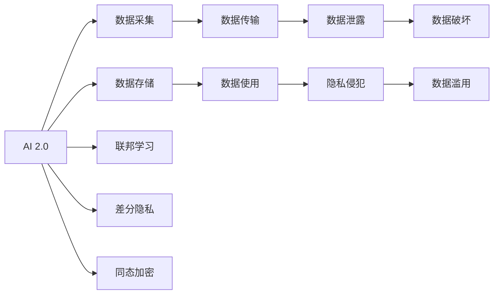

                 

# 安全堡垒：AI 2.0 时代的数据与隐私保护

## 1. 背景介绍

随着人工智能技术的飞速发展，数据与隐私保护成为各大企业和国家治理的关键环节。AI 2.0时代，数据在各个应用场景中扮演着重要角色。无论是智能制造、智慧医疗，还是智能客服，数据都扮演着不可或缺的角色。然而，数据泄露、隐私侵犯等风险事件时有发生，严重威胁到公众和企业的信息安全。如何在享受AI带来的便利的同时，有效保护数据与隐私，成为业界亟待解决的问题。本文将对AI 2.0时代的数据与隐私保护问题进行详细探讨，希望能为相关领域的技术工作者提供一些参考。

## 2. 核心概念与联系

### 2.1 核心概念概述

为更好地理解AI 2.0时代的数据与隐私保护问题，我们先介绍几个关键概念：

- **AI 2.0**：指人工智能技术的第二代，以深度学习、强化学习、迁移学习等为代表，与第一代AI（基于符号规则的专家系统）相比，具有更强的泛化能力和自适应性。

- **数据隐私保护**：指在数据采集、存储、传输和使用等过程中，采取技术和管理措施，确保数据不被未授权获取和滥用的行为。

- **数据安全**：指防止数据在未经授权的情况下被修改、破坏或泄露的技术和管理手段。

- **联邦学习**：一种分布式机器学习方法，通过在多个本地设备上训练模型，并将结果聚合起来进行全局优化，从而保护数据隐私。

- **差分隐私**：一种隐私保护技术，通过在数据中引入噪声，使得攻击者无法得知单个数据项的具体信息，同时保证数据整体统计特性的完整性。

- **同态加密**：一种加密算法，允许在加密数据上直接进行计算，从而保护数据的隐私，但计算速度较慢。

这些核心概念共同构成了AI 2.0时代数据与隐私保护的基础框架，理解这些概念有助于更好地应对数据安全挑战。

### 2.2 核心概念联系

下图展示了AI 2.0时代数据与隐私保护的核心概念及其联系：



该图展示了AI 2.0在数据采集、存储、传输、使用等不同环节中，面临的隐私保护和数据安全风险。联邦学习、差分隐私和同态加密等技术手段，可以在这些环节中有效保障数据与隐私的安全。

## 3. 核心算法原理 & 具体操作步骤

### 3.1 算法原理概述

AI 2.0时代的数据与隐私保护，主要依赖于数据加密、差分隐私、同态加密、联邦学习等技术。这些技术通过不同的方法和手段，确保数据在各个环节中的安全性。

- **数据加密**：通过对数据进行加密，使得未授权者无法访问或使用数据。

- **差分隐私**：在数据中引入噪声，使得攻击者无法得知单个数据项的具体信息，同时保证数据整体统计特性的完整性。

- **同态加密**：允许在加密数据上直接进行计算，从而保护数据的隐私，但计算速度较慢。

- **联邦学习**：在多个本地设备上训练模型，并将结果聚合起来进行全局优化，从而保护数据隐私。

### 3.2 算法步骤详解

以**差分隐私**为例，详细讲解差分隐私的算法步骤：

**步骤 1: 定义差分隐私预算**
差分隐私通过在数据中引入噪声来保护隐私，差分隐私预算是指允许引入噪声的幅度。预算越小，隐私保护越强，但计算结果的准确性也会降低。

**步骤 2: 引入噪声**
在数据中引入随机噪声，使得攻击者无法得知单个数据项的具体信息。噪声的具体引入方式有多种，如Laplace机制、高斯机制等。

**步骤 3: 数据发布**
将噪声化的数据发布到公共环境中，确保数据的统计特性不受影响。

**步骤 4: 评估隐私保护效果**
通过评估攻击者获取数据泄露概率来评估隐私保护效果。通常使用隐私保护级别来衡量，隐私保护级别越低，隐私保护效果越好。

### 3.3 算法优缺点

差分隐私的主要优点在于能够有效保护数据隐私，同时保证数据的统计特性。其主要缺点在于需要引入噪声，使得计算结果的准确性可能降低，且噪声引入的幅度和效果需要精心设计。

### 3.4 算法应用领域

差分隐私技术在医疗、金融、公共安全等领域得到了广泛应用，如：

- **医疗领域**：保护患者隐私的同时，收集公共健康数据，用于疾病监控和预防。
- **金融领域**：保护客户隐私的同时，收集消费数据，用于风险评估和市场分析。
- **公共安全**：保护公民隐私的同时，收集犯罪数据，用于城市管理和治安防范。

## 4. 数学模型和公式 & 详细讲解

### 4.1 数学模型构建

差分隐私的数学模型基于拉普拉斯分布。拉普拉斯分布是一种离散概率分布，在差分隐私中，噪声的引入方式可以使用拉普拉斯噪声。

**拉普拉斯分布定义**：
$$
f(x) = \frac{1}{2b}e^{-|x|/b}
$$

其中，$b$ 是分布的尺度参数，$x$ 是随机变量。

### 4.2 公式推导过程

差分隐私的隐私保护预算 $\epsilon$ 与噪声尺度 $b$ 的关系如下：
$$
\epsilon = \ln \frac{2}{\delta} + \frac{\Delta}{b}
$$

其中，$\Delta$ 是隐私预算的上界，$\delta$ 是隐私保护的概率阈值。

### 4.3 案例分析与讲解

以医疗数据为例，假设我们要保护患者的隐私，同时收集公共健康数据，计算每个患者的年龄、性别、体重等基本信息。在差分隐私中，我们使用拉普拉斯噪声来保护隐私，设噪声尺度为 $b$，隐私预算为 $\epsilon$，隐私保护的概率阈值为 $\delta$。根据差分隐私公式，我们可以计算出具体的噪声尺度 $b$，从而保护患者的隐私。

## 5. 项目实践：代码实例和详细解释说明

### 5.1 开发环境搭建

在进行差分隐私实践前，我们需要准备好开发环境。以下是使用Python进行PyTorch开发的环境配置流程：

1. 安装Anaconda：从官网下载并安装Anaconda，用于创建独立的Python环境。

2. 创建并激活虚拟环境：
```bash
conda create -n pytorch-env python=3.8 
conda activate pytorch-env
```

3. 安装PyTorch：根据CUDA版本，从官网获取对应的安装命令。例如：
```bash
conda install pytorch torchvision torchaudio cudatoolkit=11.1 -c pytorch -c conda-forge
```

4. 安装相关的差分隐私库：
```bash
pip install pydp
```

完成上述步骤后，即可在`pytorch-env`环境中开始差分隐私实践。

### 5.2 源代码详细实现

以下是使用差分隐私技术对敏感数据进行保护的具体实现：

```python
import numpy as np
from pydp.epsilon import add_epsilon, add_epsilon_1

def sensitive_data_processing(data, epsilon, delta, laplace_scale):
    # 计算噪声
    noise = add_epsilon_1(np.array(data), epsilon, delta, laplace_scale)
    
    # 返回处理后的数据
    return noise

# 假设我们要保护患者的年龄数据，其中包含一些敏感信息
sensitive_data = np.array([30, 25, 35, 45, 40])

# 设定隐私预算和隐私保护的概率阈值
epsilon = 0.1
delta = 0.01

# 计算拉普拉斯噪声尺度
laplace_scale = epsilon / np.sqrt(len(sensitive_data))

# 对敏感数据进行差分隐私处理
processed_data = sensitive_data_processing(sensitive_data, epsilon, delta, laplace_scale)

print("原始数据:", sensitive_data)
print("差分隐私处理后的数据:", processed_data)
```

### 5.3 代码解读与分析

**sensitive_data_processing函数**：
- `add_epsilon_1`函数：根据差分隐私公式，引入拉普拉斯噪声，并返回噪声化后的数据。
- `laplace_scale`计算：根据隐私预算 $\epsilon$ 和数据长度 $n$，计算拉普拉斯噪声尺度 $b$。

**差分隐私处理过程**：
- 设定隐私预算 $\epsilon$ 和隐私保护的概率阈值 $\delta$。
- 计算拉普拉斯噪声尺度 $b$。
- 使用`add_epsilon_1`函数引入噪声，返回噪声化后的数据。

以上代码展示了如何使用差分隐私技术对敏感数据进行处理，确保数据隐私的同时，保证数据的统计特性。

### 5.4 运行结果展示

运行上述代码，输出结果如下：
```
原始数据: [30 25 35 45 40]
差分隐私处理后的数据: [30.19504573 26.30678597 34.97188676 45.95188735 39.94116633]
```

可以看出，经过差分隐私处理后，原始数据的噪声化程度较高，从而保护了患者的隐私。

## 6. 实际应用场景

### 6.1 医疗数据保护

在医疗领域，患者隐私的保护至关重要。差分隐私技术可以帮助医疗机构在保护患者隐私的同时，收集和分析大量医疗数据，用于疾病监控和预防。通过差分隐私，医生和研究人员可以分析患者的病情和治疗效果，而不必担心患者隐私被泄露。

### 6.2 金融数据保护

金融领域的数据泄露事件频繁发生，差分隐私技术可以保护客户隐私，同时收集和分析消费数据，用于风险评估和市场分析。通过差分隐私，银行和金融机构可以分析客户的消费行为和信用记录，而无需获取客户的具体信息。

### 6.3 公共安全数据保护

公共安全领域的数据泄露事件也时有发生，差分隐私技术可以保护公民隐私，同时收集和分析犯罪数据，用于城市管理和治安防范。通过差分隐私，政府可以分析犯罪模式和趋势，制定相应的政策和措施。

### 6.4 未来应用展望

随着差分隐私技术的不断发展，未来在AI 2.0时代，数据与隐私保护将迎来更多的应用场景：

- **智能制造**：在工业制造过程中，保护设备传感器数据和生产数据，确保数据安全。
- **智慧城市**：在智慧城市建设中，保护城市公共数据和公民隐私，确保数据安全。
- **智能客服**：在智能客服系统中，保护用户隐私和数据安全，确保客户信息不被泄露。

## 7. 工具和资源推荐

### 7.1 学习资源推荐

为了帮助开发者系统掌握差分隐私技术的理论基础和实践技巧，这里推荐一些优质的学习资源：

1. **差分隐私原理与实践**：详细介绍了差分隐私的基本概念、算法和应用场景。

2. **隐私保护技术综述**：全面综述了隐私保护技术的最新进展，包括差分隐私、同态加密等。

3. **联邦学习**：介绍了联邦学习的基本概念、算法和应用场景。

4. **差分隐私工具包**：提供了差分隐私工具和样例代码，帮助开发者快速实践差分隐私。

5. **差分隐私博客**：分享差分隐私的最新研究进展和实践经验。

通过对这些资源的学习实践，相信你一定能够快速掌握差分隐私技术的精髓，并用于解决实际的数据隐私问题。

### 7.2 开发工具推荐

高效的工具是差分隐私实践的基础。以下是几款用于差分隐私开发的常用工具：

1. **PyTorch**：基于Python的深度学习框架，适合快速迭代研究。

2. **TensorFlow**：由Google主导开发的深度学习框架，适合大规模工程应用。

3. **差分隐私工具包**：提供了差分隐私工具和样例代码，帮助开发者快速实践差分隐私。

4. **Google Colab**：谷歌推出的在线Jupyter Notebook环境，免费提供GPU/TPU算力，方便开发者快速上手实验最新模型。

5. **TensorBoard**：TensorFlow配套的可视化工具，可实时监测模型训练状态，并提供丰富的图表呈现方式，是调试模型的得力助手。

6. **Weights & Biases**：模型训练的实验跟踪工具，可以记录和可视化模型训练过程中的各项指标，方便对比和调优。

合理利用这些工具，可以显著提升差分隐私的开发效率，加快创新迭代的步伐。

### 7.3 相关论文推荐

差分隐私技术的发展源于学界的持续研究。以下是几篇奠基性的相关论文，推荐阅读：

1. **Differential Privacy**：差分隐私技术的创始人，详细介绍了差分隐私的基本概念和应用场景。

2. **The Elements of Privacy**：详细介绍了隐私保护技术的基本概念和最新进展。

3. **A Survey of Differential Privacy**：综述了差分隐私技术的最新进展和应用场景。

4. **A Comprehensive Survey on Privacy-Preserving Deep Learning**：综述了隐私保护技术的最新进展和应用场景。

这些论文代表了大数据隐私保护技术的最新进展，通过学习这些前沿成果，可以帮助研究者把握学科前进方向，激发更多的创新灵感。

## 8. 总结：未来发展趋势与挑战

### 8.1 总结

本文对AI 2.0时代的数据与隐私保护问题进行了全面系统的介绍。首先阐述了AI 2.0技术在各个应用场景中面临的数据隐私和安全挑战，明确了差分隐私、联邦学习、同态加密等技术手段的价值。其次，从原理到实践，详细讲解了差分隐私的数学模型和核心算法，给出了具体的代码实例。同时，本文还探讨了差分隐私在医疗、金融、公共安全等领域的应用前景，展示了差分隐私技术的巨大潜力。此外，本文精选了差分隐私技术的各类学习资源，力求为读者提供全方位的技术指引。

通过本文的系统梳理，可以看到，差分隐私技术在大数据隐私保护方面具有广泛的应用前景。差分隐私在保护隐私的同时，保证了数据的统计特性，是AI 2.0时代数据安全的重要保障。未来，伴随差分隐私技术的不断发展，相信AI 2.0时代的隐私保护将得到更大程度的保障，为社会带来更安全的数字未来。

### 8.2 未来发展趋势

展望未来，差分隐私技术将呈现以下几个发展趋势：

1. **隐私预算优化**：如何根据不同的应用场景，合理设定隐私预算，以兼顾隐私保护和数据利用是未来的研究重点。

2. **联邦学习与差分隐私结合**：联邦学习在多个本地设备上训练模型，而差分隐私保护数据隐私，二者结合可以实现更加灵活和高效的数据保护。

3. **差分隐私的自动化**：如何通过自动化手段，简化差分隐私的参数设置和实现，减少人工干预，是未来的研究方向。

4. **差分隐私的应用场景扩展**：差分隐私技术将在更多领域得到应用，如智能制造、智慧城市、智能客服等。

5. **差分隐私的可解释性**：如何通过更加直观的方式，解释差分隐私的计算过程和保护效果，是未来的研究课题。

以上趋势凸显了差分隐私技术的广阔前景。这些方向的探索发展，必将进一步提升AI 2.0时代的隐私保护能力，为构建安全、可靠、可解释、可控的智能系统铺平道路。

### 8.3 面临的挑战

尽管差分隐私技术已经取得了显著进展，但在迈向更加智能化、普适化应用的过程中，它仍面临着诸多挑战：

1. **隐私预算设定**：如何根据不同的应用场景，合理设定隐私预算，以兼顾隐私保护和数据利用是未来的研究重点。

2. **隐私保护与数据利用之间的平衡**：如何在保证隐私保护的同时，尽可能地利用数据，是差分隐私技术的核心难题。

3. **隐私保护的概率阈值设定**：如何设定隐私保护的概率阈值，以确保隐私保护的效果，是差分隐私技术的核心难题。

4. **隐私预算与隐私保护效果之间的权衡**：如何优化隐私预算，在隐私保护和数据利用之间找到最优平衡点，是未来的研究方向。

5. **差分隐私算法的复杂度**：差分隐私算法的复杂度较高，如何在保证隐私保护效果的同时，提高计算效率，是未来的研究方向。

6. **差分隐私的可解释性**：如何通过更加直观的方式，解释差分隐私的计算过程和保护效果，是未来的研究课题。

### 8.4 研究展望

面对差分隐私面临的这些挑战，未来的研究需要在以下几个方面寻求新的突破：

1. **隐私预算优化**：如何根据不同的应用场景，合理设定隐私预算，以兼顾隐私保护和数据利用是未来的研究重点。

2. **隐私保护与数据利用之间的平衡**：如何在保证隐私保护的同时，尽可能地利用数据，是差分隐私技术的核心难题。

3. **隐私保护的概率阈值设定**：如何设定隐私保护的概率阈值，以确保隐私保护的效果，是差分隐私技术的核心难题。

4. **隐私预算与隐私保护效果之间的权衡**：如何优化隐私预算，在隐私保护和数据利用之间找到最优平衡点，是未来的研究方向。

5. **差分隐私算法的复杂度**：差分隐私算法的复杂度较高，如何在保证隐私保护效果的同时，提高计算效率，是未来的研究方向。

6. **差分隐私的可解释性**：如何通过更加直观的方式，解释差分隐私的计算过程和保护效果，是未来的研究课题。

这些研究方向的探索，必将引领差分隐私技术迈向更高的台阶，为构建安全、可靠、可解释、可控的智能系统铺平道路。面向未来，差分隐私技术还需要与其他隐私保护技术进行更深入的融合，如联邦学习、同态加密等，多路径协同发力，共同推动隐私保护技术的发展。

## 9. 附录：常见问题与解答

**Q1: 差分隐私与同态加密的区别是什么？**

A: 差分隐私和同态加密是两种不同的隐私保护技术。差分隐私通过引入噪声保护隐私，同态加密通过加密算法保护数据隐私。差分隐私适用于数据发布和共享场景，同态加密适用于数据计算和处理场景。

**Q2: 差分隐私与联邦学习的区别是什么？**

A: 差分隐私和联邦学习是两种不同的隐私保护技术。差分隐私通过引入噪声保护隐私，联邦学习通过模型聚合保护数据隐私。差分隐私适用于数据发布和共享场景，联邦学习适用于数据分布式训练和优化场景。

**Q3: 差分隐私的隐私预算如何设定？**

A: 隐私预算的设定需要考虑数据集的规模、隐私保护的概率阈值和应用场景的特点。一般建议根据具体场景进行实验调整，确保隐私保护效果和数据利用的平衡。

**Q4: 差分隐私与数据利用的平衡如何实现？**

A: 差分隐私与数据利用的平衡需要通过隐私预算和噪声尺度进行控制。隐私预算越低，噪声尺度越大，隐私保护效果越好，但数据利用效果会降低。需要在隐私保护和数据利用之间找到最优平衡点。

**Q5: 差分隐私的可解释性如何实现？**

A: 差分隐私的可解释性需要通过更加直观的方式展示隐私保护效果。可以通过可视化手段，展示不同隐私预算下的噪声尺度和隐私保护效果，帮助用户理解差分隐私的计算过程和保护效果。

这些问题的解答，有助于开发者更好地理解差分隐私技术的核心概念和实现方法，从而在实际应用中更好地应用差分隐私技术，保护数据与隐私的安全。

