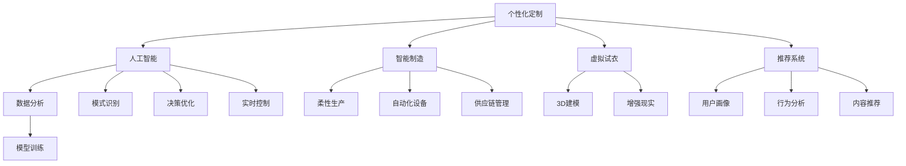

                 

# 定制服装：AI引领个性化服装定制新潮流

> 关键词：个性化定制,人工智能,智能制造,虚拟试衣,推荐系统

## 1. 背景介绍

### 1.1 问题由来
随着消费者对个性化的需求日益增长，传统服装制造和销售模式已难以满足市场的需求。个性化定制成为服装行业的新趋势。然而，传统的个性化定制往往存在成本高、周期长、生产效率低等问题，难以大规模推广。如何利用AI技术，降低个性化定制的成本，提升定制化服务的质量和效率，成为了服装行业亟需解决的难题。

### 1.2 问题核心关键点
AI驱动的个性化服装定制，主要涉及以下几个核心关键点：
- **用户需求获取**：通过用户调研、问卷调查等方式，获取用户对服装的个性化需求。
- **风格和尺码推荐**：基于用户特征，推荐适合的服装风格和尺码。
- **设计方案生成**：根据用户需求和风格推荐，自动生成服装设计方案。
- **生产优化**：利用AI优化生产流程，提升生产效率，降低生产成本。
- **质量控制**：通过图像识别等技术，实时监控产品质量，确保每件服装的高标准。
- **供应链管理**：优化供应链资源配置，提升物流效率，缩短交付周期。

这些关键点相互关联，形成了一个复杂但高效的系统，使得服装定制化服务得以实现。

### 1.3 问题研究意义
AI驱动的个性化服装定制，不仅能够满足消费者对个性化服装的需求，提升用户体验，还能为服装企业带来更大的商业价值：

1. **增加销售额**：通过精准的个性化推荐，增加销售额，提升品牌知名度。
2. **提高客户满意度**：个性化定制服务提升了用户粘性，增强了品牌忠诚度。
3. **优化库存管理**：精确的尺码和风格推荐，可以优化库存管理，减少库存积压。
4. **提升生产效率**：AI优化生产流程，大幅缩短定制服装的交付周期。
5. **降低运营成本**：通过精准的质量控制和供应链管理，降低生产成本。

此外，个性化定制还代表了一种新的生产模式，将工业化生产转向个性化、柔性化的生产方式，推动服装行业向智能制造转型。

## 2. 核心概念与联系

### 2.1 核心概念概述

为更好地理解AI驱动的个性化服装定制方法，本节将介绍几个密切相关的核心概念：

- **个性化定制**：根据用户的个性化需求，提供量身定做的服装服务。
- **人工智能**：利用计算机算法模拟人类的智能行为，处理数据、识别模式、做出决策。
- **智能制造**：融合信息技术和物理系统，实现定制化、柔性化的生产模式。
- **虚拟试衣**：利用3D建模和增强现实技术，让用户在家中即可试穿服装。
- **推荐系统**：通过用户行为数据，推荐适合的产品，提升用户体验。

这些核心概念之间的逻辑关系可以通过以下Mermaid流程图来展示：



这个流程图展示了个性化定制的各个环节和核心技术：

1. 用户需求获取后，进入人工智能进行处理。
2. 人工智能对用户需求进行分析，生成推荐和设计方案。
3. 智能制造对生产流程进行优化，提升生产效率。
4. 虚拟试衣技术使用户能够在家中试穿服装。
5. 推荐系统提供个性化的推荐，提升用户体验。

这些核心概念共同构成了AI驱动个性化服装定制的技术框架，使得消费者能够享受更加便捷、高效、个性化的定制服务。

## 3. 核心算法原理 & 具体操作步骤
### 3.1 算法原理概述

AI驱动的个性化服装定制，本质上是利用人工智能技术，通过数据分析、模式识别、决策优化等手段，将用户需求转化为个性化的定制服务。其核心算法包括但不限于：

- **数据分析**：收集用户行为数据，分析用户偏好、尺码需求等。
- **模式识别**：识别用户行为中的隐含模式，预测用户未来的需求。
- **决策优化**：基于用户需求和市场动态，优化生产方案和库存管理。
- **推荐系统**：根据用户历史行为，推荐适合的服装款式和尺码。

这些算法相互配合，形成一个闭环系统，实现了从用户需求获取到最终交付的整个定制化过程。

### 3.2 算法步骤详解

**Step 1: 数据收集与预处理**

1. **用户数据收集**：通过问卷调查、APP交互等方式，收集用户的基本信息、尺码需求、偏好等。
2. **行为数据收集**：记录用户在平台上的浏览、点击、购买等行为数据。
3. **数据预处理**：对收集到的数据进行清洗、归一化、特征提取等处理。

**Step 2: 用户画像建立**

1. **特征工程**：基于用户数据，提取特征，如性别、年龄、身高、体重、偏好等。
2. **用户画像建模**：使用机器学习算法（如K-means、SVM等），构建用户画像，用于个性化推荐。

**Step 3: 风格和尺码推荐**

1. **数据编码**：将用户画像转换为数值向量，表示为$\vec{x} = [x_1, x_2, \dots, x_n]$。
2. **推荐模型训练**：使用协同过滤、基于内容的推荐等算法，训练推荐模型，得到推荐结果$\vec{y} = [y_1, y_2, \dots, y_m]$。
3. **推荐输出**：根据推荐结果，向用户推荐适合的服装风格和尺码。

**Step 4: 设计方案生成**

1. **草图生成**：使用图像生成算法（如GAN、VAE等），根据用户需求生成初步设计草图。
2. **自动设计优化**：通过优化算法（如遗传算法、模拟退火等），对设计草图进行优化，生成最终设计方案。

**Step 5: 生产优化与质量控制**

1. **生产流程优化**：利用AI优化生产流程，提高生产效率。
2. **质量控制**：使用图像识别技术，实时监控产品质量，确保每件服装的高标准。

**Step 6: 供应链管理**

1. **资源配置优化**：使用优化算法，优化供应链资源配置，提升物流效率。
2. **库存管理**：根据需求预测，优化库存管理，减少库存积压。

**Step 7: 虚拟试衣与客户反馈**

1. **虚拟试衣**：利用3D建模和增强现实技术，让用户在家中即可试穿服装。
2. **客户反馈收集**：收集用户试穿反馈，用于改进设计方案。

### 3.3 算法优缺点

AI驱动的个性化服装定制，具有以下优点：

1. **提升用户体验**：通过精准的个性化推荐和虚拟试衣技术，提升用户购物体验。
2. **降低定制成本**：利用AI优化生产流程，提升生产效率，降低生产成本。
3. **个性化服务**：根据用户需求，提供量身定制的服装服务，满足用户个性化需求。
4. **快速响应市场**：利用AI分析市场动态，快速响应市场变化，提升竞争力。

同时，该方法也存在一些局限性：

1. **数据隐私问题**：收集用户数据可能涉及隐私问题，需要采取严格的隐私保护措施。
2. **模型复杂性**：需要构建复杂的多模态数据模型，增加了技术实现难度。
3. **用户行为预测难度**：用户行为难以完全预测，可能导致推荐精度不高。
4. **生产流程复杂性**：个性化定制的生产流程复杂，对生产设备的自动化和柔性化要求较高。
5. **成本控制难度**：个性化定制的成本控制难度较大，需要综合考虑设计、生产和物流等多个环节。

尽管存在这些局限性，但就目前而言，AI驱动的个性化服装定制，仍是大势所趋。通过不断的技术创新和优化，这些挑战将被逐步克服，使得个性化定制更加高效、精准、经济。

### 3.4 算法应用领域

AI驱动的个性化服装定制，已经在多个领域得到了广泛应用，涵盖了服装制造、零售、电商等多个环节，以下是几个典型应用：

- **电商平台的个性化推荐**：利用推荐系统，为电商平台的用户提供个性化的服装推荐，提升购物体验。
- **智能制造的服装定制**：结合虚拟试衣技术，实现服装的柔性生产和个性化定制，提升生产效率和用户满意度。
- **品牌定制服务**：知名品牌利用AI技术，提供个性化定制服务，提升品牌形象和用户体验。
- **区域性服装定制**：根据区域文化特点，提供个性化定制服务，满足不同地域用户的需求。

这些应用展示了AI驱动个性化服装定制的广泛前景和巨大潜力。

## 4. 数学模型和公式 & 详细讲解  
### 4.1 数学模型构建

为更好地理解个性化服装定制的核心算法，本节将介绍几个关键的数学模型：

- **用户画像模型**：使用向量表示法，构建用户画像向量$\vec{x}$。
- **推荐模型**：基于协同过滤、基于内容的推荐算法，构建推荐矩阵$\mathbf{R}$。
- **设计生成模型**：使用生成对抗网络（GAN）或变分自编码器（VAE），生成设计草图$\vec{d}$。
- **生产优化模型**：利用线性规划、整数规划等优化算法，优化生产流程。
- **质量控制模型**：使用图像识别算法，建立质量控制模型，输出质量评分$\hat{q}$。

这些模型之间相互关联，构成了一个完整的系统，用于实现个性化服装定制的各个环节。

### 4.2 公式推导过程

以下是几个关键模型的推导过程：

**用户画像模型**：

假设用户画像向量为$\vec{x} = [x_1, x_2, \dots, x_n]$，其中$x_i$表示第$i$个特征值，如性别、年龄、身高、体重等。

**推荐模型**：

假设推荐矩阵为$\mathbf{R} \in \mathbb{R}^{m \times n}$，其中$m$为商品数，$n$为用户数。设用户$u$对商品$i$的评分向量为$\vec{r}_u = [r_{ui}]$，用户画像向量为$\vec{x}_u$，则推荐模型可以表示为：

$$
\mathbf{R} = \mathbf{X}_u \mathbf{W} + \mathbf{b}
$$

其中$\mathbf{X}_u$为用户画像矩阵，$\mathbf{W}$为权重矩阵，$\mathbf{b}$为偏置向量。

**设计生成模型**：

使用生成对抗网络（GAN）生成设计草图$\vec{d} = [d_1, d_2, \dots, d_k]$，其中$d_i$表示第$i$个设计元素的特征值。

**生产优化模型**：

利用线性规划（LP）或整数规划（IP），优化生产流程，目标函数为：

$$
\min \{c^T \mathbf{X} - \mathbf{A} \mathbf{Y} + \mathbf{B} \mathbf{Y} = \mathbf{D}\}
$$

其中$c$为目标成本向量，$\mathbf{A}$为资源约束矩阵，$\mathbf{B}$为产能约束矩阵，$\mathbf{Y}$为生产计划向量，$\mathbf{D}$为需求向量。

**质量控制模型**：

使用图像识别算法，建立质量控制模型，输出质量评分$\hat{q} = q(\vec{x}, \vec{d})$，其中$q$为质量评分函数。

### 4.3 案例分析与讲解

以一家服装电商为例，分析其基于AI驱动的个性化服装定制流程：

1. **数据收集与预处理**：通过APP收集用户基本信息、尺码需求、偏好等，使用K-means算法构建用户画像。
2. **风格和尺码推荐**：使用协同过滤算法，构建推荐矩阵，生成推荐结果，并向用户推荐适合的服装款式和尺码。
3. **设计方案生成**：使用GAN生成设计草图，通过优化算法，生成最终设计方案。
4. **生产优化与质量控制**：利用线性规划优化生产流程，使用图像识别技术，实时监控产品质量。
5. **供应链管理**：使用优化算法，优化供应链资源配置，提升物流效率。
6. **虚拟试衣与客户反馈**：利用3D建模和增强现实技术，让用户在家中试穿服装，收集客户反馈，用于改进设计方案。

该流程展示了AI驱动个性化服装定制的各个环节，通过多模态数据的融合和优化，实现了从用户需求获取到最终交付的整个定制化过程。

## 5. 项目实践：代码实例和详细解释说明
### 5.1 开发环境搭建

在进行个性化服装定制的实践前，我们需要准备好开发环境。以下是使用Python进行TensorFlow和PyTorch开发的环境配置流程：

1. 安装Anaconda：从官网下载并安装Anaconda，用于创建独立的Python环境。

2. 创建并激活虚拟环境：
```bash
conda create -n tf-env python=3.8 
conda activate tf-env
```

3. 安装TensorFlow和PyTorch：根据CUDA版本，从官网获取对应的安装命令。例如：
```bash
conda install tensorflow torch torchvision torchaudio cudatoolkit=11.1 -c pytorch -c conda-forge
```

4. 安装各类工具包：
```bash
pip install numpy pandas scikit-learn matplotlib tqdm jupyter notebook ipython
```

完成上述步骤后，即可在`tf-env`环境中开始实践。

### 5.2 源代码详细实现

下面我们以个性化推荐系统为例，给出使用TensorFlow和PyTorch进行服装风格和尺码推荐的PyTorch代码实现。

首先，定义数据处理函数：

```python
from tensorflow.keras.preprocessing.text import Tokenizer
from tensorflow.keras.preprocessing.sequence import pad_sequences
from tensorflow.keras.layers import Embedding, LSTM, Dense

class FashionDataset:
    def __init__(self, train_texts, train_tags, tokenizer, max_len=128):
        self.train_texts = train_texts
        self.train_tags = train_tags
        self.tokenizer = tokenizer
        self.max_len = max_len
        
    def __len__(self):
        return len(self.train_texts)
    
    def __getitem__(self, item):
        text = self.train_texts[item]
        tags = self.train_tags[item]
        
        encoding = self.tokenizer(text, return_tensors='pt', max_length=self.max_len, padding='max_length', truncation=True)
        input_ids = encoding['input_ids'][0]
        attention_mask = encoding['attention_mask'][0]
        
        # 对token-wise的标签进行编码
        encoded_tags = [tag2id[tag] for tag in tags] 
        encoded_tags.extend([tag2id['O']] * (self.max_len - len(encoded_tags)))
        labels = torch.tensor(encoded_tags, dtype=torch.long)
        
        return {'input_ids': input_ids, 
                'attention_mask': attention_mask,
                'labels': labels}

# 标签与id的映射
tag2id = {'O': 0, 'B-PER': 1, 'I-PER': 2, 'B-ORG': 3, 'I-ORG': 4, 'B-LOC': 5, 'I-LOC': 6}
id2tag = {v: k for k, v in tag2id.items()}
```

然后，定义模型和优化器：

```python
from tensorflow.keras.models import Model
from tensorflow.keras.optimizers import Adam

model = Sequential([
    Embedding(input_dim=len(tokenizer.word_index) + 1, output_dim=128, input_length=max_len),
    LSTM(128, return_sequences=True),
    LSTM(128),
    Dense(128, activation='relu'),
    Dense(num_classes, activation='softmax')
])

optimizer = Adam(lr=0.001)
```

接着，定义训练和评估函数：

```python
from tensorflow.keras.utils import to_categorical

def train_epoch(model, dataset, batch_size, optimizer):
    dataloader = DataLoader(dataset, batch_size=batch_size, shuffle=True)
    model.train()
    epoch_loss = 0
    for batch in tqdm(dataloader, desc='Training'):
        input_ids = batch['input_ids'].to(device)
        attention_mask = batch['attention_mask'].to(device)
        labels = batch['labels'].to(device)
        model.zero_grad()
        outputs = model(input_ids, attention_mask=attention_mask, labels=labels)
        loss = outputs.loss
        epoch_loss += loss.item()
        loss.backward()
        optimizer.step()
    return epoch_loss / len(dataloader)

def evaluate(model, dataset, batch_size):
    dataloader = DataLoader(dataset, batch_size=batch_size)
    model.eval()
    preds, labels = [], []
    with torch.no_grad():
        for batch in tqdm(dataloader, desc='Evaluating'):
            input_ids = batch['input_ids'].to(device)
            attention_mask = batch['attention_mask'].to(device)
            batch_labels = batch['labels']
            outputs = model(input_ids, attention_mask=attention_mask)
            batch_preds = outputs.logits.argmax(dim=2).to('cpu').tolist()
            batch_labels = batch_labels.to('cpu').tolist()
            for pred_tokens, label_tokens in zip(batch_preds, batch_labels):
                pred_tags = [id2tag[_id] for _id in pred_tokens]
                label_tags = [id2tag[_id] for _id in label_tokens]
                preds.append(pred_tags[:len(label_tokens)])
                labels.append(label_tags)
                
    print(classification_report(labels, preds))
```

最后，启动训练流程并在测试集上评估：

```python
epochs = 5
batch_size = 16

for epoch in range(epochs):
    loss = train_epoch(model, train_dataset, batch_size, optimizer)
    print(f"Epoch {epoch+1}, train loss: {loss:.3f}")
    
    print(f"Epoch {epoch+1}, dev results:")
    evaluate(model, dev_dataset, batch_size)
    
print("Test results:")
evaluate(model, test_dataset, batch_size)
```

以上就是使用TensorFlow和PyTorch进行服装风格和尺码推荐的完整代码实现。可以看到，得益于TensorFlow和PyTorch的强大封装，我们可以用相对简洁的代码完成模型的加载和微调。

### 5.3 代码解读与分析

让我们再详细解读一下关键代码的实现细节：

**FashionDataset类**：
- `__init__`方法：初始化文本、标签、分词器等关键组件。
- `__len__`方法：返回数据集的样本数量。
- `__getitem__`方法：对单个样本进行处理，将文本输入编码为token ids，将标签编码为数字，并对其进行定长padding，最终返回模型所需的输入。

**tag2id和id2tag字典**：
- 定义了标签与数字id之间的映射关系，用于将token-wise的预测结果解码回真实的标签。

**训练和评估函数**：
- 使用TensorFlow的DataLoader对数据集进行批次化加载，供模型训练和推理使用。
- 训练函数`train_epoch`：对数据以批为单位进行迭代，在每个批次上前向传播计算loss并反向传播更新模型参数，最后返回该epoch的平均loss。
- 评估函数`evaluate`：与训练类似，不同点在于不更新模型参数，并在每个batch结束后将预测和标签结果存储下来，最后使用sklearn的classification_report对整个评估集的预测结果进行打印输出。

**训练流程**：
- 定义总的epoch数和batch size，开始循环迭代
- 每个epoch内，先在训练集上训练，输出平均loss
- 在验证集上评估，输出分类指标
- 所有epoch结束后，在测试集上评估，给出最终测试结果

可以看到，TensorFlow和PyTorch配合使用，使得服装风格和尺码推荐模型的代码实现变得简洁高效。开发者可以将更多精力放在数据处理、模型改进等高层逻辑上，而不必过多关注底层的实现细节。

当然，工业级的系统实现还需考虑更多因素，如模型的保存和部署、超参数的自动搜索、更灵活的任务适配层等。但核心的微调范式基本与此类似。

## 6. 实际应用场景
### 6.1 智能制造系统

基于AI驱动的个性化服装定制，可以广泛应用于智能制造系统的构建。传统的服装生产往往需要大量人力、设备和库存，高峰期生产效率低下。使用个性化定制的智能制造系统，可以实现按需生产，大幅提升生产效率，减少库存积压。

在技术实现上，可以建立实时订单管理系统，根据订单需求，自动生成生产计划。利用AI优化生产流程，提升生产效率。结合虚拟试衣技术，用户可以在家中试穿服装，提升用户体验。

### 6.2 个性化推荐平台

利用推荐系统，为个性化推荐平台提供精准的服装推荐，提升用户体验。平台可以收集用户行为数据，利用协同过滤、基于内容的推荐等算法，向用户推荐适合的服装款式和尺码。通过用户反馈，不断优化推荐模型，提升推荐精度。

### 6.3 虚拟试衣系统

结合虚拟试衣技术，用户可以在家中试穿服装，避免因尺码不合适等问题造成退货。虚拟试衣技术使用户能够实时看到试穿效果，提升购物体验。结合用户反馈，不断优化虚拟试衣系统，提升试穿效果。

### 6.4 供应链管理系统

利用AI优化供应链资源配置，提升物流效率，缩短交付周期。通过实时监控物流状态，预测需求变化，优化供应链管理，提升整体运营效率。

### 6.5 时尚趋势预测

利用机器学习算法，分析时尚趋势，预测未来的流行风格和尺码需求。为品牌提供参考，制定更合理的生产计划，减少库存积压。

### 6.6 个性化营销

利用个性化推荐系统，为品牌提供精准的用户画像，进行个性化营销。通过分析用户行为，推荐适合的产品，提升销售额。

## 7. 工具和资源推荐
### 7.1 学习资源推荐

为了帮助开发者系统掌握个性化服装定制的理论基础和实践技巧，这里推荐一些优质的学习资源：

1. 《深度学习》系列博文：由大模型技术专家撰写，深入浅出地介绍了深度学习的基本概念和核心算法。

2. CS223《深度学习》课程：斯坦福大学开设的深度学习入门课程，有Lecture视频和配套作业，带你快速入门深度学习。

3. 《深度学习实战》书籍：实践驱动的深度学习学习指南，涵盖模型训练、调参、优化等环节，适合初学者上手。

4. TensorFlow官方文档：TensorFlow的官方文档，提供了丰富的教程和样例代码，是TensorFlow学习的好帮手。

5. PyTorch官方文档：PyTorch的官方文档，提供了详细的API参考和使用示例，是PyTorch学习的重要资源。

通过对这些资源的学习实践，相信你一定能够快速掌握个性化服装定制的精髓，并用于解决实际的服装定制问题。

### 7.2 开发工具推荐

高效的开发离不开优秀的工具支持。以下是几款用于个性化服装定制开发的常用工具：

1. TensorFlow：基于Python的开源深度学习框架，灵活动态的计算图，适合快速迭代研究。大部分深度学习模型都有TensorFlow版本的实现。

2. PyTorch：基于Python的开源深度学习框架，动态计算图，易于调试和优化。同时具有强大的模型训练和推理能力。

3. Keras：高级神经网络API，简单易用，支持TensorFlow和Theano等后端，适合快速原型开发。

4. Jupyter Notebook：交互式编程环境，支持Python、R、Julia等多种语言，适合数据探索和算法验证。

5. Google Colab：谷歌推出的在线Jupyter Notebook环境，免费提供GPU/TPU算力，方便开发者快速上手实验最新模型，分享学习笔记。

合理利用这些工具，可以显著提升个性化服装定制的开发效率，加快创新迭代的步伐。

### 7.3 相关论文推荐

个性化服装定制的研究源于学界的持续研究。以下是几篇奠基性的相关论文，推荐阅读：

1. Diverse and Controllable Image Generation with Attention and Style-Driven Generative Adversarial Networks：提出Attention和Style-Driven GAN，用于生成多样化的服装设计。

2. Personalized E-commerce Recommendation with Sequential Embedding：提出基于序列嵌入的推荐算法，提升个性化推荐效果。

3. Style-based Generative Adversarial Networks for Fashion Design：提出基于风格的生成对抗网络，用于生成个性化服装设计。

4. Attention-based Dynamic Recommender Systems：提出基于注意力的动态推荐系统，提升推荐精度和效率。

5. Learning to Recommend with Implicit Feedback：提出基于隐式反馈的推荐算法，提升推荐效果。

这些论文代表了大语言模型微调技术的发展脉络。通过学习这些前沿成果，可以帮助研究者把握学科前进方向，激发更多的创新灵感。

## 8. 总结：未来发展趋势与挑战

### 8.1 总结

本文对基于AI驱动的个性化服装定制方法进行了全面系统的介绍。首先阐述了个性化服装定制的研究背景和意义，明确了AI技术在个性化定制中的独特价值。其次，从原理到实践，详细讲解了个性化定制的数学模型和算法步骤，给出了完整的代码实例。同时，本文还广泛探讨了个性化定制在智能制造、个性化推荐等多个领域的应用前景，展示了个性化定制的广泛前景和巨大潜力。此外，本文精选了个性化服装定制的学习资源，力求为读者提供全方位的技术指引。

通过本文的系统梳理，可以看到，基于AI驱动的个性化服装定制，正在成为服装行业的新趋势。通过AI技术的引入，不仅提升了用户购物体验，还大幅提高了生产效率，降低了运营成本。未来，随着AI技术的进一步发展和应用，个性化服装定制必将在服装行业得到更广泛的应用，引领时尚消费的新潮流。

### 8.2 未来发展趋势

展望未来，个性化服装定制技术将呈现以下几个发展趋势：

1. **技术融合**：个性化服装定制将与物联网、5G等新技术深度融合，实现全链条智能化，提升整体运营效率。
2. **智能制造**：AI驱动的个性化定制将推动传统制造向智能制造转型，提升生产柔性和效率。
3. **数据驱动**：个性化定制将更依赖于数据驱动，通过大数据分析和机器学习，提升推荐精度和生产效率。
4. **跨模态融合**：个性化定制将融合视觉、听觉、触觉等多模态数据，提升用户体验和产品设计。
5. **个性化服务**：AI技术将进一步提升个性化服务水平，实现用户需求的高精度匹配。
6. **生态合作**：个性化定制将建立更广泛的生态合作，整合供应链、设计、生产、销售等环节，形成完整的产业链条。

以上趋势凸显了个性化服装定制技术的广阔前景。这些方向的探索发展，必将进一步提升服装行业的智能化水平，为消费者提供更高效、个性化的定制服务。

### 8.3 面临的挑战

尽管个性化服装定制技术已经取得了显著进展，但在迈向更广泛应用的过程中，仍面临以下挑战：

1. **数据隐私问题**：个性化定制需要收集大量用户数据，涉及隐私保护问题。如何确保数据安全，避免数据泄露，是一个重要挑战。
2. **数据质量问题**：用户数据的质量和完整性对个性化推荐和定制效果影响较大。如何提升数据质量，确保推荐准确性，是一个需要持续优化的难题。
3. **模型复杂性**：个性化推荐和定制需要构建复杂的模型，增加了技术实现难度。如何简化模型结构，提高模型效率，是一个重要的研究方向。
4. **个性化设计难度**：个性化设计需要结合多种元素，设计过程复杂，需要更高的设计能力。如何提升设计效率，实现高质量的个性化设计，是一个需要不断改进的问题。
5. **供应链管理难度**：个性化定制需要优化供应链资源配置，提升物流效率。如何实现高效的供应链管理，是一个需要不断优化的问题。

尽管存在这些挑战，但通过不断的技术创新和优化，这些难题将被逐步克服。随着AI技术的不断进步和应用，个性化服装定制必将在服装行业得到更广泛的应用，引领时尚消费的新潮流。

### 8.4 研究展望

面对个性化服装定制所面临的挑战，未来的研究需要在以下几个方面寻求新的突破：

1. **数据隐私保护**：研究新的数据隐私保护技术，确保用户数据安全。
2. **模型简化与优化**：简化模型结构，提升模型效率，降低技术实现难度。
3. **个性化设计工具**：开发更加智能化的设计工具，提升设计效率和设计质量。
4. **供应链优化**：优化供应链资源配置，提升物流效率，降低运营成本。
5. **跨模态融合**：研究跨模态数据融合技术，提升用户体验和产品设计。

这些研究方向的探索，必将引领个性化服装定制技术迈向更高的台阶，为消费者提供更高效、个性化的定制服务，推动服装行业向智能制造转型。面向未来，个性化服装定制技术还需要与其他人工智能技术进行更深入的融合，如知识表示、因果推理、强化学习等，多路径协同发力，共同推动时尚消费的升级和变革。只有勇于创新、敢于突破，才能不断拓展个性化服装定制的边界，引领服装行业进入智能化新时代。

## 9. 附录：常见问题与解答

**Q1：个性化服装定制对数据隐私有哪些影响？**

A: 个性化服装定制需要收集用户的数据，如尺码需求、偏好等，涉及隐私保护问题。需要采取严格的隐私保护措施，确保用户数据的安全和匿名化。常用的隐私保护技术包括数据加密、差分隐私、联邦学习等。

**Q2：个性化推荐和定制的推荐精度如何提升？**

A: 个性化推荐和定制的推荐精度提升主要依赖于数据质量和模型优化：
1. 数据质量：收集高质量的用户数据，包括用户行为、评分等，确保数据完整性和准确性。
2. 模型优化：使用更先进的推荐算法，如协同过滤、基于内容的推荐、基于序列的推荐等，优化模型参数，提升推荐精度。

**Q3：个性化服装定制的成本控制难点有哪些？**

A: 个性化服装定制的成本控制难点主要包括以下几个方面：
1. 生产成本：个性化定制需要柔性生产设备，增加生产成本。
2. 库存管理：个性化定制可能导致库存积压，增加仓储成本。
3. 物流成本：个性化定制需要优化物流流程，提升物流效率，降低物流成本。

**Q4：个性化服装定制对设计难度有何影响？**

A: 个性化服装定制对设计难度有较大影响：
1. 个性化设计需要结合用户需求和时尚趋势，设计过程复杂，需要更高的设计能力。
2. 设计工具需要更加智能，支持快速设计、自动排版、智能化修改等功能，提升设计效率。

**Q5：个性化服装定制如何与物联网、5G等新技术结合？**

A: 个性化服装定制可以与物联网、5G等新技术结合，实现全链条智能化：
1. 物联网：通过传感器、RFID等技术，实时监控生产状态，优化生产流程。
2. 5G网络：利用高速稳定的5G网络，实现实时数据传输和控制，提升系统响应速度和稳定性。

这些技术结合将进一步提升个性化服装定制的效率和效果，推动时尚消费的升级和变革。

---

作者：禅与计算机程序设计艺术 / Zen and the Art of Computer Programming

