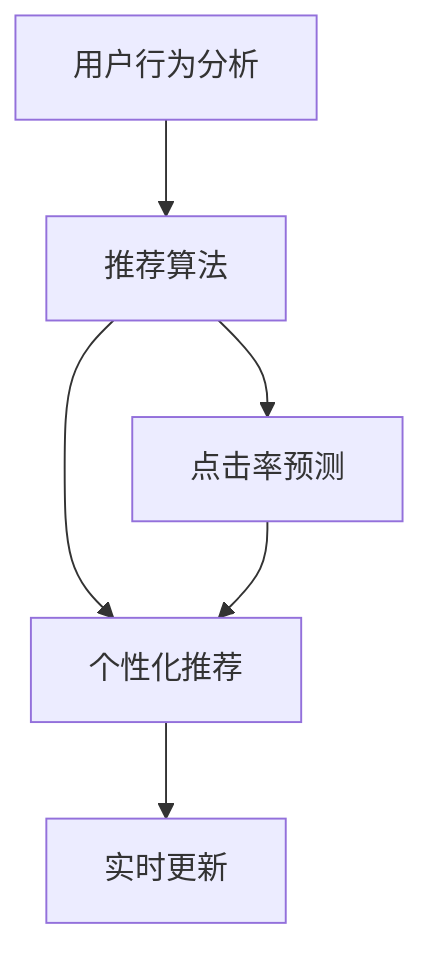

                 

# 实时推荐：AI提升用户购买率

> 关键词：实时推荐,人工智能,用户行为分析,推荐系统,点击率预测,电商推荐

## 1. 背景介绍

### 1.1 问题由来

在当今数字化时代，电商行业的竞争日益激烈，用户的选择也越来越多样化。如何精准识别用户需求，提升用户购买率和满意度，成为了电商企业关注的重点。传统电商推荐系统依赖于人工规则和历史数据统计，缺乏对用户实时行为的动态理解和实时调整能力。

而随着人工智能和大数据分析技术的兴起，电商推荐系统开始引入AI技术，通过机器学习算法对用户行为进行实时分析和预测，提供更加个性化和及时性高的推荐内容，显著提升了用户满意度和购买率。本博客将重点探讨基于AI的实时推荐系统，以及其核心算法和实际应用。

### 1.2 问题核心关键点

实时推荐系统的核心关键点包括：

- **用户行为分析**：利用AI技术对用户的浏览、点击、购买等行为进行实时分析，提取特征，预测用户偏好。
- **点击率预测**：构建点击率预测模型，实时评估推荐内容对用户的吸引力。
- **个性化推荐**：根据用户历史行为和实时行为，生成个性化的推荐内容。
- **实时更新**：在用户交互过程中动态调整推荐策略，提升推荐效果。

本文将详细介绍实时推荐系统的核心算法、实施步骤以及其在电商推荐中的应用案例，帮助读者更好地理解和应用AI技术提升用户购买率。

## 2. 核心概念与联系

### 2.1 核心概念概述

实时推荐系统主要涉及以下几个核心概念：

- **用户行为分析**：通过分析用户的点击、浏览、收藏等行为，提取用户兴趣点，建立用户行为模型。
- **推荐算法**：包括协同过滤、基于内容的推荐、深度学习推荐等算法，构建推荐模型。
- **点击率预测**：使用机器学习算法预测用户点击某个推荐内容的可能性，为个性化推荐提供依据。
- **个性化推荐**：结合用户历史行为和实时行为，生成具有针对性的推荐内容。
- **实时更新**：根据用户实时反馈动态调整推荐策略，提升推荐效果。

这些概念之间的关系可以用以下Mermaid流程图来展示：



## 3. 核心算法原理 & 具体操作步骤

### 3.1 算法原理概述

实时推荐系统的主要算法原理基于协同过滤和深度学习。协同过滤算法通过分析用户行为数据，发现用户间的相似性，从而为用户推荐类似内容的物品。深度学习推荐则利用神经网络模型，从用户行为和物品属性中提取高层次的特征表示，构建更加准确的推荐模型。

以深度学习推荐为例，常用的模型包括：

- **隐式反馈模型**：如MLP、GRU等，通过用户行为序列预测用户偏好。
- **显式反馈模型**：如RNN、LSTM、Transformer等，通过用户点击和评分数据预测用户偏好。
- **序列推荐模型**：如LSTM、GRU等，通过用户行为序列预测推荐结果。
- **注意力机制**：如Self-Attention、Multi-Head Attention等，提升推荐模型的注意力分配能力。

### 3.2 算法步骤详解

实时推荐系统的主要步骤包括：

1. **用户行为数据收集**：从用户行为记录中收集用户历史和实时行为数据。
2. **用户行为分析**：利用机器学习算法分析用户行为特征，建立用户兴趣模型。
3. **推荐算法训练**：选择推荐算法，利用用户行为数据和物品属性数据，训练推荐模型。
4. **点击率预测**：使用机器学习算法预测用户对推荐内容的点击概率。
5. **个性化推荐**：根据用户行为模型和点击率预测结果，生成个性化推荐内容。
6. **实时更新**：根据用户反馈和实时行为，动态调整推荐策略，优化推荐效果。

### 3.3 算法优缺点

实时推荐系统的优点包括：

- **实时性高**：可以实时分析用户行为，提供动态推荐。
- **个性化强**：能够根据用户历史行为和实时行为生成个性化推荐。
- **效果显著**：通过深度学习算法，能够准确预测用户点击概率，提升推荐效果。

但同时也存在一些缺点：

- **计算量大**：深度学习模型通常需要大量计算资源进行训练和推理。
- **模型复杂**：模型结构复杂，需要专业的数据科学家和工程师进行构建和维护。
- **数据依赖强**：推荐效果依赖于高质量的数据集，数据不足或质量不高可能导致效果不佳。

### 3.4 算法应用领域

实时推荐系统广泛应用于电商、视频、音乐、新闻等多个领域。在电商领域，实时推荐系统通过分析用户行为，为用户推荐商品，显著提升用户购买率和满意度。在视频和音乐领域，实时推荐系统根据用户观看和收听行为，推荐相关内容，提升用户粘性。在新闻领域，实时推荐系统根据用户阅读和互动行为，推荐新闻资讯，增加用户活跃度。

## 4. 数学模型和公式 & 详细讲解

### 4.1 数学模型构建

实时推荐系统的数学模型主要包括以下几个部分：

- **用户行为模型**：利用用户行为数据，构建用户兴趣模型，如协同过滤模型、矩阵分解模型等。
- **物品属性模型**：利用物品属性数据，构建物品表示模型，如TF-IDF、Word2Vec等。
- **推荐模型**：利用用户行为模型和物品属性模型，构建推荐模型，如MLP、RNN、Transformer等。

### 4.2 公式推导过程

以协同过滤算法为例，推导用户行为模型和推荐模型的公式：

用户行为模型基于用户-物品共现矩阵 $U$，其中 $u_{ij}$ 表示用户 $i$ 是否对物品 $j$ 感兴趣。通过矩阵分解，可以得到用户向量 $u_i$ 和物品向量 $v_j$，则用户对物品的兴趣度 $p_{ij}$ 可以表示为：

$$
p_{ij} = \langle u_i, v_j \rangle = \sum_{k=1}^n u_{ik} v_{kj}
$$

推荐模型基于用户行为模型和物品属性模型，通过机器学习算法训练得到推荐模型 $f(\cdot)$，则推荐结果 $y_i$ 可以表示为：

$$
y_i = f(u_i, v_j)
$$

### 4.3 案例分析与讲解

假设某电商平台用户 $u_1$ 对物品 $j_1$ 感兴趣，物品 $j_1$ 的属性向量为 $v_{j_1} = [1, 0, 1]$，用户向量为 $u_{1} = [0.5, 0.5, 0.5]$。根据协同过滤算法，用户 $u_1$ 对物品 $j_2$ 的兴趣度 $p_{12}$ 可以表示为：

$$
p_{12} = \langle u_1, v_{j_2} \rangle = 0.5 \times 1 + 0.5 \times 1 = 1
$$

利用推荐模型 $f(\cdot)$，可以预测用户 $u_1$ 对物品 $j_2$ 的推荐结果 $y_1$：

$$
y_1 = f(u_1, v_{j_2}) = 1
$$

因此，实时推荐系统可以预测用户 $u_1$ 对物品 $j_2$ 感兴趣，从而生成个性化推荐内容。

## 5. 项目实践：代码实例和详细解释说明

### 5.1 开发环境搭建

实时推荐系统的开发环境主要包括以下几个方面：

- **Python**：作为主要编程语言，Python的丰富库和框架支持了大规模机器学习项目的开发。
- **深度学习框架**：如TensorFlow、PyTorch、Keras等，用于深度学习模型的构建和训练。
- **大数据平台**：如Hadoop、Spark等，用于大规模数据处理和分布式计算。
- **云计算平台**：如AWS、Google Cloud、阿里云等，提供高效、灵活的计算和存储资源。

### 5.2 源代码详细实现

以下是一个使用TensorFlow框架实现深度学习推荐系统的示例代码：

```python
import tensorflow as tf
from tensorflow.keras.layers import Input, Embedding, Flatten, Dot, Dense
from tensorflow.keras.models import Model

# 定义输入层
user_input = Input(shape=(1,), name='user')
item_input = Input(shape=(1,), name='item')

# 定义嵌入层
user_embedding = Embedding(input_dim=1000, output_dim=100, name='user_embedding')(user_input)
item_embedding = Embedding(input_dim=1000, output_dim=100, name='item_embedding')(item_input)

# 定义注意力机制
attention = Dot(axes=(1,1), name='attention')([user_embedding, item_embedding])
attention = Dense(1, activation='sigmoid', name='attention_weights')(attention)

# 定义推荐模型
recommendation = Dot(axes=(1,1), name='recommendation')([attention, user_embedding])
recommendation = Flatten(name='recommendation')(recommendation)
recommendation = Dense(1, activation='sigmoid', name='output')(recommendation)

# 构建模型
model = Model(inputs=[user_input, item_input], outputs=[recommendation])

# 编译模型
model.compile(optimizer='adam', loss='binary_crossentropy', metrics=['accuracy'])

# 训练模型
model.fit(x=[train_user_ids, train_item_ids], y=train_labels, epochs=10, batch_size=32)
```

### 5.3 代码解读与分析

上述代码实现了一个基于用户-物品共现矩阵分解的推荐模型。具体分析如下：

- **输入层**：定义用户输入和物品输入，形状为(1,)。
- **嵌入层**：定义用户嵌入和物品嵌入，将低维向量映射到高维向量空间。
- **注意力机制**：利用点积计算用户和物品之间的注意力权重，保留重要信息的注意力分配。
- **推荐模型**：通过点积和全连接层计算推荐结果，输出概率值。
- **编译和训练模型**：使用Adam优化器和二元交叉熵损失函数，进行模型训练。

## 6. 实际应用场景

### 6.1 电商平台推荐

电商平台利用实时推荐系统，可以显著提升用户购买率和满意度。系统通过分析用户行为，预测用户对商品的兴趣度，生成个性化推荐内容。例如，某用户浏览过手机配件，电商平台可以预测该用户对手机配件相关商品感兴趣，生成推荐内容，从而提升用户购买率。

### 6.2 视频推荐

视频平台利用实时推荐系统，根据用户观看行为和评价，推荐相关视频内容。例如，某用户连续观看多个电影预告片，推荐系统可以预测该用户对某电影感兴趣，生成推荐内容，增加用户观看时间。

### 6.3 新闻推荐

新闻平台利用实时推荐系统，根据用户阅读和互动行为，推荐相关新闻资讯。例如，某用户阅读多篇科技新闻，推荐系统可以预测该用户对科技新闻感兴趣，生成推荐内容，增加用户粘性。

### 6.4 未来应用展望

未来，实时推荐系统将在更多领域得到应用，例如智能家居、智慧医疗、金融投资等。系统通过分析用户行为和环境数据，提供个性化的服务推荐，提升用户体验和满意度。同时，实时推荐系统也会结合人工智能和区块链技术，提升数据隐私和安全保障，构建更加智能、可靠的系统。

## 7. 工具和资源推荐

### 7.1 学习资源推荐

为了帮助开发者掌握实时推荐系统的开发技术，这里推荐一些优质的学习资源：

1. **深度学习推荐系统（Deep Learning Recommendation Systems）**：本书由亚马逊工程师撰写，全面介绍了推荐系统的理论基础和实践方法。
2. **Coursera推荐系统课程（Recommender Systems Specialization）**：由斯坦福大学教授教授，涵盖推荐系统的基础、协同过滤、深度学习推荐等内容。
3. **Kaggle推荐系统竞赛（Recommender Systems Kaggle Competitions）**：通过参与Kaggle竞赛，实战学习推荐系统开发技巧。
4. **GitHub推荐系统开源项目（Recommender Systems GitHub Repositories）**：收集大量推荐系统开源项目，参考实现和案例。

### 7.2 开发工具推荐

实时推荐系统的开发工具主要包括：

1. **TensorFlow**：由Google开发的深度学习框架，支持大规模模型训练和推理。
2. **PyTorch**：由Facebook开发的深度学习框架，支持动态图和静态图两种模式。
3. **Keras**：基于TensorFlow和Theano的高层次API，简化模型构建和训练。
4. **Scikit-learn**：用于数据预处理、特征工程和模型评估的Python库。
5. **Pandas**：用于数据清洗和处理的Python库。

### 7.3 相关论文推荐

实时推荐系统涉及多个研究领域，以下是几篇相关领域的经典论文：

1. **《Neural Collaborative Filtering》**：提出深度神经网络协同过滤模型，利用深度学习提升推荐精度。
2. **《A Deep Learning Framework for Recommender Systems》**：介绍基于深度学习的推荐系统框架，涵盖协同过滤、深度神经网络等算法。
3. **《Scalable Parallel Tree-Based Decision Trees for Large-Scale Recommender Systems》**：提出基于决策树的推荐算法，提升推荐系统的可扩展性和效率。

## 8. 总结：未来发展趋势与挑战

### 8.1 总结

本文对基于AI的实时推荐系统进行了全面系统的介绍，涵盖核心算法、实施步骤和实际应用。通过系统梳理，读者可以理解实时推荐系统的原理和实现方法，掌握其实际应用中的挑战和优化策略。

实时推荐系统通过深度学习算法，利用用户行为数据和物品属性数据，生成个性化推荐内容，显著提升用户购买率和满意度。但同时，也面临计算量大、模型复杂、数据依赖强等挑战。为应对这些挑战，开发者需要在算法、数据和工程等多方面进行优化和改进。

### 8.2 未来发展趋势

未来，实时推荐系统将呈现以下几个发展趋势：

1. **数据多样化**：引入更多元化数据源，如社交网络、行为轨迹等，提升推荐系统的全面性和鲁棒性。
2. **模型自动化**：利用自动化机器学习（AutoML）技术，自动选择和优化推荐模型，降低开发难度和成本。
3. **个性化推荐**：结合用户实时行为和上下文信息，生成更加精准的个性化推荐。
4. **实时性提升**：利用分布式计算和流计算技术，提高推荐系统实时性，支持实时推荐。
5. **跨域推荐**：结合多个领域的推荐系统，提供跨域推荐服务，提升推荐效果。

### 8.3 面临的挑战

实时推荐系统在发展过程中仍面临以下挑战：

1. **数据隐私和安全**：用户行为数据涉及隐私问题，推荐系统需要保护用户隐私，防止数据泄露。
2. **模型可解释性**：推荐系统通常缺乏可解释性，难以理解推荐模型的决策过程，影响用户信任度。
3. **计算资源消耗**：实时推荐系统需要大量的计算资源进行训练和推理，提高资源利用效率是关键。
4. **推荐效果评估**：推荐系统的效果评估标准需要进一步完善，结合用户反馈和实际购买行为，进行全面评估。
5. **多目标优化**：推荐系统需要同时优化多个目标，如个性化、多样性、覆盖率等，难以权衡和协调。

### 8.4 研究展望

未来，实时推荐系统需要在以下几个方面进行进一步研究：

1. **隐私保护技术**：开发隐私保护算法，如差分隐私、联邦学习等，保护用户数据隐私。
2. **模型可解释性**：研究可解释性方法，如注意力机制、因果推理等，提升推荐系统的透明度和可信度。
3. **资源优化技术**：开发资源优化算法，如模型压缩、剪枝、量化等，提高实时推荐系统的计算效率。
4. **多目标优化算法**：研究多目标优化算法，平衡推荐系统中的多种指标，提升整体性能。
5. **跨域推荐技术**：结合多个领域的推荐系统，提供跨域推荐服务，提升推荐效果。

## 9. 附录：常见问题与解答

**Q1：实时推荐系统是否适用于所有领域？**

A: 实时推荐系统适用于用户行为数据丰富的领域，如电商、视频、新闻等。但对于一些特殊领域，如医疗、金融等，由于数据获取难度较大，实时推荐系统的应用需要进一步探索和优化。

**Q2：实时推荐系统需要哪些数据源？**

A: 实时推荐系统需要收集和分析用户行为数据，如点击、浏览、购买等。同时，需要收集物品属性数据，如商品描述、价格、评分等。此外，还可以引入更多元化数据源，如社交网络、行为轨迹等，提升推荐系统的全面性和鲁棒性。

**Q3：如何提升实时推荐系统的实时性？**

A: 提升实时推荐系统的实时性，可以从以下几个方面入手：
1. **分布式计算**：利用分布式计算框架，如Hadoop、Spark等，提高推荐系统处理数据的效率。
2. **流计算**：利用流计算框架，如Storm、Apache Flink等，实时处理用户行为数据。
3. **数据缓存**：利用缓存技术，如Redis、Memcached等，存储热点数据，提高查询效率。

**Q4：如何保护用户数据隐私？**

A: 保护用户数据隐私是实时推荐系统的关键问题之一。可以通过以下方法进行保护：
1. **差分隐私**：对用户行为数据进行差分隐私处理，防止数据泄露。
2. **联邦学习**：在分布式环境中，利用联邦学习技术，在本地进行模型训练，保护用户数据隐私。
3. **匿名化处理**：对用户数据进行匿名化处理，如去除敏感信息、扰动数据等，保护用户隐私。

---

作者：禅与计算机程序设计艺术 / Zen and the Art of Computer Programming

