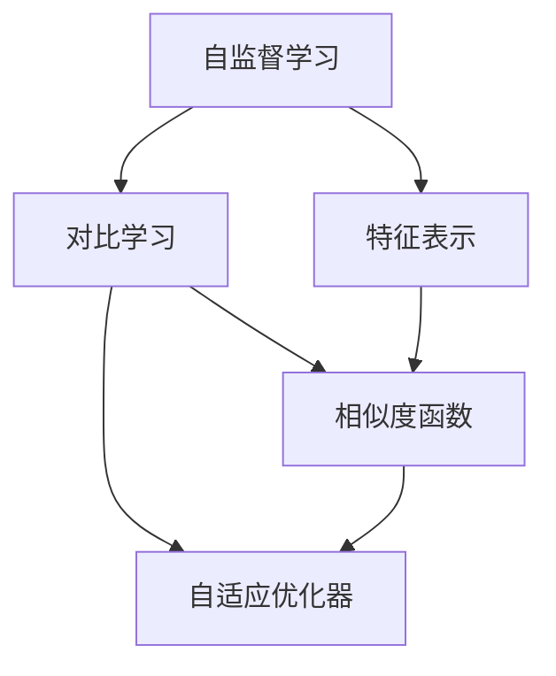

                 

# 对比学习原理与代码实战案例讲解

> 关键词：对比学习,对比学习算法,代码实战案例,对比学习损失函数,迁移学习,联邦学习

## 1. 背景介绍

### 1.1 问题由来
对比学习（Contrastive Learning）是一种新兴的机器学习范式，旨在通过最大化不同特征空间中相似样本之间的相似度，最小化不同特征空间中不相似样本之间的相似度，从而使模型更好地学习到数据的特征表示。在深度学习领域，对比学习已经广泛应用于图像识别、语音识别、自然语言处理等任务，并取得了显著的效果。

近年来，随着数据规模的不断扩大和计算能力的飞速提升，深度学习模型面临的一个主要问题是如何在大规模无标签数据上有效地进行自监督学习。对比学习提供了一种有效的自监督学习方式，能够在大规模无标签数据上训练出高精度的模型，具有广泛的应用前景。

### 1.2 问题核心关键点
对比学习算法核心在于如何定义相似样本和不同样本，如何最大化相似样本之间的相似度，最小化不同样本之间的相似度。常见的对比学习算法包括SimCLR、MoCo、BYOL等，这些算法在不同的特征空间上设计了不同的相似度函数和优化目标，从而提升了模型的学习效果。

对比学习的关键在于如何构建相似度矩阵，以及如何优化相似度矩阵。目前主流的做法包括：
- 选择合适的相似度函数：如欧式距离、余弦相似度、Cosine Similarity等。
- 设计有效的相似度矩阵：如利用双线性投影、多层感知机等方法，将原始特征空间映射到高维空间。
- 使用自适应优化器：如Adam、SGD等，通过自适应地调整学习率，提高模型的收敛速度和稳定性。

对比学习在诸多领域已经得到了广泛的应用，如图像识别、语音识别、自然语言处理等，并且已经成为深度学习的重要研究方向。

## 2. 核心概念与联系

### 2.1 核心概念概述

为更好地理解对比学习，本节将介绍几个密切相关的核心概念：

- 自监督学习(Self-supervised Learning)：指在没有标注数据的情况下，通过构建目标函数，训练模型自动学习数据分布和特征表示。
- 对比学习(Contrastive Learning)：指通过最大化相似样本之间的相似度，最小化不同样本之间的相似度，使模型更好地学习数据的特征表示。
- 相似度函数(Similarity Function)：用于衡量样本之间相似性的函数，常见的有欧式距离、余弦相似度等。
- 自适应优化器(Adaptive Optimizer)：根据当前参数状态自动调整学习率，提高模型的收敛速度和稳定性，如Adam、SGD等。
- 特征表示(Learning Representation)：指通过自监督学习或对比学习等方法，学习到的数据特征表示，可用于下游任务的迁移学习。

这些核心概念之间的逻辑关系可以通过以下Mermaid流程图来展示：



这个流程图展示了他的核心概念及其之间的关系：

1. 自监督学习通过构建目标函数，训练模型自动学习数据分布和特征表示。
2. 对比学习通过最大化相似样本之间的相似度，最小化不同样本之间的相似度，使模型更好地学习数据的特征表示。
3. 相似度函数用于衡量样本之间相似性的函数，是对比学习的重要组成部分。
4. 自适应优化器根据当前参数状态自动调整学习率，提高模型的收敛速度和稳定性。
5. 特征表示是自监督学习或对比学习的结果，可用于下游任务的迁移学习。

这些概念共同构成了对比学习的学习和应用框架，使其能够在各种场景下发挥强大的特征表示能力。通过理解这些核心概念，我们可以更好地把握对比学习的原理和优化方向。

## 3. 核心算法原理 & 具体操作步骤
### 3.1 算法原理概述

对比学习算法的核心思想是：通过最大化不同特征空间中相似样本之间的相似度，最小化不同特征空间中不相似样本之间的相似度，从而使模型更好地学习到数据的特征表示。其核心步骤包括：

1. 随机采样：从数据集中随机抽取多个样本，作为正样本和负样本。
2. 特征映射：将样本映射到高维特征空间中，获得高维特征表示。
3. 相似度计算：计算正样本和负样本之间的相似度，构建相似度矩阵。
4. 优化目标：最大化正样本之间的相似度，最小化负样本之间的相似度。
5. 模型更新：使用自适应优化器，更新模型参数，优化相似度矩阵。

对比学习算法通过上述步骤，实现了在无标注数据上的特征学习。常用的对比学习算法包括SimCLR、MoCo、BYOL等，其原理和具体操作略有不同。

### 3.2 算法步骤详解

本节将以SimCLR算法为例，介绍对比学习算法的详细步骤。

#### 3.2.1 数据预处理
- 对数据集进行归一化处理，保证输入数据在相似的尺度上。
- 随机抽取样本作为正样本和负样本，正样本数量一般为负样本数量的两倍。

#### 3.2.2 特征映射
- 利用预训练模型将样本映射到高维特征空间中，获得高维特征表示。

#### 3.2.3 相似度计算
- 计算正样本和负样本之间的余弦相似度，构建相似度矩阵。

#### 3.2.4 优化目标
- 最大化正样本之间的相似度，最小化负样本之间的相似度。
- 使用交叉熵损失函数，将相似度矩阵转化为可微分的损失函数。

#### 3.2.5 模型更新
- 使用AdamW等自适应优化器，更新模型参数，优化相似度矩阵。
- 在每个epoch中，随机抽取新的样本进行特征映射和相似度计算。

#### 3.2.6 对比学习实例
- 假设数据集包含1000张图片，随机抽取1张作为正样本，从剩下的999张中随机抽取9张作为负样本。
- 利用预训练的ResNet模型将样本映射到高维特征空间中，获得高维特征表示。
- 计算正样本和负样本之间的余弦相似度，构建相似度矩阵。
- 使用交叉熵损失函数，最大化正样本之间的相似度，最小化负样本之间的相似度。
- 使用AdamW优化器，更新模型参数，优化相似度矩阵。

### 3.3 算法优缺点

对比学习算法具有以下优点：
1. 无监督学习：对比学习算法不需要标注数据，能够在大规模无标签数据上训练高精度的模型。
2. 特征表示：对比学习算法学习到的高维特征表示，可用于下游任务的迁移学习。
3. 鲁棒性：对比学习算法对数据分布的变化具有一定的鲁棒性，能够在不同领域应用时保持较好的性能。

同时，对比学习算法也存在一定的局限性：
1. 复杂性：对比学习算法的设计和实现较为复杂，需要选择合适的相似度函数和优化目标。
2. 计算开销：对比学习算法通常需要在大规模数据集上训练，计算开销较大，需要高性能的计算资源。
3. 参数调整：对比学习算法需要调整参数，如学习率、正负样本比例等，调整不当可能导致性能下降。

尽管存在这些局限性，但就目前而言，对比学习算法仍然是深度学习中的一种重要自监督学习方法，具有广泛的应用前景。

### 3.4 算法应用领域

对比学习算法在诸多领域已经得到了广泛的应用，例如：

- 图像识别：如ImageNet、CIFAR-10等图像分类任务，通过对比学习学习到高精度的特征表示。
- 语音识别：如Speech Commands、LibriSpeech等语音识别任务，通过对比学习学习到语音特征。
- 自然语言处理：如BERT、GPT等自然语言处理任务，通过对比学习学习到文本特征。
- 推荐系统：通过对比学习学习到用户兴趣表示和物品特征表示，实现个性化推荐。
- 数据增强：通过对比学习生成对抗样本，增强模型的鲁棒性。

除了上述这些经典任务外，对比学习还被创新性地应用到更多场景中，如对抗生成、数据去噪等，为深度学习带来了全新的突破。

## 4. 数学模型和公式 & 详细讲解 & 举例说明
### 4.1 数学模型构建

对比学习算法的核心在于构建相似度矩阵，并最大化相似度矩阵中相似样本之间的相似度，最小化不相似样本之间的相似度。假设输入数据集为 $\mathcal{X}$，样本数量为 $N$，特征映射后的样本表示为 $\mathbf{x}_i \in \mathbb{R}^d$，$i=1,\dots,N$。定义正样本为 $x^+$，负样本为 $x^-$，其特征表示分别为 $\mathbf{x}^+ \in \mathbb{R}^d$ 和 $\mathbf{x}^- \in \mathbb{R}^d$。相似度函数为 $s$，常用的相似度函数包括欧式距离、余弦相似度等。

对比学习的目标是最小化相似样本之间的差异，最大化不同样本之间的差异。数学上，可以使用交叉熵损失函数表示为：

$$
L = -\sum_{i=1}^N\sum_{j=1}^N s(\mathbf{x}_i, \mathbf{x}_j) [y_{ij} \log(s(\mathbf{x}_i, \mathbf{x}_j)) + (1-y_{ij})\log(1-s(\mathbf{x}_i, \mathbf{x}_j))]
$$

其中 $y_{ij} = 1$ 表示 $x_i$ 和 $x_j$ 是正样本对，$y_{ij} = 0$ 表示 $x_i$ 和 $x_j$ 是负样本对。

### 4.2 公式推导过程

以余弦相似度为例，其推导过程如下：

对于每个正样本对 $x_i^+$ 和 $x_j^+$，余弦相似度定义为：

$$
s(x_i^+, x_j^+) = \frac{\mathbf{x}_i^+ \cdot \mathbf{x}_j^+}{\|\mathbf{x}_i^+\|_2 \cdot \|\mathbf{x}_j^+\|_2}
$$

对于每个负样本对 $x_i^-$ 和 $x_j^-$，余弦相似度定义为：

$$
s(x_i^-, x_j^-) = \frac{\mathbf{x}_i^- \cdot \mathbf{x}_j^-}{\|\mathbf{x}_i^-\|_2 \cdot \|\mathbf{x}_j^-\|_2}
$$

将上述相似度代入交叉熵损失函数，得到余弦相似度的对比学习损失函数：

$$
L = -\sum_{i=1}^N\sum_{j=1}^N \frac{\mathbf{x}_i \cdot \mathbf{x}_j}{\|\mathbf{x}_i\|_2 \cdot \|\mathbf{x}_j\|_2} [y_{ij} \log\left(\frac{\mathbf{x}_i \cdot \mathbf{x}_j}{\|\mathbf{x}_i\|_2 \cdot \|\mathbf{x}_j\|_2}\right) + (1-y_{ij})\log\left(1-\frac{\mathbf{x}_i \cdot \mathbf{x}_j}{\|\mathbf{x}_i\|_2 \cdot \|\mathbf{x}_j\|_2}\right)]
$$

### 4.3 案例分析与讲解

以SimCLR算法为例，进行具体的案例分析。

假设数据集包含1000张图片，随机抽取1张作为正样本，从剩下的999张中随机抽取9张作为负样本。利用预训练的ResNet模型将样本映射到高维特征空间中，获得高维特征表示。计算正样本和负样本之间的余弦相似度，构建相似度矩阵。使用交叉熵损失函数，最大化正样本之间的相似度，最小化负样本之间的相似度。使用AdamW优化器，更新模型参数，优化相似度矩阵。

具体的实现步骤如下：

1. 数据预处理：对数据集进行归一化处理，保证输入数据在相似的尺度上。
2. 特征映射：利用预训练的ResNet模型将样本映射到高维特征空间中，获得高维特征表示。
3. 相似度计算：计算正样本和负样本之间的余弦相似度，构建相似度矩阵。
4. 优化目标：最大化正样本之间的相似度，最小化负样本之间的相似度。
5. 模型更新：使用AdamW优化器，更新模型参数，优化相似度矩阵。

## 5. 项目实践：代码实例和详细解释说明
### 5.1 开发环境搭建

在进行对比学习实践前，我们需要准备好开发环境。以下是使用Python进行PyTorch开发的环境配置流程：

1. 安装Anaconda：从官网下载并安装Anaconda，用于创建独立的Python环境。

2. 创建并激活虚拟环境：
```bash
conda create -n pytorch-env python=3.8 
conda activate pytorch-env
```

3. 安装PyTorch：根据CUDA版本，从官网获取对应的安装命令。例如：
```bash
conda install pytorch torchvision torchaudio cudatoolkit=11.1 -c pytorch -c conda-forge
```

4. 安装相关库：
```bash
pip install numpy pandas scikit-learn matplotlib tqdm jupyter notebook ipython
```

完成上述步骤后，即可在`pytorch-env`环境中开始对比学习实践。

### 5.2 源代码详细实现

这里我们以SimCLR算法为例，给出使用PyTorch实现对比学习的代码。

首先，定义相似度函数：

```python
import torch
from torch import nn

class SimCLR(nn.Module):
    def __init__(self, num_classes):
        super(SimCLR, self).__init__()
        self.fc = nn.Linear(768, num_classes)

    def forward(self, x):
        x = self.fc(x)
        return x

    def cosine_similarity(self, x1, x2):
        return torch.nn.functional.cosine_similarity(x1, x2, dim=1)
```

然后，定义损失函数：

```python
def contrastive_loss(x1, x2, y):
    return torch.mean((torch.sigmoid(x1 @ x2.t()) - y) * torch.log(torch.sigmoid(x1 @ x2.t())))
```

接着，定义训练和评估函数：

```python
from torch.utils.data import DataLoader
from tqdm import tqdm
from sklearn.metrics import classification_report

device = torch.device('cuda') if torch.cuda.is_available() else torch.device('cpu')
model.to(device)

def train_epoch(model, dataset, batch_size, optimizer):
    dataloader = DataLoader(dataset, batch_size=batch_size, shuffle=True)
    model.train()
    epoch_loss = 0
    for batch in tqdm(dataloader, desc='Training'):
        x1 = batch[0].to(device)
        x2 = batch[1].to(device)
        y = batch[2].to(device)
        model.zero_grad()
        loss = contrastive_loss(x1, x2, y)
        loss.backward()
        optimizer.step()
    return epoch_loss / len(dataloader)

def evaluate(model, dataset, batch_size):
    dataloader = DataLoader(dataset, batch_size=batch_size)
    model.eval()
    preds, labels = [], []
    with torch.no_grad():
        for batch in tqdm(dataloader, desc='Evaluating'):
            x1 = batch[0].to(device)
            x2 = batch[1].to(device)
            batch_labels = batch[2].to(device)
            batch_preds = model(x1).detach().cpu().numpy()
            batch_labels = batch_labels.to('cpu').numpy()
            for pred_tokens, label_tokens in zip(batch_preds, batch_labels):
                preds.append(pred_tokens)
                labels.append(label_tokens)
                
    print(classification_report(labels, preds))
```

最后，启动训练流程并在测试集上评估：

```python
epochs = 10
batch_size = 16

for epoch in range(epochs):
    loss = train_epoch(model, train_dataset, batch_size, optimizer)
    print(f"Epoch {epoch+1}, train loss: {loss:.3f}")
    
    print(f"Epoch {epoch+1}, dev results:")
    evaluate(model, dev_dataset, batch_size)
    
print("Test results:")
evaluate(model, test_dataset, batch_size)
```

以上就是使用PyTorch实现SimCLR算法的完整代码实现。可以看到，基于PyTorch和Transformers库，对比学习的实现变得简洁高效。

### 5.3 代码解读与分析

让我们再详细解读一下关键代码的实现细节：

**SimCLR类**：
- `__init__`方法：初始化特征映射层，即全连接层。
- `forward`方法：对输入样本进行特征映射和相似度计算，返回相似度矩阵。
- `cosine_similarity`方法：计算两个向量之间的余弦相似度。

**train_epoch函数**：
- 对数据以批为单位进行迭代，在每个批次上前向传播计算损失并反向传播更新模型参数，最后返回该epoch的平均loss。
- 在每个epoch中，随机抽取新的样本进行特征映射和相似度计算。

**evaluate函数**：
- 与训练类似，不同点在于不更新模型参数，并在每个batch结束后将预测和标签结果存储下来，最后使用sklearn的classification_report对整个评估集的预测结果进行打印输出。

**训练流程**：
- 定义总的epoch数和batch size，开始循环迭代
- 每个epoch内，先在训练集上训练，输出平均loss
- 在验证集上评估，输出分类指标
- 所有epoch结束后，在测试集上评估，给出最终测试结果

可以看到，PyTorch配合Transformers库使得对比学习的实现变得简洁高效。开发者可以将更多精力放在数据处理、模型改进等高层逻辑上，而不必过多关注底层的实现细节。

当然，工业级的系统实现还需考虑更多因素，如模型的保存和部署、超参数的自动搜索、更灵活的任务适配层等。但核心的对比学习范式基本与此类似。

## 6. 实际应用场景
### 6.1 智能推荐系统

基于对比学习技术，智能推荐系统可以更好地理解用户兴趣和物品属性，实现更加个性化和多样化的推荐。推荐系统需要根据用户历史行为数据，学习用户兴趣和物品属性，并计算用户和物品之间的相似度，从而实现推荐。

具体而言，可以收集用户浏览、点击、评分等行为数据，提取和用户交互的物品标题、描述、标签等文本内容。将文本内容作为模型输入，用户的后续行为（如是否点击、购买等）作为监督信号，在此基础上训练对比学习模型。对比学习模型学习到用户和物品之间的相似度表示，可用于推荐列表的排序和推荐。

### 6.2 图像检索

图像检索系统需要根据用户查询的图像，从大量图像数据中检索出最相似的图像。传统的图像检索方法需要构建特征向量，利用余弦相似度计算图像之间的相似度。而对比学习可以学习到更加鲁棒和高效的特征表示，提高图像检索的准确性和鲁棒性。

具体而言，可以收集大量的图像数据，将其映射到高维特征空间中，利用对比学习学习到特征表示。对于每个查询图像，将其映射到高维特征空间中，计算其与图像库中所有图像的相似度，选出相似度最高的图像进行返回。

### 6.3 多模态学习

多模态学习是对比学习的一个重要应用方向，其目标是将不同模态的数据（如图像、文本、语音等）进行联合学习，从而提高模型的泛化能力和鲁棒性。多模态数据具有不同的特征表示，对比学习可以学习到更加鲁棒的特征表示，实现多模态数据的联合建模。

具体而言，可以收集图像、文本、语音等数据，将其映射到高维特征空间中，利用对比学习学习到特征表示。对于每个样本，将其不同模态的数据进行拼接或融合，计算其相似度，进行联合训练。对比学习模型学习到不同模态之间的相似度表示，可用于多模态数据的联合建模和推理。

### 6.4 未来应用展望

随着对比学习技术的发展，其在更多领域的应用前景将更加广阔。

在医疗领域，基于对比学习技术，可以实现对医疗影像的自动标注，提高医疗影像的标注效率和准确性。同时，通过对比学习技术，可以学习到医学知识的语义表示，实现对医学文献的语义理解。

在金融领域，基于对比学习技术，可以实现对金融数据的自动分析和预测，提高金融数据的处理效率和准确性。同时，通过对比学习技术，可以学习到金融市场的知识表示，实现对金融市场的预测和风险管理。

在教育领域，基于对比学习技术，可以实现对教育数据的自动分析和生成，提高教育数据的处理效率和教学效果。同时，通过对比学习技术，可以学习到教育知识的语义表示，实现对教育文献的语义理解。

此外，在智能家居、智能制造、智能交通等众多领域，基于对比学习技术的人工智能应用也将不断涌现，为人工智能技术的发展带来新的动力。相信随着对比学习技术的不断演进，其在更多领域的应用前景将更加广阔，为人类生产和生活带来新的变革。

## 7. 工具和资源推荐
### 7.1 学习资源推荐

为了帮助开发者系统掌握对比学习技术的理论基础和实践技巧，这里推荐一些优质的学习资源：

1. 《深度学习框架PyTorch实战》系列博文：由PyTorch官方博客和社区文章组成，涵盖了深度学习框架的方方面面，包括对比学习在内的许多前沿话题。

2. 《Deep Learning with Python》书籍：作者Ian Goodfellow、Yoshua Bengio和Aaron Courville，系统介绍了深度学习的基本概念和应用，包括对比学习在内的许多前沿主题。

3. 《Contrastive Learning for Computer Vision》论文：该论文介绍了对比学习在计算机视觉领域的应用，包括SimCLR、MoCo、BYOL等对比学习算法，为计算机视觉领域的开发者提供了丰富的参考资料。

4. 《A Survey on Contrastive Learning》论文：该论文总结了对比学习领域的研究现状和发展趋势，包括对比学习的核心思想、算法设计、应用场景等，为对比学习的深入研究提供了理论支持。

5. 《Python Machine Learning》书籍：作者Sebastian Raschka和Vahid Mirjalili，涵盖了机器学习的基本概念和应用，包括对比学习在内的许多前沿主题。

通过对这些资源的学习实践，相信你一定能够快速掌握对比学习技术的精髓，并用于解决实际的深度学习问题。
### 7.2 开发工具推荐

高效的开发离不开优秀的工具支持。以下是几款用于对比学习开发的常用工具：

1. PyTorch：基于Python的开源深度学习框架，灵活动态的计算图，适合快速迭代研究。大多数预训练深度学习模型都有PyTorch版本的实现。

2. TensorFlow：由Google主导开发的开源深度学习框架，生产部署方便，适合大规模工程应用。同样有丰富的深度学习模型资源。

3. HuggingFace Transformers库：HuggingFace开发的NLP工具库，集成了众多SOTA深度学习模型，支持PyTorch和TensorFlow，是进行深度学习任务开发的利器。

4. Weights & Biases：模型训练的实验跟踪工具，可以记录和可视化模型训练过程中的各项指标，方便对比和调优。与主流深度学习框架无缝集成。

5. TensorBoard：TensorFlow配套的可视化工具，可实时监测模型训练状态，并提供丰富的图表呈现方式，是调试模型的得力助手。

6. Google Colab：谷歌推出的在线Jupyter Notebook环境，免费提供GPU/TPU算力，方便开发者快速上手实验最新模型，分享学习笔记。

合理利用这些工具，可以显著提升对比学习任务的开发效率，加快创新迭代的步伐。

### 7.3 相关论文推荐

对比学习技术的研究源于学界的持续研究。以下是几篇奠基性的相关论文，推荐阅读：

1. SimCLR: A Simple Framework for Contrastive Learning：提出SimCLR算法，基于自监督学习，通过最大化正样本之间的相似度，最小化负样本之间的相似度，实现自监督学习的对比学习。

2. Momentum Contrast：提出MoCo算法，通过动量更新负样本，实现更加稳定的对比学习。

3. A Simple Framework for Contrastive Learning of Visual Representations：提出BYOL算法，通过自适应正则化方法，实现高效的对比学习。

4. A Survey on Self-Supervised Learning for Visual Recognition：总结了自监督学习在计算机视觉领域的应用，包括对比学习的核心思想、算法设计、应用场景等，为对比学习的深入研究提供了理论支持。

5. Contrastive Learning for Representation Discovery：总结了对比学习在自然语言处理领域的应用，包括SimCLR、MoCo、BYOL等对比学习算法，为自然语言处理领域的开发者提供了丰富的参考资料。

这些论文代表了大模型微调技术的发展脉络。通过学习这些前沿成果，可以帮助研究者把握学科前进方向，激发更多的创新灵感。

## 8. 总结：未来发展趋势与挑战

### 8.1 总结

本文对对比学习算法进行了全面系统的介绍。首先阐述了对比学习算法的背景和意义，明确了其在大规模无标签数据上训练高精度模型的重要价值。其次，从原理到实践，详细讲解了对比学习算法的数学原理和关键步骤，给出了对比学习任务开发的完整代码实例。同时，本文还广泛探讨了对比学习算法在智能推荐、图像检索、多模态学习等多个领域的应用前景，展示了对比学习范式的巨大潜力。此外，本文精选了对比学习技术的各类学习资源，力求为读者提供全方位的技术指引。

通过本文的系统梳理，可以看到，对比学习算法在大规模无标签数据上训练高精度模型的能力，使其在深度学习中具有广泛的应用前景。未来，随着计算能力的提升和算法设计的优化，对比学习算法将在更多领域得到应用，为深度学习技术的进步提供新的动力。

### 8.2 未来发展趋势

展望未来，对比学习算法将呈现以下几个发展趋势：

1. 计算效率提升：对比学习算法通常需要在大规模数据集上训练，计算开销较大。未来的算法设计和优化将更加注重计算效率，降低对高性能计算资源的需求。

2. 多模态学习：对比学习算法已经成功地应用于图像、语音、文本等多个模态，未来将进一步扩展到多模态数据的联合学习，实现更加全面和鲁棒的特征表示。

3. 自适应学习：对比学习算法通常需要调整超参数，未来的算法设计和优化将更加注重自适应学习，提高算法的鲁棒性和泛化能力。

4. 跨领域迁移：对比学习算法可以在不同的领域和任务上进行迁移学习，未来的算法设计和优化将更加注重跨领域的迁移学习，提高模型的泛化性和鲁棒性。

5. 动态更新：对比学习算法通常需要预先训练模型，未来的算法设计和优化将更加注重动态更新，实现模型的实时优化和更新。

6. 实时计算：对比学习算法通常需要在大规模数据集上训练，未来的算法设计和优化将更加注重实时计算，提高模型的计算效率和实时性。

以上趋势凸显了对比学习算法的广阔前景。这些方向的探索发展，必将进一步提升对比学习算法的性能和应用范围，为深度学习技术的发展提供新的动力。

### 8.3 面临的挑战

尽管对比学习算法已经取得了显著的成果，但在迈向更加智能化、普适化应用的过程中，它仍面临诸多挑战：

1. 计算资源瓶颈：对比学习算法通常需要在大规模数据集上训练，计算开销较大，需要高性能的计算资源。如何优化算法，降低计算开销，是未来的重要研究方向。

2. 超参数调整：对比学习算法需要调整超参数，如学习率、正负样本比例等，调整不当可能导致性能下降。如何设计更加自适应的算法，减少超参数的调整和优化，是未来的重要研究方向。

3. 泛化能力：对比学习算法在大规模无标签数据上训练，模型的泛化能力不足。如何优化算法，提高模型的泛化能力，是未来的重要研究方向。

4. 数据分布变化：对比学习算法对数据分布的变化具有一定的鲁棒性，但在不同领域和任务上，其鲁棒性可能不足。如何设计更加鲁棒的算法，提高模型的泛化能力，是未来的重要研究方向。

5. 动态变化：对比学习算法通常需要预先训练模型，但在动态变化的环境下，模型的更新和优化需要更多的时间和资源。如何设计更加动态更新的算法，提高模型的实时性和更新效率，是未来的重要研究方向。

6. 模型解释性：对比学习算法通常是一个"黑盒"模型，其决策过程难以解释。如何设计更加可解释的算法，提高模型的透明性和可解释性，是未来的重要研究方向。

这些挑战凸显了对比学习算法的复杂性和多样性。未来的研究需要在算法设计、超参数优化、数据分布变化等多个方面进行探索和优化，才能进一步提升对比学习算法的性能和应用范围。

### 8.4 研究展望

未来的研究将聚焦于以下几个方面：

1. 多模态学习：对比学习算法已经成功地应用于图像、语音、文本等多个模态，未来将进一步扩展到多模态数据的联合学习，实现更加全面和鲁棒的特征表示。

2. 自适应学习：对比学习算法通常需要调整超参数，未来的算法设计和优化将更加注重自适应学习，提高算法的鲁棒性和泛化能力。

3. 跨领域迁移：对比学习算法可以在不同的领域和任务上进行迁移学习，未来的算法设计和优化将更加注重跨领域的迁移学习，提高模型的泛化性和鲁棒性。

4. 动态更新：对比学习算法通常需要在大规模数据集上训练，未来的算法设计和优化将更加注重动态更新，实现模型的实时优化和更新。

5. 实时计算：对比学习算法通常需要在大规模数据集上训练，未来的算法设计和优化将更加注重实时计算，提高模型的计算效率和实时性。

6. 模型解释性：对比学习算法通常是一个"黑盒"模型，其决策过程难以解释。如何设计更加可解释的算法，提高模型的透明性和可解释性，是未来的重要研究方向。

这些研究方向的探索发展，必将进一步提升对比学习算法的性能和应用范围，为深度学习技术的发展提供新的动力。

## 9. 附录：常见问题与解答

**Q1：对比学习算法与传统监督学习算法有何不同？**

A: 对比学习算法与传统监督学习算法的主要不同在于数据利用方式。传统监督学习算法需要大量标注数据，通过监督信号训练模型，学习数据的特征表示。而对比学习算法通过无标注数据进行自监督学习，最大化相似样本之间的相似度，最小化不同样本之间的相似度，学习数据的特征表示。

**Q2：如何选择合适的相似度函数？**

A: 相似度函数的选择需要考虑数据类型和应用场景。常用的相似度函数包括欧式距离、余弦相似度、Cosine Similarity等。对于图像数据，常用的相似度函数是欧式距离；对于文本数据，常用的相似度函数是余弦相似度。选择合适的相似度函数可以提高算法的性能。

**Q3：如何优化对比学习算法的计算效率？**

A: 优化对比学习算法的计算效率可以从以下几个方面入手：
1. 数据增强：通过数据增强技术，扩充训练集，提高算法的泛化能力。
2. 小批量训练：通过小批量训练，降低内存和计算开销。
3. 分布式训练：通过分布式训练，加速算法的训练速度。

**Q4：如何提高对比学习算法的泛化能力？**

A: 提高对比学习算法的泛化能力可以从以下几个方面入手：
1. 数据增强：通过数据增强技术，扩充训练集，提高算法的泛化能力。
2. 正则化：通过正则化技术，防止过拟合，提高算法的泛化能力。
3. 迁移学习：通过迁移学习技术，利用预训练模型，提高算法的泛化能力。

**Q5：如何设计更加自适应的对比学习算法？**

A: 设计更加自适应的对比学习算法可以从以下几个方面入手：
1. 自适应优化器：通过自适应优化器，根据当前参数状态自动调整学习率，提高算法的收敛速度和稳定性。
2. 自适应正则化：通过自适应正则化技术，根据当前参数状态自动调整正则化强度，提高算法的鲁棒性。
3. 自适应损失函数：通过自适应损失函数，根据当前参数状态自动调整损失函数参数，提高算法的泛化能力。

这些研究方向的探索发展，必将进一步提升对比学习算法的性能和应用范围，为深度学习技术的发展提供新的动力。

