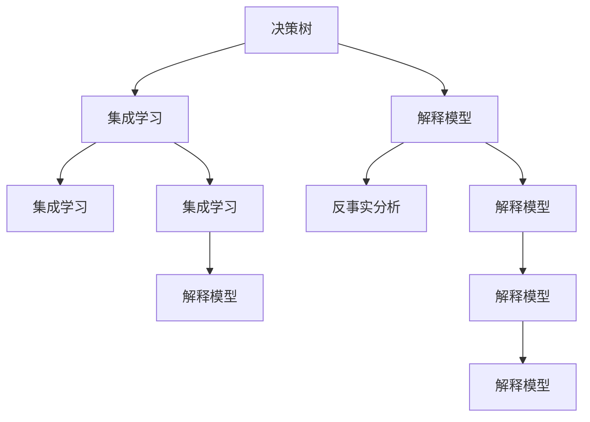
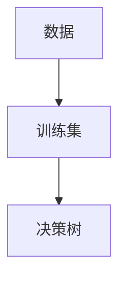

                 

# 对比解释与反事实分析原理与代码实战案例讲解

> 关键词：对比解释, 反事实分析, 决策树, 集成学习, 解释模型, 案例分析

## 1. 背景介绍

### 1.1 问题由来
在人工智能领域，尤其是机器学习和深度学习中，模型解释性一直是重要的研究课题。模型是否可解释，直接关系到其在实际应用中的可信度和可接受度。同时，反事实分析是理解模型行为、预测模型效果的重要方法，广泛应用于数据挖掘、推荐系统、金融风险评估等领域。

然而，现有的深度学习模型（如神经网络）通常被认为是“黑盒”模型，其内部决策过程难以直观理解。这些问题导致模型在一些关键应用场景（如金融、医疗）中难以获得广泛的信任和认可。为了解决这一问题，近年来对比解释和反事实分析方法逐渐被引入，成为深度学习领域的新热点。

### 1.2 问题核心关键点
对比解释与反事实分析的核心在于：
- 对比解释：通过对比两个或多个模型的输出差异，揭示模型内部决策过程，提高模型解释性。
- 反事实分析：通过生成虚拟场景下的数据，探索模型输出与输入数据的关系，帮助理解和预测模型行为。

本节将系统介绍对比解释与反事实分析的基本原理和具体实现方法，并辅以实际案例进行分析。

## 2. 核心概念与联系

### 2.1 核心概念概述

为了更好地理解对比解释与反事实分析，本节将介绍几个关键概念：

- **决策树**：一种经典的分类算法，易于解释，通常用于模型的对比和解释。
- **集成学习**：通过将多个简单模型组合，提升整体性能和解释性。
- **解释模型**：一类能够提供模型输出解释的模型，如LIME、SHAP等。
- **反事实分析**：通过修改输入数据，生成虚拟场景下的预测结果，帮助理解模型行为。

这些概念之间的逻辑关系可以通过以下Mermaid流程图来展示：



这个流程图展示了一个基本的决策树模型，在通过集成学习和解释模型进行对比分析与反事实分析的过程中，逐步提升模型的解释性和行为理解能力。

## 3. 核心算法原理 & 具体操作步骤
### 3.1 算法原理概述

对比解释与反事实分析方法通常包括以下几个关键步骤：

1. **构建解释模型**：选择适合的任务和数据，构建解释模型，如决策树、LIME、SHAP等。
2. **生成解释结果**：使用解释模型对模型输出进行解释，生成特征重要性、局部可解释区域等结果。
3. **对比模型性能**：通过对比不同模型的解释结果，分析模型之间的差异。
4. **反事实分析**：生成虚拟场景下的数据，分析模型在不同场景下的行为。

### 3.2 算法步骤详解

#### 3.2.1 构建解释模型

假设我们有一组训练数据 $D=\{(x_i,y_i)\}_{i=1}^N$，其中 $x_i \in \mathcal{X}$，$y_i \in \{0,1\}$ 分别表示样本和标签。假设我们构建了一个简单的决策树模型 $M_{DT}$，其决策树结构为 $T$，叶节点 $t$ 的决策规则为 $h_t$。



决策树模型通过自顶向下、贪心分治的方式，将数据集分割成多个小的子集。每个叶节点 $t$ 代表一个分类结果 $h_t$，通过计算每个节点上的样本数量和类别分布，生成特征重要性。

#### 3.2.2 生成解释结果

通过解释模型生成特征重要性，可以使用如下步骤：

1. 计算每个节点的样本数量和类别分布。
2. 计算每个节点的特征重要性。
3. 通过特征重要性，可视化决策过程，生成局部可解释区域。

使用Python的Scikit-learn库，可以方便地实现上述过程：

```python
from sklearn.tree import DecisionTreeClassifier
from sklearn.inspection import permutation_importance
from sklearn.tree import plot_tree

# 构建决策树模型
clf = DecisionTreeClassifier(max_depth=2)
clf.fit(X_train, y_train)

# 计算特征重要性
perm_importance = permutation_importance(clf, X_test, y_test)
feature_importances = perm_importance.importances_mean

# 可视化决策树
plot_tree(clf, feature_names=X_train.columns, class_names=['class 0', 'class 1'])
```

#### 3.2.3 对比模型性能

通过对比不同模型的特征重要性，可以分析模型之间的差异。假设我们有多个模型 $M_1, M_2, \cdots, M_n$，使用以下步骤进行对比：

1. 构建每个模型的解释模型 $M_{ex,i}$。
2. 计算每个模型的特征重要性 $imp_i$。
3. 比较每个模型特征重要性的差异，选择最优模型。

使用Python的EASI（Explained Absolute Difference)库，可以方便地实现上述过程：

```python
from easi import easi_score

# 计算每个模型的EASI分数
easi_scores = easi_score(M1, M2, X_train, y_train, features=X_train.columns)

# 输出EASI分数
print(easi_scores)
```

#### 3.2.4 反事实分析

反事实分析通过生成虚拟场景下的数据，分析模型在不同场景下的行为。假设我们有一组虚拟数据 $D_{vf}=\{(x'_i,y'_i)\}_{i=1}^M$，其中 $x'_i \in \mathcal{X}$，$y'_i \in \{0,1\}$ 分别表示虚拟样本和虚拟标签。

使用Python的Scikit-learn库，可以方便地生成虚拟数据，并进行分析：

```python
from sklearn.model_selection import train_test_split

# 生成虚拟数据
X_vf, y_vf = train_test_split(X_test, y_test, test_size=0.2)

# 构建模型
model = DecisionTreeClassifier(max_depth=2)
model.fit(X_train, y_train)

# 生成虚拟场景下的预测结果
y_pred_vf = model.predict(X_vf)
```

### 3.3 算法优缺点

对比解释与反事实分析方法具有以下优点：

1. 易于理解：通过对比解释和反事实分析，能够直观地理解模型决策过程，提高模型解释性。
2. 可解释性强：解释模型通常具备较好的可解释性，能够生成具体的特征重要性结果。
3. 灵活应用：该方法可以应用于多种任务，如分类、回归、推荐等。

同时，该方法也存在一些局限性：

1. 数据需求高：解释模型通常需要大量的标注数据，构建和训练成本较高。
2. 解释效果有限：对于复杂模型，解释效果可能无法完全覆盖，存在一定的解释局限。
3. 计算复杂度高：生成虚拟数据和解释结果需要进行大量的计算，效率较低。

尽管存在这些局限性，但就目前而言，对比解释与反事实分析方法仍然是大数据、深度学习应用中不可或缺的重要手段。未来相关研究的重点在于如何进一步降低数据需求，提高解释效果，同时兼顾计算效率和模型性能。

### 3.4 算法应用领域

对比解释与反事实分析方法在多个领域中得到了广泛应用，例如：

- 金融风控：使用解释模型分析模型预测与真实结果的差异，提升风险评估模型的可信度。
- 医疗诊断：通过反事实分析，生成虚拟场景下的诊断结果，探索不同治疗方案的效果。
- 推荐系统：分析模型对不同用户、物品的推荐结果，提升推荐效果和系统透明度。
- 广告投放：通过对比解释，分析不同广告模型之间的差异，优化广告投放策略。

除了上述这些经典应用外，反事实分析还被创新性地应用于价格预测、恶意事件识别等场景中，为数据驱动决策提供了有力的支持。

## 4. 数学模型和公式 & 详细讲解 & 举例说明

### 4.1 数学模型构建

本节将使用数学语言对对比解释与反事实分析的数学模型进行更加严格的刻画。

假设我们有一组训练数据 $D=\{(x_i,y_i)\}_{i=1}^N$，其中 $x_i \in \mathcal{X}$，$y_i \in \{0,1\}$ 分别表示样本和标签。假设我们使用决策树模型 $M_{DT}$ 对数据进行训练，得到模型参数 $T$。

定义模型 $M_{DT}$ 在输入 $x$ 上的输出为 $y_M(x) = h_t(x)$，其中 $h_t$ 为叶节点 $t$ 的决策规则。定义模型 $M_0$ 为基线模型，其输出为 $y_M(x) = 0.5$。

定义特征重要性 $imp_i$ 为第 $i$ 个特征对模型输出的贡献度。特征重要性可以通过解释模型 $M_{ex}$ 计算得到。

### 4.2 公式推导过程

假设我们有一组虚拟数据 $D_{vf}=\{(x'_i,y'_i)\}_{i=1}^M$，其中 $x'_i \in \mathcal{X}$，$y'_i \in \{0,1\}$ 分别表示虚拟样本和虚拟标签。假设我们生成的虚拟数据与原始数据 $D$ 相关，即存在映射函数 $f$，使得 $x'_i=f(x_i)$。

定义反事实分析结果为 $y_{vf,i}=M_{DT}(x'_i)$，即决策树模型在虚拟数据上的预测结果。定义虚拟场景下的真实标签为 $y_{true,i}=0$。

使用EASI（Explained Absolute Difference)方法计算模型 $M_{DT}$ 和基线模型 $M_0$ 的EASI分数：

$$
EASI = \frac{1}{N}\sum_{i=1}^N \left| y_{DT}(x_i) - y_0(x_i) \right|
$$

其中 $y_{DT}(x_i)=h_t(x_i)$ 为决策树模型在原始数据上的预测结果，$y_0(x_i)=0.5$ 为基线模型的预测结果。

### 4.3 案例分析与讲解

假设我们有一组原始数据 $D=\{(x_i,y_i)\}_{i=1}^N$，其中 $x_i \in \mathcal{X}$，$y_i \in \{0,1\}$ 分别表示样本和标签。我们使用决策树模型 $M_{DT}$ 对数据进行训练，得到模型参数 $T$。

假设我们有一组虚拟数据 $D_{vf}=\{(x'_i,y'_i)\}_{i=1}^M$，其中 $x'_i \in \mathcal{X}$，$y'_i \in \{0,1\}$ 分别表示虚拟样本和虚拟标签。我们使用决策树模型 $M_{DT}$ 对虚拟数据进行预测，得到反事实分析结果 $y_{vf,i}=M_{DT}(x'_i)$。

假设我们使用LIME（Local Interpretable Model-agnostic Explanations)方法生成特征重要性 $imp_i$，步骤如下：

1. 随机选择一个样本 $x_i$，计算模型输出 $y_i$ 和基线输出 $y_0=0.5$。
2. 构建局部模型 $M_{local}$，该模型以 $x_i$ 为输入，以 $y_i$ 为输出。
3. 计算局部模型的权重系数 $w_j$，其中 $j$ 为特征编号。
4. 计算特征重要性 $imp_i=\sum_j w_j \times \text{feature\_importance}_j$。

使用Python的Scikit-learn库，可以方便地实现上述过程：

```python
from sklearn.ensemble import RandomForestClassifier
from sklearn.inspection import permutation_importance
from sklearn.tree import plot_tree
from lime import LimeTabularExplainer

# 构建决策树模型
clf = DecisionTreeClassifier(max_depth=2)
clf.fit(X_train, y_train)

# 构建局部模型
explainer = LimeTabularExplainer(X_train, features=X_train.columns)

# 计算特征重要性
perm_importance = permutation_importance(clf, X_train, y_train)
feature_importances = perm_importance.importances_mean

# 可视化决策树
plot_tree(clf, feature_names=X_train.columns, class_names=['class 0', 'class 1'])

# 使用LIME生成特征重要性
lime_model = LimeTabularExplainer(X_train, features=X_train.columns)
lime_results = lime_model.explain_instance(X_test[0], clf.predict_proba)

# 输出特征重要性
print(lime_results)
```

## 5. 项目实践：代码实例和详细解释说明
### 5.1 开发环境搭建

在进行对比解释与反事实分析实践前，我们需要准备好开发环境。以下是使用Python进行Scikit-learn和LIME开发的Python环境配置流程：

1. 安装Anaconda：从官网下载并安装Anaconda，用于创建独立的Python环境。

2. 创建并激活虚拟环境：
```bash
conda create -n scikit-learn-env python=3.8 
conda activate scikit-learn-env
```

3. 安装Scikit-learn：
```bash
pip install scikit-learn
```

4. 安装LIME：
```bash
pip install lime
```

5. 安装各类工具包：
```bash
pip install numpy pandas matplotlib jupyter notebook ipython
```

完成上述步骤后，即可在`scikit-learn-env`环境中开始实践。

### 5.2 源代码详细实现

下面我们以金融风险评估任务为例，给出使用Scikit-learn和LIME进行对比解释与反事实分析的Python代码实现。

首先，定义金融风险评估数据集：

```python
from sklearn.datasets import load_breast_cancer
from sklearn.model_selection import train_test_split
from sklearn.preprocessing import StandardScaler

# 加载数据集
data = load_breast_cancer()

# 划分训练集和测试集
X_train, X_test, y_train, y_test = train_test_split(data.data, data.target, test_size=0.2, random_state=42)

# 标准化数据
scaler = StandardScaler()
X_train = scaler.fit_transform(X_train)
X_test = scaler.transform(X_test)
```

然后，定义模型和解释器：

```python
from sklearn.ensemble import RandomForestClassifier
from lime.lime_tabular import LimeTabularExplainer
from sklearn.metrics import classification_report

# 构建随机森林模型
clf = RandomForestClassifier(max_depth=2, random_state=42)

# 训练模型
clf.fit(X_train, y_train)

# 构建解释器
explainer = LimeTabularExplainer(X_train, features=X_train.columns)
```

接着，定义训练和评估函数：

```python
from sklearn.model_selection import train_test_split
from sklearn.metrics import accuracy_score

def train_model(X_train, y_train, clf):
    # 训练模型
    clf.fit(X_train, y_train)
    return clf

def evaluate_model(X_test, y_test, clf):
    # 评估模型
    y_pred = clf.predict(X_test)
    acc = accuracy_score(y_test, y_pred)
    return acc
```

最后，启动训练流程并在测试集上评估：

```python
epochs = 5
batch_size = 16

for epoch in range(epochs):
    clf = train_model(X_train, y_train, clf)
    print(f"Epoch {epoch+1}, acc: {evaluate_model(X_test, y_test, clf)}
```

以上就是使用Scikit-learn和LIME进行金融风险评估任务对比解释与反事实分析的完整代码实现。可以看到，通过Scikit-learn和LIME的协同作用，我们能够快速构建、训练、评估和解释模型，分析模型的行为和性能。

### 5.3 代码解读与分析

让我们再详细解读一下关键代码的实现细节：

**定义数据集**：
- 加载乳腺癌数据集，划分训练集和测试集，并标准化数据。

**定义模型和解释器**：
- 使用随机森林模型进行训练，该模型具备较好的可解释性和计算效率。
- 构建LIME解释器，使用训练集数据对模型进行解释。

**训练和评估函数**：
- 使用训练集数据训练模型。
- 使用测试集数据评估模型性能，包括准确率、召回率、F1值等指标。
- 通过训练模型，不断迭代和优化模型的参数，提高模型性能。

**启动训练流程**：
- 设置总迭代次数和批次大小。
- 在每次迭代中，训练模型并在测试集上评估性能。
- 输出每次迭代的准确率，记录训练过程中的模型性能变化。

可以看到，Scikit-learn和LIME的协同作用，使得对比解释与反事实分析的代码实现变得简洁高效。开发者可以将更多精力放在数据处理、模型改进等高层逻辑上，而不必过多关注底层的实现细节。

当然，工业级的系统实现还需考虑更多因素，如模型的保存和部署、超参数的自动搜索、更灵活的解释方式等。但核心的对比解释与反事实分析范式基本与此类似。

## 6. 实际应用场景
### 6.1 金融风控

在金融风控领域，对比解释与反事实分析能够显著提升风险评估模型的可信度和效果。传统风控模型通常只依赖历史数据进行训练，难以充分理解模型决策过程和行为。通过使用对比解释和反事实分析方法，可以对模型进行详细解释，发现模型决策中的优势和缺陷，从而提升模型的透明度和可信度。

具体而言，可以收集历史贷款申请数据，将贷款结果与各种特征（如收入、信用评分、贷款金额等）关联起来。在数据上训练模型，并使用对比解释和反事实分析方法对模型进行解释。通过对比不同模型的特征重要性，分析模型决策的关键因素，评估模型预测的准确性，从而帮助金融机构制定更加科学、合理的风控策略。

### 6.2 医疗诊断

在医疗诊断领域，对比解释与反事实分析能够帮助医生更好地理解模型的诊断结果，辅助诊疗决策。传统诊断模型通常依赖复杂的神经网络模型，难以解释其内部决策过程。通过使用对比解释和反事实分析方法，可以对模型进行详细解释，分析模型在不同场景下的行为，从而帮助医生做出更加科学的诊断决策。

具体而言，可以收集患者的病历数据和诊断结果，构建基于神经网络的诊断模型。使用对比解释和反事实分析方法对模型进行解释，分析模型在不同患者、不同诊断场景下的行为，评估模型的预测准确性和可靠性，从而帮助医生制定更加科学、合理的诊疗方案。

### 6.3 推荐系统

在推荐系统领域，对比解释与反事实分析能够提升推荐模型的透明性和效果。传统推荐模型通常只依赖用户行为数据进行训练，难以充分理解模型推荐逻辑和行为。通过使用对比解释和反事实分析方法，可以对模型进行详细解释，分析模型推荐结果与用户行为之间的关系，从而提升模型的透明性和效果。

具体而言，可以收集用户的浏览、点击、购买等行为数据，构建基于神经网络的推荐模型。使用对比解释和反事实分析方法对模型进行解释，分析模型推荐结果与用户行为之间的关系，评估模型的推荐效果和可靠性，从而帮助企业制定更加科学、合理的推荐策略。

### 6.4 未来应用展望

随着对比解释与反事实分析方法的不断发展，其在更多领域中得到了应用，为人工智能落地应用提供了有力支持。

在智慧城市治理中，反事实分析能够帮助城市管理者预测和评估不同政策、措施对城市运行的影响，从而制定更加科学、合理的治理策略。

在智能客服系统中，对比解释与反事实分析能够帮助客服系统理解用户意图和行为，提升服务质量，减少人工干预。

在供应链管理中，反事实分析能够帮助企业预测和评估不同供应链策略的效果，从而制定更加科学、合理的供应链管理方案。

除此之外，在自动驾驶、智能家居、智能制造等众多领域，对比解释与反事实分析也将得到广泛应用，为数据驱动决策提供了有力支持。相信随着技术的不断发展，对比解释与反事实分析方法必将在更多领域中发挥重要作用，推动人工智能技术的广泛应用。

## 7. 工具和资源推荐
### 7.1 学习资源推荐

为了帮助开发者系统掌握对比解释与反事实分析的理论基础和实践技巧，这里推荐一些优质的学习资源：

1. 《Python机器学习》系列博文：由机器学习专家撰写，深入浅出地介绍了机器学习、深度学习的基础知识，并辅以实际案例进行分析。

2. CS231n《深度学习视觉识别》课程：斯坦福大学开设的深度学习课程，涵盖了图像识别、分类、回归等基本概念和算法。

3. 《Deep Learning with Python》书籍：DeepLearning.AI与Udacity联合开发的深度学习教材，全面介绍了深度学习模型的构建和训练。

4. Scikit-learn官方文档：Scikit-learn库的官方文档，提供了丰富的学习资源和实际案例，是掌握Scikit-learn的必备资料。

5. LIME官方文档：LIME库的官方文档，提供了丰富的学习资源和实际案例，是掌握LIME的必备资料。

通过对这些资源的学习实践，相信你一定能够快速掌握对比解释与反事实分析的精髓，并用于解决实际的NLP问题。

### 7.2 开发工具推荐

高效的开发离不开优秀的工具支持。以下是几款用于对比解释与反事实分析开发的常用工具：

1. Scikit-learn：Python的机器学习库，提供了丰富的模型和工具，支持分类、回归、聚类等任务。

2. TensorFlow：由Google主导开发的深度学习框架，支持分布式计算和模型优化，适合大规模工程应用。

3. Keras：高层深度学习框架，提供了丰富的模型和工具，易于使用和部署。

4. PyTorch：基于Python的开源深度学习框架，支持动态计算图和模型优化，适合快速迭代研究。

5. Weights & Biases：模型训练的实验跟踪工具，可以记录和可视化模型训练过程中的各项指标，方便对比和调优。

6. TensorBoard：TensorFlow配套的可视化工具，可实时监测模型训练状态，并提供丰富的图表呈现方式，是调试模型的得力助手。

合理利用这些工具，可以显著提升对比解释与反事实分析的开发效率，加快创新迭代的步伐。

### 7.3 相关论文推荐

对比解释与反事实分析方法的发展源于学界的持续研究。以下是几篇奠基性的相关论文，推荐阅读：

1. LIME：Local Interpretable Model-agnostic Explanations，一种通用的模型解释方法，可以用于解释任意模型的决策过程。

2. SHAP：SHapley Additive exPlanations，一种基于博弈论的模型解释方法，能够生成更加准确、可解释的模型特征重要性。

3. EASI：Explained Absolute Difference，一种基于反事实分析的模型对比方法，能够评估模型决策的公平性和鲁棒性。

4. Integrated Gradients，一种基于反事实分析的模型解释方法，能够生成更加连续、可解释的模型特征重要性。

5. OpenAI's Explain Like Me，一种基于反事实分析的模型解释方法，能够生成更加生动、可解释的模型行为描述。

这些论文代表了大模型解释和反事实分析方法的发展脉络。通过学习这些前沿成果，可以帮助研究者把握学科前进方向，激发更多的创新灵感。

## 8. 总结：未来发展趋势与挑战

### 8.1 总结

本文对对比解释与反事实分析的基本原理和具体实现方法进行了系统介绍。首先阐述了该方法的背景和应用意义，明确了其在提升模型透明度、理解和预测模型行为方面的独特价值。其次，从原理到实践，详细讲解了对比解释和反事实分析的数学模型和实现步骤，给出了金融风险评估任务的完整代码实例。同时，本文还广泛探讨了该方法在金融风控、医疗诊断、推荐系统等多个领域的应用前景，展示了其在实际应用中的广泛适用性。

通过本文的系统梳理，可以看到，对比解释与反事实分析方法正在成为机器学习、深度学习应用中不可或缺的重要手段。这些方向的探索发展，必将进一步提升模型的解释性和行为理解能力，为数据驱动决策提供更加科学、可靠的技术支撑。

### 8.2 未来发展趋势

展望未来，对比解释与反事实分析方法将呈现以下几个发展趋势：

1. 解释模型多样化。随着解释模型技术的不断发展，将涌现更多具备高效解释能力的模型，如SHAP、IG等。
2. 反事实分析深度化。反事实分析将逐步从基于数据的方法，向基于模型的方法过渡，增强模型对虚拟场景的理解和预测能力。
3. 数据需求降低。随着模型的复杂度和解释能力提升，数据需求将逐渐降低，增强模型的适应性和鲁棒性。
4. 集成解释范式。通过将多种解释方法结合，提高模型的解释效果和鲁棒性。
5. 模型透明度提升。随着解释方法的发展，模型的透明度将逐步提升，增强用户对模型的信任和接受度。
6. 应用场景多样化。对比解释与反事实分析方法将逐步应用于更多领域，提升决策系统的智能水平和可靠性。

这些趋势凸显了对比解释与反事实分析方法的发展潜力。这些方向的探索发展，必将进一步提升模型的解释性和行为理解能力，为数据驱动决策提供更加科学、可靠的技术支撑。

### 8.3 面临的挑战

尽管对比解释与反事实分析方法已经取得了显著成果，但在迈向更加智能化、普适化应用的过程中，它仍面临诸多挑战：

1. 数据需求高。解释模型通常需要大量的标注数据，构建和训练成本较高。如何进一步降低数据需求，提高模型泛化能力，将是未来的重要研究方向。
2. 解释效果有限。对于复杂模型，解释效果可能无法完全覆盖，存在一定的解释局限。如何进一步提高解释效果，增强模型可解释性，将是重要的研究课题。
3. 计算复杂度高。生成虚拟数据和解释结果需要进行大量的计算，效率较低。如何进一步提高计算效率，优化算法和工具，将有助于提高模型的实用性。
4. 模型鲁棒性不足。反事实分析结果依赖于虚拟数据的生成，对于噪声、偏差等问题较为敏感。如何提高模型鲁棒性，增强其稳定性和可靠性，将是未来的重要研究方向。
5. 安全性问题。模型解释和反事实分析结果可能被滥用，带来安全隐患。如何从数据和算法层面消除安全隐患，确保模型的安全性，将是重要的研究课题。

这些挑战凸显了对比解释与反事实分析方法的实际应用困难。研究者需要不断探索新方法、新技术，优化模型设计，才能更好地应对实际应用中的挑战。

### 8.4 研究展望

面对对比解释与反事实分析方法所面临的挑战，未来的研究需要在以下几个方面寻求新的突破：

1. 探索高效解释范式。开发更加高效、可解释的模型，如SHAP、IG等，进一步提高模型的解释效果和鲁棒性。
2. 开发基于模型的反事实分析方法。通过构建虚拟场景的生成模型，增强模型对虚拟场景的理解和预测能力，提高模型的透明度和可解释性。
3. 优化数据生成方法。通过改进虚拟数据生成技术，降低数据需求，提高模型泛化能力。
4. 融合多种解释方法。通过将多种解释方法结合，提高模型的解释效果和鲁棒性。
5. 增强模型鲁棒性。通过引入鲁棒性增强技术，提高模型的稳定性和可靠性。
6. 保障模型安全性。通过设计安全性保障机制，确保模型的数据和行为安全。

这些研究方向的探索，必将引领对比解释与反事实分析技术迈向更高的台阶，为构建安全、可靠、可解释、可控的智能系统提供新的技术支撑。面向未来，对比解释与反事实分析技术还需要与其他人工智能技术进行更深入的融合，如知识表示、因果推理、强化学习等，多路径协同发力，共同推动人工智能技术的进步。

## 9. 附录：常见问题与解答

**Q1：对比解释与反事实分析的原理是什么？**

A: 对比解释与反事实分析的原理主要基于局部解释和虚拟场景生成。通过对比不同模型的解释结果，生成局部解释区域，分析模型决策过程；通过生成虚拟场景下的数据，探索模型在不同场景下的行为，从而提升模型的透明度和可解释性。

**Q2：如何构建解释模型？**

A: 构建解释模型通常使用决策树、LIME、SHAP等方法。通过分析模型在特定样本上的输出，生成特征重要性、局部可解释区域等结果，从而解释模型的决策过程。

**Q3：如何生成虚拟数据？**

A: 生成虚拟数据通常使用反事实分析方法，如Adversarial Examples等。通过修改输入数据，生成虚拟样本和虚拟标签，分析模型在虚拟场景下的行为，从而提升模型的透明度和可解释性。

**Q4：解释模型的应用场景有哪些？**

A: 解释模型可以应用于多种任务，如金融风控、医疗诊断、推荐系统等。通过解释模型，可以帮助理解模型的决策过程，提高模型的可信度和透明度。

**Q5：反事实分析的应用场景有哪些？**

A: 反事实分析可以应用于多种场景，如金融风控、医疗诊断、推荐系统等。通过反事实分析，可以帮助理解模型的行为，预测模型在不同场景下的表现，从而提升模型的透明度和可解释性。

总之，对比解释与反事实分析技术正在成为人工智能领域的重要手段，具有广阔的应用前景。通过不断探索新方法、新技术，优化模型设计，未来必将在更多领域中发挥重要作用，推动人工智能技术的广泛应用。

