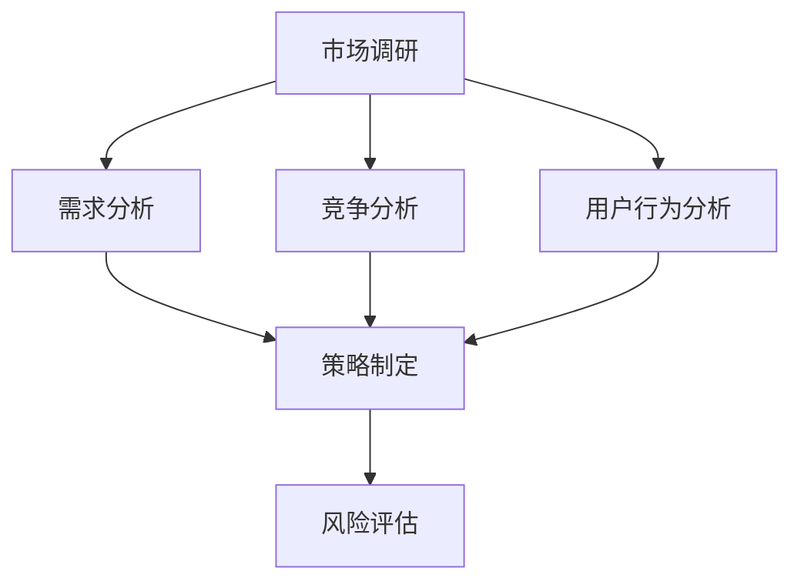

                 

# 市场调研：创业者的明灯

> 关键词：市场调研, 创业, 用户需求, 数据收集, 竞争分析, 策略制定, 风险评估

## 1. 背景介绍

### 1.1 问题由来
在创业的道路上，每一个决策都至关重要。错误的决策可能会导致项目的失败，而正确的决策则能带来市场的成功。市场调研作为创业过程中不可忽视的一部分，它的准确性和全面性直接影响了创业的成功与否。然而，对于许多创业者来说，市场调研不仅耗时耗力，而且可能难以系统地开展。本文将详细阐述市场调研的核心概念、方法论和实际应用，帮助创业者在创业之初就能做出更明智的决策。

### 1.2 问题核心关键点
市场调研的核心目标是通过收集和分析市场数据，理解市场需求、竞争环境、用户行为，从而指导创业方向的制定和产品设计。主要关注点包括：

- **市场需求**：目标市场的规模、增长潜力、消费者需求、用户痛点等。
- **竞争环境**：竞争对手的优劣势、市场份额、创新点和市场定位。
- **用户行为**：用户使用习惯、购买行为、反馈信息等。
- **策略制定**：基于调研结果，制定符合市场需求和竞争环境的商业模式、营销策略和运营方案。
- **风险评估**：识别潜在的市场风险和竞争威胁，制定应对策略。

本文将围绕以上关键点，探讨市场调研的核心方法和工具，以期为创业者提供系统的市场分析框架和实用的实践建议。

## 2. 核心概念与联系

### 2.1 核心概念概述

为更好地理解市场调研的原理和方法，本节将介绍几个关键的概念：

- **市场调研**：通过收集、分析和解释市场信息，了解市场需求、竞争态势和用户行为的过程。市场调研是创业者制定商业决策的重要依据。
- **需求分析**：深入理解目标市场中的用户需求，识别潜在的市场机会。
- **竞争分析**：分析竞争对手的产品、市场策略和市场表现，识别自身的优势和劣势。
- **用户行为分析**：研究用户的使用习惯、购买行为、满意度等，指导产品设计和营销策略。
- **策略制定**：基于调研结果，制定商业计划、市场营销、产品开发等方面的策略。
- **风险评估**：识别市场风险和竞争威胁，制定应对措施，降低潜在风险。

这些核心概念之间的逻辑关系可以通过以下Mermaid流程图来展示：



这个流程图展示了几类核心概念及其之间的关系：

1. 市场调研通过收集和分析市场信息，为需求分析、竞争分析、用户行为分析和策略制定提供依据。
2. 需求分析、竞争分析和用户行为分析分别从不同的维度深入研究市场，以支撑策略制定。
3. 策略制定整合多方调研结果，制定具体的商业计划和执行方案。
4. 风险评估对策略执行可能面临的风险进行评估，制定风险应对措施。

这些概念共同构成了市场调研的完整框架，帮助创业者系统地理解市场和用户需求，从而做出科学的商业决策。

## 3. 核心算法原理 & 具体操作步骤
### 3.1 算法原理概述

市场调研的算法原理基于数据驱动的决策制定，通过收集和分析市场数据，理解市场需求、竞争环境、用户行为，从而指导商业决策。其核心思想是通过系统化、结构化的调研方法，获取准确的市场信息，支持科学的商业策略制定。

市场调研的算法主要包括数据收集、数据分析、策略制定三个环节。在每个环节中，都需要应用不同的算法和技术，以确保调研结果的可靠性和有效性。

### 3.2 算法步骤详解

市场调研的算法步骤可以分为以下几个关键步骤：

**Step 1: 数据收集**

1. **确定调研目标**：明确调研的具体目标，如了解市场需求、分析竞争对手、研究用户行为等。
2. **选择调研方法**：根据调研目标，选择合适的调研方法，如问卷调查、深度访谈、焦点小组、网络爬虫等。
3. **制定调研计划**：包括调研的时间安排、样本选择、数据采集工具和方法等。

**Step 2: 数据分析**

1. **数据预处理**：对收集到的数据进行清洗、去重、格式化等预处理操作。
2. **数据统计分析**：使用统计分析方法，如描述统计、假设检验等，对数据进行分析和解释。
3. **数据可视化**：通过图表、图形等形式，直观展示数据分析结果，便于理解和决策。

**Step 3: 策略制定**

1. **市场分析**：基于数据分析结果，进行市场分析，识别市场机会和潜在风险。
2. **策略制定**：根据市场分析结果，制定具体的商业策略，包括产品设计、市场定位、营销策略等。
3. **策略执行**：将制定的策略转化为具体的行动计划，明确执行步骤和时间安排。

### 3.3 算法优缺点

市场调研的算法优点主要体现在以下几个方面：

1. **数据驱动**：调研结果基于真实的数据分析，具有较高的客观性和科学性。
2. **全面性**：通过多维度、多方法的数据收集和分析，能够全面了解市场需求和竞争环境。
3. **可操作性**：调研结果能够直接指导商业策略的制定和执行，具有较高的实用价值。
4. **灵活性**：不同的调研方法和工具可以根据具体情况灵活选择和组合，适应不同的市场环境。

然而，市场调研也存在一些局限性：

1. **成本高**：数据收集和分析需要大量时间和资源投入，对于中小企业来说，可能面临较高的成本压力。
2. **数据偏差**：调研方法的选择和执行可能存在偏差，导致调研结果不准确。
3. **动态变化**：市场环境和用户需求会不断变化，调研结果可能过时。
4. **复杂性**：数据量和信息的多样性使得数据分析和解释较为复杂，需要较高的专业技能。

尽管存在这些局限性，但市场调研在商业决策中的重要性不言而喻。正确的市场调研能够为创业方向提供明确指导，减少决策的盲目性和风险。

### 3.4 算法应用领域

市场调研的应用领域非常广泛，涵盖几乎所有行业和商业活动。以下是几个典型的应用场景：

- **消费品行业**：通过市场调研了解消费者需求，指导产品设计、市场推广和渠道选择。
- **科技行业**：调研新技术的潜在市场，评估技术应用前景，制定产品发布和市场策略。
- **金融行业**：研究市场趋势和用户行为，制定投资策略和风险管理方案。
- **教育行业**：了解教育市场的需求和用户行为，设计课程内容和营销策略。
- **医疗行业**：调研医疗服务需求和市场变化，指导医疗产品开发和市场拓展。

市场调研的方法和技术已经广泛应用于各行各业，成为创业决策的重要工具。

## 4. 数学模型和公式 & 详细讲解 & 举例说明

### 4.1 数学模型构建

市场调研的数学模型通常基于统计学和优化学的原理，通过构建假设和模型，对市场数据进行分析。常用的模型包括线性回归、逻辑回归、主成分分析(PCA)、聚类分析等。

### 4.2 公式推导过程

以线性回归模型为例，其数学模型可以表示为：

$$
y = \beta_0 + \beta_1x_1 + \beta_2x_2 + \cdots + \beta_nx_n + \epsilon
$$

其中，$y$ 为目标变量（如销售额），$x_1, x_2, \cdots, x_n$ 为解释变量（如广告投入、促销活动等），$\beta_0, \beta_1, \cdots, \beta_n$ 为回归系数，$\epsilon$ 为误差项。

线性回归模型的最小二乘法求解公式为：

$$
\hat{\beta} = (\mathbf{X}^T\mathbf{X})^{-1}\mathbf{X}^T\mathbf{y}
$$

其中，$\mathbf{X}$ 为解释变量的矩阵，$\mathbf{y}$ 为目标变量的向量，$\hat{\beta}$ 为回归系数的估计值。

### 4.3 案例分析与讲解

假设某创业公司希望了解广告投入对其销售额的影响。收集了过去一年内的广告投入和销售额数据，建立线性回归模型。数据集包含100个样本，每个样本有2个特征：广告投入和促销活动，目标变量为销售额。

| 广告投入(x1) | 促销活动(x2) | 销售额(y) |
|-------------|-------------|----------|
| 1000        | 0           | 100000   |
| 2000        | 1           | 120000   |
| ...         | ...         | ...      |

通过最小二乘法求解得到回归系数：

$$
\hat{\beta}_0 = 80000, \hat{\beta}_1 = 50000, \hat{\beta}_2 = 20000
$$

因此，线性回归模型的预测公式为：

$$
y = 80000 + 50000x_1 + 20000x_2
$$

代入新的广告投入和促销活动，即可预测销售额。例如，当广告投入为3000元，促销活动为1时，预测销售额为160000元。

这个案例展示了线性回归模型在市场调研中的应用，通过数据分析，帮助企业制定更有效的广告策略，提升销售额。

## 5. 项目实践：代码实例和详细解释说明
### 5.1 开发环境搭建

在进行市场调研的项目实践前，我们需要准备好开发环境。以下是使用Python进行市场调研数据处理和分析的环境配置流程：

1. 安装Anaconda：从官网下载并安装Anaconda，用于创建独立的Python环境。

2. 创建并激活虚拟环境：
```bash
conda create -n market_research python=3.8 
conda activate market_research
```

3. 安装相关Python库：
```bash
conda install pandas numpy matplotlib seaborn jupyter notebook
```

完成上述步骤后，即可在`market_research`环境中开始市场调研的实践。

### 5.2 源代码详细实现

以下是一个使用Python进行市场调研数据分析的示例代码，展示了如何收集数据、进行数据清洗和分析，并可视化结果：

```python
import pandas as pd
import numpy as np
import matplotlib.pyplot as plt

# 读取数据
data = pd.read_csv('market_research.csv')

# 数据清洗
data = data.dropna()  # 去除缺失值
data = data.drop_duplicates()  # 去除重复值

# 数据统计分析
mean_sales = data['sales'].mean()
std_sales = data['sales'].std()
min_sales = data['sales'].min()
max_sales = data['sales'].max()

# 数据可视化
plt.figure(figsize=(8, 6))
plt.hist(data['sales'], bins=20, color='blue')
plt.xlabel('Sales')
plt.ylabel('Frequency')
plt.title('Distribution of Sales')
plt.show()

# 线性回归分析
from sklearn.linear_model import LinearRegression
X = data[['ad_spending', 'promotion_spending']]
y = data['sales']
model = LinearRegression()
model.fit(X, y)
print('Intercept:', model.intercept_)
print('Coefficients:', model.coef_)
```

在这个示例中，我们首先使用Pandas库读取市场调研数据，然后使用Numpy库进行数据清洗，使用Matplotlib库进行数据可视化，最后使用Scikit-learn库进行线性回归分析。

### 5.3 代码解读与分析

让我们再详细解读一下关键代码的实现细节：

**数据读取和清洗**：
- 使用`pd.read_csv`方法读取市场调研数据，存储为Pandas DataFrame对象。
- 使用`dropna`方法去除缺失值，使用`drop_duplicates`方法去除重复值，确保数据的一致性和完整性。

**数据统计分析**：
- 使用Numpy库的`mean`、`std`、`min`、`max`函数计算销售额的均值、标准差、最小值和最大值，提供数据的基本统计特征。

**数据可视化**：
- 使用Matplotlib库创建直方图，展示销售额的分布情况。`figsize`参数设置图表大小，`color`参数设置柱状图的颜色，`xlabel`、`ylabel`、`title`参数设置图表的标签和标题。

**线性回归分析**：
- 使用Scikit-learn库的`LinearRegression`类建立线性回归模型，`fit`方法用于训练模型。
- 打印模型的截距和系数，以便进一步分析模型预测结果。

这个示例展示了如何通过Python进行市场调研数据的收集、清洗、统计分析和可视化。开发者可以将更多精力放在数据处理、模型建立和结果解释上，而不必过多关注底层实现细节。

## 6. 实际应用场景
### 6.1 企业市场扩展

市场调研在企业市场扩展过程中具有重要作用。企业希望进入新的市场，需要进行详细的市场调研，了解目标市场的规模、增长潜力和用户需求。例如，某创业公司希望进入新兴的健康食品市场，可以通过市场调研了解市场需求、竞争对手和用户偏好，制定相应的市场进入策略，设计合适的产品和营销方案。

### 6.2 产品开发

产品开发是企业创新的重要环节。通过市场调研，企业可以了解用户的需求和痛点，从而指导产品设计和开发。例如，某创业公司希望开发一款新的智能手表，可以通过市场调研了解用户对健康监测、运动追踪、智能提醒等功能的期待，设计相应的功能和界面，提升用户体验和产品竞争力。

### 6.3 品牌定位

品牌定位是企业核心竞争力的重要组成部分。通过市场调研，企业可以了解目标用户群体的品牌认知和情感倾向，从而制定相应的品牌定位策略。例如，某创业公司希望定位为高端奢侈品牌，可以通过市场调研了解用户对高端品牌的需求和期望，调整品牌策略，提升品牌形象和市场地位。

### 6.4 竞争分析

竞争分析是市场调研的重要组成部分，通过了解竞争对手的优劣势，制定差异化竞争策略。例如，某创业公司希望进入在线教育市场，可以通过市场调研了解竞争对手的市场份额、课程内容和市场策略，分析自身的优劣势，制定相应的竞争策略，提升市场竞争力。

### 6.5 市场趋势预测

市场趋势预测是市场调研的重要应用之一，通过分析历史数据和市场变化，预测未来的市场趋势和用户行为。例如，某创业公司希望进入移动支付市场，可以通过市场调研了解市场的发展趋势和用户需求变化，预测未来的市场发展方向，及时调整产品和服务策略。

## 7. 工具和资源推荐
### 7.1 学习资源推荐

为了帮助开发者系统掌握市场调研的理论基础和实践技巧，这里推荐一些优质的学习资源：

1. 《市场调研方法与实践》系列博文：由市场调研专家撰写，深入浅出地介绍了市场调研的基本概念、方法论和实际应用。

2. CS397《市场调研与数据分析》课程：由斯坦福大学开设的市场调研经典课程，涵盖市场调研的各个方面，包括定性和定量研究方法。

3. 《市场调研与管理》书籍：由市场调研领域知名学者所著，全面介绍了市场调研的基本原理和方法，包括数据收集、分析、报告撰写等。

4. Nielsen市场调研报告：Nielsen的市场调研报告覆盖了多个行业和市场，提供丰富的市场洞察和数据分析，是了解市场趋势的重要资源。

通过对这些资源的学习实践，相信你一定能够快速掌握市场调研的精髓，并用于解决实际的商业问题。

### 7.2 开发工具推荐

高效的开发离不开优秀的工具支持。以下是几款用于市场调研开发的常用工具：

1. Python：市场调研数据分析的强大工具，支持丰富的数据处理和分析库，如Pandas、NumPy、Matplotlib、Seaborn等。

2. R：另一款强大的数据分析工具，拥有丰富的统计分析和可视化库，如ggplot2、dplyr、tidyverse等。

3. Excel：商业数据分析的经典工具，易于上手，支持多种数据处理和分析功能。

4. Tableau：强大的数据可视化工具，支持多种数据源和图表形式，便于理解分析结果。

5. SPSS：专业的统计分析工具，支持丰富的数据分析和建模功能，适用于复杂的数据分析任务。

合理利用这些工具，可以显著提升市场调研的开发效率，加快创新迭代的步伐。

### 7.3 相关论文推荐

市场调研的研究领域广阔，涉及统计学、社会学、心理学等多个学科。以下是几篇奠基性的相关论文，推荐阅读：

1. "Market Research Methods: A Comprehensive Guide" by Cheryl A. Halpin：介绍了市场调研的多种方法和技术，包括定量和定性研究方法。

2. "The Application of Multiple Regression Analysis to Research in Business Administration" by Richard A. Johnson and Dean W. Wichern：展示了回归分析在市场调研中的应用，提供了详细的数据分析和模型构建方法。

3. "A Comparison of Two Multivariate Techniques for Predictive Modeling" by Joanne Chung K. Woo and Charles W. Park：比较了多种多变量分析方法在市场调研中的应用效果，提供了实用的决策支持。

4. "Consumer Behavior and Marketing Action: Integrating Theory, Research, and Practice" by Peter F. Druckman, George R. Tybout, and Kristin J. Rao：结合理论和实践，探讨了消费者行为与市场策略之间的关系，提供了深入的市场洞察。

这些论文代表了大规模市场调研技术的发展脉络，通过学习这些前沿成果，可以帮助研究者把握学科前进方向，激发更多的创新灵感。

## 8. 总结：未来发展趋势与挑战

### 8.1 总结

本文对市场调研的核心概念、方法论和实际应用进行了全面系统的介绍。首先阐述了市场调研的核心目标和重要性，明确了调研在商业决策中的不可替代作用。其次，从原理到实践，详细讲解了市场调研的数学模型和算法步骤，给出了具体的项目实践代码实例。同时，本文还广泛探讨了市场调研在多个行业领域的应用场景，展示了调研方法的广泛应用价值。

通过本文的系统梳理，可以看到，市场调研通过数据驱动，能够系统地理解市场需求和竞争环境，从而为商业决策提供有力的数据支持。未来，伴随市场调研技术的不断进步，相信市场调研必将在商业决策中发挥更大的作用，为创业者和企业带来更多的商业机会。

### 8.2 未来发展趋势

展望未来，市场调研技术将呈现以下几个发展趋势：

1. **多维度数据整合**：未来市场调研将更多地整合多维度、多渠道的数据，包括社交媒体、电子商务、移动应用等，提供更全面、深入的市场洞察。

2. **实时数据分析**：大数据和云计算技术的普及，使得实时数据分析成为可能。通过实时监控市场变化，企业可以迅速做出反应，提升市场竞争力。

3. **人工智能应用**：人工智能技术的发展，使得市场调研更加智能化、自动化。通过机器学习和深度学习技术，企业可以自动化地进行数据清洗、分析和预测，提高效率和准确性。

4. **跨学科融合**：市场调研将更多地融合社会学、心理学、行为经济学等学科的知识，提供更深层次的市场洞察和用户行为分析。

5. **新兴技术的运用**：新兴技术如区块链、物联网、5G等，将带来新的市场变化和用户需求，市场调研需要及时引入这些技术，提供更前瞻的市场预测和决策支持。

这些趋势凸显了市场调研技术的广阔前景，未来将为创业者和企业带来更多的商业机会。

### 8.3 面临的挑战

尽管市场调研技术不断发展，但在迈向更加智能化、普适化应用的过程中，它仍面临诸多挑战：

1. **数据隐私和伦理**：市场调研涉及大量用户数据，如何保障数据隐私和用户隐私，是重要的伦理问题。

2. **数据质量和可靠性**：数据的真实性和可靠性直接影响调研结果的准确性，如何保证数据的质量和可靠性，是重要的技术挑战。

3. **数据安全和防护**：市场调研涉及敏感数据，如何防止数据泄露和恶意攻击，是重要的安全问题。

4. **技术复杂性和成本**：大数据和人工智能技术的应用，增加了市场调研的复杂性和成本，对于中小企业来说，可能面临较高的技术门槛和成本压力。

5. **技术和业务协同**：市场调研需要技术与业务协同工作，如何实现技术与业务的深度融合，是重要的实践挑战。

这些挑战需要技术、业务和伦理等多方面的协同解决，只有不断创新和优化，才能真正发挥市场调研的作用，为创业者和企业带来更多的商业机会。

### 8.4 研究展望

面对市场调研面临的挑战，未来的研究需要在以下几个方面寻求新的突破：

1. **新兴技术应用**：引入新兴技术，如大数据、人工智能、区块链等，提升市场调研的效率和准确性。

2. **跨学科融合**：将社会学、心理学、行为经济学等学科的知识融合到市场调研中，提供更深层次的市场洞察和用户行为分析。

3. **技术创新**：开发新的技术方法，如自然语言处理、情感分析、时间序列分析等，提升市场调研的深度和广度。

4. **跨领域应用**：将市场调研技术应用于更多的行业和领域，如医疗、教育、能源等，提供更广泛的市场洞察和决策支持。

5. **伦理和安全**：加强数据隐私保护和伦理研究，确保调研过程和结果的公正性和可信赖性。

这些研究方向的探索，必将引领市场调研技术迈向更高的台阶，为创业者和企业带来更多的商业机会。面向未来，市场调研技术还需要与其他人工智能技术进行更深入的融合，共同推动自然语言理解和智能交互系统的进步。只有勇于创新、敢于突破，才能不断拓展市场调研的边界，让数据驱动的商业决策更加科学、高效。

## 9. 附录：常见问题与解答

**Q1：市场调研需要哪些基本步骤？**

A: 市场调研的基本步骤包括：
1. 确定调研目标：明确调研的具体目的和范围。
2. 设计调研方法：选择合适的调研方法和工具。
3. 收集调研数据：通过问卷调查、深度访谈、焦点小组等方式收集数据。
4. 数据清洗和分析：对收集到的数据进行清洗和初步分析。
5. 结果解释和报告：对数据分析结果进行解释和报告，提出具体的商业建议。

**Q2：如何选择适合的市场调研方法？**

A: 选择适合的市场调研方法需要考虑以下几个因素：
1. 调研目标：根据调研目标选择合适的调研方法，如定性调研、定量调研等。
2. 样本大小：确定调研样本的大小和代表性，确保调研结果的可靠性。
3. 数据类型：根据数据类型选择合适的调研方法，如问卷调查、深度访谈、焦点小组等。
4. 成本和时间：考虑调研的成本和时间限制，选择合适的调研方法。

**Q3：如何进行数据清洗和预处理？**

A: 数据清洗和预处理是市场调研中重要的步骤，主要包括：
1. 去除缺失值：使用删除或插值方法处理缺失值。
2. 去重和一致性检查：去除重复值，确保数据的一致性和准确性。
3. 数据格式化：将数据转换为统一的格式，便于分析和处理。
4. 异常值处理：识别和处理异常值，确保数据的可靠性和准确性。

**Q4：如何进行数据可视化？**

A: 数据可视化是市场调研结果展示的重要方式，主要包括：
1. 选择适合的图表形式：根据数据分析结果选择合适的图表形式，如条形图、折线图、散点图等。
2. 设置图表参数：设置图表的大小、颜色、标签等参数，确保图表的清晰度和可读性。
3. 使用可视化工具：使用Matplotlib、Seaborn等可视化工具，生成高质量的图表。

**Q5：如何进行线性回归分析？**

A: 线性回归分析是市场调研中常用的方法，主要步骤包括：
1. 数据准备：将数据转换为模型所需的形式，如将自变量和因变量分开。
2. 模型建立：使用Scikit-learn库建立线性回归模型，如`LinearRegression`类。
3. 模型训练：使用训练数据训练模型，得到回归系数。
4. 模型评估：使用测试数据评估模型性能，如计算均方误差、决定系数等指标。
5. 模型应用：使用模型预测新的数据，提供市场预测和决策支持。

这些常见问题的解答，帮助创业者更好地理解市场调研的基本步骤和方法，从而制定科学的商业策略和决策。

