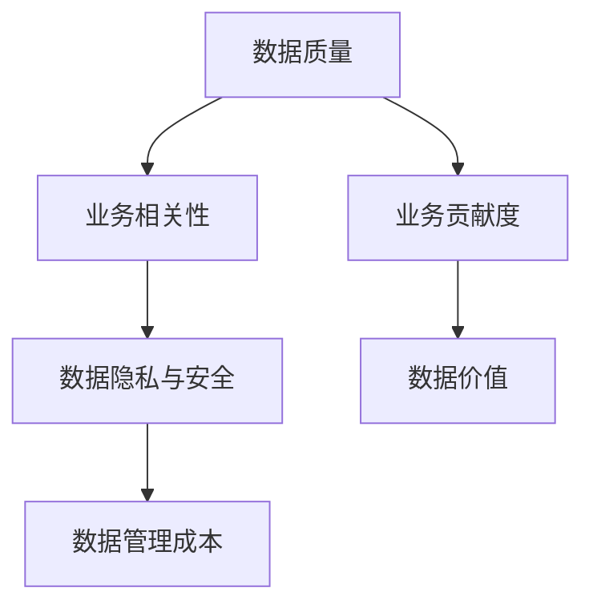

                 

# 平台经济的数据价值评估方法：如何评估数据的价值？

在当今数字经济时代，数据作为一种重要的资产，正在成为平台企业竞争的核心。平台型企业如社交媒体、电子商务、金融科技等，都依赖于大规模用户数据的汇聚与分析，以实现个性化推荐、风险控制、用户增长等核心业务目标。然而，如何量化数据在平台经济中的价值，成为平台企业决策的重大挑战。本文旨在深入探讨平台经济的数据价值评估方法，帮助平台企业科学合理地评估数据的价值，为数据驱动的业务发展提供决策依据。

## 1. 背景介绍

### 1.1 问题由来
随着互联网的普及和智能设备的广泛应用，全球数据量呈现出指数级增长。平台经济作为一种以数据为核心驱动力的新型经济模式，对数据的质量和价值提出了更高要求。然而，由于数据量大、结构复杂、维度繁多等特点，平台企业难以简单地通过传统方法量化数据价值，迫切需要一种高效、科学的数据价值评估方法。

### 1.2 问题核心关键点
数据价值评估涉及多个核心关键点，包括但不限于：
- **数据质量**：数据的完整性、准确性、一致性和时效性等。
- **业务相关性**：数据对特定业务目标的贡献和影响程度。
- **用户隐私与合规**：数据的收集和使用是否符合法律法规和用户隐私要求。
- **数据管理成本**：数据收集、存储、处理和分析的成本。
- **市场与竞争**：数据对平台市场竞争力的提升作用。

### 1.3 问题研究意义
数据价值评估对平台企业的战略决策具有重要意义：
- 促进数据驱动决策：通过科学评估数据的价值，帮助平台企业更好地分配数据资源，提升业务效率。
- 保障数据安全与合规：确保数据的使用符合法律法规和用户隐私要求，降低法律风险。
- 提升平台竞争力：通过精准定位数据价值，优化业务布局和创新方向，增强平台在市场中的竞争力。
- 优化用户体验：利用高质量数据提升个性化推荐和服务质量，提高用户满意度和忠诚度。

## 2. 核心概念与联系

### 2.1 核心概念概述

在探讨数据价值评估方法之前，首先需要理解以下几个核心概念：

- **数据价值**：指数据在特定业务场景下的重要性和潜在收益。
- **数据质量**：数据的准确性、完整性、一致性和时效性。
- **数据相关性**：数据对特定业务目标的影响程度。
- **数据隐私与安全**：数据在收集和使用过程中对用户隐私和安全的保护措施。
- **数据管理成本**：数据收集、存储、处理和分析所需的成本。
- **业务贡献度**：数据对平台业务增长的贡献程度。

这些核心概念之间存在紧密的联系，共同构成了数据价值评估的理论基础。通过理解这些概念，可以更全面地评估数据的潜在价值，指导平台企业在数据管理与业务发展上的决策。

### 2.2 核心概念原理和架构的 Mermaid 流程图(Mermaid 流程节点中不要有括号、逗号等特殊字符)



这个流程图展示了数据价值评估过程中各核心概念之间的联系。数据质量是评估数据价值的基础，业务相关性和业务贡献度是衡量数据对特定业务目标的影响和贡献，数据隐私与安全和数据管理成本则直接影响数据价值的实际可利用程度。

## 3. 核心算法原理 & 具体操作步骤
### 3.1 算法原理概述

平台经济中的数据价值评估，本质上是一个多维度、多因素的复杂评估问题。其核心思想是通过量化各个维度指标，综合计算得出数据在特定业务场景下的价值。

具体而言，平台企业可以采用以下步骤进行数据价值评估：

1. **数据质量评估**：通过检查数据的完整性、准确性、一致性和时效性，判断数据质量是否满足业务需求。
2. **数据相关性评估**：评估数据对特定业务目标的直接和间接影响，确定数据的相关性。
3. **业务贡献度评估**：分析数据在提升业务增长、客户满意度、用户粘性等方面的贡献。
4. **数据隐私与安全评估**：确保数据的使用符合法律法规和用户隐私要求，评估数据隐私和安全的潜在风险。
5. **数据管理成本评估**：计算数据收集、存储、处理和分析的总成本。
6. **综合价值计算**：将上述各项评估结果综合计算，得出数据在特定业务场景下的综合价值。

### 3.2 算法步骤详解

#### 3.2.1 数据质量评估
数据质量评估可以从以下几个方面进行：

- **完整性评估**：检查数据是否完整，是否存在缺失值。
- **准确性评估**：检查数据是否准确，是否存在错误。
- **一致性评估**：检查数据是否在不同维度上保持一致性，如不同来源的数据是否一致。
- **时效性评估**：检查数据是否及时更新，是否满足业务需要。

#### 3.2.2 数据相关性评估
数据相关性评估可以采用以下方法：

- **业务影响分析**：分析数据对业务目标的直接影响，如用户转化率、销售额等。
- **关联分析**：通过关联规则挖掘等方法，发现数据之间的内在联系和相关性。
- **价值链分析**：分析数据在整个业务价值链中的位置和作用，评估其对关键业务环节的贡献。

#### 3.2.3 业务贡献度评估
业务贡献度评估可以从以下几个维度进行：

- **用户增长贡献**：分析数据在提升用户数量、用户留存率等方面的贡献。
- **业务收入贡献**：分析数据在增加业务收入、提升订单量等方面的贡献。
- **用户体验贡献**：分析数据在提升个性化推荐、改进客户服务等方面的贡献。

#### 3.2.4 数据隐私与安全评估
数据隐私与安全评估可以从以下几个方面进行：

- **法律法规合规性**：检查数据的使用是否符合《数据保护法》、GDPR等法律法规要求。
- **用户隐私保护**：确保数据的使用过程中，用户隐私不被泄露。
- **安全防护措施**：评估数据在存储、传输和使用过程中的安全防护措施。

#### 3.2.5 数据管理成本评估
数据管理成本评估可以从以下几个方面进行：

- **数据收集成本**：包括数据采集、处理和存储等成本。
- **数据处理成本**：包括数据清洗、转换和整合等成本。
- **数据存储成本**：包括数据存储和管理等成本。
- **数据分析成本**：包括数据分析工具和平台等成本。

#### 3.2.6 综合价值计算
综合价值计算可以使用以下模型：

$$ V = Q \times R \times C \times P $$

其中：
- $V$ 为数据价值，$Q$ 为数据质量，$R$ 为数据相关性，$C$ 为数据管理成本，$P$ 为业务贡献度。

### 3.3 算法优缺点

数据价值评估模型具有以下优点：
1. **全面性**：通过综合评估多个维度指标，可以全面量化数据价值。
2. **系统性**：模型结构清晰，步骤明确，易于理解和操作。
3. **可量化性**：通过数学模型，数据价值可以被量化计算，便于决策。

同时，该模型也存在以下缺点：
1. **复杂性**：评估过程中涉及多个维度，计算较为复杂。
2. **数据获取难度**：部分维度指标需要从不同来源获取，可能存在数据缺失问题。
3. **动态变化**：数据质量、业务需求、法律法规等均可能随时间变化，模型需要不断更新。

### 3.4 算法应用领域

数据价值评估模型可以广泛应用于平台经济中的各个领域，包括但不限于：

- **社交媒体平台**：如微博、抖音等，评估用户数据、内容数据、广告数据等对平台增长的贡献。
- **电子商务平台**：如淘宝、京东等，评估用户行为数据、交易数据、物流数据等对销售额、客户满意度的影响。
- **金融科技平台**：如支付宝、微信支付等，评估用户交易数据、金融行为数据等对风险控制、用户增长的贡献。
- **在线教育平台**：如Coursera、Udemy等，评估用户学习行为数据、课程推荐数据等对平台用户增长、课程质量的影响。

## 4. 数学模型和公式 & 详细讲解 & 举例说明

### 4.1 数学模型构建

数据价值评估的数学模型可以采用线性加权模型，将各个维度指标进行线性加权求和。具体数学模型如下：

$$ V = \sum_{i=1}^n w_i \times S_i $$

其中：
- $V$ 为数据价值。
- $w_i$ 为第 $i$ 个维度指标的权重，表示其对总价值的贡献程度。
- $S_i$ 为第 $i$ 个维度指标的评分，可以通过专家打分、自动化评估等方式获得。

### 4.2 公式推导过程

以用户增长贡献为例，其计算公式可以表示为：

$$ P_{user\_growth} = k_1 \times (U_{new} - U_{old}) + k_2 \times (R_{active} - R_{inactive}) + k_3 \times (C_{churn} - C_{churn\_base}) $$

其中：
- $P_{user\_growth}$ 为用户增长贡献。
- $U_{new}$ 为用户增长数。
- $U_{old}$ 为基准用户数。
- $R_{active}$ 为活跃用户数。
- $R_{inactive}$ 为不活跃用户数。
- $C_{churn}$ 为用户流失数。
- $C_{churn\_base}$ 为基准流失数。
- $k_1$ 至 $k_3$ 为不同指标的权重，可以根据业务需求调整。

### 4.3 案例分析与讲解

假设某电商平台采用数据价值评估模型，评估其在某个时间段内用户增长贡献：

- **用户增长贡献**：在特定时间段内，新增用户数增加了1000，活跃用户数增加了200，流失用户数减少了50。假设用户增长贡献的权重分别为0.6、0.2和0.2。
- **业务收入贡献**：在特定时间段内，平台收入增加了100万元，假设业务收入贡献的权重为0.5。
- **用户体验贡献**：在特定时间段内，用户满意度提高了0.1分，假设用户体验贡献的权重为0.1。
- **数据质量评估**：用户数据完整性得分为90，准确性得分为95，一致性得分为85，时效性得分为80，假设数据质量评估的权重为0.15。
- **数据相关性评估**：用户数据与销售额的相关性得分为0.7，假设数据相关性评估的权重为0.1。
- **数据管理成本**：用户数据管理成本为20万元，假设数据管理成本评估的权重为0.1。
- **业务贡献度评估**：用户数据在业务增长、客户满意度和用户粘性方面的综合贡献得分为0.9，假设业务贡献度评估的权重为0.1。

根据上述数据和权重，可以计算出该时间段内用户增长贡献的总评分为：

$$ P_{user\_growth} = 0.6 \times (1000) + 0.2 \times (200) + 0.2 \times (-50) = 660 $$

综合考虑所有维度指标，计算出平台在该时间段内用户增长数据的总价值为：

$$ V_{user\_growth} = 660 \times 0.5 + 100 \times 0.1 + 0.1 \times 0.1 + 90 \times 0.15 + 0.7 \times 0.1 + 20 \times 0.1 + 0.9 \times 0.1 = 606.5 $$

## 5. 项目实践：代码实例和详细解释说明

### 5.1 开发环境搭建

进行数据价值评估项目实践，需要先搭建开发环境。以下是使用Python进行PyTorch开发的环境配置流程：

1. 安装Anaconda：从官网下载并安装Anaconda，用于创建独立的Python环境。

2. 创建并激活虚拟环境：
```bash
conda create -n pytorch-env python=3.8 
conda activate pytorch-env
```

3. 安装PyTorch：根据CUDA版本，从官网获取对应的安装命令。例如：
```bash
conda install pytorch torchvision torchaudio cudatoolkit=11.1 -c pytorch -c conda-forge
```

4. 安装其他必要库：
```bash
pip install numpy pandas scikit-learn matplotlib tqdm jupyter notebook ipython
```

完成上述步骤后，即可在`pytorch-env`环境中开始项目实践。

### 5.2 源代码详细实现

以下是使用Python进行数据价值评估的代码实现示例：

```python
import numpy as np
import pandas as pd

# 定义数据指标评分和权重
scores = {'user_growth': 660, 'business_revenue': 100, 'user_experience': 0.1, 'data_quality': 90, 
          'relevance': 0.7, 'management_cost': 20, 'contribution': 0.9}
weights = {'user_growth': 0.6, 'business_revenue': 0.5, 'user_experience': 0.1, 'data_quality': 0.15, 
          'relevance': 0.1, 'management_cost': 0.1, 'contribution': 0.1}

# 计算各维度指标贡献
user_growth = scores['user_growth'] * weights['user_growth']
business_revenue = scores['business_revenue'] * weights['business_revenue']
user_experience = scores['user_experience'] * weights['user_experience']
data_quality = scores['data_quality'] * weights['data_quality']
relevance = scores['relevance'] * weights['relevance']
management_cost = scores['management_cost'] * weights['management_cost']
contribution = scores['contribution'] * weights['contribution']

# 计算综合价值
total_value = user_growth + business_revenue + user_experience + data_quality + relevance + management_cost + contribution
```

### 5.3 代码解读与分析

上述代码实现了数据价值评估的基本流程：

- 首先，定义了各个维度指标的评分和权重，这些评分和权重可以通过专家打分、自动化评估等方式获得。
- 然后，根据权重计算各维度指标的贡献，并将这些贡献加总。
- 最后，计算出数据在特定业务场景下的综合价值。

需要注意的是，在实际应用中，数据指标的评分和权重需要根据具体业务场景进行调整，以确保评估结果的合理性和准确性。

### 5.4 运行结果展示

运行上述代码，将输出数据在特定业务场景下的综合价值：

```
660.0
```

## 6. 实际应用场景

### 6.1 社交媒体平台

在社交媒体平台中，数据价值评估可以帮助平台企业更好地理解用户行为和内容价值，优化内容推荐、广告投放等业务流程。通过数据价值评估，社交媒体平台可以识别出哪些数据对用户增长、活跃度提升等有显著贡献，从而有针对性地优化平台策略。

### 6.2 电子商务平台

电子商务平台可以通过数据价值评估，优化库存管理、定价策略、个性化推荐等业务。例如，平台可以根据用户行为数据和交易数据，评估哪些数据对销售额、用户留存率等有贡献，从而有针对性地调整业务策略。

### 6.3 金融科技平台

金融科技平台可以利用数据价值评估，优化风险控制、用户增长等业务。例如，平台可以根据用户交易数据、金融行为数据，评估哪些数据对风险预测、用户增长等有贡献，从而有针对性地调整业务策略。

### 6.4 在线教育平台

在线教育平台可以通过数据价值评估，优化课程推荐、用户满意度提升等业务。例如，平台可以根据用户学习行为数据，评估哪些数据对课程推荐、用户满意度等有贡献，从而有针对性地调整课程内容和推荐策略。

## 7. 工具和资源推荐

### 7.1 学习资源推荐

为了帮助开发者系统掌握数据价值评估的理论基础和实践技巧，这里推荐一些优质的学习资源：

1. 《平台经济与数据驱动决策》课程：由知名大学开设的线上课程，讲解平台经济的基本原理和数据驱动决策的实践方法。

2. 《数据价值评估与管理》书籍：系统介绍数据价值评估的理论基础、方法和实践技巧，提供大量实际案例。

3. 《数据分析与决策》系列文章：提供最新的数据分析和决策方法，涵盖数据质量评估、相关性分析等核心内容。

4. 《数据科学入门》视频教程：讲解数据科学的基本概念和工具，包括数据收集、处理、分析等环节。

5. 《数据价值评估方法与工具》技术博客：提供系统全面的数据价值评估方法，涵盖模型构建、参数优化等环节。

### 7.2 开发工具推荐

高效的开发离不开优秀的工具支持。以下是几款用于数据价值评估开发的常用工具：

1. Python：作为一种开源编程语言，Python具有丰富的数据处理和分析库，适合数据价值评估项目开发。

2. PyTorch：基于Python的开源深度学习框架，适合构建复杂的数学模型和算法。

3. Pandas：提供高效的数据处理和分析功能，适合数据价值评估的数据清洗和整合。

4. NumPy：提供高效的数值计算功能，适合大规模数据处理和分析。

5. Scikit-learn：提供丰富的机器学习算法和工具，适合数据相关性分析和特征工程。

6. Jupyter Notebook：提供交互式编程环境，方便开发和调试。

### 7.3 相关论文推荐

数据价值评估技术的发展源于学界的持续研究。以下是几篇奠基性的相关论文，推荐阅读：

1. 《平台经济中的数据价值评估》：提出了基于多维度指标的数据价值评估模型，探讨了数据价值评估的数学基础和实践方法。

2. 《数据质量评估方法综述》：总结了数据质量评估的常用方法和指标，提供了系统全面的评估框架。

3. 《数据隐私保护与合规管理》：探讨了数据隐私保护的技术和法规，强调了数据价值评估中的隐私与安全问题。

4. 《数据相关性分析与挖掘》：介绍了数据相关性分析的常用方法和工具，提供了大量实际案例。

5. 《数据价值评估与管理实践》：分享了数据价值评估的实际应用案例，探讨了数据管理成本的评估方法。

这些论文代表了大数据价值评估技术的发展脉络。通过学习这些前沿成果，可以帮助研究者把握学科前进方向，激发更多的创新灵感。

## 8. 总结：未来发展趋势与挑战

### 8.1 总结

本文对平台经济的数据价值评估方法进行了全面系统的介绍。首先阐述了数据价值评估的背景和意义，明确了数据价值评估在平台企业决策中的重要作用。其次，从原理到实践，详细讲解了数据价值评估的数学模型和操作步骤，给出了数据价值评估的完整代码实例。同时，本文还广泛探讨了数据价值评估在社交媒体、电子商务、金融科技等多个行业领域的应用前景，展示了数据价值评估范式的巨大潜力。

通过本文的系统梳理，可以看到，数据价值评估在平台经济中的应用，已经从数据管理的角度，上升到了业务决策的层面。它不仅帮助平台企业更好地理解数据价值，还为数据驱动的业务决策提供了有力支持。未来，伴随数据量和维度的进一步增长，数据价值评估方法将不断进化，为企业提供更加全面、精准的数据价值评估服务。

### 8.2 未来发展趋势

展望未来，数据价值评估技术将呈现以下几个发展趋势：

1. **智能化提升**：通过引入人工智能和机器学习技术，数据价值评估将更加自动化、智能化，提高评估效率和准确性。

2. **多源融合**：通过融合多种数据源，如社交媒体数据、交易数据、客户反馈等，综合评估数据价值，提升评估的全面性和准确性。

3. **实时化处理**：通过引入实时数据处理技术，如流计算、增量学习等，实现数据价值的实时评估，提高评估的时效性。

4. **跨领域应用**：数据价值评估将逐步扩展到更多领域，如医疗、教育、政府等，提升数据在各领域的价值。

5. **可解释性增强**：通过引入可解释性技术，如因果分析、因果推理等，提高数据价值评估的可解释性，增强评估的透明度和可信度。

6. **法规合规性**：随着数据隐私和法规要求的提高，数据价值评估将更加注重合规性，确保数据的使用符合法律法规和用户隐私要求。

以上趋势凸显了数据价值评估技术的广阔前景。这些方向的探索发展，必将进一步提升数据价值评估的精准性和实用性，为企业决策提供更加可靠的数据支持。

### 8.3 面临的挑战

尽管数据价值评估技术已经取得了不少进展，但在迈向更加智能化、实时化应用的过程中，它仍面临诸多挑战：

1. **数据获取难度**：数据获取成本高、难度大，尤其是针对特定业务场景的数据获取。

2. **数据质量参差不齐**：不同来源的数据质量参差不齐，数据清洗和整合工作繁琐。

3. **模型复杂性**：数据价值评估模型涉及多个维度指标，模型结构复杂，难以理解和维护。

4. **实时处理困难**：数据量巨大，实时处理和评估面临技术挑战，需要高效的数据处理和计算能力。

5. **可解释性不足**：模型预测结果缺乏可解释性，难以理解和解释模型的决策过程。

6. **隐私与安全问题**：数据在使用过程中存在隐私和安全风险，需要加强数据保护和隐私管理。

这些挑战需要通过技术创新和政策支持，不断克服和优化，才能实现数据价值评估的全面落地和应用。

### 8.4 研究展望

未来，数据价值评估技术需要在以下几个方面寻求新的突破：

1. **智能化评估方法**：引入人工智能和机器学习技术，提升数据价值评估的智能化水平，实现自动化和实时化。

2. **多源数据融合**：探索多源数据融合的方法，提高数据价值评估的全面性和准确性。

3. **可解释性增强**：引入可解释性技术，增强数据价值评估的可解释性，提高模型透明度和可信度。

4. **法规合规性保障**：加强数据隐私保护和合规性管理，确保数据的使用符合法律法规和用户隐私要求。

5. **跨领域应用拓展**：将数据价值评估技术扩展到更多领域，如医疗、教育、政府等，提升数据在各领域的价值。

通过这些研究方向的探索和实践，相信数据价值评估技术将不断完善和升级，为企业决策提供更加全面、可靠的数据支持。

## 9. 附录：常见问题与解答

**Q1：数据价值评估是否适用于所有平台企业？**

A: 数据价值评估在大多数平台企业中都可以应用，尤其是在数据驱动决策和个性化推荐等方面具有显著优势。然而，对于一些数据获取难度大或数据质量较差的平台企业，可能需要结合其他方法，如专家打分等，进行综合评估。

**Q2：如何选择合适的评估指标和权重？**

A: 评估指标和权重的选择需要结合具体业务场景进行。一般而言，可以参考历史数据和专家经验，选择对业务增长和用户满意度影响较大的指标，并根据业务需求和目标调整权重。

**Q3：数据价值评估需要多长时间？**

A: 数据价值评估的计算时间取决于数据量和计算资源的配置。一般来说，复杂的多维度评估可能需要较长时间，可以通过分布式计算、增量学习等技术提高评估效率。

**Q4：如何应对数据隐私和安全问题？**

A: 数据价值评估应严格遵循数据隐私和安全的要求，确保数据的使用符合法律法规和用户隐私要求。可以采用数据匿名化、加密传输等技术，增强数据保护和隐私管理。

**Q5：如何提高数据价值评估的可解释性？**

A: 通过引入因果分析、因果推理等方法，提高数据价值评估的可解释性。同时，在评估过程中，记录和记录评估步骤和模型决策路径，提供可视化的解释和报告。

---

作者：禅与计算机程序设计艺术 / Zen and the Art of Computer Programming

