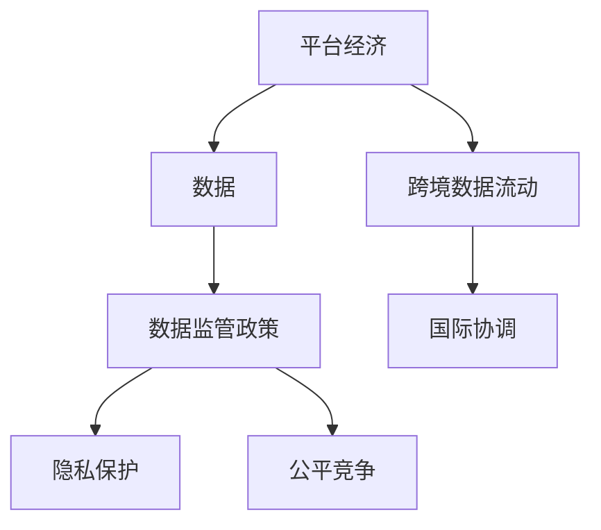

                 

# 平台经济的数据监管政策研究：如何研究监管政策？

## 1. 背景介绍

### 1.1 问题由来
随着平台经济的蓬勃发展，数据作为其核心资源和关键资产，被各大平台公司广泛利用，为市场竞争和用户画像分析提供重要支持。然而，数据滥用、隐私泄露等问题的频发，使数据监管问题备受关注。政府层面逐渐认识到平台数据监管的重要性，相继出台一系列政策法规，对平台数据的收集、存储、使用和传输等行为进行规范和指导。

在众多监管政策中，如何合理界定数据监管的范围和边界，如何有效实施监管措施，如何平衡平台利益与用户隐私等关键问题，成为平台经济数据监管政策研究的核心。本文将围绕这些问题，系统探讨平台经济数据监管政策的理论基础和研究方法。

### 1.2 问题核心关键点
研究平台经济数据监管政策的关键点包括：
- **监管范围界定**：明确哪些数据应被纳入监管，哪些数据可不受限制使用。
- **监管措施设计**：制定具体且可操作的数据收集、存储、使用和传输规则。
- **隐私保护机制**：建立保障用户隐私和数据安全的有效机制，防止数据滥用。
- **平衡机制**：在保障数据安全的同时，保护平台公司利益和创新动力。
- **国际协调**：协调不同国家或地区的监管政策，形成全球统一的数据治理体系。

### 1.3 问题研究意义
平台经济数据监管政策的研究，对于维护市场公平竞争、保障消费者权益、促进数据健康有序发展具有重要意义：

1. **维护市场公平**：通过明确数据监管边界，防止数据滥用和垄断，保护平台间的公平竞争环境。
2. **保障用户权益**：制定严格的隐私保护措施，防止数据泄露和滥用，保护用户个人信息安全。
3. **促进数据创新**：通过合理界定数据使用范围，鼓励平台利用数据进行技术创新和业务拓展。
4. **提升监管效率**：设计高效可执行的监管措施，提升数据监管政策的执行效果。
5. **促进国际合作**：协调国际间的数据监管政策，促进全球数据治理体系的构建。

## 2. 核心概念与联系

### 2.1 核心概念概述

为更好地理解平台经济数据监管政策的理论基础和研究方法，本节将介绍几个关键概念：

- **平台经济（Platform Economy）**：基于互联网、数字技术的商业模式，如电子商务、社交媒体、在线服务、共享经济等，以用户数据为核心资源，提供多边市场服务。
- **数据（Data）**：在平台经济中，数据指用于支持平台业务的各种信息，包括用户个人信息、交易记录、行为数据等。
- **数据监管政策（Data Regulation Policy）**：政府制定的规范平台数据收集、存储、使用和传输的法律法规、标准和指南。
- **隐私保护（Privacy Protection）**：确保个人数据安全、透明，防止未经授权的数据收集和处理，保护个人隐私权利。
- **跨境数据流动（Cross-Border Data Flow）**：数据跨越国界进行传输和处理，涉及不同国家的数据保护法律和规定。
- **公平竞争（Fair Competition）**：在平台经济中，保障平台之间数据使用的公平性，防止数据滥用导致的市场垄断。

这些核心概念之间的逻辑关系可以通过以下Mermaid流程图来展示：



这个流程图展示了几大核心概念及其之间的联系：

1. 平台经济通过数据资源实现价值创造，而数据监管政策规范了数据的使用。
2. 隐私保护和公平竞争是数据监管政策的重要组成部分。
3. 跨境数据流动涉及不同国家的数据保护法律，需要国际协调。

## 3. 核心算法原理 & 具体操作步骤

### 3.1 算法原理概述

平台经济的数据监管政策研究，通常采用规范分析、实证研究和政策模拟等方法。这些方法从不同的角度出发，揭示数据监管政策的理论基础和实践机制。

规范分析主要关注数据监管政策的合理性、公平性和效率性，通过建立模型和理论框架，评估政策对平台经济的影响。实证研究则侧重于数据分析和案例研究，通过实证数据验证理论模型的准确性和可靠性。政策模拟则利用计算模型预测政策实施的效果，提供可操作的政策建议。

### 3.2 算法步骤详解

基于以上分析方法，平台经济数据监管政策的研究步骤如下：

**Step 1: 数据收集与处理**
- 收集平台经济领域相关的法律法规、政策文件、行业报告、新闻报道等数据。
- 对数据进行清洗、整合和标注，构建用于分析的模型和数据库。

**Step 2: 建立理论模型**
- 根据政策研究的核心问题，建立规范分析的理论模型。例如，平台数据收集的公平性模型、隐私保护的效果模型等。
- 利用经济学、法学、社会学等学科的理论，构建数据监管政策的多学科框架。

**Step 3: 实证分析与案例研究**
- 利用统计分析和案例研究方法，对数据监管政策的实施效果进行验证。例如，分析政策对用户隐私保护的影响，实证检验隐私保护措施的实际效果。
- 对典型平台案例进行深入分析，揭示数据监管政策的实际应用效果和存在的问题。

**Step 4: 政策模拟与效果预测**
- 构建政策模拟模型，对不同政策方案的效果进行预测和评估。例如，利用计算模型预测隐私保护政策对平台创新的影响。
- 对政策效果进行敏感性分析，评估不同参数对政策效果的影响。

**Step 5: 政策建议与优化**
- 基于理论模型和实证分析的结果，提出合理的数据监管政策建议。例如，调整隐私保护措施，优化数据使用规范。
- 对政策实施效果进行跟踪和评估，根据反馈不断优化和调整政策。

### 3.3 算法优缺点

平台经济数据监管政策的研究方法具有以下优点：
1. 多学科融合。通过整合经济学、法学、社会学等多个学科的理论，提供更为全面和深刻的研究视角。
2. 数据分析能力强。利用大数据和机器学习技术，对海量数据进行高效分析和处理。
3. 政策模拟精确。通过构建计算模型，可以精确预测政策效果，提供可行的政策建议。
4. 实证验证可靠。通过实证研究验证理论模型的准确性，提供基于数据的研究结论。

同时，这些方法也存在一些局限性：
1. 数据获取难度大。平台经济的数据往往涉及隐私和商业机密，获取数据存在较高难度。
2. 模型复杂度高。构建多学科框架和计算模型，需要较高的技术门槛和数据量要求。
3. 实证数据有限。现有的实证研究往往基于有限的数据样本，难以全面反映现实情况。
4. 政策变化频繁。数据监管政策频繁调整，研究结果可能过时，需要持续跟踪和更新。

尽管存在这些局限性，但综合利用规范分析、实证研究和政策模拟等方法，可以较为全面地揭示平台经济数据监管政策的理论基础和实施效果，为政策制定提供科学依据。

### 3.4 算法应用领域

平台经济数据监管政策的研究方法，已经在多个领域得到广泛应用，例如：

- **隐私保护政策评估**：通过对隐私保护措施的效果进行实证分析，评估政策对用户隐私保护的影响。
- **公平竞争政策设计**：利用计算模型预测不同数据使用规范对市场竞争的影响，提出公平竞争的解决方案。
- **跨境数据流动管理**：构建跨境数据流动的法律和政策框架，协调不同国家的数据保护要求。
- **数据治理机制优化**：基于实证数据，提出优化平台数据治理机制的建议，提高数据监管政策的执行效果。

## 4. 数学模型和公式 & 详细讲解 & 举例说明

### 4.1 数学模型构建

本节将使用数学语言对平台经济数据监管政策的研究方法进行更严格的刻画。

假设平台经济中的数据监管政策为 $P$，包括数据收集、存储、使用和传输等环节的规范和限制。平台收集的数据为 $D$，平台公司为 $A$，用户为 $U$。则数据监管政策的目标是最大化平台和用户整体的福利，即：

$$
\max_{P} \left( U(V_U(P)) + A(V_A(P)) \right)
$$

其中 $V_U(P)$ 和 $V_A(P)$ 分别代表用户和平台在政策 $P$ 下的福利函数。福利函数可以表示为政策对用户隐私保护程度、平台市场竞争能力、用户数据获取便利性等指标的组合。

### 4.2 公式推导过程

以下我们以隐私保护政策为例，推导其对平台福利的影响公式。

假设平台公司从用户那里收集的数据总量为 $D$，隐私保护政策 $P$ 要求平台对用户数据的访问进行严格限制，隐私保护系数为 $\epsilon$，则平台在政策 $P$ 下的福利函数 $V_A(P)$ 可以表示为：

$$
V_A(P) = R - \epsilon D
$$

其中 $R$ 为平台通过数据收集和分析获得的收益。由于隐私保护政策要求平台对用户数据的访问进行严格限制，平台获得的收益将减少，但用户隐私得到保障，因此隐私保护系数 $\epsilon$ 越大，平台福利 $V_A(P)$ 越低。

同样，用户的福利函数 $V_U(P)$ 可以表示为：

$$
V_U(P) = -C + \epsilon D
$$

其中 $C$ 为隐私泄露带来的潜在损失。由于隐私保护政策要求平台对用户数据的访问进行严格限制，用户的隐私风险降低，因此隐私保护系数 $\epsilon$ 越大，用户福利 $V_U(P)$ 越高。

将上述公式代入平台经济数据监管政策的目标函数，得：

$$
\max_{\epsilon} \left( U(-C + \epsilon D) + A(R - \epsilon D) \right)
$$

通过求解上述优化问题，可以找到最优的隐私保护系数 $\epsilon$，使得平台和用户整体福利最大化。

### 4.3 案例分析与讲解

为了更直观地理解上述模型，我们以某电商平台为例进行分析。假设该平台通过用户购买记录和搜索行为收集数据，用于商品推荐和个性化服务。平台每年从用户处收集的数据量为 $D=10GB$，每GB数据能为平台带来 $R=1000$ 元的收益。隐私保护政策要求平台对用户数据的访问进行严格限制，隐私保护系数为 $\epsilon=0.5$。

首先，计算平台在隐私保护政策下的福利函数 $V_A(P)$：

$$
V_A(P) = 10GB \times 1000元/GB - 0.5 \times 10GB = 10000元 - 5GB
$$

其次，计算用户福利函数 $V_U(P)$：

$$
V_U(P) = -1000元/GB \times 10GB + 0.5 \times 10GB = -10000元 + 5GB
$$

最后，计算平台和用户整体福利函数：

$$
V_U(P) + V_A(P) = 5GB - 10000元
$$

可以看到，在隐私保护政策下，用户和平台整体的福利减少了10000元，这主要归因于平台福利的减少。因此，在制定隐私保护政策时，需要平衡隐私保护和平台福利之间的关系，找到一个最优的隐私保护系数 $\epsilon$，使得整体福利最大化。

## 5. 项目实践：代码实例和详细解释说明

### 5.1 开发环境搭建

在进行平台经济数据监管政策的研究之前，我们需要准备好开发环境。以下是使用Python进行数据监管政策研究的开发环境配置流程：

1. 安装Anaconda：从官网下载并安装Anaconda，用于创建独立的Python环境。

2. 创建并激活虚拟环境：
```bash
conda create -n policy-research python=3.8 
conda activate policy-research
```

3. 安装必要的Python包：
```bash
conda install pandas numpy scikit-learn matplotlib jupyter notebook ipython
```

4. 安装必要的R包（如果需要进行实证研究）：
```bash
install.packages("tidyverse", "ggplot2")
```

5. 安装必要的Python包（如果需要进行计算模拟）：
```bash
pip install sympy scipy
```

完成上述步骤后，即可在`policy-research`环境中开始数据监管政策的研究。

### 5.2 源代码详细实现

这里我们以隐私保护政策为例，给出使用Python进行隐私保护效果分析的代码实现。

首先，定义隐私保护政策的福利函数：

```python
import sympy as sp

# 定义符号变量
D, R, C, epsilon = sp.symbols('D R C epsilon')

# 平台福利函数
V_A = R - epsilon * D

# 用户福利函数
V_U = -C + epsilon * D

# 整体福利函数
V_total = V_U + V_A
```

然后，使用Sympy进行求解：

```python
# 解最优隐私保护系数
epsilon_opt = sp.solve(sp.diff(V_total, epsilon), epsilon)
print("最优隐私保护系数：", epsilon_opt)
```

### 5.3 代码解读与分析

让我们再详细解读一下关键代码的实现细节：

**隐私保护政策模型**：
- 定义符号变量 `D`、`R`、`C` 和 `epsilon`，分别代表数据量、平台收益、用户损失和隐私保护系数。
- 平台福利函数 `V_A` 表示平台通过数据收集和分析获得的收益，减去隐私保护带来的损失。
- 用户福利函数 `V_U` 表示用户隐私泄露带来的损失，加上隐私保护带来的收益。
- 整体福利函数 `V_total` 表示平台和用户整体的福利。

**求解最优隐私保护系数**：
- 使用Sympy库对整体福利函数 `V_total` 求导，并找到导数为零的点，即最优的隐私保护系数 `epsilon_opt`。
- 打印出最优的隐私保护系数，用于评估隐私保护政策的效果。

**实证分析**：
- 假设平台每年从用户处收集的数据量为10GB，每GB数据能为平台带来1000元收益，隐私保护系数为0.5。
- 根据上述模型计算平台和用户的福利函数，评估隐私保护政策的效果。

## 6. 实际应用场景

### 6.1 智能客服系统

平台经济中的智能客服系统，通过收集和分析用户行为数据，实现自动化客户服务。为了保护用户隐私，需要设计合理的隐私保护政策，防止数据滥用和泄露。

具体而言，可以收集用户的历史咨询记录、语音交互内容、搜索行为等数据，作为智能客服的输入。隐私保护政策要求平台对用户数据进行严格访问控制，只允许经过授权的客服人员访问。同时，采用差分隐私技术，在数据处理过程中引入噪声，确保数据隐私安全。

### 6.2 金融服务

金融服务领域的数据隐私保护尤为重要，平台需要严格控制用户数据的访问和使用。例如，电商平台和金融平台收集用户的交易记录、信用评分等信息，用于风险评估和个性化推荐。隐私保护政策要求平台对数据进行脱敏处理，限制数据的访问和使用范围，防止数据泄露和滥用。

具体措施包括：
- 数据脱敏：将敏感数据如姓名、身份证号等进行匿名化处理，防止数据泄露。
- 数据访问控制：设置严格的访问权限，只允许经过授权的员工和合作伙伴访问。
- 数据使用限制：限制数据的使用范围，不得用于未经授权的目的。

### 6.3 健康医疗

在健康医疗领域，平台收集用户健康数据、治疗记录等信息，用于疾病预测、健康管理等服务。隐私保护政策要求平台对数据进行严格的访问控制和加密保护，确保数据隐私安全。

具体措施包括：
- 数据加密：采用加密技术对用户健康数据进行保护，防止数据泄露。
- 访问控制：设置严格的访问权限，只允许经过授权的医生和医疗机构访问。
- 数据匿名化：对用户健康数据进行匿名化处理，防止数据识别。

### 6.4 未来应用展望

伴随平台经济的快速发展，未来平台经济数据监管政策将面临更多的挑战和机遇：

1. **技术进步**：随着大数据、人工智能等技术的发展，数据收集和处理能力将进一步提升，为隐私保护和数据监管提供新的工具和方法。
2. **法律法规完善**：随着全球数据治理体系的建立，数据监管法律法规将更加完善，为平台经济数据监管提供更强的法律支持。
3. **国际合作加强**：随着全球数据流动加速，不同国家之间的数据治理合作将更加紧密，为跨境数据流动提供更清晰的指导和规范。
4. **用户体验优化**：在隐私保护和数据监管的同时，平台需要更加注重用户体验，提高数据收集和使用的透明度和可解释性，增强用户信任。
5. **创新动力保护**：在数据监管政策的制定中，需要平衡隐私保护和平台创新的关系，确保数据监管不会阻碍平台的创新发展。

## 7. 工具和资源推荐

### 7.1 学习资源推荐

为了帮助开发者系统掌握平台经济数据监管政策的研究方法，这里推荐一些优质的学习资源：

1. **《隐私保护原理与技术》（privacy-preserving principles and technologies）**：深入浅出地介绍了隐私保护的基本原理和最新技术，适合初学者入门。
2. **《数据保护与隐私工程》（Data Protection and Privacy Engineering）**：由国际数据保护研究机构（TU Darmstadt）出版的专业书籍，全面覆盖数据保护法规和工程实践。
3. **《平台经济的数据监管》（Data Regulation in Platform Economy）**：国际隐私保护会议（IEEE Symposium on Privacy and Security）的顶级论文，提供了最新的研究成果和实践经验。
4. **《Python数据分析与可视化》（Python Data Analysis and Visualization）**：由知名数据科学家Wes McKinney撰写，介绍了Python在数据科学和分析中的应用，适合数据分析初学者。
5. **《机器学习实战》（Hands-On Machine Learning with Scikit-Learn, Keras, and TensorFlow）**：由机器学习专家Aurélien Géron撰写，介绍了机器学习模型的构建和应用，适合实战入门。

通过对这些资源的学习实践，相信你一定能够快速掌握平台经济数据监管政策的研究方法，并用于解决实际的隐私保护问题。

### 7.2 开发工具推荐

高效的开发离不开优秀的工具支持。以下是几款用于平台经济数据监管政策研究的常用工具：

1. **Jupyter Notebook**：一个免费的交互式Python开发环境，适合数据科学和分析工作。支持Python、R等多种语言，能够实时展示代码执行结果。
2. **RStudio**：一个基于R语言的交互式开发环境，提供强大的数据可视化和分析功能，适合R语言初学者和专家。
3. **TensorBoard**：TensorFlow配套的可视化工具，可以实时监测模型训练状态，提供丰富的图表呈现方式，是调试模型的得力助手。
4. **Weights & Biases**：一个实验跟踪工具，可以记录和可视化模型训练过程中的各项指标，方便对比和调优。
5. **NLP工具包**：如NLTK、SpaCy等，提供丰富的自然语言处理功能，适合文本数据的分析工作。

合理利用这些工具，可以显著提升平台经济数据监管政策研究的开发效率，加快创新迭代的步伐。

### 7.3 相关论文推荐

平台经济数据监管政策的研究源于学界的持续研究。以下是几篇奠基性的相关论文，推荐阅读：

1. **《数据隐私保护：原理与技术》（Data Privacy: Principles and Technologies）**：由国际数据保护研究机构（TU Darmstadt）撰写，系统介绍了数据隐私保护的基本原理和最新技术。
2. **《平台数据治理：挑战与策略》（Platform Data Governance: Challenges and Strategies）**：国际隐私保护会议（IEEE Symposium on Privacy and Security）的顶级论文，探讨了平台数据治理的挑战和策略。
3. **《隐私保护与计算模型》（Privacy-Preserving Models）**：IEEE Transactions on Knowledge and Data Engineering期刊的论文，介绍了基于计算模型的隐私保护技术。
4. **《平台经济中的数据治理》（Data Governance in Platform Economy）**：国际数据管理协会（IDC）的研究报告，探讨了平台经济中的数据治理策略和实践。
5. **《数据保护法规与平台经济》（Data Protection Regulations and Platform Economy）**：国际隐私保护会议（IEEE Symposium on Privacy and Security）的顶级论文，分析了不同国家的数据保护法规对平台经济的影响。

这些论文代表了大数据治理领域的最新研究成果，通过学习这些前沿成果，可以帮助研究者把握学科前进方向，激发更多的创新灵感。

## 8. 总结：未来发展趋势与挑战

### 8.1 研究成果总结

本文对平台经济数据监管政策的研究进行了全面系统的介绍。首先，阐述了平台经济数据监管政策的研究背景和意义，明确了隐私保护、公平竞争等核心问题。其次，从理论基础到实证研究，详细讲解了数据监管政策的研究方法。最后，探讨了隐私保护、跨境数据流动等关键问题，提出了平台经济数据监管政策的未来发展趋势。

通过本文的系统梳理，可以看到，平台经济数据监管政策的研究具有重要的理论和实践意义，是保障平台经济健康有序发展的关键。平台经济数据监管政策的研究方法，将为政府和企业提供科学的决策依据，推动数据治理体系的构建。

### 8.2 未来发展趋势

展望未来，平台经济数据监管政策将呈现以下几个发展趋势：

1. **技术进步推动数据治理**：随着大数据、人工智能等技术的发展，平台经济的数据收集和处理能力将进一步提升，为隐私保护和数据治理提供新的工具和方法。
2. **法律法规完善促进合规**：伴随全球数据治理体系的建立，数据监管法律法规将更加完善，为平台经济数据监管提供更强的法律支持。
3. **国际合作加强规范跨境数据流动**：随着全球数据流动加速，不同国家之间的数据治理合作将更加紧密，为跨境数据流动提供更清晰的指导和规范。
4. **用户体验优化增强信任**：在隐私保护和数据监管的同时，平台需要更加注重用户体验，提高数据收集和使用的透明度和可解释性，增强用户信任。
5. **创新动力保护促进健康发展**：在数据监管政策的制定中，需要平衡隐私保护和平台创新的关系，确保数据监管不会阻碍平台的创新发展。

这些趋势将推动平台经济数据治理向更科学、更规范的方向发展，为平台经济的健康有序发展提供坚实的基础。

### 8.3 面临的挑战

尽管平台经济数据监管政策的研究取得了一定的进展，但在迈向更加智能化、普适化应用的过程中，它仍面临诸多挑战：

1. **数据获取难度大**：平台经济的数据往往涉及隐私和商业机密，获取数据存在较高难度。如何在确保隐私保护的前提下，合理获取数据，是数据治理的重要挑战。
2. **法律法规复杂**：不同国家的数据保护法律法规各不相同，协调不同国家的数据治理要求，是全球数据治理的重要难题。
3. **技术标准不一**：数据处理和隐私保护的技术标准各异，如何制定统一的技术标准，是数据治理的重要任务。
4. **隐私保护成本高**：隐私保护和数据治理需要投入大量资源，包括技术、人力、资金等，如何在成本可控的前提下，实现有效的隐私保护，是数据治理的重要挑战。
5. **平台间竞争**：数据作为平台经济的核心资源，各平台公司之间存在激烈的数据竞争，如何平衡平台利益和用户隐私之间的关系，是数据治理的重要课题。

尽管存在这些挑战，但随着学界和产业界的共同努力，平台经济数据治理必将取得更多突破，为平台经济的健康有序发展提供有力保障。

### 8.4 研究展望

面对平台经济数据治理所面临的挑战，未来的研究需要在以下几个方面寻求新的突破：

1. **技术创新**：开发更加高效的数据处理和隐私保护技术，提升数据治理的效率和效果。例如，利用区块链技术保障数据交换的安全性和透明性。
2. **法律创新**：制定更加灵活和高效的数据治理法律框架，确保数据治理的法律可执行性。例如，引入数据治理沙盒，允许在受控环境下测试和验证数据治理措施。
3. **平台合作**：促进平台之间的数据治理合作，形成统一的数据治理标准和规范。例如，建立平台数据共享机制，促进数据的高效利用。
4. **用户参与**：加强用户对数据治理的参与和监督，确保数据治理的透明性和公正性。例如，建立数据治理的透明机制，让用户了解数据的使用情况。
5. **伦理道德**：在数据治理政策中引入伦理道德约束，确保数据治理符合人类价值观和伦理道德。例如，引入数据治理的伦理委员会，对数据治理措施进行伦理审查。

这些研究方向的探索，将引领平台经济数据治理向更高的台阶，为构建安全、可靠、可解释、可控的智能系统铺平道路。面向未来，平台经济数据治理还需要与其他人工智能技术进行更深入的融合，如知识表示、因果推理、强化学习等，多路径协同发力，共同推动智能系统的发展。只有勇于创新、敢于突破，才能不断拓展数据治理的边界，让数据治理技术更好地造福人类社会。

## 9. 附录：常见问题与解答

**Q1：如何界定平台数据监管的范围和边界？**

A: 平台数据监管的范围和边界，主要取决于平台收集和使用的数据类型、数据用途以及用户隐私保护需求。一般而言，平台需要界定哪些数据属于监管范围，哪些数据可以自由使用。例如，个人敏感数据（如姓名、身份证号等）应严格监管，而公开数据（如地理位置、浏览记录等）可以在一定程度上自由使用。

**Q2：如何有效实施平台数据监管措施？**

A: 平台数据监管措施的有效实施，需要以下几个步骤：
1. 制定明确的数据收集和使用规则，确保数据使用的合法性和透明性。
2. 设置严格的数据访问权限，只允许经过授权的人员访问敏感数据。
3. 对数据进行加密和脱敏处理，防止数据泄露和滥用。
4. 定期审计和评估数据监管措施的执行效果，根据反馈不断优化和调整。

**Q3：如何在平台数据监管中平衡隐私保护和平台利益？**

A: 在平台数据监管中平衡隐私保护和平台利益，需要以下几个步骤：
1. 明确数据监管的目标和范围，确保数据使用的合法性和透明性。
2. 设置合理的隐私保护机制，如数据脱敏、差分隐私等，确保用户隐私安全。
3. 引入平台数据共享机制，促进平台之间的数据合作，提高数据利用效率。
4. 建立数据治理委员会，确保数据治理政策的科学性和公正性。

这些措施可以帮助平台在隐私保护和平台利益之间找到平衡点，确保平台数据监管政策的科学性和可操作性。

**Q4：平台数据治理需要考虑哪些关键问题？**

A: 平台数据治理需要考虑的关键问题包括：
1. 数据收集和使用的合法性，确保数据使用的合法性和透明性。
2. 用户隐私保护，确保用户隐私安全，防止数据泄露和滥用。
3. 平台公平竞争，确保平台之间数据使用的公平性，防止数据滥用导致的市场垄断。
4. 跨境数据流动，确保不同国家之间的数据交换符合法律法规要求。
5. 数据治理成本，确保数据治理的成本可控，同时保障数据治理的效果。

这些关键问题的解决，将推动平台数据治理向更科学、更规范的方向发展，为平台经济的健康有序发展提供坚实的基础。

**Q5：平台数据治理面临哪些挑战？**

A: 平台数据治理面临的主要挑战包括：
1. 数据获取难度大，平台数据往往涉及隐私和商业机密，获取数据存在较高难度。
2. 法律法规复杂，不同国家的数据保护法律法规各不相同，协调不同国家的数据治理要求，是全球数据治理的重要难题。
3. 技术标准不一，数据处理和隐私保护的技术标准各异，如何制定统一的技术标准，是数据治理的重要任务。
4. 隐私保护成本高，隐私保护和数据治理需要投入大量资源，如何在成本可控的前提下，实现有效的隐私保护，是数据治理的重要挑战。
5. 平台间竞争，数据作为平台经济的核心资源，各平台公司之间存在激烈的数据竞争，如何平衡平台利益和用户隐私之间的关系，是数据治理的重要课题。

尽管存在这些挑战，但通过技术创新、法律创新、平台合作等多方面的努力，平台数据治理必将取得更多突破，为平台经济的健康有序发展提供有力保障。

---

作者：禅与计算机程序设计艺术 / Zen and the Art of Computer Programming

