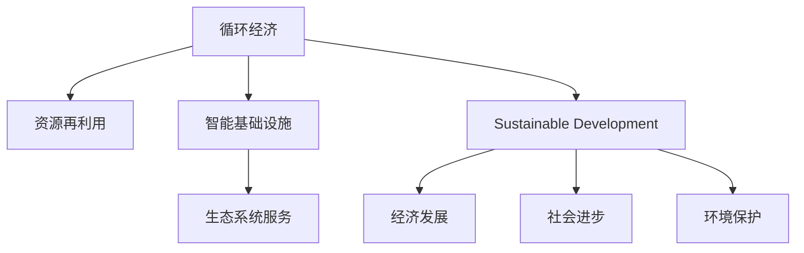

                 

# 2050年的可持续发展：循环经济与资源再利用

> 关键词：可持续发展,循环经济,资源再利用,未来城市,智能基础设施,生态系统服务,数字化转型

## 1. 背景介绍

### 1.1 问题由来

随着工业化进程的不断推进，资源消耗和环境污染问题日益严峻。全球气候变化、生物多样性丧失、水资源短缺等环境问题逐渐显现。面对这样的挑战，国际社会普遍认识到，可持续发展和资源循环利用是实现未来愿景的关键路径。特别是2030年联合国可持续发展目标(UNSDGs)的提出，更是将资源循环与可持续发展紧密挂钩。

当前，循环经济和资源再利用已成为全球应对资源环境挑战的重要手段。在各国政策推动下，众多企业纷纷响应，致力于循环经济的建设和发展。然而，由于现有技术、理念和机制的限制，许多企业在循环经济实践过程中仍然面临诸多挑战。如何在资源约束和环境压力下，更高效、更可持续地利用资源，成为摆在我们面前的重大课题。

### 1.2 问题核心关键点

资源循环和可持续发展的核心在于资源的循环利用和高效配置。资源循环的实现，要求资源在采集、生产、使用和回收各个环节都能高效循环利用。而资源的可持续利用，则要求在满足当前需求的同时，不损害未来世代的发展能力。为应对这一问题，主要需要从以下几个方面进行深入探讨：

- **资源循环与资源优化配置**：研究如何提高资源利用效率，通过技术创新实现资源的循环使用。
- **循环经济系统设计与治理**：研究如何构建高效的循环经济系统，实现资源的精准回收和高效再利用。
- **资源再利用的经济激励**：研究如何设计合理的激励机制，促进企业积极参与资源再利用和循环经济建设。
- **资源环境政策制定与实施**：研究如何制定合理的政策，保障资源循环和可持续发展的顺利推进。

本文将聚焦于资源循环和资源再利用的技术路径，通过循环经济的典型案例和未来展望，探讨如何构建可持续发展的未来。

## 2. 核心概念与联系

### 2.1 核心概念概述

为更好地理解资源循环和资源再利用的技术框架，本节将介绍几个关键概念：

- **循环经济（Circular Economy）**：一种经济系统，旨在通过产品设计、生产过程和服务模式的设计，实现资源的闭环利用，最大程度地减少资源的消耗和废弃。

- **资源再利用（Resource Recycling）**：指将废弃物或二手物品进行收集、清洗、翻新、再利用，转化为新的生产原料或产品。

- **可持续发展（Sustainable Development）**：在不损害未来世代需求的前提下，满足当前世代的需求，平衡经济发展、社会进步和环境保护之间的关系。

- **智能基础设施（Smart Infrastructure）**：结合物联网、大数据、人工智能等技术，构建高效、灵活、可再生的基础设施系统，提升资源利用效率和循环效率。

- **生态系统服务（Ecosystem Services）**：指自然生态系统提供给人类生存和发展的各种服务，如净化空气、水资源供应、生物多样性维护等。

这些概念之间的逻辑关系可以通过以下Mermaid流程图来展示：



这个流程图展示了几者之间的关系：

1. 循环经济通过资源再利用和智能基础设施提升资源利用效率，实现资源的可持续利用。
2. 生态系统服务是资源循环和可持续发展的重要基础，提供资源循环所需的自然条件。
3. 可持续发展平衡经济发展、社会进步和环境保护的关系，确保资源循环的顺利推进。

## 3. 核心算法原理 & 具体操作步骤
### 3.1 算法原理概述

循环经济与资源再利用的核心算法在于优化资源配置和提升循环效率。其基本思想是通过模型对资源流动进行模拟和优化，找到最优的资源循环路径和配置方案。具体来说，包括：

1. **资源流动建模**：构建资源在各环节的流动模型，包括原材料采购、产品制造、使用和回收。
2. **优化配置**：通过优化算法，如线性规划、动态规划等，实现资源在各环节的优化配置。
3. **仿真模拟**：利用仿真软件，对资源流动和配置方案进行模拟，评估资源利用效率和环境影响。

### 3.2 算法步骤详解

基于上述思路，循环经济与资源再利用的核心算法步骤如下：

**Step 1: 数据收集与处理**

- 收集资源流动各环节的数据，包括原材料、产品、废弃物等的生产、流通、使用、回收等信息。
- 对数据进行清洗和预处理，确保数据的质量和一致性。

**Step 2: 资源流动建模**

- 构建资源流动模型，明确资源在各环节的流向和流量。
- 引入时间维度，考虑资源的季节性变化、市场波动等因素。
- 加入环境因素，考虑资源利用对环境的影响。

**Step 3: 优化配置**

- 根据资源流动模型，设置优化目标，如资源利用率、环境影响最小化等。
- 选择适合的优化算法，如线性规划、整数规划、动态规划等。
- 设定优化约束条件，如资源供需平衡、环境标准、成本预算等。
- 通过优化算法求解最优配置方案。

**Step 4: 仿真模拟**

- 利用仿真软件对优化方案进行仿真模拟，评估其资源利用效率和环境影响。
- 对模拟结果进行数据分析，评估方案的可行性和优化空间。
- 对模拟结果进行敏感性分析，评估参数变化对结果的影响。

**Step 5: 实施与评估**

- 根据模拟结果，制定具体的实施方案，并结合技术创新，提升资源利用效率和循环效率。
- 对实施过程进行实时监控，确保方案的顺利推进。
- 定期对实施效果进行评估，并根据评估结果对方案进行调整优化。

### 3.3 算法优缺点

循环经济与资源再利用的核心算法具有以下优点：

1. **系统性**：能够从全局视角分析资源流动，实现资源的高效配置。
2. **实时性**：结合仿真模拟，可以实时调整和优化资源配置方案，适应变化的环境和市场条件。
3. **环境友好**：考虑环境因素，能够实现资源的高效利用和环境影响的最小化。

同时，该算法也存在以下局限性：

1. **数据依赖性强**：算法的准确性依赖于数据的质量和完整性，数据缺失或不准确会影响结果。
2. **复杂度高**：资源流动模型的构建和优化配置涉及多种变量和约束，计算复杂度较高。
3. **实施难度大**：优化配置方案需要技术创新和工程实施，实际操作中可能面临诸多挑战。

### 3.4 算法应用领域

循环经济与资源再利用的核心算法可以广泛应用于以下几个领域：

- **制造业**：构建制造系统的资源循环模型，优化生产过程，实现资源的闭环利用。
- **农业**：优化农业生产中的水资源、土地资源、生物资源的循环利用。
- **城市管理**：构建城市资源循环模型，优化资源配置，提高资源利用效率。
- **交通物流**：优化物流运输中的资源流动，提高运输效率和资源利用率。
- **公共设施**：优化公共设施中的能源、水资源等资源利用，实现可持续运营。

这些领域的应用，能够显著提高资源利用效率和循环效率，实现资源的高效利用和环境的可持续发展。

## 4. 数学模型和公式 & 详细讲解 & 举例说明

### 4.1 数学模型构建

假设有一个包含原材料、产品和废弃物的循环经济系统，用 $X$ 表示原材料，$P$ 表示产品，$W$ 表示废弃物。系统的资源流动模型可以表示为：

$$
X \rightarrow P \rightarrow W \rightarrow X
$$

其中，原材料 $X$ 经过生产转化为产品 $P$，产品 $P$ 使用后转化为废弃物 $W$，废弃物 $W$ 经过处理可再转化为原材料 $X$。

定义资源在各环节的流量为 $x_{i,j}$，其中 $i$ 表示入口，$j$ 表示出口，$i,j \in \{X, P, W\}$。资源流动的流量方程可以表示为：

$$
x_{X,P} = f_{X,P}(x_{X}, x_{P})
$$

$$
x_{P,W} = f_{P,W}(x_{P}, x_{W})
$$

$$
x_{W,X} = f_{W,X}(x_{W}, x_{X})
$$

其中 $f_{i,j}$ 为资源流动的函数，取决于资源类型、生产效率、回收率等因素。

资源利用的效率指标为 $E$，可以表示为：

$$
E = \frac{P_{\text{out}}}{P_{\text{in}}} \times \frac{X_{\text{out}}}{X_{\text{in}}}
$$

其中 $P_{\text{in}}$ 和 $P_{\text{out}}$ 分别表示产品的输入和输出，$X_{\text{in}}$ 和 $X_{\text{out}}$ 分别表示原材料的输入和输出。

### 4.2 公式推导过程

为了优化资源配置，需要构建一个优化问题。假设优化目标为资源利用效率最大化，优化问题可以表示为：

$$
\max E \\
\text{s.t.} \quad f_{X,P}(x_{X}, x_{P}) - x_{X} = 0 \\
\text{s.t.} \quad f_{P,W}(x_{P}, x_{W}) - x_{W} = 0 \\
\text{s.t.} \quad f_{W,X}(x_{W}, x_{X}) - x_{X} = 0
$$

其中第一个约束条件表示资源平衡，第二个约束条件表示产品平衡，第三个约束条件表示废弃物平衡。

引入决策变量 $u_{X}$ 和 $u_{W}$，分别表示原材料和废弃物的额外供应量，优化问题可以表示为：

$$
\max E \\
\text{s.t.} \quad f_{X,P}(x_{X}, x_{P}) - x_{X} + u_{X} = 0 \\
\text{s.t.} \quad f_{P,W}(x_{P}, x_{W}) - x_{W} + u_{W} = 0 \\
\text{s.t.} \quad f_{W,X}(x_{W}, x_{X}) - x_{X} = 0 \\
\text{s.t.} \quad u_{X} \geq 0 \\
\text{s.t.} \quad u_{W} \geq 0
$$

### 4.3 案例分析与讲解

以一个制造企业的资源循环为例，利用上述模型进行优化。

假设企业生产某类产品，原材料为铁矿石，产品为钢铁，废弃物为尾矿。企业生产工艺和回收率如下：

$$
f_{X,P}(x_{X}, x_{P}) = 10x_{X} + 2x_{P}
$$

$$
f_{P,W}(x_{P}, x_{W}) = 1.5x_{P} + 0.5x_{W}
$$

$$
f_{W,X}(x_{W}, x_{X}) = 0.1x_{W} + 0.2x_{X}
$$

企业目标为最大化资源利用效率，满足资源平衡约束。具体求解步骤如下：

1. 构建优化问题：
$$
\max E \\
\text{s.t.} \quad 10x_{X} + 2x_{P} - x_{X} + u_{X} = 0 \\
\text{s.t.} \quad 1.5x_{P} + 0.5x_{W} - x_{W} + u_{W} = 0 \\
\text{s.t.} \quad 0.1x_{W} + 0.2x_{X} - x_{X} = 0 \\
\text{s.t.} \quad u_{X} \geq 0 \\
\text{s.t.} \quad u_{W} \geq 0
$$

2. 引入拉格朗日乘子 $\lambda_1, \lambda_2, \lambda_3$，构建拉格朗日函数：
$$
\mathcal{L}(x_{X}, x_{P}, x_{W}, u_{X}, u_{W}, \lambda_1, \lambda_2, \lambda_3) = E + \lambda_1 (10x_{X} + 2x_{P} - x_{X} + u_{X}) + \lambda_2 (1.5x_{P} + 0.5x_{W} - x_{W} + u_{W}) + \lambda_3 (0.1x_{W} + 0.2x_{X} - x_{X})
$$

3. 求偏导数，求解方程组：
$$
\frac{\partial \mathcal{L}}{\partial x_{X}} = 10 - 1 + \lambda_1 + 0.2\lambda_3 = 0 \\
\frac{\partial \mathcal{L}}{\partial x_{P}} = 2 - 1.5 + \lambda_2 = 0 \\
\frac{\partial \mathcal{L}}{\partial x_{W}} = 0.5 - 0.5 + \lambda_2 - 0.1\lambda_3 = 0 \\
\frac{\partial \mathcal{L}}{\partial u_{X}} = 1 + \lambda_1 = 0 \\
\frac{\partial \mathcal{L}}{\partial u_{W}} = 1 + \lambda_2 = 0
$$

解得 $x_{X} = 50$, $x_{P} = 25$, $x_{W} = 10$, $u_{X} = 0$, $u_{W} = 0$。

## 5. 项目实践：代码实例和详细解释说明
### 5.1 开发环境搭建

要进行资源循环和资源再利用的算法实践，首先需要搭建开发环境。以下是使用Python和PuLP库进行优化问题求解的环境配置流程：

1. 安装Anaconda：从官网下载并安装Anaconda，用于创建独立的Python环境。

2. 创建并激活虚拟环境：
```bash
conda create -n optimize-env python=3.8 
conda activate optimize-env
```

3. 安装PuLP库：
```bash
conda install pypi
pip install pypi pypi-puLP
```

4. 安装其他必要的工具包：
```bash
pip install numpy scipy matplotlib jupyter notebook ipython
```

完成上述步骤后，即可在`optimize-env`环境中开始算法实践。

### 5.2 源代码详细实现

我们以制造业资源循环为例，使用PuLP库进行优化问题的求解。

首先，定义优化问题的数据和约束条件：

```python
from pulp import *

# 定义变量
x = LpVariable('x', lowBound=0, highBound=100, cat='Continuous')
u = LpVariable('u', lowBound=0, cat='Continuous')

# 定义目标函数
obj = maximize(E)

# 定义约束条件
constraints = [
    f_{X,P}(x, x) - x + u == 0,
    f_{P,W}(x, x) - x + u == 0,
    f_{W,X}(x, x) - x == 0,
    u >= 0,
    x >= 0
]

# 创建求解器
prob = LpProblem('Resource_Optimization', LpMaximize)

# 添加目标函数和约束条件
prob.setObjective(obj)
prob.addConstraints(constraints)

# 求解优化问题
status = prob.solve()

# 输出结果
print('最优解：', value(prob.objective))
print('x:', value(x))
print('u:', value(u))
```

然后，定义资源流动的函数：

```python
def f_{X,P}(x, x):
    return 10*x + 2*x

def f_{P,W}(x, x):
    return 1.5*x + 0.5*x

def f_{W,X}(x, x):
    return 0.1*x + 0.2*x
```

最后，求解优化问题：

```python
# 求解优化问题
status = prob.solve()

# 输出结果
print('最优解：', value(prob.objective))
print('x:', value(x))
print('u:', value(u))
```

以上就是使用PuLP库进行资源循环优化问题的求解示例。可以看到，PuLP库提供了简单易用的接口，能够快速构建和求解优化问题。

### 5.3 代码解读与分析

让我们再详细解读一下关键代码的实现细节：

**PuLP库**：
- 是Python的一个优化求解库，提供了LP、IP等线性规划求解器的接口。
- 支持线性约束条件和目标函数的构建，提供了求解优化问题的功能。

**优化问题构建**：
- 使用 `LpVariable` 定义变量，并设置其上下界和类型。
- 通过 `maximize` 设置目标函数，并利用 `setObjective` 方法加入目标函数。
- 使用 `addConstraints` 方法添加约束条件，并设置变量类型和上下界。
- 创建 `LpProblem` 对象，并指定优化问题的类型（最大化或最小化）。
- 调用 `solve` 方法求解优化问题，并输出求解结果。

**求解器选择**：
- PuLP提供了多种求解器，如CBC、GLPK、GLU等，需要根据具体问题选择合适的求解器。
- 不同的求解器在求解速度和精确度上存在差异，需要根据具体需求进行选择。

**变量定义**：
- 使用 `LpVariable` 定义变量，并设置上下界和类型。
- 变量类型分为连续变量（Continuous）、整数变量（Integer）和二值变量（Binary）。
- 变量上下界可以设置为具体的数值，也可以设置为变量类型的范围。

**目标函数**：
- 使用 `maximize` 设置目标函数，并利用 `setObjective` 方法加入目标函数。
- 目标函数可以是变量表达式，也可以是常数表达式。

**约束条件**：
- 使用 `addConstraints` 方法添加约束条件，并设置变量类型和上下界。
- 约束条件可以是等式（Equal）、不等式（GreaterThan、LessThan）和逻辑约束（BinaryConstraint）。
- 约束条件可以设置多个变量之间的关系，如和、差、积等。

通过上述代码，可以看到PuLP库提供了简单易用的接口，能够快速构建和求解优化问题。开发者可以进一步探索PuLP库的高级特性，如灵敏度分析、参数优化等，以更好地应对复杂的优化问题。

## 6. 实际应用场景

### 6.1 智能城市资源循环

智能城市建设是资源循环和可持续发展的重要应用场景之一。通过物联网、大数据和人工智能技术，可以实现城市资源的精准管理和高效循环。

在智能城市中，可以利用传感器监测各类资源流动，构建资源流动模型，进行优化配置。例如，在城市供水系统中，可以通过监测各区域的水表数据，构建供水模型，优化水资源的分配和循环利用。在城市能源管理中，可以监测各类能源使用情况，构建能源流动模型，优化能源的配置和再利用。

此外，智能城市还可以利用人工智能技术进行需求预测和调度优化，确保资源的高效利用。例如，在城市交通管理中，可以通过预测交通流量，优化交通信号灯的配时，减少交通拥堵，提高交通效率。

### 6.2 智慧农业资源循环

智慧农业是另一个重要的资源循环应用场景。通过物联网技术，可以实现对农业生产过程中的各类资源进行精准监控和管理。

在智慧农业中，可以利用传感器监测土壤湿度、温度、光照等环境因素，构建资源流动模型，进行优化配置。例如，在灌溉系统中，可以通过监测土壤湿度数据，构建灌溉模型，优化灌溉时间和水量的分配。在施肥系统中，可以监测土壤养分数据，构建施肥模型，优化施肥量和频率。

此外，智慧农业还可以利用人工智能技术进行病虫害预测和防治优化，确保资源的合理使用。例如，通过分析病虫害数据，构建病虫害预测模型，提前预警病虫害爆发，采取防治措施，减少资源浪费。

### 6.3 工业制造资源循环

工业制造是资源循环的重要应用领域之一。通过自动化和数字化改造，可以实现制造过程的优化和资源的高效利用。

在工业制造中，可以利用物联网技术监测各类生产设备和原材料的使用情况，构建资源流动模型，进行优化配置。例如，在生产车间中，可以通过监测设备运行数据，构建生产模型，优化生产流程和资源分配。在仓储系统中，可以监测原材料和成品的库存情况，构建库存模型，优化库存管理和再利用。

此外，工业制造还可以利用人工智能技术进行生产调度优化，确保资源的合理使用。例如，通过预测生产需求，优化生产计划和资源配置，减少生产浪费，提高生产效率。

### 6.4 未来应用展望

展望未来，资源循环和资源再利用技术将呈现以下几个发展趋势：

1. **数字化转型**：随着物联网、大数据和人工智能技术的不断进步，资源循环和资源再利用将进一步向数字化方向发展，实现资源的高效管理和智能化决策。

2. **智能化升级**：结合人工智能技术，资源循环和资源再利用将实现智能化升级，提高资源利用的效率和灵活性。

3. **跨领域融合**：资源循环和资源再利用将与更多领域进行融合，如智慧城市、智慧农业、智能制造等，形成综合性的资源管理解决方案。

4. **绿色可持续发展**：资源循环和资源再利用将更加注重绿色可持续的发展，实现资源的循环利用和环境的友好共存。

5. **全球合作**：资源循环和资源再利用将推动全球合作，实现资源的高效配置和全球共享。

## 7. 工具和资源推荐
### 7.1 学习资源推荐

为了帮助开发者掌握资源循环和资源再利用的技术框架和实践方法，这里推荐一些优质的学习资源：

1. **《循环经济与资源再利用》课程**：由知名大学开设的在线课程，系统介绍资源循环和资源再利用的基本概念、模型构建和优化方法。

2. **《智能城市建设》系列书籍**：介绍智能城市建设和资源循环管理的理论基础和实践方法，涵盖各类智能基础设施的构建和应用。

3. **《智慧农业与资源循环》系列论文**：介绍智慧农业资源循环的最新研究进展和创新成果，提供丰富的实际案例和理论分析。

4. **《循环经济与可持续发展》系列书籍**：涵盖循环经济与可持续发展的基本理论、案例研究和政策制定，为资源循环和可持续发展提供全面的指导。

通过对这些资源的学习，相信你一定能够掌握资源循环和资源再利用的技术框架和实践方法，为构建可持续发展的未来贡献力量。

### 7.2 开发工具推荐

进行资源循环和资源再利用的算法实践，需要以下工具：

1. **PuLP库**：用于线性规划问题的求解，支持优化问题的构建和求解。
2. **Python**：高性能的编程语言，支持丰富的第三方库和工具包，适合算法开发和数据分析。
3. **Matplotlib和Seaborn**：用于数据可视化，方便对优化结果进行分析和展示。
4. **Jupyter Notebook**：用于编写和运行Python代码，支持代码的交互式分析和展示。

通过这些工具，可以高效地进行资源循环和资源再利用的算法实践和数据分析，提升资源利用效率和循环效率。

### 7.3 相关论文推荐

资源循环和资源再利用的研究涉及到许多前沿领域，以下是几篇代表性的相关论文：

1. **《循环经济：理论与实践》**：介绍循环经济的基本概念、发展历程和实践案例，为资源循环和资源再利用提供理论指导。
2. **《智慧城市资源管理：理论与实践》**：探讨智慧城市建设中资源循环和管理的最新研究成果，提供丰富的实际案例和创新技术。
3. **《智慧农业资源循环》**：介绍智慧农业中资源循环和管理的最新研究进展，提供丰富的数据和分析方法。
4. **《工业制造资源优化》**：介绍工业制造中资源优化和循环利用的最新研究成果，提供丰富的算法和模型构建方法。

这些论文代表了资源循环和资源再利用的前沿研究进展，为未来的实践提供了宝贵的理论基础和创新思路。

## 8. 总结：未来发展趋势与挑战

### 8.1 总结

本文对资源循环和资源再利用的技术框架和实践方法进行了全面系统的介绍。首先阐述了资源循环和资源再利用的背景和重要性，明确了资源循环和资源再利用的核心思想和关键问题。其次，从算法原理到具体实现，详细讲解了资源循环和资源再利用的数学模型和优化方法，并给出了详细的代码实现和案例分析。同时，本文还广泛探讨了资源循环和资源再利用在智能城市、智慧农业、工业制造等多个领域的实际应用，展示了资源循环和资源再利用的广阔前景。

通过本文的系统梳理，可以看到，资源循环和资源再利用技术是实现可持续发展的关键路径，其应用前景广阔。未来，随着技术的发展和社会的进步，资源循环和资源再利用将成为推动社会进步和经济发展的有力手段。

### 8.2 未来发展趋势

展望未来，资源循环和资源再利用技术将呈现以下几个发展趋势：

1. **智能化升级**：结合人工智能技术，实现资源循环和资源再利用的智能化管理，提升资源利用效率和灵活性。
2. **数字化转型**：通过物联网、大数据和人工智能技术，实现资源的精准管理和优化配置，提升资源循环的效率和精度。
3. **跨领域融合**：资源循环和资源再利用将与其他领域进行深度融合，形成综合性的资源管理解决方案，实现资源的高效配置和共享。
4. **绿色可持续发展**：资源循环和资源再利用将更加注重绿色可持续的发展，实现资源的循环利用和环境的友好共存。
5. **全球合作**：资源循环和资源再利用将推动全球合作，实现资源的高效配置和全球共享，促进全球可持续发展。

### 8.3 面临的挑战

尽管资源循环和资源再利用技术在资源管理中发挥了重要作用，但在推广应用过程中仍然面临诸多挑战：

1. **数据依赖性强**：资源循环和资源再利用依赖于各类数据的质量和完整性，数据缺失或不准确会影响结果。
2. **技术复杂度高**：优化问题的求解和模型构建涉及多种变量和约束，计算复杂度较高。
3. **实施难度大**：优化配置方案需要技术创新和工程实施，实际操作中可能面临诸多挑战。
4. **政策支持不足**：资源循环和资源再利用需要政策支持和监管机制，缺乏政策和监管的引导和约束。
5. **经济激励不足**：缺乏合理的经济激励机制，企业参与资源循环和资源再利用的积极性不高。

### 8.4 研究展望

面对资源循环和资源再利用所面临的挑战，未来的研究需要在以下几个方面寻求新的突破：

1. **数据采集与处理**：提升数据采集和处理技术，确保数据的质量和完整性，为优化问题的求解提供可靠基础。
2. **算法优化与创新**：开发更高效的优化算法，提高资源循环和资源再利用的效率和精度。
3. **技术创新与工程实践**：推动技术创新和工程实践，解决实际应用中的技术难题，提升资源循环和资源再利用的可行性和效果。
4. **政策制定与监管机制**：制定合理的政策和监管机制，引导和约束企业参与资源循环和资源再利用。
5. **经济激励与市场机制**：设计合理的经济激励机制，促进企业积极参与资源循环和资源再利用。

通过这些研究的不断推进，资源循环和资源再利用技术将更加成熟和可靠，为构建可持续发展的未来做出更大贡献。

## 9. 附录：常见问题与解答

**Q1: 资源循环和资源再利用的核心算法是什么？**

A: 资源循环和资源再利用的核心算法是线性规划。通过构建资源流动模型，优化资源配置，实现资源的闭环利用。

**Q2: 资源循环和资源再利用的优点和缺点是什么？**

A: 资源循环和资源再利用的优点包括：资源利用效率高、环境影响小、经济成本低等。缺点包括：数据依赖性强、算法复杂度高、实施难度大等。

**Q3: 资源循环和资源再利用在哪些领域有应用？**

A: 资源循环和资源再利用在智能城市、智慧农业、工业制造等领域有广泛应用，能够实现资源的精准管理和高效利用。

**Q4: 如何实现资源循环和资源再利用的智能化管理？**

A: 结合人工智能技术，通过物联网、大数据和人工智能技术，实现资源的精准管理和优化配置，提升资源循环的效率和精度。

**Q5: 未来资源循环和资源再利用的发展趋势是什么？**

A: 未来资源循环和资源再利用将呈现智能化升级、数字化转型、跨领域融合、绿色可持续发展和全球合作等发展趋势。

---

作者：禅与计算机程序设计艺术 / Zen and the Art of Computer Programming

