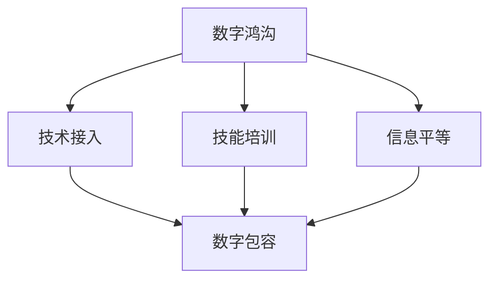

                 

# 2050年的数字鸿沟：从接入到应用的信息平等

> 关键词：数字鸿沟, 信息平等, 接入与覆盖, 技术应用, 社会包容, 教育公平, 健康保障

## 1. 背景介绍

### 1.1 问题由来
随着科技的迅猛发展，数字技术已经成为现代社会不可或缺的一部分。从智能手机、互联网到人工智能、大数据，数字技术正在深刻改变我们的生活方式、工作模式和社会结构。然而，这种技术带来的“数字鸿沟”现象也越来越突出，全球范围内存在显著的“数字不平等”现象。

1. **技术接入不平等**：不同国家和地区在互联网接入和普及程度方面存在巨大差异，特别是发展中国家。一些贫困地区因网络基础设施不足而无法享受到数字化红利。
2. **技能不平等**：即便是有互联网接入的用户，由于缺乏数字技能和知识，无法充分利用数字技术，导致“数字鸿沟”进一步扩大。
3. **应用不平等**：即便是在互联网普及度较高的地区，数字技术的应用也存在差异。农村、偏远地区的居民往往难以享受到电子商务、远程教育、电子政务等数字化服务。

### 1.2 问题核心关键点
数字鸿沟问题不仅是一个技术问题，更是一个社会经济问题。它涉及基础设施、教育、经济、政策等多个方面，需要通过综合手段来解决。

- **基础设施建设**：提高网络覆盖率，特别是偏远地区的互联网接入。
- **教育与培训**：提升全民数字素养，缩小技能差距。
- **政策支持**：制定公平的政策，保障数字技术的普及和应用。
- **企业责任**：鼓励企业承担社会责任，推动数字技术在各行各业的应用。

## 2. 核心概念与联系

### 2.1 核心概念概述

为更好地理解如何通过数字技术实现信息平等，本文将介绍几个关键概念：

- **数字鸿沟(Digital Divide)**：指的是不同社会群体在获取、使用数字技术方面的差异。
- **信息平等(Information Equality)**：指每个人都有平等地获取和使用信息的机会。
- **技术接入(Access to Technology)**：指获得互联网接入的能力。
- **技能培训(Digital Literacy)**：指掌握数字技术所需的知识和技能。
- **数字包容(Digital Inclusion)**：指包容所有社会群体，使他们都能平等地享受数字技术带来的益处。

这些概念之间相互关联，共同构成了数字技术带来的信息不平等的核心问题。以下是一个简单的Mermaid流程图，展示这些概念之间的关系：



这个流程图展示了数字鸿沟问题与技术接入、技能培训、信息平等、数字包容等概念之间的联系。技术接入和技能培训是解决数字鸿沟的关键步骤，而信息平等和数字包容则是最终目标。

## 3. 核心算法原理 & 具体操作步骤
### 3.1 算法原理概述

数字鸿沟的解决策略通常分为以下几个步骤：

1. **基础设施建设**：通过政策支持和公共投资，提高网络覆盖率，特别是偏远地区的互联网接入。
2. **技能培训**：开展全民数字素养教育，提升公众的数字技能和知识。
3. **应用普及**：鼓励企业和社会组织开发面向不同群体的数字应用，促进技术在各行各业的应用。
4. **政策保障**：制定公平的政策，确保数字技术的应用和普及对所有社会群体都是公平的。

### 3.2 算法步骤详解

以下是一个具体的步骤详解，以提升偏远地区的互联网接入为例：

**Step 1: 基础设施评估**
- 对目标地区的互联网基础设施进行全面评估，包括现有的网络覆盖率、网速、接入方式等。
- 确定需要建设或升级的网络节点位置和规模。

**Step 2: 资金筹措与政策支持**
- 筹措必要的资金，确保基础设施建设能够持续进行。
- 制定相关政策，提供补贴、税收减免等优惠政策，吸引更多的投资。

**Step 3: 实施基础设施建设**
- 在确定的网络节点位置建设光纤、基站等基础设施。
- 确保建设质量和进度，确保按时完成。

**Step 4: 技术接入与推广**
- 在建设完成后，提供网络接入服务，并进行广泛宣传，吸引用户使用。
- 提供技术支持和培训，帮助用户熟练使用网络服务。

**Step 5: 技能培训与教育**
- 开展全民数字素养教育，提升公众的数字技能和知识。
- 针对不同年龄、不同职业的用户，设计有针对性的培训课程。

**Step 6: 数字应用推广**
- 鼓励企业和社会组织开发面向不同群体的数字应用，促进技术在各行各业的应用。
- 提供财政补贴、税收优惠等政策支持，降低应用开发成本。

**Step 7: 政策保障与监管**
- 制定公平的政策，确保数字技术的应用和普及对所有社会群体都是公平的。
- 加强对数字应用的监管，防止滥用和数据泄露等问题的发生。

### 3.3 算法优缺点

解决数字鸿沟的策略有其自身的优点和局限性：

**优点**：
- **广泛覆盖**：通过基础设施建设和技能培训，可以迅速提高偏远地区的互联网接入和数字技能水平。
- **技术普及**：通过推广数字应用，促进技术在各行各业的应用，提升社会整体的数字化水平。
- **公平政策**：制定公平的政策，确保数字技术的普及和应用对所有社会群体都是公平的。

**缺点**：
- **资金需求高**：基础设施建设和技术推广需要大量资金投入，特别是在发展中国家，可能面临资金不足的问题。
- **政策执行难**：政策执行过程中可能遇到各种阻力和挑战，需要强大的行政执行力。
- **技能提升慢**：技能培训需要时间，短期内难以迅速提升全民数字素养。

### 3.4 算法应用领域

数字鸿沟的解决策略不仅适用于互联网接入和数字技能培训，还在教育、医疗、农业等多个领域得到了应用：

- **教育领域**：通过数字技术和远程教育，缩小城乡教育差距，提升教育公平。
- **医疗领域**：通过数字医疗技术，提升偏远地区的医疗服务水平，促进医疗公平。
- **农业领域**：通过数字农业技术，提高农业生产效率，提升农民的数字化水平。
- **商业领域**：通过电子商务、金融科技等数字应用，促进中小企业和农村居民的数字化转型。

## 4. 数学模型和公式 & 详细讲解 & 举例说明（备注：数学公式请使用latex格式，latex嵌入文中独立段落使用 $$，段落内使用 $)
### 4.1 数学模型构建

为了量化数字鸿沟的影响，可以构建如下数学模型：

假设一个社会的总人口为 $N$，其中能够接入互联网的人数为 $N_{\text{connected}}$，能够使用数字技术的人数为 $N_{\text{literate}}$。设 $N_{\text{connected}}$ 和 $N_{\text{literate}}$ 分别为互联网接入人数和数字技能人数。则数字鸿沟可以通过以下公式衡量：

$$
\text{Digital Divide} = 1 - \frac{N_{\text{connected}}}{N} - \frac{N_{\text{literate}}}{N}
$$

这个公式表示数字鸿沟的大小，即未能接入互联网或使用数字技术的人数占总人口的比例。

### 4.2 公式推导过程

根据定义，数字鸿沟可以分为两个部分：技术接入鸿沟和技能鸿沟。技术接入鸿沟是指未能接入互联网的人数占总人口的比例，技能鸿沟是指未能使用数字技术的人数占总人口的比例。因此，数字鸿沟的计算公式可以表示为：

$$
\text{Digital Divide} = \text{Technology Access Divide} + \text{Skill Divide}
$$

其中，技术接入鸿沟为：

$$
\text{Technology Access Divide} = 1 - \frac{N_{\text{connected}}}{N}
$$

技能鸿沟为：

$$
\text{Skill Divide} = 1 - \frac{N_{\text{literate}}}{N}
$$

通过这两个公式，可以计算出数字鸿沟的具体数值。

### 4.3 案例分析与讲解

以印度为例，分析数字鸿沟的影响。

印度拥有庞大的人口，但互联网接入和数字技能普及率较低。根据2020年的数据，印度的互联网接入率为35%，数字技能普及率为30%。代入公式计算数字鸿沟：

$$
\text{Digital Divide} = 1 - \frac{35\%}{100} - \frac{30\%}{100} = 35\%
$$

这意味着65%的人口未能接入互联网或使用数字技术。数字鸿沟的存在，严重影响了印度社会的数字化进程和经济社会发展。

## 5. 项目实践：代码实例和详细解释说明
### 5.1 开发环境搭建

要进行数字鸿沟问题的分析和解决，我们需要搭建一个全面的开发环境。以下是一个基本的开发环境搭建流程：

1. **数据采集**：通过网络爬虫和公共数据接口，获取目标地区的人口、互联网接入、数字技能等数据。
2. **数据处理**：使用Python和Pandas等工具，对数据进行清洗和处理。
3. **可视化工具**：使用Matplotlib、Seaborn等工具，生成数据可视化的图表。
4. **分析模型**：使用R、Python等工具，构建数字鸿沟的数学模型。
5. **政策模拟**：使用Excel、Tableau等工具，模拟不同政策对数字鸿沟的影响。

### 5.2 源代码详细实现

以下是一个简单的Python代码，用于计算数字鸿沟：

```python
import pandas as pd
import numpy as np

# 数据采集
data = pd.read_csv('population.csv')

# 数据处理
N = data['population'].sum()
N_connected = data['connected'].sum()
N_literate = data['literate'].sum()

# 计算数字鸿沟
digital_divide = 1 - N_connected / N - N_literate / N

# 输出结果
print('Digital Divide:', digital_divide)
```

这段代码通过简单的数据处理和计算，得出了数字鸿沟的具体数值。

### 5.3 代码解读与分析

**数据采集**：
- 通过网络爬虫和公共数据接口，采集目标地区的人口、互联网接入、数字技能等数据。

**数据处理**：
- 使用Pandas库对数据进行清洗和处理，计算总人口、互联网接入人数和数字技能人数。

**计算数字鸿沟**：
- 使用公式计算数字鸿沟，并将结果输出。

**可视化**：
- 使用Matplotlib或Seaborn库，生成数据可视化的图表，直观展示数字鸿沟的变化趋势。

**政策模拟**：
- 使用Excel或Tableau等工具，模拟不同政策对数字鸿沟的影响，如增加投资、提升教育水平等，帮助政府制定更有效的政策。

## 6. 实际应用场景
### 6.1 智能城市

智能城市是数字技术在城市管理中的应用。通过数字技术，可以实现城市交通、环境、公共安全等领域的智能化管理，提升城市治理水平。

**应用场景**：
- 智慧交通：通过智能交通系统，提升交通管理和运行效率，减少交通拥堵和事故发生。
- 智慧环保：通过智能监测系统，实时监测环境污染，提高环境治理水平。
- 智慧安防：通过智能安防系统，提升公共安全水平，保障市民的生命财产安全。

**效果**：
- 提升城市治理水平，提高市民生活质量。
- 降低城市管理成本，提高效率。

### 6.2 智慧农业

智慧农业是数字技术在农业中的应用，通过传感器、物联网等技术，提升农业生产效率和产量。

**应用场景**：
- 精准农业：通过传感器和智能设备，实时监测土壤、气象等数据，指导精准农业生产。
- 农业机械化：通过无人驾驶、自动化设备，提高农业机械化水平，降低人力成本。
- 农产品追溯：通过区块链等技术，实现农产品的全程追溯，提升食品安全水平。

**效果**：
- 提升农业生产效率和产量，保障食品安全。
- 降低农业生产成本，提高农民收益。

### 6.3 远程教育

远程教育是数字技术在教育领域的应用，通过互联网和数字化设备，实现教育的普及和公平。

**应用场景**：
- 在线课堂：通过视频直播、在线讨论等形式，实现远程教学。
- 个性化学习：通过智能推荐系统，提供个性化的学习资源和方案。
- 作业批改：通过智能批改系统，提高作业批改效率和质量。

**效果**：
- 实现教育的普及和公平，缩小城乡教育差距。
- 提升教学质量和学习效率，培养更多人才。

### 6.4 数字医疗

数字医疗是数字技术在医疗领域的应用，通过数字技术和互联网，提升医疗服务水平。

**应用场景**：
- 远程诊疗：通过视频、语音等形式，实现远程诊疗和咨询。
- 电子病历：通过电子病历系统，实现医疗信息的共享和存储。
- 医疗设备智能化：通过智能医疗设备，提高诊断和治疗效率。

**效果**：
- 提升医疗服务水平，实现远程诊疗。
- 提高医疗信息共享水平，降低医疗成本。

## 7. 工具和资源推荐
### 7.1 学习资源推荐

为了深入理解数字鸿沟和信息平等问题，推荐以下学习资源：

1. **《数字鸿沟：全球挑战与解决方案》**：这本书详细介绍了数字鸿沟的现状、原因和解决方案，提供了丰富的案例和政策建议。
2. **《信息平等：数字化时代的新挑战》**：该书讨论了信息平等的概念、现状和未来发展方向，提出了具体的解决方案。
3. **《数字包容性：全球经验与未来展望》**：该书汇集了全球各地的数字包容经验，提供了大量的成功案例和政策建议。
4. **《数字化转型：企业与政府的策略与实践》**：该书介绍了企业如何通过数字化转型，实现业务升级和创新。

### 7.2 开发工具推荐

进行数字鸿沟问题的分析和解决，推荐以下开发工具：

1. **Python**：作为数据科学和机器学习的流行语言，Python提供了丰富的数据处理和分析工具，如Pandas、NumPy、SciPy等。
2. **R**：作为统计分析的常用语言，R提供了强大的数据分析和可视化能力，如ggplot2、dplyr等。
3. **Tableau**：作为数据可视化工具，Tableau可以生成直观的图表和仪表板，帮助用户理解数据分析结果。
4. **Tableau Public**：免费的在线可视化工具，支持数据共享和协作。
5. **GitHub**：作为代码托管平台，GitHub支持版本控制和协作开发，方便开发者共享和交流代码。

### 7.3 相关论文推荐

以下几篇论文提供了数字鸿沟和信息平等的最新研究成果：

1. **《数字鸿沟与信息平等：全球视角》**：该论文总结了全球数字鸿沟和信息平等的研究进展，提供了丰富的案例和数据分析。
2. **《智能城市：数字技术的社会影响》**：该论文讨论了数字技术在城市管理中的应用，提供了详细的案例和政策建议。
3. **《智慧农业：数字技术的农业应用》**：该论文介绍了智慧农业的现状、问题和解决方案，提供了大量的成功案例。
4. **《远程教育：数字技术在教育中的应用》**：该论文讨论了远程教育的现状、问题和未来发展方向，提供了详细的案例和政策建议。
5. **《数字医疗：数字技术在医疗中的应用》**：该论文介绍了数字医疗的现状、问题和未来发展方向，提供了详细的案例和政策建议。

## 8. 总结：未来发展趋势与挑战
### 8.1 研究成果总结

通过数字技术，我们可以缩小数字鸿沟，实现信息平等。然而，要实现这一目标，还需要在多个方面做出努力：

1. **基础设施建设**：提高网络覆盖率，特别是偏远地区的互联网接入。
2. **技能培训**：提升全民数字素养，缩小技能差距。
3. **政策保障**：制定公平的政策，确保数字技术的普及和应用。
4. **技术应用**：推广数字应用，促进技术在各行各业的应用。

### 8.2 未来发展趋势

展望未来，数字鸿沟和信息平等问题将呈现以下几个趋势：

1. **技术普及加速**：随着互联网普及率的提高，数字鸿沟将逐步缩小。
2. **技能培训加强**：全民数字素养教育将进一步加强，提升公众的数字技能和知识。
3. **政策保障完善**：政府将出台更多政策，保障数字技术的普及和应用。
4. **技术应用深化**：数字技术将在更多领域得到应用，提升社会整体的数字化水平。

### 8.3 面临的挑战

尽管数字技术在缩小数字鸿沟方面取得了一定的进展，但仍面临诸多挑战：

1. **资金不足**：基础设施建设和技术推广需要大量资金投入，特别是在发展中国家。
2. **技能提升慢**：技能培训需要时间，短期内难以迅速提升全民数字素养。
3. **政策执行难**：政策执行过程中可能遇到各种阻力和挑战。
4. **数据安全**：数字应用需要处理大量个人数据，数据安全问题亟需解决。

### 8.4 研究展望

未来的研究需要在以下几个方面寻求新的突破：

1. **技术创新**：开发更加高效、易用的数字技术，提升技术普及率。
2. **教育创新**：探索新的教育方式和内容，提升全民数字素养。
3. **政策创新**：制定更加公平、有效的政策，确保数字技术的普及和应用。
4. **数据安全**：加强数据安全保障，提升数据处理和应用的安全性。

## 9. 附录：常见问题与解答

**Q1：数字鸿沟和信息平等的概念有什么区别？**

A: 数字鸿沟指的是不同社会群体在获取、使用数字技术方面的差异。信息平等是指每个人都有平等地获取和使用信息的机会。数字鸿沟关注的是技术接入和技能差距，而信息平等关注的是信息获取和使用的机会。

**Q2：如何缩小数字鸿沟？**

A: 缩小数字鸿沟需要从多个方面入手：
1. 提高网络覆盖率，特别是偏远地区的互联网接入。
2. 开展全民数字素养教育，提升公众的数字技能和知识。
3. 制定公平的政策，确保数字技术的普及和应用。
4. 推广数字应用，促进技术在各行各业的应用。

**Q3：数字鸿沟的影响有哪些？**

A: 数字鸿沟的影响主要包括：
1. 教育不公平：城乡教育差距加剧。
2. 医疗不公平：偏远地区的医疗服务水平低。
3. 就业不公平：技能差距导致就业机会不均等。
4. 信息不公平：信息获取和应用的机会不均等。

**Q4：数字鸿沟的研究难点有哪些？**

A: 数字鸿沟的研究难点主要包括：
1. 数据获取难度大，不同地区的数字鸿沟数据不一致。
2. 影响因素多，需要综合考虑技术、政策、经济等多个因素。
3. 研究方法复杂，需要结合定量和定性分析方法。

**Q5：如何评估数字鸿沟的改善效果？**

A: 评估数字鸿沟的改善效果可以通过以下方法：
1. 收集数字鸿沟数据，进行时间和空间上的对比。
2. 分析数字鸿沟的影响因素，评估政策效果。
3. 进行实证研究，收集用户反馈，评估用户满意度。

---

作者：禅与计算机程序设计艺术 / Zen and the Art of Computer Programming

