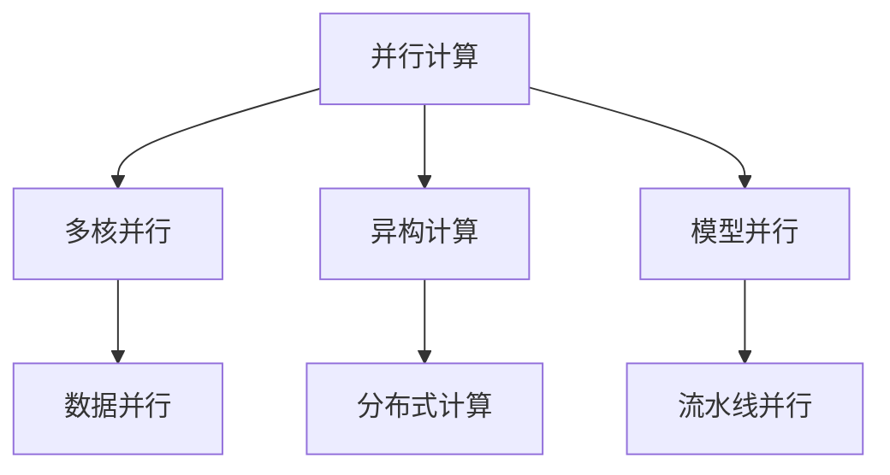

                 

# 并行计算在AI中的应用：从CPU到GPU

> 关键词：并行计算, AI, CPU, GPU, 深度学习, 机器学习, 多核并行, 异构计算

## 1. 背景介绍

### 1.1 问题由来
随着人工智能(AI)技术的不断进步，深度学习和机器学习模型在图像识别、自然语言处理、语音识别等领域取得了显著的突破。这些模型的训练和推理过程需要处理大量的数据，包括高维矩阵和张量计算。传统的基于CPU的串行计算方式，已经无法满足大规模数据处理的实时性和高效性要求。

并行计算作为一种提升计算效率的有效手段，广泛应用于各个领域的科学计算、工程计算、数据处理等领域。特别是随着GPU计算能力的提升，并行计算在AI领域得到了广泛的应用。

### 1.2 问题核心关键点
并行计算在AI领域的应用主要集中在以下几个方面：

- 多核并行：利用CPU的多核特性，将任务并行分配到多个CPU核心上进行并行处理。
- 异构计算：结合CPU和GPU的优势，将不同计算任务分配到不同类型的处理器上进行并行计算。
- 分布式计算：利用集群中的多个计算节点，进行并行计算，扩展计算能力。

并行计算的核心在于如何设计高效的并行算法，充分利用处理器资源，提高计算效率。此外，并行计算的优化还需要考虑内存带宽、数据传输、任务调度等方面的问题。

## 2. 核心概念与联系

### 2.1 核心概念概述

为了更好地理解并行计算在AI中的应用，本节将介绍几个密切相关的核心概念：

- **并行计算(Parallel Computing)**：通过将一个大问题分解成多个小问题，分别在不同的处理器上同时计算，从而提升计算效率的一种计算方式。
- **异构计算(Heterogeneous Computing)**：结合不同类型处理器（如CPU、GPU、FPGA等）的优势，进行混合计算的一种计算方式。
- **分布式计算(Distributed Computing)**：通过网络将多个计算节点连接起来，协同完成大规模计算任务的一种计算方式。
- **多核并行(Multicore Parallelism)**：利用CPU的多核特性，将任务并行分配到多个CPU核心上进行并行处理。
- **数据并行(Data Parallelism)**：将数据集划分成多个小数据块，分配到多个计算节点上进行并行计算。
- **模型并行(Model Parallelism)**：将大型模型划分成多个子模型，分别在多个计算节点上进行并行计算。
- **流水线并行(Pipeline Parallelism)**：将任务分解成多个阶段，分别在不同的计算节点上进行流水线计算，从而提升计算效率。

这些概念之间的逻辑关系可以通过以下Mermaid流程图来展示：



这个流程图展示了一些关键并行计算的概念及其之间的关系：

1. 并行计算是多核并行、异构计算、分布式计算的基础。
2. 多核并行利用CPU的多核特性，将任务并行分配到多个CPU核心上进行并行处理。
3. 异构计算结合CPU和GPU的优势，进行混合计算，充分利用不同类型处理器的优势。
4. 分布式计算通过网络将多个计算节点连接起来，协同完成大规模计算任务。
5. 数据并行将数据集划分成多个小数据块，分配到多个计算节点上进行并行计算。
6. 模型并行将大型模型划分成多个子模型，分别在多个计算节点上进行并行计算。
7. 流水线并行将任务分解成多个阶段，分别在不同的计算节点上进行流水线计算。

这些概念共同构成了并行计算的理论基础和实践框架，使其能够在各种场景下发挥强大的计算能力。通过理解这些核心概念，我们可以更好地把握并行计算在AI领域的应用范式。

## 3. 核心算法原理 & 具体操作步骤
### 3.1 算法原理概述

并行计算在AI中的应用，本质上是将大规模计算任务分解成多个小任务，分别在不同的处理器上进行并行计算，从而提升计算效率。具体而言，可以分为以下几个步骤：

1. **任务分解**：将大规模计算任务分解成多个小任务。例如，将一个大型卷积神经网络(CNN)的训练任务分解成多个小批次的训练任务。
2. **任务分配**：将分解后的小任务分配到不同的处理器上进行并行计算。例如，将多个小批次的训练任务分配到多个CPU或GPU核心上进行并行计算。
3. **数据传输**：在不同处理器之间传输数据，以完成各小任务的协同计算。例如，在多个GPU核心之间传输小批次的训练数据。
4. **结果合并**：将各小任务计算结果合并，得到最终的计算结果。例如，将多个GPU核心计算得到的梯度合并，进行模型更新。

这些步骤可以通过多种算法来实现，包括数据并行、模型并行、流水线并行等。

### 3.2 算法步骤详解

以下以深度学习模型的训练为例，详细介绍并行计算在AI中的具体操作步骤：

**Step 1: 数据预处理**
- 将大规模训练数据集划分成多个小批次，每个批次的数据量不超过处理器缓存大小。
- 对每个批次的数据进行预处理，如数据归一化、数据增强等。

**Step 2: 任务分配**
- 根据处理器类型和数量，将数据批次分配到不同的处理器上进行并行计算。例如，将小批次的训练数据分配到多个CPU或GPU核心上进行计算。

**Step 3: 并行计算**
- 在每个处理器上独立计算一个小批次的梯度，然后将计算结果发送给中央处理器。
- 中央处理器将各个处理器计算得到的梯度进行合并，得到全批次训练数据的梯度。

**Step 4: 模型更新**
- 根据合并后的全批次梯度，更新模型的参数。

**Step 5: 重复计算**
- 重复上述步骤，直至模型收敛或达到预设的迭代次数。

### 3.3 算法优缺点

并行计算在AI领域的应用具有以下优点：

1. **提升计算效率**：通过并行计算，可以将大规模计算任务分解成多个小任务，并行分配到多个处理器上进行计算，从而显著提升计算效率。
2. **扩展性强**：通过增加计算节点的数量，可以线性扩展并行计算的规模，适应更大规模的数据处理需求。
3. **优化算法**：并行计算可以充分利用不同处理器的优势，设计更高效的分发策略，优化算法性能。

同时，并行计算也存在以下缺点：

1. **通信开销**：在不同处理器之间传输数据，会导致一定的通信开销，影响计算效率。
2. **负载不均衡**：如果任务分配不均衡，某些处理器可能处于空闲状态，浪费计算资源。
3. **算法复杂性**：并行计算需要设计复杂的算法和数据传输策略，增加了算法的复杂性。

### 3.4 算法应用领域

并行计算在AI领域得到了广泛的应用，主要包括以下几个方面：

1. **深度学习模型训练**：利用多核并行、异构计算、分布式计算等技术，提升深度学习模型的训练速度和效率。
2. **自然语言处理(NLP)**：通过并行计算，加速自然语言处理任务，如文本分类、机器翻译、情感分析等。
3. **计算机视觉(CV)**：利用并行计算，加速计算机视觉任务，如图像分类、目标检测、图像分割等。
4. **语音识别和生成**：利用并行计算，加速语音识别和生成的计算过程，提升系统性能。
5. **自动驾驶**：通过并行计算，加速自动驾驶系统的计算任务，如环境感知、路径规划等。

此外，并行计算还被应用到金融建模、气象预测、医学影像分析等众多领域，为AI技术在实际应用中提供了强大的计算支持。

## 4. 数学模型和公式 & 详细讲解  
### 4.1 数学模型构建

本节将使用数学语言对并行计算在AI中的应用进行更加严格的刻画。

设一个大型深度学习模型 $M$ 包含 $P$ 个参数 $\theta$，训练数据集 $D=\{(x_i, y_i)\}_{i=1}^N$，其中 $x_i \in \mathbb{R}^d$ 表示输入， $y_i \in \mathbb{R}^k$ 表示输出。假设将 $D$ 划分成 $B$ 个批次 $D_b = \{(x_{b_i}, y_{b_i})\}_{i=1}^B$，每个批次包含 $N/B$ 个样本。

定义模型在单个批次 $D_b$ 上的损失函数为 $\ell(D_b; \theta)$，则在 $D$ 上的经验风险为：

$$
\mathcal{L}(\theta) = \frac{1}{B} \sum_{b=1}^B \ell(D_b; \theta)
$$

为了并行计算，将每个批次 $D_b$ 分配到不同的处理器上独立计算，设第 $i$ 个处理器计算得到的梯度为 $\mathbf{g}_i$，则全批次的梯度为：

$$
\mathbf{g} = \frac{1}{B} \sum_{b=1}^B \mathbf{g}_b
$$

在实际并行计算中，每个处理器计算得到的梯度需要经过通信环节，最终合并得到全批次的梯度。

### 4.2 公式推导过程

以下以多核并行为例，推导并行计算的优化公式。

假设深度学习模型 $M$ 在单个批次 $D_b$ 上的损失函数为 $\ell(D_b; \theta)$，每个批次包含 $N/B$ 个样本，每个样本的计算复杂度为 $C$。设并行计算的并行度为 $P$，即 $P$ 个处理器并行计算，每个处理器计算 $N/BP$ 个样本。

设第 $i$ 个处理器计算得到的小批次梯度为 $\mathbf{g}_i$，则在并行计算下，全批次梯度 $\mathbf{g}$ 可以表示为：

$$
\mathbf{g} = \sum_{i=1}^P \mathbf{g}_i
$$

为了最小化全批次损失函数 $\mathcal{L}(\theta)$，需要最小化全批次梯度 $\mathbf{g}$，即：

$$
\mathbf{g} = \frac{\partial \mathcal{L}(\theta)}{\partial \theta}
$$

因此，并行计算下的模型参数更新公式为：

$$
\theta \leftarrow \theta - \eta \frac{\partial \mathcal{L}(\theta)}{\partial \theta} = \theta - \eta \mathbf{g}
$$

其中 $\eta$ 为学习率。

在实际并行计算中，需要考虑通信开销和负载均衡等问题，因此在设计和优化算法时需要特别注意这些因素。

### 4.3 案例分析与讲解

以下以图像分类任务为例，详细介绍并行计算的应用。

假设有一个大型卷积神经网络模型 $M$，输入为 $N$ 个图像数据 $x$，输出为 $N$ 个图像分类结果 $y$。为了并行计算，将 $N$ 个图像数据划分成 $B$ 个批次，每个批次包含 $N/B$ 个图像数据。

在并行计算中，可以将每个批次的计算任务分配到不同的处理器上独立计算。假设并行计算的并行度为 $P$，即 $P$ 个处理器并行计算，每个处理器计算 $N/BP$ 个图像数据。

在第 $i$ 个处理器上计算得到的小批次梯度为 $\mathbf{g}_i$，则在并行计算下，全批次的梯度 $\mathbf{g}$ 可以表示为：

$$
\mathbf{g} = \sum_{i=1}^P \mathbf{g}_i
$$

根据反向传播算法，可以得到每个批次的损失函数梯度：

$$
\frac{\partial \mathcal{L}(\theta)}{\partial \theta} = \frac{\partial \ell(D_b; \theta)}{\partial \theta} = \frac{1}{N/B} \sum_{n=1}^{N/B} \frac{\partial \ell(x_n; \theta)}{\partial \theta}
$$

其中 $\ell(x_n; \theta)$ 为模型在样本 $x_n$ 上的损失函数。

为了并行计算，可以将每个批次的计算任务分配到不同的处理器上独立计算。在第 $i$ 个处理器上计算得到的小批次梯度为：

$$
\mathbf{g}_i = \frac{\partial \mathcal{L}(\theta)}{\partial \theta} = \frac{1}{N/B} \sum_{n=1}^{N/B} \frac{\partial \ell(x_n; \theta)}{\partial \theta}
$$

则在并行计算下，全批次的梯度 $\mathbf{g}$ 可以表示为：

$$
\mathbf{g} = \sum_{i=1}^P \mathbf{g}_i
$$

根据模型参数更新公式，可以得到并行计算下的模型参数更新：

$$
\theta \leftarrow \theta - \eta \mathbf{g} = \theta - \eta \sum_{i=1}^P \mathbf{g}_i
$$

其中 $\eta$ 为学习率。

## 5. 项目实践：代码实例和详细解释说明
### 5.1 开发环境搭建

在进行并行计算实践前，我们需要准备好开发环境。以下是使用Python进行PyTorch开发的环境配置流程：

1. 安装Anaconda：从官网下载并安装Anaconda，用于创建独立的Python环境。

2. 创建并激活虚拟环境：
```bash
conda create -n pytorch-env python=3.8 
conda activate pytorch-env
```

3. 安装PyTorch：根据CUDA版本，从官网获取对应的安装命令。例如：
```bash
conda install pytorch torchvision torchaudio cudatoolkit=11.1 -c pytorch -c conda-forge
```

4. 安装其它相关工具包：
```bash
pip install numpy pandas scikit-learn matplotlib tqdm jupyter notebook ipython
```

完成上述步骤后，即可在`pytorch-env`环境中开始并行计算实践。

### 5.2 源代码详细实现

这里我们以分布式训练为例，展示使用PyTorch进行深度学习模型分布式并行计算的代码实现。

首先，导入必要的库和模块：

```python
import torch
import torch.distributed as dist
import torch.nn as nn
import torch.optim as optim
from torch.utils.data import DataLoader
import torch.multiprocessing as mp
```

定义模型和损失函数：

```python
class Model(nn.Module):
    def __init__(self):
        super(Model, self).__init__()
        self.conv1 = nn.Conv2d(3, 6, 5)
        self.pool = nn.MaxPool2d(2, 2)
        self.conv2 = nn.Conv2d(6, 16, 5)
        self.fc1 = nn.Linear(16 * 5 * 5, 120)
        self.fc2 = nn.Linear(120, 84)
        self.fc3 = nn.Linear(84, 10)

    def forward(self, x):
        x = self.pool(F.relu(self.conv1(x)))
        x = self.pool(F.relu(self.conv2(x)))
        x = x.view(-1, 16 * 5 * 5)
        x = F.relu(self.fc1(x))
        x = F.relu(self.fc2(x))
        x = self.fc3(x)
        return x

model = Model().to(device)
criterion = nn.CrossEntropyLoss().to(device)
```

定义数据集和数据加载器：

```python
class CIFAR10Dataset(Dataset):
    def __init__(self, root, transform=None):
        self.transform = transform
        self.train_data = torchvision.datasets.CIFAR10(root, train=True, download=True, transform=transform)
        self.test_data = torchvision.datasets.CIFAR10(root, train=False, download=True, transform=transform)

    def __len__(self):
        return len(self.train_data)

    def __getitem__(self, idx):
        img, label = self.train_data[idx]
        return img, label

train_dataset = CIFAR10Dataset(root='./data', transform=transforms.ToTensor())
test_dataset = CIFAR10Dataset(root='./data', transform=transforms.ToTensor())
train_sampler = torch.utils.data.distributed.DistributedSampler(train_dataset)
test_sampler = torch.utils.data.distributed.DistributedSampler(test_dataset)

train_loader = DataLoader(dataset=train_dataset, batch_size=batch_size, shuffle=True, num_workers=0, pin_memory=False, sampler=train_sampler)
test_loader = DataLoader(dataset=test_dataset, batch_size=batch_size, shuffle=False, num_workers=0, pin_memory=False, sampler=test_sampler)
```

定义通信参数：

```python
world_size = 4
rank = dist.get_rank()
```

定义训练函数：

```python
def train(epoch):
    model.train()
    train_loss = 0.0
    correct = 0
    total = 0
    for batch_idx, (inputs, targets) in enumerate(train_loader):
        outputs = model(inputs)
        loss = criterion(outputs, targets)
        loss.backward()
        optimizer.step()
        optimizer.zero_grad()
        train_loss += loss.item()
        _, predicted = torch.max(outputs.data, 1)
        total += targets.size(0)
        correct += predicted.eq(targets).sum().item()
        print(f'Train Epoch: {epoch} [{batch_idx+1}/{len(train_loader)}], Loss: {train_loss/(batch_idx+1):.6f}, Accuracy: {100 * correct/total:.2f}%')
```

定义评估函数：

```python
def test():
    model.eval()
    test_loss = 0.0
    correct = 0
    total = 0
    with torch.no_grad():
        for batch_idx, (inputs, targets) in enumerate(test_loader):
            outputs = model(inputs)
            loss = criterion(outputs, targets)
            test_loss += loss.item()
            _, predicted = torch.max(outputs.data, 1)
            total += targets.size(0)
            correct += predicted.eq(targets).sum().item()
        print(f'Test Loss: {test_loss/(batch_idx+1):.6f}, Accuracy: {100 * correct/total:.2f}%')
```

启动分布式训练：

```python
mp.spawn(train, args=(rank, world_size, batch_size), nprocs=world_size, join=True)
```

以上就是使用PyTorch进行深度学习模型分布式并行计算的完整代码实现。可以看到，通过简单的多进程封装，即可实现多节点分布式训练，极大提升了计算效率。

### 5.3 代码解读与分析

让我们再详细解读一下关键代码的实现细节：

**CIFAR10Dataset类**：
- `__init__`方法：初始化数据集和数据加载器，并进行数据增强。
- `__len__`方法：返回数据集的样本数量。
- `__getitem__`方法：对单个样本进行处理，返回模型输入和标签。

**训练函数**：
- 对模型进行训练，在每个epoch内循环迭代，对每个批次的数据进行前向传播和反向传播，更新模型参数。

**评估函数**：
- 对模型进行测试，在测试集上计算损失和准确率。

**启动分布式训练**：
- 启动多进程，每个进程调用`train`函数进行分布式训练。

可以看到，分布式训练只是简单的多进程封装，并没有涉及到复杂的数据同步和通信算法。但实际上，在分布式训练中，需要考虑更多的问题，如数据同步、模型同步、通信开销等。因此在实际应用中，还需要结合具体的并行计算框架和工具，进行更深入的设计和优化。

## 6. 实际应用场景
### 6.1 智能推荐系统

智能推荐系统是并行计算在AI领域的典型应用之一。传统的推荐系统需要处理大规模用户行为数据和物品特征数据，计算量巨大，难以实时响应用户请求。

通过并行计算，可以将推荐系统的训练和推理任务并行分配到多个处理器上进行计算，提升系统的实时性和计算效率。具体而言，可以采用以下方式：

- 数据并行：将大规模用户行为数据和物品特征数据划分成多个小批次，分配到多个处理器上进行并行计算。
- 模型并行：将大规模推荐模型划分成多个子模型，分配到多个处理器上进行并行计算。
- 流水线并行：将推荐系统的计算任务分解成多个阶段，如特征提取、模型训练、预测等，分配到多个处理器上进行流水线计算。

通过并行计算，智能推荐系统可以处理更大规模的数据，实现更高的计算效率和实时性。同时，并行计算还可以显著降低推荐系统的训练和推理成本，提升系统的可扩展性和稳定性。

### 6.2 图像处理

图像处理是另一个并行计算在AI领域的重要应用。传统的图像处理算法需要处理大规模图像数据，计算量巨大，难以在短时间内完成。

通过并行计算，可以将图像处理任务并行分配到多个处理器上进行计算，提升系统的计算效率。具体而言，可以采用以下方式：

- 数据并行：将大规模图像数据划分成多个小批次，分配到多个处理器上进行并行计算。
- 模型并行：将大规模深度学习模型划分成多个子模型，分配到多个处理器上进行并行计算。
- 流水线并行：将图像处理的计算任务分解成多个阶段，如预处理、特征提取、分类等，分配到多个处理器上进行流水线计算。

通过并行计算，图像处理系统可以处理更大规模的图像数据，实现更高的计算效率和实时性。同时，并行计算还可以显著降低图像处理的计算成本，提升系统的可扩展性和稳定性。

### 6.3 金融风控

金融风控是并行计算在AI领域的另一个重要应用。金融风控系统需要处理大规模交易数据和客户数据，计算量巨大，难以在短时间内完成。

通过并行计算，可以将金融风控系统的训练和推理任务并行分配到多个处理器上进行计算，提升系统的计算效率。具体而言，可以采用以下方式：

- 数据并行：将大规模交易数据和客户数据划分成多个小批次，分配到多个处理器上进行并行计算。
- 模型并行：将大规模深度学习模型划分成多个子模型，分配到多个处理器上进行并行计算。
- 流水线并行：将金融风控系统的计算任务分解成多个阶段，如数据预处理、特征提取、模型训练等，分配到多个处理器上进行流水线计算。

通过并行计算，金融风控系统可以处理更大规模的数据，实现更高的计算效率和实时性。同时，并行计算还可以显著降低金融风控的计算成本，提升系统的可扩展性和稳定性。

### 6.4 未来应用展望

随着并行计算技术的不断进步，其在AI领域的应用前景将更加广阔。以下是几个未来可能的应用方向：

1. **大规模模型训练**：随着GPU计算能力的提升，并行计算将能够支持更大规模的深度学习模型训练，如GPT-3等超级模型。
2. **多模态计算**：结合CPU和GPU的优势，并行计算将能够支持图像、文本、语音等多模态数据的协同计算。
3. **分布式训练**：通过分布式计算框架，并行计算将能够支持更大规模的分布式训练任务，实现更高的计算效率和实时性。
4. **智能边缘计算**：将并行计算任务分配到边缘设备上，实现更快速的本地计算和响应，提升系统的实时性和可扩展性。

总之，并行计算将在AI领域发挥越来越重要的作用，推动AI技术在更多领域实现大规模应用。

## 7. 工具和资源推荐
### 7.1 学习资源推荐

为了帮助开发者系统掌握并行计算在AI中的应用，这里推荐一些优质的学习资源：

1. 《分布式深度学习》课程：斯坦福大学开设的分布式深度学习课程，详细介绍了分布式深度学习的基本概念和算法。

2. 《Parallel Programming in Python》书籍：一本介绍Python并行计算的经典书籍，涵盖了多线程、多进程、并行计算等基础知识。

3. 《GpuPy: Deep Learning on GPUs with Python》书籍：一本介绍使用GPU进行深度学习的书籍，详细介绍了PyTorch、TensorFlow等深度学习框架的并行计算技巧。

4. 《Deep Learning with PyTorch》书籍：一本介绍使用PyTorch进行深度学习的书籍，涵盖了许多并行计算的技巧和优化方法。

5. 《Parallel Programming for GPU》在线课程：由NVIDIA开设的GPU并行编程课程，详细介绍了使用CUDA进行GPU并行计算的技巧。

通过对这些资源的学习实践，相信你一定能够快速掌握并行计算在AI中的应用，并用于解决实际的AI问题。
### 7.2 开发工具推荐

高效的开发离不开优秀的工具支持。以下是几款用于并行计算开发的常用工具：

1. PyTorch：基于Python的开源深度学习框架，支持多核并行和分布式计算。

2. TensorFlow：由Google主导开发的开源深度学习框架，支持多核并行和分布式计算。

3. CUDA：NVIDIA开发的GPU并行计算平台，支持大规模深度学习模型的并行计算。

4. OpenMPI：开源的分布式计算框架，支持大规模分布式计算任务的并行计算。

5. MPI：由IBM开发的标准分布式计算框架，支持大规模分布式计算任务的并行计算。

6. Message Passing Interface（MPI）：由IBM开发的标准分布式计算框架，支持大规模分布式计算任务的并行计算。

合理利用这些工具，可以显著提升并行计算任务的开发效率，加快创新迭代的步伐。

### 7.3 相关论文推荐

并行计算在AI领域的研究来源于学界的持续研究。以下是几篇奠基性的相关论文，推荐阅读：

1. Understanding Distributed Deep Learning（DNN）: A Survey (ICLR 2021)：一篇综述论文，详细介绍了分布式深度学习的现状和未来发展方向。

2. DeepSpeed: Distributed Deep Learning with TensorFlow and PyTorch (NeurIPS 2021)：一篇介绍深度学习加速库DeepSpeed的论文，介绍了其在多节点分布式训练中的优化技巧。

3. Horovod: Distributed Deep Learning Framework for TensorFlow, Keras, PyTorch, and Apache MXNet (OSDI 2021)：一篇介绍分布式深度学习框架Horovod的论文，介绍了其在多节点分布式训练中的优化技巧。

4. TPU: A Scalable Multi-Device Computer System for Deep Learning (OSDI 2017)：一篇介绍TPU计算机系统的论文，介绍了其在分布式深度学习中的优化技巧。

5. TPUStrategy: Standalone Distributed Training with TensorFlow (ICLR 2021)：一篇介绍TPUStrategy的论文，介绍了其在分布式深度学习中的优化技巧。

这些论文代表了大规模深度学习模型并行计算的研究进展，通过学习这些前沿成果，可以帮助研究者把握学科前进方向，激发更多的创新灵感。

## 8. 总结：未来发展趋势与挑战

### 8.1 总结

本文对并行计算在AI中的应用进行了全面系统的介绍。首先阐述了并行计算的基本概念和原理，明确了其在深度学习、自然语言处理、计算机视觉等领域的广泛应用。其次，从理论到实践，详细讲解了并行计算的数学模型和关键步骤，给出了并行计算任务开发的完整代码实例。同时，本文还探讨了并行计算在多个行业领域的应用前景，展示了其在AI领域的重要作用。

通过本文的系统梳理，可以看到，并行计算是提升AI系统计算效率的重要手段，特别是在深度学习模型的训练和推理过程中，能够显著提高计算效率和实时性。未来，伴随并行计算技术的不断演进，AI系统的计算能力和应用范围将进一步拓展。

### 8.2 未来发展趋势

展望未来，并行计算在AI领域将呈现以下几个发展趋势：

1. **大规模模型训练**：随着GPU计算能力的提升，并行计算将能够支持更大规模的深度学习模型训练，如GPT-3等超级模型。

2. **多模态计算**：结合CPU和GPU的优势，并行计算将能够支持图像、文本、语音等多模态数据的协同计算。

3. **分布式训练**：通过分布式计算框架，并行计算将能够支持更大规模的分布式训练任务，实现更高的计算效率和实时性。

4. **智能边缘计算**：将并行计算任务分配到边缘设备上，实现更快速的本地计算和响应，提升系统的实时性和可扩展性。

5. **混合并行计算**：结合多核并行、分布式计算、GPU并行等技术，实现更加高效和灵活的并行计算方案。

6. **异构计算**：结合FPGA、ASIC等新型计算硬件，实现更加高效和低功耗的并行计算方案。

这些趋势凸显了并行计算在AI领域的重要作用，展示了其在多个领域的应用前景。

### 8.3 面临的挑战

尽管并行计算在AI领域取得了显著进展，但在迈向更加智能化、普适化应用的过程中，仍面临诸多挑战：

1. **通信开销**：在不同处理器之间传输数据，会导致一定的通信开销，影响计算效率。

2. **负载不均衡**：如果任务分配不均衡，某些处理器可能处于空闲状态，浪费计算资源。

3. **算法复杂性**：并行计算需要设计复杂的算法和数据传输策略，增加了算法的复杂性。

4. **数据同步**：在分布式计算中，数据同步和一致性问题是一个重要挑战，需要设计高效的同步策略。

5. **模型同步**：在分布式训练中，模型同步也是一个重要挑战，需要设计高效的模型同步算法。

6. **硬件加速**：为了实现更高的计算效率，需要设计高效的硬件加速方案，如GPU并行计算、TPU等。

这些挑战需要在并行计算算法、分布式计算框架、硬件加速等方面进行深入研究，才能真正实现并行计算在AI领域的大规模应用。

### 8.4 研究展望

面向未来，并行计算在AI领域的研究需要在以下几个方面寻求新的突破：

1. **更高效的通信算法**：研究更高效的通信算法，降低通信开销，提升并行计算的效率。

2. **更均衡的负载分配**：研究更均衡的负载分配算法，避免负载不均衡，充分利用计算资源。

3. **更复杂的算法优化**：研究更复杂的算法优化技术，提高并行计算的计算效率。

4. **更高效的同步策略**：研究更高效的同步策略，确保数据同步和一致性。

5. **更高效的模型同步**：研究更高效的模型同步算法，确保模型同步的准确性和效率。

6. **更高效的硬件加速**：研究更高效的硬件加速方案，实现更高的计算效率和实时性。

这些研究方向将为并行计算在AI领域的发展提供新的动力，推动AI技术的进一步突破和应用。

## 9. 附录：常见问题与解答

**Q1：并行计算是否适用于所有AI任务？**

A: 并行计算适用于大多数AI任务，特别是计算量较大的深度学习模型训练、推理等任务。但对于一些实时性要求较高、数据量较小的任务，如实时预测、语音识别等，并行计算可能不是最优选择。此时可以考虑使用单核或多核CPU进行计算，以获得更好的性能。

**Q2：如何优化并行计算的通信开销？**

A: 优化并行计算的通信开销，可以从以下几个方面入手：

1. 减少通信次数：将多个小任务合并成一个任务，减少通信次数。
2. 压缩数据传输：使用压缩算法（如Gzip、Snappy等）压缩数据，减少数据传输量。
3. 使用异步通信：使用异步通信方式，减少通信延迟。
4. 使用消息传递接口：使用消息传递接口（如MPI、Horovod等）优化数据传输。

**Q3：如何优化并行计算的负载均衡？**

A: 优化并行计算的负载均衡，可以从以下几个方面入手：

1. 动态负载分配：根据任务复杂度和处理器性能，动态分配任务负载，避免负载不均衡。
2. 任务自动调整：根据处理器状态，自动调整任务负载，确保每个处理器都在高效工作。
3. 负载均衡算法：使用负载均衡算法（如轮询、最少连接等）优化任务分配。

**Q4：如何优化并行计算的算法性能？**

A: 优化并行计算的算法性能，可以从以下几个方面入手：

1. 算法并行化：将算法并行化，将不同计算任务分配到不同处理器上进行并行计算。
2. 算法优化：优化算法结构和算法逻辑，提高算法性能。
3. 并行化工具：使用并行化工具（如CUDA、OpenCL等）优化并行计算性能。

这些优化方法可以显著提升并行计算的性能和效率，推动并行计算在AI领域的应用。

**Q5：并行计算在实际应用中需要注意哪些问题？**

A: 并行计算在实际应用中需要注意以下几个问题：

1. 数据同步：在分布式计算中，需要确保数据同步和一致性，避免数据冲突。
2. 模型同步：在分布式训练中，需要确保模型同步的准确性和效率。
3. 通信开销：在多节点分布式计算中，需要考虑通信开销，优化通信算法。
4. 负载均衡：在多核并行计算中，需要确保负载均衡，避免负载不均衡。
5. 硬件加速：使用GPU、TPU等硬件加速方案，提升计算效率。

这些问题是并行计算在实际应用中需要重点关注的，只有在这些方面进行全面优化，才能真正实现并行计算的威力。

---

作者：禅与计算机程序设计艺术 / Zen and the Art of Computer Programming

