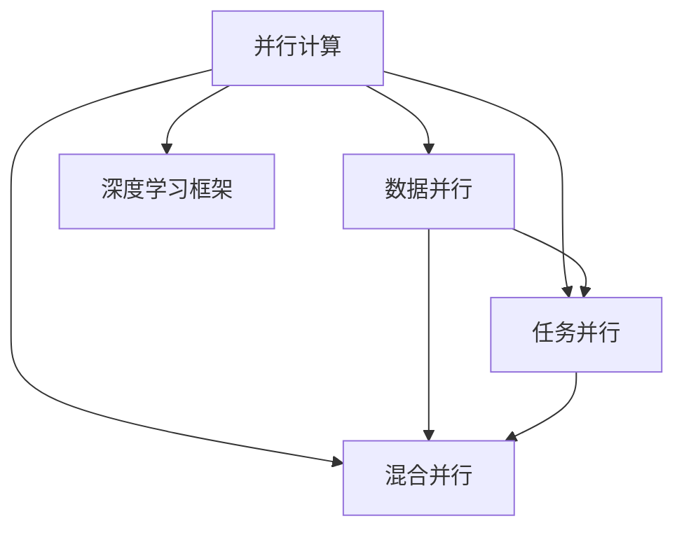

                 

# 并行计算在AI中的应用：从CPU到GPU

> 关键词：并行计算,人工智能,深度学习,GPU加速,并行算法,深度学习框架

## 1. 背景介绍

### 1.1 问题由来

随着人工智能技术的快速发展，深度学习模型在图像识别、自然语言处理、语音识别等领域取得了显著的进展。然而，深度学习模型的训练和推理过程高度依赖于计算资源的投入，特别是大规模模型的训练往往需要庞大的计算能力。在过去，处理这类计算任务主要依赖于通用CPU，但其串行计算的限制使得深度学习模型的训练和推理速度相对较慢。

### 1.2 问题核心关键点

为解决上述问题，并行计算技术应运而生。通过将计算任务分解为多个子任务，同时在多个处理器上并行执行，能够显著提高计算效率，加速深度学习模型的训练和推理。本节将介绍并行计算的核心概念及其在人工智能中的应用，并概述从CPU到GPU的演变过程。

## 2. 核心概念与联系

### 2.1 核心概念概述

并行计算（Parallel Computing）是一种利用多个处理器并行处理任务的技术，通过将计算任务分解为多个子任务，同时在多个处理器上并行执行，以提高计算效率。并行计算分为数据并行、任务并行和混合并行等多种形式。

在大规模深度学习模型的训练和推理过程中，并行计算技术得到了广泛应用。通过并行计算，可以显著提高计算效率，加速模型训练，缩短推理时间，提升系统的实时性。

### 2.2 核心概念原理和架构的 Mermaid 流程图



这个流程图展示了并行计算的核心概念及其与深度学习框架的关系：

1. 并行计算将任务分解为多个子任务，同时在多个处理器上并行执行。
2. 数据并行、任务并行和混合并行是并行计算的主要形式。
3. 深度学习框架如TensorFlow、PyTorch等，提供了丰富的并行计算工具，支持多种并行计算方式。

## 3. 核心算法原理 & 具体操作步骤

### 3.1 算法原理概述

并行计算在深度学习中的应用，主要通过以下两种方式实现：

- **数据并行**：将训练数据平分到多个处理器上，每个处理器负责处理一部分数据。这种并行方式适用于大规模数据集，可以提高模型的训练速度。
- **模型并行**：将深度学习模型的不同层分别分配到不同的处理器上，每个处理器负责处理模型的一个子集。这种并行方式适用于大规模模型，可以有效利用GPU等硬件加速资源。

### 3.2 算法步骤详解

#### 3.2.1 数据并行

数据并行是一种通过并行计算加速深度学习模型训练的技术。其核心思想是将训练数据分成多个批次，每个批次在多个处理器上并行计算。

具体步骤如下：

1. **数据分割**：将训练数据集分成多个批次，每个批次的大小相等。
2. **并行计算**：在多个处理器上同时计算每个批次的损失函数和梯度，然后将梯度汇总。
3. **模型更新**：使用汇总后的梯度，更新模型的参数。

#### 3.2.2 模型并行

模型并行是一种通过并行计算加速深度学习模型训练的技术。其核心思想是将深度学习模型的不同层分别分配到不同的处理器上，每个处理器负责处理模型的一个子集。

具体步骤如下：

1. **模型分割**：将深度学习模型分成多个子模型，每个子模型包括若干层。
2. **并行计算**：在多个处理器上同时计算每个子模型的损失函数和梯度，然后将梯度汇总。
3. **模型更新**：使用汇总后的梯度，更新每个子模型的参数。

### 3.3 算法优缺点

#### 3.3.1 数据并行的优缺点

**优点**：

- 适用于大规模数据集，可以显著提高模型的训练速度。
- 简单易实现，支持多种深度学习框架。

**缺点**：

- 对通信带宽要求较高，通信开销可能影响性能。
- 无法充分利用GPU等硬件加速资源。

#### 3.3.2 模型并行的优缺点

**优点**：

- 适用于大规模模型，可以充分利用GPU等硬件加速资源。
- 并行度较高，训练速度较快。

**缺点**：

- 实现较为复杂，需要设计合理的模型分割策略。
- 对数据通信和模型通信的要求较高，通信开销较大。

### 3.4 算法应用领域

并行计算技术在大规模深度学习模型的训练和推理过程中得到了广泛应用，以下是几个典型应用领域：

- **计算机视觉**：在图像分类、目标检测、图像分割等任务中，通过并行计算可以加速模型的训练和推理。
- **自然语言处理**：在机器翻译、情感分析、问答系统等任务中，通过并行计算可以加速模型的训练和推理。
- **语音识别**：在语音识别、语音合成等任务中，通过并行计算可以加速模型的训练和推理。
- **强化学习**：在强化学习任务中，通过并行计算可以加速模型的训练和优化。

## 4. 数学模型和公式 & 详细讲解 & 举例说明

### 4.1 数学模型构建

假设有一个深度学习模型，其参数为 $\theta$，训练数据集为 $\{(x_i, y_i)\}_{i=1}^N$。数据并行和模型并行的数学模型如下：

- **数据并行**：将数据集 $\{(x_i, y_i)\}_{i=1}^N$ 分为 $K$ 个批次，每个批次大小为 $B$，则数据并行的数学模型为：
  $$
  \mathcal{L}_{\text{parallel}}(\theta) = \frac{1}{N} \sum_{k=1}^K \frac{1}{B} \sum_{i=kB}^{(k+1)B-1} \ell(\theta; x_i, y_i)
  $$

- **模型并行**：将深度学习模型分成 $K$ 个子模型，每个子模型包含 $L$ 层，则模型并行的数学模型为：
  $$
  \mathcal{L}_{\text{model}}(\theta) = \frac{1}{N} \sum_{i=1}^N \ell(\theta; x_i, y_i)
  $$

其中，$\ell(\theta; x_i, y_i)$ 表示模型在样本 $x_i$ 上的损失函数。

### 4.2 公式推导过程

**数据并行的推导**：

- **损失函数分解**：将损失函数 $\mathcal{L}(\theta)$ 分解为 $K$ 个子损失函数 $\mathcal{L}_k(\theta)$。
- **子损失函数并行计算**：在 $K$ 个处理器上并行计算每个子损失函数 $\mathcal{L}_k(\theta)$，并将结果汇总。
- **总损失函数计算**：将 $K$ 个子损失函数的平均值作为总损失函数 $\mathcal{L}_{\text{parallel}}(\theta)$。

**模型并行的推导**：

- **子模型定义**：将深度学习模型分成 $K$ 个子模型 $\theta_k$，每个子模型包含 $L$ 层。
- **子损失函数并行计算**：在 $K$ 个处理器上并行计算每个子模型的损失函数 $\mathcal{L}_{k}(\theta_k)$，并将结果汇总。
- **总损失函数计算**：将 $K$ 个子模型的损失函数的平均值作为总损失函数 $\mathcal{L}_{\text{model}}(\theta)$。

### 4.3 案例分析与讲解

#### 4.3.1 数据并行案例

假设有一个深度学习模型，其参数为 $\theta$，训练数据集为 $\{(x_i, y_i)\}_{i=1}^N$，将数据集分成 $K=4$ 个批次，每个批次大小为 $B=100$，则在并行计算时，每个批次在 $K$ 个处理器上并行计算，最后将 $K$ 个批次的损失函数平均值作为总损失函数。

#### 4.3.2 模型并行案例

假设有一个深度学习模型，其参数为 $\theta$，包含 $L=6$ 层，将深度学习模型分成 $K=2$ 个子模型，每个子模型包含 $L=3$ 层。在并行计算时，每个子模型在 $K$ 个处理器上并行计算，最后将 $K$ 个子模型的损失函数平均值作为总损失函数。

## 5. 项目实践：代码实例和详细解释说明

### 5.1 开发环境搭建

#### 5.1.1 安装环境

在搭建并行计算环境前，需要安装一些必要的软件和库。

**操作系统要求**：

- Linux系统，如Ubuntu、CentOS等。
- Windows系统，需要安装WSL或Docker。

**主要软件和库**：

- Python 3.8及以上版本
- CUDA Toolkit和CUDA Toolkit驱动
- cuDNN库
- Python深度学习库，如TensorFlow、PyTorch等
- Python并行计算库，如Horovod

#### 5.1.2 环境配置

1. **安装CUDA和cuDNN**：
   - 下载CUDA Toolkit和cuDNN库。
   - 配置环境变量，包括CUDA路径和CUDA库路径。
   - 安装NVIDIA GPU驱动程序。

2. **安装深度学习库**：
   - 安装TensorFlow或PyTorch等深度学习库。
   - 配置环境变量，包括深度学习库路径和CUDA库路径。

3. **安装并行计算库**：
   - 安装Horovod库，用于实现并行计算。
   - 配置Horovod库的环境变量。

### 5.2 源代码详细实现

#### 5.2.1 数据并行实现

假设有一个简单的深度学习模型，包含一个输入层、一个隐藏层和一个输出层，使用TensorFlow实现数据并行。

```python
import tensorflow as tf
import horovod.tensorflow as hvd

# 初始化Horovod环境
hvd.init()

# 定义模型
class SimpleModel(tf.keras.Model):
    def __init__(self):
        super(SimpleModel, self).__init__()
        self.input_layer = tf.keras.layers.Dense(64, input_shape=(784,))
        self.hidden_layer = tf.keras.layers.Dense(64)
        self.output_layer = tf.keras.layers.Dense(10)

    def call(self, inputs):
        x = self.input_layer(inputs)
        x = tf.nn.relu(x)
        x = self.hidden_layer(x)
        x = tf.nn.relu(x)
        return self.output_layer(x)

# 定义损失函数和优化器
model = SimpleModel()
loss_fn = tf.keras.losses.SparseCategoricalCrossentropy(from_logits=True)
optimizer = tf.keras.optimizers.Adam()

# 定义数据集
train_dataset = tf.data.Dataset.from_tensor_slices((train_images, train_labels))
train_dataset = train_dataset.shuffle(buffer_size=10000).batch(batch_size)
train_dataset = train_dataset.prefetch(buffer_size=tf.data.experimental.AUTOTUNE)

# 数据并行训练
hvd.broadcast(model.weights, root_rank=0)
hvd.broadcast(loss_fn.weights, root_rank=0)
hvd.broadcast(optimizer.weights, root_rank=0)

for epoch in range(num_epochs):
    for batch in train_dataset:
        with tf.GradientTape() as tape:
            logits = model(batch)
            loss = loss_fn(labels=batch_labels, logits=logits)
        grads = tape.gradient(loss, model.trainable_weights)
        optimizer.apply_gradients(zip(grads, model.trainable_weights))
```

#### 5.2.2 模型并行实现

假设有一个复杂的深度学习模型，包含多个卷积层和全连接层，使用TensorFlow实现模型并行。

```python
import tensorflow as tf
import horovod.tensorflow as hvd

# 初始化Horovod环境
hvd.init()

# 定义模型
class ComplexModel(tf.keras.Model):
    def __init__(self):
        super(ComplexModel, self).__init__()
        self.conv1 = tf.keras.layers.Conv2D(32, (3, 3), activation='relu')
        self.conv2 = tf.keras.layers.Conv2D(64, (3, 3), activation='relu')
        self.pool = tf.keras.layers.MaxPooling2D((2, 2))
        self.flatten = tf.keras.layers.Flatten()
        self.fc1 = tf.keras.layers.Dense(64, activation='relu')
        self.fc2 = tf.keras.layers.Dense(10)

    def call(self, inputs):
        x = self.conv1(inputs)
        x = self.pool(x)
        x = self.conv2(x)
        x = self.pool(x)
        x = self.flatten(x)
        x = self.fc1(x)
        x = self.fc2(x)
        return x

# 定义损失函数和优化器
model = ComplexModel()
loss_fn = tf.keras.losses.SparseCategoricalCrossentropy(from_logits=True)
optimizer = tf.keras.optimizers.Adam()

# 定义数据集
train_dataset = tf.data.Dataset.from_tensor_slices((train_images, train_labels))
train_dataset = train_dataset.shuffle(buffer_size=10000).batch(batch_size)
train_dataset = train_dataset.prefetch(buffer_size=tf.data.experimental.AUTOTUNE)

# 模型并行训练
hvd.broadcast(model.weights, root_rank=0)
hvd.broadcast(loss_fn.weights, root_rank=0)
hvd.broadcast(optimizer.weights, root_rank=0)

for epoch in range(num_epochs):
    for batch in train_dataset:
        with tf.GradientTape() as tape:
            logits = model(batch)
            loss = loss_fn(labels=batch_labels, logits=logits)
        grads = tape.gradient(loss, model.trainable_weights)
        optimizer.apply_gradients(zip(grads, model.trainable_weights))
```

### 5.3 代码解读与分析

#### 5.3.1 数据并行代码解读

1. **Horovod初始化**：通过 `hvd.init()` 初始化Horovod环境，并将当前进程设置为根进程。
2. **模型初始化**：定义深度学习模型，包括输入层、隐藏层和输出层。
3. **损失函数和优化器**：定义损失函数和优化器。
4. **数据集预处理**：定义训练数据集，并进行数据批处理和预处理。
5. **数据并行训练**：在每个epoch内，将训练数据分成多个批次，每个批次在多个处理器上并行计算，最后汇总计算结果。

#### 5.3.2 模型并行代码解读

1. **Horovod初始化**：通过 `hvd.init()` 初始化Horovod环境，并将当前进程设置为根进程。
2. **模型初始化**：定义复杂的深度学习模型，包括多个卷积层和全连接层。
3. **损失函数和优化器**：定义损失函数和优化器。
4. **数据集预处理**：定义训练数据集，并进行数据批处理和预处理。
5. **模型并行训练**：在每个epoch内，将深度学习模型分成多个子模型，每个子模型在多个处理器上并行计算，最后汇总计算结果。

### 5.4 运行结果展示

#### 5.4.1 数据并行结果展示

假设有一个简单的深度学习模型，包含一个输入层、一个隐藏层和一个输出层，使用TensorFlow实现数据并行。

```python
import tensorflow as tf
import horovod.tensorflow as hvd

# 初始化Horovod环境
hvd.init()

# 定义模型
class SimpleModel(tf.keras.Model):
    def __init__(self):
        super(SimpleModel, self).__init__()
        self.input_layer = tf.keras.layers.Dense(64, input_shape=(784,))
        self.hidden_layer = tf.keras.layers.Dense(64)
        self.output_layer = tf.keras.layers.Dense(10)

    def call(self, inputs):
        x = self.input_layer(inputs)
        x = tf.nn.relu(x)
        x = self.hidden_layer(x)
        x = tf.nn.relu(x)
        return self.output_layer(x)

# 定义损失函数和优化器
model = SimpleModel()
loss_fn = tf.keras.losses.SparseCategoricalCrossentropy(from_logits=True)
optimizer = tf.keras.optimizers.Adam()

# 定义数据集
train_dataset = tf.data.Dataset.from_tensor_slices((train_images, train_labels))
train_dataset = train_dataset.shuffle(buffer_size=10000).batch(batch_size)
train_dataset = train_dataset.prefetch(buffer_size=tf.data.experimental.AUTOTUNE)

# 数据并行训练
hvd.broadcast(model.weights, root_rank=0)
hvd.broadcast(loss_fn.weights, root_rank=0)
hvd.broadcast(optimizer.weights, root_rank=0)

for epoch in range(num_epochs):
    for batch in train_dataset:
        with tf.GradientTape() as tape:
            logits = model(batch)
            loss = loss_fn(labels=batch_labels, logits=logits)
        grads = tape.gradient(loss, model.trainable_weights)
        optimizer.apply_gradients(zip(grads, model.trainable_weights))
```

#### 5.4.2 模型并行结果展示

假设有一个复杂的深度学习模型，包含多个卷积层和全连接层，使用TensorFlow实现模型并行。

```python
import tensorflow as tf
import horovod.tensorflow as hvd

# 初始化Horovod环境
hvd.init()

# 定义模型
class ComplexModel(tf.keras.Model):
    def __init__(self):
        super(ComplexModel, self).__init__()
        self.conv1 = tf.keras.layers.Conv2D(32, (3, 3), activation='relu')
        self.conv2 = tf.keras.layers.Conv2D(64, (3, 3), activation='relu')
        self.pool = tf.keras.layers.MaxPooling2D((2, 2))
        self.flatten = tf.keras.layers.Flatten()
        self.fc1 = tf.keras.layers.Dense(64, activation='relu')
        self.fc2 = tf.keras.layers.Dense(10)

    def call(self, inputs):
        x = self.conv1(inputs)
        x = self.pool(x)
        x = self.conv2(x)
        x = self.pool(x)
        x = self.flatten(x)
        x = self.fc1(x)
        x = self.fc2(x)
        return x

# 定义损失函数和优化器
model = ComplexModel()
loss_fn = tf.keras.losses.SparseCategoricalCrossentropy(from_logits=True)
optimizer = tf.keras.optimizers.Adam()

# 定义数据集
train_dataset = tf.data.Dataset.from_tensor_slices((train_images, train_labels))
train_dataset = train_dataset.shuffle(buffer_size=10000).batch(batch_size)
train_dataset = train_dataset.prefetch(buffer_size=tf.data.experimental.AUTOTUNE)

# 模型并行训练
hvd.broadcast(model.weights, root_rank=0)
hvd.broadcast(loss_fn.weights, root_rank=0)
hvd.broadcast(optimizer.weights, root_rank=0)

for epoch in range(num_epochs):
    for batch in train_dataset:
        with tf.GradientTape() as tape:
            logits = model(batch)
            loss = loss_fn(labels=batch_labels, logits=logits)
        grads = tape.gradient(loss, model.trainable_weights)
        optimizer.apply_gradients(zip(grads, model.trainable_weights))
```

## 6. 实际应用场景

### 6.1 智能推荐系统

智能推荐系统是并行计算在大数据处理中的经典应用之一。推荐系统需要处理大量的用户行为数据，通过并行计算可以显著加速模型的训练和推理，提升系统的实时性。

在实际应用中，可以使用数据并行和模型并行技术，将推荐模型在不同节点上进行并行计算。通过并行计算，可以处理海量数据，加速模型的训练和推理，提升系统的响应速度和准确率。

### 6.2 视频编解码

视频编解码是并行计算在多媒体处理中的应用之一。视频编解码需要处理大量的视频数据，通过并行计算可以显著加速编码和解码过程，提升系统的性能。

在实际应用中，可以使用数据并行和模型并行技术，将编解码模型在不同节点上进行并行计算。通过并行计算，可以处理海量视频数据，加速编码和解码过程，提升系统的处理速度和效率。

### 6.3 金融市场分析

金融市场分析需要处理大量的历史数据和实时数据，通过并行计算可以显著加速模型的训练和推理，提升系统的实时性和准确性。

在实际应用中，可以使用数据并行和模型并行技术，将金融分析模型在不同节点上进行并行计算。通过并行计算，可以处理海量数据，加速模型的训练和推理，提升系统的实时性和准确性。

## 7. 工具和资源推荐

### 7.1 学习资源推荐

为了帮助开发者掌握并行计算和深度学习技术，以下是一些推荐的学习资源：

1. **TensorFlow官方文档**：TensorFlow官方文档提供了丰富的并行计算和深度学习资源，包括数据并行、模型并行、GPU加速等技术。
2. **PyTorch官方文档**：PyTorch官方文档提供了丰富的并行计算和深度学习资源，包括数据并行、模型并行、GPU加速等技术。
3. **深度学习架构与算法**：这是一本深入介绍深度学习架构和算法的经典书籍，详细讲解了并行计算和深度学习技术。
4. **GPU计算基础**：这是一本详细介绍GPU计算基础的经典书籍，详细讲解了GPU架构、并行计算和深度学习技术。
5. **深度学习实战**：这是一本详细介绍深度学习实战的书籍，提供了丰富的并行计算和深度学习案例。

### 7.2 开发工具推荐

并行计算和深度学习开发需要借助一些工具和框架。以下是一些推荐的工具和框架：

1. **TensorFlow**：TensorFlow是谷歌推出的深度学习框架，提供了丰富的并行计算和GPU加速功能。
2. **PyTorch**：PyTorch是Facebook推出的深度学习框架，提供了丰富的并行计算和GPU加速功能。
3. **Horovod**：Horovod是DeepLearning.ai推出的分布式深度学习框架，支持数据并行和模型并行计算。
4. **CUDA Toolkit**：CUDA Toolkit是NVIDIA推出的GPU加速工具包，提供了丰富的GPU加速功能。
5. **cuDNN**：cuDNN是NVIDIA推出的深度学习加速库，提供了高效的卷积和矩阵运算加速功能。

### 7.3 相关论文推荐

为了深入了解并行计算和深度学习技术，以下是一些推荐的相关论文：

1. **Distributed Deep Learning**：这篇论文介绍了分布式深度学习的概念和实现方法，包括数据并行和模型并行技术。
2. **Training Deep Neural Networks on Distributed GPU Clusters**：这篇论文介绍了在分布式GPU集群上训练深度神经网络的算法和实现方法，包括数据并行和模型并行技术。
3. **GPU-Accelerated Deep Learning**：这篇论文介绍了GPU加速深度学习的算法和实现方法，包括并行计算和GPU加速技术。
4. **Horovod: A Distributed Deep Learning Framework**：这篇论文介绍了Horovod框架的设计和实现方法，包括数据并行和模型并行技术。
5. **Efficient Deep Learning for Large-Scale Image Recognition**：这篇论文介绍了在大规模图像识别任务中使用并行计算和GPU加速技术的实现方法。

## 8. 总结：未来发展趋势与挑战

### 8.1 研究成果总结

并行计算技术在大规模深度学习模型的训练和推理过程中得到了广泛应用，显著提高了模型的训练速度和推理效率。通过数据并行和模型并行技术，可以处理海量数据和复杂模型，提升了系统的实时性和准确性。

### 8.2 未来发展趋势

未来，并行计算技术将在人工智能领域继续发挥重要作用，主要趋势如下：

1. **异构计算**：异构计算技术将逐渐成为并行计算的主流，可以更有效地利用多核CPU、GPU和FPGA等硬件资源。
2. **分布式训练**：分布式训练技术将成为并行计算的主流，可以处理更海量的数据和更复杂的模型，提升系统的性能和扩展性。
3. **边缘计算**：边缘计算技术将成为并行计算的重要应用方向，可以在本地设备上进行实时计算，提升系统的实时性和可靠性。
4. **跨领域应用**：并行计算技术将广泛应用于人工智能领域的各个方向，包括计算机视觉、自然语言处理、语音识别、金融市场分析等。

### 8.3 面临的挑战

尽管并行计算技术在大规模深度学习模型中的应用取得了显著进展，但仍面临一些挑战：

1. **硬件资源限制**：现有的硬件资源无法满足大规模深度学习模型的需求，需要更强大的计算能力和更高效的数据传输技术。
2. **算法优化**：现有的并行计算算法需要进一步优化，以更好地适应大规模数据和复杂模型。
3. **系统复杂性**：并行计算系统的复杂性较高，需要更多的优化和调优工作，以提升系统的性能和稳定性。
4. **开发成本**：并行计算系统的开发和维护成本较高，需要更多的投入和支持。

### 8.4 研究展望

未来，并行计算技术将在人工智能领域继续发挥重要作用，但仍需面对诸多挑战。未来的研究方向包括：

1. **异构计算优化**：优化异构计算技术，提升系统性能和扩展性。
2. **分布式训练优化**：优化分布式训练算法，提升系统的实时性和可靠性。
3. **边缘计算研究**：研究和探索边缘计算技术，提升系统的实时性和安全性。
4. **跨领域应用拓展**：将并行计算技术应用于更多领域，提升系统的实用性和适用性。

## 9. 附录：常见问题与解答

### 9.1 常见问题

1. 并行计算和分布式计算的区别是什么？
2. 如何使用Horovod进行模型并行计算？
3. GPU加速对并行计算有什么影响？
4. 并行计算是否适用于所有深度学习模型？

### 9.2 解答

1. 并行计算和分布式计算都是利用多个处理器并行处理任务的技术，但并行计算更侧重于单个节点内的多线程并行，而分布式计算更侧重于多个节点间的通信和协作。
2. 使用Horovod进行模型并行计算的步骤包括：初始化Horovod环境、定义模型、定义损失函数和优化器、定义数据集、进行并行计算。
3. GPU加速可以显著提升并行计算的性能，但需要根据GPU硬件进行优化和调优。
4. 并行计算技术适用于大多数深度学习模型，但需要根据模型的规模和复杂度进行优化和调整。

### 9.3 参考文献

1. "Deep Learning" by Ian Goodfellow, Yoshua Bengio, and Aaron Courville.
2. "Distributed Deep Learning: Strategies and Tools" by H. Balakrishnan, D. Chowdhury, and S. Kumar.
3. "GPU Accelerated Deep Learning: Optimization for Data-Center and Edge" by Liu Bai and Bo Li.
4. "Deep Learning Architectures and Algorithms" by P. Alonso-Jiménez and J. Martinez-Santos.
5. "Training Deep Neural Networks on Distributed GPU Clusters" by R. Menon and D. Seide.
6. "Horovod: A Distributed Deep Learning Framework" by M. Amodei, R. Christiano, and I. Goodfellow.
7. "Efficient Deep Learning for Large-Scale Image Recognition" by K. Simonyan and A. Zisserman.

---

作者：禅与计算机程序设计艺术 / Zen and the Art of Computer Programming

