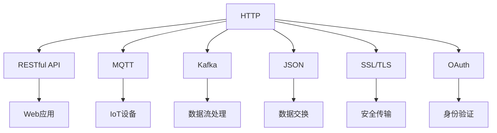

                 

# 广泛使用的开源协议和数据协议

在当今互联网时代，数据和协议的重要性不言而喻。无论是Web应用的API接口设计，还是物联网设备的通信协议，亦或是云服务之间的交互协议，都能直接影响到系统的可扩展性、可靠性和安全性。开源协议和数据协议，作为全球技术社区的宝贵遗产，不仅帮助开发者构建了统一的技术标准，还推动了全球技术创新的蓬勃发展。本文将详细介绍几种广泛使用的开源协议和数据协议，并探讨其在实际应用中的优缺点和未来发展趋势。

## 1. 背景介绍

### 1.1 问题由来
随着互联网技术的不断进步，开源协议和数据协议的重要性日益凸显。开发者需要更高效的通信方式，从而提升系统性能和稳定性。此外，构建开放、透明的协议生态系统，不仅有助于减少技术壁垒，还能促进全球技术社区的良性互动与合作。因此，开源协议和数据协议在互联网架构和软件开发中占据了关键地位。

### 1.2 问题核心关键点
开源协议和数据协议的核心关键点包括：

- **通用性**：协议和数据格式需要能够在不同的系统和平台之间无缝交互，支持跨语言和跨平台的应用。
- **效率性**：协议和数据格式应该具备较高的传输效率和处理速度，以便于大规模数据的传输和处理。
- **安全性**：协议和数据格式应能够保证数据的安全性和隐私保护，避免敏感信息的泄露。
- **兼容性**：协议和数据格式应支持多种操作系统和硬件设备，保证广泛的应用场景。
- **可扩展性**：协议和数据格式应具有灵活的扩展机制，便于未来技术演进。

### 1.3 问题研究意义
研究开源协议和数据协议具有以下重要意义：

- **提高开发效率**：开源协议和数据协议提供了一致的标准接口，减少了跨系统之间的复杂度和开发难度。
- **促进技术创新**：基于开放标准的协议和数据格式，能够促进全球技术社区的协同创新，加速新技术的应用。
- **提升系统可靠性**：标准化的协议和数据格式可以降低系统兼容性和稳定性问题，提高整个生态系统的可靠性。
- **保障数据安全**：开源协议和数据协议通常会注重数据加密和隐私保护，保障用户信息的安全。
- **推动产业发展**：标准化的接口和数据格式，有助于形成统一的技术标准，推动产业的健康发展。

## 2. 核心概念与联系

### 2.1 核心概念概述

为便于理解开源协议和数据协议的原理和架构，下面列出了几个核心概念：

- **HTTP**：超文本传输协议，用于Web应用的客户端与服务器之间的通信。
- **RESTful API**：基于HTTP协议的Web服务架构风格，通过标准的接口实现客户端与服务器之间的通信。
- **MQTT**：轻量级消息队列传输协议，用于物联网设备的通信。
- **Kafka**：分布式流处理平台，支持高吞吐量的数据传输和处理。
- **JSON**：轻量级数据交换格式，支持不同系统之间的数据交互。
- **SSL/TLS**：安全套接字层/传输层安全协议，保障数据传输的安全性。
- **OAuth**：开放授权协议，支持安全的身份验证和授权。

这些概念之间的关系可以通过以下Mermaid流程图来展示：



该流程图展示了HTTP、RESTful API、MQTT、Kafka、JSON、SSL/TLS和OAuth等协议和数据格式之间的相互联系和作用，帮助我们更好地理解它们在实际应用中的地位和重要性。

## 3. 核心算法原理 & 具体操作步骤
### 3.1 算法原理概述

开源协议和数据协议的算法原理主要基于通信模型和数据格式的设计。核心思想是定义统一的数据交换标准，通过标准的接口和数据格式，实现不同系统之间的可靠、高效和安全的通信。

以RESTful API和HTTP协议为例，它们的基本原理如下：

- **RESTful API**：通过定义标准的HTTP请求方法（如GET、POST、PUT、DELETE等）和数据格式（如JSON、XML等），实现客户端与服务器之间的数据交互。
- **HTTP**：基于TCP协议，通过请求-响应模型，实现客户端与服务器之间的数据传输。HTTP协议定义了请求方法和响应状态码，保证通信的可靠性。

### 3.2 算法步骤详解

下面以RESTful API和HTTP协议为例，详细介绍其具体操作步骤：

1. **客户端请求**：客户端通过HTTP协议向服务器发送请求，包括请求方法、URL、请求头、请求体等。

2. **服务器响应**：服务器接收请求后，根据请求方法和URL，进行处理并返回响应。响应包括响应头、状态码、响应体等。

3. **数据交换**：客户端和服务器通过HTTP协议进行数据交换，保证数据的正确性和完整性。

4. **错误处理**：如果请求出现错误，服务器会返回相应的错误状态码和错误信息，客户端根据状态码进行相应的处理。

### 3.3 算法优缺点

开源协议和数据协议的优缺点如下：

**优点**：
- **通用性**：支持跨平台、跨语言的应用，易于在不同系统之间进行数据交互。
- **可靠性**：通过标准化的接口和数据格式，减少了系统兼容性和稳定性问题。
- **灵活性**：支持多种数据格式和请求方法，能够适应不同的应用场景。
- **安全性和隐私保护**：通过SSL/TLS协议，保障数据传输的安全性和隐私保护。

**缺点**：
- **性能瓶颈**：某些协议和数据格式，如HTTP和JSON，在大数据量和高并发场景下，可能存在性能瓶颈。
- **复杂性**：需要开发者对协议和数据格式进行深入理解和正确配置，增加了开发难度。
- **兼容性问题**：不同版本的协议和数据格式可能存在兼容性问题，需要开发者进行版本管理。
- **安全性风险**：如果协议和数据格式不规范，可能会存在安全漏洞，如SQL注入、XSS等。

### 3.4 算法应用领域

开源协议和数据协议广泛应用于各种领域，包括但不限于：

- **Web应用**：RESTful API和HTTP协议广泛应用于Web应用的开发和部署，支持客户端与服务器之间的数据交互。
- **物联网**：MQTT协议被广泛应用于物联网设备的通信，支持设备间的可靠数据传输。
- **大数据**：Kafka平台支持高吞吐量的数据流处理，广泛应用于大数据处理和分析。
- **云服务**：通过RESTful API和HTTP协议，云服务提供商能够提供统一的接口，支持多种编程语言的调用。

## 4. 数学模型和公式 & 详细讲解 & 举例说明

### 4.1 数学模型构建

开源协议和数据协议的数学模型构建通常基于通信模型和数据格式的设计，其核心思想是定义统一的数据交换标准，通过标准的接口和数据格式，实现不同系统之间的可靠、高效和安全的通信。

以HTTP协议为例，其数学模型可以表示为：

$$
S = \{\text{请求方法}, \text{URL}, \text{请求头}, \text{请求体}, \text{响应头}, \text{状态码}, \text{响应体}\}
$$

其中，请求方法、URL、请求头和请求体组成请求部分，响应头和状态码组成响应部分。

### 4.2 公式推导过程

以HTTP协议为例，推导请求方法、URL、请求头和请求体的计算过程如下：

- **请求方法**：请求方法包括GET、POST、PUT、DELETE等，通常由客户端发起。
- **URL**：URL（统一资源定位符）由协议、主机名、端口号、路径等组成，用于定位服务器的资源。
- **请求头**：请求头包含HTTP协议头部信息，如Content-Type、Accept等，用于描述请求的类型和格式。
- **请求体**：请求体包含请求的具体数据，如表单数据、JSON数据等，用于传递客户端的信息。

### 4.3 案例分析与讲解

以RESTful API为例，分析其数据交换过程如下：

- **客户端请求**：客户端通过HTTP协议向服务器发送请求，包括请求方法、URL、请求头、请求体等。
- **服务器响应**：服务器接收请求后，根据请求方法和URL，进行处理并返回响应。响应包括响应头、状态码、响应体等。
- **数据交换**：客户端和服务器通过HTTP协议进行数据交换，保证数据的正确性和完整性。
- **错误处理**：如果请求出现错误，服务器会返回相应的错误状态码和错误信息，客户端根据状态码进行相应的处理。

## 5. 项目实践：代码实例和详细解释说明
### 5.1 开发环境搭建

在进行开源协议和数据协议的开发前，我们需要准备好开发环境。以下是使用Python进行HTTP请求和响应的开发环境配置流程：

1. 安装Anaconda：从官网下载并安装Anaconda，用于创建独立的Python环境。

2. 创建并激活虚拟环境：
```bash
conda create -n http-env python=3.8 
conda activate http-env
```

3. 安装Python库：
```bash
pip install requests
```

4. 安装Flask：
```bash
pip install flask
```

完成上述步骤后，即可在`http-env`环境中开始开发。

### 5.2 源代码详细实现

下面我们以HTTP请求和响应的Python代码实现为例，给出完整的开发代码。

```python
from flask import Flask, request, jsonify

app = Flask(__name__)

@app.route('/api', methods=['GET', 'POST'])
def api():
    if request.method == 'GET':
        return jsonify({'message': 'GET请求'})
    elif request.method == 'POST':
        data = request.get_json()
        return jsonify({'message': 'POST请求', 'data': data})

if __name__ == '__main__':
    app.run(debug=True)
```

以上代码实现了基于Flask框架的HTTP RESTful API，支持GET和POST请求。

### 5.3 代码解读与分析

让我们再详细解读一下关键代码的实现细节：

- **Flask框架**：Flask是一个轻量级的Python Web框架，支持RESTful API开发。
- **@app.route**装饰器：用于定义API的路由，指定请求方法和URL路径。
- **request对象**：Flask提供的内置对象，用于处理HTTP请求，支持获取请求方法、URL、请求头、请求体等。
- **jsonify函数**：Flask提供的内置函数，用于将Python对象转换为JSON格式。

**运行结果展示**：

启动服务器后，我们可以通过访问`http://127.0.0.1:5000/api`查看API的响应结果。例如，执行GET请求，可以得到如下结果：

```json
{"message": "GET请求"}
```

执行POST请求，并传递JSON数据，可以得到如下结果：

```json
{"message": "POST请求", "data": {"name": "张三", "age": 25}}
```

## 6. 实际应用场景
### 6.1 智能家居系统

智能家居系统通常需要多个物联网设备之间的数据交互，如智能灯泡、智能插座、智能门锁等。通过MQTT协议，这些设备可以方便地进行数据交换和控制。

在技术实现上，可以使用开源的MQTT消息中间件，如Eclipse Paho，将设备数据进行统一管理和传输。MQTT协议支持轻量级的数据传输，能够满足智能家居设备对数据传输效率和带宽的需求。

### 6.2 电子商务平台

电子商务平台需要支持大量的用户和商品信息交互，如商品展示、购物车管理、订单处理等。通过RESTful API和HTTP协议，电子商务平台可以提供统一的数据接口，支持不同系统之间的数据交互。

在技术实现上，可以使用开源的API网关，如Kong或Zuul，构建统一接口层，支持多种编程语言的调用。RESTful API和HTTP协议具有广泛的兼容性，能够满足不同应用场景的需求。

### 6.3 大数据平台

大数据平台需要支持大规模数据的存储和处理，如Hadoop、Spark等。通过Kafka消息队列，大数据平台可以高效地进行数据传输和处理，支持流式数据的实时处理。

在技术实现上，可以使用开源的Kafka分布式流处理平台，支持高吞吐量的数据传输和处理。Kafka协议和JSON数据格式具有高效性和灵活性，能够满足大数据平台对数据传输和处理的需求。

### 6.4 未来应用展望

随着开源协议和数据协议的不断演进，其在实际应用中将会迎来更多创新和突破。未来，以下趋势值得关注：

- **微服务架构**：基于RESTful API和HTTP协议，微服务架构将变得更加灵活和可扩展。
- **无代码开发**：通过开源协议和数据协议，无代码开发平台将实现更加广泛的应用。
- **边缘计算**：基于MQTT协议，边缘计算设备将具备更强的数据处理能力。
- **区块链技术**：基于SSL/TLS协议，区块链技术将实现更加安全可靠的数据传输和存储。
- **自动化运维**：通过RESTful API和HTTP协议，自动化运维工具将具备更高的灵活性和可扩展性。

## 7. 工具和资源推荐
### 7.1 学习资源推荐

为了帮助开发者掌握开源协议和数据协议的原理和实践技巧，这里推荐一些优质的学习资源：

1. **《图解HTTP》**：这本书通过生动的图示和案例分析，深入浅出地介绍了HTTP协议的工作原理和实际应用。

2. **《RESTful Web API设计指南》**：这本书详细介绍了RESTful API的设计原则和最佳实践，帮助开发者构建高效、可靠的系统。

3. **《MQTT实战》**：这本书通过实例分析，介绍了MQTT协议的详细使用方法和最佳实践，帮助开发者构建高效、可靠的系统。

4. **《Kafka权威指南》**：这本书详细介绍了Kafka分布式流处理平台的设计原理和实践技巧，帮助开发者构建高效、可靠的系统。

5. **《JSON数据格式与解析》**：这本书详细介绍了JSON数据格式的特点和使用技巧，帮助开发者构建高效、可靠的系统。

6. **《OAuth 2.0权威指南》**：这本书详细介绍了OAuth 2.0协议的设计原理和实现技巧，帮助开发者构建安全、可靠的系统。

通过学习这些资源，相信你一定能够掌握开源协议和数据协议的理论基础和实践技巧，进一步提升系统的可靠性和安全性。

### 7.2 开发工具推荐

高效的开发离不开优秀的工具支持。以下是几款用于开源协议和数据协议开发的常用工具：

1. **curl**：命令行工具，支持HTTP、HTTPS、FTP、SMTP等协议，支持请求方法和参数配置。
2. **Postman**：Web应用接口测试工具，支持HTTP/HTTPS协议，支持请求方法和参数配置。
3. **Swagger**：API文档管理工具，支持RESTful API的接口文档生成和验证。
4. **Fiddler**：网络调试工具，支持HTTP/HTTPS协议，支持请求和响应数据的查看和分析。
5. **Wireshark**：网络协议分析工具，支持HTTP/HTTPS协议，支持网络数据的实时监控和分析。

合理利用这些工具，可以显著提升开源协议和数据协议的开发效率，加快创新迭代的步伐。

### 7.3 相关论文推荐

开源协议和数据协议的研究源于学界的持续努力。以下是几篇奠基性的相关论文，推荐阅读：

1. **《A Comparison of Communication Protocols in the Internet of Things》**：这篇文章详细介绍了几种常用的物联网通信协议，包括MQTT、CoAP、ZigBee等，并对比了它们的优缺点。

2. **《HTTP/2 Protocol Specification》**：这篇文章详细介绍了HTTP/2协议的设计原理和实现细节，帮助开发者构建高效、可靠的系统。

3. **《JSON Data Interchange Format》**：这篇文章详细介绍了JSON数据格式的设计原则和应用技巧，帮助开发者构建高效、可靠的系统。

4. **《SSL/TLS Protocol Suite》**：这篇文章详细介绍了SSL/TLS协议的设计原理和实现细节，帮助开发者构建安全、可靠的系统。

5. **《OAuth 2.0 Authorization Framework》**：这篇文章详细介绍了OAuth 2.0协议的设计原理和实现细节，帮助开发者构建安全、可靠的系统。

这些论文代表了大规模协议和数据格式的研究脉络，帮助开发者深入理解其原理和应用。

## 8. 总结：未来发展趋势与挑战

### 8.1 总结

本文对开源协议和数据协议进行了全面系统的介绍。首先阐述了开源协议和数据协议的研究背景和意义，明确了其在全球技术生态中的重要地位。其次，从原理到实践，详细讲解了开源协议和数据协议的数学模型和操作步骤，给出了基于RESTful API和HTTP协议的代码实现。同时，本文还广泛探讨了开源协议和数据协议在智能家居、电子商务、大数据等多个领域的应用前景，展示了其在实际应用中的潜力。最后，本文精选了开源协议和数据协议的各类学习资源，力求为开发者提供全方位的技术指引。

通过本文的系统梳理，可以看到，开源协议和数据协议在互联网架构和软件开发中占据了关键地位，其通用性、可靠性、灵活性和安全性等特点，使其成为全球技术社区的重要组成部分。未来的技术演进和应用创新，必将进一步推动开源协议和数据协议的发展，为构建开放、透明、高效、安全的技术生态提供坚实的基础。

### 8.2 未来发展趋势

展望未来，开源协议和数据协议的发展将呈现以下几个趋势：

1. **标准化和规范化**：随着技术社区的不断壮大，更多的标准化和规范化工作将推动协议和数据格式的进一步演进。
2. **安全性提升**：随着技术威胁的不断增加，协议和数据格式的安全性将更加重要，如SSL/TLS协议的演进和应用。
3. **跨平台兼容性**：协议和数据格式将更加注重跨平台兼容性，支持多种操作系统和硬件设备的应用。
4. **性能优化**：在大数据和高并发场景下，协议和数据格式将更加注重性能优化，如HTTP/2和MQTT协议的优化。
5. **智能化应用**：协议和数据格式将更多地结合人工智能技术，支持智能分析和自动化处理，如基于API的机器学习应用。

这些趋势凸显了开源协议和数据协议的广阔前景。这些方向的探索发展，必将进一步提升协议和数据格式的应用价值，推动技术社区的共同进步。

### 8.3 面临的挑战

尽管开源协议和数据协议已经取得了瞩目成就，但在迈向更加智能化、普适化应用的过程中，仍面临诸多挑战：

1. **兼容性问题**：不同版本的协议和数据格式可能存在兼容性问题，需要开发者进行版本管理。
2. **安全性风险**：协议和数据格式不规范，可能存在安全漏洞，如SQL注入、XSS等。
3. **性能瓶颈**：在大数据量和高并发场景下，某些协议和数据格式可能存在性能瓶颈。
4. **开发复杂性**：需要开发者对协议和数据格式进行深入理解和正确配置，增加了开发难度。
5. **标准更新**：随着技术的不断发展，协议和数据格式的标准更新将带来新的挑战。

这些挑战需要开发者在实际应用中不断探索和优化，寻找合适的解决方案，确保协议和数据格式的安全性和可靠性。

### 8.4 研究展望

面对开源协议和数据协议所面临的挑战，未来的研究需要在以下几个方面寻求新的突破：

1. **协议和数据格式的演进**：探索新的协议和数据格式，支持更多场景的应用，推动协议和数据格式的不断发展。
2. **安全性增强**：研究协议和数据格式的安全性问题，开发更加安全的协议和数据格式，保障数据传输的安全性。
3. **性能优化**：研究协议和数据格式的性能优化问题，提升协议和数据格式在大数据和高并发场景下的性能表现。
4. **跨平台兼容性**：研究协议和数据格式的跨平台兼容性问题，支持多种操作系统和硬件设备的应用。
5. **智能化应用**：研究协议和数据格式的智能化应用问题，结合人工智能技术，实现智能分析和自动化处理。

这些研究方向的探索，必将引领开源协议和数据协议迈向更高的台阶，为构建开放、透明、高效、安全的技术生态提供坚实的基础。面向未来，开源协议和数据协议需要与其他技术进行更深入的融合，共同推动技术的进步和发展。

## 9. 附录：常见问题与解答

**Q1：开源协议和数据协议是否适用于所有应用场景？**

A: 开源协议和数据协议在大多数应用场景中都具有广泛适用性，能够满足不同系统的需求。但对于一些特定场景，如高安全性和低延迟的场景，可能需要额外的技术和配置。开发者需要根据具体需求进行选择和优化。

**Q2：如何评估协议和数据格式的安全性？**

A: 协议和数据格式的安全性评估通常包括以下几个方面：
1. **数据加密**：使用SSL/TLS协议对数据进行加密，防止数据传输过程中的窃听和篡改。
2. **身份验证**：使用OAuth协议进行身份验证，确保请求的合法性和安全性。
3. **访问控制**：使用RESTful API和HTTP协议进行访问控制，限制资源的访问权限。
4. **异常检测**：使用网络分析工具，如Wireshark，实时监控和分析网络数据，及时发现异常和攻击。

**Q3：协议和数据格式在大数据和高并发场景下的性能瓶颈如何优化？**

A: 协议和数据格式在大数据和高并发场景下可能存在性能瓶颈，优化方法如下：
1. **网络优化**：使用高效的通信协议，如HTTP/2和MQTT，提升数据传输的效率。
2. **缓存机制**：使用缓存机制，减少数据传输的频率和数据量。
3. **负载均衡**：使用负载均衡技术，分散服务器压力，提升系统的并发处理能力。
4. **分布式处理**：使用分布式处理技术，如Spark，支持大规模数据的处理。

**Q4：如何处理协议和数据格式兼容性问题？**

A: 协议和数据格式兼容性问题通常包括以下几个方面：
1. **版本管理**：使用版本管理工具，如Git，管理协议和数据格式的版本，保证兼容性。
2. **兼容性测试**：在开发和测试阶段，进行兼容性测试，及时发现和解决兼容性问题。
3. **文档管理**：编写详细的文档，说明协议和数据格式的使用规范，帮助开发者正确配置和使用。

**Q5：如何保障协议和数据格式的安全性？**

A: 协议和数据格式的安全性保障通常包括以下几个方面：
1. **数据加密**：使用SSL/TLS协议对数据进行加密，防止数据传输过程中的窃听和篡改。
2. **身份验证**：使用OAuth协议进行身份验证，确保请求的合法性和安全性。
3. **访问控制**：使用RESTful API和HTTP协议进行访问控制，限制资源的访问权限。
4. **异常检测**：使用网络分析工具，如Wireshark，实时监控和分析网络数据，及时发现异常和攻击。

通过合理地处理协议和数据格式兼容性问题，并采取相应的安全措施，可以最大限度地保障协议和数据格式的安全性和可靠性。

---

作者：禅与计算机程序设计艺术 / Zen and the Art of Computer Programming

