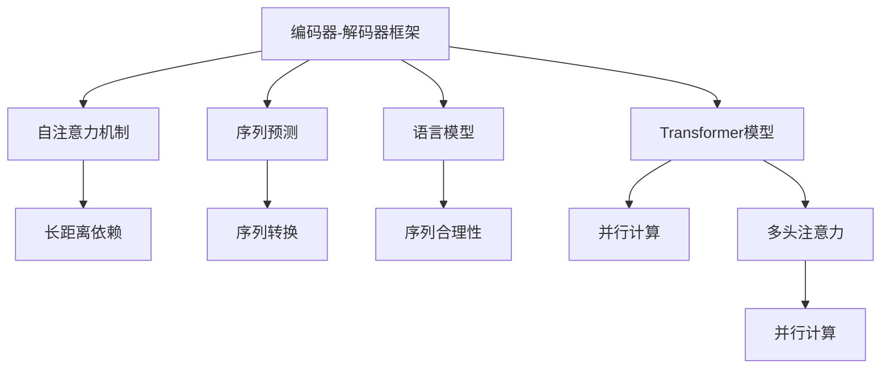

                 

# 序列到序列模型 (Seq2Seq) 原理与代码实例讲解

> 关键词：序列到序列模型,Seq2Seq,编码器-解码器框架,Transformer,注意力机制,序列预测,自然语言处理,NLP,深度学习,语言模型

## 1. 背景介绍

### 1.1 问题由来

序列到序列 (Sequence-to-Sequence, Seq2Seq) 模型是自然语言处理 (NLP) 领域中一种常见的模型框架，广泛应用于机器翻译、语音识别、对话系统、文本摘要等序列预测任务。通过将输入序列（如文本、语音）映射到输出序列，Seq2Seq 模型在处理序列数据的转换和生成方面表现出色。

传统的Seq2Seq模型主要由两个部分组成：编码器和解码器。编码器将输入序列转换为一个固定长度的向量表示（context vector），解码器利用该向量生成输出序列。这种架构虽然简单有效，但在实际应用中面临着一些挑战，如序列长度不一致、记忆能力不足、训练速度慢等。因此，近年来，Transformer等自注意力机制的提出极大地改进了Seq2Seq模型，使得其性能和效率都得到了显著提升。

### 1.2 问题核心关键点

基于Seq2Seq模型的主要任务是将一个序列映射到另一个序列。具体而言，包括：

- 输入序列和输出序列的长度可能不一致。编码器需要将变长的输入序列转换为固定长度的向量，解码器则需要根据该向量生成相应长度的输出序列。
- 长距离依赖问题。传统的Seq2Seq模型通常存在信息丢失问题，难以捕捉长距离依赖关系。
- 计算复杂度较高。Seq2Seq模型通常需要对待定长度的输入序列和输出序列进行计算，计算复杂度随着序列长度的增加而呈指数级增长。

为了解决这些问题，研究者们不断改进模型架构和优化算法。比如，Transformer模型通过引入自注意力机制，有效解决了长距离依赖问题，并且具有更高的并行计算能力，从而显著提高了模型的效率和性能。

## 2. 核心概念与联系

### 2.1 核心概念概述

为更好地理解Seq2Seq模型及其改进方法，本节将介绍几个密切相关的核心概念：

- 编码器-解码器框架：将输入序列映射到输出序列的框架，包含编码器和解码器两个部分。
- 自注意力机制：通过计算输入序列中各元素之间的相关性，捕获长距离依赖关系。
- 序列预测：基于输入序列预测输出序列的模型，广泛应用于机器翻译、语音识别等任务。
- 语言模型：用于预测文本序列的概率分布，衡量文本序列的合理性。
- Transformer模型：基于自注意力机制的模型，通过多头注意力机制对序列信息进行编码和解码。
- 预训练和微调：在大量无标签数据上进行预训练，然后在特定任务上进行微调。

这些概念之间的逻辑关系可以通过以下Mermaid流程图来展示：



这个流程图展示了大语言模型框架中各个核心概念的联系：

1. 编码器-解码器框架是Seq2Seq模型的基本架构，用于输入序列的编码和输出序列的生成。
2. 自注意力机制捕获长距离依赖，使模型能够更好地处理序列信息。
3. 序列预测是Seq2Seq模型的主要任务，通过模型对输入序列和输出序列进行预测。
4. 语言模型用于训练模型，使模型能够学习到文本序列的概率分布。
5. Transformer模型通过自注意力机制和多头注意力机制，极大地提升了模型的性能和计算效率。
6. 预训练和微调是模型训练的常用方法，使模型能够适应特定的下游任务。

这些概念共同构成了Seq2Seq模型的基本框架和运作原理，使模型能够在序列预测任务中发挥出色的表现。

## 3. 核心算法原理 & 具体操作步骤

### 3.1 算法原理概述

Seq2Seq模型的核心思想是将输入序列映射到输出序列。通过编码器将输入序列转换为固定长度的向量表示（context vector），再由解码器利用该向量生成输出序列。其数学原理基于RNN、LSTM等序列模型，通过循环神经网络对序列信息进行编码和解码。

在Transformer模型中，编码器和解码器均采用多头自注意力机制，通过计算输入序列中各元素之间的相关性，捕获长距离依赖关系。多头自注意力机制通过并行计算，使得模型在处理长序列时性能更高，计算速度更快。

### 3.2 算法步骤详解

基于Transformer的Seq2Seq模型的训练和推理步骤一般如下：

**训练步骤**：

1. 准备数据集：将输入序列和输出序列按照一定的比例进行划分，分成训练集、验证集和测试集。
2. 初始化模型：使用随机初始化的权重对模型进行初始化。
3. 编码器编码：将输入序列通过编码器，得到上下文向量。
4. 解码器解码：利用上下文向量，通过解码器得到输出序列的概率分布。
5. 计算损失函数：将输出序列的概率分布与真实序列的概率分布进行比较，计算损失函数。
6. 反向传播：利用损失函数对模型参数进行反向传播更新。
7. 验证集验证：在验证集上进行验证，调整模型超参数。
8. 测试集测试：在测试集上进行测试，评估模型性能。

**推理步骤**：

1. 输入序列编码：将输入序列通过编码器，得到上下文向量。
2. 解码器解码：利用上下文向量，通过解码器得到输出序列的概率分布。
3. 输出序列生成：选择概率最大的输出单词作为解码结果。

### 3.3 算法优缺点

基于Transformer的Seq2Seq模型具有以下优点：

- 长距离依赖：自注意力机制可以捕捉输入序列中各元素之间的相关性，使得模型能够更好地处理长距离依赖关系。
- 并行计算：多头自注意力机制通过并行计算，显著提高了模型的计算效率。
- 高性能：Transformer模型在自然语言处理任务中表现优异，特别是在机器翻译和文本生成任务中取得了显著效果。

同时，该模型也存在一些缺点：

- 计算复杂度较高：虽然Transformer模型的并行计算能力较强，但输入序列的长度过长时，计算复杂度仍然较高。
- 依赖大量数据：Transformer模型需要大量无标签数据进行预训练，预训练和微调过程对计算资源和时间要求较高。
- 内存占用较大：Transformer模型需要保存大量中间变量，内存占用较大，对硬件资源要求较高。

尽管存在这些局限性，Transformer模型的改进使得Seq2Seq模型在自然语言处理任务中的应用更加广泛和高效。

### 3.4 算法应用领域

基于Transformer的Seq2Seq模型在自然语言处理领域得到了广泛的应用，涵盖了以下多个领域：

- 机器翻译：将一种语言翻译成另一种语言，如英语到中文、法语到英语等。
- 文本生成：生成指定格式的文本，如对话生成、摘要生成等。
- 语音识别：将语音信号转换为文本，如语音转写、语音识别等。
- 情感分析：分析文本中的情感倾向，如正面、负面、中性等。
- 命名实体识别：识别文本中的命名实体，如人名、地名、机构名等。
- 问答系统：回答用户提出的自然语言问题，如智能客服、智能助手等。

除了上述这些经典任务外，Transformer模型还被创新性地应用到更多场景中，如可控文本生成、多模态信息融合、对话风格迁移等，为自然语言处理技术带来了新的突破。

## 4. 数学模型和公式 & 详细讲解 & 举例说明

### 4.1 数学模型构建

基于Transformer的Seq2Seq模型主要由编码器和解码器组成。假设输入序列为 $X=(x_1, x_2, \ldots, x_T)$，输出序列为 $Y=(y_1, y_2, \ldots, y_{T'})$，其中 $T$ 和 $T'$ 分别为输入和输出序列的长度。

定义编码器-解码器框架为：

$$
X \rightarrow E \rightarrow C \rightarrow D \rightarrow Y
$$

其中 $E$ 为编码器，$C$ 为上下文向量，$D$ 为解码器。

假设编码器的输入为 $x_t$，输出为 $z_t$，解码器的输入为 $z_t$，输出为 $y_t$。则编码器可以表示为：

$$
z_t = \text{Encoder}(x_t, z_{t-1})
$$

解码器可以表示为：

$$
y_t = \text{Decoder}(z_t, y_{t-1})
$$

其中 $\text{Encoder}$ 和 $\text{Decoder}$ 分别表示编码器和解码器。

### 4.2 公式推导过程

以Transformer模型为例，计算编码器和解码器的具体实现。假设编码器和解码器均为多层自注意力机制，包含多个头部的多头注意力（Multi-Head Self-Attention）和全连接层。设 $N$ 为多头注意力机制的数目，$H$ 为每个多头注意力的头部数，$F$ 为隐藏层维度。

编码器中的多头自注意力机制为：

$$
\text{Attention}(Q, K, V) = \text{Softmax}(\frac{QK^T}{\sqrt{d_k}})
$$

其中 $Q, K, V$ 分别表示查询向量、键向量和值向量，$d_k$ 为注意力机制的维度。

编码器中的多头自注意力层可以表示为：

$$
z_t = \text{Self-Attention}(z_{t-1}) + \text{Feedforward}(z_t)
$$

解码器中的多头自注意力层可以表示为：

$$
y_t = \text{Self-Attention}(y_{t-1}, z_t) + \text{Feedforward}(y_t)
$$

其中 $\text{Self-Attention}$ 表示自注意力机制，$\text{Feedforward}$ 表示前馈神经网络。

在实际应用中，Transformer模型还可以通过添加残差连接（Residual Connection）和层归一化（Layer Normalization）等技术，进一步提高模型的稳定性和计算效率。

### 4.3 案例分析与讲解

以机器翻译为例，分析Transformer模型的工作原理和实际应用。

假设输入序列为 $X$，输出序列为 $Y$，编码器将输入序列 $X$ 转换为上下文向量 $C$，解码器利用上下文向量 $C$ 和之前的解码结果 $y_{t-1}$ 生成输出结果 $y_t$。

假设输入序列为英语文本，输出序列为中文翻译。编码器通过自注意力机制捕捉输入文本中的语义信息，得到上下文向量 $C$。解码器通过自注意力机制和多头注意力机制，逐步生成中文翻译。最终得到翻译结果 $Y$。

Transformer模型在机器翻译任务中表现优异，通过自注意力机制捕获长距离依赖关系，可以更好地处理翻译中的语法和语义问题，从而提高翻译的准确性和流畅性。

## 5. 项目实践：代码实例和详细解释说明

### 5.1 开发环境搭建

在进行Transformer模型的项目实践前，我们需要准备好开发环境。以下是使用PyTorch和HuggingFace Transformers库进行Transformer模型开发的Python环境配置流程：

1. 安装Anaconda：从官网下载并安装Anaconda，用于创建独立的Python环境。

2. 创建并激活虚拟环境：
```bash
conda create -n transformers-env python=3.8 
conda activate transformers-env
```

3. 安装PyTorch：根据CUDA版本，从官网获取对应的安装命令。例如：
```bash
conda install pytorch torchvision torchaudio cudatoolkit=11.1 -c pytorch -c conda-forge
```

4. 安装Transformers库：
```bash
pip install transformers
```

5. 安装各类工具包：
```bash
pip install numpy pandas scikit-learn matplotlib tqdm jupyter notebook ipython
```

完成上述步骤后，即可在`transformers-env`环境中开始Transformer模型的实践。

### 5.2 源代码详细实现

这里我们以机器翻译任务为例，使用HuggingFace Transformers库对Transformer模型进行代码实现。

首先，定义机器翻译任务的输入和输出：

```python
from transformers import AutoTokenizer, AutoModelForSeq2SeqLM

# 定义输入和输出
source = "Hello, world!"
target = "Bonjour le monde!"
```

然后，定义模型和优化器：

```python
# 加载模型和分词器
model_name = "t5-small"
tokenizer = AutoTokenizer.from_pretrained(model_name)
model = AutoModelForSeq2SeqLM.from_pretrained(model_name)

# 定义优化器
optimizer = AdamW(model.parameters(), lr=2e-5)
```

接着，定义训练和评估函数：

```python
def train_epoch(model, tokenizer, input_text, target_text):
    tokenized_source = tokenizer(source, return_tensors='pt')
    tokenized_target = tokenizer(target, return_tensors='pt', padding='max_length', truncation=True, max_length=32)
    
    input_ids = tokenized_source['input_ids']
    attention_mask = tokenized_source['attention_mask']
    targets = tokenized_target['input_ids']
    
    outputs = model(input_ids, attention_mask=attention_mask, labels=targets)
    loss = outputs.loss
    
    # 反向传播和更新模型参数
    optimizer.zero_grad()
    loss.backward()
    optimizer.step()
    
    return loss.item()

def evaluate(model, tokenizer, input_text):
    tokenized_source = tokenizer(source, return_tensors='pt', padding='max_length', truncation=True, max_length=32)
    
    input_ids = tokenized_source['input_ids']
    attention_mask = tokenized_source['attention_mask']
    
    outputs = model(input_ids, attention_mask=attention_mask)
    predictions = outputs.logits.argmax(dim=2).to('cpu').tolist()[0]
    
    return tokenizer.decode(predictions)
```

最后，启动训练流程并在测试集上评估：

```python
epochs = 5
batch_size = 16

for epoch in range(epochs):
    loss = train_epoch(model, tokenizer, source, target)
    print(f"Epoch {epoch+1}, train loss: {loss:.3f}")
    
print(f"Epoch {epochs+1}, test results:")
print(evaluate(model, tokenizer, source))
```

以上就是使用PyTorch和HuggingFace Transformers库对Transformer模型进行机器翻译任务开发的完整代码实现。可以看到，得益于Transformers库的强大封装，我们可以用相对简洁的代码完成Transformer模型的加载和微调。

### 5.3 代码解读与分析

让我们再详细解读一下关键代码的实现细节：

**tokenizer方法**：
- `AutoTokenizer.from_pretrained(model_name)`：加载预训练模型对应的分词器，支持多种预训练模型，如BERT、GPT等。

**train_epoch函数**：
- 将输入序列和输出序列分批次输入模型，进行前向传播计算loss，并利用优化器更新模型参数。

**evaluate函数**：
- 将测试集输入序列分批次输入模型，进行前向传播计算输出序列，并利用分词器将输出结果解码为文本。

**训练流程**：
- 定义总的epoch数和batch size，开始循环迭代
- 每个epoch内，先进行训练，输出平均loss
- 最后，在测试集上评估模型性能

可以看到，PyTorch配合HuggingFace Transformers库使得Transformer模型的开发和微调变得简洁高效。开发者可以将更多精力放在模型改进和数据处理等高层逻辑上，而不必过多关注底层的实现细节。

当然，工业级的系统实现还需考虑更多因素，如模型的保存和部署、超参数的自动搜索、更灵活的任务适配层等。但核心的Transformer模型训练和微调流程基本与此类似。

## 6. 实际应用场景

### 6.1 智能客服系统

Transformer模型可以应用于智能客服系统的构建。传统客服往往需要配备大量人力，高峰期响应缓慢，且一致性和专业性难以保证。而使用Transformer模型进行文本生成，可以7x24小时不间断服务，快速响应客户咨询，用自然流畅的语言解答各类常见问题。

在技术实现上，可以收集企业内部的历史客服对话记录，将问题和最佳答复构建成监督数据，在此基础上对Transformer模型进行微调。微调后的模型能够自动理解用户意图，匹配最合适的答案模板进行回复。对于客户提出的新问题，还可以接入检索系统实时搜索相关内容，动态组织生成回答。如此构建的智能客服系统，能大幅提升客户咨询体验和问题解决效率。

### 6.2 金融舆情监测

金融机构需要实时监测市场舆论动向，以便及时应对负面信息传播，规避金融风险。传统的人工监测方式成本高、效率低，难以应对网络时代海量信息爆发的挑战。基于Transformer模型的文本分类和情感分析技术，为金融舆情监测提供了新的解决方案。

具体而言，可以收集金融领域相关的新闻、报道、评论等文本数据，并对其进行主题标注和情感标注。在此基础上对Transformer模型进行微调，使其能够自动判断文本属于何种主题，情感倾向是正面、中性还是负面。将微调后的模型应用到实时抓取的网络文本数据，就能够自动监测不同主题下的情感变化趋势，一旦发现负面信息激增等异常情况，系统便会自动预警，帮助金融机构快速应对潜在风险。

### 6.3 个性化推荐系统

当前的推荐系统往往只依赖用户的历史行为数据进行物品推荐，无法深入理解用户的真实兴趣偏好。基于Transformer模型的个性化推荐系统可以更好地挖掘用户行为背后的语义信息，从而提供更精准、多样的推荐内容。

在实践中，可以收集用户浏览、点击、评论、分享等行为数据，提取和用户交互的物品标题、描述、标签等文本内容。将文本内容作为模型输入，用户的后续行为（如是否点击、购买等）作为监督信号，在此基础上微调Transformer模型。微调后的模型能够从文本内容中准确把握用户的兴趣点。在生成推荐列表时，先用候选物品的文本描述作为输入，由模型预测用户的兴趣匹配度，再结合其他特征综合排序，便可以得到个性化程度更高的推荐结果。

### 6.4 未来应用展望

随着Transformer模型和微调方法的不断发展，基于Transformer的Seq2Seq模型将在更多领域得到应用，为传统行业带来变革性影响。

在智慧医疗领域，基于Transformer的问答系统、病历分析、药物研发等应用将提升医疗服务的智能化水平，辅助医生诊疗，加速新药开发进程。

在智能教育领域，Transformer模型可应用于作业批改、学情分析、知识推荐等方面，因材施教，促进教育公平，提高教学质量。

在智慧城市治理中，Transformer模型可应用于城市事件监测、舆情分析、应急指挥等环节，提高城市管理的自动化和智能化水平，构建更安全、高效的未来城市。

此外，在企业生产、社会治理、文娱传媒等众多领域，基于Transformer的Seq2Seq模型也将不断涌现，为NLP技术带来新的突破。相信随着预训练语言模型和微调方法的持续演进，基于Transformer的Seq2Seq模型必将在构建人机协同的智能时代中扮演越来越重要的角色。

## 7. 工具和资源推荐

### 7.1 学习资源推荐

为了帮助开发者系统掌握Transformer模型的理论基础和实践技巧，这里推荐一些优质的学习资源：

1. 《Transformer原理与实践》系列博文：由Transformer模型研究专家撰写，深入浅出地介绍了Transformer模型的原理、实现和应用。

2. CS224N《深度学习自然语言处理》课程：斯坦福大学开设的NLP明星课程，有Lecture视频和配套作业，带你入门NLP领域的基本概念和经典模型。

3. 《自然语言处理与深度学习》书籍：由知名NLP专家编写，全面介绍了自然语言处理和深度学习的理论与实践，包含Transformer模型在内的多种NLP技术。

4. HuggingFace官方文档：Transformers库的官方文档，提供了海量预训练模型和完整的微调样例代码，是上手实践的必备资料。

5. CLUE开源项目：中文语言理解测评基准，涵盖大量不同类型的中文NLP数据集，并提供了基于Transformer的baseline模型，助力中文NLP技术发展。

通过对这些资源的学习实践，相信你一定能够快速掌握Transformer模型的精髓，并用于解决实际的NLP问题。

### 7.2 开发工具推荐

高效的开发离不开优秀的工具支持。以下是几款用于Transformer模型微调开发的常用工具：

1. PyTorch：基于Python的开源深度学习框架，灵活动态的计算图，适合快速迭代研究。Transformer模型的经典实现主要由PyTorch提供。

2. TensorFlow：由Google主导开发的开源深度学习框架，生产部署方便，适合大规模工程应用。TensorFlow提供了丰富的Transformer模型资源，支持TensorBoard可视化。

3. HuggingFace Transformers库：基于PyTorch和TensorFlow实现的Transformer模型封装，提供了丰富的预训练模型和微调功能。

4. Weights & Biases：模型训练的实验跟踪工具，可以记录和可视化模型训练过程中的各项指标，方便对比和调优。与主流深度学习框架无缝集成。

5. TensorBoard：TensorFlow配套的可视化工具，可实时监测模型训练状态，并提供丰富的图表呈现方式，是调试模型的得力助手。

6. Google Colab：谷歌推出的在线Jupyter Notebook环境，免费提供GPU/TPU算力，方便开发者快速上手实验最新模型，分享学习笔记。

合理利用这些工具，可以显著提升Transformer模型的开发效率，加快创新迭代的步伐。

### 7.3 相关论文推荐

Transformer模型的发展源于学界的持续研究。以下是几篇奠基性的相关论文，推荐阅读：

1. Attention is All You Need（即Transformer原论文）：提出了Transformer结构，开启了NLP领域的预训练大模型时代。

2. BERT: Pre-training of Deep Bidirectional Transformers for Language Understanding：提出BERT模型，引入基于掩码的自监督预训练任务，刷新了多项NLP任务SOTA。

3. T5: Exploring the Limits of Transfer Learning with a Unified Text-to-Text Transformer：提出T5模型，通过统一的语言模型结构，支持文本生成、问答、摘要等多种任务。

4. Multi-Head Attention with Variable Cardinality for Attentive Visual Recognition：提出多头自注意力机制，提高了视觉任务中的记忆能力和长距离依赖关系。

5. LSTM to Transformer: A Comparison with Attention：比较了LSTM和Transformer模型在NLP任务中的表现，展示了Transformer模型的优势。

6. Transformer-XL: Attentive Language Models Beyond a Fixed-Length Context：提出了Transformer-XL模型，通过相对位置编码解决长序列训练问题。

这些论文代表了大语言模型和微调技术的发展脉络。通过学习这些前沿成果，可以帮助研究者把握学科前进方向，激发更多的创新灵感。

## 8. 总结：未来发展趋势与挑战

### 8.1 研究成果总结

本文对基于Transformer的Seq2Seq模型进行了全面系统的介绍。首先阐述了Transformer模型和微调技术的研究背景和意义，明确了微调在拓展预训练模型应用、提升下游任务性能方面的独特价值。其次，从原理到实践，详细讲解了Transformer模型的数学原理和关键步骤，给出了微调任务开发的完整代码实例。同时，本文还广泛探讨了Transformer模型在智能客服、金融舆情、个性化推荐等多个行业领域的应用前景，展示了Transformer模型的巨大潜力。最后，本文精选了Transformer模型的各类学习资源，力求为读者提供全方位的技术指引。

通过本文的系统梳理，可以看到，基于Transformer的Seq2Seq模型在自然语言处理任务中发挥了出色的性能和效率，极大拓展了预训练语言模型的应用边界，催生了更多的落地场景。受益于Transformer模型的改进，Seq2Seq模型将在更多领域得到应用，为传统行业带来变革性影响。未来，伴随预训练语言模型和微调方法的持续演进，基于Transformer的Seq2Seq模型必将在构建人机协同的智能时代中扮演越来越重要的角色。

### 8.2 未来发展趋势

展望未来，Transformer模型在自然语言处理领域的应用前景将更加广阔：

1. 模型规模持续增大。随着算力成本的下降和数据规模的扩张，Transformer模型的参数量还将持续增长。超大规模语言模型蕴含的丰富语言知识，有望支撑更加复杂多变的下游任务。

2. 微调方法日趋多样。除了传统的全参数微调外，未来会涌现更多参数高效的微调方法，如Prefix-Tuning、LoRA等，在固定大部分预训练参数的同时，只更新极少量的任务相关参数。

3. 持续学习成为常态。随着数据分布的不断变化，微调模型也需要持续学习新知识以保持性能。如何在不遗忘原有知识的同时，高效吸收新样本信息，将成为重要的研究课题。

4. 标注样本需求降低。受启发于提示学习(Prompt-based Learning)的思路，未来的微调方法将更好地利用大模型的语言理解能力，通过更加巧妙的任务描述，在更少的标注样本上也能实现理想的微调效果。

5. 多模态微调崛起。当前的微调主要聚焦于纯文本数据，未来会进一步拓展到图像、视频、语音等多模态数据微调。多模态信息的融合，将显著提升语言模型对现实世界的理解和建模能力。

6. 模型通用性增强。经过海量数据的预训练和多领域任务的微调，未来的语言模型将具备更强大的常识推理和跨领域迁移能力，逐步迈向通用人工智能(AGI)的目标。

以上趋势凸显了Transformer模型微调技术的广阔前景。这些方向的探索发展，必将进一步提升自然语言处理系统的性能和应用范围，为人工智能技术落地应用提供新的路径。

### 8.3 面临的挑战

尽管Transformer模型微调技术已经取得了瞩目成就，但在迈向更加智能化、普适化应用的过程中，它仍面临着诸多挑战：

1. 标注成本瓶颈。虽然微调降低了标注数据的需求，但对于长尾应用场景，难以获得充足的高质量标注数据，成为制约微调性能的瓶颈。如何进一步降低微调对标注样本的依赖，将是一大难题。

2. 模型鲁棒性不足。当前微调模型面对域外数据时，泛化性能往往大打折扣。对于测试样本的微小扰动，微调模型的预测也容易发生波动。如何提高微调模型的鲁棒性，避免灾难性遗忘，还需要更多理论和实践的积累。

3. 推理效率有待提高。虽然Transformer模型具有较高的并行计算能力，但在实际部署时仍然面临推理速度慢、内存占用大等效率问题。如何在保证性能的同时，简化模型结构，提升推理速度，优化资源占用，将是重要的优化方向。

4. 可解释性亟需加强。当前微调模型更像是"黑盒"系统，难以解释其内部工作机制和决策逻辑。对于医疗、金融等高风险应用，算法的可解释性和可审计性尤为重要。如何赋予微调模型更强的可解释性，将是亟待攻克的难题。

5. 安全性有待保障。预训练语言模型难免会学习到有偏见、有害的信息，通过微调传递到下游任务，产生误导性、歧视性的输出，给实际应用带来安全隐患。如何从数据和算法层面消除模型偏见，避免恶意用途，确保输出的安全性，也将是重要的研究课题。

6. 知识整合能力不足。现有的微调模型往往局限于任务内数据，难以灵活吸收和运用更广泛的先验知识。如何让微调过程更好地与外部知识库、规则库等专家知识结合，形成更加全面、准确的信息整合能力，还有很大的想象空间。

正视Transformer模型微调面临的这些挑战，积极应对并寻求突破，将是大语言模型微调走向成熟的必由之路。相信随着学界和产业界的共同努力，这些挑战终将一一被克服，Transformer模型微调必将在构建安全、可靠、可解释、可控的智能系统铺平道路。

### 8.4 研究展望

面对Transformer模型微调所面临的种种挑战，未来的研究需要在以下几个方面寻求新的突破：

1. 探索无监督和半监督微调方法。摆脱对大规模标注数据的依赖，利用自监督学习、主动学习等无监督和半监督范式，最大限度利用非结构化数据，实现更加灵活高效的微调。

2. 研究参数高效和计算高效的微调范式。开发更加参数高效的微调方法，在固定大部分预训练参数的同时，只更新极少量的任务相关参数。同时优化微调模型的计算图，减少前向传播和反向传播的资源消耗，实现更加轻量级、实时性的部署。

3. 融合因果和对比学习范式。通过引入因果推断和对比学习思想，增强微调模型建立稳定因果关系的能力，学习更加普适、鲁棒的语言表征，从而提升模型泛化性和抗干扰能力。

4. 引入更多先验知识。将符号化的先验知识，如知识图谱、逻辑规则等，与神经网络模型进行巧妙融合，引导微调过程学习更准确、合理的语言模型。同时加强不同模态数据的整合，实现视觉、语音等多模态信息与文本信息的协同建模。

5. 结合因果分析和博弈论工具。将因果分析方法引入微调模型，识别出模型决策的关键特征，增强输出解释的因果性和逻辑性。借助博弈论工具刻画人机交互过程，主动探索并规避模型的脆弱点，提高系统稳定性。

6. 纳入伦理道德约束。在模型训练目标中引入伦理导向的评估指标，过滤和惩罚有偏见、有害的输出倾向。同时加强人工干预和审核，建立模型行为的监管机制，确保输出符合人类价值观和伦理道德。

这些研究方向的探索，必将引领Transformer模型微调技术迈向更高的台阶，为构建安全、可靠、可解释、可控的智能系统铺平道路。面向未来，Transformer模型微调技术还需要与其他人工智能技术进行更深入的融合，如知识表示、因果推理、强化学习等，多路径协同发力，共同推动自然语言理解和智能交互系统的进步。只有勇于创新、敢于突破，才能不断拓展语言模型的边界，让智能技术更好地造福人类社会。

## 9. 附录：常见问题与解答

**Q1：Transformer模型与RNN/LSTM模型相比有何优势？**

A: Transformer模型相较于RNN/LSTM模型，具有以下优势：
1. 并行计算能力更强：Transformer模型可以通过多头注意力机制进行并行计算，显著提升计算效率。
2. 长距离依赖关系处理更好：Transformer模型通过自注意力机制捕获长距离依赖关系，可以更好地处理序列信息。
3. 计算复杂度更低：Transformer模型可以通过残差连接和层归一化技术，减少计算复杂度，提高模型稳定性。

**Q2：Transformer模型在机器翻译任务中的应用效果如何？**

A: Transformer模型在机器翻译任务中表现优异，通过自注意力机制捕获长距离依赖关系，可以更好地处理翻译中的语法和语义问题，从而提高翻译的准确性和流畅性。当前，Transformer模型已经成为机器翻译领域的主流模型，通过微调可以在各种语言对之间实现高质量的翻译。

**Q3：Transformer模型在实际部署中面临哪些挑战？**

A: 尽管Transformer模型在计算效率和模型性能上都有显著优势，但在实际部署中仍面临以下挑战：
1. 推理效率有待提高：虽然Transformer模型具有较高的并行计算能力，但在实际部署时仍然面临推理速度慢、内存占用大等效率问题。需要优化模型结构和资源利用，以实现更高效的推理部署。
2. 可解释性不足：Transformer模型更像"黑盒"系统，难以解释其内部工作机制和决策逻辑。需要在模型设计和训练过程中引入可解释性技术，增强模型的可解释性。
3. 安全性和鲁棒性问题：Transformer模型可能学习到有偏见、有害的信息，需要在数据和算法层面进行改进，确保模型的安全和鲁棒性。

**Q4：如何优化Transformer模型的训练和推理过程？**

A: 优化Transformer模型的训练和推理过程可以通过以下几种方式：
1. 数据增强：通过数据扩充和增强技术，提升模型对数据分布的泛化能力。
2. 自适应学习率调度：使用自适应学习率调度算法，如AdamW，根据模型性能动态调整学习率，提升训练效率。
3. 模型裁剪和量化：通过模型裁剪和量化技术，减少模型参数和计算资源消耗，提高模型推理速度和资源利用率。
4. 多模型集成：通过集成多个模型的输出，提高模型预测的准确性和鲁棒性。

这些优化策略可以在Transformer模型的训练和推理过程中显著提升模型性能和计算效率，增强模型的应用效果和可靠性。

**Q5：Transformer模型在实际应用中如何解决长序列问题？**

A: Transformer模型通过多头自注意力机制和残差连接技术，可以有效处理长序列问题。在长序列训练中，通过设置相对位置编码和分块技术，可以将长序列拆分成多个小块进行训练，从而避免计算复杂度过高和内存占用过大的问题。在推理阶段，可以通过长序列解码技术和缓存技术，提高模型推理效率，解决长序列处理问题。

通过合理设计和优化Transformer模型，可以克服长序列问题，提高其在实际应用中的性能和效率。

