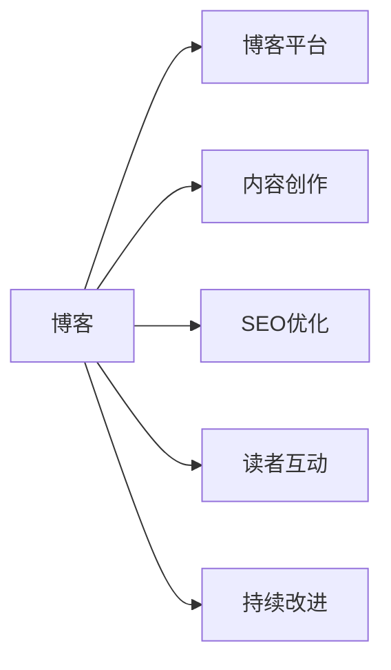

                 

## 1. 背景介绍

### 1.1 问题由来

在快速发展的技术浪潮中，专业博客成为分享知识、交流思想的重要平台。无论是初入行领域的初学者，还是经验丰富的技术专家，都能通过博客将深层次的思考、创新的见解传达给广大读者。特别是在计算机领域，博客不仅是展示个人能力的方式，更是推动技术进步、引领行业发展的关键途径。

### 1.2 问题核心关键点

在创建和维护专业博客的过程中，技术专家需注意以下核心问题：

- **内容定位**：确定博客的主题和目标读者，选择与自己专业领域匹配的内容形式。
- **写作风格**：形成清晰、准确、深入浅出的写作风格，便于读者理解。
- **结构布局**：利用逻辑严密的章节结构，帮助读者更好地跟随思路。
- **技术细节**：在深度分享技术的同时，注意揭示其实现原理和应用背景。
- **跨领域交流**：结合其他领域知识，展示技术的多样性应用。
- **持续更新**：定期更新博客内容，保持技术的前沿性。

本文将围绕以上核心关键点，系统介绍建立专业博客的方法和技巧，希望帮助技术专家深入挖掘和传达自己的知识见解。

## 2. 核心概念与联系

### 2.1 核心概念概述

创建专业博客需明确的核心概念包括：

- **博客**：技术专家通过互联网平台发布的专业文章集合，是知识分享的重要形式。
- **博客平台**：如WordPress、Medium、CSDN等，提供内容发布和传播的环境。
- **内容创作**：包括文章撰写、图片制作、视频录制等，是博客内容的主要来源。
- **SEO优化**：通过关键词、标签等策略，提高博客的搜索排名。
- **读者互动**：通过评论、社交媒体分享等形式，增加博客的曝光度和参与度。
- **持续改进**：根据反馈和数据统计，不断优化博客内容和呈现形式。

这些概念间的关系可以通过以下Mermaid流程图来表示：

这个流程图展示了博客创建的流程及其关键环节。

## 3. 核心算法原理 & 具体操作步骤

### 3.1 算法原理概述

创建专业博客的核心算法原理主要包括以下几个方面：

- **选题与规划**：根据自身的技术专长和市场需求，选择合适的主题和内容形式。
- **内容生成**：利用文本生成技术，自动化地产生高质量博客内容。
- **SEO优化**：利用搜索引擎优化技术，提高博客的可见性和用户参与度。
- **读者互动**：通过社交媒体、评论区等渠道，与读者进行互动，收集反馈。
- **持续改进**：基于反馈和数据分析，持续优化博客内容和呈现方式。

### 3.2 算法步骤详解

以下是创建专业博客的详细操作步骤：

**Step 1: 选题与规划**

1. **主题选择**：根据自己的技术专长、市场需求和兴趣选择主题，如机器学习、深度学习、自然语言处理等。
2. **内容形式确定**：选择合适的内容形式，如技术文章、项目实战、研究报告等。
3. **发布计划**：制定博客发布计划，包括每周或每月的更新频率、文章主题等。

**Step 2: 内容创作**

1. **文章撰写**：利用代码编辑器、Markdown等工具，撰写文章草稿。
2. **内容编辑**：使用图片编辑工具，制作高质量的图表、代码示例等。
3. **视频录制**：录制技术讲解视频，配合文章进行传播。

**Step 3: SEO优化**

1. **关键词选择**：在文章标题、副标题和内容中嵌入相关关键词。
2. **元数据优化**：设置合适的标题、描述、标签等，增加博客的搜索排名。
3. **链接策略**：在文章中加入相关博客或项目的链接，增加网站的权重。

**Step 4: 读者互动**

1. **评论区管理**：及时回复读者的评论，增加互动性。
2. **社交媒体分享**：在社交媒体平台上发布文章摘要，增加曝光度。
3. **读者调查**：通过问卷调查，收集读者对文章内容、形式等的反馈。

**Step 5: 持续改进**

1. **数据分析**：利用网站统计工具，分析访问量、停留时间等指标。
2. **内容优化**：根据数据分析结果，优化文章结构和内容形式。
3. **反馈整合**：整合读者的反馈，进一步改进博客内容和风格。

### 3.3 算法优缺点

创建专业博客的主要优点包括：

- **知识共享**：通过博客平台，将个人知识和见解分享给更多读者，促进技术交流。
- **专业展示**：展示技术专长和创新能力，提升个人品牌价值。
- **读者互动**：通过评论、社交媒体等方式，与读者建立互动，收集反馈。
- **持续改进**：利用数据分析和读者反馈，不断优化博客内容和形式。

缺点主要包括：

- **时间和精力投入**：内容创作、SEO优化、互动维护都需要大量时间和精力。
- **博客平台选择**：选择合适的博客平台，满足个人需求和访问量要求。
- **内容质量控制**：确保文章的技术深度和准确性，避免误导读者。
- **持续更新**：需定期更新博客内容，保持技术的前沿性。

## 4. 数学模型和公式 & 详细讲解 & 举例说明

### 4.1 数学模型构建

博客文章的结构可以通过数学模型来建模。假设博客文章由标题、副标题、正文和参考文献构成，可以将其表示为一个有序对：

\[
A = (T, B, P, R)
\]

其中：
- \(T\)：文章标题
- \(B\)：副标题列表
- \(P\)：正文内容
- \(R\)：参考文献列表

### 4.2 公式推导过程

博客文章内容的生成可以视为一个文本生成过程。假设博客文章的生成过程可以表示为一个马尔可夫模型：

\[
P(A) = \prod_{i=1}^{n} P(A_i | A_{i-1})
\]

其中 \(A_i\) 表示文章中的第 \(i\) 个词或句子，\(P(A_i | A_{i-1})\) 表示在给定前文 \(A_{i-1}\) 的情况下，生成 \(A_i\) 的概率。

### 4.3 案例分析与讲解

以一篇关于深度学习优化算法的博客为例，分析其内容的生成过程：

- **标题**：选择具有吸引力的标题，如“深度学习优化算法详解：Adam、Adagrad、SGD”。
- **副标题**：设置分节内容，如“什么是优化算法？”、“Adam算法原理与实现”、“优缺点对比”等。
- **正文**：详细解释每种算法的基本原理、优缺点、实际应用场景等。
- **参考文献**：列出引用的文献和资源链接。

## 5. 项目实践：代码实例和详细解释说明

### 5.1 开发环境搭建

在开始博客创建之前，需搭建合适的开发环境。以下是一个典型的开发环境配置示例：

1. **安装编辑器**：如Visual Studio Code、Atom等，支持Markdown和HTML编辑。
2. **安装Markdown编辑器插件**：如Markdown All in One、Markdown Editor等，便于自动生成Markdown格式内容。
3. **配置博客平台**：选择WordPress、Medium、CSDN等平台，并注册账号。

### 5.2 源代码详细实现

以下是一个基于WordPress平台的博客创建示例：

1. **安装WordPress**：在WordPress官网上下载最新版本的WordPress，并上传到服务器。
2. **数据库配置**：在数据库中创建名为`wp`的数据库，并导入`wp-config.sql`文件。
3. **配置站点**：通过`wp-admin`后台，设置站点名称、网址、管理员用户名和密码等。

### 5.3 代码解读与分析

利用WordPress后台，可以很方便地创建和管理博客文章。以下是一些关键步骤的代码解读：

**创建文章**

1. **登录后台**：输入管理员用户名和密码，进入`wp-admin`页面。
2. **新建文章**：点击“文章”，选择“新建”，填写文章标题、正文等，并设置分类、标签等。
3. **发布文章**：填写完毕后，点击“发布”按钮，文章即发布到博客平台。

**文章编辑**

1. **编辑模式**：选择已发布的文章，进入编辑模式。
2. **内容修改**：修改文章的标题、正文、图片等，预览效果。
3. **保存发布**：点击“更新”或“发布”按钮，完成文章更新。

### 5.4 运行结果展示

通过WordPress后台，可以实时查看文章的访问量、评论、分享等数据。以下是一个典型的数据展示：

- **访问量**：展示文章的浏览次数。
- **评论数**：展示文章的评论数量。
- **分享数**：展示文章在社交媒体上的分享次数。

## 6. 实际应用场景

### 6.1 专业博客在技术分享中的应用

专业博客在技术分享中发挥着重要作用：

- **技术交流**：通过博客分享技术文章，促进跨地域、跨行业的技术交流。
- **经验总结**：总结项目经验和技术心得，帮助读者避免重复犯错。
- **问题解答**：回答读者的技术问题，提供解决方案。
- **知识传播**：将复杂的概念和算法解释得通俗易懂，使更多人受益。

### 6.2 博客在教育培训中的应用

博客在教育培训中同样重要：

- **在线教育**：通过博客发布课程讲义、视频教程等，进行在线教育。
- **学习资源共享**：分享编程练习、项目案例、学习资源等，帮助读者提升技能。
- **互动讨论**：利用评论区，与读者进行互动，解答学习中的疑问。
- **知识体系构建**：通过系统化地发布文章，构建完整的知识体系。

### 6.3 博客在企业内部的应用

博客在企业内部也具有重要价值：

- **技术推广**：通过博客推广新技术和产品，增强员工的了解和接受度。
- **知识管理**：将企业的技术文档、最佳实践等发布在博客上，形成知识库。
- **文化建设**：通过博客展示企业的文化和技术氛围，吸引优秀人才。
- **内部交流**：利用博客平台，促进企业内部技术交流和合作。

### 6.4 未来应用展望

未来，专业博客在技术分享和教育培训中的应用将更加广泛：

- **交互式博客**：利用AI技术，提供交互式博客体验，如自然语言问答、代码高亮等。
- **视频博客**：结合视频内容，增加博客的生动性和互动性。
- **多平台发布**：通过跨平台发布，提高博客的曝光度和读者覆盖面。
- **个性化推荐**：利用推荐系统，提供个性化的博客推荐，提升读者体验。

## 7. 工具和资源推荐

### 7.1 学习资源推荐

以下是一些优质的学习资源，推荐用于创建和维护专业博客：

1. **博客技术书籍**：如《博客技术解析》、《博客设计与开发》等，详细介绍了博客的搭建和优化。
2. **在线课程**：如Udemy上的《WordPress开发与设计》、Coursera上的《网站开发》等，帮助学习博客开发和SEO优化。
3. **技术社区**：如Stack Overflow、GitHub等，可以获取博客开发和维护的社区支持和资源共享。
4. **博客工具**：如WordPress插件、Markdown编辑器等，提升博客创建和编辑效率。
5. **SEO工具**：如Google Analytics、SEMrush等，优化博客的搜索引擎排名。

### 7.2 开发工具推荐

以下是一些推荐的博客开发工具，可以帮助创建和管理博客：

1. **Markdown编辑器**：如Visual Studio Code、Atom等，支持Markdown语法。
2. **博客平台**：如WordPress、Medium、CSDN等，提供完善的博客发布和管理功能。
3. **SEO优化工具**：如Google Analytics、SEMrush等，帮助优化博客的搜索引擎排名。
4. **网站统计工具**：如Google Analytics、Piwik等，分析博客访问量和用户行为。
5. **社交媒体管理工具**：如Buffer、Hootsuite等，管理博客在社交媒体上的发布和互动。

### 7.3 相关论文推荐

以下几篇论文为博客技术的发展提供了重要参考：

1. **博客技术发展趋势**：探讨博客技术的发展历程和未来方向，如《博客技术演进与未来展望》。
2. **SEO优化技术**：详细介绍了搜索引擎优化的技术和策略，如《博客SEO优化指南》。
3. **内容创作技术**：分享内容创作的技术和工具，如《高效内容创作技术》。
4. **读者互动技术**：探讨如何增强读者互动，提升用户参与度，如《增强博客互动的技术与实践》。
5. **数据分析技术**：分享数据分析的方法和工具，如《博客数据分析与优化》。

## 8. 总结：未来发展趋势与挑战

### 8.1 总结

本文系统介绍了创建专业博客的方法和技巧，涵盖选题与规划、内容创作、SEO优化、读者互动和持续改进等方面。通过深入探讨博客创建的核心概念和关键步骤，帮助技术专家建立高质量、有影响力的专业博客。

### 8.2 未来发展趋势

博客技术将持续发展，呈现以下趋势：

- **多样化内容形式**：博客将结合视频、音频等多种形式，丰富内容展示方式。
- **个性化推荐系统**：通过AI技术，提供个性化的博客推荐，提升用户阅读体验。
- **智能互动功能**：利用自然语言处理技术，增强博客的互动性，如自然语言问答、自动翻译等。
- **实时数据分析**：利用实时数据分析工具，优化博客内容和呈现方式，提升用户参与度。

### 8.3 面临的挑战

博客创建和维护过程中仍面临一些挑战：

- **内容质量控制**：确保博客文章的技术深度和准确性，避免误导读者。
- **SEO优化难度**：提升博客的搜索引擎排名，需要持续的努力和优化。
- **读者互动管理**：有效管理读者的评论和反馈，维护良好的互动氛围。
- **持续更新维护**：保持博客内容的前沿性和时效性，需要大量时间和精力。

### 8.4 研究展望

未来，博客技术的优化和创新将有助于解决上述挑战，带来更多的机遇：

- **自动化内容生成**：利用AI技术，自动生成高质量的博客内容。
- **跨平台内容传播**：利用跨平台发布，扩大博客的覆盖面和影响力。
- **实时互动技术**：利用实时互动技术，提升博客的用户参与度和互动性。
- **数据驱动优化**：利用大数据和机器学习，优化博客内容和形式，提升用户体验。

## 9. 附录：常见问题与解答

**Q1：如何选择合适的博客平台？**

A: 选择博客平台时，需考虑以下因素：
1. **功能和易用性**：平台功能是否完备，是否易于使用和维护。
2. **社区支持**：是否有活跃的开发者和用户社区，提供技术支持和资源共享。
3. **性能和扩展性**：平台性能是否稳定，是否能支持未来的扩展需求。
4. **成本和资源**：平台的费用和资源需求是否符合预算和需求。

**Q2：如何提升博客的搜索引擎排名？**

A: 提升博客搜索引擎排名的方法包括：
1. **关键词优化**：在文章标题、副标题和正文中嵌入相关关键词。
2. **内容质量**：确保文章的技术深度和准确性，避免抄袭和低质量内容。
3. **元数据优化**：设置合适的标题、描述、标签等，增加博客的搜索排名。
4. **内部链接**：在文章中加入内部链接，增加网站的权重。
5. **外部链接**：在文章中加入外部链接，增加网站的权威性。

**Q3：如何管理读者的评论？**

A: 管理读者评论的方法包括：
1. **及时回复**：及时回复读者的评论，增加互动性。
2. **内容筛选**：利用评论筛选工具，过滤掉低质量或有害评论。
3. **社区管理**：建立博客社区，增加读者的归属感和互动性。
4. **评论积分**：利用积分系统，激励读者参与评论和互动。

**Q4：如何优化博客内容？**

A: 优化博客内容的方法包括：
1. **数据分析**：利用网站统计工具，分析访问量、停留时间等指标，了解用户偏好。
2. **内容更新**：根据数据分析结果，更新和补充内容，保持博客的时效性。
3. **交互式内容**：利用交互式技术，增加博客的互动性和趣味性。
4. **多媒体内容**：结合视频、音频等多种形式，丰富博客内容展示方式。

**Q5：如何保持博客内容的前沿性？**

A: 保持博客内容前沿性的方法包括：
1. **持续学习**：不断学习最新的技术和趋势，更新博客内容。
2. **技术交流**：参与技术社区和会议，获取最新的技术动态和资源。
3. **合作发布**：与技术专家或企业合作，发布最新的技术文章和项目案例。
4. **读者反馈**：通过读者反馈，了解读者需求，更新博客内容。

---

作者：禅与计算机程序设计艺术 / Zen and the Art of Computer Programming

