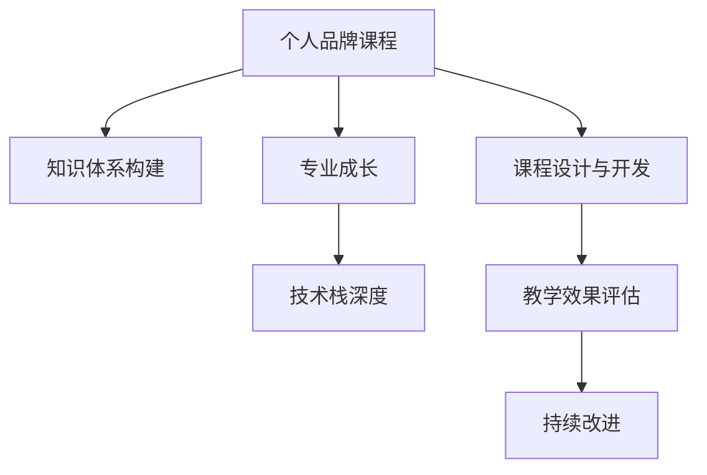

                 

# 开发个人品牌课程：系统化你的知识体系

> 关键词：个人品牌课程, 知识体系构建, 专业成长, 技术栈深度, 课程设计与开发, 教学效果评估

## 1. 背景介绍

### 1.1 问题由来
在信息爆炸的互联网时代，个人知识价值变得越来越重要。无论是IT从业者还是其他行业人士，建立一个个人品牌，不断更新和优化知识体系，都是提升个人市场竞争力的关键。然而，许多人在追求个人品牌的过程中，往往面临以下几个问题：

- **知识碎片化**：缺乏系统化的学习路径，导致知识难以连贯，无法形成整体能力。
- **时间管理**：工作繁忙、生活压力大，难以有效安排时间进行系统学习。
- **内容质量参差不齐**：市面上的课程质量良莠不齐，难以选择出真正有价值的资源。
- **学习效果难以衡量**：缺乏系统评估机制，无法判断学习效果和进步空间。

因此，系统化构建个人知识体系，成为提升个人品牌价值的关键路径。

### 1.2 问题核心关键点
要系统化构建个人知识体系，需要明确以下核心关键点：

- **明确学习目标**：确定你希望在哪个领域成为专家，并了解该领域的核心知识体系。
- **制定学习计划**：根据学习目标，制定详细的学习路线图，合理安排学习时间。
- **选择合适的学习资源**：包括书籍、课程、视频、博客等，选择高质量的学习材料。
- **实施学习策略**：如POMODORO时间管理法、费曼学习法等，提升学习效率。
- **评估学习效果**：设置评估标准，如实践项目、社区反馈、考试成绩等，持续改进学习过程。

### 1.3 问题研究意义
系统化构建个人知识体系，对于提升个人职业竞争力、拓展职业机会、实现自我价值具有重要意义：

- **提升专业水平**：通过系统学习，掌握深度专业技能，成为行业专家。
- **增加市场价值**：个人品牌知名度的提升，带来更多的职业机会和商业价值。
- **实现自我成长**：系统化的学习过程，有助于自我反思和持续改进，实现全面发展。
- **促进教育创新**：将个人品牌课程系统化，为更多人提供高效的学习路径，推动教育创新。

## 2. 核心概念与联系

### 2.1 核心概念概述

为更好地理解系统化构建个人知识体系的过程，本节将介绍几个核心概念及其联系：

- **个人品牌课程（Personal Branding Course）**：指针对个人特定领域知识的系统化课程设计，旨在提升个人专业水平和市场竞争力。
- **知识体系构建（Knowledge System Construction）**：指通过系统学习，构建一个结构化的知识框架，涵盖从基础到高级的各类知识模块。
- **专业成长（Professional Growth）**：指通过不断学习、实践和反馈，提升个人在某一领域的专业技能和市场影响力。
- **技术栈深度（Technical Stack Depth）**：指在特定技术领域内，掌握深度知识的能力，包括算法、架构、工具等方面的深入理解。
- **课程设计与开发（Course Design and Development）**：指课程内容的规划、组织和教学实施，是构建个人品牌课程的核心环节。
- **教学效果评估（Teaching Effectiveness Evaluation）**：指对个人品牌课程教学效果的系统评估，确保课程能够真正帮助学员提升知识水平。

这些概念之间的逻辑关系可以通过以下Mermaid流程图来展示：



这个流程图展示了一个完整的个人品牌课程开发流程及其关键环节：

1. 从个人品牌课程出发，构建知识体系。
2. 通过知识体系构建，实现专业成长。
3. 专业成长提升技术栈深度。
4. 课程设计与开发是关键环节。
5. 教学效果评估提供持续改进的反馈。

这些概念共同构成了个人品牌课程开发的系统框架，指导个人在特定领域不断精进，实现自我突破。

## 3. 核心算法原理 & 具体操作步骤
### 3.1 算法原理概述

系统化构建个人知识体系的核心算法原理，在于构建一个结构化的知识图谱，通过系统学习、实践和反馈，不断迭代优化个人知识体系。具体而言，该过程可以概括为以下几个步骤：

1. **目标设定**：明确学习目标，确定希望掌握的知识点和技术栈。
2. **知识梳理**：基于目标，梳理出需要掌握的基础知识、核心技能和高级技巧。
3. **资源整合**：选择合适的学习资源，如书籍、课程、实践项目等，整合为一个系统的学习路径。
4. **学习实施**：按照规划的时间表，进行系统学习，包括阅读、实践、项目开发等。
5. **效果评估**：设置评估标准，通过项目展示、社区反馈、考试成绩等方式，评估学习效果。
6. **反馈改进**：根据评估结果，调整学习策略和资源，进一步优化知识体系。

### 3.2 算法步骤详解

下面是系统化构建个人知识体系的具体操作步骤：

**Step 1: 目标设定**
- **确定领域**：选择希望专攻的技术领域，如云计算、人工智能、数据分析等。
- **设定目标**：明确希望掌握的深度知识和技能，如掌握某项核心算法、开发复杂系统等。
- **制定计划**：设定时间周期和阶段性目标，如半年内掌握某项核心技术，一年内完成多个实战项目等。

**Step 2: 知识梳理**
- **梳理基础**：基于目标，梳理出需要掌握的基础知识和概念，如数据结构、算法、编程语言等。
- **整合核心技能**：选择核心技能和高级技巧，如特定算法、数据处理、系统设计等。
- **规划高级内容**：确定需要掌握的高级内容和实践项目，如复杂算法实现、系统设计等。

**Step 3: 资源整合**
- **选择合适的学习资源**：如权威书籍、在线课程、开源项目等。
- **构建学习路径**：将资源按顺序排列，形成一个系统的学习路线图。
- **设立里程碑**：根据规划的阶段性目标，设立里程碑，标记重要知识点和学习任务。

**Step 4: 学习实施**
- **时间管理**：采用时间管理工具，如POMODORO、GTD等，合理安排学习时间。
- **深度学习**：选择高质量的学习材料，进行深度学习，做详细笔记和总结。
- **实践项目**：通过实践项目，应用所学知识，解决实际问题。
- **代码实现**：撰写代码实现项目，提升技术栈深度。

**Step 5: 效果评估**
- **评估标准**：根据目标，设定评估标准，如项目完成度、代码质量、论文发表等。
- **项目展示**：通过博客、GitHub等平台展示项目成果，接受社区反馈。
- **社区互动**：在技术社区如Stack Overflow、GitHub等互动，获取更多反馈。
- **成绩考核**：参加相关考试或竞赛，检验学习效果。

**Step 6: 反馈改进**
- **收集反馈**：根据评估结果和社区反馈，收集改进建议。
- **调整策略**：调整学习策略和资源，如增加特定知识的深度学习，调整实践项目难度等。
- **持续优化**：持续优化知识体系，提升学习效果，实现不断进步。

### 3.3 算法优缺点

系统化构建个人知识体系的优点：
1. **结构化学习**：通过系统学习，构建完整的知识体系，避免知识碎片化。
2. **效率提升**：有针对性的学习路径，避免了无目的的学习浪费时间和精力。
3. **专业提升**：深度学习特定领域知识，提升技术栈深度。
4. **效果显著**：通过实践项目和效果评估，确保学习效果和进步。

该方法也存在一些局限性：
1. **时间和精力投入大**：需要系统安排时间和精力进行学习。
2. **学习资源选择难**：高质量的学习资源选择难度大，且资源更新快。
3. **灵活性不足**：学习路径一旦确定，灵活性较低。
4. **反馈周期长**：效果评估和反馈改进周期较长，需要持续跟进。

尽管存在这些局限性，但系统化构建个人知识体系在提升个人专业水平、拓展职业机会方面具有重要意义，值得持续探索和优化。

### 3.4 算法应用领域

系统化构建个人知识体系的方法，在各个领域都有广泛的应用：

- **IT技术开发**：如软件开发、系统架构、数据库管理等，通过系统学习提升技术栈深度。
- **教育培训**：如在线课程设计、教学方法改进、学生评估等，通过系统培训提升教学效果。
- **科学研究**：如论文撰写、数据分析、实验设计等，通过系统学习提升科研水平。
- **商业管理**：如市场营销、产品开发、运营管理等，通过系统学习提升管理能力。
- **个人成长**：如时间管理、心理建设、家庭生活等，通过系统学习提升生活质量。

## 4. 数学模型和公式 & 详细讲解  
### 4.1 数学模型构建

在系统化构建个人知识体系的过程中，我们引入数学模型来描述知识体系的结构和演进过程。

设知识体系由若干知识点 $K_i$ 组成，每个知识点 $K_i$ 可以被分解为若干子知识点 $K_{ij}$。我们引入一个权重向量 $\omega_i$，表示每个知识点 $K_i$ 的重要性。知识体系的演进过程可以抽象为一个动态系统，定义如下：

$$
\Delta \omega_i = f(\omega_i, \Delta t) \quad i=1,2,...,N
$$

其中 $f$ 表示知识体系在时间 $\Delta t$ 内的动态变化函数，具体公式为：

$$
f(\omega_i, \Delta t) = \alpha \sum_j (K_{ij} \times \omega_j)
$$

其中 $\alpha$ 为学习效率系数，$K_{ij}$ 表示子知识点 $K_{ij}$ 的重要性。

### 4.2 公式推导过程

上述公式的推导过程如下：

1. **知识分解**：将知识体系 $K_i$ 分解为若干子知识点 $K_{ij}$，引入权重向量 $\omega_i$。
2. **动态变化**：定义知识体系在时间 $\Delta t$ 内的动态变化函数 $f$，引入学习效率系数 $\alpha$。
3. **综合评估**：将每个子知识点 $K_{ij}$ 的重要性 $K_{ij}$ 乘以对应的权重 $\omega_j$，通过求和得到 $\omega_i$ 的动态变化。

该模型描述了知识体系随时间演进的过程，通过不断学习、实践和反馈，逐步提升知识体系的整体权重，实现系统化构建。

### 4.3 案例分析与讲解

我们以开发Python编程课程为例，详细讲解知识体系的构建过程。

**目标设定**：
- **领域**：Python编程。
- **目标**：掌握Python核心库、框架、实战项目。
- **时间**：3个月。

**知识梳理**：
- **基础**：Python基础语法、数据结构、函数式编程。
- **核心技能**：Python标准库、NumPy、Pandas、Django。
- **高级内容**：机器学习、深度学习、Flask。

**资源整合**：
- **书籍**：《Python编程：从入门到实践》、《机器学习实战》、《深度学习》。
- **课程**：Coursera的《Python for Everybody》、Udacity的《Machine Learning》。
- **项目**：Github上的Python项目，如Flask开发、数据分析实战等。

**学习实施**：
- **时间管理**：采用POMODORO时间管理法，每天学习2小时，每周安排1天复习。
- **深度学习**：阅读书籍，观看视频课程，做详细笔记。
- **实践项目**：开发一个Flask应用，完成数据分析项目。
- **代码实现**：在Github上发布代码，接受社区反馈。

**效果评估**：
- **评估标准**：项目完成度、代码质量、学习心得。
- **项目展示**：在博客上发布项目总结，接受社区评价。
- **社区互动**：在Stack Overflow、GitHub等社区互动，获取反馈。
- **成绩考核**：参加Python编程考试，检验学习效果。

**反馈改进**：
- **收集反馈**：通过社区评价、考试成绩，收集改进建议。
- **调整策略**：增加高级内容的学习，调整项目难度。
- **持续优化**：持续优化课程内容，提升学习效果。

## 5. 项目实践：代码实例和详细解释说明
### 5.1 开发环境搭建

在系统化构建个人知识体系的过程中，开发环境的搭建至关重要。以下是使用Python进行项目实践的环境配置流程：

1. **安装Anaconda**：从官网下载并安装Anaconda，用于创建独立的Python环境。

2. **创建并激活虚拟环境**：
   ```bash
   conda create -n python-env python=3.8 
   conda activate python-env
   ```

3. **安装Python库**：
   ```bash
   pip install pandas numpy matplotlib scikit-learn matplotlib ipython jupyter notebook
   ```

4. **安装GitHub**：
   ```bash
   conda install -c conda-forge anaconda-git
   ```

完成上述步骤后，即可在`python-env`环境中开始项目实践。

### 5.2 源代码详细实现

下面我们以开发Python编程课程为例，给出系统化构建知识体系的项目实践代码实现。

首先，定义知识体系的基本结构：

```python
class KnowledgeSystem:
    def __init__(self, name, targets, times):
        self.name = name
        self.targets = targets
        self.times = times
        self.points = {}
        self.graph = {}
    
    def add_point(self, name, value):
        self.points[name] = value
        self.graph[name] = set()
    
    def add_edge(self, from_point, to_point, weight):
        self.graph[from_point].add(to_point)
        self.graph[to_point].add(from_point)
        self.graph[from_point][to_point] = weight
        self.graph[to_point][from_point] = weight
    
    def evaluate(self, point):
        if point in self.points:
            return self.points[point]
        else:
            score = 0
            for from_point in self.graph:
                if point in self.graph[from_point]:
                    score += self.points[from_point] * self.graph[from_point][point]
            self.points[point] = score
            return score
```

然后，定义具体知识点的学习策略：

```python
class StudyPlan:
    def __init__(self, system, time_step):
        self.system = system
        self.time_step = time_step
        self.points = {}
    
    def add_plan(self, point, target, score):
        self.points[point] = [target, score]
    
    def update(self):
        for point in self.points:
            self.system.add_point(point, self.points[point][1])
            for edge in self.system.graph:
                if point in self.system.graph[edge]:
                    weight = self.points[point][1] * self.system.graph[point][edge]
                    self.system.add_edge(point, edge, weight)
                    self.system.add_edge(edge, point, weight)
    
    def print_plan(self):
        for point in self.points:
            print(f"{point}: {self.points[point][0]} | Score: {self.points[point][1]}")
    
    def print_graph(self):
        for point in self.system.graph:
            print(f"{point}: ")
            for edge in self.system.graph[point]:
                print(f"  {edge}: {self.system.graph[point][edge]}")
```

最后，启动知识体系的构建和评估流程：

```python
# 构建知识体系
system = KnowledgeSystem("Python Programming", ["Basic", "Core", "Advanced"], 3)

# 添加知识点
system.add_point("Python Basics", 10)
system.add_point("Python Core", 20)
system.add_point("Python Advanced", 30)

# 添加边权重
system.add_edge("Python Basics", "Python Core", 0.5)
system.add_edge("Python Basics", "Python Advanced", 0.3)
system.add_edge("Python Core", "Python Advanced", 0.8)

# 学习计划
plan = StudyPlan(system, 1)

# 添加学习计划
plan.add_plan("Python Basics", "Basic", 5)
plan.add_plan("Python Core", "Core", 10)
plan.add_plan("Python Advanced", "Advanced", 15)

# 更新学习计划
plan.update()

# 打印计划和知识图谱
plan.print_plan()
plan.print_graph()

# 评估知识体系
print("Score of Basic: ", system.evaluate("Python Basics"))
print("Score of Core: ", system.evaluate("Python Core"))
print("Score of Advanced: ", system.evaluate("Python Advanced"))
```

以上代码实现了知识体系的构建和评估，展示了如何通过学习计划逐步提升知识点的权重，实现系统化构建。

### 5.3 代码解读与分析

让我们再详细解读一下关键代码的实现细节：

**KnowledgeSystem类**：
- `__init__`方法：初始化知识体系的基本属性，包括名称、目标、时间等。
- `add_point`方法：添加知识点及其权重。
- `add_edge`方法：添加知识点间的边权重。
- `evaluate`方法：计算知识点的当前得分。

**StudyPlan类**：
- `__init__`方法：初始化学习计划的基本属性。
- `add_plan`方法：添加学习计划。
- `update`方法：更新知识体系的权重，生成知识图谱。
- `print_plan`方法：打印学习计划。
- `print_graph`方法：打印知识图谱。

**知识体系构建**：
- 创建一个知识体系对象 `system`，设置名称、目标和时间。
- 添加基本知识点及其权重。
- 添加知识点间的边权重。
- 创建学习计划对象 `plan`，设置时间步长。
- 添加学习计划，更新知识体系和知识图谱。
- 评估知识体系，输出各知识点的得分。

## 6. 实际应用场景
### 6.1 智能客服系统

基于知识体系构建的个人品牌课程，可以应用于智能客服系统的开发。传统的客服系统依赖于预设规则和人工客服，难以适应多变的客户需求。而通过系统化构建知识体系，客服系统可以自适应客户咨询，提升服务质量和效率。

在实践中，可以设计一个知识树，包括常见问题、产品介绍、操作流程等。通过不断学习和反馈，客服系统可以逐步优化知识树，提升解答准确率和客户满意度。

### 6.2 金融舆情监测

金融舆情监测是一个需要多学科交叉的领域。通过系统化构建知识体系，可以实现对金融数据的全面分析，实时监测市场动态，提高舆情分析的准确性和及时性。

具体而言，可以设计一个涵盖金融领域基础概念、数据处理、机器学习等知识点的课程体系。通过系统学习，相关从业人员可以全面掌握金融分析技能，提升市场预测能力。

### 6.3 个性化推荐系统

个性化推荐系统是电商和互联网企业的重要应用。通过系统化构建知识体系，可以提升推荐系统的智能水平，提供更精准的个性化推荐。

在实践中，可以设计一个涵盖推荐算法、数据分析、用户体验设计等知识点的课程体系。通过系统学习，推荐工程师可以掌握深度推荐技术，优化推荐系统，提升用户体验。

### 6.4 未来应用展望

随着知识体系构建技术的不断发展，未来在系统化构建个人品牌课程方面将有更多创新应用：

- **多模态学习**：结合图像、视频、语音等多模态数据，提升知识体系的深度和广度。
- **自适应学习**：根据学员的学习效果和反馈，动态调整学习计划，实现个性化学习。
- **跨领域知识融合**：将不同领域的知识进行融合，形成跨学科的知识体系，提升综合能力。
- **知识图谱构建**：将知识体系构建为知识图谱，方便系统化搜索和应用。
- **虚拟助手开发**：开发虚拟助手，通过对话引导学员学习，提升学习效果。

这些创新应用将使系统化构建个人品牌课程更加高效、全面、个性化，推动技术应用的多样化发展。

## 7. 工具和资源推荐
### 7.1 学习资源推荐

为了帮助开发者系统掌握知识体系构建的理论基础和实践技巧，这里推荐一些优质的学习资源：

1. **《系统化构建个人知识体系：方法和实践》**：深入浅出地介绍了知识体系构建的原理、方法和实践案例。
2. **Coursera《系统化学习与思维》**：涵盖系统学习的方法论、时间管理技巧等，提升学习效率。
3. **Udemy《Python编程与数据科学》**：通过实际项目开发，系统学习Python编程和数据科学。
4. **Khan Academy《计算机科学与编程》**：提供免费的高质量课程，涵盖计算机科学的各个方面。
5. **TED Talks《学习科学与人工智能》**：来自世界顶级学者的演讲，探讨系统学习的方法和未来趋势。

通过对这些资源的学习实践，相信你一定能够快速掌握知识体系构建的精髓，并用于解决实际的NLP问题。

### 7.2 开发工具推荐

高效的开发离不开优秀的工具支持。以下是几款用于知识体系构建开发的常用工具：

1. **Anaconda**：集成了大量科学计算库和工具，方便科学计算和数据处理。
2. **Jupyter Notebook**：支持Python、R等编程语言，提供交互式编程环境，方便实验和演示。
3. **GitHub**：用于版本控制和代码托管，方便项目协作和代码共享。
4. **Google Colab**：免费的Jupyter Notebook环境，提供GPU资源，方便高性能计算。
5. **Pymongo**：用于MongoDB数据库的Python接口，方便数据存储和查询。

合理利用这些工具，可以显著提升知识体系构建的开发效率，加快创新迭代的步伐。

### 7.3 相关论文推荐

知识体系构建领域的研究不断发展，以下是几篇奠基性的相关论文，推荐阅读：

1. **《系统化学习：基于知识图谱的学习方法》**：提出基于知识图谱的系统化学习方法，提高学习效率和效果。
2. **《学习科学与人工智能：系统化学习的理论与实践》**：探讨系统化学习的方法论和应用案例，推动教育创新。
3. **《知识图谱构建与学习分析》**：介绍知识图谱构建技术和学习分析方法，提升知识体系构建的深度和广度。
4. **《自适应学习系统设计》**：提出基于机器学习的自适应学习系统，提升个性化学习效果。
5. **《跨领域知识融合：融合领域的知识体系构建》**：探讨跨领域知识融合的方法和技术，提升综合能力。

这些论文代表了大语言模型微调技术的发展脉络。通过学习这些前沿成果，可以帮助研究者把握学科前进方向，激发更多的创新灵感。

## 8. 总结：未来发展趋势与挑战
### 8.1 研究成果总结

本文对系统化构建个人知识体系的方法进行了全面系统的介绍。首先阐述了知识体系构建的背景和意义，明确了系统化学习的基本步骤和关键点。其次，从原理到实践，详细讲解了知识体系构建的数学模型和操作流程，给出了知识体系构建的完整代码实例。同时，本文还探讨了知识体系构建在多个行业领域的应用场景，展示了其在提升个人品牌价值方面的巨大潜力。最后，本文精选了知识体系构建的学习资源、开发工具和相关论文，力求为读者提供全方位的技术指引。

通过本文的系统梳理，可以看到，系统化构建个人知识体系是提升个人职业竞争力、拓展职业机会、实现自我价值的关键路径。这一方法不仅适用于IT技术开发，同样可以应用于教育培训、科学研究、商业管理等多个领域，帮助更多人实现系统化学习，提升自身价值。

### 8.2 未来发展趋势

展望未来，知识体系构建技术将呈现以下几个发展趋势：

1. **知识图谱的深度融合**：通过知识图谱技术，将结构化知识与非结构化数据结合，提升知识体系的深度和广度。
2. **多模态学习的普及**：结合图像、视频、语音等多模态数据，提升知识体系的综合能力。
3. **自适应学习系统的应用**：基于机器学习和人工智能技术，实现个性化学习，提升学习效果。
4. **跨领域知识融合的加速**：将不同领域的知识进行融合，形成跨学科的知识体系，提升综合能力。
5. **虚拟助手的广泛应用**：开发虚拟助手，通过对话引导学员学习，提升学习效果。

这些趋势将使知识体系构建技术更加高效、全面、个性化，推动技术应用的多样化发展。

### 8.3 面临的挑战

尽管知识体系构建技术已经取得了一定的进展，但在迈向更加智能化、普适化应用的过程中，它仍面临着诸多挑战：

1. **知识图谱构建的复杂性**：知识图谱的构建需要大量领域专家和数据，难度较大。
2. **学习资源的获取难度**：高质量的学习资源获取难度大，且资源更新快。
3. **学习效果评估的复杂性**：学习效果的评估涉及多个维度，难以全面量化。
4. **跨学科知识融合的困难**：不同领域知识的融合难度大，需要大量的交叉学科研究。
5. **知识体系的灵活性不足**：知识体系的构建一旦确定，灵活性较低。

尽管存在这些挑战，但通过不断探索和优化，知识体系构建技术仍有很大的发展空间，未来必将在更多领域得到广泛应用。

### 8.4 研究展望

面向未来，知识体系构建技术需要在以下几个方面寻求新的突破：

1. **知识图谱的自动化构建**：开发自动化知识图谱构建工具，降低知识图谱构建的复杂性。
2. **跨学科知识的深度整合**：通过机器学习和人工智能技术，实现跨学科知识的深度整合。
3. **多模态学习的智能化**：引入人工智能技术，实现多模态学习的智能化。
4. **自适应学习系统的优化**：开发更加智能的自适应学习系统，提升个性化学习效果。
5. **知识体系的灵活性提升**：实现知识体系的动态调整和优化，提高灵活性。

这些研究方向的探索，必将引领知识体系构建技术迈向更高的台阶，为系统化学习提供更多创新的解决方案。

## 9. 附录：常见问题与解答

**Q1：系统化构建个人知识体系是否需要大量时间投入？**

A: 系统化构建个人知识体系需要一定的时间和精力投入，但通过科学的学习方法和时间管理技巧，可以提升学习效率。采用时间管理工具如POMODORO、GTD等，合理分配学习时间，可以有效应对工作和生活压力，实现高效学习。

**Q2：如何选择合适的学习资源？**

A: 选择学习资源时，需要综合考虑资源的质量、适用性和可用性。可以从权威书籍、知名课程、开源项目等途径获取资源。可以参考书籍的评价、课程的评分、项目的活跃度等指标，选择高质量的资源。

**Q3：如何评估学习效果？**

A: 评估学习效果需要设定明确的标准，如项目完成度、代码质量、理论掌握程度等。可以通过实践项目、社区反馈、考试成绩等方式，全面评估学习效果。持续改进学习策略和资源，不断提升学习效果。

**Q4：知识体系构建是否需要不断调整？**

A: 知识体系构建需要根据实际情况不断调整和优化。通过评估学习效果和社区反馈，调整学习计划和资源，提升知识体系的深度和广度。不断迭代优化，逐步提升系统化学习的效果。

**Q5：如何实现跨学科知识融合？**

A: 实现跨学科知识融合需要广泛的知识背景和深入的研究。可以参考跨学科的文献、书籍、课程等资源，参与跨学科的讨论和项目合作。通过不断学习和实践，逐步实现跨学科知识的深度整合。

以上问答展示了知识体系构建的实际应用场景和常见问题，希望能为你提供更多参考和启发。

---

作者：禅与计算机程序设计艺术 / Zen and the Art of Computer Programming

