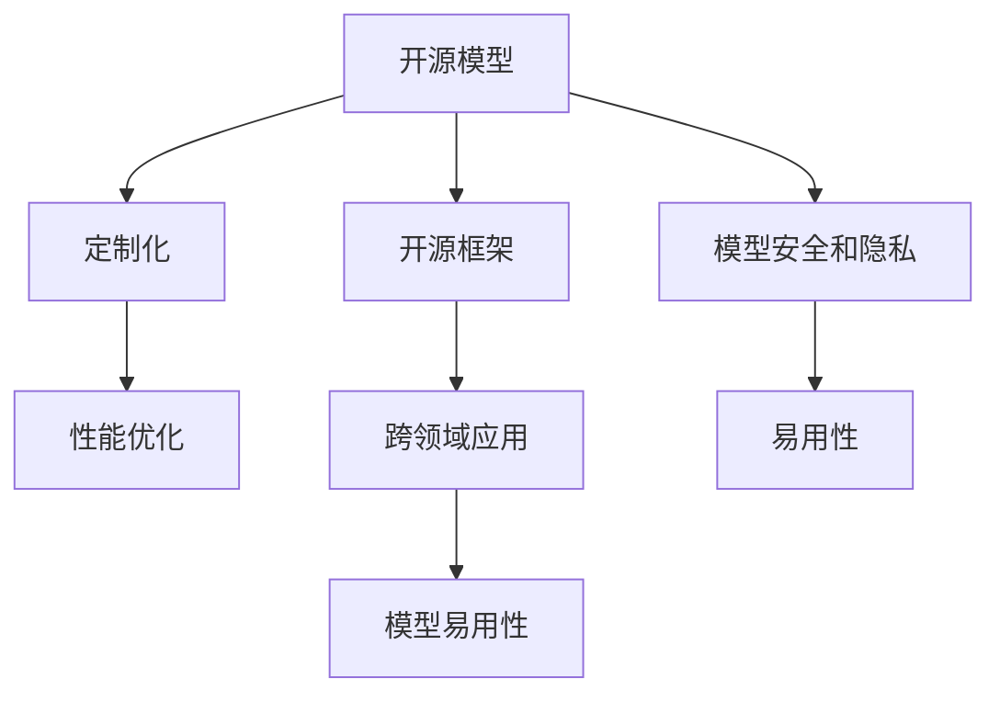

                 

# 开源模型发展：贾扬清观点，创新定制化优势助力发展

> 关键词：开源模型，贾扬清，TensorFlow，PyTorch，机器学习，深度学习，定制化，AI开发者，创新，AI开源社区

## 1. 背景介绍

### 1.1 问题由来
在当今科技快速发展的时代，人工智能(AI)成为了众多科技公司、研究机构和个人探索的热点领域。机器学习和深度学习技术的迅猛进步，使AI模型在图像识别、语音识别、自然语言处理(NLP)等多个领域实现了显著突破。然而，这些突破的背后，离不开大量的开源AI模型和框架的支持。

开源模型和框架的出现，极大地降低了AI研究和应用的门槛，使得开发者可以更加便捷地构建和部署AI模型。特别是在TensorFlow和PyTorch等主流开源框架的推动下，AI模型开发进入了一个新的阶段。这些框架不仅提供了强大的计算图和优化器，还提供了丰富的模型库和工具，极大地加快了AI模型的研究和应用进程。

### 1.2 问题核心关键点
开源AI模型和框架的快速发展，给AI领域带来了深刻的变化。它们不仅改变了模型的构建方式，还改变了AI研究和应用的生态系统。然而，尽管开源模型和框架带来了诸多优势，但仍然存在一些问题和挑战。以下是几个核心关键点：

- **可定制化需求增加**：AI应用场景日益多样化，对模型的定制化需求不断增加。开发者需要更加灵活和个性化的工具来满足不同场景下的需求。
- **模型性能优化**：在数据量和计算资源受限的情况下，如何优化模型性能，成为开发者的主要挑战。
- **跨领域应用**：AI模型和框架如何更好地应用于不同领域，实现跨领域的通用性。
- **模型安全和隐私**：AI模型和数据的安全性和隐私问题愈发受到重视，特别是在医疗、金融等敏感领域。
- **模型易用性**：提高模型的易用性，使得更多开发者能够快速上手，提高工作效率。

## 2. 核心概念与联系

### 2.1 核心概念概述

为了更好地理解开源模型和框架的发展及其影响，本节将介绍几个核心概念：

- **开源模型(Open Source Model)**：指基于开源许可协议，任何人都可以自由使用、修改和分发的AI模型。常见的开源模型包括TensorFlow Hub、PyTorch Hub、ModelScope等。
- **开源框架(Open Source Framework)**：指用于构建和管理AI模型的软件工具，如TensorFlow、PyTorch、JAX等。开源框架提供了强大的计算图和优化器，支持模型的构建、训练和部署。
- **定制化(Customization)**：指根据具体应用场景，对开源模型和框架进行定制化优化，以满足特定需求。这种定制化可能包括模型结构、训练参数、优化策略等。
- **模型性能优化(Performance Optimization)**：指通过改进模型结构和训练策略，提高模型的准确性、速度和效率。性能优化是开源模型和框架应用的重要方向。
- **跨领域应用(Cross-Domain Application)**：指开源模型和框架在不同领域的应用。由于开源模型和框架具有通用性，可以应用于医疗、金融、教育等多个领域。
- **模型安全和隐私(Security and Privacy)**：指保护模型和数据的安全性和隐私，避免模型被恶意攻击和数据泄露。

这些核心概念之间的逻辑关系可以通过以下Mermaid流程图来展示：



这个流程图展示了开源模型和框架的核心概念及其之间的关系：

1. 开源模型和框架是基础，提供了丰富的模型库和工具。
2. 定制化、性能优化、跨领域应用等是开源模型和框架的应用方向，旨在提升模型的效用和适用性。
3. 模型安全和隐私是保障，确保模型和数据的安全。
4. 模型易用性是优化方向，提高模型的易用性和可访问性。

## 3. 核心算法原理 & 具体操作步骤
### 3.1 算法原理概述

开源模型和框架的发展，离不开核心算法原理的创新和优化。本文将重点介绍两种主流的开源框架：TensorFlow和PyTorch，并对比它们的核心算法原理和优势。

#### 3.1.1 TensorFlow

TensorFlow是由Google开发的一个开源AI框架，支持多种编程语言（如Python、C++、Java等），可以运行于多种设备（如CPU、GPU、TPU等）。TensorFlow的核心算法原理包括计算图模型和自动微分技术。

- **计算图模型**：TensorFlow通过计算图模型来表示模型结构和计算过程。计算图模型由节点和边组成，节点表示操作，边表示数据流。TensorFlow通过静态计算图和动态计算图两种方式来构建模型。
- **自动微分技术**：TensorFlow使用自动微分技术来计算模型的梯度和更新参数。自动微分技术可以自动计算复杂模型的高阶导数，从而实现高效的反向传播。

#### 3.1.2 PyTorch

PyTorch是由Facebook开发的一个开源AI框架，以其动态计算图模型和动态内存管理著称。PyTorch的核心算法原理包括动态计算图模型和易用性优化。

- **动态计算图模型**：PyTorch使用动态计算图模型，允许开发者在模型训练过程中动态构建和修改计算图。这种动态性使得PyTorch在模型调试和优化上更加灵活。
- **易用性优化**：PyTorch使用动态内存管理，避免了手动管理内存的繁琐。同时，PyTorch的API设计简洁易用，使得开发者可以更加高效地构建和部署模型。

### 3.2 算法步骤详解

开源模型和框架的构建和优化，通常包括以下几个关键步骤：

**Step 1: 数据预处理和准备**

- **数据集准备**：选择合适的数据集，进行数据清洗、标注和归一化处理。
- **数据增强**：通过对数据进行旋转、缩放、翻转等操作，增加数据集的多样性，提升模型泛化能力。

**Step 2: 模型构建和初始化**

- **模型选择**：选择合适的模型结构，如卷积神经网络(CNN)、循环神经网络(RNN)、Transformer等。
- **模型初始化**：对模型参数进行初始化，常用的方法包括Xavier初始化、He初始化等。

**Step 3: 模型训练和优化**

- **训练循环**：通过反向传播算法，计算模型损失，更新模型参数。
- **优化算法**：选择合适的优化算法，如Adam、SGD、Adagrad等，调整学习率、批大小等超参数。
- **正则化技术**：使用L2正则、Dropout、早停策略等防止过拟合。

**Step 4: 模型评估和部署**

- **评估指标**：选择合适的评估指标，如准确率、精确率、召回率等。
- **模型保存和加载**：保存训练好的模型，方便后续部署和调用。

**Step 5: 模型优化和改进**

- **模型压缩**：通过剪枝、量化等方法，减少模型参数和计算量，提升模型速度和效率。
- **模型微调**：在特定任务上微调模型，提升模型性能。
- **模型融合**：通过模型集成和融合，提升模型稳定性和鲁棒性。

### 3.3 算法优缺点

开源模型和框架的优势和劣势可以从以下几个方面进行分析：

**优势**：

- **灵活性**：开源模型和框架提供了丰富的模型库和工具，开发者可以根据需求选择和调整模型。
- **社区支持**：开源模型和框架拥有庞大的社区支持，开发者可以通过社区获取帮助和资源。
- **易用性**：开源模型和框架提供了简洁易用的API和工具，降低了模型构建和优化的难度。
- **跨平台支持**：开源模型和框架可以在多种设备上运行，支持多种编程语言。

**劣势**：

- **学习曲线**：开源模型和框架的API设计复杂，可能需要花费一定时间学习。
- **资源消耗**：开源模型和框架的资源消耗较大，特别是在训练和推理时。
- **安全风险**：开源模型和框架的安全性可能存在风险，如模型被攻击或数据泄露。
- **可移植性**：开源模型和框架在不同设备和平台上的移植性可能受到限制。

### 3.4 算法应用领域

开源模型和框架已经在多个领域得到了广泛应用，涵盖计算机视觉、自然语言处理、语音识别、推荐系统等多个方向。以下是几个典型应用领域：

- **计算机视觉**：如物体识别、人脸识别、图像分割等。开源框架如TensorFlow、PyTorch等提供了丰富的模型库和工具，支持计算机视觉任务的开发和应用。
- **自然语言处理**：如机器翻译、情感分析、问答系统等。开源模型如BERT、GPT等在自然语言处理领域取得了显著成果。
- **语音识别**：如语音转文本、语音情感识别等。开源框架如Kaldi、DeepSpeech等提供了强大的语音处理工具。
- **推荐系统**：如协同过滤、基于内容推荐等。开源框架如TensorFlow、PyTorch等支持推荐系统的构建和优化。
- **医疗健康**：如医学影像分析、疾病预测等。开源框架如TensorFlow、PyTorch等支持医疗健康领域的数据分析和建模。

## 4. 数学模型和公式 & 详细讲解  
### 4.1 数学模型构建

开源模型和框架的构建和优化，涉及大量数学模型和公式。本文将重点介绍TensorFlow和PyTorch的数学模型构建方法。

#### 4.1.1 TensorFlow

TensorFlow的核心数学模型包括计算图模型和自动微分技术。以下是TensorFlow的核心数学模型构建方法：

- **计算图模型**：TensorFlow使用计算图模型来表示模型结构和计算过程。计算图模型由节点和边组成，节点表示操作，边表示数据流。TensorFlow通过静态计算图和动态计算图两种方式来构建模型。
- **自动微分技术**：TensorFlow使用自动微分技术来计算模型的梯度和更新参数。自动微分技术可以自动计算复杂模型的高阶导数，从而实现高效的反向传播。

#### 4.1.2 PyTorch

PyTorch的核心数学模型包括动态计算图模型和易用性优化。以下是PyTorch的核心数学模型构建方法：

- **动态计算图模型**：PyTorch使用动态计算图模型，允许开发者在模型训练过程中动态构建和修改计算图。这种动态性使得PyTorch在模型调试和优化上更加灵活。
- **易用性优化**：PyTorch使用动态内存管理，避免了手动管理内存的繁琐。同时，PyTorch的API设计简洁易用，使得开发者可以更加高效地构建和部署模型。

### 4.2 公式推导过程

开源模型和框架的构建和优化，涉及大量数学公式。本文将重点介绍TensorFlow和PyTorch的核心数学公式推导。

#### 4.2.1 TensorFlow

TensorFlow的核心数学公式包括损失函数、梯度计算和优化算法。以下是TensorFlow的核心数学公式推导：

- **损失函数**：TensorFlow使用交叉熵损失函数来计算模型预测与真实标签之间的差异。
- **梯度计算**：TensorFlow使用反向传播算法计算模型梯度，从而更新模型参数。
- **优化算法**：TensorFlow使用Adam优化算法来调整模型参数，最小化损失函数。

#### 4.2.2 PyTorch

PyTorch的核心数学公式包括损失函数、梯度计算和优化算法。以下是PyTorch的核心数学公式推导：

- **损失函数**：PyTorch使用交叉熵损失函数来计算模型预测与真实标签之间的差异。
- **梯度计算**：PyTorch使用反向传播算法计算模型梯度，从而更新模型参数。
- **优化算法**：PyTorch使用Adam优化算法来调整模型参数，最小化损失函数。

### 4.3 案例分析与讲解

以下是TensorFlow和PyTorch在实际应用中的案例分析与讲解：

- **TensorFlow案例**：TensorFlow在Google Play应用中广泛应用，用于图像识别、语音识别等任务。Google Play应用通过TensorFlow模型实现了实时视频转文字、实时翻译等功能。
- **PyTorch案例**：PyTorch在Facebook的AI研究中广泛应用，用于自然语言处理、计算机视觉等任务。Facebook使用PyTorch构建了基于文本的智能助手，支持多语言对话和任务执行。

## 5. 项目实践：代码实例和详细解释说明
### 5.1 开发环境搭建

在进行开源模型和框架的项目实践前，我们需要准备好开发环境。以下是使用Python进行TensorFlow和PyTorch开发的详细环境配置流程：

1. 安装Anaconda：从官网下载并安装Anaconda，用于创建独立的Python环境。

2. 创建并激活虚拟环境：
```bash
conda create -n tensorflow-env python=3.8 
conda activate tensorflow-env
```

3. 安装TensorFlow和PyTorch：根据CUDA版本，从官网获取对应的安装命令。例如：
```bash
conda install tensorflow==2.7 
conda install pytorch torchvision torchaudio cudatoolkit=11.1 -c pytorch -c conda-forge
```

4. 安装各类工具包：
```bash
pip install numpy pandas scikit-learn matplotlib tqdm jupyter notebook ipython
```

完成上述步骤后，即可在`tensorflow-env`环境中开始项目实践。

### 5.2 源代码详细实现

这里我们以图像分类任务为例，给出使用TensorFlow和PyTorch进行模型构建和优化的代码实现。

**使用TensorFlow进行图像分类任务**：

```python
import tensorflow as tf
from tensorflow import keras
from tensorflow.keras import layers

# 加载数据集
(x_train, y_train), (x_test, y_test) = keras.datasets.cifar10.load_data()

# 数据预处理
x_train = x_train / 255.0
x_test = x_test / 255.0

# 定义模型
model = keras.Sequential([
    layers.Conv2D(32, (3, 3), activation='relu', input_shape=(32, 32, 3)),
    layers.MaxPooling2D((2, 2)),
    layers.Conv2D(64, (3, 3), activation='relu'),
    layers.MaxPooling2D((2, 2)),
    layers.Flatten(),
    layers.Dense(10, activation='softmax')
])

# 编译模型
model.compile(optimizer='adam',
              loss='sparse_categorical_crossentropy',
              metrics=['accuracy'])

# 训练模型
model.fit(x_train, y_train, epochs=10, validation_data=(x_test, y_test))

# 评估模型
model.evaluate(x_test, y_test)
```

**使用PyTorch进行图像分类任务**：

```python
import torch
import torch.nn as nn
import torch.optim as optim
import torchvision
import torchvision.transforms as transforms

# 加载数据集
transform = transforms.Compose(
    [transforms.ToTensor(),
     transforms.Normalize((0.5, 0.5, 0.5), (0.5, 0.5, 0.5))])

trainset = torchvision.datasets.CIFAR10(root='./data', train=True,
                                        download=True, transform=transform)
trainloader = torch.utils.data.DataLoader(trainset, batch_size=4,
                                          shuffle=True, num_workers=2)

testset = torchvision.datasets.CIFAR10(root='./data', train=False,
                                       download=True, transform=transform)
testloader = torch.utils.data.DataLoader(testset, batch_size=4,
                                       shuffle=False, num_workers=2)

classes = ('plane', 'car', 'bird', 'cat',
           'deer', 'dog', 'frog', 'horse', 'ship', 'truck')

# 定义模型
class Net(nn.Module):
    def __init__(self):
        super(Net, self).__init__()
        self.conv1 = nn.Conv2d(3, 6, 5)
        self.pool = nn.MaxPool2d(2, 2)
        self.conv2 = nn.Conv2d(6, 16, 5)
        self.fc1 = nn.Linear(16 * 5 * 5, 120)
        self.fc2 = nn.Linear(120, 84)
        self.fc3 = nn.Linear(84, 10)

    def forward(self, x):
        x = self.pool(F.relu(self.conv1(x)))
        x = self.pool(F.relu(self.conv2(x)))
        x = x.view(-1, 16 * 5 * 5)
        x = F.relu(self.fc1(x))
        x = F.relu(self.fc2(x))
        x = self.fc3(x)
        return x

# 定义优化器和损失函数
net = Net()
criterion = nn.CrossEntropyLoss()
optimizer = optim.SGD(net.parameters(), lr=0.001, momentum=0.9)

# 训练模型
for epoch in range(2):
    running_loss = 0.0
    for i, data in enumerate(trainloader, 0):
        inputs, labels = data
        optimizer.zero_grad()
        outputs = net(inputs)
        loss = criterion(outputs, labels)
        loss.backward()
        optimizer.step()
        running_loss += loss.item()
        if i % 2000 == 1999:
            print('[%d, %5d] loss: %.3f' %
                  (epoch + 1, i + 1, running_loss / 2000))
            running_loss = 0.0

print('Finished Training')
```

### 5.3 代码解读与分析

让我们再详细解读一下关键代码的实现细节：

**TensorFlow案例代码**：

- `(x_train, y_train), (x_test, y_test) = keras.datasets.cifar10.load_data()`：加载CIFAR-10数据集，将图像数据归一化处理。
- `model = keras.Sequential()`：定义模型结构，包括卷积层、池化层和全连接层。
- `model.compile()`：编译模型，选择优化器、损失函数和评估指标。
- `model.fit()`：训练模型，指定训练集和验证集。
- `model.evaluate()`：评估模型，在测试集上计算准确率。

**PyTorch案例代码**：

- `transform = transforms.Compose()`：定义数据转换，将图像数据归一化处理。
- `trainset = torchvision.datasets.CIFAR10()`：加载CIFAR-10数据集，使用自定义数据转换。
- `trainloader = torch.utils.data.DataLoader()`：定义数据加载器，指定批大小和数据处理方式。
- `testloader = torch.utils.data.DataLoader()`：定义数据加载器，指定批大小和数据处理方式。
- `Net()`：定义模型结构，包括卷积层、池化层和全连接层。
- `criterion = nn.CrossEntropyLoss()`：定义损失函数，用于计算分类误差。
- `optimizer = optim.SGD()`：定义优化器，使用随机梯度下降算法。
- `net(inputs)`：定义前向传播，计算模型输出。
- `loss = criterion(outputs, labels)`：定义损失函数，计算模型预测与真实标签之间的差异。
- `loss.backward()`：定义反向传播，计算模型梯度。
- `optimizer.step()`：定义优化器更新，调整模型参数。

## 6. 实际应用场景
### 6.1 智能客服系统

基于开源模型的智能客服系统，可以广泛应用于各个企业，提高客户咨询的响应速度和满意度。传统客服系统需要大量人力，高峰期响应缓慢，且一致性和专业性难以保证。通过开源模型的智能客服系统，可以24小时不间断服务，快速响应客户咨询，用自然流畅的语言解答各类常见问题。

在技术实现上，可以收集企业内部的历史客服对话记录，将问题和最佳答复构建成监督数据，在此基础上对预训练模型进行微调。微调后的对话模型能够自动理解用户意图，匹配最合适的答案模板进行回复。对于客户提出的新问题，还可以接入检索系统实时搜索相关内容，动态组织生成回答。如此构建的智能客服系统，能大幅提升客户咨询体验和问题解决效率。

### 6.2 金融舆情监测

金融机构需要实时监测市场舆论动向，以便及时应对负面信息传播，规避金融风险。传统的人工监测方式成本高、效率低，难以应对网络时代海量信息爆发的挑战。基于开源模型的文本分类和情感分析技术，为金融舆情监测提供了新的解决方案。

具体而言，可以收集金融领域相关的新闻、报道、评论等文本数据，并对其进行主题标注和情感标注。在此基础上对预训练语言模型进行微调，使其能够自动判断文本属于何种主题，情感倾向是正面、中性还是负面。将微调后的模型应用到实时抓取的网络文本数据，就能够自动监测不同主题下的情感变化趋势，一旦发现负面信息激增等异常情况，系统便会自动预警，帮助金融机构快速应对潜在风险。

### 6.3 个性化推荐系统

当前的推荐系统往往只依赖用户的历史行为数据进行物品推荐，无法深入理解用户的真实兴趣偏好。基于开源模型的个性化推荐系统可以更好地挖掘用户行为背后的语义信息，从而提供更精准、多样的推荐内容。

在实践中，可以收集用户浏览、点击、评论、分享等行为数据，提取和用户交互的物品标题、描述、标签等文本内容。将文本内容作为模型输入，用户的后续行为（如是否点击、购买等）作为监督信号，在此基础上微调预训练语言模型。微调后的模型能够从文本内容中准确把握用户的兴趣点。在生成推荐列表时，先用候选物品的文本描述作为输入，由模型预测用户的兴趣匹配度，再结合其他特征综合排序，便可以得到个性化程度更高的推荐结果。

### 6.4 未来应用展望

随着开源模型和框架的不断发展，其在各个领域的应用前景将更加广阔。

- **智慧医疗**：开源模型可以用于医学影像分析、疾病预测、药物研发等。通过微调，提高模型的疾病诊断准确性和药物研发效率。
- **智能教育**：开源模型可以用于作业批改、学情分析、知识推荐等。通过微调，提高教育系统的智能化水平和教育公平性。
- **智慧城市**：开源模型可以用于城市事件监测、舆情分析、应急指挥等。通过微调，提高城市管理的自动化和智能化水平，构建更安全、高效的未来城市。
- **企业生产**：开源模型可以用于生产过程中的质量控制、设备维护等。通过微调，提高生产效率和产品质量。

## 7. 工具和资源推荐
### 7.1 学习资源推荐

为了帮助开发者系统掌握开源模型和框架的理论基础和实践技巧，这里推荐一些优质的学习资源：

1. **TensorFlow官方文档**：提供详细的API文档和示例代码，是学习TensorFlow的必备资料。
2. **PyTorch官方文档**：提供简洁易用的API和工具，是学习PyTorch的必备资料。
3. **《Python深度学习》书籍**：全面介绍深度学习和TensorFlow的实战技巧，是学习深度学习的经典教材。
4. **《动手学深度学习》课程**：由国内外深度学习专家共同编写，提供丰富的深度学习理论和实战内容。
5. **Kaggle平台**：提供丰富的开源数据集和比赛，可以帮助开发者实践和提升深度学习技能。

通过这些资源的学习实践，相信你一定能够快速掌握开源模型和框架的理论基础和实践技巧，并用于解决实际的AI问题。

### 7.2 开发工具推荐

高效的开发离不开优秀的工具支持。以下是几款用于开源模型和框架开发的常用工具：

1. **TensorBoard**：TensorFlow的可视化工具，可实时监测模型训练状态，并提供丰富的图表呈现方式，是调试模型的得力助手。
2. **Weights & Biases**：模型训练的实验跟踪工具，可以记录和可视化模型训练过程中的各项指标，方便对比和调优。
3. **Jupyter Notebook**：支持Python等编程语言，提供交互式编程环境，方便调试和优化模型。
4. **Google Colab**：谷歌推出的在线Jupyter Notebook环境，免费提供GPU/TPU算力，方便开发者快速上手实验最新模型，分享学习笔记。

合理利用这些工具，可以显著提升开源模型和框架的开发效率，加快创新迭代的步伐。

### 7.3 相关论文推荐

开源模型和框架的发展离不开学界的持续研究。以下是几篇奠基性的相关论文，推荐阅读：

1. **《Deep Learning》书籍**：深度学习领域的经典教材，详细介绍了深度学习的理论基础和实践技巧。
2. **《Neural Networks and Deep Learning》书籍**：深度学习领域的权威教材，涵盖了神经网络、深度学习、TensorFlow等多个主题。
3. **《PyTorch官方文档》**：提供详细的API文档和示例代码，是学习PyTorch的必备资料。
4. **《TensorFlow官方文档》**：提供详细的API文档和示例代码，是学习TensorFlow的必备资料。
5. **《Python深度学习》书籍**：全面介绍深度学习和TensorFlow的实战技巧，是学习深度学习的经典教材。

这些论文代表了大模型和框架的发展脉络。通过学习这些前沿成果，可以帮助研究者把握学科前进方向，激发更多的创新灵感。

## 8. 总结：未来发展趋势与挑战

### 8.1 总结

本文对开源模型和框架的发展进行了全面系统的介绍。首先阐述了开源模型和框架的研究背景和意义，明确了开源模型和框架在降低AI研究和应用门槛、提高AI模型效用和适用性方面的独特价值。其次，从原理到实践，详细讲解了开源模型和框架的核心算法原理和操作步骤，给出了开源模型和框架的代码实例和详细解释说明。同时，本文还广泛探讨了开源模型和框架在智能客服、金融舆情、个性化推荐等多个行业领域的应用前景，展示了开源模型和框架的巨大潜力。

通过本文的系统梳理，可以看到，开源模型和框架在降低AI研究和应用门槛、提高AI模型效用和适用性方面发挥了重要作用。得益于丰富的模型库和工具，开发者可以更加便捷地构建和优化AI模型。未来，随着开源模型和框架的不断发展，其在更多领域的应用将更加广泛，为AI技术的发展注入新的动力。

### 8.2 未来发展趋势

开源模型和框架的未来发展趋势可以从以下几个方面进行分析：

1. **模型规模持续增大**：随着算力成本的下降和数据规模的扩张，开源模型和框架的参数量还将持续增长。超大参数量模型蕴含的丰富知识，有望支撑更加复杂多变的下游任务。
2. **模型易用性提升**：开源模型和框架将更加注重易用性优化，使得开发者可以更加高效地构建和部署模型。
3. **跨平台支持增强**：开源模型和框架将在更多设备上支持，支持更多编程语言，提高模型的可移植性。
4. **跨领域应用拓展**：开源模型和框架将在更多领域得到应用，如医疗、教育、金融等，实现跨领域的通用性。
5. **模型安全和隐私保障**：开源模型和框架将更加注重安全性和隐私保护，确保模型和数据的安全。
6. **生态系统完善**：开源模型和框架将更加注重生态系统建设，提供丰富的工具和资源，支持更多的开发者参与。

以上趋势凸显了开源模型和框架的广阔前景。这些方向的探索发展，必将进一步提升开源模型和框架的效用和适用性，为AI技术的发展注入新的动力。

### 8.3 面临的挑战

尽管开源模型和框架带来了诸多优势，但在迈向更加智能化、普适化应用的过程中，它们仍面临以下挑战：

1. **学习曲线陡峭**：开源模型和框架的API设计复杂，需要开发者花费一定时间学习。
2. **资源消耗较大**：开源模型和框架的资源消耗较大，特别是在训练和推理时。
3. **安全风险存在**：开源模型和框架的安全性可能存在风险，如模型被攻击或数据泄露。
4. **可移植性受限**：开源模型和框架在不同设备和平台上的移植性可能受到限制。
5. **性能优化困难**：开源模型和框架的性能优化需要深入理解模型结构和计算图，难以进行高效的优化。

### 8.4 研究展望

面对开源模型和框架所面临的挑战，未来的研究需要在以下几个方面寻求新的突破：

1. **模型压缩和量化**：通过剪枝、量化等方法，减少模型参数和计算量，提升模型速度和效率。
2. **模型融合和集成**：通过模型集成和融合，提升模型的稳定性和鲁棒性。
3. **模型安全和隐私保护**：引入安全性和隐私保护机制，确保模型和数据的安全。
4. **模型易用性提升**：提高模型的易用性和可访问性，降低开发者的学习曲线。
5. **跨平台支持增强**：提高模型的可移植性，支持更多设备和平台。
6. **模型性能优化**：通过改进模型结构和训练策略，提高模型的准确性、速度和效率。

这些研究方向的探索，必将引领开源模型和框架技术的不断演进，为AI技术的发展注入新的动力。面向未来，开源模型和框架需要在模型易用性、安全性和可移植性等方面不断提升，才能更好地满足各个领域的应用需求。

## 9. 附录：常见问题与解答

**Q1：开源模型和框架的优势和劣势有哪些？**

A: 开源模型和框架的优势包括：

- **灵活性**：提供了丰富的模型库和工具，开发者可以根据需求选择和调整模型。
- **社区支持**：拥有庞大的社区支持，开发者可以通过社区获取帮助和资源。
- **易用性**：提供了简洁易用的API和工具，降低了模型构建和优化的难度。
- **跨平台支持**：可以在多种设备上运行，支持多种编程语言。

劣势包括：

- **学习曲线**：API设计复杂，需要开发者花费一定时间学习。
- **资源消耗**：资源消耗较大，特别是在训练和推理时。
- **安全风险**：安全性可能存在风险，如模型被攻击或数据泄露。
- **可移植性**：在不同设备和平台上的移植性可能受到限制。

**Q2：如何优化开源模型和框架的性能？**

A: 优化开源模型和框架的性能可以从以下几个方面入手：

- **模型压缩和量化**：通过剪枝、量化等方法，减少模型参数和计算量，提升模型速度和效率。
- **模型融合和集成**：通过模型集成和融合，提升模型的稳定性和鲁棒性。
- **模型易用性提升**：提高模型的易用性和可访问性，降低开发者的学习曲线。
- **跨平台支持增强**：提高模型的可移植性，支持更多设备和平台。
- **模型性能优化**：通过改进模型结构和训练策略，提高模型的准确性、速度和效率。

**Q3：开源模型和框架的未来发展方向是什么？**

A: 开源模型和框架的未来发展方向包括：

- **模型规模持续增大**：随着算力成本的下降和数据规模的扩张，开源模型和框架的参数量还将持续增长。
- **模型易用性提升**：开源模型和框架将更加注重易用性优化，使得开发者可以更加高效地构建和部署模型。
- **跨平台支持增强**：开源模型和框架将在更多设备上支持，支持更多编程语言，提高模型的可移植性。
- **跨领域应用拓展**：开源模型和框架将在更多领域得到应用，如医疗、教育、金融等，实现跨领域的通用性。
- **模型安全和隐私保障**：开源模型和框架将更加注重安全性和隐私保护，确保模型和数据的安全。
- **生态系统完善**：开源模型和框架将更加注重生态系统建设，提供丰富的工具和资源，支持更多的开发者参与。

**Q4：如何选择合适的开源模型和框架？**

A: 选择合适的开源模型和框架可以从以下几个方面入手：

- **任务类型**：根据任务类型选择合适的模型和框架，如卷积神经网络(CNN)适用于图像识别，循环神经网络(RNN)适用于序列数据处理。
- **数据规模**：根据数据规模选择合适的模型和框架，小规模数据适合轻量级模型，大规模数据适合大模型。
- **资源需求**：根据资源需求选择合适的模型和框架，GPU资源充足时可以选择大模型，CPU资源有限时可以选择轻量级模型。
- **社区支持**：选择拥有庞大社区支持的开源模型和框架，可以获取更多的资源和帮助。
- **易用性**：选择易用性高的开源模型和框架，可以降低开发者的学习曲线和工作量。

**Q5：开源模型和框架在实际应用中的案例有哪些？**

A: 开源模型和框架在实际应用中的案例包括：

- **图像分类**：如Google Play应用中的实时视频转文字、实时翻译等功能，使用TensorFlow和PyTorch构建的模型。
- **自然语言处理**：如Facebook的智能助手，支持多语言对话和任务执行，使用PyTorch构建的模型。
- **计算机视觉**：如CIFAR-10图像分类任务，使用TensorFlow和PyTorch构建的模型。
- **医疗健康**：如医学影像分析、疾病预测等，使用TensorFlow和PyTorch构建的模型。
- **金融舆情监测**：使用TensorFlow和PyTorch构建的文本分类和情感分析模型。

---

作者：禅与计算机程序设计艺术 / Zen and the Art of Computer Programming

