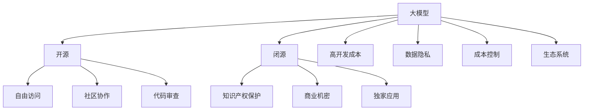

                 

# 开源还是闭源:大模型商业化的抉择

> 关键词：大模型,开源,闭源,商业化,知识产权,数据隐私,成本控制,生态系统

## 1. 背景介绍

### 1.1 问题由来
近年来，深度学习模型，尤其是大规模预训练模型（如BERT、GPT-3、Wav2Vec等）在自然语言处理（NLP）、计算机视觉（CV）、语音识别等领域取得了显著成果，推动了人工智能（AI）技术向广泛应用迈进。这些大模型基于海量数据预训练生成，拥有强大的表示能力，但同时也带来了高昂的开发成本和隐私保护问题。

在大模型商业化过程中，技术开发者面临一个重要抉择：是选择开源（Open Source）还是闭源（Proprietary）模式。这一抉择将深刻影响大模型在市场上的推广、应用和竞争态势，并对其生态系统和未来发展方向产生深远影响。本文将深入探讨开源与闭源在大模型商业化中的利弊，以及如何平衡知识产权保护、数据隐私和成本控制等关键因素，为决策者提供思路。

## 2. 核心概念与联系

### 2.1 核心概念概述

为更好地理解开源与闭源在大模型商业化中的抉择，本节将介绍几个密切相关的核心概念：

- **大模型(Large Models)**：指利用深度学习算法，在大规模数据集上预训练生成的具有强大表示能力的模型。典型的大模型包括BERT、GPT-3等。

- **开源（Open Source）**：指将软件或模型的代码、模型参数等公开共享，任何人都可以自由访问、使用、修改和分发。开源模式强调透明度和社区协作。

- **闭源（Proprietary）**：指模型和代码等只由其开发者内部使用，不公开分享给外部。闭源模式注重知识产权保护和商业机密保密。

- **知识产权（Intellectual Property Rights, IPRs）**：指法律保护的创造性成果，如专利、商标、版权等。知识产权是大模型商业化的重要法律保护手段。

- **数据隐私（Data Privacy）**：指在收集、存储、处理、共享数据过程中，对个人隐私信息的保护。数据隐私是大模型开发和使用的核心问题之一。

- **成本控制（Cost Control）**：指在商业化过程中，对开发、运营和维护成本进行管理，以确保经济效益。

- **生态系统（Ecosystem）**：指围绕大模型展开的应用、工具、社区、市场等多方面要素的组合。健康生态系统有助于大模型的快速普及和应用。

这些概念之间的逻辑关系可以通过以下Mermaid流程图来展示：



这个流程图展示了大模型商业化过程中的关键抉择，以及这些抉择对模型的访问自由度、社区协作、知识产权保护、成本控制和生态系统建设等方面的影响。

## 3. 核心算法原理 & 具体操作步骤
### 3.1 算法原理概述

开源与闭源模式在大模型商业化中的抉择，本质上是权衡知识产权保护、数据隐私、成本控制与生态系统建设之间的关系。以下从这几个方面探讨开源与闭源的利弊：

- **开源模式**：

  **优点**：
  1. **透明度和社区协作**：开源模型鼓励开发者、研究机构、企业等合作，共同推进技术进步和应用创新。
  2. **高可达性**：任何人都可以免费使用和分发，有助于模型在更广泛场景中的快速应用和推广。
  3. **激励创新**：开源社区聚集了大量技术人才，可快速响应新需求，推动模型迭代和优化。

  **缺点**：
  1. **知识产权保护**：开源模式难以控制模型的商业应用和分发的范围和形式，可能被滥用或泄露商业机密。
  2. **数据隐私**：开源模型通常需要收集大量数据用于训练，数据隐私保护难度较大。
  3. **成本控制**：开源模型开发和维护成本高，企业可能难以承担长期运营费用。

- **闭源模式**：

  **优点**：
  1. **知识产权保护**：企业对模型拥有完全控制权，可以保护商业利益和机密信息。
  2. **数据隐私**：模型训练和应用过程中，可以更好地控制数据的收集和使用，保护用户隐私。
  3. **成本控制**：商业化过程由企业自主管理，运营和维护成本可控。

  **缺点**：
  1. **透明性和社区协作**：闭源模型缺乏透明度，社区协作和共创共建难度较大。
  2. **高可达性**：受限于用户获取和使用成本，模型在市场上的推广和应用可能受限。
  3. **创新激励**：缺乏开源社区的支持，模型迭代速度可能较慢，创新动力不足。

### 3.2 算法步骤详解

**开源模式**：

1. **开发和训练**：基于开源社区和研究机构提供的算法和工具，在大规模数据集上进行模型训练。
2. **发布和维护**：将模型和代码公开发布，接受社区监督和改进。
3. **商业应用**：企业和开发者在遵守开源协议的前提下，自由使用和分发模型。

**闭源模式**：

1. **内部开发**：企业内部进行模型的开发和训练，数据隐私得到良好保护。
2. **商业化部署**：模型部署在内部网络或安全服务器中，提供专有服务。
3. **定制化开发**：根据企业需求，定制化开发和优化模型，保障知识产权。

### 3.3 算法优缺点

开源与闭源模式各有优缺点，具体选择需综合考虑以下因素：

**开源模式**：

**优点**：
1. **透明度和社区协作**：增加模型开发和应用的公开度，鼓励技术交流与创新。
2. **高可达性**：模型可以在更广泛的场景中使用，推广和应用速度快。
3. **成本分摊**：社区协作降低了部分开发和维护成本。

**缺点**：
1. **知识产权保护**：缺乏对模型商业应用的严格控制，可能存在侵权风险。
2. **数据隐私**：开放的数据可能被滥用或泄露，威胁用户隐私。
3. **成本控制**：开发和维护成本高，企业需投入大量资源。

**闭源模式**：

**优点**：
1. **知识产权保护**：完全控制模型的商业应用和分发，保障商业利益。
2. **数据隐私**：严格控制数据的使用，保护用户隐私。
3. **成本控制**：企业自主管理运营和维护成本，便于长期运营。

**缺点**：
1. **透明性和社区协作**：缺乏开源社区的支持，技术进步和应用创新速度可能较慢。
2. **高可达性**：受限于成本，模型的推广和应用可能受限。
3. **创新激励**：缺乏开源社区的推动，创新动力可能不足。

### 3.4 算法应用领域

大模型开源与闭源的选择，在多个领域有着广泛的应用。以下以几个典型领域为例，探讨其适用性和影响：

- **自然语言处理（NLP）**：如BERT、GPT等，开源模型广泛应用于科研和工业界，推动了NLP技术的快速发展。但企业在某些特定场景（如商业客户服务等）更倾向于闭源模式，以保障商业利益和数据隐私。

- **计算机视觉（CV）**：大模型如ResNet、VGG等，通过开源模式加速了CV技术的普及和应用，但企业级应用中，尤其是医疗、金融等领域，更多选择闭源模式，以保护数据隐私和商业机密。

- **语音识别（ASR）**：如Wav2Vec，开源模型提高了技术研究的透明度和协作性，但企业在商业化部署中，更倾向于闭源模式，保障语音数据的隐私和安全。

## 4. 数学模型和公式 & 详细讲解 & 举例说明（备注：数学公式请使用latex格式，latex嵌入文中独立段落使用 $$，段落内使用 $)
### 4.1 数学模型构建

本节将使用数学语言对大模型开源与闭源模式进行进一步的探讨。

记大模型为 $M$，其训练数据集为 $D$，训练过程为 $T$。大模型的训练和商业化目标为 $O$。

**开源模式**：

1. **训练和发布**：$M = T(D)$
2. **公开发布**：$M$ 公开发布，自由访问。

**闭源模式**：

1. **内部开发**：$M = T(D, K)$，其中 $K$ 为内部开发和训练的参数。
2. **商业部署**：$M$ 部署在内部网络或安全服务器中，提供专有服务。

### 4.2 公式推导过程

**开源模式**：

1. **训练和发布**：$M = T(D)$
2. **商业应用**：$M$ 公开发布，可自由使用。

**闭源模式**：

1. **内部开发**：$M = T(D, K)$
2. **商业部署**：$M$ 部署在内部网络或安全服务器中，提供专有服务。

### 4.3 案例分析与讲解

以谷歌BERT为例，谷歌选择将BERT开源，但同时保留对其商业应用的严格控制。通过Google Cloud提供商业化服务，保护其知识产权，同时也促进了BERT在科研和产业界的广泛应用。但谷歌也面临开源模式的挑战，包括用户隐私保护、模型安全等。

相比之下，Facebook的FAIR模型则选择完全开源，所有社区均可自由访问和使用。FAIR模型在推动机器学习技术创新和应用方面取得了显著成效，但也面临着知识产权保护和数据隐私方面的挑战。

## 5. 项目实践：代码实例和详细解释说明
### 5.1 开发环境搭建

在进行开源与闭源模式的选择和实现时，需要准备好相应的开发环境。以下是使用Python进行PyTorch开发的常见环境配置流程：

1. 安装Anaconda：从官网下载并安装Anaconda，用于创建独立的Python环境。

2. 创建并激活虚拟环境：
```bash
conda create -n pytorch-env python=3.8 
conda activate pytorch-env
```

3. 安装PyTorch：根据CUDA版本，从官网获取对应的安装命令。例如：
```bash
conda install pytorch torchvision torchaudio cudatoolkit=11.1 -c pytorch -c conda-forge
```

4. 安装Transformers库：
```bash
pip install transformers
```

5. 安装各类工具包：
```bash
pip install numpy pandas scikit-learn matplotlib tqdm jupyter notebook ipython
```

完成上述步骤后，即可在`pytorch-env`环境中开始开源与闭源模式的选择和实践。

### 5.2 源代码详细实现

以下是使用PyTorch进行大模型开源与闭源模式选择的示例代码实现：

**开源模式**：

1. **模型训练和发布**：

```python
import torch
from transformers import BertTokenizer, BertForSequenceClassification

# 定义模型和训练数据
model = BertForSequenceClassification.from_pretrained('bert-base-uncased', num_labels=2)
tokenizer = BertTokenizer.from_pretrained('bert-base-uncased')

# 加载训练数据和标签
train_data = ...
train_labels = ...

# 定义训练函数
def train(model, train_data, train_labels, epochs, batch_size):
    ...
    return ...

# 训练模型
model = train(model, train_data, train_labels, 5, 16)

# 发布模型
torch.save(model.state_dict(), 'model.pth')

# 公开发布模型
model.load_state_dict(torch.load('model.pth'))
```

2. **商业应用**：

```python
# 部署模型
from transformers import BertForSequenceClassification
import torch

# 加载模型
model = BertForSequenceClassification.from_pretrained('model.pth')

# 商业应用
def classify(text):
    ...
    return ...

# 调用商业应用
result = classify('Hello, world!')
print(result)
```

**闭源模式**：

1. **内部开发和部署**：

```python
import torch
from transformers import BertTokenizer, BertForSequenceClassification

# 定义模型和训练数据
model = BertForSequenceClassification.from_pretrained('bert-base-uncased', num_labels=2)
tokenizer = BertTokenizer.from_pretrained('bert-base-uncased')

# 加载训练数据和标签
train_data = ...
train_labels = ...

# 定义训练函数
def train(model, train_data, train_labels, epochs, batch_size):
    ...
    return ...

# 训练模型
model = train(model, train_data, train_labels, 5, 16)

# 内部部署模型
model = train(model, train_data, train_labels, 5, 16)

# 内部商业应用
def classify(text):
    ...
    return ...

# 调用内部商业应用
result = classify('Hello, world!')
print(result)
```

### 5.3 代码解读与分析

**开源模式代码解读**：

1. **模型训练和发布**：
   - 使用预训练模型和训练数据进行微调训练。
   - 训练后保存模型参数，并公开发布模型。

2. **商业应用**：
   - 调用公开发布的模型进行商业应用。

**闭源模式代码解读**：

1. **内部开发和部署**：
   - 使用预训练模型和训练数据进行微调训练。
   - 训练后部署到内部网络或安全服务器中。

2. **内部商业应用**：
   - 调用内部部署的模型进行商业应用。

## 6. 实际应用场景
### 6.1 智能客服系统

在智能客服系统中，大模型开源与闭源的选择将直接影响系统的构建和应用。

**开源模式**：

1. **透明度和社区协作**：开源模式鼓励开发者共同构建智能客服系统，提升系统的可扩展性和可维护性。
2. **高可达性**：开源模型便于用户自由获取和使用，加速系统推广。
3. **成本分摊**：开源社区协作分担开发和维护成本，降低企业投入。

**闭源模式**：

1. **知识产权保护**：闭源模式保障企业对智能客服系统的完全控制，保护商业机密。
2. **数据隐私**：严格控制用户数据的使用，保护用户隐私。
3. **成本控制**：企业自主管理运营和维护成本，便于长期运营。

### 6.2 金融舆情监测

在金融舆情监测领域，大模型开源与闭源的选择将影响模型的应用效果和安全性。

**开源模式**：

1. **透明度和社区协作**：开源模型便于研究机构和开发者共同开发，推动技术进步。
2. **高可达性**：开源模型便于自由获取和使用，提高监测效率。
3. **成本分摊**：开源社区协作分担开发和维护成本，降低企业投入。

**闭源模式**：

1. **知识产权保护**：闭源模式保障企业对金融舆情监测系统的完全控制，保护商业机密。
2. **数据隐私**：严格控制用户数据的使用，保护用户隐私。
3. **成本控制**：企业自主管理运营和维护成本，便于长期运营。

### 6.3 个性化推荐系统

在个性化推荐系统中，大模型开源与闭源的选择将影响系统的推荐效果和用户体验。

**开源模式**：

1. **透明度和社区协作**：开源模型便于开发者共同构建推荐系统，提升系统的精准性和个性化水平。
2. **高可达性**：开源模型便于自由获取和使用，提高推荐效率。
3. **成本分摊**：开源社区协作分担开发和维护成本，降低企业投入。

**闭源模式**：

1. **知识产权保护**：闭源模式保障企业对个性化推荐系统的完全控制，保护商业机密。
2. **数据隐私**：严格控制用户数据的使用，保护用户隐私。
3. **成本控制**：企业自主管理运营和维护成本，便于长期运营。

## 7. 工具和资源推荐
### 7.1 学习资源推荐

为了帮助开发者系统掌握大模型开源与闭源的抉择和实现，这里推荐一些优质的学习资源：

1. **《深度学习理论与实践》**：由深度学习领域权威人士撰写，系统介绍深度学习原理和应用，包括开源与闭源的讨论。

2. **Coursera深度学习课程**：斯坦福大学开设的深度学习课程，涵盖深度学习基础和实践，以及开源与闭源模式的选择。

3. **Google Cloud官方文档**：详细介绍了BERT等大模型的开源模式及其在Google Cloud上的应用。

4. **Apache OpenAI Gym**：提供了一个开源的强化学习框架，支持多种模型和算法的实现和比较。

5. **OpenAI GitLab**：GitLab上丰富的开源模型和工具，包括BERT、GPT等大模型的实现和应用。

通过对这些资源的学习实践，相信你一定能够快速掌握大模型开源与闭源的抉择和实现方法，并用于解决实际的商业问题。

### 7.2 开发工具推荐

高效的开发离不开优秀的工具支持。以下是几款用于大模型开源与闭源模式开发和实现的常用工具：

1. **PyTorch**：基于Python的开源深度学习框架，灵活动态的计算图，适合快速迭代研究。

2. **TensorFlow**：由Google主导开发的开源深度学习框架，生产部署方便，适合大规模工程应用。

3. **Transformers库**：HuggingFace开发的NLP工具库，集成了众多SOTA语言模型，支持开源和闭源模式。

4. **Weights & Biases**：模型训练的实验跟踪工具，可以记录和可视化模型训练过程中的各项指标，方便对比和调优。

5. **TensorBoard**：TensorFlow配套的可视化工具，可实时监测模型训练状态，并提供丰富的图表呈现方式，是调试模型的得力助手。

6. **Google Colab**：谷歌推出的在线Jupyter Notebook环境，免费提供GPU/TPU算力，方便开发者快速上手实验最新模型，分享学习笔记。

合理利用这些工具，可以显著提升大模型开源与闭源模式的开发效率，加快创新迭代的步伐。

### 7.3 相关论文推荐

大模型开源与闭源的选择和实现涉及多个领域的前沿研究。以下是几篇奠基性的相关论文，推荐阅读：

1. **《BigQuery Machine Learning》**：介绍了Google BigQuery ML的架构和实现，涵盖了开源与闭源模式的讨论。

2. **《TensorFlow Privacy》**：介绍了TensorFlow隐私保护的技术和实践，讨论了开源与闭源模式的隐私保护策略。

3. **《OpenAI Gym》**：介绍了OpenAI Gym的开源强化学习框架，探讨了开源与闭源模式在模型训练和应用中的影响。

4. **《HuggingFace Transformers》**：HuggingFace团队开发的Transformer库，支持多种开源与闭源模式的模型实现。

5. **《Deep Learning with PyTorch》**：详细介绍了使用PyTorch进行深度学习开发，包括开源与闭源模式的实现。

这些论文代表了大模型开源与闭源选择的研究方向，通过学习这些前沿成果，可以帮助研究者把握学科前进方向，激发更多的创新灵感。

## 8. 总结：未来发展趋势与挑战
### 8.1 研究成果总结

本文对大模型开源与闭源模式的抉择和实现进行了全面系统的探讨。首先介绍了开源与闭源模式在大模型商业化中的重要性和影响，明确了在模型开发和应用过程中需要考虑的关键因素。其次，从算法原理和具体操作步骤层面，详细讲解了开源与闭源模式在大模型中的应用和特点。同时，本文还广泛探讨了开源与闭源模式在实际应用场景中的适用性和影响，展示了其在智能客服、金融舆情、个性化推荐等领域的应用前景。最后，本文精选了开源与闭源模式的学习资源和开发工具，力求为开发者提供全方位的技术指引。

通过本文的系统梳理，可以看到，大模型开源与闭源模式的抉择在大模型商业化过程中具有重要意义。这一抉择不仅影响模型的开发、应用和推广，还关系到知识产权保护、数据隐私保护、成本控制和生态系统建设等多个方面。综合考虑这些因素，企业才能在大模型商业化的道路上，做出最合理、最有效的决策，推动技术进步和商业成功。

### 8.2 未来发展趋势

展望未来，大模型开源与闭源模式将呈现以下几个发展趋势：

1. **开源模式的市场主导**：开源模式凭借其透明度和社区协作的优势，将逐渐成为大模型商业化的主流选择，推动技术和应用的快速迭代和普及。

2. **闭源模式的深度定制**：闭源模式将更加注重模型和应用的安全性和稳定性，特别是在医疗、金融等高风险领域，闭源模式将发挥其知识产权保护的优势，成为重要选择。

3. **混合模式的发展**：未来，可能会出现更多混合模式，如“开源核心+闭源应用”等，将开源模式的透明度和社区协作与闭源模式的知识产权保护和数据隐私相结合，实现优势互补。

4. **全球化生态系统的构建**：开源模式将推动大模型的全球化生态系统建设，促进跨地域、跨文化的技术交流和应用。

5. **开源社区的持续活跃**：开源社区将继续活跃，吸引更多开发者和企业参与，推动技术的不断进步和应用创新。

### 8.3 面临的挑战

尽管大模型开源与闭源模式在技术上已取得重要进展，但在实际应用过程中，仍面临诸多挑战：

1. **知识产权保护的复杂性**：开源模式需要平衡透明度与知识产权保护的关系，避免模型被滥用或泄露商业机密。

2. **数据隐私保护的难度**：开源模式在大规模数据处理和共享过程中，难以完全控制数据隐私风险。

3. **成本控制的挑战**：开源模式依赖社区协作分担成本，但在实际应用中，可能面临成本控制和收益分配的挑战。

4. **技术创新的限制**：闭源模式可能在一定程度上限制技术创新和应用推广。

5. **生态系统的协同问题**：开源与闭源模式的生态系统建设需要多方协作，协调不同模式的优势和劣势，实现最优效果。

### 8.4 研究展望

面对大模型开源与闭源模式面临的挑战，未来的研究需要在以下几个方面寻求新的突破：

1. **多模式融合**：结合开源与闭源模式的优点，构建混合模式，实现优势互补。

2. **跨领域应用**：推动大模型在多个领域的应用，解决跨领域数据共享和隐私保护的问题。

3. **社区协作的深化**：加强开源社区的协作和共建，推动技术的快速迭代和应用推广。

4. **生态系统的优化**：构建更加完善的开源与闭源模式生态系统，促进技术创新和应用创新。

这些研究方向将引领大模型开源与闭源模式向更加成熟、灵活和高效的方向发展，为人工智能技术的广泛应用提供有力支持。

## 9. 附录：常见问题与解答
----------------------------------------------------------------

**Q1: 大模型开源与闭源的抉择对模型性能和应用效果有何影响？**

A: 开源与闭源模式在大模型性能和应用效果上的影响主要体现在以下几个方面：

1. **透明度和社区协作**：开源模式有助于模型的快速迭代和优化，社区协作推动技术进步，提升模型性能。

2. **高可达性**：开源模式便于模型在更广泛场景中的快速应用和推广，提升应用效果。

3. **知识产权保护**：闭源模式保障模型的知识产权，避免模型被滥用，确保商业利益和数据隐私。

4. **数据隐私**：闭源模式严格控制数据的使用，保护用户隐私，提升用户信任。

5. **成本控制**：开源模式通过社区协作分担成本，降低企业投入，闭源模式自主管理运营和维护成本，便于长期运营。

综合考虑这些因素，企业在抉择开源与闭源模式时，应根据具体应用场景和需求，平衡透明度、社区协作、知识产权保护、数据隐私和成本控制等关键因素，做出最合理、最有效的决策。

**Q2: 大模型的开源与闭源模式如何影响其生态系统的建设？**

A: 大模型的开源与闭源模式对其生态系统的建设具有重要影响：

1. **开源模式**：
   - **透明度和社区协作**：鼓励开发者和研究机构共同构建生态系统，提升系统的可扩展性和可维护性。
   - **高可达性**：便于开发者自由获取和使用模型，推动生态系统的快速建设和应用。

2. **闭源模式**：
   - **知识产权保护**：保障企业对生态系统的完全控制，保护商业机密和数据隐私。
   - **成本控制**：企业自主管理运营和维护成本，便于长期运营。

综合来看，开源模式有助于推动大模型生态系统的广泛应用和创新，闭源模式则有助于保障生态系统的安全性和稳定性。企业应根据自身需求和目标，灵活选择开源与闭源模式，构建健康的生态系统。

**Q3: 如何在大模型的开源与闭源模式选择中平衡透明度与知识产权保护？**

A: 在大模型的开源与闭源模式选择中，平衡透明度与知识产权保护需要考虑以下几个方面：

1. **模型核心功能的开放**：选择开放模型的核心功能，如算法、数据集、训练流程等，增加透明度。

2. **商业应用的专有控制**：对模型的商业应用和分发进行专有控制，保护商业机密和知识产权。

3. **开源与闭源相结合**：采用混合模式，开放模型部分功能，专有商业应用，实现优势互补。

4. **授权和许可机制**：通过授权和许可机制，平衡透明度与知识产权保护，确保模型的合理使用和收益分配。

通过灵活选择和组合开源与闭源模式，并采取合适的授权和许可机制，可以平衡透明度与知识产权保护，实现大模型的商业化和生态系统建设。

**Q4: 大模型开源与闭源模式的商业化过程中，应如何处理数据隐私问题？**

A: 在大模型开源与闭源模式的商业化过程中，处理数据隐私问题需要考虑以下几个方面：

1. **数据脱敏和匿名化**：在数据处理和共享过程中，采用数据脱敏和匿名化技术，保护用户隐私。

2. **严格的数据访问控制**：对数据访问进行严格控制，确保只有授权人员和系统能够访问敏感数据。

3. **数据加密和安全传输**：对数据进行加密和安全传输，防止数据泄露和篡改。

4. **隐私保护政策**：制定明确的数据隐私保护政策，告知用户数据的使用和保护措施。

5. **隐私审计和合规**：定期进行隐私审计和合规检查，确保数据处理和保护符合法律法规和行业标准。

通过采取上述措施，可以有效保护大模型商业化过程中数据隐私，提升用户信任和满意度。

**Q5: 大模型的开源与闭源模式选择对技术创新和应用推广有何影响？**

A: 大模型的开源与闭源模式选择对技术创新和应用推广具有重要影响：

1. **开源模式**：
   - **透明度和社区协作**：促进技术交流和创新，推动模型快速迭代和优化。
   - **高可达性**：便于开发者自由获取和使用模型，加速应用推广。

2. **闭源模式**：
   - **知识产权保护**：保障模型和应用的商业机密，防止技术滥用和泄露。
   - **成本控制**：企业自主管理运营和维护成本，便于长期运营。

综合来看，开源模式有利于推动技术创新和应用推广，闭源模式则有助于保障知识产权和数据隐私，保护商业机密。企业应根据自身需求和目标，灵活选择开源与闭源模式，平衡技术创新和商业利益。

---

作者：禅与计算机程序设计艺术 / Zen and the Art of Computer Programming

