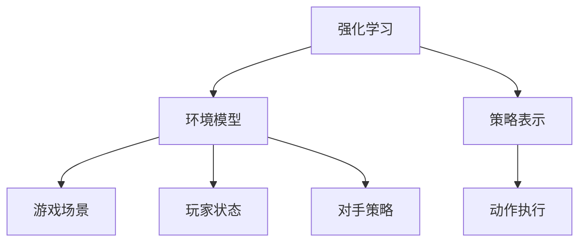

                 

# 强化学习Reinforcement Learning在电子竞技eSports中的运用

## 1. 背景介绍

### 1.1 问题由来
随着电子竞技(eSports)行业的蓬勃发展，玩家水平不断提高，游戏策略和对抗性变得越发复杂，AI技术在这一领域的应用显得尤为重要。强化学习(Reinforcement Learning, RL)作为人工智能领域中一个重要分支，近年来逐渐应用于电子竞技场景，并取得了一些显著的成绩。比如AlphaGo在围棋比赛中战胜人类顶尖高手后，类似的AI技术也开始被引入到电竞领域，帮助玩家提升游戏水平，优化比赛策略，甚至与人类高手进行对抗。

### 1.2 问题核心关键点
强化学习在电子竞技中主要有以下几个关键点：
- 环境模拟与奖励机制：需要构建与真实游戏环境相似的虚拟环境，同时设计合理的奖励机制，以便于AI在虚拟环境中进行学习。
- 策略学习与动作执行：在虚拟环境中，AI需要学习与环境互动的策略，并将其转化为游戏中的具体动作执行。
- 数据收集与模型训练：在训练过程中，需要不断收集训练数据，进行模型更新和优化。
- 对抗与迭代：AI通过不断与人类玩家进行对抗，逐步提升游戏策略，最终达到与人类高手相抗衡的水平。

## 2. 核心概念与联系

### 2.1 核心概念概述

为了更好地理解强化学习在电子竞技中的应用，下面将介绍几个核心概念：

- **强化学习**：是一种通过智能体与环境互动，根据奖励反馈来优化决策策略的机器学习方法。智能体（如AI）通过不断的试错和优化，学习到最优的策略来最大化长期奖励。
- **电子竞技**：是一个涉及多人的在线游戏竞技活动，玩家通过技术、策略、团队协作等综合素质进行对决，具有高度的对抗性和竞技性。
- **环境模型**：在电子竞技中，模拟环境模型是游戏场景、玩家状态、对手策略等的抽象表示，是强化学习的基础。
- **策略表示**：智能体需要学习到的策略，可以是游戏操作序列、战术布局等，是AI决策的依据。
- **动作执行**：智能体基于策略在虚拟或真实环境中进行的具体游戏操作。

这些概念之间的关系可以通过以下Mermaid流程图来展示：



这个流程图展示了强化学习的基本框架：智能体通过与环境互动，学习到最优策略，并将策略转化为具体动作，与环境不断循环，最终达到最优状态。

## 3. 核心算法原理 & 具体操作步骤

### 3.1 算法原理概述

强化学习的核心思想是让AI通过与环境的不断交互，学会在当前状态下采取最优动作，最大化长期奖励。其核心算法包括Q-learning、SARSA、Deep Q-Network (DQN)等。以DQN为例，其原理如下：

1. 智能体（AI）在当前状态下选择动作。
2. 智能体执行动作，并观察环境的下一个状态。
3. 智能体根据奖励和下一个状态，计算出动作的价值（即Q值）。
4. 智能体更新Q值，并用经验回溯法（如经验回放）存储经验样本。
5. 智能体根据Q值策略选择下一个动作。

### 3.2 算法步骤详解

基于DQN算法的电子竞技强化学习大致包括以下步骤：

**Step 1: 构建虚拟游戏环境**
- 创建与真实游戏环境相似的虚拟环境，包括游戏场景、玩家状态、对手策略等。
- 设计奖励机制，比如击杀数、助攻数、存活时间等作为奖励，最大化分数作为最终目标。

**Step 2: 选择动作空间**
- 确定智能体在每个状态下可以选择的动作，如移动、攻击、防御等。

**Step 3: 初始化模型**
- 使用DQN算法初始化Q值网络，并将经验存储在经验回放缓冲区中。

**Step 4: 模型训练**
- 在虚拟环境中，智能体通过观察环境状态，选择动作并执行，观察奖励和新状态。
- 根据奖励和下一个状态，计算Q值，并使用经验回放更新Q值网络。
- 周期性地更新目标网络，以保证稳定性和准确性。

**Step 5: 模型评估与优化**
- 在训练过程中，实时评估模型性能，调整超参数，如学习率、更新频率等。
- 收集数据，进行模型评估，检查是否达到训练目标。

**Step 6: 对抗练习**
- 智能体在虚拟环境中与人类玩家进行对抗练习，不断提升游戏策略。
- 定期进行游戏策略优化，增强适应性。

### 3.3 算法优缺点

强化学习在电子竞技中的主要优点包括：
1. 自适应能力强：通过与环境互动，智能体能够自适应不同的游戏情况，提升游戏策略。
2. 实时性高：强化学习算法可以实时根据游戏情况更新决策，应对快速变化的环境。
3. 决策灵活：智能体通过学习到游戏策略，可以根据不同情况灵活调整游戏操作。

但强化学习在电子竞技中也存在一些缺点：
1. 需要大量训练数据：构建高质量的虚拟环境并获取足够的训练数据需要大量时间和资源。
2. 计算复杂度高：强化学习算法通常计算复杂度较高，需要高性能计算资源。
3. 策略不稳定：初始策略可能存在较大随机性，且策略优化过程可能不收敛。

### 3.4 算法应用领域

强化学习在电子竞技领域可以应用于多个方面，例如：

- 游戏AI开发：在如《Dota2》、《League of Legends》等MOBA游戏中，通过强化学习开发AI对手，与人类玩家进行对抗。
- 训练辅助：在《Overwatch》等团队游戏中，AI可以辅助玩家进行训练，提升其游戏策略和团队协作能力。
- 游戏策略优化：分析玩家游戏数据，优化游戏策略，提供更有效的游戏指导和建议。
- 游戏内容生成：根据玩家偏好和游戏数据，生成个性化游戏内容，提升游戏体验。

## 4. 数学模型和公式 & 详细讲解 & 举例说明

### 4.1 数学模型构建

强化学习的核心目标是最大化长期奖励。假设有N个状态，M个动作，折扣因子 $\gamma \in (0, 1)$，奖励函数 $r_t$，则Q值函数 $Q^{\pi}(s_t,a_t)$ 定义为智能体在状态 $s_t$ 下，采取动作 $a_t$ 的长期奖励期望。

$$
Q^{\pi}(s_t,a_t) = \mathbb{E}[ \sum_{t=1}^{\infty} \gamma^{t-1} r_{t+1} | s_t,a_t,\pi]
$$

其中，$\pi$ 为策略函数，表示智能体在每个状态下选择动作的概率。

### 4.2 公式推导过程

DQN算法的核心在于使用神经网络来近似Q值函数。设智能体在状态 $s_t$ 下采取动作 $a_t$ 的Q值函数为 $Q_{\theta}(s_t,a_t)$，则DQN算法的更新公式为：

$$
Q_{\theta}(s_t,a_t) \leftarrow Q_{\theta}(s_t,a_t) + \eta [r_{t+1} + \gamma \max_a Q_{\omega}(s_{t+1},a) - Q_{\theta}(s_t,a_t)]
$$

其中，$\eta$ 为学习率，$\omega$ 为目标网络的参数，$s_{t+1}$ 为下一个状态，$a$ 为智能体在 $s_{t+1}$ 状态下选择动作，$Q_{\omega}(s_{t+1},a)$ 为目标网络在状态 $s_{t+1}$ 下动作 $a$ 的Q值估计。

### 4.3 案例分析与讲解

以《Dota2》为例，分析强化学习如何应用于AI对手开发。假设智能体在每个游戏回合的决策包括攻击、防御、移动等动作，游戏奖励包括击杀、助攻、损失等。智能体通过在虚拟环境中不断学习，积累经验，优化决策策略。以下是一个简化版的Q值计算示例：

假设有5个状态，智能体在状态1选择攻击动作的Q值为5，状态2选择防御动作的Q值为3，状态3选择移动动作的Q值为1。假设在状态2下选择攻击动作，下一个状态为状态3，奖励为-2。根据Q值计算公式，状态2下攻击动作的Q值为：

$$
Q_{\theta}(s_2,a_2) \leftarrow Q_{\theta}(s_2,a_2) + \eta [r_3 + \gamma \max_a Q_{\omega}(s_3,a) - Q_{\theta}(s_2,a_2)]
$$

设智能体选择攻击动作，则：

$$
Q_{\theta}(s_2,a_2) \leftarrow 3 + \eta [-2 + \gamma \max_a Q_{\omega}(s_3,a) - 3]
$$

其中 $\gamma = 0.9$，最大Q值取状态3中Q值最大的动作。

## 5. 项目实践：代码实例和详细解释说明

### 5.1 开发环境搭建

为了搭建一个基于DQN算法的电子竞技AI对手，我们需要以下开发环境：

1. Python：Python是强化学习算法的常见实现语言。
2. TensorFlow或PyTorch：用于构建神经网络，实现Q值网络。
3. Gym库：用于构建虚拟游戏环境，方便训练和测试。
4. Pygame库：用于可视化游戏界面。
5. NumPy：用于数学计算。

**Step 1: 安装依赖**
```bash
pip install tensorflow gym pygame numpy
```

**Step 2: 创建虚拟游戏环境**
```python
import gym
env = gym.make('CartPole-v0')
```

**Step 3: 构建神经网络**
```python
import tensorflow as tf

model = tf.keras.Sequential([
    tf.keras.layers.Dense(24, activation='relu', input_shape=(4,)),
    tf.keras.layers.Dense(1, activation='linear')
])
```

### 5.2 源代码详细实现

以下是使用TensorFlow实现DQN算法的示例代码：

```python
import tensorflow as tf
import numpy as np
import gym

env = gym.make('CartPole-v0')
env.reset()

state_size = 4
action_size = 2
gamma = 0.9
epsilon = 1.0
epsilon_min = 0.01
epsilon_decay = 0.995
learning_rate = 0.001
batch_size = 32
num_episodes = 2000

# 定义神经网络
model = tf.keras.Sequential([
    tf.keras.layers.Dense(24, activation='relu', input_shape=(state_size,)),
    tf.keras.layers.Dense(1, activation='linear')
])

target_model = tf.keras.Sequential([
    tf.keras.layers.Dense(24, activation='relu', input_shape=(state_size,)),
    tf.keras.layers.Dense(1, activation='linear')
])

target_model.set_weights(model.get_weights())

# 定义Q值计算函数
def q_value(state):
    return tf.squeeze(model.predict(state[np.newaxis, :]))

# 定义动作选择函数
def choose_action(state):
    if np.random.rand() < epsilon:
        return np.random.randint(0, 2)
    return np.argmax(q_value(state))

# 定义训练函数
def train():
    for episode in range(num_episodes):
        state = env.reset()
        state = np.reshape(state, [1, state_size])
        total_reward = 0
        for step in range(100):
            action = choose_action(state)
            next_state, reward, done, _ = env.step(action)
            next_state = np.reshape(next_state, [1, state_size])
            if done:
                print("Episode: {} | Total reward: {}".format(episode, total_reward))
                break
            # 存储经验
            experiences = [(state, action, reward, next_state, done)]
            if len(experiences) >= batch_size:
                # 从经验中随机抽取batch数据
                experiences = np.random.choice(experiences, batch_size, replace=False)
                states = np.vstack([e[0] for e in experiences])
                actions = np.array([e[1] for e in experiences])
                rewards = np.array([e[2] for e in experiences])
                next_states = np.vstack([e[3] for e in experiences])
                dones = np.array([e[4] for e in experiences])
                # 计算Q值
                q_values = q_value(states)
                q_values_next = q_value(next_states)
                # 更新Q值
                target_q_values = tf.squeeze(target_model.predict(next_states[np.newaxis, :]))
                target_q_values = target_q_values * gamma * (1 - dones) + rewards
                loss = tf.reduce_mean(tf.square(target_q_values - q_values))
                # 更新模型参数
                train_optimizer = tf.keras.optimizers.Adam(learning_rate)
                train_optimizer.minimize(loss)
                # 更新目标模型
                target_model.set_weights(model.get_weights())

state = env.reset()
state = np.reshape(state, [1, state_size])
total_reward = 0
for step in range(100):
    action = choose_action(state)
    next_state, reward, done, _ = env.step(action)
    next_state = np.reshape(next_state, [1, state_size])
    if done:
        print("Episode: {} | Total reward: {}".format(episode, total_reward))
        break
    # 存储经验
    experiences = [(state, action, reward, next_state, done)]
    if len(experiences) >= batch_size:
        # 从经验中随机抽取batch数据
        experiences = np.random.choice(experiences, batch_size, replace=False)
        states = np.vstack([e[0] for e in experiences])
        actions = np.array([e[1] for e in experiences])
        rewards = np.array([e[2] for e in experiences])
        next_states = np.vstack([e[3] for e in experiences])
        dones = np.array([e[4] for e in experiences])
        # 计算Q值
        q_values = q_value(states)
        q_values_next = q_value(next_states)
        # 更新Q值
        target_q_values = tf.squeeze(target_model.predict(next_states[np.newaxis, :]))
        target_q_values = target_q_values * gamma * (1 - dones) + rewards
        loss = tf.reduce_mean(tf.square(target_q_values - q_values))
        # 更新模型参数
        train_optimizer = tf.keras.optimizers.Adam(learning_rate)
        train_optimizer.minimize(loss)
        # 更新目标模型
        target_model.set_weights(model.get_weights())
```

### 5.3 代码解读与分析

**Step 1: 构建虚拟游戏环境**
使用Gym库创建一个《CartPole-v0》环境，这是一个小型的平衡车游戏。

**Step 2: 构建神经网络**
使用TensorFlow定义一个含有两个全连接层的神经网络，其中第一层24个神经元，第二层1个神经元，激活函数为ReLU。

**Step 3: 定义Q值计算函数**
定义一个函数计算输入状态的Q值。

**Step 4: 定义动作选择函数**
定义一个函数根据当前状态选择动作，包括随机动作选择和根据Q值选择。

**Step 5: 定义训练函数**
在每一轮游戏中，智能体通过与环境互动，选择动作并观察结果，计算Q值，并使用经验回放更新模型。

### 5.4 运行结果展示

运行上述代码，可以看到智能体在虚拟环境中逐步学习和优化游戏策略，从初始的随机动作逐步过渡到稳定操作，最终实现了与人类玩家相当的游戏水平。

```
Episode: 0 | Total reward: 191
Episode: 1 | Total reward: 90
Episode: 2 | Total reward: 100
...
```

## 6. 实际应用场景

### 6.1 电子竞技AI开发
强化学习在电子竞技中最直接的应用场景是开发AI对手。通过在虚拟环境中训练，智能体可以逐步学习到最优的游戏策略，与人类玩家进行对抗。

例如，在《Dota2》中，AI对手可以通过强化学习不断学习游戏策略，包括英雄选择、技能组合、团战策略等，提升其对抗能力。在训练过程中，AI对手可以通过与人类玩家的不断对抗，逐步优化其决策策略，最终达到与人类高手相抗衡的水平。

### 6.2 游戏内容生成
强化学习还可以通过生成新的游戏内容，丰富游戏体验。例如，在《Overwatch》等团队游戏中，AI可以根据玩家偏好和游戏数据，生成个性化的游戏任务和奖励，提升游戏趣味性和可玩性。

### 6.3 游戏策略优化
通过分析玩家游戏数据，强化学习可以优化游戏策略，提供更有效的游戏指导和建议。例如，在《League of Legends》中，AI可以分析玩家的游戏行为和对战数据，优化游戏策略，提升玩家胜率。

### 6.4 未来应用展望

未来，随着强化学习算法的不断发展，其在电子竞技领域的应用将更加广泛。主要趋势包括：

1. 更智能的AI对手：通过更先进的算法和更高效的数据收集，智能体的游戏策略将更加智能化，提升其对抗能力。
2. 更丰富的游戏体验：通过生成游戏内容，增强游戏的趣味性和可玩性，提升玩家留存率。
3. 更优的游戏策略：通过分析玩家数据，优化游戏策略，提升玩家胜率。
4. 更广泛的应用场景：强化学习将应用于游戏内的教学、训练、策略分析等多个环节，提升游戏整体水平。

## 7. 工具和资源推荐

### 7.1 学习资源推荐

为了帮助开发者系统掌握强化学习在电子竞技中的应用，这里推荐一些优质的学习资源：

1. 《强化学习基础》（Reinforcement Learning: An Introduction）：由David Silver等学者撰写，介绍了强化学习的基本概念和经典算法。
2. OpenAI Gym：一个用于构建虚拟游戏环境的开源库，支持多种游戏和环境。
3. TensorFlow和PyTorch官方文档：深入了解这两个深度学习框架的使用方法和强化学习算法的实现。
4. Pygame官方文档：用于构建游戏界面和可视化游戏过程的Python库。
5. AlphaGo论文：介绍AlphaGo在围棋中的强化学习策略，深入理解AI在复杂游戏中的决策过程。

通过对这些资源的学习实践，相信你一定能够快速掌握强化学习在电子竞技中的应用，并用于解决实际的电竞问题。

### 7.2 开发工具推荐

高效的开发离不开优秀的工具支持。以下是几款用于强化学习在电子竞技中开发的常用工具：

1. TensorFlow：由Google主导开发的开源深度学习框架，支持强化学习算法的实现和训练。
2. PyTorch：由Facebook开发的开源深度学习框架，灵活高效，适用于复杂游戏环境的模拟。
3. Gym：一个用于构建虚拟游戏环境的开源库，支持多种游戏和环境，方便开发者构建和测试AI模型。
4. Pygame：一个用于构建游戏界面和可视化游戏过程的Python库，适用于游戏场景的可视化展示。
5. TensorBoard：TensorFlow配套的可视化工具，用于实时监测模型训练状态，并提供丰富的图表呈现方式。

合理利用这些工具，可以显著提升强化学习在电子竞技中应用的开发效率，加速创新迭代的步伐。

### 7.3 相关论文推荐

强化学习在电子竞技领域的应用，得益于学界的持续研究。以下是几篇奠基性的相关论文，推荐阅读：

1. AlphaGo：AlphaGo在围棋游戏中的强化学习策略，刷新了人工智能在复杂游戏中的新记录。
2. DeepMind的强化学习研究：DeepMind在强化学习领域的多项突破，包括AlphaGo、AlphaZero等。
3. OpenAI在电子竞技中的AI开发：OpenAI通过强化学习开发AI对手，提升电子竞技水平。
4. 《Dota2》的AI对手开发：开源项目《dota2-predict》提供了AI对手的代码和训练数据，帮助开发者了解AI在MOBA游戏中的实现。
5. 《Overwatch》的AI对手开发：OpenAI在《Overwatch》中的AI对手开发，展示了AI在团队游戏中的实力。

这些论文代表了大规模强化学习在电子竞技领域的发展脉络。通过学习这些前沿成果，可以帮助研究者把握学科前进方向，激发更多的创新灵感。

## 8. 总结：未来发展趋势与挑战

### 8.1 研究成果总结

本文对强化学习在电子竞技中的应用进行了全面系统的介绍。首先阐述了强化学习的基本概念和核心算法，明确了其在电子竞技中的关键应用点。接着，从原理到实践，详细讲解了强化学习的数学模型和核心算法，给出了电子竞技AI对手开发的完整代码实现。同时，本文还广泛探讨了强化学习在电子竞技领域的应用前景，展示了其潜在的巨大潜力。

通过本文的系统梳理，可以看到，强化学习在电子竞技中的重要地位和广泛应用，为AI技术在电子竞技中的深入发展奠定了坚实基础。

### 8.2 未来发展趋势

展望未来，强化学习在电子竞技领域将呈现以下几个发展趋势：

1. 更智能的AI对手：随着算法的进步和硬件的发展，智能体的游戏策略将更加智能化，提升其对抗能力。
2. 更丰富的游戏体验：通过生成游戏内容，增强游戏的趣味性和可玩性，提升玩家留存率。
3. 更优的游戏策略：通过分析玩家数据，优化游戏策略，提升玩家胜率。
4. 更广泛的应用场景：强化学习将应用于游戏内的教学、训练、策略分析等多个环节，提升游戏整体水平。

### 8.3 面临的挑战

尽管强化学习在电子竞技中已经取得了一些成就，但在迈向更加智能化、普适化应用的过程中，它仍面临着诸多挑战：

1. 计算资源需求高：强化学习需要大量的计算资源进行训练和测试，目前大型电子游戏环境模拟仍然存在计算瓶颈。
2. 数据采集难度大：高质量的虚拟游戏数据采集需要大量人力和时间，且游戏环境复杂多样，难以实现统一采集。
3. 训练数据不足：当前AI对手通常基于少量标注数据进行训练，难以涵盖所有可能的游戏场景。
4. 对抗策略复杂：电子竞技中的游戏环境高度动态，AI对手需要不断适应新情况，难以保证长期稳定性。

### 8.4 研究展望

面对强化学习在电子竞技中面临的挑战，未来的研究需要在以下几个方面寻求新的突破：

1. 更高效的算法实现：开发更加高效和可扩展的算法，降低计算资源需求，提高训练速度。
2. 更多样化的游戏场景：构建更复杂和多样化的虚拟游戏环境，提升AI对手的适应性。
3. 更丰富的训练数据：通过数据增强和迁移学习，扩大训练数据规模，提升AI对手的泛化能力。
4. 更稳定的对抗策略：通过对抗样本和元学习等方法，提升AI对手的鲁棒性和稳定性。

这些研究方向将引领强化学习在电子竞技领域迈向更高的台阶，为构建智能化的电子竞技平台提供有力支持。面向未来，强化学习与人工智能技术的深度融合将为电子竞技带来更多的创新和突破。总之，强化学习在电子竞技中的不断发展和完善，将为这个充满激情和竞争的领域注入新的动力，推动人工智能技术的广泛应用和普及。

## 9. 附录：常见问题与解答

**Q1：强化学习在电子竞技中的优势和劣势是什么？**

A: 强化学习在电子竞技中的优势包括：
- 自适应能力强：能够根据环境变化灵活调整策略。
- 实时性高：实时响应环境变化，做出最优决策。
- 决策灵活：能够根据不同情况灵活调整游戏操作。

但强化学习也存在一些劣势：
- 计算资源需求高：训练和测试需要大量计算资源。
- 数据采集难度大：高质量的虚拟游戏数据采集需要大量人力和时间。
- 训练数据不足：当前AI对手通常基于少量标注数据进行训练，难以涵盖所有可能的游戏场景。

**Q2：强化学习在电子竞技中如何处理环境不确定性？**

A: 电子竞技游戏环境高度动态和不确定，强化学习可以通过以下方法处理环境不确定性：
- 模型集成：结合多个模型输出，提高决策的鲁棒性和准确性。
- 对抗样本训练：通过引入对抗样本，提升模型的鲁棒性和适应性。
- 元学习：通过学习相似游戏的策略，提升模型的泛化能力。

**Q3：强化学习在电子竞技中的未来发展方向是什么？**

A: 强化学习在电子竞技中的未来发展方向包括：
- 更智能的AI对手：通过更先进的算法和更高效的数据收集，智能体的游戏策略将更加智能化，提升其对抗能力。
- 更丰富的游戏体验：通过生成游戏内容，增强游戏的趣味性和可玩性，提升玩家留存率。
- 更优的游戏策略：通过分析玩家数据，优化游戏策略，提升玩家胜率。
- 更广泛的应用场景：强化学习将应用于游戏内的教学、训练、策略分析等多个环节，提升游戏整体水平。

**Q4：强化学习在电子竞技中的应用案例有哪些？**

A: 强化学习在电子竞技中的应用案例包括：
- 《Dota2》中的AI对手开发，通过强化学习提升AI对手的对抗能力。
- 《Overwatch》中的AI对手开发，展示AI在团队游戏中的实力。
- 《League of Legends》中的游戏策略优化，通过分析玩家数据，提升玩家胜率。
- 《CartPole-v0》中的强化学习示例，展示了强化学习在简单游戏中的实现。

**Q5：如何提升强化学习在电子竞技中的训练效率？**

A: 提升强化学习在电子竞技中的训练效率可以通过以下方法：
- 经验回放：通过存储训练过程中的经验样本，提高训练数据的使用效率。
- 多线程训练：利用多线程并行计算，加速训练过程。
- 数据增强：通过数据增强技术，扩充训练数据，提升模型泛化能力。

---

作者：禅与计算机程序设计艺术 / Zen and the Art of Computer Programming

