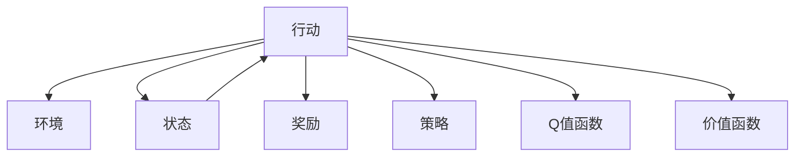
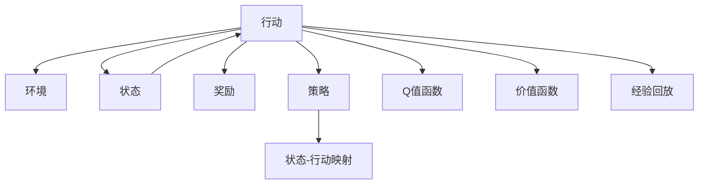

                 

## 1. 背景介绍

### 1.1 问题由来

强化学习(Reinforcement Learning, RL)是机器学习领域的一类重要技术，通过与环境的交互，智能体(Agent)学会如何在特定环境中采取最优行动策略。与监督学习和无监督学习不同，强化学习中的模型不是直接从数据中学习标签，而是通过试错过程，在不断的交互中逐步优化策略。

近年来，强化学习技术在自动驾驶、机器人控制、游戏AI等众多领域取得了显著进展，为智能系统的决策能力带来了质的飞跃。但与传统机器学习算法相比，强化学习的模型验证和测试工作也显得更加复杂和困难。

本文聚焦于强化学习模型的验证与测试方法，阐述了强化学习算法在实际应用中面临的挑战，探讨了如何设计有效的验证与测试框架，以评估模型的性能和可靠性，指导模型的优化和部署。

### 1.2 问题核心关键点

强化学习模型的验证与测试关键点包括：

- 定义明确的目标和性能指标：如何评估模型在不同环境下的表现？
- 构建合适的环境与数据集：如何在特定场景下构造测试用例？
- 设计有效的评估方法：如何衡量模型的鲁棒性和泛化能力？
- 测试和验证相结合：如何在模型开发过程中进行持续测试？
- 自动化与可视化：如何利用技术手段简化测试过程？

## 2. 核心概念与联系

### 2.1 核心概念概述

为了更好地理解强化学习模型的验证与测试，首先需要介绍几个关键概念：

- **智能体(Agent)**：强化学习中的决策者，通过与环境交互学习最优策略。
- **环境(Environment)**：智能体所处的动态系统，提供状态、奖励和行动空间。
- **状态(State)**：环境当前的状态，智能体需根据状态选择行动。
- **行动(Action)**：智能体对环境的控制策略，可以采取的不同行动。
- **奖励(Reward)**：智能体采取行动后的反馈，用于评估策略的好坏。
- **策略(Policy)**：智能体选择行动的规则，如确定性策略、随机策略等。
- **Q值函数(Q-value Function)**：每个状态-行动对的累积奖励期望。
- **价值函数(Value Function)**：每个状态或行动的累积奖励期望。

这些概念构成了强化学习的基本框架，其间的相互作用可以通过以下Mermaid流程图表示：



### 2.2 核心概念原理和架构的 Mermaid 流程图



## 3. 核心算法原理 & 具体操作步骤

### 3.1 算法原理概述

强化学习模型的验证与测试通常采用交叉验证(Cross Validation)和A/B测试等方法。通过构建多个虚拟环境，评估模型在不同环境中的性能，最终综合各项指标，得出模型的鲁棒性和泛化能力。

#### 3.2 算法步骤详解

1. **构建虚拟环境**：根据实际应用场景构造多个虚拟环境，确保环境的多样性和复杂性，以覆盖模型可能面临的各种情况。
2. **收集测试数据**：在每个环境中，随机生成一组测试数据，用于评估模型在不同场景下的表现。
3. **模型训练与测试**：使用测试数据集对模型进行验证，记录模型在每个环境下的各项性能指标，如平均累积奖励、策略稳定性等。
4. **结果分析与评估**：对各环境的测试结果进行统计分析，评估模型的性能和泛化能力，并寻找可能的改进方向。
5. **迭代优化**：根据评估结果，返回模型进行微调或重新设计策略，进入下一轮测试循环。

### 3.3 算法优缺点

强化学习模型验证与测试的优点包括：

- 全面覆盖多种场景：虚拟环境可以模拟不同程度的不确定性和复杂性，使模型在更多情况下表现良好。
- 动态评估策略性能：通过不断测试和反馈，智能体能够持续优化策略，避免陷入局部最优解。
- 数据驱动的决策：测试结果基于实际数据，而非理论假设，更能反映模型的真实性能。

其缺点主要体现在：

- 资源消耗大：构建和测试多个虚拟环境需要大量计算资源，不适合低计算能力环境。
- 难以控制条件：虚拟环境难以完全模拟真实场景，可能存在偏差。
- 测试时间较长：模型训练和测试过程耗时较长，需要耐心和细致的工作。

### 3.4 算法应用领域

强化学习模型验证与测试广泛应用于以下领域：

- **自动驾驶**：通过虚拟驾驶环境测试无人车决策策略，评估其在复杂交通情况下的安全性和稳定性。
- **机器人控制**：在虚拟环境中测试机器人动作规划和避障策略，提升其在实际场景中的操作能力。
- **游戏AI**：在虚拟游戏环境中测试AI角色决策，评估其游戏策略和竞技水平。
- **推荐系统**：通过模拟用户行为，测试推荐算法在不同用户群体中的表现，优化个性化推荐效果。
- **供应链管理**：构建虚拟供应链环境，测试优化算法在不同市场条件下的适应性和效率。

## 4. 数学模型和公式 & 详细讲解 & 举例说明

### 4.1 数学模型构建

强化学习模型的验证与测试通常通过以下数学模型进行：

- **状态-行动空间**：记为 $(S,A)$，状态和行动的集合。
- **状态转移概率**：记为 $P(s'|s,a)$，根据当前状态和行动，下一个状态的概率分布。
- **奖励函数**：记为 $R(s,a)$，每个状态-行动对的即时奖励。
- **策略函数**：记为 $\pi(a|s)$，智能体根据当前状态选择行动的概率分布。
- **价值函数**：记为 $V(s)$ 或 $Q(s,a)$，状态或状态-行动对的价值函数。

### 4.2 公式推导过程

以策略梯度算法(SG)为例，其核心公式为：

$$
\theta_{t+1} = \theta_t + \alpha_t \nabla_{\theta} \mathbb{E}_{s_t,\pi} \left[ \sum_{t'}^{T} \gamma^{t'} R(s_{t'},a_{t'},\pi) \right]
$$

其中 $\theta$ 为模型参数，$\alpha_t$ 为学习率，$\nabla_{\theta}$ 为参数梯度，$\mathbb{E}$ 为对策略的期望，$T$ 为时间步上限，$\gamma$ 为折扣因子。

该公式表示在时间步 $t$，根据当前状态 $s_t$ 和策略 $\pi$，预测未来时间步内所有行动的期望累积奖励，然后对策略进行微调，以最大化累积奖励。

### 4.3 案例分析与讲解

考虑一个简单迷宫问题，智能体需要从起点出发，避开障碍，到达终点。环境由多个网格组成，每个网格有一个状态 $s$ 和一个行动 $a$，行动 $a$ 包括向左、向右、向上、向下四个方向。

在每个状态 $s$ 下，智能体可以选择行动 $a$，根据行动和状态转移概率 $P(s'|s,a)$ 更新到下一个状态 $s'$。每个状态 $s'$ 都有一个即时奖励 $R(s')$，例如 $R(\text{起点}) = 0$，$R(\text{终点}) = 1$，$R(\text{障碍}) = -1$。

智能体可以采取行动 $a$ 的概率分布为 $\pi(a|s)$，目标是在给定环境 $E$ 下，选择最优策略 $\pi^*$，使得：

$$
\pi^* = \mathop{\arg\min}_{\pi} \mathbb{E}_{s \sim \pi} \left[ \sum_{t=0}^{T-1} \gamma^t R(s_t,\pi) \right]
$$

其中 $s \sim \pi$ 表示状态 $s$ 根据策略 $\pi$ 被抽取，$T$ 为终止时间步。

通过模拟多个随机环境，测试智能体在不同策略下的表现，评估其策略的稳定性和优化效果。例如，可以使用Monte Carlo方法在每个环境中随机生成多个测试序列，计算智能体的平均累积奖励，统计策略在不同状态下的表现，从而评估其鲁棒性和泛化能力。

## 5. 项目实践：代码实例和详细解释说明

### 5.1 开发环境搭建

为了进行强化学习模型的验证与测试，需要准备以下开发环境：

1. **安装Python**：
```bash
sudo apt-get update
sudo apt-get install python3
```

2. **安装必要的Python库**：
```bash
pip install gym
pip install numpy
pip install matplotlib
```

3. **配置环境变量**：
```bash
export PYTHONPATH=$PYTHONPATH:/path/to/my_project
```

### 5.2 源代码详细实现

以下是一个简单的基于DQN算法验证与测试的示例代码，其中使用Gym环境进行测试：

```python
import gym
import numpy as np
import matplotlib.pyplot as plt

env = gym.make('CartPole-v0')

# 定义模型参数
num_states = env.observation_space.shape[0]
num_actions = env.action_space.n

# 定义DQN模型
class DQNModel:
    def __init__(self, num_states, num_actions):
        self.num_states = num_states
        self.num_actions = num_actions
        self.model = np.zeros((num_states, num_actions))
        
    def act(self, state):
        return np.argmax(self.model[state])
    
    def update(self, state, action, reward, next_state, done):
        self.model[state, action] += self.learning_rate * (reward + self.gamma * self.model[next_state].max() - self.model[state, action])

# 定义测试函数
def test_dqn(model, num_episodes, learning_rate=0.1, gamma=0.9):
    scores = []
    for episode in range(num_episodes):
        state = env.reset()
        score = 0
        done = False
        while not done:
            action = model.act(state)
            next_state, reward, done, _ = env.step(action)
            model.update(state, action, reward, next_state, done)
            score += reward
            state = next_state
        scores.append(score)
    return np.mean(scores)

# 设置测试参数
num_episodes = 100
num_states = env.observation_space.shape[0]
num_actions = env.action_space.n
gamma = 0.9
learning_rate = 0.1

# 创建DQN模型
model = DQNModel(num_states, num_actions)

# 测试模型
scores = test_dqn(model, num_episodes, learning_rate=learning_rate, gamma=gamma)
plt.plot(scores)
plt.show()
```

### 5.3 代码解读与分析

在上述代码中，我们首先使用Gym创建了一个简单的CartPole环境，然后定义了一个DQN模型，并实现了其训练和测试方法。

**DQNModel类**：
- 初始化时，随机生成一个$Q$值矩阵，大小为状态-行动空间。
- `act`方法：根据当前状态，返回最优行动。
- `update`方法：使用TD误差更新$Q$值，$TD$误差为即时奖励与未来$Q$值的折现和之差。

**test_dqn函数**：
- 遍历每个测试集，根据模型进行动作选择，并在每次行动后更新模型。
- 记录每个测试集的总得分，返回平均得分。

**测试参数设置**：
- `num_episodes`：测试集数量。
- `num_states`：状态空间维度。
- `num_actions`：行动空间大小。
- `gamma`：折扣因子。
- `learning_rate`：学习率。

通过调用`test_dqn`函数，我们可以在多个测试集中评估模型的性能，并绘制出测试结果的曲线图。

## 6. 实际应用场景

### 6.1 自动驾驶

在自动驾驶领域，强化学习模型需要验证和测试其在各种交通和环境条件下的决策策略。例如，通过虚拟交通场景模拟，测试自动驾驶车辆在不同道路、天气、行人行为等情况下的行驶安全性和效率。

### 6.2 机器人控制

在机器人控制中，强化学习模型需要测试其在不同复杂度和不确定性的环境中，如何进行精确的避障和路径规划。例如，通过构建虚拟环境，测试机器人面对障碍物、动态目标时的应对策略。

### 6.3 游戏AI

在游戏AI中，强化学习模型需要测试其在游戏中的策略表现和对抗能力。例如，通过模拟游戏场景，测试AI角色在不同难度下的表现，评估其智能水平和适应性。

### 6.4 未来应用展望

随着强化学习技术的不断进步，其在更多领域的应用前景广阔。未来，强化学习模型验证与测试也将涵盖更多场景，包括但不限于：

- **医疗诊断**：测试智能诊断系统的诊断准确性和鲁棒性，在复杂病例中评估其决策能力。
- **金融分析**：验证智能投资系统的投资策略和风险管理能力，在不同市场条件下评估其稳定性。
- **供应链优化**：测试优化算法的适应性和效率，在不同供应链环境中评估其优化效果。

## 7. 工具和资源推荐

### 7.1 学习资源推荐

- **《Reinforcement Learning: An Introduction》书籍**：由Richard S. Sutton和Andrew G. Barto合著，全面介绍了强化学习的基本概念和算法。
- **DeepRLHackathon**：谷歌主办的强化学习竞赛平台，提供丰富的练习任务和实战经验。
- **OpenAI Gym**：用于创建和测试强化学习环境的Python库，提供多种环境和模型。
- **TensorFlow Agents**：TensorFlow深度学习框架的强化学习组件，支持多种算法和环境。

### 7.2 开发工具推荐

- **PyTorch**：灵活高效的深度学习框架，支持动态计算图和自动微分。
- **Gym**：用于创建和测试强化学习环境的Python库，支持多种环境和模型。
- **TensorFlow Agents**：TensorFlow深度学习框架的强化学习组件，支持多种算法和环境。
- **Vizdoom**：用于测试和可视化强化学习算法的工具，支持多种游戏环境。

### 7.3 相关论文推荐

- **Playing Atari with Deep Reinforcement Learning**：DeepMind的论文，展示了基于强化学习的Atari游戏AI。
- **Human-level Control through Deep Reinforcement Learning**：DeepMind的论文，展示了基于强化学习的机器人控制。
- **Mastering the Game of Go without Human Knowledge**：DeepMind的论文，展示了基于强化学习围棋AI。
- **AlphaZero: Mastering the Game of Go, Chess, and Shogi through Self-Play**：DeepMind的论文，展示了基于强化学习的多种游戏AI。

## 8. 总结：未来发展趋势与挑战

### 8.1 研究成果总结

强化学习模型的验证与测试是确保其性能和可靠性的重要步骤。本文详细介绍了强化学习模型的核心概念和验证测试框架，阐述了模型在实际应用中的挑战和应对方法。通过系统梳理，希望能为研究人员和实践者提供全面的指导。

### 8.2 未来发展趋势

未来，强化学习模型验证与测试将呈现以下发展趋势：

- **自动化与工具化**：利用自动化测试工具和框架，简化模型验证与测试流程，提升效率和可靠性。
- **多模态融合**：结合视觉、语音等多种数据源，提升模型在复杂环境中的感知和决策能力。
- **数据驱动的决策**：利用大规模真实数据进行模型训练和验证，提升模型泛化性和鲁棒性。
- **跨领域应用**：扩展强化学习模型在更多领域的应用，如医疗、金融、交通等，推动跨学科融合发展。
- **模型可解释性**：提升强化学习模型的可解释性，增强其决策透明性和可信赖度。

### 8.3 面临的挑战

尽管强化学习技术取得了巨大进展，但在模型验证与测试中仍面临诸多挑战：

- **计算资源消耗**：构建和测试多个虚拟环境需要大量计算资源，尤其是在大规模模型和高维空间中。
- **环境复杂性**：虚拟环境难以完全模拟真实场景，可能存在偏差。
- **模型鲁棒性**：强化学习模型容易受到噪声和环境变化的影响，导致策略失效。
- **参数优化**：强化学习模型参数复杂，难以进行高效的优化和调试。
- **模型可解释性**：强化学习模型决策过程复杂，缺乏可解释性。

### 8.4 研究展望

针对上述挑战，未来的研究需要：

- **资源优化**：探索更高效的模型训练和测试方法，降低计算资源消耗。
- **环境模拟**：构建更加逼真的虚拟环境，提高模型在不同场景中的适应性。
- **鲁棒性提升**：研究鲁棒性强化学习算法，提升模型在噪声和变化环境中的稳定性和可靠性。
- **参数优化**：开发高效的参数优化方法，减少调试时间和成本。
- **可解释性增强**：研究可解释性强化学习算法，增强模型决策过程的透明性和可理解性。

总之，强化学习模型的验证与测试是实现其广泛应用的关键步骤。未来需要从多个维度进行深入研究，才能构建出稳定、可靠、高效的强化学习系统。

## 9. 附录：常见问题与解答

### Q1: 强化学习模型验证与测试的具体流程是什么？

A: 强化学习模型的验证与测试流程主要包括：
1. 构建虚拟环境，模拟真实场景。
2. 随机生成测试集，进行模型训练与测试。
3. 记录测试结果，评估模型在不同环境中的表现。
4. 综合各项指标，得出模型的鲁棒性和泛化能力。
5. 返回模型进行优化，进入下一轮测试循环。

### Q2: 强化学习模型在测试过程中如何避免过拟合？

A: 强化学习模型在测试过程中可以通过以下方法避免过拟合：
1. 数据增强：通过回译、改写等方式，扩充训练集和测试集。
2. 正则化：使用L2正则、Dropout等技术，避免模型过度拟合。
3. 对抗训练：引入对抗样本，提高模型鲁棒性。
4. 参数高效微调：只调整部分参数，固定大部分预训练权重。
5. 模型集成：训练多个模型，取平均输出，抑制过拟合。

### Q3: 强化学习模型如何评估其鲁棒性和泛化能力？

A: 强化学习模型可以通过以下方法评估其鲁棒性和泛化能力：
1. 在不同环境中进行交叉验证，记录模型在不同环境中的表现。
2. 统计模型在不同状态下的表现，评估其稳定性。
3. 引入对抗样本和噪声，测试模型的鲁棒性。
4. 在实际应用场景中，持续收集数据，进行持续测试和优化。

### Q4: 强化学习模型验证与测试过程中需要考虑哪些因素？

A: 强化学习模型验证与测试过程中需要考虑以下因素：
1. 构建合适虚拟环境，确保环境多样性和复杂性。
2. 收集高质量测试数据，覆盖各种情况。
3. 设计有效评估方法，评估模型性能和泛化能力。
4. 考虑模型参数和计算资源消耗，优化测试过程。
5. 结合实际应用场景，持续收集数据进行测试和优化。

综上所述，强化学习模型的验证与测试是其成功应用的重要步骤，需要通过系统化的方法和工具，确保模型的性能和可靠性。

---

作者：禅与计算机程序设计艺术 / Zen and the Art of Computer Programming

