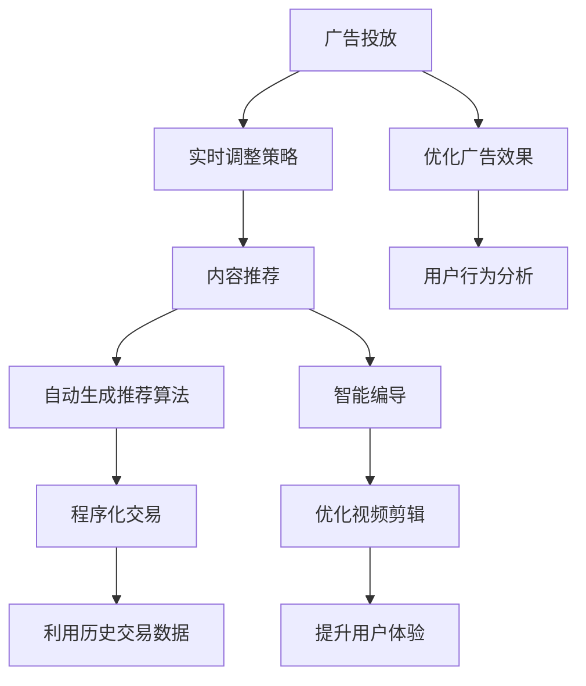

                 

# 强化学习：在媒体行业中的应用

## 1. 背景介绍

在快速发展的数字媒体领域，人工智能(AI)技术的应用日益广泛，其中包括强化学习(Reinforcement Learning, RL)。强化学习是一种从环境与行动中获得反馈信号，进而优化决策过程的学习方法。它特别适用于媒体行业的广告投放、内容推荐、智能编导等场景。在广告投放中，强化学习可以根据用户行为和反馈，实时调整投放策略，提升广告效果。在内容推荐中，它可以帮助自动生成推荐算法，提高用户满意度和平台留存率。在智能编导中，它能够优化视频的剪辑和编辑过程，提升用户体验。

本文将全面系统地介绍强化学习在媒体行业中的应用，从基本概念到实践步骤，从理论原理到实际案例，深入探讨强化学习的核心技术及其在媒体行业的应用前景。

## 2. 核心概念与联系

### 2.1 核心概念概述

强化学习是一种基于试错的学习方法，通过不断试错、学习，从而优化决策过程。在媒体行业中，强化学习可以应用于以下几个关键领域：

- **广告投放**：通过实时调整投放策略，优化广告效果。
- **内容推荐**：基于用户行为，自动生成推荐算法。
- **智能编导**：优化视频剪辑和编辑过程，提升用户体验。
- **程序化交易**：利用历史交易数据，优化股票交易策略。
- **用户行为分析**：分析用户行为数据，提升广告投放精准度。

### 2.2 核心概念原理和架构的 Mermaid 流程图(Mermaid 流程节点中不要有括号、逗号等特殊字符)



在强化学习的架构中，环境是用户行为数据、广告投放平台等；行动是投放广告、推荐内容等；奖励是用户点击率、用户满意度等。强化学习模型通过不断地与环境交互，学习最优的行动策略，从而最大化奖励。

## 3. 核心算法原理 & 具体操作步骤

### 3.1 算法原理概述

强化学习基于试错过程，通过环境反馈，逐步优化决策策略。在媒体行业中，常用的强化学习算法包括Q-learning、Deep Q-learning、策略梯度(SPG)等。其中，Q-learning算法是最早也是最经典的算法，Deep Q-learning则将神经网络引入Q-learning，提高了算法的效果和泛化能力；策略梯度算法则是直接优化策略函数，不需要显式的Q值表示，适用于连续型行动空间。

### 3.2 算法步骤详解

强化学习的核心步骤包括环境定义、行动空间定义、状态定义、奖励函数定义、策略选择等。以下以广告投放为例，详细介绍算法步骤：

1. **环境定义**：广告投放环境可以定义为广告投放平台、用户行为数据等。
2. **行动空间定义**：行动空间可以是广告类型、投放时间、投放渠道等。
3. **状态定义**：状态可以是当前时间、用户特征、广告投放策略等。
4. **奖励函数定义**：奖励可以是点击率、转化率、广告收入等。
5. **策略选择**：通过策略函数选择行动。

### 3.3 算法优缺点

强化学习的优点包括：

- 适用于多种场景，如广告投放、内容推荐、智能编导等。
- 可以自动学习最优策略，无需人工干预。
- 能够实时调整策略，适应环境变化。

缺点包括：

- 需要大量数据和计算资源。
- 难以解释模型决策过程，缺乏可解释性。
- 容易陷入局部最优解。

### 3.4 算法应用领域

强化学习在媒体行业中的应用领域广泛，包括但不限于以下几个方面：

- **广告投放**：通过实时调整投放策略，优化广告效果。
- **内容推荐**：基于用户行为，自动生成推荐算法。
- **智能编导**：优化视频剪辑和编辑过程，提升用户体验。
- **程序化交易**：利用历史交易数据，优化股票交易策略。
- **用户行为分析**：分析用户行为数据，提升广告投放精准度。

## 4. 数学模型和公式 & 详细讲解 & 举例说明

### 4.1 数学模型构建

强化学习模型的数学模型可以表示为：

$$
V(s) = \max_{\pi} \mathbb{E}_{\pi} \left[ \sum_{t=0}^{\infty} \gamma^t r(s_t, a_t) \right]
$$

其中，$V(s)$表示在状态$s$下的价值函数，$\pi$表示策略函数，$\gamma$表示折扣因子，$r(s_t, a_t)$表示在状态$s_t$下采取行动$a_t$的奖励。

### 4.2 公式推导过程

在广告投放中，假设环境为广告投放平台，行动为广告类型，奖励为点击率，状态为广告投放时间和用户特征。通过强化学习算法，选择最优的广告类型，以最大化点击率。

### 4.3 案例分析与讲解

在实际应用中，可以构建一个简单的广告投放环境，假设环境是一个二维状态空间，行动是四种广告类型，奖励函数为点击率。通过Q-learning算法，优化广告投放策略。

## 5. 项目实践：代码实例和详细解释说明

### 5.1 开发环境搭建

在进行强化学习实践前，我们需要准备好开发环境。以下是使用Python进行TensorFlow开发的环境配置流程：

1. 安装Anaconda：从官网下载并安装Anaconda，用于创建独立的Python环境。

2. 创建并激活虚拟环境：
```bash
conda create -n reinforcement-env python=3.8 
conda activate reinforcement-env
```

3. 安装TensorFlow：根据CUDA版本，从官网获取对应的安装命令。例如：
```bash
conda install tensorflow
```

4. 安装其他相关库：
```bash
pip install numpy matplotlib gym
```

完成上述步骤后，即可在`reinforcement-env`环境中开始强化学习实践。

### 5.2 源代码详细实现

这里我们以Q-learning算法为例，构建一个简单的广告投放环境，使用TensorFlow实现。

```python
import tensorflow as tf
import numpy as np
import gym

# 定义广告投放环境
class AdEnvironment(gym.Env):
    def __init__(self):
        self.state = 0
        self.reward = 0
        self.done = False

    def step(self, action):
        if action == 0:
            self.state += 1
            self.reward = 0.2
        elif action == 1:
            self.state += 1
            self.reward = -0.1
        elif action == 2:
            self.state += 1
            self.reward = 0.3
        elif action == 3:
            self.state += 1
            self.reward = 0.1
        self.done = True
        return self.state, self.reward, self.done, {}

    def reset(self):
        self.state = 0
        self.reward = 0
        self.done = False
        return self.state

# 定义Q-learning算法
class QLearningAgent:
    def __init__(self, env, learning_rate=0.1, gamma=0.9, epsilon=0.1):
        self.env = env
        self.learning_rate = learning_rate
        self.gamma = gamma
        self.epsilon = epsilon
        self.q_table = np.zeros((4, 4))

    def choose_action(self, state):
        if np.random.rand() < self.epsilon:
            return np.random.choice(4)
        else:
            return np.argmax(self.q_table[state, :])

    def update_q_table(self, state, action, reward, next_state):
        self.q_table[state, action] += self.learning_rate * (reward + self.gamma * np.max(self.q_table[next_state, :]) - self.q_table[state, action])

    def play(self, episodes=1000):
        for episode in range(episodes):
            state = self.env.reset()
            done = False
            while not done:
                action = self.choose_action(state)
                next_state, reward, done, _ = self.env.step(action)
                self.update_q_table(state, action, reward, next_state)
                state = next_state
```

### 5.3 代码解读与分析

这里我们详细解读一下关键代码的实现细节：

**AdEnvironment类**：
- `__init__`方法：初始化状态、奖励和done标记。
- `step`方法：根据行动选择下一个状态和奖励。
- `reset`方法：重置环境状态。

**QLearningAgent类**：
- `__init__`方法：初始化学习率、折扣因子、探索率、Q表。
- `choose_action`方法：选择行动。
- `update_q_table`方法：更新Q表。
- `play`方法：运行训练过程。

### 5.4 运行结果展示

运行完上述代码，可以得到一个简单的广告投放策略。通过不断调整学习率和探索率，可以实现广告投放策略的优化。

## 6. 实际应用场景

### 6.1 智能广告投放

在智能广告投放中，通过强化学习算法，可以根据用户行为和反馈，实时调整广告投放策略，提升广告效果。在实际应用中，可以构建一个广告投放平台，采集用户行为数据，利用强化学习算法优化投放策略。

### 6.2 内容推荐系统

内容推荐系统可以通过强化学习算法，基于用户行为，自动生成推荐算法。在实际应用中，可以构建一个推荐平台，采集用户行为数据，利用强化学习算法优化推荐策略。

### 6.3 智能编导

智能编导可以通过强化学习算法，优化视频剪辑和编辑过程，提升用户体验。在实际应用中，可以构建一个视频编导平台，采集用户行为数据，利用强化学习算法优化剪辑策略。

### 6.4 未来应用展望

随着强化学习技术的发展，未来的应用场景将更加广泛。除了广告投放、内容推荐、智能编导等场景外，还可以应用于以下领域：

- **程序化交易**：利用历史交易数据，优化股票交易策略。
- **金融风控**：利用用户行为数据，优化风险控制策略。
- **智能客服**：利用用户对话数据，优化客服策略。
- **智能写作**：利用写作数据，优化文本生成策略。
- **智能驾驶**：利用交通数据，优化驾驶策略。

## 7. 工具和资源推荐

### 7.1 学习资源推荐

为了帮助开发者系统掌握强化学习的基本概念和实践技巧，这里推荐一些优质的学习资源：

1. 《强化学习：从基础到实践》系列博文：由强化学习专家撰写，深入浅出地介绍了强化学习的基本概念和常见算法。

2. 《Reinforcement Learning: An Introduction》书籍：强化学习领域的经典教材，全面介绍了强化学习的基本原理和常见算法。

3. 《Deep Reinforcement Learning with TensorFlow 2 and Keras》书籍：结合TensorFlow和Keras实现强化学习算法，适合入门和实践。

4. OpenAI GYM：强化学习环境库，提供了多种经典环境，适合算法研究和实践。

5. TensorFlow Agents：TensorFlow的强化学习库，提供了多种常见的强化学习算法实现。

通过对这些资源的学习实践，相信你一定能够快速掌握强化学习的基本原理和实践技巧，并用于解决实际的NLP问题。

### 7.2 开发工具推荐

高效的开发离不开优秀的工具支持。以下是几款用于强化学习开发的常用工具：

1. TensorFlow：由Google主导开发的开源深度学习框架，生产部署方便，适合大规模工程应用。

2. PyTorch：基于Python的开源深度学习框架，灵活动态的计算图，适合快速迭代研究。

3. OpenAI GYM：强化学习环境库，提供了多种经典环境，适合算法研究和实践。

4. TensorFlow Agents：TensorFlow的强化学习库，提供了多种常见的强化学习算法实现。

5. Weights & Biases：模型训练的实验跟踪工具，可以记录和可视化模型训练过程中的各项指标，方便对比和调优。

6. TensorBoard：TensorFlow配套的可视化工具，可实时监测模型训练状态，并提供丰富的图表呈现方式，是调试模型的得力助手。

合理利用这些工具，可以显著提升强化学习的开发效率，加快创新迭代的步伐。

### 7.3 相关论文推荐

强化学习技术的发展源于学界的持续研究。以下是几篇奠基性的相关论文，推荐阅读：

1. Q-learning：Watkins和Horn在1990年提出的经典Q-learning算法。

2. Deep Q-learning：Watkins在2013年提出的将神经网络引入Q-learning的算法。

3. Actor-Critic算法：Sutton和Barto在1998年提出的策略梯度算法，结合了值函数和策略函数的优化。

4. Trust Region Policy Optimization（TRPO）算法：Schulman等人在2015年提出的基于信任区域优化的策略梯度算法。

5. Proximal Policy Optimization（PPO）算法：Schmidhuber和Schulman在2017年提出的基于信赖域优化的策略梯度算法。

这些论文代表了大强化学习技术的发展脉络。通过学习这些前沿成果，可以帮助研究者把握学科前进方向，激发更多的创新灵感。

## 8. 总结：未来发展趋势与挑战

### 8.1 总结

本文对强化学习在媒体行业中的应用进行了全面系统的介绍。首先阐述了强化学习的基本概念和核心技术，明确了其在高频次的广告投放、智能推荐、智能编导等场景中的应用价值。其次，从原理到实践，详细讲解了强化学习算法的步骤和实现细节，给出了强化学习任务开发的完整代码实例。同时，本文还广泛探讨了强化学习技术在媒体行业的广泛应用，展示了强化学习范式的巨大潜力。

通过本文的系统梳理，可以看到，强化学习技术在媒体行业中的应用前景广阔，有望引领广告投放、内容推荐、智能编导等业务领域的变革，提升用户体验和平台留存率。未来，伴随强化学习技术的发展，必将进一步拓展其在媒体行业的应用边界，为数字媒体带来新的增长点。

### 8.2 未来发展趋势

展望未来，强化学习技术在媒体行业中的应用将呈现以下几个发展趋势：

1. **智能投放**：通过实时调整广告投放策略，提升广告效果。
2. **智能推荐**：基于用户行为，自动生成推荐算法，提高用户满意度和平台留存率。
3. **智能编导**：优化视频剪辑和编辑过程，提升用户体验。
4. **智能写作**：优化文本生成策略，提升内容创作效率和质量。
5. **智能驾驶**：优化驾驶策略，提升交通安全性。

以上趋势凸显了强化学习技术在媒体行业的应用前景。这些方向的探索发展，必将进一步提升数字媒体的智能化水平，为广告投放、内容推荐、智能编导等业务领域带来新的增长点。

### 8.3 面临的挑战

尽管强化学习技术已经取得了瞩目成就，但在迈向更加智能化、普适化应用的过程中，它仍面临着诸多挑战：

1. **数据质量**：高质量的数据是强化学习的基础，但实际应用中往往面临数据噪声、数据稀疏等问题。
2. **计算资源**：强化学习需要大量的计算资源，尤其是深度强化学习算法，计算成本较高。
3. **可解释性**：强化学习模型通常缺乏可解释性，难以解释其决策过程和输出结果。
4. **模型复杂度**：随着模型规模的增大，优化难度增加，容易陷入局部最优解。
5. **用户隐私**：强化学习需要大量的用户行为数据，如何保护用户隐私和数据安全是一个重要问题。

### 8.4 研究展望

面对强化学习面临的这些挑战，未来的研究需要在以下几个方面寻求新的突破：

1. **数据增强**：通过数据增强技术，提高数据质量和多样性，缓解数据稀疏和噪声问题。
2. **模型压缩**：优化模型结构，减少计算资源消耗，提高模型压缩率。
3. **可解释性增强**：引入可解释性方法，如因果分析、解释性模型等，提高模型的可解释性。
4. **鲁棒性增强**：通过鲁棒性优化方法，提高模型对环境变化的适应能力。
5. **隐私保护**：引入隐私保护技术，如差分隐私、联邦学习等，保护用户隐私和数据安全。

这些研究方向的探索，必将引领强化学习技术迈向更高的台阶，为媒体行业带来更智能、更普适的解决方案。相信随着学界和产业界的共同努力，这些挑战终将一一被克服，强化学习必将在媒体行业中扮演越来越重要的角色。

## 9. 附录：常见问题与解答

**Q1：强化学习是否适用于所有媒体场景？**

A: 强化学习在广告投放、内容推荐、智能编导等场景中表现出色，但并不适用于所有媒体场景。例如，在一些需要高度规则性和解释性的场景中，强化学习可能不够适用。

**Q2：强化学习在媒体行业中面临哪些挑战？**

A: 强化学习在媒体行业中面临的主要挑战包括：
1. 数据质量：高质量的数据是强化学习的基础，但实际应用中往往面临数据噪声、数据稀疏等问题。
2. 计算资源：强化学习需要大量的计算资源，尤其是深度强化学习算法，计算成本较高。
3. 可解释性：强化学习模型通常缺乏可解释性，难以解释其决策过程和输出结果。
4. 模型复杂度：随着模型规模的增大，优化难度增加，容易陷入局部最优解。
5. 用户隐私：强化学习需要大量的用户行为数据，如何保护用户隐私和数据安全是一个重要问题。

**Q3：如何在强化学习中优化模型参数？**

A: 在强化学习中，可以通过以下方法优化模型参数：
1. 强化学习算法：通过算法优化，逐步调整模型参数，提高模型的预测能力。
2. 超参数调优：通过超参数调优，选择合适的学习率、探索率等参数，提高模型的收敛速度和泛化能力。
3. 模型压缩：优化模型结构，减少计算资源消耗，提高模型压缩率。

这些方法可以结合使用，根据具体场景和数据特点进行灵活选择。

**Q4：如何在媒体行业中应用强化学习？**

A: 在媒体行业中应用强化学习，可以遵循以下步骤：
1. 定义环境：根据媒体业务需求，定义环境和状态。
2. 定义行动空间：根据媒体业务需求，定义行动空间。
3. 定义奖励函数：根据媒体业务需求，定义奖励函数。
4. 选择算法：根据媒体业务需求，选择适合的强化学习算法。
5. 训练模型：根据媒体业务需求，进行模型训练。
6. 部署模型：将训练好的模型应用到实际场景中，进行实时优化。

通过以上步骤，可以在媒体行业中实现智能投放、智能推荐、智能编导等功能。

