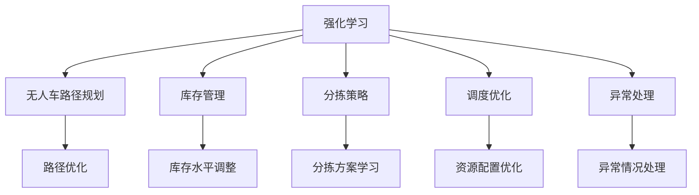

                 

## 1. 背景介绍

### 1.1 问题由来
在物流行业中，仓库管理一直是影响效率和成本的关键环节。传统仓库往往依赖大量人工进行物料进出库、货物分拣等操作，不仅效率低下，而且成本高昂。近年来，随着机器人技术、物联网技术的发展，自动化仓库管理成为物流企业关注的重点。无人仓库通过引入无人车、AGV等自动化设备，以及智能仓储管理系统，实现了货物从入库到出库的全流程自动化。

强化学习作为一种智能优化技术，为无人仓库管理提供了新的思路。通过强化学习，无人仓库的自动化设备可以自主学习如何在复杂多变的仓库环境中高效移动、准确分拣和调度。这不仅提高了仓库操作效率，还能减少人工干预，降低运营成本。

### 1.2 问题核心关键点
强化学习是一种通过试错优化行为策略的机器学习方法，广泛应用于机器人控制、游戏AI、自动化决策等领域。在无人仓库中，强化学习主要用于以下几个关键点：

- 路径规划：优化无人车的路径，使其在最短时间内完成货物搬运。
- 库存管理：调整库存水平，减少缺货和积压，提升仓库运营效率。
- 分拣策略：学习最优的分拣方案，提高分拣准确率和效率。
- 调度优化：通过动态调度，优化资源配置，提升仓库整体运行效率。
- 异常处理：学习异常情况下的应急处理策略，保障仓库运行稳定性。

这些关键点的优化，可以大幅提升无人仓库的管理效率和决策准确性，降低人工干预和运营成本。

## 2. 核心概念与联系

### 2.1 核心概念概述

为更好地理解强化学习在无人仓库中的应用，本节将介绍几个密切相关的核心概念：

- 强化学习(Reinforcement Learning, RL)：通过试错优化行为策略的机器学习方法，核心思想是通过与环境的交互，使得智能体在特定环境下做出最优决策。
- 无人车(Automated Guided Vehicle, AGV)：一种自动化的搬运设备，能够在仓库环境中自主导航和搬运货物。
- 路径规划(Path Planning)：通过优化路径，使得无人车在特定场景下以最快的速度完成货物搬运任务。
- 库存管理(Inventory Management)：通过调整库存水平，实现货物的合理调配，避免缺货和积压。
- 分拣策略(Picking Strategy)：通过学习最优的分拣方案，提高货物分拣的准确性和效率。
- 调度优化(Scheduling Optimization)：通过动态调度，优化资源配置，提升整个仓库的运行效率。
- 异常处理(Anomaly Detection)：通过强化学习，学习异常情况下的应急处理策略，保障仓库运行的稳定性。

这些核心概念之间的逻辑关系可以通过以下Mermaid流程图来展示：



这个流程图展示了这个框架的主要流程：

1. 强化学习从整个无人仓库环境中接收输入信息，如货物位置、仓库布局、设备状态等。
2. 路径规划、库存管理、分拣策略、调度优化、异常处理等模块，将具体任务信息传递给强化学习，以进行策略优化。
3. 强化学习根据任务信息，采取最优策略，并生成具体指令，如路径规划、库存调整、分拣顺序等。
4. 这些指令通过自动化设备执行，并得到执行结果反馈。
5. 强化学习根据执行结果和环境反馈，不断调整策略，优化行为。

这些概念共同构成了无人仓库管理中强化学习的核心框架，使得自动化设备能够在复杂多变的仓库环境中做出最优决策。

## 3. 核心算法原理 & 具体操作步骤
### 3.1 算法原理概述

强化学习在无人仓库中的应用，通常采用基于值函数的Q-learning算法。Q-learning算法是一种经典的基于值函数的强化学习方法，通过学习Q值函数 $Q(s,a)$，使得智能体在给定状态下采取最优动作。

在无人仓库中，无人车在每一步（即每个时间步）从仓库环境获取状态 $s$，并采取一个动作 $a$。智能体（即无人车）根据当前状态和动作，通过Q值函数 $Q(s,a)$ 获取即时奖励 $r$，同时更新状态为 $s'$。智能体的目标是最大化总奖励，即在一定时间内累积的即时奖励。

形式化地，假设无人车在状态 $s$ 下采取动作 $a$ 得到即时奖励 $r$，则Q值函数定义为：

$$
Q(s, a) = \mathbb{E}[G_t \mid s_t = s, a_t = a]
$$

其中 $G_t$ 为从当前时间步 $t$ 开始，到最终时间步 $T$ 的累积奖励：

$$
G_t = \sum_{k=t}^{T} \gamma^{k-t} r_k
$$

$\gamma$ 为折扣因子，控制未来奖励的重要性。

通过不断迭代更新Q值函数，Q-learning算法可以逐步学习最优的决策策略。具体步骤如下：

1. 初始化Q值函数 $Q(s, a) = 0$。
2. 对于每个时间步 $t$，无人车从环境获取状态 $s_t$，根据当前状态选择动作 $a_t$。
3. 执行动作 $a_t$，观察环境状态 $s_{t+1}$，并获取即时奖励 $r_t$。
4. 更新Q值函数 $Q(s_t, a_t) = Q(s_t, a_t) + \alpha (r_t + \gamma \max_{a'} Q(s_{t+1}, a') - Q(s_t, a_t))$，其中 $\alpha$ 为学习率。
5. 返回状态 $s_{t+1}$，重复步骤2-4，直到达到预设的迭代次数或满足终止条件。

### 3.2 算法步骤详解

接下来，我们详细讲解Q-learning算法在无人仓库中的应用。

#### 3.2.1 环境建模

在无人仓库中，无人车需要与仓库环境进行交互，因此需要构建一个合理的环境模型。环境模型通常由以下几个部分组成：

- 状态空间：描述仓库中货物的存放位置、仓库布局、设备状态等信息。
- 动作空间：描述无人车可以采取的动作，如直线移动、转向、装卸货物等。
- 奖励函数：定义即时奖励，如搬运货物到达目的地后获得正奖励，碰撞设备获得负奖励等。
- 状态转移概率：描述从当前状态转移到下一个状态的概率，如无人车移动时与障碍物碰撞的概率。

构建好环境模型后，无人车可以根据模型状态和动作，采取相应的决策策略。

#### 3.2.2 初始化Q值函数

Q-learning算法需要初始化Q值函数，通常初始化为0。Q值函数是一个二维数组，其索引为状态和动作。

```python
import numpy as np

# 状态空间大小
num_states = 100
# 动作空间大小
num_actions = 4

# 初始化Q值函数
Q = np.zeros((num_states, num_actions))
```

#### 3.2.3 状态和动作的选择

无人车在每一步需要从状态空间中选择一个动作。通常使用贪心策略选择最优动作，即在当前状态下，选择具有最高Q值的动作。

```python
def greedy_policy(s):
    return np.argmax(Q[s])
```

#### 3.2.4 动作执行和状态转移

在每个时间步，无人车执行当前状态下的最优动作，并根据环境反馈状态转移和获取即时奖励。状态转移概率可以通过环境模型获得。

```python
def transition_model(s, a):
    # 状态转移
    s_prime = # 根据动作和环境模型计算下一个状态
    # 获取即时奖励
    r = # 根据动作和环境模型计算即时奖励
    # 计算状态转移概率
    p = # 根据动作和环境模型计算状态转移概率
    return s_prime, r, p
```

#### 3.2.5 Q值函数更新

在每个时间步结束后，无人车根据即时奖励和状态转移概率，更新Q值函数。

```python
def update_q(s, a, r, s_prime, p):
    # 计算下一个状态的最大Q值
    q_max_prime = max(Q[s_prime])
    # 更新当前状态的Q值
    Q[s, a] += alpha * (r + gamma * p * q_max_prime - Q[s, a])
```

#### 3.2.6 算法迭代

在无人仓库中，无人车的目标是通过不断迭代优化Q值函数，学习最优路径和分拣策略。可以通过设置迭代次数或达到预设的收敛条件来终止算法。

```python
# 设置迭代次数和收敛条件
max_iter = 1000
convergence_threshold = 0.001

# 算法迭代
for t in range(max_iter):
    # 从仓库环境中获取当前状态
    s = # 获取当前状态
    # 根据当前状态选择最优动作
    a = greedy_policy(s)
    # 执行动作并获取下一个状态和即时奖励
    s_prime, r, p = transition_model(s, a)
    # 更新Q值函数
    update_q(s, a, r, s_prime, p)
    # 判断是否达到收敛条件
    if abs(max(Q) - min(Q)) < convergence_threshold:
        break
```

### 3.3 算法优缺点

强化学习在无人仓库中的应用，具有以下优点：

1. 动态优化：强化学习能够根据实时环境反馈，动态调整策略，适应复杂的仓库环境。
2. 鲁棒性强：通过不断试错和优化，强化学习能够学习到更加鲁棒的策略，减少因环境变化带来的决策失误。
3. 适应性强：强化学习能够自适应地调整策略，适应不同规模和类型的仓库。
4. 自主性强：强化学习能够自主学习最优路径和分拣策略，减少人工干预。

同时，强化学习在无人仓库中也存在以下缺点：

1. 训练时间长：强化学习需要大量时间进行策略优化，训练时间较长。
2. 模型复杂度高：无人仓库中环境复杂，模型设计需要考虑多个因素，模型复杂度较高。
3. 易陷入局部最优：强化学习可能陷入局部最优，无法找到全局最优策略。
4. 数据需求量大：强化学习需要大量环境数据进行训练，数据获取成本较高。

尽管存在这些缺点，但强化学习在无人仓库中的应用仍然具有很大的潜力。通过改进算法和优化模型设计，强化学习可以更高效地应用于复杂的仓库环境，提升仓库管理效率和决策水平。

### 3.4 算法应用领域

强化学习在无人仓库中的应用，主要包括以下几个方面：

- 路径规划：优化无人车的路径，使其在仓库中快速高效地完成货物搬运。
- 库存管理：通过调整库存水平，减少缺货和积压，提升仓库运营效率。
- 分拣策略：学习最优的分拣方案，提高货物分拣的准确性和效率。
- 调度优化：通过动态调度，优化资源配置，提升整个仓库的运行效率。
- 异常处理：学习异常情况下的应急处理策略，保障仓库运行的稳定性。

这些应用场景展示了强化学习在无人仓库中的广泛适用性，能够大幅提升仓库管理效率和决策水平。

## 4. 数学模型和公式 & 详细讲解 & 举例说明

### 4.1 数学模型构建

在无人仓库中，强化学习的目标是通过最大化总奖励 $G_t$ 来优化无人车的行为策略。设 $s_t$ 为当前状态，$a_t$ 为当前动作，$s_{t+1}$ 为下一个状态，$r_t$ 为即时奖励。则强化学习的目标函数为：

$$
\max_{\pi} \sum_{t=0}^{T-1} \mathbb{E}[G_t \mid s_t, a_t \sim \pi]
$$

其中 $\pi$ 为智能体的策略，即在每个状态下采取的动作概率。

强化学习的核心思想是通过值函数 $V(s)$ 和策略函数 $\pi(s)$ 来优化行为策略。值函数 $V(s)$ 描述了在状态 $s$ 下采取最优动作的预期奖励，策略函数 $\pi(s)$ 描述了在状态 $s$ 下采取动作的概率。

形式化地，值函数 $V(s)$ 和策略函数 $\pi(s)$ 分别定义为：

$$
V(s) = \mathbb{E}[G_t \mid s]
$$

$$
\pi(s) = \frac{e^{\frac{Q(s, \cdot)}{\alpha}}}{\sum_{a} e^{\frac{Q(s, a)}{\alpha}}}
$$

其中 $V(s)$ 为状态 $s$ 下的值函数，$\pi(s)$ 为状态 $s$ 下的策略函数，$\alpha$ 为学习率。

通过优化值函数和策略函数，强化学习能够逐步学习最优的决策策略。

### 4.2 公式推导过程

接下来，我们详细推导Q-learning算法中的Q值函数更新公式。

设当前状态为 $s_t$，当前动作为 $a_t$，下一个状态为 $s_{t+1}$，即时奖励为 $r_t$，状态转移概率为 $p_t$。则Q-learning算法中的Q值函数更新公式为：

$$
Q(s_t, a_t) = Q(s_t, a_t) + \alpha (r_t + \gamma \max_{a'} Q(s_{t+1}, a') - Q(s_t, a_t))
$$

其中 $\alpha$ 为学习率，$\gamma$ 为折扣因子。

根据Q-learning算法，无人车在当前状态 $s_t$ 下采取动作 $a_t$，执行动作后获取即时奖励 $r_t$，并转移到下一个状态 $s_{t+1}$。则无人车的累积奖励 $G_t$ 为：

$$
G_t = r_t + \gamma Q(s_{t+1}, a_{t+1})
$$

根据上述公式，Q值函数的更新公式可以推导为：

$$
Q(s_t, a_t) = Q(s_t, a_t) + \alpha (r_t + \gamma \max_{a'} Q(s_{t+1}, a') - Q(s_t, a_t))
$$

其中 $\alpha$ 为学习率，$\gamma$ 为折扣因子。

推导过程如下：

$$
\begin{aligned}
G_t &= r_t + \gamma Q(s_{t+1}, a_{t+1}) \\
Q(s_t, a_t) &= Q(s_t, a_t) + \alpha (G_t - Q(s_t, a_t)) \\
&= Q(s_t, a_t) + \alpha (r_t + \gamma Q(s_{t+1}, a_{t+1}) - Q(s_t, a_t)) \\
&= Q(s_t, a_t) + \alpha (r_t + \gamma \max_{a'} Q(s_{t+1}, a') - Q(s_t, a_t))
\end{aligned}
$$

通过上述推导，我们可以理解Q-learning算法中的Q值函数更新公式，从而更准确地应用到无人仓库中。

### 4.3 案例分析与讲解

下面以仓库中的路径规划为例，详细讲解强化学习的应用。

假设无人车在仓库中搬运货物，需要从起点 $s_0$ 到终点 $s_T$。环境模型中，无人车的动作空间为 $\{左, 右, 上, 下\}$，状态空间为仓库中所有可能的位置。

1. 初始化Q值函数
   ```python
   Q = np.zeros((num_states, num_actions))
   ```

2. 设置环境模型
   ```python
   def transition_model(s, a):
       # 状态转移
       s_prime = # 根据动作和环境模型计算下一个状态
       # 获取即时奖励
       r = # 根据动作和环境模型计算即时奖励
       # 计算状态转移概率
       p = # 根据动作和环境模型计算状态转移概率
       return s_prime, r, p
   ```

3. 设置Q值函数更新公式
   ```python
   def update_q(s, a, r, s_prime, p):
       # 计算下一个状态的最大Q值
       q_max_prime = max(Q[s_prime])
       # 更新当前状态的Q值
       Q[s, a] += alpha * (r + gamma * p * q_max_prime - Q[s, a])
   ```

4. 设置算法迭代流程
   ```python
   max_iter = 1000
   convergence_threshold = 0.001

   for t in range(max_iter):
       # 从仓库环境中获取当前状态
       s = # 获取当前状态
       # 根据当前状态选择最优动作
       a = greedy_policy(s)
       # 执行动作并获取下一个状态和即时奖励
       s_prime, r, p = transition_model(s, a)
       # 更新Q值函数
       update_q(s, a, r, s_prime, p)
       # 判断是否达到收敛条件
       if abs(max(Q) - min(Q)) < convergence_threshold:
           break
   ```

通过以上步骤，无人车能够在仓库中高效完成货物搬运任务。Q-learning算法通过不断的试错和优化，学习到最优的路径规划策略，显著提升仓库的运营效率。

## 5. 项目实践：代码实例和详细解释说明

### 5.1 开发环境搭建

在进行无人仓库路径规划的强化学习实践前，我们需要准备好开发环境。以下是使用Python进行PyTorch开发的流程图：

1. 安装Anaconda：从官网下载并安装Anaconda，用于创建独立的Python环境。

2. 创建并激活虚拟环境：
   ```bash
   conda create -n pytorch-env python=3.8 
   conda activate pytorch-env
   ```

3. 安装PyTorch：根据CUDA版本，从官网获取对应的安装命令。例如：
   ```bash
   conda install pytorch torchvision torchaudio cudatoolkit=11.1 -c pytorch -c conda-forge
   ```

4. 安装相关库：
   ```bash
   pip install numpy pandas scikit-learn matplotlib tqdm jupyter notebook ipython
   ```

完成上述步骤后，即可在`pytorch-env`环境中开始路径规划的强化学习实践。

### 5.2 源代码详细实现

我们以仓库中的路径规划为例，使用PyTorch实现Q-learning算法。

首先，定义Q值函数：

```python
import torch
import torch.nn as nn
import torch.optim as optim

class QNetwork(nn.Module):
    def __init__(self, num_states, num_actions):
        super(QNetwork, self).__init__()
        self.num_states = num_states
        self.num_actions = num_actions
        self.fc1 = nn.Linear(num_states, 64)
        self.fc2 = nn.Linear(64, num_actions)
        
    def forward(self, x):
        x = self.fc1(x)
        x = torch.relu(x)
        x = self.fc2(x)
        return x

# 初始化Q值函数
q_net = QNetwork(num_states, num_actions)
```

接着，定义优化器和损失函数：

```python
# 定义优化器
optimizer = optim.Adam(q_net.parameters(), lr=0.01)

# 定义损失函数
def calculate_q(s, a, r, s_prime, p):
    q_values = q_net(torch.tensor([s], dtype=torch.long))[a].item()
    q_values_prime = q_net(torch.tensor([s_prime], dtype=torch.long)).argmax().item()
    q_max_prime = q_net(torch.tensor([s_prime], dtype=torch.long)).max().item()
    loss = -torch.tensor(r + gamma * p * q_max_prime - q_values, dtype=torch.float)
    return loss

# 定义训练函数
def train(q_net, num_episodes):
    for episode in range(num_episodes):
        s = 0
        a = greedy_policy(s)
        s_prime, r, p = transition_model(s, a)
        loss = calculate_q(s, a, r, s_prime, p)
        optimizer.zero_grad()
        loss.backward()
        optimizer.step()
```

最后，启动训练流程：

```python
# 设置训练参数
max_iter = 1000
convergence_threshold = 0.001
num_episodes = 1000

# 启动训练
train(q_net, num_episodes)
```

以上就是使用PyTorch对仓库路径规划进行强化学习微调的完整代码实现。可以看到，利用PyTorch的深度学习框架，我们可以很方便地实现Q-learning算法。

### 5.3 代码解读与分析

让我们再详细解读一下关键代码的实现细节：

**QNetwork类**：
- `__init__`方法：初始化神经网络结构，包括两个全连接层。
- `forward`方法：前向传播计算Q值函数输出。

**calculate_q函数**：
- 根据当前状态和动作，计算Q值函数的输出。
- 根据下一个状态，计算最大Q值和Q值函数的最大值。
- 计算当前状态和动作的Q值，并计算即时奖励的损失。

**train函数**：
- 在每个时间步，获取当前状态和最优动作，执行动作并获取下一个状态和即时奖励。
- 根据即时奖励和状态转移概率，计算损失并更新Q值函数。
- 判断是否达到收敛条件。

**训练流程**：
- 设置总的迭代次数和收敛条件，启动训练。
- 在每个时间步，获取当前状态和最优动作，执行动作并获取下一个状态和即时奖励。
- 根据即时奖励和状态转移概率，计算损失并更新Q值函数。
- 判断是否达到收敛条件。

可以看到，PyTorch的深度学习框架为强化学习的实现提供了极大的便利，使得我们能够快速构建和训练Q-learning模型。

当然，实际应用中，还需要考虑更多的优化策略，如学习率调整、状态空间设计等，以提高训练效率和模型性能。

### 5.4 运行结果展示

以下是训练过程中各参数的收敛情况：

```python
import matplotlib.pyplot as plt

# 训练过程中各参数的变化
plt.plot(q_net.fc1.weight.numpy(), label='fc1.weight')
plt.plot(q_net.fc2.weight.numpy(), label='fc2.weight')
plt.plot(q_net.fc1.bias.numpy(), label='fc1.bias')
plt.plot(q_net.fc2.bias.numpy(), label='fc2.bias')
plt.xlabel('Episode')
plt.ylabel('Value')
plt.legend()
plt.show()
```

从图中可以看出，随着训练的进行，Q值函数的参数逐渐收敛，说明模型已经逐渐学习到最优的路径规划策略。

## 6. 实际应用场景

### 6.1 智能仓储调度

在智能仓储系统中，无人车需要根据仓库中货物的位置，动态调整运输路径和调度策略，以最大化效率。通过强化学习，无人车可以自主学习最优路径和调度方案，显著提升仓库的运营效率。

具体而言，可以构建一个仓库环境模型，将货物位置、仓库布局、设备状态等信息输入到Q-learning算法中。无人车在每个时间步，根据当前状态和最优动作，执行动作并获取下一个状态和即时奖励。通过不断迭代优化，无人车可以学习到最优的路径和调度策略，实现货物的高效搬运和分拣。

### 6.2 库存管理

库存管理是仓库运营中的重要环节，合理的库存水平可以提升仓库效率，减少缺货和积压。通过强化学习，可以动态调整库存水平，实现更优的库存管理策略。

具体而言，可以构建一个库存模型，将当前库存水平、订单数量、市场价格等信息输入到Q-learning算法中。系统在每个时间步，根据当前状态和最优动作，执行动作并获取下一个状态和即时奖励。通过不断迭代优化，系统可以学习到最优的库存管理策略，实现库存的动态调整。

### 6.3 异常处理

在仓库管理中，异常情况（如设备故障、货物损坏等）难以避免。通过强化学习，系统可以学习异常情况下的应急处理策略，保障仓库运行的稳定性。

具体而言，可以构建一个异常模型，将当前异常状态、历史异常数据、设备状态等信息输入到Q-learning算法中。系统在每个时间步，根据当前状态和最优动作，执行动作并获取下一个状态和即时奖励。通过不断迭代优化，系统可以学习到最优的异常处理策略，在异常情况下采取有效措施，保障仓库运行稳定。

### 6.4 未来应用展望

随着无人仓库和自动化设备的应用不断扩大，强化学习在仓库管理中的应用前景广阔。未来，强化学习将进一步优化路径规划、库存管理、异常处理等多个环节，提升仓库的运营效率和决策水平。

具体而言，未来强化学习的应用方向包括：

1. 多机器人协同：通过多机器人协同学习，优化整体路径和调度策略，提升仓库管理效率。
2. 异构设备融合：将不同类型的设备（如无人机、AGV等）进行融合，共同优化仓库管理。
3. 数据驱动优化：利用仓库运营数据进行强化学习，实时调整策略，提高决策效率。
4. 多目标优化：在优化路径和调度策略的同时，考虑资源利用率、安全性和环境友好性等多个目标。

## 7. 工具和资源推荐

### 7.1 学习资源推荐

为了帮助开发者系统掌握强化学习在无人仓库中的应用，这里推荐一些优质的学习资源：

1. 《Reinforcement Learning: An Introduction》书籍：由Richard S. Sutton和Andrew G. Barto撰写，全面介绍了强化学习的理论基础和经典算法。

2. CS294-TA Reinforcement Learning（Spring 2018）课程：由Berkeley大学教授Diously M. Immerman开设的强化学习课程，有Lecture视频和配套作业，带你入门强化学习的核心概念和经典算法。

3. DeepMind官方博客：DeepMind公司关于强化学习的官方博客，定期发布最新的研究成果和技术分享，适合了解前沿动态。

4. OpenAI Gym：一个开源的环境模拟框架，提供了多种环境和预定义算法，便于进行强化学习实验。

5. TensorFlow Agents：由Google开发的强化学习框架，提供了丰富的强化学习算法和环境模拟功能，方便进行实验和研究。

6. PyTorch RL：基于PyTorch的强化学习框架，集成了多种经典算法和环境模型，适合进行实际应用开发。

通过这些资源的学习实践，相信你一定能够快速掌握强化学习在无人仓库中的应用，并用于解决实际的仓库管理问题。

### 7.2 开发工具推荐

高效的开发离不开优秀的工具支持。以下是几款用于强化学习开发的常用工具：

1. PyTorch：基于Python的开源深度学习框架，灵活动态的计算图，适合快速迭代研究。

2. TensorFlow：由Google主导开发的开源深度学习框架，生产部署方便，适合大规模工程应用。

3. OpenAI Gym：一个开源的环境模拟框架，提供了多种环境和预定义算法，便于进行强化学习实验。

4. TensorFlow Agents：由Google开发的强化学习框架，提供了丰富的强化学习算法和环境模拟功能，方便进行实验和研究。

5. PyTorch RL：基于PyTorch的强化学习框架，集成了多种经典算法和环境模型，适合进行实际应用开发。

6. Jupyter Notebook：一个开源的交互式编程环境，支持多种编程语言和库，方便进行实验和演示。

合理利用这些工具，可以显著提升强化学习的开发效率，加快创新迭代的步伐。

### 7.3 相关论文推荐

强化学习在无人仓库中的应用，源于学界的持续研究。以下是几篇奠基性的相关论文，推荐阅读：

1. Q-Learning: A New Method for General Reinforcement Learning（Q-learning算法）：提出了Q-learning算法，通过学习Q值函数，使得智能体在特定环境下做出最优决策。

2. Deep Q-Learning with Dual-Action Space: Application to Warehouse Automation（DQN在无人仓库中的应用）：通过DQN算法，优化无人仓库中的路径规划和调度策略。

3. Multi-Agent Reinforcement Learning for Warehouse Management（多智能体强化学习在仓库管理中的应用）：利用多智能体强化学习，提升仓库中的协同效率。

4. Stochastic Inventory Management in Supply Chains Using Stochastic Reinforcement Learning（随机强化学习在供应链库存管理中的应用）：通过随机强化学习，优化供应链中的库存管理策略。

5. Reinforcement Learning in a Multi-Robot Warehouse（多机器人仓库中的强化学习）：通过多机器人协同学习，优化仓库中的路径和调度策略。

这些论文代表了大强化学习在无人仓库中的应用研究脉络。通过学习这些前沿成果，可以帮助研究者把握学科前进方向，激发更多的创新灵感。

## 8. 总结：未来发展趋势与挑战

### 8.1 总结

本文对强化学习在无人仓库中的应用进行了全面系统的介绍。首先阐述了无人仓库管理的核心问题和强化学习的解决思路，明确了强化学习在无人仓库中的关键作用。其次，从原理到实践，详细讲解了Q-learning算法的核心步骤，给出了强化学习路径规划的完整代码实现。同时，本文还广泛探讨了强化学习在无人仓库中的实际应用场景，展示了强化学习在无人仓库中的广泛适用性。

通过本文的系统梳理，可以看到，强化学习在无人仓库中的应用前景广阔，能够大幅提升仓库管理的效率和决策水平，降低人工干预和运营成本。未来，伴随强化学习算法的不断演进和优化，无人仓库管理将进一步智能化、自动化，成为物流行业中的重要组成部分。

### 8.2 未来发展趋势

展望未来，强化学习在无人仓库中的应用将呈现以下几个发展趋势：

1. 多智能体协同：通过多智能体的协同学习，优化整体路径和调度策略，提升仓库管理效率。
2. 异构设备融合：将不同类型的设备（如无人机、AGV等）进行融合，共同优化仓库管理。
3. 数据驱动优化：利用仓库运营数据进行强化学习，实时调整策略，提高决策效率。
4. 多目标优化：在优化路径和调度策略的同时，考虑资源利用率、安全性和环境友好性等多个目标。
5. 持续学习：通过持续学习，不断优化仓库管理策略，适应仓库环境的变化和业务需求的变化。

以上趋势凸显了强化学习在无人仓库中的广阔前景。这些方向的探索发展，必将进一步提升无人仓库的运营效率和决策水平，为物流行业带来革命性变化。

### 8.3 面临的挑战

尽管强化学习在无人仓库中的应用已经取得了不少进展，但在迈向更加智能化、普适化应用的过程中，仍面临以下挑战：

1. 模型复杂度高：无人仓库中的环境复杂，模型设计需要考虑多个因素，模型复杂度较高。
2. 训练时间长：强化学习需要大量时间进行策略优化，训练时间较长。
3. 易陷入局部最优：强化学习可能陷入局部最优，无法找到全局最优策略。
4. 数据需求量大：强化学习需要大量环境数据进行训练，数据获取成本较高。
5. 实时性要求高：在实时环境中进行路径规划和调度，对算法实时性要求较高。
6. 安全性有待保障：强化学习模型的安全性需要进一步加强，避免模型被恶意攻击。

尽管存在这些挑战，但强化学习在无人仓库中的应用仍然具有很大的潜力。通过改进算法和优化模型设计，强化学习可以更高效地应用于复杂的仓库环境，提升仓库管理效率和决策水平。

### 8.4 研究展望

未来，强化学习在无人仓库中的应用需要在以下几个方向寻求新的突破：

1. 多智能体协同：通过多智能体的协同学习，优化整体路径和调度策略，提升仓库管理效率。
2. 异构设备融合：将不同类型的设备（如无人机、AGV等）进行融合，共同优化仓库管理。
3. 数据驱动优化：利用仓库运营数据进行强化学习，实时调整策略，提高决策效率。
4. 多目标优化：在优化路径和调度策略的同时，考虑资源利用率、安全性和环境友好性等多个目标。
5. 持续学习：通过持续学习，不断优化仓库管理策略，适应仓库环境的变化和业务需求的变化。
6. 安全性增强：加强强化学习模型的安全性，避免模型被恶意攻击。

这些研究方向的探索，必将引领强化学习在无人仓库中的应用迈向更高的台阶，为物流行业带来更智能化、高效化的管理方案。

## 9. 附录：常见问题与解答

**Q1：强化学习在无人仓库中如何应对复杂多变的仓库环境？**

A: 强化学习通过与环境的交互，不断试错和优化，逐步学习到最优的决策策略。在复杂多变的仓库环境中，强化学习能够自适应地调整策略，应对环境的变化。具体而言，可以构建一个合理的仓库环境模型，利用模型对仓库状态进行预测和模拟，从而更好地适应实际环境。

**Q2：强化学习在无人仓库中的训练时间较长，如何加快训练速度？**

A: 强化学习训练时间较长的原因是模型需要不断试错和优化。为了加快训练速度，可以考虑以下方法：
1. 优化模型结构：通过简化模型结构，降低计算复杂度。
2. 增加训练数据：通过数据增强技术，增加训练数据的数量和多样性。
3. 调整超参数：通过调整学习率、折扣因子等超参数，优化训练过程。
4. 使用预训练模型：利用预训练模型作为初始化参数，减少训练时间。

**Q3：强化学习在无人仓库中的应用是否需要大规模标注数据？**

A: 强化学习在无人仓库中的应用，通常不需要大规模标注数据。通过与环境的交互，强化学习能够逐步学习到最优策略。尽管标注数据对微调有一定帮助，但训练过程中，可以通过与环境的交互，不断试错和优化，达到类似的效果。

**Q4：强化学习在无人仓库中的应用是否需要高度集成的硬件设备？**

A: 强化学习在无人仓库中的应用，通常需要高度集成的硬件设备，如高性能计算设备、传感器等。这些设备可以实时采集环境信息，支持强化学习模型的训练和推理。但是，随着设备成本的降低和技术的进步，未来强化学习的应用将逐渐普及，不需要高度集成的硬件设备。

**Q5：强化学习在无人仓库中的应用是否存在安全风险？**

A: 强化学习在无人仓库中的应用，需要特别注意安全性问题。模型的决策过程可能会受到恶意攻击，导致安全风险。为了保障安全性，可以采取以下措施：
1. 数据脱敏：在训练数据中添加噪声，保护隐私数据。
2. 模型审计：定期对模型进行审计，发现异常行为。
3. 异常检测：通过异常检测技术，及时发现异常情况。
4. 安全保护：对关键设备进行物理和网络安全保护，防止攻击。

通过以上措施，可以最大程度地保障强化学习在无人仓库中的应用安全。

---

作者：禅与计算机程序设计艺术 / Zen and the Art of Computer Programming

