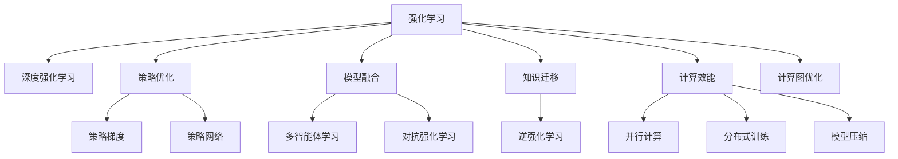

                 

# 强化学习：未来发展动向预测

> 关键词：强化学习, 深度学习, 神经网络, 策略优化, 模型融合, 应用场景, 未来展望

## 1. 背景介绍

### 1.1 问题由来
强化学习(Reinforcement Learning, RL)是一种通过试错学习优化决策策略的机器学习方法，在计算机游戏、机器人控制、自适应控制等领域均有广泛应用。近年来，随着深度学习和神经网络技术的发展，强化学习在许多任务上取得了突破性进展，如AlphaGo、AlphaStar等。

然而，强化学习的理论和技术仍面临诸多挑战。例如，复杂的非凸环境空间、奖励函数设计问题、模型优化和训练效率等。同时，传统强化学习方法在处理大规模、高维度数据时，面临显著的计算复杂性和内存消耗问题。因此，需要探索新的强化学习框架和算法，以提高其泛化能力、学习效率和实际应用性。

### 1.2 问题核心关键点
强化学习发展的核心关键点在于以下几个方面：

- 模型的可扩展性和泛化能力。如何构建更加灵活、可扩展的强化学习模型，使其能够处理复杂多变的实际问题。
- 算法效率与稳定性。如何在计算资源受限的条件下，提高强化学习算法的训练和推理速度，同时保证模型的稳定性和鲁棒性。
- 知识迁移和模型融合。如何将知识进行迁移和融合，以构建更加全面、强大的学习模型。
- 与深度学习等其他AI技术的协同发展。强化学习如何与深度学习、自然语言处理、计算机视觉等技术结合，形成更强大的AI系统。
- 人类价值的考量。强化学习如何兼顾人类价值观、伦理道德和安全问题，以实现可持续的智能应用。

## 2. 核心概念与联系

### 2.1 核心概念概述

为了更好地理解强化学习的未来发展动向，本节将介绍几个密切相关的核心概念：

- 强化学习(RL)：通过试错学习，在环境互动中优化策略，使智能体(max)取得最大化累积奖励的机器学习方法。
- 深度强化学习(Deep RL)：将深度神经网络引入强化学习，提高学习能力和泛化能力。
- 策略优化(Policy Optimization)：通过优化策略参数，最大化预期奖励。
- 模型融合(Model Integration)：将强化学习模型与其它AI模型结合，形成更强大的智能系统。
- 知识迁移(Knowledge Transfer)：将模型在其他任务上的知识迁移到新任务中，提高模型的泛化能力。
- 逆强化学习(Inverse Reinforcement Learning, IRL)：通过观测智能体的行为，推断奖励函数，指导策略优化。
- 多智能体学习(Multi-Agent Learning)：多个智能体间协作或竞争，优化全局目标。
- 对抗强化学习(Adversarial Reinforcement Learning, ARL)：引入对抗机制，增强模型鲁棒性。
- 计算效能(Computational Efficiency)：在硬件受限的条件下，提高算法效率。

这些核心概念之间的逻辑关系可以通过以下Mermaid流程图来展示：



这个流程图展示了一系列强化学习的核心概念及其之间的关系：

1. 强化学习作为基础的机器学习方法，通过试错优化策略。
2. 深度强化学习通过引入神经网络，提高模型的表达能力和学习效率。
3. 策略优化通过优化策略参数，最大化预期奖励。
4. 模型融合将强化学习与其他AI技术结合，形成更强大的智能系统。
5. 知识迁移在多个任务间迁移知识，提高泛化能力。
6. 逆强化学习通过学习智能体的行为推断奖励函数。
7. 多智能体学习通过协作或竞争优化全局目标。
8. 对抗强化学习引入对抗机制提高模型鲁棒性。
9. 计算效能通过并行计算、分布式训练、模型压缩等手段，提高强化学习的效率。

这些概念共同构成了强化学习的理论和技术基础，使得强化学习在诸多领域得以广泛应用。

## 3. 核心算法原理 & 具体操作步骤
### 3.1 算法原理概述

强化学习的核心原理可以概括为：智能体通过与环境交互，根据环境反馈调整策略，以最大化长期累积奖励。其算法流程包括策略优化和模型学习两个关键环节：

1. 策略优化：智能体通过观察状态和环境反馈，调整策略参数，最大化预期奖励。常用的策略优化算法包括策略梯度、策略网络等。
2. 模型学习：通过数据驱动的方式，学习环境模型，辅助策略优化。常用的模型学习算法包括Q-learning、SARSA等。

强化学习的目标是在给定环境和目标下，找到最优策略，使得智能体在长期内获得最大化的累积奖励。形式化地，设智能体在当前状态 $s_t$ 下采取动作 $a_t$，环境反馈为奖励 $r_{t+1}$ 和下一状态 $s_{t+1}$，策略为 $\pi(a_t|s_t)$。则强化学习问题的目标为：

$$
\max_{\pi} \mathbb{E}[\sum_{t=0}^{\infty} \gamma^t r_{t+1}]
$$

其中 $\gamma$ 为折扣因子，表示未来奖励的权重。

### 3.2 算法步骤详解

强化学习的核心算法步骤如下：

1. 初始化智能体策略 $\pi$ 和环境 $E$。
2. 在每个时间步 $t$，智能体观察当前状态 $s_t$，选择动作 $a_t$，接收环境反馈 $r_{t+1}$ 和下一状态 $s_{t+1}$。
3. 根据当前状态 $s_t$ 和动作 $a_t$，计算Q值 $Q_{t+1}(s_{t+1}, a_t)$ 和奖励 $r_t$。
4. 使用策略优化算法更新策略参数，最大化长期累积奖励。
5. 通过模型学习算法更新环境模型，辅助策略优化。

具体的算法实现需要选择合适的策略优化和模型学习算法，设计相应的计算图和优化目标。以下是几个经典的强化学习算法示例：

**策略梯度算法**：
- 使用策略梯度更新策略参数 $\theta$：
$$
\theta \leftarrow \theta + \eta \sum_{t=0}^{T-1} \nabla_{\theta} \log \pi(a_t|s_t) Q_t(s_t, a_t)
$$
- 策略网络可以是深度神经网络，如政策梯度算法(Actor-Critic)、策略网络优化(PPO)等。

**Q-learning算法**：
- 使用Q-learning更新Q值：
$$
Q_{t+1}(s_{t+1}, a_t) = (1-\alpha) Q_t(s_t, a_t) + \alpha (r_{t+1} + \gamma \max_{a} Q_t(s_{t+1}, a))
$$
- 一般与策略网络结合使用，如DQN算法。

**SARSA算法**：
- 使用SARSA更新Q值：
$$
Q_{t+1}(s_{t+1}, a_t) = Q_t(s_t, a_t) + \alpha (r_{t+1} + \gamma Q_t(s_{t+1}, a_{t+1}) - Q_t(s_t, a_t))
$$
- 与Q-learning类似，同样适用于与策略网络结合使用。

### 3.3 算法优缺点

强化学习的算法具有以下优点：

1. 可扩展性强。强化学习适用于各种任务，特别是那些难以定义明确标签的数据。
2. 自适应性强。通过环境反馈调整策略，能够适应复杂多变的环境。
3. 适用范围广。强化学习在机器学习、机器人控制、自适应控制等领域都有广泛应用。

同时，强化学习的算法也存在一些缺点：

1. 训练复杂度高。强化学习需要大量数据和计算资源进行训练，特别是高维度、非凸问题。
2. 奖励函数设计困难。奖励函数的设计影响学习效果，但往往难以设计合理的奖励函数。
3. 模型泛化能力差。强化学习的模型在新的环境或任务上往往表现不佳。
4. 计算效能不足。在大规模问题上，强化学习的计算复杂度高，难以实时处理。
5. 可解释性不足。强化学习模型通常难以解释其内部工作机制和决策逻辑。

尽管存在这些局限性，但强化学习仍然是当前AI研究的重要方向，并将在未来发挥更大作用。

### 3.4 算法应用领域

强化学习在多个领域已有广泛应用，以下是几个典型的应用场景：

1. 机器人和自动化：强化学习在机器人路径规划、自动化控制等方面有广泛应用。例如，通过强化学习训练机器人学习如何精确地操纵手臂。
2. 游戏AI：强化学习在游戏AI领域有重要应用。例如，AlphaGo利用强化学习技术，在围棋、星际争霸等复杂游戏中取得了突破性进展。
3. 自然语言处理：强化学习在机器翻译、文本生成、对话系统等方面有重要应用。例如，通过强化学习训练对话系统学习如何自然流畅地与人类交互。
4. 金融市场：强化学习在金融市场预测、交易策略优化等方面有重要应用。例如，通过强化学习训练交易模型学习如何制定最优交易策略。
5. 自动驾驶：强化学习在自动驾驶路径规划、避障等方面有重要应用。例如，通过强化学习训练自动驾驶汽车学习如何在复杂交通环境中安全驾驶。
6. 物流和仓储：强化学习在仓库路径规划、库存管理等方面有重要应用。例如，通过强化学习训练机器人学习如何在仓库中高效地进行货物搬运和存储。

除了这些领域外，强化学习还在供应链优化、资源调度、能源管理、智能医疗等多个领域有重要应用。

## 4. 数学模型和公式 & 详细讲解 & 举例说明
### 4.1 数学模型构建

强化学习的数学模型可以形式化为马尔可夫决策过程(Markov Decision Process, MDP)，表示为 $MDP = (\mathcal{S}, \mathcal{A}, \mathcal{P}, \mathcal{R}, \gamma)$：

- $\mathcal{S}$ 为状态空间，表示智能体可观察到的环境状态。
- $\mathcal{A}$ 为动作空间，表示智能体可采取的行动。
- $\mathcal{P}(s_{t+1}|s_t, a_t)$ 为状态转移概率，表示智能体在状态 $s_t$ 下采取动作 $a_t$，进入状态 $s_{t+1}$ 的概率。
- $\mathcal{R}(r_{t+1}|s_t, a_t)$ 为奖励函数，表示智能体在状态 $s_t$ 下采取动作 $a_t$ 所获得的奖励。
- $\gamma$ 为折扣因子，表示未来奖励的权重。

强化学习的目标是最小化期望的长期奖励，即：

$$
\max_{\pi} \mathbb{E}[\sum_{t=0}^{\infty} \gamma^t r_{t+1}]
$$

其中 $\pi(a_t|s_t)$ 为智能体的策略，表示在状态 $s_t$ 下采取动作 $a_t$ 的概率。

### 4.2 公式推导过程

以下是几个核心强化学习算法公式的推导：

**策略梯度算法**：

使用策略梯度算法更新策略参数 $\theta$：

$$
\theta \leftarrow \theta + \eta \sum_{t=0}^{T-1} \nabla_{\theta} \log \pi(a_t|s_t) Q_t(s_t, a_t)
$$

其中 $\eta$ 为学习率，$Q_t(s_t, a_t)$ 为价值函数，可以采用蒙特卡罗方法或基于模型的方法计算。

**Q-learning算法**：

使用Q-learning更新Q值：

$$
Q_{t+1}(s_{t+1}, a_t) = (1-\alpha) Q_t(s_t, a_t) + \alpha (r_{t+1} + \gamma \max_{a} Q_t(s_{t+1}, a))
$$

其中 $\alpha$ 为学习率，$\max_{a} Q_t(s_{t+1}, a)$ 表示在状态 $s_{t+1}$ 下采取动作 $a$ 的最大价值函数。

**SARSA算法**：

使用SARSA更新Q值：

$$
Q_{t+1}(s_{t+1}, a_t) = Q_t(s_t, a_t) + \alpha (r_{t+1} + \gamma Q_t(s_{t+1}, a_{t+1}) - Q_t(s_t, a_t))
$$

其中 $\alpha$ 为学习率，$Q_t(s_{t+1}, a_{t+1})$ 表示在状态 $s_{t+1}$ 下采取动作 $a_{t+1}$ 的价值函数。

以上公式展示了强化学习算法的核心思想和实现方式，为后续实际应用奠定了数学基础。

### 4.3 案例分析与讲解

以AlphaGo为例，简要分析强化学习的应用：

AlphaGo通过强化学习技术，在围棋这一复杂游戏中取得了突破性进展。AlphaGo的策略学习基于蒙特卡罗树搜索(MCTS)和深度神经网络，其中策略网络用于评估搜索树节点，并通过经验回放技术进行自监督预训练。

AlphaGo的核心算法流程如下：

1. 初始化搜索树：通过蒙特卡罗树搜索，模拟游戏过程，生成搜索树。
2. 扩展搜索树：从根节点开始，通过神经网络评估当前局面，选择最佳动作进行扩展。
3. 回溯搜索树：从叶子节点开始，回溯搜索树，评估每个节点的胜负概率。
4. 经验回放：将扩展和回溯过程中的数据存储起来，用于神经网络的训练。
5. 策略更新：通过经验回放数据，更新策略网络，提高决策能力。

AlphaGo通过强化学习技术，学习如何在围棋中制定最优策略，同时通过深度神经网络提升决策能力和泛化能力，取得了与人类围棋高手匹敌的成绩。AlphaGo的成功展示了强化学习在复杂游戏中的强大能力。

## 5. 项目实践：代码实例和详细解释说明
### 5.1 开发环境搭建

在进行强化学习实践前，我们需要准备好开发环境。以下是使用Python进行TensorFlow开发的环境配置流程：

1. 安装Anaconda：从官网下载并安装Anaconda，用于创建独立的Python环境。

2. 创建并激活虚拟环境：
```bash
conda create -n reinforcement-env python=3.8 
conda activate reinforcement-env
```

3. 安装TensorFlow：根据CUDA版本，从官网获取对应的安装命令。例如：
```bash
conda install tensorflow tensorflow-gpu -c conda-forge
```

4. 安装TensorFlow Addons：
```bash
conda install tensorflow-addons
```

5. 安装各类工具包：
```bash
pip install numpy pandas scikit-learn matplotlib tqdm jupyter notebook ipython
```

完成上述步骤后，即可在`reinforcement-env`环境中开始强化学习实践。

### 5.2 源代码详细实现

这里我们以Deep Q-Network (DQN)为例，给出使用TensorFlow实现强化学习模型的代码实现。

首先，定义环境：

```python
import gym

env = gym.make('CartPole-v1')
env.reset()
```

然后，定义神经网络模型：

```python
import tensorflow as tf
from tensorflow.keras.layers import Dense, Flatten

class QNetwork(tf.keras.Model):
    def __init__(self, state_size, action_size):
        super(QNetwork, self).__init__()
        self.model = tf.keras.Sequential([
            Flatten(input_shape=(state_size,)),
            Dense(24, activation='relu'),
            Dense(action_size, activation='linear')
        ])
    
    def call(self, x):
        return self.model(x)
```

接着，定义优化器、学习率和网络参数：

```python
learning_rate = 0.001
gamma = 0.99
target_update_interval = 100

target_network = QNetwork(env.observation_space.shape[0], env.action_space.n)
optimizer = tf.keras.optimizers.Adam(learning_rate)
```

最后，定义训练和评估函数：

```python
import numpy as np

class Agent:
    def __init__(self, state_size, action_size):
        self.state_size = state_size
        self.action_size = action_size
        self.memory = []
        self.gamma = gamma
        self.epsilon = 1.0
        self.epsilon_min = 0.01
        self.epsilon_decay = 0.995
        self.learning_rate = learning_rate
        self.model = self.build_model()
        self.target_model = self.build_model()
        self.target_model.set_weights(self.model.get_weights())
        self.update_target_model()
        
    def build_model(self):
        return QNetwork(self.state_size, self.action_size)
    
    def update_target_model(self):
        self.target_model.set_weights(self.model.get_weights())
    
    def choose_action(self, state):
        if np.random.rand() <= self.epsilon:
            action = np.random.randint(self.action_size)
        else:
            action = np.argmax(self.model(state)[0])
        return action
    
    def append_to_memory(self, state, action, reward, next_state, done):
        self.memory.append((state, action, reward, next_state, done))
    
    def act(self, state):
        if len(self.memory) > batch_size:
            minibatch = np.random.choice(self.memory, batch_size)
            Q_values = self.model.predict(np.array(minibatch[:,0:-1]))
            next_state_values = self.target_model.predict(np.array(minibatch[:,-2:]))
            Q_values = self.model.predict(np.array(minibatch[:,0:-1]))
            target_Q_values = Q_values
            target_Q_values[np.arange(batch_size), minibatch[:,1]] = rewards + self.gamma * np.max(next_state_values, axis=1)
            target_Q_values = tf.keras.optimizers.Adam(learning_rate=0.001).get_gradients(self.model, self.model.trainable_variables)[0]
            self.model.trainable = True
            self.model.trainable_weights = self.model.trainable_variables
            self.model.compile(optimizer=optimizer, loss='mse')
            self.model.fit(X=memory[:, :-1], y=target_Q_values, epochs=1, verbose=0)
        return self.model.predict(state)[0][1]
    
    def train(self, memory, batch_size):
        X = memory[:, :-1]
        y = memory[:, -1] + self.gamma * np.max(self.target_model.predict(memory[:, -2:]), axis=1)
        self.model.fit(X, y, batch_size=batch_size, epochs=1, verbose=0)
        self.epsilon = max(self.epsilon_min, self.epsilon * self.epsilon_decay)
```

然后，定义训练循环：

```python
import gym
import tensorflow as tf
from tensorflow.keras.layers import Dense, Flatten

state_size = 4
action_size = 2

env = gym.make('CartPole-v1')
env.reset()

class QNetwork(tf.keras.Model):
    def __init__(self, state_size, action_size):
        super(QNetwork, self).__init__()
        self.model = tf.keras.Sequential([
            Flatten(input_shape=(state_size,)),
            Dense(24, activation='relu'),
            Dense(action_size, activation='linear')
        ])
    
    def call(self, x):
        return self.model(x)

learning_rate = 0.001
gamma = 0.99
target_update_interval = 100

target_network = QNetwork(env.observation_space.shape[0], env.action_size)
optimizer = tf.keras.optimizers.Adam(learning_rate)

class Agent:
    def __init__(self, state_size, action_size):
        self.state_size = state_size
        self.action_size = action_size
        self.memory = []
        self.gamma = gamma
        self.epsilon = 1.0
        self.epsilon_min = 0.01
        self.epsilon_decay = 0.995
        self.learning_rate = learning_rate
        self.model = self.build_model()
        self.target_model = self.build_model()
        self.target_model.set_weights(self.model.get_weights())
        self.update_target_model()
        
    def build_model(self):
        return QNetwork(self.state_size, self.action_size)
    
    def update_target_model(self):
        self.target_model.set_weights(self.model.get_weights())
    
    def choose_action(self, state):
        if np.random.rand() <= self.epsilon:
            action = np.random.randint(self.action_size)
        else:
            action = np.argmax(self.model(state)[0])
        return action
    
    def append_to_memory(self, state, action, reward, next_state, done):
        self.memory.append((state, action, reward, next_state, done))
    
    def act(self, state):
        if len(self.memory) > batch_size:
            minibatch = np.random.choice(self.memory, batch_size)
            Q_values = self.model.predict(np.array(minibatch[:,0:-1]))
            next_state_values = self.target_model.predict(np.array(minibatch[:,-2:]))
            Q_values = self.model.predict(np.array(minibatch[:,0:-1]))
            target_Q_values = Q_values
            target_Q_values[np.arange(batch_size), minibatch[:,1]] = rewards + self.gamma * np.max(next_state_values, axis=1)
            target_Q_values = tf.keras.optimizers.Adam(learning_rate=0.001).get_gradients(self.model, self.model.trainable_variables)[0]
            self.model.trainable = True
            self.model.trainable_weights = self.model.trainable_variables
            self.model.compile(optimizer=optimizer, loss='mse')
            self.model.fit(X=memory[:, :-1], y=target_Q_values, epochs=1, verbose=0)
        return self.model.predict(state)[0][1]
    
    def train(self, memory, batch_size):
        X = memory[:, :-1]
        y = memory[:, -1] + self.gamma * np.max(self.target_model.predict(memory[:, -2:]), axis=1)
        self.model.fit(X, y, batch_size=batch_size, epochs=1, verbose=0)
        self.epsilon = max(self.epsilon_min, self.epsilon * self.epsilon_decay)
```

最后，启动训练流程并在测试集上评估：

```python
import numpy as np
import tensorflow as tf

state_size = 4
action_size = 2

batch_size = 32

for episode in range(num_episodes):
    state = env.reset()
    state = np.reshape(state, [1, state_size])
    done = False
    total_reward = 0
    while not done:
        action = agent.act(state)
        next_state, reward, done, _ = env.step(action)
        next_state = np.reshape(next_state, [1, state_size])
        agent.append_to_memory(state, action, reward, next_state, done)
        state = next_state
        total_reward += reward
    print("Episode {}: Reward={}".format(episode+1, total_reward))
    if episode % target_update_interval == 0:
        agent.update_target_model()
        
agent.train(memory, batch_size)
```

以上就是使用TensorFlow实现DQN算法的完整代码实现。可以看到，TensorFlow提供了强大的深度学习框架，使得强化学习模型的实现变得简洁高效。

### 5.3 代码解读与分析

让我们再详细解读一下关键代码的实现细节：

**QNetwork类**：
- `__init__`方法：初始化网络结构，采用Flatten层将输入转换为特征向量，然后通过两个Dense层进行非线性变换，最后输出Q值。
- `call`方法：定义前向传播过程。

**Agent类**：
- `build_model`方法：构建神经网络模型。
- `update_target_model`方法：更新目标网络。
- `choose_action`方法：选择动作。
- `append_to_memory`方法：将训练数据存储到内存中。
- `act`方法：计算Q值并更新策略。
- `train`方法：训练模型。

**训练循环**：
- 在每个回合中，智能体在环境中采取动作，接收奖励，更新Q值，并将数据存储到内存中。
- 定期更新目标网络，确保策略的稳定性和泛化能力。
- 在训练过程中，逐步降低探索策略的概率，增加利用模型进行决策的概率。

可以看到，TensorFlow提供了丰富的API和工具，可以方便地实现强化学习模型的训练和评估。通过合理利用这些工具，可以显著提升开发效率，实现复杂的强化学习应用。

## 6. 实际应用场景

### 6.1 智能推荐系统

强化学习在智能推荐系统中有着广泛的应用。例如，推荐系统可以通过用户的历史行为数据和物品的特征，学习用户的偏好模型，并通过试错优化推荐策略，以最大化用户的满意度。

在实践中，可以通过强化学习算法训练推荐模型，模拟用户与物品的互动过程，计算每个物品对用户带来的满意度，并优化推荐策略。具体来说，可以设计一个状态表示用户的当前状态和历史行为，设计动作表示推荐不同的物品，设计奖励函数表示用户的满意度，并使用强化学习算法进行优化。

### 6.2 自动驾驶

自动驾驶技术是强化学习的重要应用场景。例如，自动驾驶汽车可以通过强化学习算法学习如何在复杂交通环境中做出最优决策，以最大化行驶安全性和效率。

在实践中，可以将环境模型化，设计状态表示车辆的位置、速度、方向等，设计动作表示加速、刹车、转向等操作，设计奖励函数表示行驶安全性和效率。通过强化学习算法训练自动驾驶模型，模拟车辆在复杂交通环境中的行为，不断优化决策策略。

### 6.3 机器人控制

强化学习在机器人控制中也有广泛应用。例如，机器人可以通过强化学习算法学习如何在不同的环境中完成任务，以最大化任务的完成效率和成功率。

在实践中，可以将环境模型化，设计状态表示机器人的位置、方向、电量等，设计动作表示移动、举升、旋转等操作，设计奖励函数表示任务完成效率和成功率。通过强化学习算法训练机器人模型，模拟机器人在复杂环境中的行为，不断优化决策策略。

### 6.4 金融市场预测

金融市场预测是强化学习的重要应用场景。例如，金融模型可以通过强化学习算法学习如何预测股票、货币等金融资产的未来走势，以最大化投资收益。

在实践中，可以将环境模型化，设计状态表示市场的历史数据和当前情况，设计动作表示买入、卖出、持有等操作，设计奖励函数表示投资收益。通过强化学习算法训练金融模型，模拟市场动态变化，不断优化投资策略。

## 7. 工具和资源推荐
### 7.1 学习资源推荐

为了帮助开发者系统掌握强化学习的理论基础和实践技巧，这里推荐一些优质的学习资源：

1. 《Reinforcement Learning: An Introduction》：这本书由Richard S. Sutton和Andrew G. Barto合著，是强化学习领域的经典教材，详细介绍了强化学习的基本概念和算法。

2. 《Deep Q-Learning with Python》：这本书由Shankar Venkatesh合著，介绍了使用TensorFlow实现DQN算法的详细过程，适合初学者入门。

3. Coursera《Reinforcement Learning》课程：由DeepMind公司开设，由David Silver主讲，深入浅出地介绍了强化学习的基本概念和算法。

4. Udacity《Reinforcement Learning Nanodegree》：提供了系统的强化学习课程，包括理论知识和实战练习。

5. OpenAI Gym：一个开源的环境库，提供了多种模拟环境，方便开发者进行强化学习实验。

通过对这些资源的学习实践，相信你一定能够快速掌握强化学习的精髓，并用于解决实际的NLP问题。

### 7.2 开发工具推荐

高效的开发离不开优秀的工具支持。以下是几款用于强化学习开发的常用工具：

1. TensorFlow：由Google主导开发的开源深度学习框架，生产部署方便，适合大规模工程应用。

2. PyTorch：基于Python的开源深度学习框架，灵活高效，适合快速迭代研究。

3. OpenAI Gym：一个开源的环境库，提供了多种模拟环境，方便开发者进行强化学习实验。

4. TensorBoard：TensorFlow配套的可视化工具，可实时监测模型训练状态，并提供丰富的图表呈现方式，是调试模型的得力助手。

5. Weights & Biases：模型训练的实验跟踪工具，可以记录和可视化模型训练过程中的各项指标，方便对比和调优。

6. Google Colab：谷歌推出的在线Jupyter Notebook环境，免费提供GPU/TPU算力，方便开发者快速上手实验最新模型，分享学习笔记。

合理利用这些工具，可以显著提升强化学习模型的开发效率，加快创新迭代的步伐。

### 7.3 相关论文推荐

强化学习在多个领域的研究已经取得了丰硕成果，以下是几篇奠基性的相关论文，推荐阅读：

1. Q-Learning：一篇经典的强化学习论文，介绍了Q-Learning算法的基本原理和实现方式。

2. Deep Q-Network：一篇介绍使用深度神经网络实现强化学习算法的论文，展示了深度强化学习的强大能力。

3. DeepMind AlphaGo：一篇介绍AlphaGo的论文，展示了强化学习在复杂游戏中的突破性进展。

4. Asynchronous Methods for Deep Reinforcement Learning：一篇介绍异步强化学习算法的论文，展示了如何优化训练效率。

5. Multi-Agent Deep Reinforcement Learning：一篇介绍多智能体强化学习算法的论文，展示了如何优化全局目标。

6. Attention is All you Need：一篇介绍Transformer模型的论文，展示了深度神经网络在强化学习中的重要应用。

这些论文代表了大强化学习的发展脉络。通过学习这些前沿成果，可以帮助研究者把握学科前进方向，激发更多的创新灵感。

## 8. 总结：未来发展趋势与挑战

### 8.1 总结

本文对强化学习的未来发展动向进行了全面系统的介绍。首先阐述了强化学习的研究背景和应用前景，明确了强化学习在多个领域的重要作用。其次，从原理到实践，详细讲解了强化学习的基本算法和操作步骤，给出了强化学习任务开发的完整代码实例。同时，本文还广泛探讨了强化学习在智能推荐、自动驾驶、机器人控制、金融市场预测等多个行业领域的应用前景，展示了强化学习技术的广阔前景。此外，本文精选了强化学习的各类学习资源，力求为读者提供全方位的技术指引。

通过本文的系统梳理，可以看到，强化学习技术在各个领域都有广泛应用，特别是在复杂、不确定性高的环境中，表现出显著的优势。未来，伴随深度学习、多智能体学习等技术的不断演进，强化学习技术必将发挥更大作用，为智能系统的开发提供新的方法和思路。

### 8.2 未来发展趋势

展望未来，强化学习技术将呈现以下几个发展趋势：

1. 模型的可扩展性和泛化能力。如何构建更加灵活、可扩展的强化学习模型，使其能够处理复杂多变的实际问题。

2. 算法效率与稳定性。如何在计算资源受限的条件下，提高强化学习算法的训练和推理速度，同时保证模型的稳定性和鲁棒性。

3. 知识迁移和模型融合。如何将知识进行迁移和融合，以构建更加全面、强大的学习模型。

4. 与深度学习等其他AI技术的协同发展。强化学习如何与深度学习、自然语言处理、计算机视觉等技术结合，形成更强大的AI系统。

5. 人类价值的考量。强化学习如何兼顾人类价值观、伦理道德和安全问题，以实现可持续的智能应用。

6. 多智能体学习。多智能体学习将为强化学习提供新的研究视角，实现全局优化和协作学习。

以上趋势凸显了强化学习技术的广阔前景。这些方向的探索发展，必将进一步提升强化学习的性能和应用范围，为智能系统的开发提供新的方法和思路。

### 8.3 面临的挑战

尽管强化学习技术已经取得了丰硕成果，但在迈向更加智能化、普适化应用的过程中，它仍面临诸多挑战：

1. 训练复杂度高。强化学习需要大量数据和计算资源进行训练，特别是高维度、非凸问题。

2. 奖励函数设计困难。奖励函数的设计影响学习效果，但往往难以设计合理的奖励函数。

3. 模型泛化能力差。强化学习的模型在新的环境或任务上往往表现不佳。

4. 计算效能不足。在大规模问题上，强化学习的计算复杂度高，难以实时处理。

5. 可解释性不足。强化学习模型通常难以解释其内部工作机制和决策逻辑。

6. 安全性有待保障。预训练语言模型难免会学习到有偏见、有害的信息，通过微调传递到下游任务，产生误导性、歧视性的输出，给实际应用带来安全隐患。

尽管存在这些挑战，但强化学习仍是当前AI研究的重要方向，并将在未来发挥更大作用。

### 8.4 研究展望

面对强化学习面临的挑战，未来的研究需要在以下几个方面寻求新的突破：

1. 探索无监督和半监督强化学习方法。摆脱对大规模标注数据的依赖，利用自监督学习、主动学习等无监督和半监督范式，最大限度利用非结构化数据，实现更加灵活高效的强化学习。

2. 研究参数高效和计算高效的强化学习范式。开发更加参数高效的强化学习方法，在固定大部分预训练参数的同时，只更新极少量的任务相关参数。同时优化强化学习模型的计算图，减少前向传播和反向传播的资源消耗，实现更加轻量级、实时性的部署。

3. 融合因果和对比学习范式。通过引入因果推断和对比学习思想，增强强化学习模型的建立稳定因果关系的能力，学习更加普适、鲁棒的语言表征，从而提升模型泛化性和抗干扰能力。

4. 引入更多先验知识。将符号化的先验知识，如知识图谱、逻辑规则等，与神经网络模型进行巧妙融合，引导强化学习过程学习更准确、合理的语言模型。同时加强不同模态数据的整合，实现视觉、语音等多模态信息与文本信息的协同建模。

5. 结合因果分析和博弈论工具。将因果分析方法引入强化学习模型，识别出模型决策的关键特征，增强输出解释的因果性和逻辑性。借助博弈论工具刻画人机交互过程，主动探索并规避模型的脆弱点，提高系统稳定性。

6. 纳入伦理道德约束。在模型训练目标中引入伦理导向的评估指标，过滤和惩罚有偏见、有害的输出倾向。同时加强人工干预和审核，建立模型行为的监管机制，确保输出符合人类价值观和伦理道德。

这些研究方向的探索，必将引领强化学习技术迈向更高的台阶，为构建安全、可靠、可解释、可控的智能系统铺平道路。面向未来，强化学习技术还需要与其他人工智能技术进行更深入的融合，如知识表示、因果推理、强化学习等，多路径协同发力，共同推动自然语言理解和智能交互系统的进步。只有勇于创新、敢于突破，才能不断拓展语言模型的边界，让智能技术更好地造福人类社会。

## 9. 附录：常见问题与解答

**Q1：强化学习是否适用于所有AI任务？**

A: 强化学习适用于许多AI任务，特别是那些难以定义明确标签的数据。但对于一些特定领域的任务，如医疗、金融等，仍然需要依赖于人类专家的知识和经验。因此，在实际应用中，常常需要强化学习和传统机器学习方法的结合。

**Q2：强化学习如何处理大规模数据？**

A: 强化学习在大规模数据处理方面存在挑战。一种有效的方法是使用分布式训练和多智能体学习，通过并行化计算和协作优化，提高训练效率。同时，可以使用模型压缩、量化加速等技术，减小模型参数量和计算资源消耗。

**Q3：强化学习是否存在过拟合问题？**

A: 强化学习模型可能存在过拟合问题，特别是在小样本数据集上。一种解决方法是使用正则化技术，如L2正则、Dropout等，避免模型过度拟合。同时，可以通过数据增强、模型集成等手段，提高模型的泛化能力。

**Q4：强化学习是否需要大量的先验知识？**

A: 强化学习通常需要大量的先验知识，以指导模型学习。这些知识可以来自领域专家的经验、已有的模型等。然而，强化学习也可以通过无监督学习、主动学习等方法，在有限的先验知识下，逐步学习和优化模型。

**Q5：强化学习是否需要大量的计算资源？**

A: 强化学习需要大量的计算资源进行训练，特别是在大规模、高维度问题上。因此，研究人员需要关注算法的效率和资源优化，如分布式训练、异步更新、参数共享等。同时，使用GPU、TPU等高性能设备，可以显著提高计算效率。

这些问题的解答，展示了强化学习技术的局限性和发展方向，帮助开发者更好地理解强化学习的应用和挑战，为未来的研究提供了有益的参考。

---

作者：禅与计算机程序设计艺术 / Zen and the Art of Computer Programming

