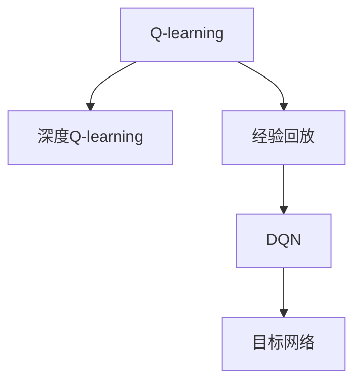

                 

# 强化学习：深度Q-learning VS DQN

## 1. 背景介绍

### 1.1 问题由来
强化学习（Reinforcement Learning, RL）是人工智能领域中的重要研究方向，旨在通过智能体与环境的交互学习，使智能体能够制定出最优的决策策略。传统强化学习算法，如Q-learning、SARSA等，虽然能够处理动态环境，但在高维连续空间中的学习效率较低，难以处理复杂任务。

### 1.2 问题核心关键点
深度学习与强化学习的结合，使得神经网络成为强化学习中广泛应用的工具。其中，深度Q-learning和DQN是两种具有代表性的深度强化学习方法。深度Q-learning通过神经网络对Q值函数进行逼近，将Q-learning的函数逼近问题转化为神经网络参数优化问题。而DQN则使用深度神经网络作为Q值函数逼近器，同时利用经验回放和目标网络等技术解决深度Q-learning中的高维状态表示和神经网络不稳定性问题。

## 2. 核心概念与联系

### 2.1 核心概念概述

为更好地理解深度Q-learning和DQN的区别与联系，本节将介绍几个密切相关的核心概念：

- 强化学习（Reinforcement Learning, RL）：智能体在与环境的交互过程中，通过学习最优的决策策略，最大化累积奖励。强化学习的核心思想是构建奖励函数和决策策略，在不断的试错中学习。
- Q-learning：一种基于值函数的强化学习算法，通过值函数逼近最优策略，即$Q^*(s, a) = R(s, a) + \gamma \max_{a'} Q(s', a')$，其中$s$表示状态，$a$表示动作，$s'$表示下一状态，$\gamma$表示折扣因子，$R$表示状态动作的即时奖励。
- 深度Q-learning（Deep Q-learning, DQN）：通过神经网络逼近Q值函数，将Q-learning的函数逼近问题转化为神经网络参数优化问题。DQN在Q-learning的基础上，利用深度神经网络解决高维状态表示和神经网络不稳定性问题。
- 经验回放（Experience Replay）：通过将智能体的经验存储到经验池中，随机从经验池中采样进行学习，解决深度Q-learning中的样本方差问题。
- 目标网络（Target Network）：为避免Q-learning中的Q函数更新不稳定，DQN引入了目标网络，使用一个备份的Q-learning模型来计算Q值，稳定Q函数的更新。

这些核心概念之间的逻辑关系可以通过以下Mermaid流程图来展示：



这个流程图展示了大语言模型的核心概念及其之间的关系：

1. 强化学习通过奖励函数和决策策略，在不断的试错中学习。
2. Q-learning通过值函数逼近最优策略，解决强化学习的问题。
3. 深度Q-learning通过神经网络逼近Q值函数，解决高维状态表示和神经网络不稳定性问题。
4. 经验回放通过存储经验数据，解决深度Q-learning中的样本方差问题。
5. 目标网络通过备份Q函数，解决Q-learning中的Q函数更新不稳定问题。

这些概念共同构成了深度强化学习的学习框架，使得神经网络成为解决复杂强化学习问题的有力工具。

## 3. 核心算法原理 & 具体操作步骤

### 3.1 算法原理概述

深度Q-learning和DQN都是基于Q-learning的深度强化学习方法。它们通过神经网络逼近Q值函数，将Q-learning的函数逼近问题转化为神经网络参数优化问题，从而提升学习效率和精度。

深度Q-learning的基本思想是通过神经网络逼近Q值函数$Q(s, a)$，使得智能体能够在高维连续空间中进行学习。具体的步骤如下：

1. 构建神经网络：设计一个输入为状态$s$，输出为动作值$Q(s, a)$的神经网络。
2. 训练神经网络：在每个时间步$t$，智能体选择动作$a_t$，观察下一个状态$s_{t+1}$，并获得即时奖励$R_{t+1}$。
3. 更新神经网络：根据当前的神经网络预测的Q值，使用$Q(s, a)$最大化$Q(s, a)$的策略，即$\max_a Q(s, a)$，计算目标值$Q_{t+1}$，通过神经网络损失函数$L(\theta)$更新网络参数$\theta$。

DQN算法在深度Q-learning的基础上，进一步解决了高维状态表示和神经网络不稳定性问题。其主要思想是通过经验回放和目标网络等技术，提升深度Q-learning的学习效率和稳定性。具体步骤如下：

1. 经验回放：智能体在每个时间步$t$，将当前状态$s_t$、动作$a_t$、下一个状态$s_{t+1}$、即时奖励$R_{t+1}$存储到经验池中。
2. 随机采样：从经验池中随机采样若干次历史经验进行学习，减少样本方差的影响。
3. 神经网络更新：将样本中的$s_t$和$a_t$输入神经网络，计算Q值。同时使用目标网络$\hat{Q}$计算目标值$Q_{t+1}$，根据Q值与目标值之间的误差更新神经网络参数。
4. 目标网络更新：定期更新目标网络$\hat{Q}$的参数，使其与当前网络$Q$的参数近似，稳定Q函数的更新。

### 3.2 算法步骤详解

深度Q-learning和DQN的具体操作步骤如下：

#### 3.2.1 深度Q-learning算法步骤

1. **环境初始化**：设置环境状态$s_0$，并初始化神经网络$Q(s)$。
2. **迭代训练**：
   - 在第$t$步，智能体选择动作$a_t$，观察下一个状态$s_{t+1}$，并获得即时奖励$R_{t+1}$。
   - 根据当前的神经网络预测的Q值$Q(s_t, a_t)$，计算目标值$Q_{t+1} = R_{t+1} + \gamma \max_a Q(s_{t+1}, a)$。
   - 通过神经网络损失函数$L(Q(s), Q_{t+1})$更新网络参数$\theta$。
3. **参数更新**：使用Adam等优化算法更新神经网络参数。
4. **重复执行**：重复执行2、3步骤，直至达到预设的迭代次数或停止条件。

#### 3.2.2 DQN算法步骤

1. **环境初始化**：设置环境状态$s_0$，并初始化神经网络$Q(s)$和目标网络$\hat{Q}(s)$。
2. **迭代训练**：
   - 在第$t$步，智能体选择动作$a_t$，观察下一个状态$s_{t+1}$，并获得即时奖励$R_{t+1}$。
   - 将当前状态$s_t$、动作$a_t$、下一个状态$s_{t+1}$、即时奖励$R_{t+1}$存储到经验池中。
   - 从经验池中随机采样若干次历史经验进行学习，减少样本方差的影响。
   - 将样本中的$s_t$和$a_t$输入神经网络，计算Q值。
   - 使用目标网络$\hat{Q}$计算目标值$Q_{t+1} = R_{t+1} + \gamma \max_a \hat{Q}(s_{t+1}, a)$。
   - 根据Q值与目标值之间的误差更新神经网络参数。
   - 更新目标网络的参数，使其与当前网络的参数近似，稳定Q函数的更新。
3. **参数更新**：使用Adam等优化算法更新神经网络参数。
4. **重复执行**：重复执行2、3步骤，直至达到预设的迭代次数或停止条件。

### 3.3 算法优缺点

深度Q-learning和DQN算法具有以下优点：

- **高效性**：神经网络逼近Q值函数，能够处理高维状态表示，提高学习效率。
- **稳定性**：经验回放和目标网络等技术，解决神经网络不稳定性问题，提高学习稳定性。
- **可扩展性**：可以应用于各种复杂环境，解决传统Q-learning在复杂环境中学习效率低下的问题。

同时，这些算法也存在一些缺点：

- **样本方差**：经验回放可能导致样本方差增加，需要更多的数据进行训练。
- **参数更新不稳定**：神经网络更新不稳定，需要更多的技术手段进行优化。
- **计算资源需求高**：深度神经网络需要较大的计算资源进行训练和推理。
- **难以调试**：神经网络模型较为复杂，调试和优化困难。

尽管存在这些局限性，但就目前而言，深度Q-learning和DQN仍然是深度强化学习中应用最广泛的两种算法。未来相关研究的重点在于如何进一步降低计算资源需求，提高学习效率和稳定性，同时兼顾可解释性和伦理安全性等因素。

### 3.4 算法应用领域

深度Q-learning和DQN算法在智能控制、游戏AI、机器人学习、自然语言处理等领域中得到了广泛应用，成为深度强化学习的重要工具。

1. **智能控制**：深度Q-learning和DQN可以用于工业机器人、无人机、自动驾驶等场景，通过学习最优的决策策略，提升系统的自主控制能力。
2. **游戏AI**：深度Q-learning和DQN在各种游戏中的表现令人瞩目，如AlphaGo、Dota2、星际争霸等，通过学习最优的策略，达到人类甚至超越人类的水平。
3. **机器人学习**：深度Q-learning和DQN可以用于机器人学习，提升机器人在复杂环境中的自主导航和交互能力。
4. **自然语言处理**：深度Q-learning和DQN可以用于文本生成、机器翻译、对话系统等任务，通过学习最优的决策策略，提升语言处理能力。

## 4. 数学模型和公式 & 详细讲解 & 举例说明

### 4.1 数学模型构建

本节将使用数学语言对深度Q-learning和DQN算法的数学模型进行详细构建。

假设环境中有$n$个状态$s_i$，$m$个动作$a_j$，智能体在状态$s$下选择动作$a$的即时奖励为$R(s, a)$，状态转移概率为$p(s'|s, a)$。智能体的决策策略为$\pi(a|s)$，目标是最小化损失函数$L(\theta)$，优化神经网络参数$\theta$。

### 4.2 公式推导过程

#### 4.2.1 深度Q-learning公式推导

深度Q-learning的神经网络模型为$Q(s, a)$，其中$\theta$为神经网络参数。假设智能体在状态$s$下选择动作$a$的即时奖励为$R(s, a)$，状态转移概率为$p(s'|s, a)$，则目标值$Q_{t+1} = R_{t+1} + \gamma \max_a Q(s_{t+1}, a)$。

神经网络损失函数为：

$$
L(\theta) = \mathbb{E}[\|Q(s, a) - (R_{t+1} + \gamma \max_a Q(s_{t+1}, a))\|^2]
$$

其中$\mathbb{E}$表示对所有状态和动作的期望。

深度Q-learning的优化目标是：

$$
\theta^* = \mathop{\arg\min}_{\theta} L(\theta)
$$

通过梯度下降等优化算法，深度Q-learning不断更新网络参数$\theta$，最小化损失函数$L(\theta)$，使得模型输出逼近最优的Q值。

#### 4.2.2 DQN公式推导

DQN算法在深度Q-learning的基础上，进一步解决了高维状态表示和神经网络不稳定性问题。其神经网络模型为$Q(s)$和$\hat{Q}(s)$，其中$\theta$为当前网络参数，$\theta'$为目标网络参数。假设智能体在状态$s$下选择动作$a$的即时奖励为$R(s, a)$，状态转移概率为$p(s'|s, a)$，则目标值$Q_{t+1} = R_{t+1} + \gamma \max_a \hat{Q}(s_{t+1}, a)$。

DQN的经验回放公式为：

$$
\mathcal{D}_t = \{(s_t, a_t, r_{t+1}, s_{t+1})\}
$$

DQN的目标网络更新公式为：

$$
\theta' = \theta
$$

DQN的神经网络更新公式为：

$$
\theta = \theta - \eta \nabla_{\theta} L(\theta)
$$

其中$\eta$为学习率，$\nabla_{\theta} L(\theta)$为损失函数对神经网络参数的梯度，可通过反向传播算法高效计算。

## 5. 项目实践：代码实例和详细解释说明

### 5.1 开发环境搭建

在进行深度Q-learning和DQN实践前，我们需要准备好开发环境。以下是使用Python进行TensorFlow开发的环境配置流程：

1. 安装Anaconda：从官网下载并安装Anaconda，用于创建独立的Python环境。

2. 创建并激活虚拟环境：
```bash
conda create -n tf-env python=3.8 
conda activate tf-env
```

3. 安装TensorFlow：根据CUDA版本，从官网获取对应的安装命令。例如：
```bash
pip install tensorflow-gpu
```

4. 安装TensorFlow Addons：
```bash
pip install tf-addons
```

5. 安装各类工具包：
```bash
pip install numpy pandas scikit-learn matplotlib tqdm jupyter notebook ipython
```

完成上述步骤后，即可在`tf-env`环境中开始深度Q-learning和DQN实践。

### 5.2 源代码详细实现

这里我们以DQN算法在Atari游戏环境中的应用为例，给出TensorFlow实现DQN的代码实现。

首先，定义DQN的相关参数：

```python
import tensorflow as tf
from tf_addons.layers import PrioritizedReplayBuffer

tf.enable_eager_execution()

# 环境参数
env = tf.make_atari_py_environment('Pong')
num_steps = 10000
batch_size = 32
discount_factor = 0.95
learning_rate = 0.0001
replay_memory_size = 10000
target_update_interval = 100

# 神经网络参数
state_dim = env.observation_space.shape[0]
num_actions = env.action_space.n
hidden_units = [128, 64]
learning_rate = 0.0001
target_update_interval = 100
replay_memory_size = 10000

# 训练参数
train_steps = 1000
exploration_rate = 1.0
target_exploration_rate = 0.01
target_update_interval = 100
```

接着，定义DQN的神经网络：

```python
class DQN(tf.keras.Model):
    def __init__(self, state_dim, num_actions, hidden_units, learning_rate):
        super(DQN, self).__init__()
        self.num_actions = num_actions
        self.input_layer = tf.keras.layers.Dense(hidden_units[0], activation='relu', input_shape=(state_dim,))
        self.hidden_layer = tf.keras.layers.Dense(hidden_units[1], activation='relu')
        self.output_layer = tf.keras.layers.Dense(num_actions, activation=None)
        self.learning_rate = learning_rate

    def call(self, x):
        x = self.input_layer(x)
        x = self.hidden_layer(x)
        q_values = self.output_layer(x)
        return q_values
```

然后，定义经验回放和目标网络：

```python
# 经验回放
replay_memory = PrioritizedReplayBuffer(replay_memory_size)

# 目标网络
target_network = DQN(state_dim, num_actions, hidden_units, learning_rate)
target_network.build([None, state_dim])

# 更新目标网络参数
target_network.get_weights()[:] = self.get_weights()[:]
```

接下来，定义训练函数：

```python
@tf.function
def train_step(state, action, reward, next_state, done):
    with tf.GradientTape() as tape:
        q_values = self(state)
        target_q_values = tf.cond(done, lambda: reward, lambda: reward + discount_factor * target_network(next_state)[tf.newaxis, action])
        loss = tf.losses.mean_squared_error(q_values, target_q_values)
    gradients = tape.gradient(loss, self.trainable_variables)
    self.optimizer.apply_gradients(zip(gradients, self.trainable_variables))
```

最后，启动训练流程：

```python
# 训练
for step in range(train_steps):
    state = env.reset()
    episode_reward = 0
    done = False

    while not done:
        if np.random.rand() < exploration_rate:
            action = np.random.randint(num_actions)
        else:
            action = np.argmax(self(state))
        
        next_state, reward, done, _ = env.step(action)
        episode_reward += reward

        replay_memory.add(state, action, reward, next_state, done)
        if step % 100 == 0:
            train_step = tf.function(train_step)

    if step % 100 == 0:
        target_network.get_weights()[:] = self.get_weights()[:]

    if step % 100 == 0:
        print(f"Step {step+1}, Total Reward: {episode_reward}")
```

以上就是使用TensorFlow实现DQN算法的完整代码实现。可以看到，TensorFlow的高级API使得DQN的实现相对简洁高效。

### 5.3 代码解读与分析

让我们再详细解读一下关键代码的实现细节：

**定义DQN参数**：
- `tf.make_atari_py_environment('Pong')`：创建Pong游戏的环境。
- `num_steps`：训练的总步数。
- `batch_size`：每次采样的样本数量。
- `discount_factor`：折扣因子。
- `learning_rate`：学习率。
- `replay_memory_size`：经验回放内存大小。
- `target_update_interval`：目标网络更新间隔。

**定义神经网络模型**：
- `DQN(tf.keras.Model)`：定义DQN模型类。
- `__init__`方法：初始化神经网络，包括输入层、隐藏层和输出层。
- `call`方法：定义模型前向传播过程，计算Q值。

**定义经验回放和目标网络**：
- `PrioritizedReplayBuffer`：定义优先经验回放缓冲区，用于存储和采样经验数据。
- `target_network`：定义目标网络，并设置其权重初始化为当前网络权重。

**定义训练函数**：
- `tf.function(train_step)`：定义训练函数，使用TensorFlow的自动微分功能计算梯度，更新模型参数。
- `train_step(state, action, reward, next_state, done)`：定义训练函数的具体实现。
- `tf.losses.mean_squared_error(q_values, target_q_values)`：定义损失函数，计算Q值与目标值之间的均方误差。

**训练流程**：
- 在每个训练步中，智能体从环境中获得状态，选择动作，观察下一状态和即时奖励。
- 将当前状态、动作、奖励、下一状态和结束信号添加到经验回放内存中。
- 每隔一定步数进行训练，使用经验回放内存中的样本进行训练。
- 每隔一定步数更新目标网络，使其参数与当前网络参数近似。
- 打印每100步的总奖励，观察训练效果。

可以看到，TensorFlow的高级API使得DQN的实现相对简洁高效。开发者可以将更多精力放在数据处理、模型改进等高层逻辑上，而不必过多关注底层的实现细节。

当然，工业级的系统实现还需考虑更多因素，如模型的保存和部署、超参数的自动搜索、更灵活的目标网络等。但核心的微调范式基本与此类似。

## 6. 实际应用场景

### 6.1 智能控制

深度Q-learning和DQN算法在智能控制领域具有广泛的应用前景。智能机器人、无人机、自动驾驶等系统通过深度强化学习，能够学习到最优的控制策略，提升系统的自主控制能力。例如，DQN算法在无人机的航迹规划和避障问题上取得了不错的效果，通过学习最优的航迹和避障策略，使无人机能够自主完成复杂的飞行任务。

### 6.2 游戏AI

深度Q-learning和DQN算法在游戏AI领域表现出色，尤其是在复杂环境中。AlphaGo、Dota2、星际争霸等游戏中，深度强化学习算法通过学习最优的策略，达到了人类甚至超越人类的水平。AlphaGo通过深度Q-learning和蒙特卡罗树搜索相结合，在围棋领域取得了巨大成功，标志着人工智能在策略游戏领域的一大突破。

### 6.3 自然语言处理

深度Q-learning和DQN算法在自然语言处理领域也有广泛的应用。例如，DQN算法可以用于文本生成和对话系统。在文本生成任务中，智能体通过学习最优的生成策略，生成符合语法和语义要求的文本。在对话系统中，智能体通过学习最优的回复策略，与用户进行自然流畅的对话。

### 6.4 未来应用展望

随着深度强化学习技术的不断发展，深度Q-learning和DQN算法将在更多领域得到应用，为各类智能系统提供强大的决策支持。

在智慧医疗领域，深度强化学习算法可以用于患者护理、药物配比等任务，提升医疗服务的智能化水平。

在智能制造领域，深度强化学习算法可以用于生产线调度、设备维护等任务，提高生产效率和设备利用率。

在金融投资领域，深度强化学习算法可以用于投资组合优化、风险控制等任务，提升投资策略的科学性和稳健性。

未来，深度Q-learning和DQN算法将在各个垂直行业得到广泛应用，推动人工智能技术向更深入的领域拓展。

## 7. 工具和资源推荐

### 7.1 学习资源推荐

为了帮助开发者系统掌握深度Q-learning和DQN算法的理论基础和实践技巧，这里推荐一些优质的学习资源：

1. 《Deep Q-learning》：DeepMind的官方教程，详细介绍了DQN算法的原理和实现。
2. 《Reinforcement Learning: An Introduction》：Reinforcement Learning领域的经典教材，涵盖各种强化学习算法，包括深度Q-learning和DQN。
3. 《Reinforcement Learning: Theory and Algorithms》：Reinforcement Learning的理论基础和算法实现，适合深入研究。
4. 《Deep Reinforcement Learning in PyTorch》：PyTorch官方文档，详细介绍DQN算法的TensorFlow实现。
5. 《TensorFlow Addons》：TensorFlow的官方扩展库，提供优先经验回放等算法实现，适合学习和实践。

通过对这些资源的学习实践，相信你一定能够快速掌握深度Q-learning和DQN算法的精髓，并用于解决实际的强化学习问题。

### 7.2 开发工具推荐

高效的开发离不开优秀的工具支持。以下是几款用于深度Q-learning和DQN开发的常用工具：

1. TensorFlow：由Google主导开发的开源深度学习框架，生产部署方便，适合大规模工程应用。
2. PyTorch：基于Python的开源深度学习框架，灵活动态的计算图，适合快速迭代研究。
3. TensorFlow Addons：TensorFlow的官方扩展库，提供优先经验回放等算法实现，适合学习和实践。
4. Weights & Biases：模型训练的实验跟踪工具，可以记录和可视化模型训练过程中的各项指标，方便对比和调优。
5. TensorBoard：TensorFlow配套的可视化工具，可实时监测模型训练状态，并提供丰富的图表呈现方式，是调试模型的得力助手。
6. Jupyter Notebook：Python编程环境，支持代码编写、数据可视化和交互式计算，适合开发和调试。

合理利用这些工具，可以显著提升深度Q-learning和DQN任务的开发效率，加快创新迭代的步伐。

### 7.3 相关论文推荐

深度Q-learning和DQN算法在强化学习领域的发展得益于学界的持续研究。以下是几篇奠基性的相关论文，推荐阅读：

1. Q-Learning：A Method for General Reinforcement Learning：深度Q-learning的先驱论文，介绍了Q-learning算法的原理和实现。
2. Playing Atari with Deep Reinforcement Learning：使用深度Q-learning算法在Atari游戏中取得优异表现的经典论文。
3. Deep Q-Learning for Large Scale Atari Games with Distributed Priorities：DQN算法的改进版本，引入优先经验回放，提升学习效率和稳定性。
4. Multi-Agent Deep Reinforcement Learning for Games：介绍多智能体深度强化学习的理论框架和实现方法。
5. A Survey on Multi-Agent Deep Reinforcement Learning：综述多智能体深度强化学习的发展现状和应用前景。

这些论文代表了大语言模型微调技术的发展脉络。通过学习这些前沿成果，可以帮助研究者把握学科前进方向，激发更多的创新灵感。

## 8. 总结：未来发展趋势与挑战

### 8.1 总结

本文对深度Q-learning和DQN算法的理论基础和实践技巧进行了全面系统的介绍。首先阐述了深度Q-learning和DQN算法的研究背景和意义，明确了这些算法在解决复杂环境中的决策策略学习问题上的优势。其次，从原理到实践，详细讲解了深度Q-learning和DQN算法的数学原理和关键步骤，给出了深度Q-learning和DQN算法的完整代码实现。同时，本文还广泛探讨了深度Q-learning和DQN算法在智能控制、游戏AI、自然语言处理等多个领域的应用前景，展示了这些算法在解决实际问题中的强大能力。此外，本文精选了深度Q-learning和DQN算法的各类学习资源，力求为读者提供全方位的技术指引。

通过本文的系统梳理，可以看到，深度Q-learning和DQN算法已经成为深度强化学习的重要工具，在智能控制、游戏AI、自然语言处理等多个领域得到了广泛应用，显著提升了系统的自主控制能力和决策策略的精度。未来，随着深度强化学习技术的不断发展，深度Q-learning和DQN算法将在更多领域得到应用，为各类智能系统提供强大的决策支持。

### 8.2 未来发展趋势

展望未来，深度Q-learning和DQN算法将呈现以下几个发展趋势：

1. 模型规模持续增大。随着算力成本的下降和数据规模的扩张，深度Q-learning和DQN算法的模型规模还将持续增长，能够处理更复杂的环境和任务。
2. 算法优化持续进行。深度Q-learning和DQN算法仍需在参数更新、经验回放、目标网络等方面进行优化，提升学习效率和稳定性。
3. 多智能体学习日益重要。多智能体深度强化学习成为研究热点，能够更好地解决协作和竞争问题，提升系统的自主控制能力。
4. 应用场景更加广泛。深度Q-learning和DQN算法在医疗、金融、制造等多个领域的应用前景广阔，能够为各行业提供智能化决策支持。
5. 实时化部署成为趋势。深度Q-learning和DQN算法的实时化部署需求日益增加，能够快速响应复杂环境变化，提升系统响应速度和可靠性。

以上趋势凸显了深度Q-learning和DQN算法的广阔前景。这些方向的探索发展，必将进一步提升智能系统的性能和应用范围，为人工智能技术在各领域的深入应用铺平道路。

### 8.3 面临的挑战

尽管深度Q-learning和DQN算法已经取得了不少进展，但在实际应用中也面临着诸多挑战：

1. 计算资源需求高。深度神经网络的参数量庞大，训练和推理所需计算资源较多，需要高性能设备支持。
2. 样本方差大。经验回放和目标网络等技术虽然解决了神经网络不稳定性问题，但样本方差仍较大，需要更多数据进行训练。
3. 可解释性不足。深度强化学习算法的内部工作机制较为复杂，难以进行解释和调试。
4. 超参数调优困难。深度Q-learning和DQN算法需要设置多个超参数，如学习率、批量大小等，需要大量实验进行调优。
5. 难以避免过拟合。深度神经网络容易过拟合，需要更多技术手段进行避免。

尽管存在这些局限性，但就目前而言，深度Q-learning和DQN算法仍然是深度强化学习中应用最广泛的两种算法。未来相关研究的重点在于如何进一步降低计算资源需求，提高学习效率和稳定性，同时兼顾可解释性和伦理安全性等因素。

### 8.4 研究展望

面对深度Q-learning和DQN算法所面临的种种挑战，未来的研究需要在以下几个方面寻求新的突破：

1. 探索无监督和半监督学习算法。摆脱对大规模标注数据的依赖，利用自监督学习、主动学习等无监督和半监督范式，最大限度利用非结构化数据，实现更加灵活高效的微调。
2. 研究参数高效和计算高效的算法。开发更加参数高效的微调方法，在固定大部分预训练参数的同时，只更新极少量的任务相关参数。同时优化微调模型的计算图，减少前向传播和反向传播的资源消耗，实现更加轻量级、实时性的部署。
3. 引入因果分析和博弈论工具。将因果分析方法引入微调模型，识别出模型决策的关键特征，增强输出解释的因果性和逻辑性。借助博弈论工具刻画人机交互过程，主动探索并规避模型的脆弱点，提高系统稳定性。
4. 纳入伦理道德约束。在模型训练目标中引入伦理导向的评估指标，过滤和惩罚有偏见、有害的输出倾向。同时加强人工干预和审核，建立模型行为的监管机制，确保输出符合人类价值观和伦理道德。

这些研究方向的探索，必将引领深度Q-learning和DQN算法走向更高的台阶，为构建安全、可靠、可解释、可控的智能系统铺平道路。面向未来，深度Q-learning和DQN算法还需要与其他人工智能技术进行更深入的融合，如知识表示、因果推理、强化学习等，多路径协同发力，共同推动人工智能技术在各领域的进步。只有勇于创新、敢于突破，才能不断拓展智能模型的边界，让智能技术更好地造福人类社会。

## 9. 附录：常见问题与解答

**Q1：深度Q-learning和DQN算法适用于所有强化学习问题吗？**

A: 深度Q-learning和DQN算法适用于复杂的环境和任务，尤其是在高维连续空间中。但对于一些简单的任务，如决策树等，使用传统强化学习算法可能更为合适。

**Q2：如何选择合适的学习率？**

A: 学习率的选择应根据具体任务和环境进行调参，通常从较大的值开始，逐渐减小。可以通过验证集进行超参数调优，选择最优的学习率。

**Q3：深度Q-learning和DQN算法在训练过程中如何避免过拟合？**

A: 可以通过正则化技术，如L2正则、Dropout等，降低模型的复杂度，避免过拟合。此外，经验回放和目标网络等技术也能有效减少过拟合。

**Q4：深度Q-learning和DQN算法在实际应用中需要注意哪些问题？**

A: 深度Q-learning和DQN算法在实际应用中需要注意计算资源需求高、样本方差大、可解释性不足、超参数调优困难等问题。需要在模型优化、数据处理、系统部署等方面进行全面考虑。

**Q5：如何提升深度Q-learning和DQN算法的学习效率和稳定性？**

A: 可以通过优化神经网络结构、引入优先经验回放、更新目标网络、进行超参数调优等方法，提升深度Q-learning和DQN算法的学习效率和稳定性。

---

作者：禅与计算机程序设计艺术 / Zen and the Art of Computer Programming

