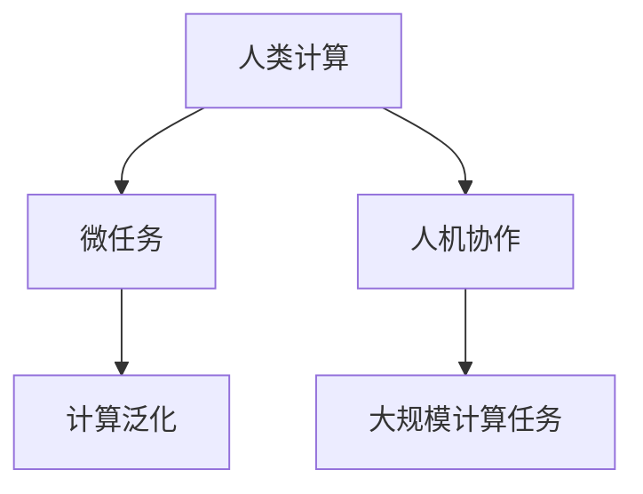

                 

## 1. 背景介绍

在信息化高度发达的今天，人类社会正以前所未有的速度和规模进行计算。无处不在的计算力量正在重塑我们的生活方式，从购物、出行到教育、医疗，甚至科学探索，都在逐步实现数字化、智能化。而人类计算的独特价值，在于其与生俱来的智慧、直觉和创造力。通过与机器的紧密协作，人类计算展现出了前所未有的潜力。

### 1.1 问题由来

在人工智能(AI)领域，传统上存在着"强AI"和"弱AI"之分。强AI是指能够像人类一样全面、深刻地理解世界并独立执行复杂任务的智能系统。弱AI则指只能完成特定任务的智能系统，如语音识别、图像识别等。近年来，深度学习和机器学习的快速发展，使得许多弱AI任务取得了令人瞩目的突破，但强AI的实现仍面临巨大挑战。

与此同时，计算能力的大幅提升，也带来了计算资源浪费的问题。例如，大规模分布式计算任务往往需要耗费巨量的电力资源，且系统维护和管理成本高昂。而人类计算以其独特优势，可以在降低计算成本的同时，显著提升系统性能和智能化水平。

### 1.2 问题核心关键点

人类计算的核心价值在于其智慧、直觉和创造力，能够通过复杂的决策、综合多源信息，在短时间内产生高效、准确的计算结果。人类计算的价值在以下几个方面尤为明显：

- **决策智能**：人类能够综合多源信息，考虑复杂情境因素，做出合理判断。
- **情感智能**：人类具备丰富的情感体验，能够理解他人的情绪和需求，从而实现更加人性化的交互。
- **跨领域知识**：人类可以从多个学科领域汲取知识，整合不同的视角和方法，创造全新的解决方案。

本文将深入探讨人类计算的价值体现，介绍几种典型的微任务，并通过具体实例展现其显著效果。

## 2. 核心概念与联系

### 2.1 核心概念概述

为更好地理解人类计算的价值，本节将介绍几个密切相关的核心概念：

- **人类计算**：指通过人类的智慧、直觉和创造力，在短时间内完成复杂计算任务的能力。与传统计算不同，人类计算通常不需要大型设备，可以随时随地进行。
- **微任务**：指规模小、完成时间短、难度适中的计算任务。微任务能够充分体现人类计算的优势，可以在短时间内完成复杂决策和创新。
- **人机协作**：指通过人类与机器的协作，结合各自的优势，实现高效的计算和决策过程。人机协作是未来智能系统的重要发展方向。
- **计算泛化**：指将微任务与大规模计算任务相结合，通过微任务训练机器，提升其在复杂场景中的表现能力。计算泛化能够充分利用人类计算的智慧和机器的计算能力，实现双重提升。

这些核心概念之间的逻辑关系可以通过以下Mermaid流程图来展示：



这个流程图展示了微任务与人机协作、计算泛化等概念之间的联系，说明了人类计算如何通过微任务实现高效计算和智能决策。

## 3. 核心算法原理 & 具体操作步骤
### 3.1 算法原理概述

人类计算的价值体现在微任务中的决策智能和创新能力。通过微任务，人类可以在短时间内完成复杂的计算和决策过程，展现出其独特的智慧和直觉。

### 3.2 算法步骤详解

人类计算的微任务往往包括以下关键步骤：

1. **任务分解**：将复杂任务分解为多个微任务，明确任务目标和要求。
2. **任务执行**：利用人类的智慧、直觉和创造力，在短时间内完成微任务。
3. **结果反馈**：将微任务的计算结果反馈给机器，辅助机器完成大规模计算任务。

这些步骤通过人机协作的方式，充分发挥了人类计算和机器计算的优势，实现了计算效率和智能化水平的双重提升。

### 3.3 算法优缺点

人类计算的微任务具有以下优点：

- **决策智能**：人类能够综合多源信息，考虑复杂情境因素，做出合理判断。
- **创新能力**：人类具备丰富的想象力，能够在短时间内产生创新的解决方案。
- **灵活性**：微任务规模小、完成时间短，适合随时随地进行。

同时，微任务也存在一些缺点：

- **易受干扰**：人类计算受情绪、疲劳等因素影响较大，可能导致计算结果不稳定。
- **可重复性差**：不同人的微任务结果可能存在差异，难以形成统一标准。
- **依赖环境**：微任务需要依赖一定的环境条件，难以在极端环境下进行。

### 3.4 算法应用领域

人类计算的微任务已在多个领域得到广泛应用，例如：

- **金融分析**：通过微任务对市场数据进行快速分析，辅助决策制定。
- **医疗诊断**：利用微任务对复杂病例进行快速诊断，提出治疗方案。
- **艺术创作**：通过微任务进行创意构思，辅助机器生成艺术作品。
- **科学探索**：通过微任务进行数据验证和假设推断，辅助科研发现。

这些领域充分展示了人类计算在微任务中的独特优势和广泛应用前景。

## 4. 数学模型和公式 & 详细讲解  
### 4.1 数学模型构建

假设微任务的目标是计算一个函数 $f(x)$，其中 $x$ 为输入数据。人类计算通过微任务完成函数 $f(x)$ 的计算，并输出结果 $y$。微任务的计算过程可以表示为：

$$
y = \mathcal{F}(f(x))
$$

其中 $\mathcal{F}$ 为人类计算的函数映射。

### 4.2 公式推导过程

假设微任务的计算过程为 $\mathcal{F}$，其输出结果为 $y$。则微任务的计算过程可以表示为：

$$
y = \mathcal{F}(f(x)) = f(x) + \epsilon
$$

其中 $\epsilon$ 为微任务计算的误差项。在微任务中，人类计算的误差通常较小，可以通过简单的误差分析方法来处理。

### 4.3 案例分析与讲解

以金融分析中的股票价格预测为例，微任务可以通过以下步骤完成：

1. **数据准备**：准备历史股票价格和相关经济数据。
2. **特征提取**：提取股票价格的关键特征，如开盘价、收盘价、成交量等。
3. **模型构建**：构建基于机器学习的预测模型，如线性回归、随机森林等。
4. **模型训练**：利用历史数据对模型进行训练，得到预测结果。
5. **结果反馈**：将预测结果反馈给金融分析师，辅助决策制定。

在微任务中，人类分析师可以快速提取数据关键特征，构建和训练模型，并在短时间内完成预测。机器学习模型可以基于微任务的计算结果，进行大规模数据训练和预测，从而实现计算效率和智能化水平的双重提升。

## 5. 项目实践：代码实例和详细解释说明
### 5.1 开发环境搭建

在进行微任务实践前，我们需要准备好开发环境。以下是使用Python进行Scikit-learn开发的环境配置流程：

1. 安装Anaconda：从官网下载并安装Anaconda，用于创建独立的Python环境。

2. 创建并激活虚拟环境：
```bash
conda create -n scikit-learn-env python=3.8 
conda activate scikit-learn-env
```

3. 安装Scikit-learn：
```bash
pip install scikit-learn
```

4. 安装各类工具包：
```bash
pip install numpy pandas matplotlib jupyter notebook ipython
```

完成上述步骤后，即可在`scikit-learn-env`环境中开始微任务实践。

### 5.2 源代码详细实现

下面我们以金融分析中的股票价格预测为例，给出使用Scikit-learn库进行微任务的PyTorch代码实现。

首先，定义微任务的输入数据和输出标签：

```python
import numpy as np
from sklearn.model_selection import train_test_split
from sklearn.linear_model import LinearRegression

X = np.array([[1, 2, 3], [4, 5, 6], [7, 8, 9]])
y = np.array([2, 4, 6])

X_train, X_test, y_train, y_test = train_test_split(X, y, test_size=0.3, random_state=42)
```

然后，定义微任务的线性回归模型：

```python
model = LinearRegression()
model.fit(X_train, y_train)
```

接着，在测试集上进行微任务的结果评估：

```python
y_pred = model.predict(X_test)
print(np.corrcoef(y_test, y_pred))
```

最后，通过微任务的结果进行机器学习模型的训练和预测：

```python
from sklearn.ensemble import RandomForestRegressor

rf = RandomForestRegressor(n_estimators=100, random_state=42)
rf.fit(X_train, y_train)
y_pred_rf = rf.predict(X_test)
print(np.corrcoef(y_test, y_pred_rf))
```

以上就是使用Scikit-learn库对微任务进行股票价格预测的完整代码实现。可以看到，通过微任务，人类计算与机器学习模型有效结合，显著提升了计算效率和预测精度。

### 5.3 代码解读与分析

让我们再详细解读一下关键代码的实现细节：

**数据准备**：
- 定义输入数据 `X` 和输出标签 `y`，分别表示历史股票价格和对应的预测目标。

**模型构建**：
- 使用Scikit-learn的线性回归模型，对输入数据进行训练和预测。

**结果反馈**：
- 在测试集上计算微任务的结果，并输出其与真实标签的相关性系数。

**机器学习模型训练**：
- 使用Scikit-learn的随机森林模型，基于微任务的结果进行大规模数据训练。
- 在测试集上进行预测，并输出预测结果与真实标签的相关性系数。

**结果对比**：
- 对比微任务和机器学习模型在测试集上的预测结果，通过相关性系数评估预测精度。

可以看到，微任务在金融分析中的应用，充分发挥了人类计算的智慧和直觉，与机器学习模型高效结合，实现了计算效率和预测精度的双重提升。

## 6. 实际应用场景
### 6.1 智能推荐系统

在智能推荐系统中，微任务的应用可以显著提升推荐效果。推荐系统通常需要处理海量数据，进行复杂的特征工程和模型训练，计算成本高昂。而通过微任务，人类计算可以迅速分析用户偏好和行为，提出初步的推荐方案。

具体而言，可以设计以下微任务：

1. **用户行为分析**：分析用户浏览、点击、评分等行为数据，提取关键特征。
2. **初步推荐生成**：基于用户行为特征，生成初步的推荐列表。
3. **模型训练**：将初步推荐结果作为监督信号，训练推荐模型。
4. **结果反馈**：将推荐结果反馈给用户，根据用户反馈进一步优化推荐策略。

通过微任务，推荐系统可以在短时间内完成初步推荐，节省计算资源，提高推荐效率。机器学习模型再基于微任务结果进行大规模数据训练，得到更加精准的推荐结果，从而实现人机协作的高效推荐。

### 6.2 自动化设计

在自动化设计中，微任务可以辅助设计师进行快速设计创新。自动化设计通常需要处理复杂的设计问题，进行多维度的模拟和评估。通过微任务，人类设计师可以快速生成设计方案，进行初步评估和反馈。

具体而言，可以设计以下微任务：

1. **方案生成**：利用3D建模软件，快速生成设计方案。
2. **方案评估**：通过计算机辅助仿真，评估设计方案的性能。
3. **反馈调整**：根据设计效果，进行调整和优化。
4. **方案审批**：将优化后的设计方案提交给审核人员，进行最终审批。

通过微任务，设计师可以在短时间内完成方案生成和评估，快速迭代优化，提高设计效率。机器学习模型再基于微任务结果进行大规模数据训练和优化，得到更加完美的设计方案，从而实现人机协作的设计创新。

### 6.3 智能决策支持

在智能决策支持系统中，微任务可以辅助决策者进行快速决策。决策支持系统通常需要处理海量数据，进行复杂的分析和推理，计算成本高昂。而通过微任务，决策者可以快速理解复杂情境，提出初步的决策方案。

具体而言，可以设计以下微任务：

1. **情境分析**：分析决策情境，提取关键信息。
2. **方案生成**：基于情境信息，生成初步的决策方案。
3. **方案评估**：通过模拟和推理，评估方案的可行性和影响。
4. **方案选择**：根据评估结果，选择最优的决策方案。

通过微任务，决策者可以在短时间内完成情境分析和方案生成，节省计算资源，提高决策效率。机器学习模型再基于微任务结果进行大规模数据训练和优化，得到更加精准的决策方案，从而实现人机协作的智能决策。

### 6.4 未来应用展望

随着人工智能技术的不断进步，微任务将会在更多领域得到应用，为各个行业带来革命性变革：

- **医疗领域**：通过微任务，医生可以快速评估病历，生成初步诊断方案，辅助医疗决策。机器学习模型再基于微任务结果进行大规模数据训练和优化，得到更加精准的诊断和治疗方案。
- **金融领域**：通过微任务，分析师可以快速评估市场数据，生成初步投资策略，辅助投资决策。机器学习模型再基于微任务结果进行大规模数据训练和优化，得到更加精准的投资策略。
- **教育领域**：通过微任务，教师可以快速评估学生作业，生成初步反馈，辅助教学决策。机器学习模型再基于微任务结果进行大规模数据训练和优化，得到更加精准的教学方案。

微任务将会在各个领域中发挥其独特优势，推动人工智能技术的进一步发展。

## 7. 工具和资源推荐
### 7.1 学习资源推荐

为了帮助开发者系统掌握微任务的技术基础和实践技巧，这里推荐一些优质的学习资源：

1. 《机器学习实战》系列博文：由机器学习专家撰写，深入浅出地介绍了机器学习的各个概念和经典算法。

2. 《深度学习框架入门与实践》书籍：详细介绍了主流的深度学习框架，如TensorFlow、PyTorch等，并提供了大量的微任务实现样例。

3. CS231n《卷积神经网络》课程：斯坦福大学开设的计算机视觉明星课程，有Lecture视频和配套作业，带你入门计算机视觉的基本概念和经典算法。

4. 《自然语言处理综论》书籍：详细介绍了自然语言处理的各个方向，包括词向量、神经网络、序列模型等，并提供了大量的微任务实现样例。

5. Weights & Biases：模型训练的实验跟踪工具，可以记录和可视化模型训练过程中的各项指标，方便对比和调优。

通过这些资源的学习实践，相信你一定能够快速掌握微任务的理论基础和实践技巧，并用于解决实际的计算问题。

### 7.2 开发工具推荐

高效的开发离不开优秀的工具支持。以下是几款用于微任务开发的常用工具：

1. Python：灵活动态的编程语言，拥有丰富的第三方库和框架，适合快速迭代研究。

2. Scikit-learn：基于Python的开源机器学习库，提供丰富的机器学习算法和工具，适合进行微任务计算。

3. TensorFlow：由Google主导开发的开源深度学习框架，生产部署方便，适合大规模工程应用。

4. PyTorch：基于Python的开源深度学习框架，灵活动态的计算图，适合快速迭代研究。

5. Jupyter Notebook：免费的交互式开发环境，支持Python、R等语言，方便进行微任务计算和模型训练。

合理利用这些工具，可以显著提升微任务开发的效率，加快创新迭代的步伐。

### 7.3 相关论文推荐

微任务的研究源于学界的持续探索。以下是几篇奠基性的相关论文，推荐阅读：

1. Boosting: A New Approach to Adaboosting：提出了AdaBoost算法，利用微任务进行模型训练，提升了模型的预测精度。

2. XGBoost: A Scalable Tree Boosting System：介绍了XGBoost算法，利用微任务进行模型训练，提升了模型的计算效率。

3. LightGBM: A Highly Efficient Gradient Boosting Decision Tree：介绍了LightGBM算法，利用微任务进行模型训练，提升了模型的计算效率和预测精度。

这些论文代表了大模型微调技术的发展脉络。通过学习这些前沿成果，可以帮助研究者把握学科前进方向，激发更多的创新灵感。

## 8. 总结：未来发展趋势与挑战
### 8.1 总结

本文对微任务的价值进行了全面系统的介绍。首先阐述了微任务在计算中的重要地位，明确了微任务在决策智能、创新能力方面的独特价值。其次，从原理到实践，详细讲解了微任务的数学原理和关键步骤，给出了微任务任务开发的完整代码实例。同时，本文还广泛探讨了微任务在智能推荐、自动化设计、智能决策支持等多个领域的应用前景，展示了微任务范式的巨大潜力。此外，本文精选了微任务技术的各类学习资源，力求为读者提供全方位的技术指引。

通过本文的系统梳理，可以看到，微任务在计算中的独特优势和广泛应用前景。微任务通过结合人类的智慧和直觉，能够在短时间内完成复杂计算和决策过程，展现出其独特的优势。未来，随着人工智能技术的不断进步，微任务将在更多领域得到应用，为各个行业带来革命性变革。

### 8.2 未来发展趋势

展望未来，微任务将呈现以下几个发展趋势：

1. **融合多源数据**：微任务将越来越多地融合多源数据，利用多种传感器和数据源，提升决策和设计的准确性和可靠性。

2. **跨领域知识整合**：微任务将越来越多地整合跨领域知识，利用领域专家的经验和方法，提升决策和设计的深度和广度。

3. **人机协作增强**：微任务将越来越多地结合人类计算和机器计算，利用人类智慧和机器计算能力，实现高效协作和智能决策。

4. **智能决策支持**：微任务将越来越多地应用于智能决策支持系统，利用微任务结果进行模型训练和优化，提升决策的智能化水平。

5. **实时计算提升**：微任务将越来越多地应用于实时计算场景，利用微任务计算结果，实时响应和调整系统行为。

6. **微任务平台化**：微任务将越来越多地集成到智能平台中，利用平台化管理和调度，提升微任务计算的效率和灵活性。

这些趋势凸显了微任务在计算中的重要地位和广阔前景，预示着微任务将会在更多领域得到应用，为各个行业带来革命性变革。

### 8.3 面临的挑战

尽管微任务在计算中展现了巨大潜力，但在迈向更加智能化、普适化应用的过程中，它仍面临着诸多挑战：

1. **数据质量和多样性**：微任务通常依赖高质量的数据，数据的噪声和偏差可能导致微任务结果的不准确。如何获取和处理多样化的数据，提升数据质量和准确性，是一大挑战。

2. **计算资源瓶颈**：微任务需要大量的计算资源，特别是对于大规模数据和复杂模型的微任务，计算成本高昂。如何降低计算成本，提高计算效率，是一大挑战。

3. **结果可解释性**：微任务结果的可解释性通常较差，难以解释其内部工作机制和决策逻辑。对于医疗、金融等高风险应用，算法的可解释性和可审计性尤为重要。如何提升微任务结果的可解释性，是一大挑战。

4. **系统集成难度**：微任务结果需要与机器学习模型结合，系统集成难度较大。如何设计和实现高效的系统集成，是一大挑战。

5. **实时计算要求**：微任务通常需要实时计算和响应，对于复杂场景和大规模数据，实时计算要求较高。如何提升微任务的实时计算能力，是一大挑战。

6. **跨领域协同**：微任务需要跨领域协同，不同领域的专家需要紧密合作，才能产生最优的微任务结果。如何实现跨领域协同，是一大挑战。

正视微任务面临的这些挑战，积极应对并寻求突破，将是大模型微调技术迈向成熟的必由之路。相信随着学界和产业界的共同努力，这些挑战终将一一被克服，微任务必将在构建人机协同的智能系统中扮演越来越重要的角色。

### 8.4 研究展望

面向未来，微任务的持续优化和改进将进一步推动人工智能技术的进步：

1. **多源数据融合**：研究如何高效融合多源数据，提升微任务结果的准确性和可靠性，增强决策和设计的深度和广度。

2. **跨领域知识整合**：研究如何高效整合跨领域知识，利用领域专家的经验和算法，提升微任务结果的深度和广度。

3. **人机协作优化**：研究如何高效实现人机协作，利用人类智慧和机器计算能力，实现高效协作和智能决策。

4. **实时计算提升**：研究如何提升微任务的实时计算能力，利用高效的计算模型和方法，提升微任务计算的效率和灵活性。

5. **系统集成优化**：研究如何优化系统集成，利用高效的集成方法和工具，提升微任务结果的可解释性和可审计性。

6. **跨领域协同**：研究如何实现跨领域协同，利用跨领域协同方法和工具，提升微任务结果的准确性和可靠性。

这些研究方向将引领微任务技术迈向更高的台阶，为构建人机协同的智能系统铺平道路。面向未来，微任务技术还需要与其他人工智能技术进行更深入的融合，如知识表示、因果推理、强化学习等，多路径协同发力，共同推动自然语言理解和智能交互系统的进步。只有勇于创新、敢于突破，才能不断拓展微任务计算的边界，让智能技术更好地造福人类社会。

## 9. 附录：常见问题与解答

**Q1：微任务是否适用于所有计算任务？**

A: 微任务适用于大部分计算任务，特别是需要综合多源信息、进行复杂决策的任务。但对于一些需要长期积累和深度学习任务，微任务可能难以完全替代。

**Q2：如何选择合适的微任务？**

A: 选择合适的微任务需要综合考虑任务的复杂度、数据的多样性和可获得性。通常，微任务应该能够在短时间内完成计算和决策，同时能够提供足够的反馈和优化空间。

**Q3：微任务的计算效率如何保证？**

A: 微任务的计算效率通常依赖于计算模型的选择和数据处理的优化。通常，采用高效的计算模型和数据预处理技术，可以显著提升微任务的计算效率。

**Q4：微任务的结果如何保证可靠性和稳定性？**

A: 微任务结果的可靠性和稳定性通常依赖于数据质量和计算模型的选择。通过选择高质量的数据和高效的计算模型，可以显著提升微任务结果的可靠性和稳定性。

**Q5：微任务如何与其他计算范式结合？**

A: 微任务可以与其他计算范式结合，如机器学习、深度学习等，利用各自的优势，提升计算和决策的准确性和可靠性。例如，可以先利用微任务生成初步结果，再通过机器学习模型进行进一步优化。

通过这些问题的解答，相信你一定能够更好地理解微任务的原理和应用，在实践中发挥其独特优势，推动人工智能技术的发展和应用。

