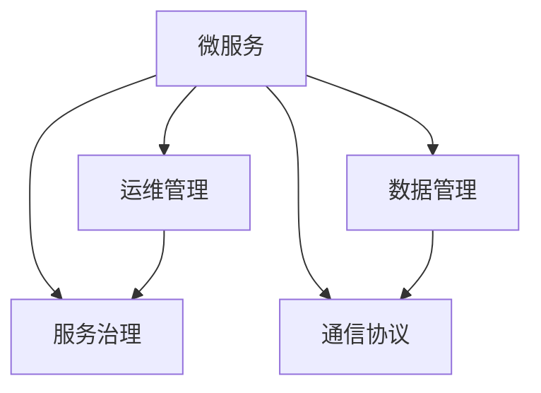

                 

# 微服务架构：设计模式与最佳实践

> 关键词：微服务、分布式系统、容器化、服务网格、API网关、数据管理、弹性伸缩、服务发现

## 1. 背景介绍

### 1.1 问题由来
随着互联网技术的飞速发展，企业应用规模不断扩大，功能日益复杂。传统的单体应用架构难以应对日益增长的业务需求，导致系统结构臃肿、运维困难、扩展性差等问题。为了应对这些挑战，微服务架构应运而生。

微服务架构（Microservices Architecture）是一种架构风格，将大型应用拆分为多个小而独立的、可独立部署和管理的微服务，每个微服务专注于特定的业务领域，通过轻量级通信机制实现服务之间的协同工作。

微服务架构的优势在于：
- **独立部署**：每个微服务可以独立部署，提高了系统的部署效率和可维护性。
- **弹性扩展**：可以根据业务负载动态调整微服务实例数量，提高了系统的可扩展性。
- **故障隔离**：单个微服务的故障不会影响整个系统，提高了系统的可靠性。
- **技术多样性**：各个微服务可以选择最合适的技术栈，提高了系统的灵活性。

尽管微服务架构具有诸多优势，但其实施过程中仍面临许多挑战，如服务通信、数据一致性、服务发现、负载均衡、安全性等。本文将系统阐述微服务架构的设计模式与最佳实践，帮助开发者更好地构建、部署和运维微服务架构。

### 1.2 问题核心关键点
微服务架构的核心关键点包括：
- **微服务的定义**：微服务是独立部署、可扩展、可互操作的小型应用，专注于单一业务功能。
- **服务治理**：通过服务注册和发现、负载均衡、故障恢复等机制，实现服务之间的协同工作。
- **数据管理**：解决微服务之间的数据一致性、分布式事务等问题。
- **通信协议**：选择合适的通信协议，如HTTP/REST、gRPC等，实现服务之间的交互。
- **运维管理**：通过容器化、服务网格、API网关等工具，实现服务的自动化运维。

这些关键点将贯穿整个文章，我们将逐一深入探讨。

## 2. 核心概念与联系

### 2.1 核心概念概述

为更好地理解微服务架构，本节将介绍几个密切相关的核心概念：

- **微服务(Microservice)**：独立部署、可扩展、可互操作的小型应用，专注于单一业务功能。
- **服务治理(Service Governance)**：通过服务注册和发现、负载均衡、故障恢复等机制，实现服务之间的协同工作。
- **数据管理(Data Management)**：解决微服务之间的数据一致性、分布式事务等问题。
- **通信协议(Communication Protocol)**：选择合适的通信协议，如HTTP/REST、gRPC等，实现服务之间的交互。
- **运维管理(Operational Management)**：通过容器化、服务网格、API网关等工具，实现服务的自动化运维。

这些核心概念之间的逻辑关系可以通过以下Mermaid流程图来展示：



这个流程图展示了几大核心概念及其之间的关系：

1. 微服务是构建微服务架构的基础单元，专注于单一业务功能。
2. 服务治理是微服务之间的协同工作机制，通过服务注册和发现、负载均衡、故障恢复等实现。
3. 数据管理解决微服务之间的数据一致性、分布式事务等问题。
4. 通信协议实现微服务之间的交互，选择合适的通信协议至关重要。
5. 运维管理通过容器化、服务网格、API网关等工具，实现微服务的自动化运维。

这些概念共同构成了微服务架构的核心框架，为其高效、可靠、可扩展提供了坚实的基础。

## 3. 核心算法原理 & 具体操作步骤
### 3.1 算法原理概述

微服务架构的设计和实施主要基于以下原理：

- **分治原则**：将应用拆分为多个独立、自治的微服务，每个微服务专注于单一业务功能。
- **松耦合原则**：服务之间通过轻量级通信协议进行交互，松耦合性提高了系统的灵活性和可维护性。
- **自动化原则**：使用容器化、CI/CD等工具，实现服务的自动化部署和运维。
- **弹性原则**：根据业务负载动态调整服务实例数量，实现系统的弹性扩展。

### 3.2 算法步骤详解

微服务架构的设计和实施主要包括以下几个关键步骤：

**Step 1: 拆分应用**
- 确定应用的业务功能，将应用拆分为多个独立的微服务。每个微服务应专注于单一业务功能，如用户管理、订单管理、库存管理等。

**Step 2: 设计服务协议**
- 选择合适的通信协议，如HTTP/REST、gRPC、AMQP等，实现服务之间的交互。
- 定义服务的接口规范，包括请求和响应的格式、异常处理机制等。

**Step 3: 实现服务逻辑**
- 使用合适的编程语言和框架，实现各个微服务的业务逻辑。
- 使用容器化技术，如Docker、Kubernetes等，将微服务打包为独立的可移植容器。

**Step 4: 实现服务治理**
- 通过服务注册和发现机制，实现服务的动态管理。
- 使用负载均衡技术，如Nginx、Istio等，实现服务的流量分发和负载均衡。
- 实现服务的故障恢复机制，如重试、熔断、降级等，提高系统的可靠性和鲁棒性。

**Step 5: 实现数据管理**
- 解决微服务之间的数据一致性问题，如分布式事务、数据库分片等。
- 使用数据缓存、消息队列等技术，提高系统的吞吐量和延迟。

**Step 6: 实现自动化运维**
- 使用CI/CD工具，如Jenkins、Travis CI等，实现服务的自动化部署和测试。
- 使用监控和日志工具，如Prometheus、Grafana等，实现服务的监控和故障告警。

### 3.3 算法优缺点

微服务架构具有以下优点：
1. **独立部署**：每个微服务可以独立部署，提高了系统的部署效率和可维护性。
2. **弹性扩展**：可以根据业务负载动态调整微服务实例数量，提高了系统的可扩展性。
3. **故障隔离**：单个微服务的故障不会影响整个系统，提高了系统的可靠性。
4. **技术多样性**：各个微服务可以选择最合适的技术栈，提高了系统的灵活性。

同时，微服务架构也存在一些缺点：
1. **复杂性**：微服务架构引入了更多的组件和配置，增加了系统的复杂性。
2. **通信开销**：服务之间的通信增加了网络延迟和通信开销，影响系统的性能。
3. **数据一致性**：解决微服务之间的数据一致性、分布式事务等问题较为复杂。
4. **运维难度**：需要更多的运维工具和经验，增加了运维难度。

尽管存在这些局限性，但微服务架构在现代软件工程中已经得到了广泛应用，特别是在云计算、金融、电商等行业。

### 3.4 算法应用领域

微服务架构在多个领域得到了广泛应用，包括：

- **云计算**：云平台如AWS、Azure、Google Cloud等，通过微服务架构支持企业的云化转型。
- **金融**：金融行业对系统的稳定性和可靠性要求极高，微服务架构通过独立部署和弹性扩展，提高了系统的可靠性。
- **电商**：电商平台需要处理大量的并发请求，微服务架构通过独立组件和负载均衡，提高了系统的可扩展性。
- **医疗**：医疗系统需要处理大量数据和复杂的业务逻辑，微服务架构通过数据分片和异步处理，提高了系统的灵活性。

微服务架构正逐渐成为现代软件开发的主流范式，被广泛应用于各种应用场景中。

## 4. 数学模型和公式 & 详细讲解  
### 4.1 数学模型构建

微服务架构的设计和实施主要基于以下数学模型：

- **系统负载模型**：描述系统的业务负载和资源需求，通过负载均衡算法进行流量分发。
- **服务故障模型**：描述服务的故障频率和恢复机制，通过重试、熔断、降级等策略提高系统的鲁棒性。
- **数据一致性模型**：描述微服务之间的数据一致性和分布式事务，通过事务管理和数据缓存技术解决。
- **服务运维模型**：描述服务的自动化部署和运维流程，通过CI/CD和监控日志工具实现。

### 4.2 公式推导过程

以下我们以系统负载模型为例，推导负载均衡算法的核心公式。

假设系统有 $n$ 个微服务，每个微服务的负载为 $L_i$，总负载为 $L$。通过负载均衡算法将负载分发到各微服务，每个微服务的负载期望为 $\hat{L}$。

负载均衡算法的目标是最小化服务实例数 $m$，使得系统负载得到最优分配。假设每个微服务需要 $k$ 个实例，则系统总实例数为 $n \times k$。

负载均衡的优化目标是最小化以下目标函数：

$$
\min \sum_{i=1}^n m_i k_i + \sum_{i=1}^n \frac{1}{m_i} L_i \text{subject to } \sum_{i=1}^n m_i k_i = n \times k
$$

其中 $m_i$ 为第 $i$ 个微服务的实例数。

假设每个微服务的负载 $L_i$ 为等分布，即 $L_i = \frac{L}{n}$，则目标函数变为：

$$
\min \sum_{i=1}^n m_i k_i + \frac{L}{n} \sum_{i=1}^n \frac{1}{m_i}
$$

通过求解该优化问题，可以得到每个微服务的实例数 $m_i$，从而实现负载均衡。

### 4.3 案例分析与讲解

以下通过一个简单的案例，展示微服务架构的设计和实施过程。

假设某电商平台的订单系统需要处理大量的并发请求，通过微服务架构实现独立部署和弹性扩展。

**Step 1: 拆分应用**
- 将订单系统拆分为订单服务、库存服务、支付服务等独立微服务。

**Step 2: 设计服务协议**
- 定义订单服务、库存服务、支付服务的接口规范，包括请求和响应的格式、异常处理机制等。
- 选择HTTP/REST协议，实现服务之间的交互。

**Step 3: 实现服务逻辑**
- 使用Django框架，实现订单服务、库存服务、支付服务的业务逻辑。
- 使用Docker容器化技术，将各微服务打包为独立的可移植容器。

**Step 4: 实现服务治理**
- 使用Istio服务网格，实现服务的动态管理、流量分发和负载均衡。
- 实现服务的故障恢复机制，如重试、熔断、降级等。

**Step 5: 实现数据管理**
- 解决微服务之间的数据一致性问题，如分布式事务。
- 使用Redis缓存技术，提高系统的吞吐量和延迟。

**Step 6: 实现自动化运维**
- 使用Jenkins CI/CD工具，实现服务的自动化部署和测试。
- 使用Prometheus和Grafana监控工具，实现服务的监控和故障告警。

通过以上步骤，该电商平台的订单系统成功实现了微服务架构，提高了系统的可扩展性和可靠性，满足了高并发、高可靠性的业务需求。

## 5. 项目实践：代码实例和详细解释说明
### 5.1 开发环境搭建

在进行微服务架构的实践前，我们需要准备好开发环境。以下是使用Python进行Django开发的Python3.8环境配置流程：

1. 安装Anaconda：从官网下载并安装Anaconda，用于创建独立的Python环境。

2. 创建并激活虚拟环境：
```bash
conda create -n microservices-env python=3.8 
conda activate microservices-env
```

3. 安装必要的Python包：
```bash
pip install django psycopg2 django-psycopg2
```

4. 配置Django环境：
```bash
cd myproject
python manage.py migrate
```

5. 运行Django应用：
```bash
cd myproject
python manage.py runserver 0.0.0.0:8000
```

完成上述步骤后，即可在`microservices-env`环境中开始微服务架构的实践。

### 5.2 源代码详细实现

下面以订单系统为例，给出使用Django构建微服务架构的PyTorch代码实现。

首先，定义订单服务的模型：

```python
from django.db import models

class Order(models.Model):
    user = models.ForeignKey(User, on_delete=models.CASCADE)
    product = models.ForeignKey(Product, on_delete=models.CASCADE)
    quantity = models.IntegerField()
    created_at = models.DateTimeField(auto_now_add=True)
    updated_at = models.DateTimeField(auto_now=True)

    def __str__(self):
        return f'Order {self.id}'
```

然后，定义订单服务的API接口：

```python
from django.http import JsonResponse

def get_orders(request):
    orders = Order.objects.all()
    data = {'orders': orders}
    return JsonResponse(data)

def create_order(request):
    user = request.user
    product = Product.objects.get(id=request.POST['product_id'])
    quantity = int(request.POST['quantity'])
    order = Order.objects.create(user=user, product=product, quantity=quantity)
    data = {'order': order}
    return JsonResponse(data)
```

接着，定义订单服务的模型迁移：

```python
from django.db import migrations, models

class Migration(migrations.Migration):

    dependencies = [
        ('orders', '0001_initial'),
    ]

    operations = [
        migrations.AddField(
            model_name='order',
            name='product',
            field=models.ForeignKey(on_delete=models.CASCADE, to='products.Product'),
        ),
        migrations.AddField(
            model_name='order',
            name='quantity',
            field=models.IntegerField(),
        ),
        migrations.AddField(
            model_name='order',
            name='updated_at',
            field=models.DateTimeField(auto_now=True),
        ),
    ]
```

最后，运行迁移命令：

```bash
python manage.py migrate
```

通过以上步骤，订单系统的微服务架构的代码实现就基本完成了。

### 5.3 代码解读与分析

让我们再详细解读一下关键代码的实现细节：

**Order模型**：
- `user`和`product`字段分别关联到用户和产品模型，实现了订单与用户、产品的关联关系。

**API接口**：
- `get_orders`方法用于获取所有订单信息。
- `create_order`方法用于创建新订单，接收请求中的`product_id`和`quantity`参数。

**模型迁移**：
- `AddField`操作用于新增`product`和`quantity`字段，并设置`updated_at`字段的自动更新时间。

通过以上代码，订单系统的微服务架构就基本实现了。在实际应用中，可以通过Django的REST框架，为订单服务定义RESTful接口，实现服务的HTTP请求和响应。

## 6. 实际应用场景
### 6.1 智能客服系统

基于微服务架构的智能客服系统，可以广泛应用于各个行业。传统客服系统往往依赖人力，高峰期响应缓慢，难以满足客户的即时需求。而使用微服务架构的智能客服系统，可以通过服务拆分和负载均衡，实现7x24小时不间断服务，提高响应速度，提升客户满意度。

在技术实现上，可以拆分客服系统为问题识别、知识库检索、对话生成等独立微服务，通过消息队列实现各服务的异步通信，使用Istio服务网格实现负载均衡和故障恢复。

### 6.2 金融风控系统

金融风控系统需要处理大量的实时交易数据，对系统的稳定性和可靠性要求极高。微服务架构通过独立部署和弹性扩展，可以提高系统的可靠性和鲁棒性，降低单点故障的风险。

在技术实现上，可以拆分风控系统为数据采集、模型训练、风险评估等独立微服务，使用Redis缓存和消息队列实现数据的异步处理和分布式计算，使用Istio服务网格实现负载均衡和故障恢复。

### 6.3 电商商品推荐系统

电商商品推荐系统需要处理海量用户行为数据，通过微服务架构实现数据分片和分布式计算，可以提高系统的扩展性和可维护性，满足高并发、高并发的业务需求。

在技术实现上，可以拆分推荐系统为用户画像、商品推荐、订单处理等独立微服务，使用ElasticSearch进行数据检索和分片，使用Istio服务网格实现负载均衡和故障恢复。

### 6.4 未来应用展望

随着微服务架构的不断发展，未来在更多领域都将得到应用，为传统行业带来变革性影响。

在智慧医疗领域，微服务架构可以应用于电子病历、医疗影像、智能诊断等环节，提高医疗服务的智能化水平，辅助医生诊疗，加速新药开发进程。

在智能教育领域，微服务架构可以应用于智能作业批改、学情分析、知识推荐等方面，因材施教，促进教育公平，提高教学质量。

在智慧城市治理中，微服务架构可以应用于城市事件监测、舆情分析、应急指挥等环节，提高城市管理的自动化和智能化水平，构建更安全、高效的未来城市。

此外，在企业生产、社会治理、文娱传媒等众多领域，微服务架构也将不断涌现，为经济社会发展注入新的动力。相信随着技术的日益成熟，微服务架构必将在构建人机协同的智能时代中扮演越来越重要的角色。

## 7. 工具和资源推荐
### 7.1 学习资源推荐

为了帮助开发者系统掌握微服务架构的理论基础和实践技巧，这里推荐一些优质的学习资源：

1. **《微服务架构：设计模式与最佳实践》**：由大模型技术专家撰写，深入浅出地介绍了微服务架构的理论基础和实践技巧。

2. **《微服务架构实战》**：由微服务架构专家撰写，详细讲解了微服务架构的实施流程和最佳实践。

3. **《Kubernetes官方文档》**：Kubernetes官方文档，提供了丰富的微服务部署和管理案例，是微服务架构的重要参考资料。

4. **《Istio官方文档》**：Istio官方文档，提供了全面的服务网格和流量管理解决方案。

5. **《微服务架构与容器技术》**：由微服务架构和容器技术专家撰写，系统讲解了微服务架构的部署和运维技术。

通过对这些资源的学习实践，相信你一定能够快速掌握微服务架构的精髓，并用于解决实际的业务问题。

### 7.2 开发工具推荐

高效的开发离不开优秀的工具支持。以下是几款用于微服务架构开发的常用工具：

1. **Kubernetes**：由Google主导的开源容器编排平台，支持微服务的部署、扩展和管理。
2. **Docker**：开源容器化平台，支持微服务的打包和部署。
3. **Istio**：由Google主导的服务网格解决方案，支持微服务的流量管理、负载均衡、故障恢复等。
4. **Jenkins**：开源CI/CD工具，支持微服务的自动化部署和测试。
5. **Prometheus**：开源监控和报警工具，支持微服务的性能监控和故障告警。
6. **Grafana**：开源数据可视化工具，支持微服务的监控数据展示和告警。

合理利用这些工具，可以显著提升微服务架构的开发效率，加快创新迭代的步伐。

### 7.3 相关论文推荐

微服务架构的发展源于学界的持续研究。以下是几篇奠基性的相关论文，推荐阅读：

1. **《Microservices: A Primer》**：Kendall Smith和Sam Newman撰写的微服务架构入门教材。
2. **《Designing Microservices》**：Sam Newman撰写的微服务架构设计指南。
3. **《Microservices Patterns》**：Martin Fowler撰写的微服务架构模式指南。
4. **《Sagas in Microservices Architectures》**：Thierry Coupé和Klara Jochum撰写的微服务架构中的事务管理研究。
5. **《A Survey on Microservices Architecture》**：Seunghoon Cho和Nikolay Mayorov撰写的微服务架构综述论文。

这些论文代表了大模型微调技术的发展脉络。通过学习这些前沿成果，可以帮助研究者把握学科前进方向，激发更多的创新灵感。

## 8. 总结：未来发展趋势与挑战

### 8.1 总结

本文对微服务架构的设计模式与最佳实践进行了全面系统的介绍。首先阐述了微服务架构的研究背景和意义，明确了微服务架构在提高系统可扩展性、可维护性和鲁棒性方面的独特价值。其次，从原理到实践，详细讲解了微服务架构的设计和实施流程，给出了微服务架构的完整代码实现。同时，本文还广泛探讨了微服务架构在智能客服、金融风控、电商推荐等多个行业领域的应用前景，展示了微服务架构的巨大潜力。此外，本文精选了微服务架构的学习资源，力求为开发者提供全方位的技术指引。

通过本文的系统梳理，可以看到，微服务架构正在成为现代软件开发的主流范式，极大地拓展了应用的边界，催生了更多的落地场景。受益于微服务架构的灵活性和扩展性，各行业的数字化转型升级必将迎来新的机遇。未来，伴随微服务架构的持续演进，相信其将更加深入人心，成为构建智能应用系统的重要基石。

### 8.2 未来发展趋势

展望未来，微服务架构将呈现以下几个发展趋势：

1. **服务治理自动化**：通过AI和机器学习技术，自动优化服务治理策略，实现服务之间的动态管理。
2. **容器化云原生**：随着云原生技术的普及，微服务架构将与云平台深度结合，实现更高效的部署和运维。
3. **服务网格智能化**：通过智能路由、自动化故障恢复等技术，提升服务网格的可靠性与可用性。
4. **多云跨云管理**：随着多云环境的普及，微服务架构将支持跨云平台和云环境的统一管理。
5. **边缘计算**：微服务架构将与边缘计算技术结合，提升应用的实时性和带宽利用效率。
6. **人工智能集成**：微服务架构将与人工智能技术深度融合，实现智能应用和服务的自动化。

以上趋势凸显了微服务架构的广阔前景。这些方向的探索发展，必将进一步提升微服务架构的灵活性和可扩展性，为智能应用系统的建设注入新的动力。

### 8.3 面临的挑战

尽管微服务架构已经取得了瞩目成就，但在迈向更加智能化、普适化应用的过程中，它仍面临许多挑战：

1. **复杂性管理**：微服务架构引入了更多的组件和配置，增加了系统的复杂性，难以管理和维护。
2. **数据一致性**：解决微服务之间的数据一致性、分布式事务等问题较为复杂，容易引发数据不一致的问题。
3. **通信开销**：服务之间的通信增加了网络延迟和通信开销，影响系统的性能。
4. **运维难度**：需要更多的运维工具和经验，增加了运维难度，降低了系统的稳定性。

尽管存在这些局限性，但微服务架构在现代软件开发中已经得到了广泛应用，特别是在云计算、金融、电商等行业。未来，通过技术创新和经验积累，这些问题将逐步得到解决，微服务架构必将在构建人机协同的智能时代中扮演越来越重要的角色。

### 8.4 研究展望

面对微服务架构所面临的种种挑战，未来的研究需要在以下几个方面寻求新的突破：

1. **自动化运维**：通过自动化运维工具，实现服务的自动部署、测试、监控和故障恢复，降低运维难度。
2. **数据一致性**：研究和探索新的数据一致性技术，如分布式事务、数据缓存、分布式队列等，解决微服务之间的数据一致性问题。
3. **通信优化**：研究和探索新的通信优化技术，如服务网格、消息队列、跨数据中心通信等，提升服务之间的通信效率。
4. **边缘计算集成**：研究和探索边缘计算技术在微服务架构中的应用，提升应用的实时性和带宽利用效率。
5. **人工智能融合**：研究和探索微服务架构与人工智能技术的深度融合，实现智能应用的自动化和智能化。

这些研究方向的探索，必将引领微服务架构技术迈向更高的台阶，为构建高效、可靠、智能的微服务架构提供新的思路和方法。面向未来，微服务架构需要与其他技术进行更深入的融合，如云原生、边缘计算、人工智能等，多路径协同发力，共同推动微服务架构的发展和进步。只有勇于创新、敢于突破，才能不断拓展微服务架构的边界，让智能技术更好地服务于各行业的数字化转型升级。

## 9. 附录：常见问题与解答

**Q1：微服务架构是否适用于所有应用场景？**

A: 微服务架构适用于大部分应用场景，特别是具有高并发、高扩展性、高可靠性要求的应用。但对于一些单体应用或者低并发、低扩展性的应用，微服务架构可能增加系统的复杂性和开发成本，得不偿失。

**Q2：微服务架构如何保证数据一致性？**

A: 微服务架构通过分布式事务、数据缓存、分布式队列等技术，保证数据一致性。分布式事务可以通过XA协议、TCC等技术实现，数据缓存可以使用Redis、Memcached等工具，分布式队列可以使用Kafka、RabbitMQ等工具。

**Q3：微服务架构如何优化通信开销？**

A: 微服务架构可以通过服务网格、消息队列、跨数据中心通信等技术，优化服务之间的通信开销。服务网格如Istio，可以实现负载均衡、故障恢复、流量控制等功能，消息队列如Kafka、RabbitMQ，可以实现异步通信和消息传递，跨数据中心通信技术如VPC Peering、AWS Direct Connect等，可以优化跨数据中心通信。

**Q4：微服务架构如何实现弹性扩展？**

A: 微服务架构通过容器化技术、自动伸缩容器编排工具如Kubernetes等，实现弹性扩展。Kubernetes可以自动根据业务负载调整服务实例数量，实现动态扩展，满足高并发和高并发的业务需求。

**Q5：微服务架构如何实现自动化运维？**

A: 微服务架构通过CI/CD工具如Jenkins、Travis CI等，实现服务的自动化部署和测试。使用监控和日志工具如Prometheus、Grafana等，实现服务的监控和故障告警，确保系统的稳定性和可靠性。

通过以上解释，相信你对微服务架构有了更深入的了解。微服务架构作为现代软件开发的主流范式，具有显著的优越性，但也面临着一定的挑战。通过技术创新和经验积累，这些问题将逐步得到解决，微服务架构必将在构建人机协同的智能时代中扮演越来越重要的角色。

