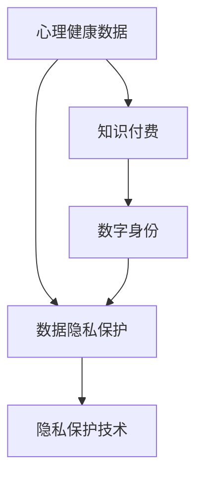

                 

# 心理咨询领域知识付费要重视隐私保护

## 1. 背景介绍

### 1.1 问题由来
随着互联网和移动互联网的普及，心理咨询和心理健康服务行业逐步从线下走向线上，知识付费成为这一领域的趋势。与此同时，用户的心理健康数据隐私保护问题日益凸显，隐私泄漏和数据滥用事件频发，给用户造成了极大的困扰和威胁。

### 1.2 问题核心关键点
心理咨询知识付费的核心在于利用专业的心理知识和经验，通过在线咨询、课程、心理测试等方式，为用户提供心理援助和心理健康建议。然而，在知识付费过程中，用户的心理健康数据极易被泄露和滥用，引发隐私保护和数据安全问题。如何平衡知识付费服务的提供和用户的隐私保护，是心理咨询知识付费领域面临的重要课题。

### 1.3 问题研究意义
研究心理咨询知识付费领域的数据隐私保护，对于提升用户体验、保障用户权益、促进行业健康发展具有重要意义。隐私保护的增强不仅可以提升用户信任度，还能确保心理健康数据的合法、安全使用，从而推动心理健康知识的普及和应用，促进心理健康服务行业的可持续发展。

## 2. 核心概念与联系

### 2.1 核心概念概述

为更好地理解心理咨询知识付费领域的数据隐私保护，本节将介绍几个密切相关的核心概念：

- 心理健康数据（Psychological Health Data）：用户在使用心理咨询服务过程中生成的各类数据，包括用户行为数据、心理评估数据、咨询对话记录等。
- 数据隐私保护（Data Privacy Protection）：确保用户心理健康数据的合法使用，防止数据泄露和滥用。
- 知识付费（Knowledge-Driven Subscription）：基于用户支付订阅费用的模式，提供心理咨询服务。
- 数字身份（Digital Identity）：用户在数字平台上的唯一标识，与心理健康数据密切相关。
- 隐私保护技术（Privacy-Preserving Technology）：包括加密技术、匿名化处理、差分隐私等，用于保护用户数据隐私的技术手段。

这些核心概念之间的逻辑关系可以通过以下Mermaid流程图来展示：



这个流程图展示了一个简单却完整的生态系统：

1. 心理健康数据通过数字身份在知识付费平台上产生。
2. 平台需通过数据隐私保护技术，确保心理健康数据的安全性。
3. 知识付费模式提供了服务，但必须遵循隐私保护原则。
4. 隐私保护技术对数据进行加密、匿名等处理，确保其安全。

## 3. 核心算法原理 & 具体操作步骤
### 3.1 算法原理概述

心理咨询知识付费领域的数据隐私保护，通常涉及数据加密、匿名化处理、差分隐私等技术。其核心思想是：在确保用户心理健康数据不被泄露和滥用的前提下，最大化其可用性，为用户和社会创造价值。

假设用户心理健康数据为 $D$，隐私保护算法为 $F$，保护后的数据为 $D'$。隐私保护的优化目标是最小化数据泄露风险，即：

$$
\min_{F} \text{Risk}(D', F)
$$

其中，$\text{Risk}(D', F)$ 表示保护后的数据 $D'$ 泄露风险。常见的隐私保护算法包括：

- 数据加密：将原始数据 $D$ 转换为不可读的密文 $C$，需配合密钥管理技术。
- 数据匿名化：将数据 $D$ 中的标识信息去除或替换为噪声，以掩盖用户身份。
- 差分隐私：向数据中引入随机噪声，使得数据分析者无法确定单个用户的数据，但整体统计分析仍有效。

### 3.2 算法步骤详解

以下我们将详细介绍几种常用的隐私保护算法及其操作步骤：

#### 3.2.1 数据加密

**步骤1：加密算法选择**  
选择合适的加密算法，如AES、RSA、ECC等，确保数据的机密性。

**步骤2：密钥管理**  
生成和分发密钥，保护密钥不被未经授权的第三方获取，如使用密钥管理系统KMS。

**步骤3：加密处理**  
对心理健康数据进行加密，生成密文 $C$。

**步骤4：解密处理**  
用户在需要时，使用相应密钥解密密文 $C$，恢复原始数据 $D$。

#### 3.2.2 数据匿名化

**步骤1：识别敏感信息**  
通过分析数据，识别敏感标识符，如姓名、身份证号、IP地址等。

**步骤2：替换或删除**  
将敏感信息替换为噪声值或删除。

**步骤3：生成匿名数据**  
将处理后的数据称为匿名数据 $D'$。

**步骤4：数据发布**  
在确保匿名化的基础上，向公众发布数据，供研究或分析使用。

#### 3.2.3 差分隐私

**步骤1：隐私预算设定**  
确定可接受的最大隐私损失，即隐私预算 $\epsilon$。

**步骤2：加入噪声**  
在数据处理过程中，加入正态分布的随机噪声 $\Delta$。

**步骤3：发布隐私保护数据**  
将噪声数据作为隐私保护数据发布。

**步骤4：隐私预算评估**  
通过隐私预算 $\epsilon$ 评估隐私保护效果，确保符合隐私要求。

### 3.3 算法优缺点

数据加密的优点在于提供高强度的数据保护，但加密和解密过程较慢，且需要维护复杂的密钥管理机制。

数据匿名化的优点是操作简单，但可能导致数据失去部分信息，无法恢复原始数据。

差分隐私虽然能在保护隐私的同时，保持数据分析的有效性，但噪声引入可能影响数据分析的精度。

### 3.4 算法应用领域

数据隐私保护技术广泛应用于心理咨询知识付费领域，涵盖用户身份验证、数据传输、咨询记录存储等多个环节，具体包括：

- 用户身份验证：通过加密技术对用户身份进行验证，确保用户信息安全。
- 数据传输保护：在数据传输过程中，使用加密算法保护数据不被窃取或篡改。
- 咨询记录存储：对咨询记录进行加密、匿名化处理，确保存储安全。
- 数据分析报告：使用差分隐私算法，在保护用户隐私的前提下，生成用户心理健康报告。

## 4. 数学模型和公式 & 详细讲解 & 举例说明

### 4.1 数学模型构建

本节将使用数学语言对心理咨询知识付费领域的数据隐私保护进行更加严格的刻画。

假设心理健康数据为 $D=\{x_1, x_2, ..., x_n\}$，其中 $x_i$ 表示第 $i$ 个用户的心理健康数据。

定义隐私保护函数为 $F$，保护后的数据为 $D'=\{F(x_1), F(x_2), ..., F(x_n)\}$。

### 4.2 公式推导过程

数据加密的基本模型为：

$$
C = E_{k}(D)
$$

其中 $E_k$ 为加密函数，$k$ 为加密密钥。

数据匿名化的基本模型为：

$$
D' = A(D)
$$

其中 $A$ 为匿名化函数，将敏感信息替换为噪声。

差分隐私的基本模型为：

$$
D' = D + \Delta
$$

其中 $\Delta$ 为随机噪声，$\epsilon$ 为隐私预算。

### 4.3 案例分析与讲解

以心理咨询知识付费平台为例，假设平台收集用户心理健康数据 $D$，其中包括用户行为数据 $B$、心理评估数据 $P$ 和咨询对话记录 $C$。平台需要对这些数据进行隐私保护处理，确保在保护用户隐私的同时，能够提供有价值的数据服务。

- 数据加密：对用户行为数据 $B$ 进行加密处理，确保在传输和存储过程中不被窃取。
- 数据匿名化：将心理评估数据 $P$ 中的姓名和身份证号等敏感信息替换为噪声，确保用户身份无法被识别。
- 差分隐私：对咨询对话记录 $C$ 加入随机噪声，使得分析者无法确定单个用户的对话内容，但整体统计分析仍有效。

## 5. 项目实践：代码实例和详细解释说明

### 5.1 开发环境搭建

在进行心理咨询知识付费平台的数据隐私保护实践前，我们需要准备好开发环境。以下是使用Python进行开发的环境配置流程：

1. 安装Python：从官网下载并安装Python 3.x版本，确保支持所需的库和框架。

2. 安装相关库：安装必要的第三方库，如PyCryptodome、pandas、numpy、scikit-learn等。

3. 配置开发工具：如IDE（如PyCharm）、版本控制系统（如Git）、测试框架（如pytest）等。

完成上述步骤后，即可在开发环境中进行数据隐私保护的实践。

### 5.2 源代码详细实现

以下是一个基于Python的示例代码，展示如何在心理咨询知识付费平台中实现数据加密和匿名化处理。

```python
from Crypto.Cipher import AES
from Crypto.Random import get_random_bytes
from Crypto.Hash import SHA256

class EncryptionService:
    def __init__(self, key):
        self.key = key
        self.iv = get_random_bytes(16)
        self.aes = AES.new(key, AES.MODE_CBC, self.iv)
    
    def encrypt(self, data):
        data = self.aes.encrypt(data)
        return data, self.iv
    
    def decrypt(self, data, iv):
        data = self.aes.decrypt(data)
        return data
    
class AnonymizationService:
    def anonymize(self, data, sensitive_keys):
        for key in sensitive_keys:
            data[key] = "anonymized"
        return data
    
# 使用示例
key = get_random_bytes(32)
data = {
    'name': 'Alice',
    'age': 25,
    'gender': 'female',
    'history': 'anxiety'
}

es = EncryptionService(key)
encrypted_data, iv = es.encrypt(str(data).encode())
decrypted_data = es.decrypt(encrypted_data, iv)
data = eval(decrypted_data)

print('加密前数据:', data)
print('加密后数据:', encrypted_data)
print('解密后数据:', decrypted_data)

as_service = AnonymizationService()
anonymized_data = as_service.anonymize(data, ['name', 'gender'])
print('匿名化后数据:', anonymized_data)
```

### 5.3 代码解读与分析

让我们再详细解读一下关键代码的实现细节：

**EncryptionService类**：
- `__init__`方法：初始化加密服务，生成随机的初始化向量。
- `encrypt`方法：使用AES算法加密数据，返回密文和初始化向量。
- `decrypt`方法：使用AES算法解密数据。

**AnonymizationService类**：
- `anonymize`方法：将敏感信息替换为"anonymized"，实现数据匿名化。

**使用示例**：
- 生成随机密钥。
- 创建加密服务对象。
- 加密原始数据。
- 解密密文数据。
- 创建匿名化服务对象。
- 匿名化处理数据。

可以看到，通过上述代码，我们实现了基本的加密和匿名化处理。在实际应用中，这些服务可以用于保护用户心理健康数据的安全性。

当然，工业级的系统实现还需考虑更多因素，如数据存储、密钥管理、多租户隔离等，但核心的隐私保护逻辑基本与此类似。

## 6. 实际应用场景

### 6.1 智能心理咨询

智能心理咨询系统通过大数据和AI技术，对用户心理健康状态进行评估和分析。在该场景中，用户的心理健康数据需要得到严格保护，防止数据泄露和滥用。

智能心理咨询平台可以通过加密技术对用户的咨询对话记录、心理评估结果等数据进行加密保护，确保数据在传输和存储过程中不被窃取或篡改。同时，使用差分隐私技术，生成分析报告时，保护用户隐私的同时，仍能提供有价值的数据洞察。

### 6.2 心理健康教育

心理健康教育应用需要收集用户的行为数据、学习数据等，以进行个性化的心理健康教育。在这些应用中，用户的心理健康数据需要得到保护，确保数据的安全性和合法使用。

心理健康教育平台可以使用数据匿名化技术，去除用户的姓名、身份证号等敏感信息，保护用户隐私。同时，通过数据加密技术，确保数据在传输和存储过程中不被窃取。

### 6.3 心理健康危机干预

心理健康危机干预系统需要快速响应用户的心理健康需求，提供紧急心理援助。在该场景中，用户的数据隐私保护尤为重要，防止数据泄露对用户造成二次伤害。

心理健康危机干预平台可以采用多种隐私保护措施，如数据加密、差分隐私、分布式存储等，确保用户心理健康数据的隐私安全。同时，平台应具备严格的访问控制机制，确保只有授权人员能够访问和处理用户数据。

### 6.4 未来应用展望

随着技术的发展，心理咨询知识付费领域的数据隐私保护将呈现以下几个发展趋势：

1. 数据隐私保护技术将日益成熟，提供更高效、更安全的数据保护方案。
2. 隐私计算技术将得到广泛应用，如多方安全计算、联邦学习等，确保数据在本地计算，保护数据隐私。
3. 隐私保护将与AI技术深度融合，如隐私增强学习、隐私智能合约等，提升数据隐私保护的智能化水平。
4. 隐私保护法规将不断完善，推动企业和机构在数据隐私保护方面的责任和义务。
5. 用户隐私意识将不断提升，推动企业和机构在隐私保护方面的投入和改进。

## 7. 工具和资源推荐

### 7.1 学习资源推荐

为了帮助开发者系统掌握心理咨询知识付费领域的数据隐私保护，这里推荐一些优质的学习资源：

1. 《数据隐私保护与数据安全》课程：由知名大学和专家讲授，涵盖数据隐私保护的基础知识和前沿技术。
2. 《Python加密与解密》书籍：详细介绍了Python中常用的加密算法，如AES、RSA、SHA等。
3. 《差分隐私技术》书籍：系统讲解差分隐私的理论基础和实际应用，适合深度学习工程师参考。
4. 《数据隐私保护实用指南》：由行业专家编写，提供实际应用中的隐私保护建议和案例。
5. 《隐私计算技术与应用》：涵盖多方安全计算、联邦学习等前沿隐私计算技术，提供理论和实践指导。

通过对这些资源的学习实践，相信你一定能够快速掌握心理咨询知识付费领域的数据隐私保护技术，并用于解决实际应用中的隐私保护问题。

### 7.2 开发工具推荐

高效的开发离不开优秀的工具支持。以下是几款用于心理咨询知识付费平台的数据隐私保护开发的常用工具：

1. Python：基于Python的开源编程语言，支持丰富的加密和隐私计算库，便于快速迭代开发。
2. PyCryptodome：Python加密库，支持AES、RSA、SHA等常用加密算法。
3. Pandas：数据处理库，便于数据清洗和隐私化处理。
4. Scikit-learn：机器学习库，提供差分隐私算法和隐私计算工具。
5. Flask和Django：Web开发框架，便于构建隐私保护应用服务。
6. PyKucoin：隐私保护计算库，提供多方安全计算和联邦学习工具。

合理利用这些工具，可以显著提升心理咨询知识付费平台的数据隐私保护开发效率，加快创新迭代的步伐。

### 7.3 相关论文推荐

数据隐私保护技术的发展源于学界的持续研究。以下是几篇奠基性的相关论文，推荐阅读：

1. "Data Privacy: Theory and Techniques" by Liqun Chen: 综述了数据隐私保护的理论基础和应用技术，是隐私保护领域的重要文献。
2. "Practical Privacy-Preserving Mechanisms for Cloud Storage: An Empirical Evaluation" by P. S. Yu et al.: 详细介绍了云计算中的隐私保护机制，并进行了实验评估，具有较高的实用价值。
3. "Differential Privacy: Privacy-Friendly Data Analysis Techniques" by Cynthia Dwork et al.: 提出了差分隐私的理论框架，是隐私保护领域的里程碑工作。
4. "Homomorphic Encryption: Fully Homomorphic Cryptography and Beyond" by Craig Gentry: 详细介绍了同态加密技术，为隐私计算提供了新的思路。
5. "Privacy-Preserving Data Sharing in Large Networks with Byzantine Users" by Can Zhang et al.: 探讨了在大规模网络中实现隐私保护数据共享的技术，具有较高的创新性和实用性。

这些论文代表了大数据隐私保护技术的发展脉络。通过学习这些前沿成果，可以帮助研究者把握学科前进方向，激发更多的创新灵感。

## 8. 总结：未来发展趋势与挑战

### 8.1 总结

本文对心理咨询知识付费领域的数据隐私保护方法进行了全面系统的介绍。首先阐述了数据隐私保护在心理咨询知识付费中的重要性，明确了隐私保护在用户权益保障和平台可持续发展中的关键作用。其次，从原理到实践，详细讲解了隐私保护的数学模型和操作步骤，给出了隐私保护任务开发的完整代码实例。同时，本文还广泛探讨了隐私保护在智能心理咨询、心理健康教育、危机干预等多个行业领域的应用前景，展示了隐私保护技术的广阔前景。最后，本文精选了隐私保护技术的各类学习资源，力求为读者提供全方位的技术指引。

通过本文的系统梳理，可以看到，数据隐私保护技术在心理咨询知识付费领域的应用前景广阔。隐私保护的增强不仅可以提升用户信任度，还能确保心理健康数据的合法、安全使用，从而推动心理健康知识的普及和应用，促进行业健康发展。未来，隐私保护技术还需与其他人工智能技术进行更深入的融合，如知识表示、因果推理、强化学习等，多路径协同发力，共同推动自然语言理解和智能交互系统的进步。只有勇于创新、敢于突破，才能不断拓展数据隐私保护技术的边界，让智能技术更好地造福用户和社会。

### 8.2 未来发展趋势

展望未来，心理咨询知识付费领域的数据隐私保护技术将呈现以下几个发展趋势：

1. 隐私计算技术的应用将更加广泛。隐私计算技术（如多方安全计算、联邦学习等）将广泛应用于数据存储、计算和传输过程中，确保数据隐私。
2. 差分隐私算法将更加成熟。随着差分隐私算法的不断完善，其在保护用户隐私的同时，仍能提供有效的数据分析，推动数据应用的普及。
3. 隐私保护法规将更加完善。隐私保护法规将不断出台和完善，推动企业和机构在数据隐私保护方面的责任和义务。
4. 用户隐私保护意识将不断提高。用户对隐私保护的重视程度将不断提升，推动企业和机构在隐私保护方面的投入和改进。
5. 隐私保护将与AI技术深度融合。隐私增强学习、隐私智能合约等技术将不断涌现，推动隐私保护技术的发展。

这些趋势将为心理咨询知识付费领域的数据隐私保护带来新的突破，提升用户信任度，保障用户权益，促进行业健康发展。

### 8.3 面临的挑战

尽管数据隐私保护技术已经取得了一定进展，但在迈向更加智能化、普适化应用的过程中，它仍面临诸多挑战：

1. 隐私保护技术的复杂性。隐私保护技术涉及密码学、机器学习等多个领域，技术实现复杂度较高，开发和部署成本较高。
2. 隐私保护与性能之间的权衡。在保护用户隐私的同时，如何平衡数据利用和性能损失，是隐私保护的一大难题。
3. 隐私保护法规和标准的制定。隐私保护法规和标准尚不完善，企业合规难度较大。
4. 隐私保护技术的普及度。用户隐私保护意识较低，隐私保护技术在实际应用中的普及度不够。
5. 隐私计算技术的实现。隐私计算技术涉及多方协作，技术实现难度较大，存在一些技术瓶颈。

这些挑战需要学界和产业界的共同努力，通过不断创新和优化，才能更好地应对隐私保护技术的复杂性和现实需求。

### 8.4 研究展望

未来的研究需要在以下几个方面寻求新的突破：

1. 开发高效、易于部署的隐私保护算法。研究更简单、更易于实现的隐私保护技术，降低开发和部署成本。
2. 引入隐私增强学习等前沿技术。将隐私保护技术与AI技术结合，提升隐私保护的效果和效率。
3. 制定统一的隐私保护标准和法规。推动隐私保护技术的标准化和规范化，推动企业和机构在隐私保护方面的合规性。
4. 提升用户隐私保护意识。通过教育和宣传，提升用户的隐私保护意识，推动隐私保护技术的普及。
5. 探索隐私保护的新方法。如零知识证明、可解释隐私计算等，为隐私保护提供新的思路。

这些研究方向的探索，必将引领数据隐私保护技术迈向更高的台阶，为构建安全、可靠、可解释、可控的智能系统铺平道路。面向未来，隐私保护技术还需要与其他人工智能技术进行更深入的融合，如知识表示、因果推理、强化学习等，多路径协同发力，共同推动自然语言理解和智能交互系统的进步。只有勇于创新、敢于突破，才能不断拓展隐私保护技术的边界，让智能技术更好地造福用户和社会。

## 9. 附录：常见问题与解答

**Q1: 什么是心理咨询知识付费平台？**

A: 心理咨询知识付费平台是指通过订阅、付费的方式，为用户提供心理健康咨询服务、心理健康课程、心理测试等服务的平台。用户可以通过平台获取专业的心理健康支持，提升心理健康水平。

**Q2: 为什么心理咨询知识付费平台需要重视数据隐私保护？**

A: 心理咨询知识付费平台需要收集和处理用户的心理健康数据，包括用户行为数据、心理评估数据、咨询对话记录等。这些数据包含用户的敏感信息，如果被泄露或滥用，将对用户造成严重的隐私侵害和心理伤害。因此，平台必须重视数据隐私保护，确保用户数据的安全性和合法使用。

**Q3: 如何平衡数据隐私保护和数据利用？**

A: 在心理咨询知识付费平台中，数据隐私保护和数据利用是相辅相成的。可以通过隐私增强学习、差分隐私等技术，在保护用户隐私的同时，仍能提供有效的数据分析，推动数据应用的普及。同时，平台应制定严格的数据访问和存储政策，确保数据仅在必要情况下使用，保护用户权益。

**Q4: 如何保障心理咨询知识付费平台的数据安全？**

A: 心理咨询知识付费平台应采用多种数据安全措施，如数据加密、数据匿名化、访问控制等，确保数据在传输、存储和处理过程中不被泄露或篡改。同时，平台应定期进行安全审计和风险评估，及时发现和修复安全漏洞。

**Q5: 如何确保心理咨询知识付费平台的用户数据合法使用？**

A: 心理咨询知识付费平台应明确用户数据的用途和范围，获取用户同意后使用数据。平台应制定严格的数据保护政策，确保用户数据的使用符合法律法规和道德规范。同时，平台应定期向用户披露数据使用情况，保障用户知情权。

---

作者：禅与计算机程序设计艺术 / Zen and the Art of Computer Programming

