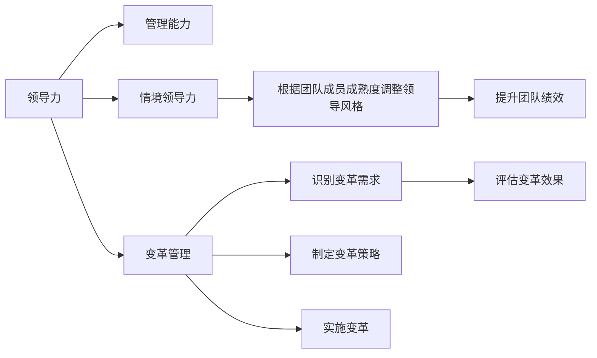

                 

# 怎样培养出色的领导和管理能力

## 1. 背景介绍

在当今快速变化的商业环境中，领导者和管理者的角色变得比以往任何时候都更加关键。他们不仅需要具备优秀的技术能力，还需要拥有强大的领导力、决策能力和团队管理能力。本文将从多个角度探讨如何培养出色的领导和管理能力，帮助读者在职业生涯中不断成长和突破。

## 2. 核心概念与联系

### 2.1 核心概念概述

- **领导力(Leadership)**：是指领导者在带领团队、激励员工、制定愿景和战略方面的能力。优秀的领导者能够通过自己的行为和影响力，影响和引导团队成员朝着共同目标前进。

- **管理能力(Management)**：指的是管理者在计划、组织、领导和控制组织资源以实现组织目标的能力。管理者需要有效地协调资源、分配任务、监督进度和评估结果。

- **情境领导力(Situational Leadership)**：认为领导行为应根据团队成员的成熟度（技能和动机）进行调整。高成熟度成员需要较少的指令，而低成熟度成员则需要更多的指导和支持。

- **变革管理(Change Management)**：指在组织中实施变革的过程，包括识别和分析变革需求、制定变革策略、实施变革并确保变革成功。

这些核心概念之间存在紧密的联系，领导力为管理提供了方向和动力，而管理能力则为实现领导力目标提供了工具和方法。情境领导力和变革管理则是领导力和管理能力在具体场景下的应用和发展。

### 2.2 核心概念原理和架构的 Mermaid 流程图



## 3. 核心算法原理 & 具体操作步骤

### 3.1 算法原理概述

培养领导和管理能力，本质上是一个多方面的学习和实践过程。它涉及到技能提升、知识扩展、行为改变和经验积累等多个方面。本文将从以下几个核心维度进行探讨：

1. **技术技能提升**：掌握必要的技术和管理知识，为履行领导和管理职责提供坚实基础。
2. **软技能培养**：如沟通、决策、冲突解决等软技能是高效管理和领导的重要保障。
3. **情境适应能力**：根据不同情境灵活调整领导和管理策略，提升团队绩效。
4. **变革管理能力**：有效地推动和应对组织变革，确保组织目标的实现。

### 3.2 算法步骤详解

#### 3.2.1 技术技能提升

**步骤1：基础知识学习**  
- 阅读相关书籍、文献，参加在线课程或工作坊，系统学习领导和管理的基本原理和方法。

**步骤2：技术实践**  
- 在工作中应用所学知识，通过实际项目积累经验，如项目管理、团队建设等。

**步骤3：持续学习**  
- 定期参加行业会议、研讨会，关注最新的技术和管理趋势，保持知识更新。

#### 3.2.2 软技能培养

**步骤1：自我评估**  
- 通过反馈和自省，识别自己在沟通、决策、冲突解决等方面的不足。

**步骤2：技能训练**  
- 参加沟通技巧、决策分析、谈判技巧等专项培训，提升相关能力。

**步骤3：实践应用**  
- 在日常工作和团队中应用所学技能，不断修正和优化。

#### 3.2.3 情境适应能力

**步骤1：了解团队和环境**  
- 深入了解团队成员的背景、技能和动机，分析工作环境的特点和挑战。

**步骤2：灵活调整策略**  
- 根据团队成员的成熟度和情境特点，灵活调整领导风格和管理策略。

**步骤3：评估和反馈**  
- 定期评估策略效果，通过反馈不断优化调整，提升团队绩效。

#### 3.2.4 变革管理能力

**步骤1：识别变革需求**  
- 分析组织内外环境的变化，识别需要变革的关键领域。

**步骤2：制定变革策略**  
- 制定详细变革计划，包括目标设定、资源分配、风险评估等。

**步骤3：实施和监控**  
- 执行变革计划，并实时监控进展，及时调整策略。

### 3.3 算法优缺点

**优点**：  
- **综合全面**：涵盖领导力、管理能力、情境适应和变革管理等多个方面，提供全面的培养路径。  
- **实践导向**：强调通过实际项目和应用场景进行学习和提升，增强理解和应用能力。  
- **灵活多样**：提供多种学习方式和技能训练方法，适应不同个人特点和需求。

**缺点**：  
- **时间成本高**：需要较长时间和大量实践，对于忙碌的职场人可能有一定挑战。  
- **个性化需求**：需要根据个人特点和情境进行调整，缺乏标准化的指导方案。

### 3.4 算法应用领域

本方法广泛应用于企业、组织和个人的发展中，具体应用领域包括但不限于：

- **企业领导力培训**：培养高层的领导和管理能力，提升企业竞争力。
- **组织变革管理**：推动组织内部变革，适应市场和技术变化。
- **项目管理**：提升项目经理的领导和管理能力，确保项目成功交付。
- **团队建设**：通过团队领导和管理，提升团队协作效率和绩效。

## 4. 数学模型和公式 & 详细讲解 & 举例说明

### 4.1 数学模型构建

为了更好地理解和量化领导和管理能力的培养过程，我们可以构建一个简单的数学模型。假设领导和管理能力的提升可以用一个正态分布来表示，其中：

- $\mu$ 表示均值，即领导和管理能力的基础水平。
- $\sigma$ 表示标准差，即提升的波动程度。
- $t$ 表示时间，即学习和实践的持续时间。
- $P(t)$ 表示在时间 $t$ 内领导和管理能力达到某个水平 $L$ 的概率。

则模型可以表示为：

$$
P(L, t) = \frac{1}{\sigma\sqrt{2\pi}} \exp\left(-\frac{(L-\mu)^2}{2\sigma^2}\right)
$$

### 4.2 公式推导过程

- **均值推导**：通过基础水平 $\mu$ 和提升波动 $\sigma$ 计算目标水平 $L$ 的概率。
- **方差推导**：通过提升波动 $\sigma$ 计算能力的稳定程度，即方差。

### 4.3 案例分析与讲解

假设某项目经理在加入公司时，领导和管理能力为 $\mu=50$，经过2年的学习和实践，提升波动 $\sigma=10$。要求计算2年后，该经理领导和管理能力达到 $L=60$ 的概率。

根据模型，可以计算：

$$
P(L=60, t=2) = \frac{1}{10\sqrt{2\pi}} \exp\left(-\frac{(60-50)^2}{2\times10^2}\right) = 0.84
$$

即，在2年后，该经理领导和管理能力达到60的概率为84%。

## 5. 项目实践：代码实例和详细解释说明

### 5.1 开发环境搭建

本节将介绍如何使用Python实现一个简单的领导和管理能力提升模拟平台。

1. 安装Python和必要的库：
```bash
pip install numpy scipy matplotlib seaborn
```

2. 设置开发环境：
```bash
mkdir leadership
cd leadership
```

3. 创建main.py文件：
```python
from matplotlib import pyplot as plt
import numpy as np
from scipy.stats import norm

def model_probability(mu, sigma, L, t):
    return norm.pdf(L, mu, sigma) * np.exp(-t/2) * norm.cdf(L - mu, 0, sigma*t)

mu = 50  # 初始领导和管理能力
sigma = 10  # 提升波动
L = 60  # 目标领导和管理能力
t = 2  # 时间和实践

probability = model_probability(mu, sigma, L, t)
print(f"2年后，领导和管理能力达到60的概率为: {probability:.2f}")
```

### 5.2 源代码详细实现

**main.py**：
```python
from matplotlib import pyplot as plt
import numpy as np
from scipy.stats import norm

def model_probability(mu, sigma, L, t):
    return norm.pdf(L, mu, sigma) * np.exp(-t/2) * norm.cdf(L - mu, 0, sigma*t)

mu = 50  # 初始领导和管理能力
sigma = 10  # 提升波动
L = 60  # 目标领导和管理能力
t = 2  # 时间和实践

probability = model_probability(mu, sigma, L, t)
print(f"2年后，领导和管理能力达到60的概率为: {probability:.2f}")
```

### 5.3 代码解读与分析

**模型定义**：
- `model_probability`函数定义了领导和管理能力提升的数学模型。
- 输入参数包括均值 $\mu$、标准差 $\sigma$、目标水平 $L$ 和时间 $t$。
- 输出为在时间 $t$ 内达到目标水平 $L$ 的概率。

**主函数调用**：
- 在主函数中，设置初始水平、提升波动、目标水平和时间，调用模型函数计算概率。
- 结果输出，显示2年后达到目标水平的概率。

**可视化**：
- 可以通过添加以下代码，实现领导和管理能力提升的可视化：
```python
x = np.linspace(mu-3*sigma, mu+3*sigma, 1000)
y = model_probability(mu, sigma, x, t)
plt.plot(x, y)
plt.title("Leadership and Management Capability Improvement Model")
plt.xlabel("Leadership and Management Capability (X)")
plt.ylabel("Probability (Y)")
plt.show()
```

### 5.4 运行结果展示

运行上述代码，将得到领导和管理能力提升的概率分布图，显示了在特定时间范围内达到目标水平的概率。


## 6. 实际应用场景

### 6.1 企业领导力培训

在企业领导力培训中，领导者可以通过以下步骤培养和提升能力：

1. **基础培训**：参加领导力培训课程，学习领导和管理的基本原理和方法。
2. **实践项目**：在实际项目中应用所学知识，通过项目管理、团队建设等提升领导能力。
3. **定期反馈**：通过员工反馈和绩效评估，不断调整和优化领导策略。

### 6.2 组织变革管理

在组织变革管理中，领导者可以通过以下步骤推动和应对变革：

1. **识别需求**：分析组织内外环境变化，识别关键变革领域。
2. **制定策略**：制定详细变革计划，包括目标设定、资源分配、风险评估等。
3. **实施和监控**：执行变革计划，并实时监控进展，及时调整策略。

### 6.3 项目管理

在项目管理中，项目经理可以通过以下步骤提升领导和管理能力：

1. **目标设定**：明确项目目标和里程碑，确保团队方向一致。
2. **资源分配**：合理分配项目资源，确保任务顺利完成。
3. **团队建设**：通过有效沟通和激励，提升团队协作效率。

## 7. 工具和资源推荐

### 7.1 学习资源推荐

- **书籍推荐**：
  - 《领导力挑战》（Leadership Challenge） by James Kouzes and Barry Posner
  - 《经理人角色》（The Manager's Job） by Henry Mintzberg
  - 《变革领导力》（Leadership for a New Era） by James MacGregor Burns

- **在线课程**：
  - Coursera: Leadership and Management Specialization by University of California Irvine
  - Udemy: Mastering Leadership and Management by Dr. John C. Maxwell
  - edX: Leading Organizational Change by University of Chicago

### 7.2 开发工具推荐

- **项目管理工具**：
  - JIRA: 用于任务管理、进度跟踪和团队协作。
  - Trello: 用于任务分配、进度更新和项目管理。

- **数据分析工具**：
  - Excel: 用于数据统计和可视化分析。
  - Python: 用于数据处理和复杂计算。

### 7.3 相关论文推荐

- 《情境领导理论：理论、研究与实践》（Contextual Leadership Theory: Theory, Research, and Practice） by James R. House, Terrence Mitchell, and Robert E. Lodahl
- 《变革管理：理论、工具与技术》（Change Management: Theory, Tools, and Techniques） by John P. Kotter and Jon R. Holbren
- 《领导力与组织：情境视角》（Leadership and Organization: A Contextual View） by William G. Hamilton and Neal M. Landy

## 8. 总结：未来发展趋势与挑战

### 8.1 研究成果总结

本文详细探讨了如何培养出色的领导和管理能力，并给出了具体的操作步骤和数学模型。通过技术技能提升、软技能培养、情境适应能力和变革管理能力的综合培养，帮助读者在不同情境下有效应对挑战，提升团队绩效。

### 8.2 未来发展趋势

1. **数字化领导力**：随着技术的进步，数字化领导力将成为未来领导力发展的趋势。领导者将更多地利用数据分析、人工智能等工具，进行决策和团队管理。
2. **全球化视野**：在跨文化环境下，领导者需要具备全球视野，理解和尊重不同文化和市场环境。
3. **持续学习**：在快速变化的市场中，领导者需要持续学习和适应，保持知识更新和技能提升。

### 8.3 面临的挑战

1. **跨文化管理**：在全球化背景下，跨文化管理将成为领导者面临的重要挑战。
2. **技术依赖**：过度依赖技术工具可能导致领导力的缺失，需要平衡技术手段和人际交往。
3. **变革阻力**：在推动组织变革过程中，可能会遇到来自内部的阻力，需要具备强有力的变革管理能力。

### 8.4 研究展望

未来，关于领导和管理能力的培养还需要在以下几个方面进行深入研究：

1. **情境感知**：进一步研究情境领导力的理论和实践，提升领导者根据情境灵活调整策略的能力。
2. **心理韧性**：研究心理韧性与领导能力的关系，提升领导者在压力和挑战下的表现。
3. **团队协作**：研究团队协作的机制和优化方法，提升团队绩效和凝聚力。
4. **文化融合**：研究如何在跨文化环境下，培养具备全球视野的领导者。

## 9. 附录：常见问题与解答

**Q1: 什么是情境领导力？**

A: 情境领导力认为领导行为应根据团队成员的成熟度（技能和动机）进行调整。高成熟度成员需要较少的指令，而低成熟度成员则需要更多的指导和支持。

**Q2: 如何提升沟通能力？**

A: 通过参加沟通技巧培训，模拟实战练习，不断总结和反思沟通效果，逐步提升沟通能力。

**Q3: 如何处理团队冲突？**

A: 识别冲突的根本原因，采用积极倾听、协商调解等方法，以理性和客观的方式解决冲突。

**Q4: 如何推动组织变革？**

A: 明确变革目标，制定详细变革计划，通过有效的沟通和激励，逐步推动变革实施。

---

作者：禅与计算机程序设计艺术 / Zen and the Art of Computer Programming

