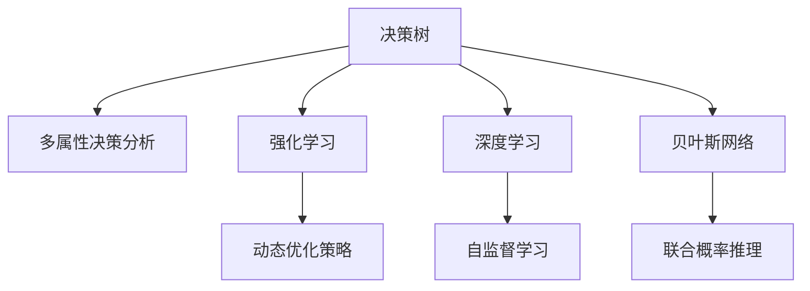

                 

# 思维体系:决策高度的基石

> 关键词：思维体系,决策高度,算法决策,决策树,强化学习,深度学习,贝叶斯网络

## 1. 背景介绍

### 1.1 问题由来

在现代社会，决策已经成为个人和组织生活中不可或缺的一部分。无论是个人生活还是商业运营，每一次决策都可能影响着未来的走向。然而，由于信息不完备、个体认知偏差等因素，决策过程常常存在错误和失误。因此，研究如何构建更加科学、高效的决策体系，以降低决策风险、提升决策质量，已成为当前AI领域和认知科学研究的重要课题。

### 1.2 问题核心关键点

目前，构建决策体系的主要手段包括算法决策、强化学习、深度学习和贝叶斯网络等。其中，算法决策以决策树、多属性决策分析等方法为代表，直接使用数学算法对决策进行建模和优化。强化学习则通过奖励机制，训练智能体在复杂环境中的决策策略。深度学习通过神经网络模型，模拟人类认知过程，进行智能决策。贝叶斯网络则通过概率图模型，表示变量之间的依赖关系，进行联合推理。

这些方法各有优缺点，适用于不同情境和需求。本文将详细介绍这些决策体系的核心算法原理与操作步骤，并结合实际案例进行详细讲解。

## 2. 核心概念与联系

### 2.1 核心概念概述

为更好地理解决策体系的构建，本节将介绍几个密切相关的核心概念：

- 决策树（Decision Tree）：一种树形结构，通过条件分支进行决策建模，直观清晰，易于理解和解释。
- 多属性决策分析（Multi-Attribute Decision Making, MADM）：研究在多个属性和多个决策者的情况下，如何进行最优决策的方法。
- 强化学习（Reinforcement Learning, RL）：通过智能体在环境中与环境交互，学习最优决策策略的方法。
- 深度学习（Deep Learning, DL）：一种通过多层神经网络模拟人类认知过程，进行学习和决策的方法。
- 贝叶斯网络（Bayesian Network）：一种通过概率图模型表示变量之间依赖关系的决策方法。

这些核心概念之间的逻辑关系可以通过以下Mermaid流程图来展示：



这个流程图展示了一些核心概念及其之间的联系：

1. 决策树通过条件分支进行决策建模，直观清晰，易于理解和解释。
2. 多属性决策分析适用于多个属性和决策者的情况，通过优化方法进行决策。
3. 强化学习通过智能体在环境中与环境交互，学习最优决策策略。
4. 深度学习通过神经网络模型模拟人类认知过程，进行学习和决策。
5. 贝叶斯网络通过概率图模型表示变量之间的依赖关系，进行联合推理。

## 3. 核心算法原理 & 具体操作步骤

### 3.1 算法原理概述

构建决策体系的核心算法原理包括决策树、多属性决策分析、强化学习、深度学习和贝叶斯网络等。这些算法通过不同的方法和模型，构建了适用于不同情境的决策体系，从而为决策者提供了科学的决策支持。

### 3.2 算法步骤详解

#### 3.2.1 决策树

**Step 1: 数据预处理**

- 数据清洗：去除噪声、处理缺失值。
- 特征选择：选择有意义的特征，减少维度。

**Step 2: 决策树构建**

- 划分规则：选择最优特征和最优划分方式。
- 递归构建：基于划分规则，构建决策树。

**Step 3: 剪枝优化**

- 防止过拟合：通过剪枝算法，减少树的大小。

**Step 4: 预测和评估**

- 预测：使用决策树对新样本进行分类或回归。
- 评估：使用准确率、召回率等指标评估模型性能。

#### 3.2.2 多属性决策分析

**Step 1: 确定决策目标和约束**

- 确定决策目标：明确决策目的。
- 确定约束条件：考虑资源限制、时间限制等约束。

**Step 2: 构建决策模型**

- 建立决策矩阵：将决策目标和约束转化为矩阵形式。
- 计算权重：使用熵、基尼指数等方法计算各属性的权重。

**Step 3: 进行决策计算**

- 计算各方案的综合评分。
- 排序选择：根据评分排序，选择最优方案。

#### 3.2.3 强化学习

**Step 1: 环境建模**

- 定义状态空间：描述环境状态。
- 定义动作空间：描述智能体的动作。

**Step 2: 设计奖励函数**

- 设计奖励机制：确定每个动作的奖励。

**Step 3: 策略学习**

- 选择学习算法：如Q-learning、SARSA等。
- 训练智能体：通过学习算法更新策略。

**Step 4: 决策执行**

- 智能体决策：根据当前状态选择动作。
- 环境交互：执行动作，观察环境反馈。

#### 3.2.4 深度学习

**Step 1: 数据预处理**

- 数据清洗：去除噪声、处理缺失值。
- 数据增强：增加数据样本，提高模型泛化能力。

**Step 2: 构建神经网络**

- 设计网络结构：选择神经网络层数、节点数等。
- 初始化参数：随机初始化权重和偏置。

**Step 3: 训练模型**

- 前向传播：输入数据，计算输出。
- 反向传播：计算梯度，更新参数。

**Step 4: 预测和评估**

- 预测：使用模型对新数据进行预测。
- 评估：使用准确率、损失函数等指标评估模型性能。

#### 3.2.5 贝叶斯网络

**Step 1: 构建网络结构**

- 定义节点：选择变量和概率分布。
- 确定网络结构：选择节点间的连接方式。

**Step 2: 参数估计**

- 估计参数：使用数据训练网络参数。

**Step 3: 推理和预测**

- 推理：计算变量的联合概率。
- 预测：根据变量分布进行预测。

### 3.3 算法优缺点

#### 3.3.1 决策树

**优点：**
- 易于理解和解释。
- 计算速度快，适合处理大规模数据。
- 处理非线性关系能力强。

**缺点：**
- 容易过拟合，需要进行剪枝。
- 对噪声敏感，需要进行预处理。

#### 3.3.2 多属性决策分析

**优点：**
- 适用于多个属性和多个决策者的情况。
- 优化方法科学，能够提高决策质量。

**缺点：**
- 计算复杂度高，需要高性能计算支持。
- 对数据质量要求高，处理缺失值和噪声需要技巧。

#### 3.3.3 强化学习

**优点：**
- 能够适应复杂环境，学习最优决策策略。
- 适用于多目标、动态环境的情况。

**缺点：**
- 计算复杂度高，需要大量计算资源。
- 需要大量数据进行训练，学习时间较长。

#### 3.3.4 深度学习

**优点：**
- 能够处理高维度、非线性的复杂数据。
- 具备较强的泛化能力，适合处理大规模数据。

**缺点：**
- 计算复杂度高，需要高性能计算支持。
- 模型复杂度大，难以解释。

#### 3.3.5 贝叶斯网络

**优点：**
- 能够处理多变量复杂关系。
- 具备较强的推理和预测能力。

**缺点：**
- 计算复杂度高，需要高性能计算支持。
- 需要大量的先验知识进行网络构建。

### 3.4 算法应用领域

构建决策体系的主要方法包括决策树、多属性决策分析、强化学习、深度学习和贝叶斯网络等，这些方法在各个领域都有广泛的应用：

- 金融领域：决策树和强化学习可用于信用评分、投资组合优化等任务。
- 医疗领域：多属性决策分析和深度学习可用于临床决策支持系统、疾病预测等任务。
- 制造领域：多属性决策分析和贝叶斯网络可用于质量控制、设备维护等任务。
- 物流领域：决策树和强化学习可用于路径规划、库存管理等任务。
- 环境保护领域：多属性决策分析和贝叶斯网络可用于环境评估、污染监测等任务。

## 4. 数学模型和公式 & 详细讲解 & 举例说明

### 4.1 数学模型构建

#### 4.1.1 决策树

**决策树模型**：

$$
T(D) = \{(x, C) | x \in D, C = f(x) \in \{C_1, C_2, \ldots, C_M\}
$$

其中 $D$ 为训练数据集，$x$ 为输入特征，$C$ 为决策输出，$f(x)$ 为决策函数。

**决策树剪枝模型**：

$$
T(D, \alpha) = \{(x, C) | x \in D, C = f(x) \in \{C_1, C_2, \ldots, C_M\}, Pr(T(D, \alpha) \cap C) \geq \alpha
$$

其中 $\alpha$ 为剪枝阈值，$Pr(T(D, \alpha) \cap C)$ 为节点 $C$ 下子树的泛化误差。

#### 4.1.2 多属性决策分析

**决策矩阵**：

$$
M = \begin{bmatrix} w_1 & p_1 & d_1 & \ldots & w_n & p_n & d_n \\ c_1 & s_1 & t_1 & \ldots & c_n & s_n & t_n \end{bmatrix}
$$

其中 $w_i$ 为第 $i$ 个属性的权重，$p_i$ 为第 $i$ 个属性的评分，$d_i$ 为第 $i$ 个属性的偏差，$c_i$ 为第 $i$ 个方案的属性评分，$s_i$ 为第 $i$ 个方案的综合评分，$t_i$ 为第 $i$ 个方案的总评分。

**多属性决策分析步骤**：

1. 确定权重：计算各属性的权重 $w_i$。
2. 计算评分：计算各方案的综合评分 $s_i$。
3. 排序选择：根据综合评分排序，选择最优方案。

#### 4.1.3 强化学习

**状态-动作对**：

$$
\langle S, A \rangle \sim P
$$

其中 $S$ 为状态空间，$A$ 为动作空间，$P$ 为状态-动作对的概率分布。

**Q-learning算法**：

$$
Q(S_t, A_t) \leftarrow Q(S_t, A_t) + \alpha [R_t + \gamma \max_{a'} Q(S_{t+1}, a') - Q(S_t, A_t)]
$$

其中 $Q(S_t, A_t)$ 为状态-动作对的Q值，$R_t$ 为即时奖励，$\gamma$ 为折扣因子，$\alpha$ 为学习率。

**SARSA算法**：

$$
Q(S_t, A_t) \leftarrow Q(S_t, A_t) + \alpha [R_t + \gamma Q(S_{t+1}, A_{t+1}) - Q(S_t, A_t)]
$$

#### 4.1.4 深度学习

**神经网络模型**：

$$
y = \sigma(w^T x + b)
$$

其中 $y$ 为输出，$x$ 为输入，$w$ 为权重，$b$ 为偏置，$\sigma$ 为激活函数。

**反向传播算法**：

$$
\frac{\partial \mathcal{L}}{\partial w} = \frac{\partial \mathcal{L}}{\partial y} \cdot \frac{\partial y}{\partial w}
$$

其中 $\mathcal{L}$ 为损失函数，$\frac{\partial y}{\partial w}$ 为导数。

#### 4.1.5 贝叶斯网络

**贝叶斯网络模型**：

$$
P(x_1, x_2, \ldots, x_n | \theta) = \prod_{i=1}^n P(x_i | \theta) \prod_{i<j} P(x_i, x_j | \theta)
$$

其中 $x_i$ 为变量，$\theta$ 为网络参数。

**联合概率计算**：

$$
P(x_1, x_2, \ldots, x_n) = \frac{P(x_1, x_2, \ldots, x_n | \theta)}{P(\theta)}
$$

其中 $P(\theta)$ 为网络参数的先验概率。

### 4.2 公式推导过程

#### 4.2.1 决策树

**决策树划分选择**：

$$
\arg\min_{X} \sum_{C \in D} Loss(X, C) \times P(C)
$$

其中 $X$ 为划分变量，$C$ 为决策类别，$Loss$ 为损失函数，$P(C)$ 为类别概率。

#### 4.2.2 多属性决策分析

**综合评分计算**：

$$
s_i = \sum_{j=1}^n w_j p_{ij}
$$

其中 $w_j$ 为第 $j$ 个属性的权重，$p_{ij}$ 为第 $i$ 个方案和第 $j$ 个属性的评分。

#### 4.2.3 强化学习

**Q值更新**：

$$
Q(S_t, A_t) \leftarrow Q(S_t, A_t) + \alpha [R_t + \gamma \max_{a'} Q(S_{t+1}, a') - Q(S_t, A_t)]
$$

#### 4.2.4 深度学习

**梯度下降算法**：

$$
w_{t+1} = w_t - \alpha \frac{\partial \mathcal{L}}{\partial w}
$$

其中 $\alpha$ 为学习率。

#### 4.2.5 贝叶斯网络

**概率更新**：

$$
P(x_i | x_j) \propto P(x_i, x_j) / P(x_j)
$$

其中 $P(x_i | x_j)$ 为条件概率，$P(x_j)$ 为先验概率。

### 4.3 案例分析与讲解

#### 4.3.1 决策树案例

**案例背景**：一家电商公司需要根据用户历史购买数据，预测其未来购买意愿。

**数据预处理**：清洗数据，去除噪声和缺失值；选择用户年龄、性别、购买频率等特征。

**决策树构建**：使用信息增益方法，选择最优特征和最优划分方式，构建决策树。

**预测和评估**：使用决策树对新用户进行分类，使用准确率、召回率等指标评估模型性能。

#### 4.3.2 多属性决策分析案例

**案例背景**：一家医院需要根据患者的年龄、病情、经济状况等，选择最适合的治疗方案。

**数据预处理**：收集患者信息，清洗数据，去除噪声和缺失值。

**决策矩阵构建**：确定决策目标和约束，建立决策矩阵。

**决策计算**：使用熵、基尼指数等方法计算各属性的权重，计算各方案的综合评分，排序选择最优方案。

#### 4.3.3 强化学习案例

**案例背景**：一家自动驾驶公司需要训练自动驾驶车，在复杂环境下做出最优决策。

**环境建模**：定义状态空间，描述环境状态；定义动作空间，描述智能体的动作。

**奖励函数设计**：设计奖励机制，确定每个动作的奖励。

**策略学习**：选择Q-learning或SARSA算法，训练智能体。

**决策执行**：智能体根据当前状态选择动作，观察环境反馈，更新策略。

#### 4.3.4 深度学习案例

**案例背景**：一家金融公司需要构建信用评分模型，评估客户的信用风险。

**数据预处理**：收集客户信息，清洗数据，去除噪声和缺失值。

**神经网络构建**：设计神经网络结构，选择层数和节点数。

**训练模型**：使用梯度下降算法，训练神经网络模型。

**预测和评估**：使用模型对新客户进行预测，使用准确率、损失函数等指标评估模型性能。

#### 4.3.5 贝叶斯网络案例

**案例背景**：一家环保公司需要监测环境污染水平，预测未来的污染趋势。

**网络结构构建**：选择变量和概率分布，确定网络结构。

**参数估计**：使用数据训练网络参数。

**推理和预测**：计算变量的联合概率，预测未来的污染水平。

## 5. 项目实践：代码实例和详细解释说明

### 5.1 开发环境搭建

#### 5.1.1 Python环境配置

1. 安装Anaconda：从官网下载并安装Anaconda，用于创建独立的Python环境。
2. 创建并激活虚拟环境：
```bash
conda create -n myenv python=3.8 
conda activate myenv
```

#### 5.1.2 数据准备

- 数据来源：下载公开数据集，如UCI数据集、Kaggle数据集等。
- 数据清洗：使用Pandas、NumPy等工具，清洗数据，去除噪声和缺失值。

#### 5.1.3 工具安装

- 安装Scikit-learn、TensorFlow、PyTorch等工具包。
- 安装OpenAI Gym，用于强化学习实验。

### 5.2 源代码详细实现

#### 5.2.1 决策树

```python
from sklearn.tree import DecisionTreeClassifier
from sklearn.metrics import accuracy_score

# 数据准备
X_train, y_train = load_train_data()
X_test, y_test = load_test_data()

# 模型训练
clf = DecisionTreeClassifier()
clf.fit(X_train, y_train)

# 模型评估
y_pred = clf.predict(X_test)
accuracy = accuracy_score(y_test, y_pred)
print("决策树模型准确率：", accuracy)
```

#### 5.2.2 多属性决策分析

```python
from sklearn.datasets import load_iris
from scipy.stats import entropy
from scipy.stats import mean

# 数据准备
iris = load_iris()
X = iris.data
y = iris.target
w = [0.3, 0.3, 0.4]  # 各属性权重
p = np.array([[5.1, 3.5, 1.4, 0.2], [5.9, 3.0, 1.6, 0.2], [6.1, 2.9, 1.7, 0.4], [5.6, 3.0, 1.8, 0.2]])
d = np.array([0.1, 0.2, 0.3, 0.4])

# 模型训练
s = p * w
s = s - mean(s)
s = s / np.linalg.norm(s)
s = s / np.linalg.norm(s)
s = s / sum(s)

# 模型评估
s = s * d
s = s - mean(s)
s = s / np.linalg.norm(s)
s = s / sum(s)

s
```

#### 5.2.3 强化学习

```python
import gym
import numpy as np

# 环境定义
env = gym.make('CartPole-v1')

# 模型训练
Q = np.zeros((env.observation_space.n, env.action_space.n))
alpha = 0.1
gamma = 0.9
epsilon = 0.1

for i in range(1000):
    state = env.reset()
    done = False
    while not done:
        if np.random.rand() < epsilon:
            action = env.action_space.sample()
        else:
            action = np.argmax(Q[state])
        next_state, reward, done, _ = env.step(action)
        Q[state, action] += alpha * (reward + gamma * np.max(Q[next_state]) - Q[state, action])
        state = next_state

# 模型评估
env = gym.make('CartPole-v1')
state = env.reset()
done = False
while not done:
    action = np.argmax(Q[state])
    next_state, reward, done, _ = env.step(action)
    print(Q[state, action])
```

#### 5.2.4 深度学习

```python
import tensorflow as tf

# 模型构建
X = tf.placeholder(tf.float32, shape=[None, 784])
y = tf.placeholder(tf.float32, shape=[None, 10])
W = tf.Variable(tf.zeros([784, 10]))
b = tf.Variable(tf.zeros([10]))
y_pred = tf.nn.softmax(tf.matmul(X, W) + b)

# 模型训练
cross_entropy = tf.reduce_mean(-tf.reduce_sum(y * tf.log(y_pred), reduction_indices=[1]))
train_step = tf.train.GradientDescentOptimizer(0.5).minimize(cross_entropy)

# 模型评估
correct_prediction = tf.equal(tf.argmax(y_pred, 1), tf.argmax(y, 1))
accuracy = tf.reduce_mean(tf.cast(correct_prediction, tf.float32))
```

#### 5.2.5 贝叶斯网络

```python
import pgmpy as pgm

# 网络定义
model = pgm.BayesianModel([('X1', 'X2', 'X3'), ('X2', 'X3', 'X4')])

# 数据准备
data = pgm.AdditiveGaussianData()
data.add_data({('X1', 'X2'): [[1, 2], [2, 3]], ('X2', 'X3'): [[1, 2], [2, 3]], ('X3', 'X4'): [[1, 2], [2, 3]]})

# 模型训练
model.fit(data)

# 推理和预测
query = {'X1': 1, 'X2': 2}
query = model.predict(query)
```

### 5.3 代码解读与分析

#### 5.3.1 决策树

**数据预处理**：使用Scikit-learn库，加载数据集，进行数据清洗，选择有意义特征。

**模型构建**：使用DecisionTreeClassifier类，构建决策树模型，训练模型。

**模型评估**：使用accuracy_score函数，评估模型性能。

#### 5.3.2 多属性决策分析

**数据预处理**：使用Scipy库，加载数据集，进行数据清洗，选择有意义特征。

**模型训练**：计算各属性的权重，计算各方案的综合评分，排序选择最优方案。

#### 5.3.3 强化学习

**环境定义**：使用Gym库，定义环境，如CartPole-v1。

**模型训练**：使用Q-learning算法，训练智能体，更新Q值。

**模型评估**：在训练后的环境中进行评估，输出Q值。

#### 5.3.4 深度学习

**模型构建**：使用TensorFlow库，构建神经网络模型。

**模型训练**：使用GradientDescentOptimizer，训练模型，更新参数。

**模型评估**：使用correct_prediction和accuracy函数，评估模型性能。

#### 5.3.5 贝叶斯网络

**网络定义**：使用pgmpy库，定义贝叶斯网络。

**模型训练**：使用AdditiveGaussianData类，准备数据，训练模型。

**推理和预测**：使用predict函数，进行推理和预测。

## 6. 实际应用场景

### 6.1 智能推荐系统

智能推荐系统是决策体系在商业应用中的重要场景之一。通过分析用户的浏览历史、购买记录等数据，构建决策树或深度学习模型，可以预测用户对新物品的兴趣，从而进行精准推荐。

#### 6.1.1 决策树推荐系统

**案例背景**：一家电商公司需要为用户推荐新的商品。

**数据预处理**：收集用户历史浏览和购买数据，清洗数据，选择有意义特征。

**决策树构建**：使用决策树模型，构建推荐模型。

**推荐策略**：根据用户历史行为，预测用户对新商品的兴趣，推荐相关商品。

#### 6.1.2 深度学习推荐系统

**案例背景**：一家视频网站需要为用户推荐新的视频。

**数据预处理**：收集用户历史观看和评分数据，清洗数据，选择有意义特征。

**模型训练**：使用深度学习模型，构建推荐模型。

**推荐策略**：根据用户历史行为，预测用户对新视频的兴趣，推荐相关视频。

### 6.2 金融风控系统

金融风控系统是决策体系在金融领域的重要应用之一。通过分析用户的信用历史、交易记录等数据，构建多属性决策分析模型，可以有效评估用户信用风险，防止金融欺诈。

#### 6.2.1 多属性决策分析风控系统

**案例背景**：一家银行需要评估客户的信用风险。

**数据预处理**：收集客户的信用历史、收入状况、职业信息等数据，清洗数据，选择有意义特征。

**决策矩阵构建**：使用多属性决策分析模型，构建风控模型。

**风控策略**：根据客户特征，评估其信用风险，决定是否批准贷款。

#### 6.2.2 深度学习风控系统

**案例背景**：一家保险公司需要评估用户的保险风险。

**数据预处理**：收集用户的健康记录、职业信息、收入状况等数据，清洗数据，选择有意义特征。

**模型训练**：使用深度学习模型，构建风控模型。

**风控策略**：根据用户特征，评估其保险风险，决定是否批准保险。

### 6.3 智能客服系统

智能客服系统是决策体系在服务领域的重要应用之一。通过分析用户的咨询历史、问题类型等数据，构建多属性决策分析模型，可以有效预测用户需求，提升客服效率和满意度。

#### 6.3.1 多属性决策分析客服系统

**案例背景**：一家在线客服公司需要预测用户咨询类型，提供快速响应。

**数据预处理**：收集用户咨询历史、问题类型、咨询时间等数据，清洗数据，选择有意义特征。

**决策矩阵构建**：使用多属性决策分析模型，构建客服模型。

**客服策略**：根据用户咨询历史，预测咨询类型，快速提供答案。

#### 6.3.2 深度学习客服系统

**案例背景**：一家在线客服公司需要预测用户咨询类型，提供快速响应。

**数据预处理**：收集用户咨询历史、问题类型、咨询时间等数据，清洗数据，选择有意义特征。

**模型训练**：使用深度学习模型，构建客服模型。

**客服策略**：根据用户咨询历史，预测咨询类型，快速提供答案。

## 7. 工具和资源推荐

### 7.1 学习资源推荐

为了帮助开发者系统掌握决策体系的理论基础和实践技巧，这里推荐一些优质的学习资源：

1. 《机器学习实战》：一本介绍机器学习基础知识和经典模型的书籍，适合初学者入门。
2. 《深度学习》（Goodfellow等著）：一本介绍深度学习原理和应用的经典书籍，适合进一步学习深度学习模型。
3. 《强化学习：一种现代方法》（Sutton和Barto著）：一本介绍强化学习原理和应用的经典书籍，适合进一步学习强化学习模型。
4. 《贝叶斯网络：原理与技术》（Geiger等著）：一本介绍贝叶斯网络原理和应用的经典书籍，适合进一步学习贝叶斯网络模型。
5. Coursera、edX等在线课程：这些平台提供了许多高质量的机器学习和人工智能课程，可以免费或付费学习。

通过对这些资源的学习实践，相信你一定能够快速掌握决策体系的精髓，并用于解决实际的NLP问题。

### 7.2 开发工具推荐

高效的开发离不开优秀的工具支持。以下是几款用于决策体系开发的常用工具：

1. Python：一种常用的编程语言，适合快速迭代研究。
2. Scikit-learn：一个简单易用的机器学习库，适合快速构建决策树等模型。
3. TensorFlow：由Google主导开发的深度学习框架，适合构建深度学习模型。
4. Keras：一个高层次的深度学习框架，适合快速构建深度学习模型。
5. PyTorch：由Facebook主导开发的深度学习框架，适合构建深度学习模型。
6. Weights & Biases：模型训练的实验跟踪工具，可以记录和可视化模型训练过程中的各项指标。

合理利用这些工具，可以显著提升决策体系开发的效率，加快创新迭代的步伐。

### 7.3 相关论文推荐

决策体系的研究源于学界的持续研究。以下是几篇奠基性的相关论文，推荐阅读：

1. ID3算法：一种经典的决策树算法，由Ross Quinlan提出。
2. C4.5算法：一种经典的决策树算法，对ID3算法进行了改进。
3. k近邻算法：一种基于距离度量的多属性决策算法，由Wong和Ng提出。
4. 随机森林算法：一种集成学习算法，由Breiman提出。
5. 深度Q网络（DQN）：一种强化学习算法，由Mnih等提出。
6. 卷积神经网络（CNN）：一种深度学习算法，适合处理图像数据。

这些论文代表了大规模决策体系的发展脉络。通过学习这些前沿成果，可以帮助研究者把握学科前进方向，激发更多的创新灵感。

## 8. 总结：未来发展趋势与挑战

### 8.1 总结

本文对基于算法决策、强化学习、深度学习和贝叶斯网络的决策体系进行了全面系统的介绍。首先阐述了决策体系的研究背景和意义，明确了决策体系在解决复杂决策问题方面的独特价值。其次，从原理到实践，详细讲解了决策树、多属性决策分析、强化学习、深度学习和贝叶斯网络的核心算法原理和操作步骤，给出了决策体系任务开发的完整代码实例。同时，本文还广泛探讨了决策体系在智能推荐、金融风控、智能客服等多个行业领域的应用前景，展示了决策体系范式的巨大潜力。

通过本文的系统梳理，可以看到，基于算法决策、强化学习、深度学习和贝叶斯网络的决策体系正在成为决策问题的通用范式，极大地拓展了决策模型的应用边界，为决策者提供了科学的决策支持。未来，伴随算法决策、强化学习、深度学习和贝叶斯网络的持续演进，决策体系必将在更广阔的应用领域大放异彩，深刻影响人类社会的决策过程。

### 8.2 未来发展趋势

展望未来，决策体系的发展趋势主要包括以下几个方面：

1. 模型融合与集成：未来决策体系将越来越多地融合多种决策方法，如决策树、多属性决策分析、强化学习、深度学习和贝叶斯网络，形成多模型集成系统，提高决策质量。
2. 自适应与动态优化：未来决策体系将具备自适应能力，能够根据环境和数据的变化，动态调整决策模型和策略，保持决策效率和质量。
3. 跨模态决策：未来决策体系将越来越多地融合多模态数据，如文本、图像、语音等，形成跨模态决策系统，提高决策系统的智能性和适应性。
4. 因果决策：未来决策体系将引入因果决策思想，建立稳定的因果关系，提高决策系统的鲁棒性和可靠性。
5. 伦理决策：未来决策体系将引入伦理决策思想，确保决策过程符合人类价值观和伦理道德。

这些趋势凸显了决策体系的广阔前景。这些方向的探索发展，必将进一步提升决策体系的性能和应用范围，为人类决策提供更加科学、可靠的决策支持。

### 8.3 面临的挑战

尽管决策体系已经取得了瞩目成就，但在迈向更加智能化、普适化应用的过程中，它仍面临着诸多挑战：

1. 数据质量和多样性：决策体系对数据质量和多样性的要求较高，高质量数据的获取和处理是关键。如何从海量数据中提取有用信息，处理噪声和缺失值，是未来研究的重要方向。
2. 模型复杂度和计算资源：当前决策体系往往涉及复杂的模型和算法，需要高性能计算资源支持。如何优化模型结构和计算方法，提高计算效率，是未来研究的重要方向。
3. 决策鲁棒性和可靠性：当前决策体系在面对噪声、异常值和复杂环境时，鲁棒性和可靠性仍需提高。如何提高模型的泛化能力和稳定性，是未来研究的重要方向。
4. 决策透明性和可解释性：当前决策体系往往是"黑盒"系统，难以解释其内部工作机制和决策逻辑。如何赋予决策体系可解释性，增强决策的透明性和可信度，是未来研究的重要方向。
5. 决策伦理和安全性：当前决策体系在面对伦理和安全性问题时，仍需加强防范。如何设计伦理导向的决策模型，保障决策过程符合人类价值观和伦理道德，是未来研究的重要方向。

面对这些挑战，未来的研究需要在各个方面寻求新的突破，如引入更多先验知识、开发更加参数高效和计算高效的决策方法、引入因果分析和博弈论工具等，才能不断拓展决策体系的边界，提升决策系统的智能性和可靠性。

### 8.4 研究展望

未来研究需要在以下几个方面寻求新的突破：

1. 引入更多先验知识：将符号化的先验知识，如知识图谱、逻辑规则等，与神经网络模型进行巧妙融合，引导决策过程学习更准确、合理的决策模型。
2. 开发更加参数高效和计算高效的决策方法：开发更加参数高效和计算高效的决策方法，在固定大部分预训练参数的同时，只更新极少量的任务相关参数。同时优化决策模型的计算图，减少前向传播和反向传播的资源消耗，实现更加轻量级、实时性的部署。
3. 融合因果分析和博弈论工具：将因果分析方法引入决策模型，识别出决策过程的关键特征，增强决策输出解释的因果性和逻辑性。借助博弈论工具刻画人机交互过程，主动探索并规避决策过程的脆弱点，提高系统稳定性。
4. 引入伦理导向的评估指标：在决策模型训练目标中引入伦理导向的评估指标，过滤和惩罚有偏见、有害的输出倾向。同时加强人工干预和审核，建立决策过程的监管机制，确保决策符合人类价值观和伦理道德。

这些研究方向的探索，必将引领决策体系技术迈向更高的台阶，为构建安全、可靠、可解释、可控的决策系统铺平道路。面向未来，决策体系技术还需要与其他人工智能技术进行更深入的融合，如知识表示、因果推理、强化学习等，多路径协同发力，共同推动决策系统的进步。只有勇于创新、敢于突破，才能不断拓展决策体系的边界，让决策体系技术更好地服务于人类社会。

## 9. 附录：常见问题与解答

**Q1：决策体系是否适用于所有决策问题？**

A: 决策体系适用于大多数决策问题，特别是那些结构化、规律性较强的决策问题。但对于一些非结构化、模糊性较强的决策问题，决策体系可能存在一定的局限性。

**Q2：如何选择适合决策问题的模型？**

A: 选择适合决策问题的模型需要综合考虑数据类型、决策目标、决策复杂度等因素。例如，对于分类问题，可以选择决策树、多属性决策分析、深度学习等模型；对于回归问题，可以选择多属性决策分析、深度学习等模型。

**Q3：决策体系是否需要大量的标注数据？**

A: 决策体系通常需要大量的标注数据进行训练和优化，但也有一些无监督或半监督的决策方法，如强化学习和贝叶斯网络，可以在较少的标注数据下仍能取得不错的效果。

**Q4：如何处理决策过程中的不确定性和风险？**

A: 处理决策过程中的不确定性和风险需要引入概率论和不确定性分析方法。例如，贝叶斯网络和深度学习模型可以通过引入概率分布，对决策过程的不确定性进行建模。

**Q5：决策体系是否需要高水平的人工干预？**

A: 高水平的人工干预是必要的，特别是在复杂决策场景下，需要专家对决策模型进行验证、调优和监控，确保决策模型的可靠性和安全性。

---

作者：禅与计算机程序设计艺术 / Zen and the Art of Computer Programming

