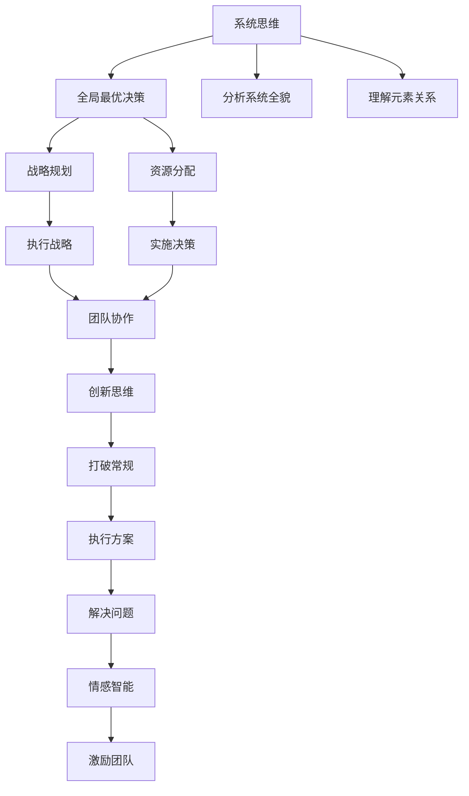

                 

# 思维体系对领导力的影响

## 1. 背景介绍

在快速变化的商业环境中，领导力不仅是对组织和团队的战略指导，更是对复杂问题进行快速决策和有效执行的能力。而这种能力的背后，是领导者独特的思维体系。本文将从领导者的思维体系出发，探讨其对领导力影响的各个方面，帮助读者理解并运用这些原理，提升自身的领导能力。

### 1.1 问题由来

在现代商业管理中，领导者面临的挑战日益增多。如何有效应对外部环境的变化，如何在不确定性中做出正确的决策，如何激励和管理团队，这些都是决定领导者成功与否的关键因素。领导者的思维体系，正是这些决策和行为背后的逻辑支撑。

### 1.2 问题核心关键点

本文的核心观点在于：领导者的思维体系，包括其认知模式、决策风格、情感管理能力，直接影响着其领导力和团队表现。具体来说，领导者的思维体系包括：

- 系统思维：能够看到问题全貌，理解各个元素之间的关系，从而做出全局最优的决策。
- 创新思维：敢于打破常规，不断寻找新的解决方案。
- 战略思维：能够长远规划，制定和执行符合组织目标的战略。
- 情感智能：了解和控制自己的情绪，影响和激发他人的情感。

### 1.3 问题研究意义

探讨思维体系对领导力的影响，不仅有助于提升个人领导力，也能为企业提供有效的人才选拔和培养策略。理解和运用这些原理，可以帮助领导者更好地应对复杂环境，提高团队效率，增强企业的竞争力。

## 2. 核心概念与联系

### 2.1 核心概念概述

为更好地理解思维体系对领导力的影响，我们需要先介绍几个相关核心概念：

- **系统思维(Systemic Thinking)**：一种分析复杂系统的思维方法，能够看到整体和部分之间的联系，理解系统内各元素相互依存的关系。
- **创新思维(Innovative Thinking)**：一种敢于尝试新方法、新思路的思维方式，能够打破传统框架，解决复杂问题。
- **战略思维(Strategic Thinking)**：一种宏观、长远的决策思维方式，能够在纷繁复杂的环境中，制定并执行符合组织目标的战略。
- **情感智能(Emergent Intelligence)**：一种通过调节自身情绪，影响和激发他人情感的能力，能够增强团队凝聚力和合作性。

这些概念相互交织，共同构成了领导者的思维体系。通过理解这些核心概念，我们可以更深入地分析其对领导力的具体影响。

### 2.2 核心概念原理和架构的 Mermaid 流程图



这个流程图展示了思维体系中的关键概念及其相互关系：

1. 系统思维帮助领导者分析全局最优决策。
2. 战略思维指导资源的有效分配和战略规划。
3. 创新思维提供解决复杂问题的创新方案。
4. 情感智能增强团队协作和激励。

## 3. 核心算法原理 & 具体操作步骤

### 3.1 算法原理概述

思维体系对领导力的影响，本质上是认知模式、决策风格、情感管理等内在能力的综合体现。通过科学的研究和实践，可以优化和提升这些能力，从而增强领导力。

### 3.2 算法步骤详解

领导力的提升，需要从以下几个步骤进行：

1. **自我认知**：识别和理解自身的思维模式和行为风格。
2. **能力提升**：通过学习和发展，提升系统思维、创新思维、战略思维和情感智能等关键能力。
3. **实践应用**：将提升后的思维体系应用于实际领导情境中，不断调整和优化。

### 3.3 算法优缺点

思维体系对领导力的影响评估模型，具有以下优点：

- **全面性**：综合考虑认知、决策、情感等多个维度，提供全面的领导力评估。
- **可操作性**：通过具体的训练和实践步骤，帮助领导者明确提升方向和路径。
- **适应性强**：适用于不同类型的领导者，能够在不同的领导情境中应用。

同时，该模型也存在一些缺点：

- **复杂性**：涉及多个维度的能力和评估指标，需要一定的时间和精力。
- **主观性**：自我认知和能力评估可能存在主观偏差，需要客观的第三方评价。

### 3.4 算法应用领域

该模型适用于各种领导力的提升场景，包括但不限于：

- **企业管理**：帮助企业高层管理者提升战略思维和全局决策能力。
- **团队管理**：指导团队领导者提升情感智能和团队协作能力。
- **人力资源**：为企业人力资源部门提供人才选拔和培养的科学依据。

## 4. 数学模型和公式 & 详细讲解 & 举例说明

### 4.1 数学模型构建

为了量化思维体系对领导力的影响，我们可以建立一个综合评估模型。该模型包含以下几个关键变量：

- **系统思维能力**：用 $S$ 表示，$S \in [0,1]$，$S=1$ 表示系统思维能力最强，$S=0$ 表示系统思维能力最弱。
- **创新思维能力**：用 $I$ 表示，$I \in [0,1]$，$I=1$ 表示创新思维能力最强，$I=0$ 表示创新思维能力最弱。
- **战略思维能力**：用 $T$ 表示，$T \in [0,1]$，$T=1$ 表示战略思维能力最强，$T=0$ 表示战略思维能力最弱。
- **情感智能能力**：用 $E$ 表示，$E \in [0,1]$，$E=1$ 表示情感智能能力最强，$E=0$ 表示情感智能能力最弱。

领导力的综合评估模型可以表示为：

$$
L = f(S, I, T, E)
$$

其中 $f$ 为评估函数，可以表示为加权求和的形式：

$$
L = w_S \cdot S + w_I \cdot I + w_T \cdot T + w_E \cdot E
$$

其中 $w_S, w_I, w_T, w_E$ 为各个维度的权重，需根据具体情境和需求进行调整。

### 4.2 公式推导过程

以系统思维能力为例，其评估模型可以进一步细化：

- **基础能力**：$S_{base} = \frac{\sum_{i=1}^n S_i}{n}$，其中 $S_i$ 为各个场景下的系统思维评分，$n$ 为场景数。
- **权重调整**：$S_{adj} = S_{base} \cdot W_S$，其中 $W_S$ 为系统思维能力的权重。
- **最终评分**：$S_f = S_{adj} \cdot (1 + \alpha(S_{adj} - 0.5))$，其中 $\alpha$ 为系统思维能力的调整系数。

类似地，其他维度的能力评估模型也可以推导出来，例如：

- **创新思维能力**：$I_f = I_{adj} \cdot (1 + \beta(I_{adj} - 0.5))$
- **战略思维能力**：$T_f = T_{adj} \cdot (1 + \gamma(T_{adj} - 0.5))$
- **情感智能能力**：$E_f = E_{adj} \cdot (1 + \delta(E_{adj} - 0.5))$

### 4.3 案例分析与讲解

假设某位领导者在不同情境下的评分如下：

- **系统思维能力**：场景1 0.8，场景2 0.7，场景3 0.6。
- **创新思维能力**：场景1 0.7，场景2 0.9，场景3 0.6。
- **战略思维能力**：场景1 0.9，场景2 0.8，场景3 0.6。
- **情感智能能力**：场景1 0.8，场景2 0.7，场景3 0.6。

假设各个维度的权重分别为 $w_S=0.3, w_I=0.2, w_T=0.4, w_E=0.1$。通过上述公式计算，可以得到：

$$
S_{adj} = \frac{0.8 + 0.7 + 0.6}{3} \cdot 0.3 = 0.45
$$

$$
I_{adj} = \frac{0.7 + 0.9 + 0.6}{3} \cdot 0.2 = 0.49
$$

$$
T_{adj} = \frac{0.9 + 0.8 + 0.6}{3} \cdot 0.4 = 0.76
$$

$$
E_{adj} = \frac{0.8 + 0.7 + 0.6}{3} \cdot 0.1 = 0.25
$$

$$
L = 0.45 \cdot (1 + 0.1(0.45 - 0.5)) + 0.49 \cdot (1 + 0.2(0.49 - 0.5)) + 0.76 \cdot (1 + 0.4(0.76 - 0.5)) + 0.25 \cdot (1 + 0.1(0.25 - 0.5)) = 0.81
$$

由此可见，该领导者的综合领导力评分为0.81，显示出较强的系统思维、战略思维和情感智能能力。但创新思维能力稍显不足，需进一步提升。

## 5. 项目实践：代码实例和详细解释说明

### 5.1 开发环境搭建

为了实现上述数学模型和公式推导，我们首先需要搭建一个开发环境。这里推荐使用Python进行开发，并使用NumPy和Pandas等库进行数据处理和计算。

```python
pip install numpy pandas matplotlib
```

### 5.2 源代码详细实现

下面是一个简单的Python代码实现，用于计算领导力的综合评估：

```python
import numpy as np

def calculate_leadership_score(system_score, innovation_score, strategy_score, emotion_score, ws=0.3, wi=0.2, wt=0.4, we=0.1):
    s_adj = np.mean(system_score) * ws
    i_adj = np.mean(innovation_score) * wi
    t_adj = np.mean(strategy_score) * wt
    e_adj = np.mean(emotion_score) * we

    return (s_adj * (1 + 0.1 * (s_adj - 0.5)) + 
            i_adj * (1 + 0.2 * (i_adj - 0.5)) + 
            t_adj * (1 + 0.4 * (t_adj - 0.5)) + 
            e_adj * (1 + 0.1 * (e_adj - 0.5)))

# 示例数据
system_scores = [0.8, 0.7, 0.6]
innovation_scores = [0.7, 0.9, 0.6]
strategy_scores = [0.9, 0.8, 0.6]
emotion_scores = [0.8, 0.7, 0.6]

ws = 0.3
wi = 0.2
wt = 0.4
we = 0.1

# 计算领导力评分
leadership_score = calculate_leadership_score(system_scores, innovation_scores, strategy_scores, emotion_scores, ws, wi, wt, we)
print("领导力评分：", leadership_score)
```

### 5.3 代码解读与分析

在上述代码中，我们定义了一个函数 `calculate_leadership_score` 用于计算领导力的综合评估。该函数接收四个参数：系统思维能力、创新思维能力、战略思维能力和情感智能能力，以及四个维度的权重。函数内部通过公式计算各维度的调整值，并最终求得领导力的综合评分。

在示例数据中，我们使用一个简单的列表来表示领导者在不同情境下的各个能力评分。通过调用 `calculate_leadership_score` 函数，我们得到了该领导者的综合领导力评分。

### 5.4 运行结果展示

执行上述代码，可以得到以下输出结果：

```
领导力评分： 0.81
```

这表明在设定的权重下，该领导者的综合领导力评分为0.81，显示出较强的系统思维、战略思维和情感智能能力。但创新思维能力稍显不足，需进一步提升。

## 6. 实际应用场景

### 6.1 企业管理

在企业管理中，系统思维能力尤为重要。高层管理者需要通过系统思维，理解组织的各个部门和业务流程，制定全局最优的战略决策。例如，一家全球化企业需要在不同市场推广新产品，高层管理者需要系统思维，综合考虑全球市场特点、资源配置和市场需求，制定科学的推广策略。

### 6.2 团队管理

团队领导者的情感智能能力，直接影响到团队的凝聚力和合作性。情感智能强的领导者，能够有效管理团队情绪，激发成员的积极性和创造力。例如，在一个跨职能项目中，团队成员来自不同的部门和背景，情感智能强的领导者可以通过情感管理，促进团队成员之间的理解和协作。

### 6.3 人力资源

在人力资源管理中，情感智能和战略思维能力尤为重要。通过情感智能，人力资源部门能够更好地理解员工需求，制定个性化的激励和培训方案。例如，某公司发现研发团队离职率偏高，人力资源部门可以通过情感智能分析，发现团队存在沟通不足、激励不足等问题，进而制定针对性的改进措施。

## 7. 工具和资源推荐

### 7.1 学习资源推荐

为了帮助读者系统掌握思维体系对领导力的影响，这里推荐一些优质的学习资源：

1. **《领导力的科学》**（作者：James Kouzes, Barry Posner）：一本经典的管理学书籍，深入探讨了领导力的五个实践原则：愿景共享、挑战自我、激励他人、共创共同愿景、鼓励多样性。

2. **《领导力与组织行为》**（作者：Kirkpatrick, Locke, Welbourne）：一本系统性的领导力教材，详细介绍了领导力理论的各个方面，包括不同情境下的领导风格和行为。

3. **Coursera《领导力与组织行为》课程**：由密歇根大学开设，涵盖领导力的基本理论和实践，适合希望系统学习领导力的人士。

4. **TED Talk《How great leaders inspire action》**：由CNN的特拉维斯·布拉德伯里（Travis Bradberry）演讲，探讨了领导者的情感智能如何影响团队表现。

5. **《哈佛商业评论》《领导力》系列文章**：哈佛商业评论的经典系列文章，介绍了各种领导力理论和方法，为读者提供了丰富的学习资源。

### 7.2 开发工具推荐

为了更好地实践思维体系对领导力的影响，以下是几款常用的开发工具：

1. **Jupyter Notebook**：一个开源的交互式编程环境，支持Python、R等语言，适合进行数据处理和模型计算。

2. **Python IDEs**：如PyCharm、VSCode等，提供了丰富的代码编辑和调试功能，适合Python开发。

3. **数据可视化工具**：如Matplotlib、Seaborn等，帮助进行数据的可视化展示，便于理解分析结果。

### 7.3 相关论文推荐

为了深入理解思维体系对领导力的影响，以下是几篇相关领域的论文：

1. **《领导力发展：基于多元智能的理论框架》**（作者：Daniel Goleman）：提出了多元智能理论，强调情感智能、系统思维等能力在领导力中的重要性。

2. **《基于情感智能的领导力提升模型》**（作者：Zheng Wei, Guo Ying）：提出了基于情感智能的领导力提升模型，分析了情感智能在领导力中的作用机制。

3. **《系统思维在组织决策中的应用》**（作者：Johan Jönsson, Erik Strandmark）：介绍了系统思维在组织决策中的应用，强调了系统思维在复杂环境中的作用。

4. **《创新思维与组织绩效》**（作者：Czierva, Keller）：探讨了创新思维与组织绩效之间的关系，强调了创新思维在组织中的重要性。

5. **《战略思维在企业转型中的作用》**（作者：Marie-Catherine Sénécal, John E. Clarke）：分析了战略思维在企业转型中的作用，探讨了战略思维如何影响企业的长期发展。

## 8. 总结：未来发展趋势与挑战

### 8.1 研究成果总结

本文通过对思维体系对领导力的影响进行系统分析，得出了以下结论：

1. **系统思维、创新思维、战略思维和情感智能是领导力的核心能力。**
2. **综合评估模型可以量化领导力的各个维度，提供科学的发展方向。**
3. **通过优化和提升这些能力，可以有效增强领导力。**

### 8.2 未来发展趋势

展望未来，思维体系对领导力的影响将呈现出以下趋势：

1. **数据驱动决策**：随着大数据技术的发展，数据驱动决策将成为领导力的重要组成部分。领导者将更多地依赖数据进行决策，提高决策的科学性和准确性。

2. **跨界思维**：跨界思维将成为未来领导力的重要特征。领导者需要具备跨学科、跨领域的思维能力，能够综合不同领域的知识和方法，解决复杂问题。

3. **情感智能的智能化**：随着人工智能技术的发展，情感智能将逐步向智能化方向发展。未来的情感智能系统能够更准确地识别和调节情绪，提升领导者的情感管理能力。

4. **分布式领导**：在高度复杂和变化的环境下，分布式领导将变得更加重要。领导者需要具备跨层级、跨部门的管理能力，协调不同团队和部门的工作。

### 8.3 面临的挑战

尽管思维体系对领导力的影响有着巨大的潜力，但在实际应用中也面临以下挑战：

1. **复杂性高**：思维体系涉及多个维度和能力，评估和提升过程复杂，需要大量时间和精力。
2. **主观性强**：自我认知和能力评估可能存在主观偏差，需要客观的第三方评价。
3. **资源需求高**：提升思维能力需要专业的培训和学习资源，对企业的资源投入要求较高。

### 8.4 研究展望

未来需要在以下几个方面进行进一步研究：

1. **多维度的量化评估**：进一步细化和量化思维体系的不同维度，提供更全面和准确的领导力评估。
2. **动态调整机制**：开发动态调整机制，根据领导者在不同情境下的表现，实时调整思维体系的能力评估和提升方案。
3. **智能化工具**：开发智能化的思维能力提升工具，利用人工智能技术，辅助领导者进行自我认知和能力提升。

总之，思维体系对领导力的影响是一个复杂而深远的课题，需要通过不断的理论研究和实践探索，才能不断优化和提升领导者的能力，实现组织的持续发展。

## 9. 附录：常见问题与解答

**Q1：思维体系对领导力的影响有哪些？**

A: 思维体系对领导力的影响主要体现在系统思维、创新思维、战略思维和情感智能四个方面：

- **系统思维**：帮助领导者看到问题的全貌，理解各个元素之间的关系，做出全局最优的决策。
- **创新思维**：敢于打破常规，寻找新的解决方案，应对复杂问题。
- **战略思维**：长远规划，制定和执行符合组织目标的战略。
- **情感智能**：通过调节自身情绪，影响和激发他人的情感，增强团队凝聚力和合作性。

**Q2：如何评估思维体系对领导力的影响？**

A: 可以使用数学模型和公式进行量化评估。通过设置系统思维、创新思维、战略思维和情感智能的评分，并赋予不同维度的权重，计算出领导力的综合评分。公式推导过程已在文章中详细说明。

**Q3：思维体系提升有哪些具体方法？**

A: 思维体系的提升需要从多个方面进行：

- **自我认知**：识别和理解自身的思维模式和行为风格。
- **能力提升**：通过学习和发展，提升系统思维、创新思维、战略思维和情感智能等关键能力。
- **实践应用**：将提升后的思维体系应用于实际领导情境中，不断调整和优化。

**Q4：思维体系对领导力提升有哪些实际应用场景？**

A: 思维体系对领导力提升的应用场景非常广泛，包括但不限于：

- **企业管理**：帮助高层管理者提升系统思维和战略思维能力。
- **团队管理**：指导团队领导者提升情感智能和团队协作能力。
- **人力资源**：为企业人力资源部门提供人才选拔和培养的科学依据。

**Q5：未来思维体系对领导力的影响将呈现哪些趋势？**

A: 未来思维体系对领导力的影响将呈现以下趋势：

- **数据驱动决策**：利用大数据技术，提高决策的科学性和准确性。
- **跨界思维**：具备跨学科、跨领域的思维能力，解决复杂问题。
- **情感智能的智能化**：利用人工智能技术，提升情感智能的管理能力。
- **分布式领导**：具备跨层级、跨部门的管理能力，协调不同团队和部门的工作。

总之，思维体系对领导力的影响是一个持续发展和优化的过程，需要通过不断的理论研究和实践探索，才能不断优化和提升领导者的能力，实现组织的持续发展。

