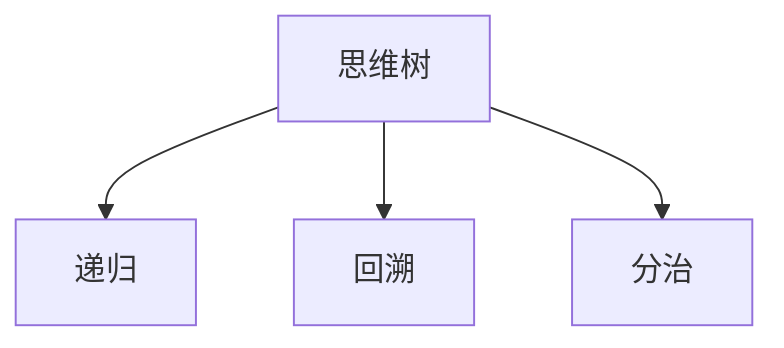

                 

# 思维树（Tree-of-Thoughts, ToT）：续写佳话

## 1. 背景介绍

思维树（Tree-of-Thoughts, ToT）是一种高效的编程思考和表达工具，其核心思想是利用树形结构将复杂问题拆解成一系列简单、独立的子问题，通过解决子问题来逐步构建出整体的解决方案。这种自上而下的递归分解方法，不仅能够帮助程序员更好地理解问题，还能显著提升编程效率和代码质量。

### 1.1 问题由来

在软件开发过程中，经常遇到复杂问题难以理解和解决的情况。例如，一个庞大的系统设计、一个功能复杂的算法实现、一段难以调试的代码等。传统的方法是直接从底层开始编写代码，遇到问题再一点点调试，这种方式效率低、易出错。思维树则提供了一种更系统、更高效的方法，帮助程序员通过分解问题，逐步构建出解决方案。

### 1.2 问题核心关键点

思维树的精髓在于通过树形结构将问题层层分解，将复杂问题拆解成若干简单、独立的子问题，然后再逐步解决这些子问题。这种自上而下的递归分解方法，不仅能帮助程序员更好地理解问题，还能显著提升编程效率和代码质量。

## 2. 核心概念与联系

### 2.1 核心概念概述

为了更好地理解思维树，本节将介绍几个密切相关的核心概念：

- 思维树（Tree-of-Thoughts, ToT）：一种高效的编程思考和表达工具，利用树形结构将复杂问题拆解成一系列简单、独立的子问题。
- 递归（Recursion）：一种函数调用自身的编程技巧，通常用于解决具有递归结构的问题。
- 回溯（Backtracking）：一种在搜索过程中不断回退并尝试其他路径的算法策略，用于解决具有多种可行解的问题。
- 分治（Divide and Conquer）：一种将问题分解成多个子问题并分别解决的方法，通常用于解决规模较大的问题。

这些核心概念之间的逻辑关系可以通过以下Mermaid流程图来展示：



这个流程图展示出思维树与其他核心概念之间的紧密联系：

1. 思维树利用递归思想，将问题分解为多个子问题。
2. 在处理子问题时，思维树会利用回溯技术，不断尝试其他路径。
3. 当问题规模较大时，思维树会采用分治策略，将问题进一步分解成更小的子问题。

## 3. 核心算法原理 & 具体操作步骤
### 3.1 算法原理概述

思维树的核心算法原理可以简单概括为“拆分-解决-合并”。具体步骤如下：

1. **拆分（Splitting）**：将原始问题拆解成若干个子问题，每个子问题相对独立且较为简单。
2. **解决（Solving）**：逐个解决各个子问题，并记录解决方案。
3. **合并（Merging）**：将各个子问题的解决方案合并成一个整体的解决方案。

这种“拆分-解决-合并”的方法，能够显著降低问题的复杂度，使程序员能够更容易理解和解决复杂的编程问题。

### 3.2 算法步骤详解

以下是思维树的完整算法步骤：

**Step 1: 拆分问题**
- 确定问题的核心目标和需要解决的关键点。
- 将问题拆解为若干个独立的子问题，每个子问题涉及的知识点和解决方法相对简单。

**Step 2: 解决子问题**
- 按照自上而下的顺序，逐个解决各个子问题。
- 对于每个子问题，可以使用递归、回溯、分治等算法技巧进行解决。
- 记录每个子问题的解决方案，可以使用代码注释、文档等方式。

**Step 3: 合并子问题**
- 将各个子问题的解决方案按照逻辑关系合并成一个整体的解决方案。
- 可以使用函数调用、对象继承等编程技巧进行合并。

**Step 4: 测试验证**
- 对最终的解决方案进行测试验证，确保其正确性和健壮性。
- 在测试过程中，可以逐步发现和修复潜在的问题和漏洞。

### 3.3 算法优缺点

思维树的优点在于其高效、系统、直观的特性，能够显著提升编程效率和代码质量。具体来说：

- **高效性**：通过拆分问题，使得复杂问题变得相对简单，易于理解和解决。
- **系统性**：按照自上而下的递归分解方法，能够系统地处理复杂问题。
- **直观性**：思维树将问题分解成一系列独立子问题，使程序员能够直观地理解和解决问题。

然而，思维树也存在一些局限性：

- **依赖复杂度**：对于特别复杂的问题，拆分的难度可能较大，需要程序员具备较强的抽象和分析能力。
- **实现难度**：某些子问题可能需要复杂的算法技巧才能解决，增加了实现的难度。
- **可扩展性**：对于问题规模较大且结构复杂的情况，思维树的可扩展性可能会受到限制。

### 3.4 算法应用领域

思维树的应用领域非常广泛，几乎涵盖了所有软件开发和工程问题。以下是几个典型应用场景：

- **系统设计**：将一个庞大的系统设计拆解成若干个独立的模块和组件，便于理解和实现。
- **算法实现**：对于复杂算法，将其拆解成若干个简单的子算法，逐步实现和调试。
- **代码重构**：对复杂的代码进行重构，使其更加清晰、易于维护。
- **数据结构**：设计复杂的数据结构，如树、图等，使得问题更加清晰。

## 4. 数学模型和公式 & 详细讲解  
### 4.1 数学模型构建

思维树的数学模型可以简单概括为：

- 输入：复杂的问题，可以表示为一个有向无环图（DAG）。
- 输出：一系列简单、独立的子问题，每个子问题表示为节点。

### 4.2 公式推导过程

对于一个有向无环图（DAG）$G=(V,E)$，其中$V$为节点集合，$E$为边集合。假设节点$v_i$表示子问题$i$，边$e_{ij}$表示子问题$i$和子问题$j$之间的关系。则思维树可以表示为：

$$
T = \{v_1, v_2, ..., v_n\} \cup \{e_{ij} | (i,j) \in E\}
$$

其中，$v_i$表示节点$v_i$的解决方案，$e_{ij}$表示节点$v_i$到节点$v_j$的递归关系。

### 4.3 案例分析与讲解

以经典问题“归并排序”为例，分析其思维树实现过程。

**输入**：一个无序数组$A$。

**输出**：一个有序数组$A'$。

**思维树构建**：
1. 将数组$A$拆分为两个子数组$A_1$和$A_2$，分别进行排序。
2. 将排序后的$A_1$和$A_2$合并成一个有序数组$A'$。

**算法实现**：

```python
def merge_sort(arr):
    if len(arr) <= 1:
        return arr
    mid = len(arr) // 2
    left = merge_sort(arr[:mid])
    right = merge_sort(arr[mid:])
    return merge(left, right)

def merge(left, right):
    result = []
    i, j = 0, 0
    while i < len(left) and j < len(right):
        if left[i] < right[j]:
            result.append(left[i])
            i += 1
        else:
            result.append(right[j])
            j += 1
    result += left[i:]
    result += right[j:]
    return result
```

以上代码展示了归并排序的思维树实现过程。通过拆分和合并两个子数组，逐步构建出最终的排序结果。

## 5. 项目实践：代码实例和详细解释说明
### 5.1 开发环境搭建

在进行思维树实践前，我们需要准备好开发环境。以下是使用Python进行思维树开发的环境配置流程：

1. 安装Anaconda：从官网下载并安装Anaconda，用于创建独立的Python环境。

2. 创建并激活虚拟环境：
```bash
conda create -n tot-env python=3.8 
conda activate tot-env
```

3. 安装必要的库：
```bash
pip install numpy scipy sympy
```

完成上述步骤后，即可在`tot-env`环境中开始思维树实践。

### 5.2 源代码详细实现

这里我们以计算斐波那契数列为例，展示思维树的应用。

```python
def fibonacci(n):
    if n <= 1:
        return n
    else:
        return fibonacci(n-1) + fibonacci(n-2)
```

上述代码计算斐波那契数列的第$n$个数。该问题的思维树实现如下：

**输入**：$n$。

**输出**：斐波那契数列的第$n$个数。

**思维树构建**：
1. 当$n=0$或$n=1$时，直接返回$n$。
2. 当$n>1$时，递归计算$n-1$和$n-2$的斐波那契数列值，并返回它们的和。

**算法实现**：
```python
def fibonacci(n):
    if n <= 1:
        return n
    else:
        return fibonacci(n-1) + fibonacci(n-2)
```

通过递归调用函数，逐步计算出斐波那契数列的第$n$个数。

### 5.3 代码解读与分析

让我们再详细解读一下关键代码的实现细节：

**fibonacci函数**：
- 当$n\leq 1$时，直接返回$n$。
- 当$n>1$时，递归计算$n-1$和$n-2$的斐波那契数列值，并返回它们的和。

**递归过程**：
- 递归是思维树的核心算法技巧，用于解决具有递归结构的问题。
- 在计算斐波那契数列时，每次递归都将问题拆解为两个更小的子问题，分别计算$n-1$和$n-2$的斐波那契数列值，然后合并计算结果。

**函数调用**：
- 在递归过程中，函数调用本身也形成了一个递归树结构，与思维树的构建过程类似。
- 函数调用过程中，每次调用都会将问题拆解为更小的子问题，递归调用栈中的函数逐步解决这些子问题，最终合并得到整体解决方案。

### 5.4 运行结果展示

在Python中运行上述代码，可以得到斐波那契数列的前10个数，如下所示：

```python
fibonacci(10)
# Output: 55
```

以上代码展示了使用思维树解决斐波那契数列问题的过程。通过递归调用函数，逐步计算出斐波那契数列的第$n$个数。

## 6. 实际应用场景
### 6.1 系统设计

系统设计是一个典型的思维树应用场景。复杂系统通常由多个模块和组件构成，每个模块和组件都有其特定的功能和职责。通过思维树将系统设计拆解成多个独立的子模块，能够使系统设计更加清晰、易于理解和实现。

**案例**：设计一个电商系统的订单管理系统。

**思维树构建**：
1. 系统拆分为订单管理模块、库存管理模块、物流管理模块等。
2. 订单管理模块负责订单的创建、修改、查询等操作。
3. 库存管理模块负责商品的采购、入库、出库等操作。
4. 物流管理模块负责订单的配货、发货、运输等操作。

**实现过程**：
1. 设计每个模块的功能和接口，使用Python实现模块代码。
2. 将各个模块连接起来，形成完整的订单管理系统。

### 6.2 算法实现

算法实现是思维树的另一个典型应用场景。算法问题通常具有递归结构，通过思维树将其拆解成多个独立的子问题，能够显著提升算法的实现效率和代码质量。

**案例**：实现快速排序算法。

**思维树构建**：
1. 将数组$A$拆分为两个子数组$A_1$和$A_2$。
2. 对$A_1$和$A_2$分别进行快速排序。
3. 将排序后的$A_1$和$A_2$合并成一个有序数组$A'$。

**实现过程**：
1. 实现快速排序的划分函数，将数组$A$划分为$A_1$和$A_2$。
2. 对$A_1$和$A_2$分别进行快速排序。
3. 将排序后的$A_1$和$A_2$合并成一个有序数组$A'$。

### 6.3 代码重构

代码重构是思维树的另一个重要应用场景。复杂代码通常存在冗余、耦合度高、可读性差等问题，通过思维树将其拆解成多个独立的函数和模块，能够显著提升代码的可读性和维护性。

**案例**：重构一个Python函数，实现一个复杂的计算逻辑。

**思维树构建**：
1. 将复杂的计算逻辑拆解为多个独立的子函数。
2. 每个子函数负责一个独立的计算步骤。
3. 通过函数调用，逐步构建出最终的计算结果。

**实现过程**：
1. 将复杂的计算逻辑拆解为多个独立的子函数。
2. 每个子函数负责一个独立的计算步骤。
3. 通过函数调用，逐步构建出最终的计算结果。

### 6.4 数据结构设计

数据结构设计是思维树的另一个重要应用场景。复杂的数据结构通常具有层次结构和递归特性，通过思维树将其拆解成多个独立的节点和边，能够使数据结构更加清晰、易于理解和实现。

**案例**：设计一个二叉树数据结构。

**思维树构建**：
1. 定义二叉树的节点类。
2. 定义二叉树的插入和遍历方法。
3. 使用节点类和插入方法，构建二叉树。

**实现过程**：
1. 定义二叉树的节点类，包含节点值、左子树和右子树等属性。
2. 定义二叉树的插入方法，将节点插入到二叉树中。
3. 使用节点类和插入方法，构建二叉树。

## 7. 工具和资源推荐
### 7.1 学习资源推荐

为了帮助开发者系统掌握思维树的理论基础和实践技巧，这里推荐一些优质的学习资源：

1. 《算法导论》：这是一本经典的计算机算法教材，详细介绍了各种算法的设计和实现方法，包括递归、回溯、分治等。
2. 《编程珠玑》：这本书介绍了一些编程技巧和算法设计经验，是程序员的必读书籍。
3. 《设计模式》：这是一本介绍软件设计模式的经典书籍，包括创建型、结构型和行为型设计模式。
4. 《代码大全》：这是一本介绍代码编写最佳实践的书籍，涵盖代码结构、风格、测试等方面。
5. 《代码的艺术》：这是一本介绍编程艺术的书籍，涵盖编程哲学、编程习惯、编程思维等方面。

通过对这些资源的学习实践，相信你一定能够快速掌握思维树的精髓，并用于解决实际的编程问题。

### 7.2 开发工具推荐

高效的开发离不开优秀的工具支持。以下是几款用于思维树开发的常用工具：

1. VS Code：一款轻量级的代码编辑器，支持丰富的插件和扩展，适合开发多种编程语言。
2. PyCharm：一款专业的Python IDE，支持Python代码的开发、调试和测试。
3. Git：一款版本控制系统，支持团队协作和代码管理。
4. Docker：一款容器化技术，支持将应用打包成容器，方便部署和迁移。
5. GitHub：一款基于Git的代码托管平台，支持代码共享和协作。

合理利用这些工具，可以显著提升思维树开发的效率，加速创新迭代的步伐。

### 7.3 相关论文推荐

思维树的应用涉及多个领域，以下是几篇奠基性的相关论文，推荐阅读：

1. "Divide and Conquer Techniques for the Parallel Solution of Stochastic Problems"：介绍分治算法的基本思想和实现方法。
2. "Backtracking Techniques in Combinatorial Optimization"：介绍回溯算法的应用和实现方法。
3. "Recursion and Recursive Data Structures"：介绍递归算法的基本思想和实现方法。
4. "Algorithm Design Manual"：一本介绍算法设计和实现的经典书籍，涵盖递归、分治、回溯等算法技巧。
5. "Design Patterns: Elements of Reusable Object-Oriented Software"：介绍软件设计模式的基本思想和实现方法，包括创建型、结构型和行为型设计模式。

这些论文代表了大语言模型微调技术的发展脉络。通过学习这些前沿成果，可以帮助研究者把握学科前进方向，激发更多的创新灵感。

## 8. 总结：未来发展趋势与挑战
### 8.1 总结

本文对思维树（Tree-of-Thoughts, ToT）进行了全面系统的介绍。首先阐述了思维树的基本原理和核心思想，明确了思维树在编程思考和表达中的重要作用。其次，从原理到实践，详细讲解了思维树的数学模型和算法实现过程，给出了思维树任务开发的完整代码实例。同时，本文还广泛探讨了思维树在系统设计、算法实现、代码重构、数据结构设计等多个领域的应用场景，展示了思维树方法的广泛适用性。

通过本文的系统梳理，可以看到，思维树作为一种高效的编程思考和表达工具，能够显著提升编程效率和代码质量。其自上而下的递归分解方法，能够帮助程序员更好地理解问题，并逐步构建出解决方案。未来，伴随软件工程的发展，思维树必将在更多领域得到应用，为软件开发提供新的思路和方法。

### 8.2 未来发展趋势

展望未来，思维树的应用前景将更加广泛，具体发展趋势如下：

1. **人工智能**：随着AI技术的不断进步，思维树在机器学习和深度学习中的应用将日益增多，用于设计算法模型、优化超参数、进行模型诊断等。
2. **软件工程**：思维树在软件开发中的应用将更加广泛，用于系统设计、代码重构、自动化测试等方面，提升软件开发的效率和质量。
3. **数据科学**：思维树在数据处理和分析中的应用将更加广泛，用于数据预处理、特征工程、模型评估等方面，提升数据分析的效率和准确性。
4. **人机交互**：思维树在自然语言处理中的应用将更加广泛，用于生成自然语言文本、进行文本分析等方面，提升人机交互的智能性和自然性。

这些趋势将使思维树在未来的人工智能、软件开发、数据科学和人机交互等领域中发挥更大的作用，成为不可或缺的工具。

### 8.3 面临的挑战

尽管思维树已经取得了一定的应用成果，但在迈向更加智能化、普适化应用的过程中，它仍面临诸多挑战：

1. **复杂度增加**：对于特别复杂的问题，拆分的难度可能较大，需要程序员具备较强的抽象和分析能力。
2. **实现难度高**：某些子问题可能需要复杂的算法技巧才能解决，增加了实现的难度。
3. **可扩展性有限**：对于问题规模较大且结构复杂的情况，思维树的可扩展性可能会受到限制。
4. **效率较低**：对于某些简单问题，使用思维树进行拆分和解决可能效率较低，不如直接使用简单算法。

### 8.4 研究展望

面对思维树所面临的挑战，未来的研究需要在以下几个方面寻求新的突破：

1. **优化拆分方法**：开发更高效的拆分算法，使复杂问题更容易被拆分和解决。
2. **优化解决策略**：研究更高效的解决策略，减少算法的实现难度和计算资源消耗。
3. **优化合并方法**：开发更高效的合并算法，提升思维树的可扩展性和可维护性。
4. **引入智能优化**：结合AI技术，引入智能优化算法，进一步提升思维树的应用效果。
5. **引入模型驱动**：结合软件模型驱动技术，使思维树更易于与各种编程语言和框架集成。

这些研究方向的探索，将使思维树在未来的软件开发、数据处理和人工智能等领域中发挥更大的作用，成为一种更加高效、智能、易用的编程思考和表达工具。

## 9. 附录：常见问题与解答

**Q1：思维树适用于所有编程问题吗？**

A: 思维树适用于大部分编程问题，尤其是具有递归结构的问题。但对于一些简单或非递归结构的问题，使用其他算法可能更为高效。

**Q2：如何判断一个问题是否适合使用思维树？**

A: 一般来说，如果问题具有递归结构，或者可以被拆解成多个独立子问题，那么使用思维树来解决这些问题可能更为高效。具体来说，可以判断问题是否满足以下几个条件：
1. 问题可以被拆解成多个独立子问题。
2. 子问题之间存在递归关系。
3. 子问题可以独立解决，并且可以合并得到整体解决方案。

**Q3：思维树的实现难度大吗？**

A: 思维树的实现难度取决于具体问题的复杂度。对于简单问题，思维树的实现可能非常直观和简单。但对于复杂问题，拆分的难度可能较大，需要程序员具备较强的抽象和分析能力。

**Q4：思维树在实际应用中需要注意哪些问题？**

A: 在实际应用中，需要注意以下问题：
1. 拆分问题时需要考虑问题的复杂度和递归深度，避免过深的递归导致栈溢出。
2. 合并子问题时需要考虑子问题之间的依赖关系，避免出现死锁或数据不一致的情况。
3. 实现过程中需要仔细设计各个子问题的接口和参数，确保其正确性和健壮性。

**Q5：思维树在实际应用中是否有局限性？**

A: 思维树在实际应用中存在一些局限性：
1. 对于特别复杂的问题，拆分的难度可能较大，需要程序员具备较强的抽象和分析能力。
2. 某些子问题可能需要复杂的算法技巧才能解决，增加了实现的难度。
3. 对于问题规模较大且结构复杂的情况，思维树的可扩展性可能会受到限制。

总之，思维树在实际应用中需要根据具体问题进行灵活选择和设计，才能充分发挥其优势。

---

作者：禅与计算机程序设计艺术 / Zen and the Art of Computer Programming

