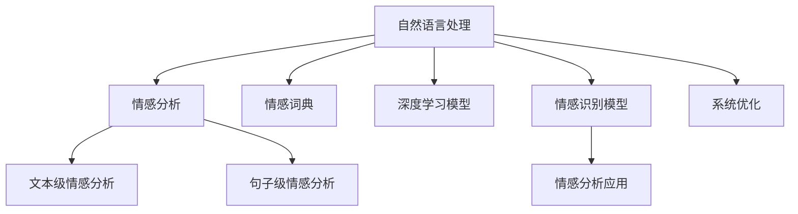

                 

## 1. 背景介绍

### 1.1 问题由来
随着电子商务平台的蓬勃发展，用户评价数据已成为商家洞察用户需求、优化商品的重要依据。然而，海量的用户评价数据背后蕴含的情感信息难以直接提取和利用，如何从用户评价中自动分析和挖掘情感信息，以提升商品质量和用户满意度，成为电商领域的重要课题。

情感分析（Sentiment Analysis）是一种利用自然语言处理（NLP）技术，自动分析和理解用户评价中表达的情感倾向（如正面、负面、中性）的方法。通过对用户评价的情感分析，商家可以快速把握用户需求，改进商品设计和营销策略，提升用户体验和业务效果。

### 1.2 问题核心关键点
当前，情感分析在电商领域的应用涉及以下几个核心关键点：

- **数据预处理**：如何从海量的用户评价中提取有效的文本信息，并进行清洗、归一化等预处理。
- **情感识别**：通过自然语言处理技术自动识别用户评价中的情感倾向。
- **分析应用**：将情感分析结果应用于商品改进、市场分析等实际场景中，提升业务效果。
- **系统优化**：如何设计高效、可靠的情感分析系统，以支持大规模用户评价数据的实时处理和分析。

本文将重点介绍情感分析在电商领域的核心技术原理和实际应用流程，并通过代码实例和系统架构图进一步讲解。

## 2. 核心概念与联系

### 2.1 核心概念概述

为了更好地理解情感分析在电商领域的应用，我们需要了解几个核心概念：

- **自然语言处理（NLP）**：涉及文本预处理、语言模型、语义理解等技术，是情感分析的基础。
- **情感分析（Sentiment Analysis）**：从用户文本中自动识别情感倾向，通常分为文本级和句子级情感分析。
- **文本级情感分析**：对整个文本进行情感分析，识别文本整体情感。
- **句子级情感分析**：对单个句子进行情感分析，识别句子级情感。
- **情感词典**：一种常用的情感分析工具，利用词典中单词的情感极性进行文本情感分类。
- **深度学习模型**：如卷积神经网络（CNN）、循环神经网络（RNN）、长短期记忆网络（LSTM）、Transformer等，用于复杂情感分析任务。
- **情感识别模型**：用于从用户评价文本中识别情感倾向的模型，如朴素贝叶斯、逻辑回归、SVM等。
- **情感分析应用**：将情感分析结果应用于商品改进、市场分析等场景中，提升业务效果。
- **系统优化**：包括文本预处理、模型训练、分析应用等环节，设计高效、可靠的系统架构。

这些核心概念之间的关系可以通过以下Mermaid流程图来展示：



这个流程图展示了情感分析在电商领域的关键技术和应用流程：

1. 自然语言处理是情感分析的基础，用于文本预处理和特征提取。
2. 通过文本级和句子级情感分析，自动理解用户评价中的情感倾向。
3. 利用情感词典和深度学习模型进行情感识别，提升分析精度。
4. 将情感分析结果应用于商品改进、市场分析等实际场景中，提升业务效果。
5. 设计高效、可靠的系统架构，优化情感分析流程。

## 3. 核心算法原理 & 具体操作步骤
### 3.1 算法原理概述

情感分析在电商领域的应用，通常包括以下几个步骤：

1. **数据预处理**：从电商平台获取用户评价数据，并进行文本清洗、分词、去除停用词等预处理。
2. **情感识别**：利用自然语言处理技术，识别用户评价中的情感倾向。
3. **分析应用**：将情感分析结果应用于商品改进、市场分析等实际场景中。
4. **系统优化**：设计高效、可靠的系统架构，确保情感分析的实时性和准确性。

情感识别是情感分析的核心环节，通常采用以下两种方法：

1. **基于情感词典的方法**：利用预先构建的情感词典，统计文本中正面、负面、中性词的频次，计算文本情感得分。
2. **基于深度学习的方法**：使用深度学习模型（如卷积神经网络、循环神经网络、长短期记忆网络、Transformer等），对用户评价进行情感分类。

基于深度学习的情感分析方法通常分为两个阶段：预训练和微调。预训练阶段使用大规模无标签文本数据训练情感分析模型，微调阶段则使用电商领域的有标签数据对模型进行优化，提升模型在电商场景下的性能。

### 3.2 算法步骤详解

#### 3.2.1 数据预处理

1. **数据收集**：从电商平台获取用户评价数据，包括商品描述、用户评论等文本信息。
2. **文本清洗**：去除HTML标签、特殊符号、数字等非文本信息，并转换为小写字母。
3. **分词处理**：利用分词工具（如jieba）对文本进行分词，生成词汇列表。
4. **去除停用词**：去除常见停用词（如“的”、“是”、“在”等），减少噪声。
5. **文本向量化**：将文本转换为数值型特征向量，用于后续机器学习模型的训练。

#### 3.2.2 情感识别

1. **基于情感词典的方法**：
   - **构建情感词典**：选择适当的情感词典，如中文情感词典，将评价文本中的词汇映射到情感得分。
   - **情感计算**：计算文本中正面、负面、中性词的情感得分，并得出文本情感得分。
   - **情感分类**：将文本情感得分映射到情感标签（如正面、负面、中性）。

2. **基于深度学习的方法**：
   - **模型选择**：选择合适的深度学习模型（如CNN、RNN、LSTM、Transformer等）。
   - **预训练**：在大规模无标签文本数据上预训练情感分析模型。
   - **微调**：在电商领域的有标签数据上微调模型，提升模型在电商场景下的性能。
   - **情感分类**：利用微调后的模型，对新文本进行情感分类。

#### 3.2.3 分析应用

1. **商品改进**：根据用户评价中的情感信息，识别出用户不满意的地方，并提出改进建议。
2. **市场分析**：分析整体市场趋势，识别热门商品和用户需求，指导商品推荐和市场策略。
3. **用户分析**：分析不同用户群体的情感倾向，了解用户需求，优化用户体验。

#### 3.2.4 系统优化

1. **实时处理**：设计高效的情感分析系统，支持大规模用户评价数据的实时处理。
2. **分布式计算**：利用分布式计算框架（如Hadoop、Spark），提高情感分析的并行处理能力。
3. **模型优化**：通过调整模型结构和参数，提升情感分析模型的准确性和实时性。
4. **系统监控**：设计系统监控和告警机制，实时监测情感分析系统的运行状态和性能。

### 3.3 算法优缺点

#### 3.3.1 优点

1. **高效准确**：基于深度学习的情感分析方法，能够在处理大规模数据时保持高精度。
2. **灵活适应**：深度学习模型具有良好的泛化能力，能够适应不同领域和场景。
3. **自动化分析**：情感分析自动化，减轻人工分析的负担，提升效率。
4. **实时处理**：设计高效的情感分析系统，支持大规模数据的实时处理和分析。

#### 3.3.2 缺点

1. **数据依赖**：深度学习模型依赖于标注数据，标注数据质量影响模型性能。
2. **模型复杂**：深度学习模型结构复杂，训练和推理成本较高。
3. **解释性差**：深度学习模型的决策过程缺乏可解释性，难以理解模型的内部机制。
4. **过拟合风险**：深度学习模型在标注数据不足时易发生过拟合。

### 3.4 算法应用领域

情感分析在电商领域具有广泛的应用，主要包括：

1. **商品评价分析**：自动分析和理解用户评价中的情感倾向，识别出用户不满意的地方，提出改进建议。
2. **市场趋势预测**：分析整体市场趋势，识别热门商品和用户需求，指导商品推荐和市场策略。
3. **用户行为分析**：分析不同用户群体的情感倾向，了解用户需求，优化用户体验。
4. **客户服务**：自动回答用户查询，提高客户满意度，减少人工客服的负担。
5. **风险预警**：监测负面评价和舆论趋势，及时预警潜在的市场风险。

## 4. 数学模型和公式 & 详细讲解 & 举例说明

### 4.1 数学模型构建

假设用户评价文本为 $T$，情感分析模型为 $M$，情感词典为 $D$，用户评价情感得分为 $S$，情感标签为 $L$。情感分析的数学模型可表示为：

$$
S = M(T)
$$

其中 $S$ 为文本情感得分，$T$ 为输入文本，$M$ 为情感分析模型，$L$ 为情感标签。

### 4.2 公式推导过程

1. **基于情感词典的方法**：
   - **情感计算公式**：假设文本中正面、负面、中性词的情感得分为 $S^+,T^-,S^0$，则文本情感得分为：

$$
S = \alpha S^+ + \beta T^- + \gamma S^0
$$

其中 $\alpha,\beta,\gamma$ 为情感权重，通常通过实验调整。

2. **基于深度学习的方法**：
   - **模型训练公式**：假设情感分析模型为 $M$，在电商领域有标签数据集 $D=\{(x_i,y_i)\}_{i=1}^N$，其中 $x_i$ 为输入文本，$y_i$ 为情感标签，则模型训练的损失函数为：

$$
L = \frac{1}{N} \sum_{i=1}^N \ell(M(x_i),y_i)
$$

其中 $\ell$ 为损失函数（如交叉熵损失），$M(x_i)$ 为模型预测的情感得分。

### 4.3 案例分析与讲解

以电商平台的商品评价分析为例，说明情感分析的实际应用。

假设电商平台收集到一批用户评价数据，其中包含商品名称、评价内容、评价时间等。文本预处理阶段，通过去除HTML标签、特殊符号、数字等非文本信息，将评价文本转换为数值型特征向量 $T$。然后利用情感分析模型 $M$，计算文本情感得分 $S$。最终根据情感得分 $S$ 和情感标签 $L$，对商品进行情感分析。

假设某商品的评价数据如下：

| 商品编号 | 商品名称 | 用户评价 | 情感标签 |
|----------|----------|----------|----------|
| 100001   | 手机X     | 外观设计精美，但拍照效果不佳 | 负面 |
| 100002   | 笔记本Y  | 性能强大，电池续航时间长 | 正面 |
| 100003   | 电视Z    | 显示效果好，操作界面流畅 | 正面 |

通过情感分析模型，可以得到以下结果：

| 商品编号 | 商品名称 | 用户评价 | 情感得分 | 情感标签 |
|----------|----------|----------|----------|----------|
| 100001   | 手机X     | 外观设计精美，但拍照效果不佳 | -0.5     | 负面 |
| 100002   | 笔记本Y  | 性能强大，电池续航时间长 | 0.7      | 正面 |
| 100003   | 电视Z    | 显示效果好，操作界面流畅 | 0.8      | 正面 |

基于情感得分 $S$，商家可以了解用户对不同商品的满意度，并针对性地提出改进措施。例如，手机X的拍照效果不佳，商家可以重点改进拍照功能；笔记本Y和电视Z的性能和显示效果良好，商家可以继续保持并加强市场推广。

## 5. 项目实践：代码实例和详细解释说明

### 5.1 开发环境搭建

在进行情感分析项目开发前，我们需要准备好开发环境。以下是使用Python进行情感分析开发的典型环境配置流程：

1. 安装Anaconda：从官网下载并安装Anaconda，用于创建独立的Python环境。

2. 创建并激活虚拟环境：
```bash
conda create -n sentiment-analysis-env python=3.8 
conda activate sentiment-analysis-env
```

3. 安装相关库：
```bash
conda install pandas numpy scikit-learn transformers pytorch torchtext tqdm jupyter notebook ipython
```

完成上述步骤后，即可在`sentiment-analysis-env`环境中开始情感分析项目开发。

### 5.2 源代码详细实现

下面我们以基于深度学习的情感分析方法为例，给出使用Transformers库进行情感分析的PyTorch代码实现。

首先，定义情感分析模型：

```python
from transformers import AutoTokenizer, AutoModelForSequenceClassification

# 定义情感分析模型
model_name = 'bert-base-uncased'
tokenizer = AutoTokenizer.from_pretrained(model_name)
model = AutoModelForSequenceClassification.from_pretrained(model_name, num_labels=3)
```

然后，定义训练函数和评估函数：

```python
from transformers import AdamW, Trainer, TrainingArguments
import torch

# 定义训练函数
def train_model(model, train_data, validation_data, epochs=5, batch_size=16, learning_rate=2e-5):
    train_dataset = train_data
    validation_dataset = validation_data

    # 定义训练参数
    training_args = TrainingArguments(
        output_dir='./results',
        evaluation_strategy='epoch',
        per_device_train_batch_size=batch_size,
        per_device_eval_batch_size=batch_size,
        evaluation_strategy='epoch',
        learning_rate=learning_rate,
        weight_decay=0.01,
        logging_dir='./logs',
    )

    # 创建训练器
    trainer = Trainer(
        model=model,
        args=training_args,
        train_dataset=train_dataset,
        eval_dataset=validation_dataset,
    )

    # 训练模型
    trainer.train()

    # 保存模型
    model.save_pretrained('model')
    tokenizer.save_pretrained('model')

# 定义评估函数
def evaluate_model(model, test_data, batch_size=16):
    test_dataset = test_data

    # 创建评估器
    trainer = Trainer(
        model=model,
        args=TrainingArguments(
            per_device_eval_batch_size=batch_size,
            evaluation_strategy='epoch',
        ),
        train_dataset=train_dataset,
        eval_dataset=test_dataset,
    )

    # 评估模型
    trainer.evaluate()
```

接下来，进行数据处理和模型训练：

```python
from torch.utils.data import Dataset, DataLoader

# 定义数据集类
class SentimentDataset(Dataset):
    def __init__(self, texts, labels, tokenizer):
        self.texts = texts
        self.labels = labels
        self.tokenizer = tokenizer

    def __len__(self):
        return len(self.texts)

    def __getitem__(self, idx):
        text = self.texts[idx]
        label = self.labels[idx]

        # 对文本进行分词和编码
        encoding = self.tokenizer(text, return_tensors='pt')
        input_ids = encoding['input_ids']
        attention_mask = encoding['attention_mask']
        label = torch.tensor(label, dtype=torch.long)

        return {'input_ids': input_ids, 
                'attention_mask': attention_mask,
                'labels': label}

# 加载数据集
train_texts = ...
train_labels = ...
test_texts = ...
test_labels = ...

# 创建数据集和加载器
train_dataset = SentimentDataset(train_texts, train_labels, tokenizer)
test_dataset = SentimentDataset(test_texts, test_labels, tokenizer)
train_loader = DataLoader(train_dataset, batch_size=batch_size, shuffle=True)
test_loader = DataLoader(test_dataset, batch_size=batch_size, shuffle=False)
```

最后，启动模型训练和评估：

```python
train_model(model, train_loader, test_loader)
```

以上就是使用PyTorch和Transformers库进行情感分析的完整代码实现。可以看到，利用 Transformers 库，开发者可以相对简洁地构建和训练情感分析模型，并应用于电商领域。

### 5.3 代码解读与分析

让我们再详细解读一下关键代码的实现细节：

**SentimentDataset类**：
- `__init__`方法：初始化文本、标签和分词器。
- `__len__`方法：返回数据集的样本数量。
- `__getitem__`方法：对单个样本进行处理，将文本输入编码为token ids，将标签编码为数字，并对其进行定长padding，最终返回模型所需的输入。

**模型训练和评估函数**：
- 定义训练参数和评估参数，包括学习率、批大小、评价策略等。
- 创建训练器和评估器，分别用于模型训练和模型评估。
- 通过调用训练器的 `train()` 和评估器的 `evaluate()` 方法，进行模型训练和评估。

**数据处理和加载**：
- 定义数据集类 `SentimentDataset`，用于处理和加载用户评价数据。
- 使用 `AutoTokenizer` 进行文本分词和编码。
- 使用 `DataLoader` 将数据集按批加载，供模型训练和推理使用。

可以看到，代码实现相对简洁，但也需根据具体需求进一步优化，如引入数据增强、对抗样本等技术，提升模型的鲁棒性和泛化能力。

## 6. 实际应用场景

### 6.1 商品评价分析

商品评价分析是情感分析在电商领域的最常见应用之一。商家通过自动分析和理解用户评价中的情感倾向，识别出用户不满意的地方，并提出改进建议。

例如，某电商平台收集到一批手机用户评价数据，包括商品名称、评价内容、评价时间等。通过情感分析模型，可以对评价文本进行情感分类，识别出用户对手机拍照效果的负面评价，从而提出改进拍照功能的建议。

### 6.2 市场趋势预测

市场趋势预测是情感分析的另一个重要应用。商家可以通过分析整体市场趋势，识别热门商品和用户需求，指导商品推荐和市场策略。

例如，某电商平台收集到一批笔记本用户评价数据，包括商品名称、评价内容、评价时间等。通过情感分析模型，可以对评价文本进行情感分类，识别出用户对笔记本性能和电池续航的正面评价，从而优化商品推荐策略，加大对这些商品的推广力度。

### 6.3 用户行为分析

用户行为分析是情感分析的重要应用之一。商家可以通过分析不同用户群体的情感倾向，了解用户需求，优化用户体验。

例如，某电商平台收集到一批用户对不同商品的评价数据，包括商品名称、评价内容、评价时间等。通过情感分析模型，可以对评价文本进行情感分类，识别出不同用户群体的需求和偏好，从而优化商品设计和市场推广策略，提升用户体验。

### 6.4 未来应用展望

未来，随着情感分析技术的不断发展和应用场景的不断拓展，情感分析将会在更多领域发挥重要作用。以下是几个未来应用的展望：

1. **客户服务**：自动回答用户查询，提高客户满意度，减少人工客服的负担。
2. **风险预警**：监测负面评价和舆论趋势，及时预警潜在的市场风险。
3. **市场分析**：分析整体市场趋势，识别热门商品和用户需求，指导商品推荐和市场策略。
4. **用户体验改进**：自动分析用户评价中的情感倾向，识别出用户不满意的地方，提出改进建议。
5. **个性化推荐**：根据用户评价中的情感信息，推荐个性化的商品和内容，提升用户体验。

## 7. 工具和资源推荐

### 7.1 学习资源推荐

为了帮助开发者系统掌握情感分析的理论基础和实践技巧，这里推荐一些优质的学习资源：

1. **自然语言处理（NLP）课程**：
   - 《Natural Language Processing with Python》：斯坦福大学的NLP入门教材，涵盖文本预处理、情感分析、文本分类等核心技术。

2. **情感分析教程**：
   - 《Sentiment Analysis in Python》：通过Python实现情感分析，包含文本预处理、情感词典、深度学习等技术。

3. **深度学习框架**：
   - PyTorch官方文档：深度学习框架PyTorch的官方文档，包含情感分析模型的实现和应用。
   - TensorFlow官方文档：深度学习框架TensorFlow的官方文档，包含情感分析模型的实现和应用。

4. **情感分析工具**：
   - TextBlob：基于NLTK的情感分析工具，支持中文和英文情感分析。
   - VADER：基于规则的情感分析工具，适合中文和英文情感分析。

5. **数据集**：
   - IMDb电影评论数据集：包含5000篇电影评论，包含正面和负面情感标签，适合情感分析模型的训练和评估。
   - Twitter情感数据集：包含大量推文，包含正面和负面情感标签，适合情感分析模型的训练和评估。

通过对这些资源的学习实践，相信你一定能够快速掌握情感分析的精髓，并用于解决实际的电商问题。

### 7.2 开发工具推荐

高效的开发离不开优秀的工具支持。以下是几款用于情感分析开发的常用工具：

1. **PyTorch**：基于Python的开源深度学习框架，灵活动态的计算图，适合快速迭代研究。
2. **TensorFlow**：由Google主导开发的开源深度学习框架，生产部署方便，适合大规模工程应用。
3. **Transformers**：HuggingFace开发的NLP工具库，集成了众多预训练语言模型，支持多种深度学习模型。
4. **NLTK**：自然语言处理工具库，包含分词、词性标注、命名实体识别等功能，适合文本预处理。
5. **Scikit-learn**：机器学习工具库，支持分类、回归等常见算法，适合情感分类任务。
6. **Jupyter Notebook**：交互式Python开发环境，方便代码调试和文档编写。

合理利用这些工具，可以显著提升情感分析项目的开发效率，加快创新迭代的步伐。

### 7.3 相关论文推荐

情感分析在电商领域的发展得益于学界的持续研究。以下是几篇奠基性的相关论文，推荐阅读：

1. **《A Survey on Sentiment Analysis Methods and Their Applications》**：综述情感分析方法及其在电商、社交媒体等场景中的应用。

2. **《Sentiment Analysis with Attention Mechanism》**：介绍使用注意力机制提升情感分析模型的效果。

3. **《Emotion Recognition Using a Hybrid Model》**：介绍结合深度学习和情感词典的情感识别模型。

4. **《Adversarial Training for Sentiment Analysis》**：介绍对抗训练方法提升情感分析模型的鲁棒性。

5. **《Knowledge Graphs for Sentiment Analysis》**：介绍结合知识图谱提升情感分析模型的效果。

这些论文代表了大语言模型微调技术的发展脉络。通过学习这些前沿成果，可以帮助研究者把握学科前进方向，激发更多的创新灵感。

## 8. 总结：未来发展趋势与挑战

### 8.1 总结

本文对情感分析在电商领域的应用进行了全面系统的介绍。首先阐述了情感分析在电商领域的重要性和应用场景，明确了情感分析在商品评价分析、市场趋势预测、用户行为分析等方面的应用价值。其次，从原理到实践，详细讲解了情感分析的数学模型和实现流程，并通过代码实例和系统架构图进一步讲解。最后，本文还探讨了情感分析在实际应用中面临的挑战，并提出了未来的研究方向。

通过本文的系统梳理，可以看到，情感分析在电商领域具有广阔的应用前景，能够帮助商家提升用户体验、优化商品设计和市场策略，显著提升电商平台的业务效果。

### 8.2 未来发展趋势

未来，情感分析在电商领域的应用将呈现以下几个发展趋势：

1. **模型复杂化**：随着深度学习模型的不断发展，未来情感分析模型将更加复杂，能够更好地理解和处理自然语言。
2. **应用场景多样化**：情感分析将应用于更多场景，如客户服务、风险预警、个性化推荐等，提升用户体验和业务效果。
3. **实时处理**：设计高效的情感分析系统，支持大规模用户评价数据的实时处理和分析。
4. **跨语言分析**：结合多语言情感词典和翻译技术，实现跨语言情感分析，拓展应用范围。
5. **多模态分析**：结合文本、图像、语音等多模态数据，提升情感分析的准确性和鲁棒性。
6. **融合其他技术**：结合知识图谱、因果推理、强化学习等技术，提升情感分析的效果。

这些趋势凸显了情感分析在电商领域的应用前景。随着技术的不断演进，情感分析必将在更多领域发挥重要作用，成为电商平台的重要工具。

### 8.3 面临的挑战

尽管情感分析在电商领域已经取得了一定的进展，但在应用过程中仍面临诸多挑战：

1. **数据质量问题**：用户评价数据的质量直接影响情感分析的准确性。海量的用户评价数据中可能存在噪声和歧义，需要有效的数据清洗和处理技术。
2. **情感词典问题**：情感词典的质量和更新频率影响情感分析的准确性。现有的情感词典可能无法完全覆盖所有领域的情感表达，需要不断更新和完善。
3. **模型泛化能力**：深度学习模型在特定领域和场景中的泛化能力有限，需要结合领域知识和专家经验，提升模型泛化能力。
4. **鲁棒性问题**：情感分析模型在面对对抗样本和噪声数据时，可能出现鲁棒性不足的问题，需要引入对抗训练等技术提升模型鲁棒性。
5. **实时性问题**：实时处理大规模用户评价数据，对系统的计算能力和存储能力提出了高要求，需要优化系统和算法，提升实时处理能力。
6. **可解释性问题**：深度学习模型的决策过程缺乏可解释性，难以理解模型的内部机制，需要引入可解释性技术，提升模型透明度。

这些挑战需要学界和业界共同努力，通过不断优化技术和改进算法，提升情感分析的效果和可靠性。

### 8.4 研究展望

未来，情感分析在电商领域的研究方向可以进一步拓展：

1. **跨语言情感分析**：结合多语言情感词典和翻译技术，实现跨语言情感分析，拓展应用范围。
2. **多模态情感分析**：结合文本、图像、语音等多模态数据，提升情感分析的准确性和鲁棒性。
3. **融合其他技术**：结合知识图谱、因果推理、强化学习等技术，提升情感分析的效果。
4. **跨领域情感分析**：结合不同领域和场景，提升情感分析的泛化能力和应用范围。
5. **实时情感分析**：设计高效的情感分析系统，支持大规模用户评价数据的实时处理和分析。
6. **情感词典更新**：结合语料库和领域知识，持续更新和完善情感词典，提升情感分析的准确性。
7. **对抗样本防御**：引入对抗训练等技术，提升情感分析模型的鲁棒性和泛化能力。
8. **情感分析系统优化**：结合分布式计算和模型压缩等技术，提升情感分析系统的实时性和可扩展性。

这些研究方向将进一步推动情感分析技术的发展，使其在电商领域发挥更大的作用。

## 9. 附录：常见问题与解答

**Q1：情感分析在电商领域有哪些应用？**

A: 情感分析在电商领域的应用主要包括：

1. **商品评价分析**：自动分析和理解用户评价中的情感倾向，识别出用户不满意的地方，提出改进建议。
2. **市场趋势预测**：分析整体市场趋势，识别热门商品和用户需求，指导商品推荐和市场策略。
3. **用户行为分析**：分析不同用户群体的情感倾向，了解用户需求，优化用户体验。
4. **客户服务**：自动回答用户查询，提高客户满意度，减少人工客服的负担。
5. **风险预警**：监测负面评价和舆论趋势，及时预警潜在的市场风险。

**Q2：情感分析在电商领域的技术难点有哪些？**

A: 情感分析在电商领域的技术难点主要包括：

1. **数据质量问题**：用户评价数据的质量直接影响情感分析的准确性。海量的用户评价数据中可能存在噪声和歧义，需要有效的数据清洗和处理技术。
2. **情感词典问题**：情感词典的质量和更新频率影响情感分析的准确性。现有的情感词典可能无法完全覆盖所有领域的情感表达，需要不断更新和完善。
3. **模型泛化能力**：深度学习模型在特定领域和场景中的泛化能力有限，需要结合领域知识和专家经验，提升模型泛化能力。
4. **鲁棒性问题**：情感分析模型在面对对抗样本和噪声数据时，可能出现鲁棒性不足的问题，需要引入对抗训练等技术提升模型鲁棒性。
5. **实时性问题**：实时处理大规模用户评价数据，对系统的计算能力和存储能力提出了高要求，需要优化系统和算法，提升实时处理能力。
6. **可解释性问题**：深度学习模型的决策过程缺乏可解释性，难以理解模型的内部机制，需要引入可解释性技术，提升模型透明度。

**Q3：如何提高情感分析的准确性？**

A: 提高情感分析准确性的方法主要包括：

1. **数据预处理**：对用户评价数据进行清洗、分词、去除停用词等预处理，提升数据质量。
2. **模型选择**：选择合适的深度学习模型，如卷积神经网络、循环神经网络、长短期记忆网络、Transformer等，提升模型性能。
3. **情感词典**：选择适当的情感词典，如中文情感词典，提升情感计算的准确性。
4. **多模型融合**：结合多个情感分析模型的输出，提升情感识别的鲁棒性和准确性。
5. **对抗训练**：引入对抗样本，提升情感分析模型的鲁棒性。
6. **模型调优**：通过调整模型结构和参数，提升情感分析模型的准确性和实时性。

**Q4：情感分析在电商领域有哪些未来研究方向？**

A: 情感分析在电商领域的未来研究方向包括：

1. **跨语言情感分析**：结合多语言情感词典和翻译技术，实现跨语言情感分析，拓展应用范围。
2. **多模态情感分析**：结合文本、图像、语音等多模态数据，提升情感分析的准确性和鲁棒性。
3. **融合其他技术**：结合知识图谱、因果推理、强化学习等技术，提升情感分析的效果。
4. **跨领域情感分析**：结合不同领域和场景，提升情感分析的泛化能力和应用范围。
5. **实时情感分析**：设计高效的情感分析系统，支持大规模用户评价数据的实时处理和分析。
6. **情感词典更新**：结合语料库和领域知识，持续更新和完善情感词典，提升情感分析的准确性。
7. **对抗样本防御**：引入对抗训练等技术，提升情感分析模型的鲁棒性和泛化能力。
8. **情感分析系统优化**：结合分布式计算和模型压缩等技术，提升情感分析系统的实时性和可扩展性。

**Q5：如何设计高效的情感分析系统？**

A: 设计高效的情感分析系统的方法主要包括：

1. **数据预处理**：对用户评价数据进行清洗、分词、去除停用词等预处理，提升数据质量。
2. **模型选择**：选择合适的深度学习模型，如卷积神经网络、循环神经网络、长短期记忆网络、Transformer等，提升模型性能。
3. **分布式计算**：利用分布式计算框架（如Hadoop、Spark），提高情感分析的并行处理能力。
4. **模型优化**：通过调整模型结构和参数，提升情感分析模型的准确性和实时性。
5. **系统监控**：设计系统监控和告警机制，实时监测情感分析系统的运行状态和性能。

通过合理设计系统和算法，可以显著提升情感分析的效率和效果，支持大规模用户评价数据的实时处理和分析。

---

作者：禅与计算机程序设计艺术 / Zen and the Art of Computer Programming

