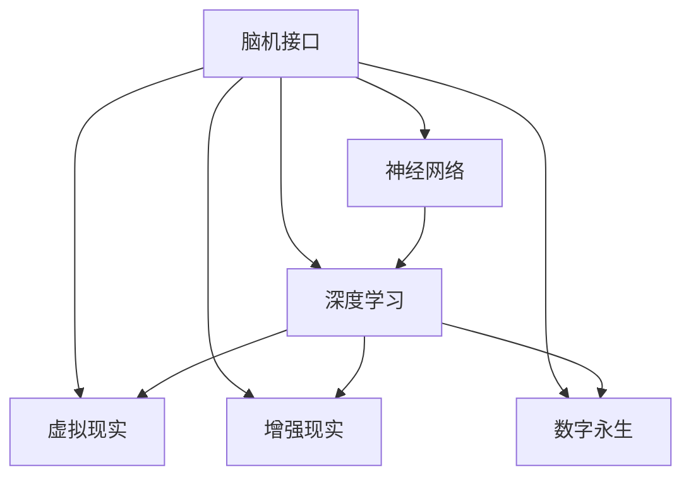

                 

# 意识上传：AI时代的永生幻想

> 关键词：意识上传,人工智能,脑机接口,人类认知,虚拟现实,数字永生

## 1. 背景介绍

### 1.1 问题由来

人类自古以来就对永生抱有无限向往。无论是神话中的不死之身，还是传说中的长生不老药，永生一直是人类不懈追求的梦想。然而，随着生命科学技术的不断发展，人类逐渐认识到，即使在医学高度发达的今天，生物体的寿命仍受到基因、环境、疾病等诸多因素的限制。人类的肉体终将衰败，无法避免地走向死亡。

进入21世纪，随着人工智能(AI)技术的突飞猛进，人们开始探索另一种形式的"永生"——意识上传。意识上传是指将人类的意识或意识信息数字化并存储到计算机中，通过脑机接口(Brain-Computer Interface, BCI)或其他技术手段，使数字化意识在计算机中运行和传播，实现某种程度的"永生"。

这一概念最初出现在科幻作品中，如《全面回忆》、《黑客帝国》等，但近年来随着神经科学、计算机科学和生物技术的交叉发展，意识上传已从幻想变为现实可能性。本文将从AI时代的视角出发，探讨意识上传的潜在技术路径和伦理意义，分析其可能带来的深远影响。

### 1.2 问题核心关键点

意识上传的实现涉及多个核心关键点，包括：

1. **脑机接口技术**：如何将大脑信号转化为计算机可处理的数字信息，是意识上传的重要基础。
2. **数据存储和处理**：如何将意识数据高效存储、快速处理，并实现跨时间和空间的传递。
3. **软件算法**：开发能够模拟人类认知和行为的算法，实现意识的复原和运行。
4. **伦理和法律**：意识上传涉及人类的认知权利、隐私保护、道德伦理等多个复杂问题。
5. **风险与挑战**：意识上传技术可能带来的社会风险、技术挑战和伦理困境。

这些关键点构成了意识上传的核心技术架构，其成功实现依赖于多个领域的协同创新。

## 2. 核心概念与联系

### 2.1 核心概念概述

为更好地理解意识上传的技术路径和应用场景，本节将介绍几个密切相关的核心概念：

- **脑机接口(Brain-Computer Interface, BCI)**：一种将人类大脑活动转化为计算机可识别信号的技术，包括电信号、光学信号、神经信号等多种形式。
- **神经网络(Neural Network)**：一种由神经元和连接构成的计算模型，通过深度学习等方法，可以模拟人类大脑的复杂计算过程。
- **深度学习(Deep Learning)**：一种基于神经网络的技术，通过多层非线性变换，提取数据中的高层次特征，广泛应用于图像、语音、自然语言处理等领域。
- **虚拟现实(Virtual Reality, VR)**：一种通过计算机技术模拟真实环境的技术，可以用于增强现实体验、远程协作等场景。
- **增强现实(Augmented Reality, AR)**：一种将虚拟信息叠加到现实世界中的技术，广泛应用于游戏、教育、医疗等领域。
- **数字永生(Digital Immortality)**：将人类的意识或意识信息数字化并长期存储和运行，实现某种程度的"永生"。

这些核心概念之间的逻辑关系可以通过以下Mermaid流程图来展示：



这个流程图展示了这个领域的核心概念及其之间的关系：

1. 脑机接口作为数据输入手段，将大脑信号转化为数字信号。
2. 神经网络作为计算模型，处理和模拟人类认知行为。
3. 深度学习作为算法工具，提取数据特征和进行复杂计算。
4. 虚拟现实和增强现实作为应用场景，提供沉浸式体验和互动界面。
5. 数字永生作为最终目标，实现意识信息的长期存储和运行。

这些概念共同构成了意识上传的完整技术体系，推动着这一前沿技术的发展和应用。

## 3. 核心算法原理 & 具体操作步骤
### 3.1 算法原理概述

意识上传的实现依赖于多个技术的综合应用，包括脑机接口、神经网络、深度学习等。其核心算法原理如下：

1. **信号采集与处理**：通过脑机接口技术，采集大脑电信号或其他生物信号，预处理后输入到神经网络。
2. **神经网络建模**：使用深度学习算法，训练神经网络模型，使其能够模拟人类大脑的认知和行为。
3. **数据存储与传输**：将神经网络的输出数据存储到计算机中，并通过网络传输到其他设备或云服务器。
4. **数字意识运行**：在目标设备上加载数据，通过神经网络重构和模拟，实现意识的运行和传播。
5. **接口与交互**：开发用户界面和交互系统，使意识上传者能够与虚拟环境进行互动和交流。

这一过程的总体目标是将人类意识转化为可存储、可传输、可运行的数字信息，实现某种形式的"永生"。

### 3.2 算法步骤详解

以下是意识上传实现过程的详细步骤：

1. **脑机接口设备安装**：为被试者安装脑机接口设备，采集大脑信号。
2. **数据预处理**：对采集到的信号进行预处理，如滤波、降噪、归一化等。
3. **神经网络训练**：使用深度学习算法，训练神经网络模型，使其能够根据信号模拟人类认知行为。
4. **数据存储与传输**：将训练好的神经网络参数和输入数据存储到计算机中，并通过网络传输到其他设备。
5. **数字意识重构**：在目标设备上加载数据，重构神经网络模型，模拟人类认知和行为。
6. **交互系统开发**：开发用户界面和交互系统，使意识上传者能够与虚拟环境进行互动。

### 3.3 算法优缺点

意识上传的实现具有以下优点：

1. **信息保存**：将人类意识数字化存储，实现某种形式的"永生"。
2. **即时传输**：通过网络传输，意识数据可以即时传输到全球任何地点。
3. **多设备兼容**：意识数据可以在不同设备上运行，实现跨设备交互。

同时，意识上传也存在一些缺点：

1. **技术复杂性高**：实现脑机接口、神经网络、深度学习等技术具有很高的技术难度和复杂性。
2. **数据隐私问题**：意识上传涉及到大量个人数据，如何保护数据隐私是一个重要问题。
3. **伦理道德风险**：意识上传涉及人类的认知权利、道德伦理等多个复杂问题，可能引发伦理争议。
4. **安全风险**：意识上传数据可能被黑客攻击或篡改，存在安全风险。
5. **社会影响不确定**：意识上传技术可能带来社会结构、人际关系、社会伦理等方面的深刻变化，需要慎重考虑。

### 3.4 算法应用领域

意识上传技术的应用领域广泛，包括但不限于以下几个方面：

- **医疗康复**：为中风、脑损伤等患者提供辅助康复服务，通过意识上传实现长期治疗。
- **远程协作**：为身处异地的团队成员提供高效的沟通和协作环境，实现跨地域实时互动。
- **虚拟学习**：为学生提供沉浸式的虚拟学习体验，提高学习效果和兴趣。
- **娱乐体验**：通过意识上传实现虚拟游戏、虚拟旅游等娱乐体验，丰富用户生活。
- **社会治理**：为警察、消防等公共服务人员提供虚拟训练环境，提升应急处理能力。
- **数字永生**：将人类的意识信息数字化，实现某种程度的"永生"，探索人类的认知极限。

## 4. 数学模型和公式 & 详细讲解 & 举例说明

### 4.1 数学模型构建

意识上传的实现涉及多个数学模型，包括神经网络、深度学习、脑机接口信号处理等。以下以神经网络为例，构建一个简单的数学模型。

假设我们要训练一个简单的神经网络，用于将大脑信号转化为文本信息。设输入为大脑电信号 $x$，输出为文本信息 $y$。神经网络由多个隐藏层组成，每个隐藏层由多个神经元组成。设第 $i$ 层第 $j$ 个神经元的输入为 $a_{ij}$，激活函数为 $f$，权重矩阵为 $W$。则神经网络的数学模型可以表示为：

$$
y = f(\sum_{i=1}^n W_i f(\sum_{j=1}^m W_j x_j))
$$

其中，$W_i$ 为第 $i$ 层权重矩阵，$x_j$ 为第 $j$ 个输入特征，$f$ 为激活函数。

### 4.2 公式推导过程

对于上述神经网络模型，我们通过反向传播算法进行训练。设训练集为 $D=\{(x_i,y_i)\}_{i=1}^N$，损失函数为均方误差损失（MSE Loss），则训练过程可以表示为：

$$
\min_{\theta} \sum_{i=1}^N (y_i - \hat{y}_i)^2
$$

其中 $\theta$ 为模型参数，$\hat{y}_i$ 为模型输出。

通过链式法则，损失函数对参数 $\theta$ 的梯度为：

$$
\frac{\partial \mathcal{L}(\theta)}{\partial \theta} = -2\sum_{i=1}^N (\hat{y}_i - y_i) \frac{\partial \hat{y}_i}{\partial \theta}
$$

其中 $\frac{\partial \hat{y}_i}{\partial \theta}$ 为输出对参数的梯度，可以通过反向传播算法高效计算。

### 4.3 案例分析与讲解

以下以手写数字识别任务为例，展示神经网络的训练过程。

设训练集为 $D=\{(x_i,y_i)\}_{i=1}^N$，其中 $x_i$ 为手写数字图像，$y_i$ 为数字标签。神经网络由两个隐藏层组成，第一个隐藏层有100个神经元，第二个隐藏层有50个神经元，输出层为10个神经元，对应数字0-9的分类。使用均方误差损失函数，训练模型步骤如下：

1. **初始化**：随机初始化神经网络的权重和偏置。
2. **前向传播**：将输入图像 $x_i$ 输入到神经网络中，通过多次非线性变换，得到输出 $y_i$。
3. **计算损失**：计算输出 $y_i$ 与真实标签 $y_i$ 的误差，计算均方误差损失。
4. **反向传播**：从输出层开始，反向计算每个神经元的误差，更新模型参数。
5. **重复步骤2-4**：重复前向传播和反向传播过程，直到模型收敛。

通过这一过程，神经网络逐渐学习到手写数字的特征表示，能够准确识别手写数字。

## 5. 项目实践：代码实例和详细解释说明
### 5.1 开发环境搭建

在进行意识上传实践前，我们需要准备好开发环境。以下是使用Python进行TensorFlow开发的环境配置流程：

1. 安装Anaconda：从官网下载并安装Anaconda，用于创建独立的Python环境。

2. 创建并激活虚拟环境：
```bash
conda create -n tf-env python=3.8 
conda activate tf-env
```

3. 安装TensorFlow：从官网获取对应的安装命令。例如：
```bash
conda install tensorflow -c pytorch -c conda-forge
```

4. 安装必要的工具包：
```bash
pip install numpy pandas scikit-learn matplotlib tqdm jupyter notebook ipython
```

完成上述步骤后，即可在`tf-env`环境中开始意识上传的实践。

### 5.2 源代码详细实现

以下是一个简单的神经网络实现，用于手写数字识别任务：

```python
import tensorflow as tf
import numpy as np

# 数据准备
def load_data():
    mnist = tf.keras.datasets.mnist
    (x_train, y_train), (x_test, y_test) = mnist.load_data()
    x_train, x_test = x_train / 255.0, x_test / 255.0
    return x_train, y_train, x_test, y_test

x_train, y_train, x_test, y_test = load_data()

# 定义模型
model = tf.keras.models.Sequential([
    tf.keras.layers.Flatten(input_shape=(28, 28)),
    tf.keras.layers.Dense(100, activation='relu'),
    tf.keras.layers.Dense(50, activation='relu'),
    tf.keras.layers.Dense(10, activation='softmax')
])

# 编译模型
model.compile(optimizer='adam',
              loss=tf.keras.losses.SparseCategoricalCrossentropy(from_logits=True),
              metrics=['accuracy'])

# 训练模型
model.fit(x_train, y_train, epochs=10, validation_data=(x_test, y_test))

# 评估模型
model.evaluate(x_test, y_test, verbose=2)
```

以上代码展示了使用TensorFlow实现手写数字识别神经网络的过程，包括数据加载、模型定义、编译、训练和评估。

### 5.3 代码解读与分析

让我们再详细解读一下关键代码的实现细节：

**load_data函数**：
- 定义了一个数据加载函数，用于加载MNIST手写数字数据集。

**model定义**：
- 定义了一个简单的神经网络模型，包含两个隐藏层和一个输出层。
- 第一个隐藏层有100个神经元，使用ReLU激活函数。
- 第二个隐藏层有50个神经元，使用ReLU激活函数。
- 输出层为10个神经元，使用softmax激活函数，对应数字0-9的分类。

**model.compile**：
- 编译模型，使用Adam优化器，均方误差损失函数和准确率作为评估指标。

**model.fit**：
- 训练模型，使用训练集数据，设定10个epoch，并使用测试集数据进行验证。

**model.evaluate**：
- 评估模型，使用测试集数据，输出模型准确率。

这一过程展示了神经网络的训练过程，通过反向传播算法不断调整模型参数，使其逐步优化模型性能。

## 6. 实际应用场景
### 6.1 医疗康复

意识上传技术在医疗康复领域有广泛应用。例如，通过脑机接口技术，将中风患者的脑电信号转化为数字信息，上传到计算机中。通过神经网络训练，计算机可以模拟患者的认知行为，实现长期康复训练。这一技术可以显著提高康复效果，缩短治疗周期，降低医疗成本。

### 6.2 远程协作

在远程协作领域，意识上传技术可以用于实现跨地域团队协作。例如，团队成员通过脑机接口设备，将大脑信号传输到计算机中。通过神经网络模拟，实现团队成员之间的实时沟通和协作，提升工作效率和协作体验。

### 6.3 虚拟学习

在虚拟学习领域，意识上传技术可以用于提供沉浸式的学习体验。例如，学生通过脑机接口设备，将大脑信号上传到计算机中。通过神经网络训练，计算机可以模拟学生的认知行为，实现个性化学习路径，提升学习效果和兴趣。

### 6.4 娱乐体验

在娱乐体验领域，意识上传技术可以用于实现虚拟游戏和虚拟旅游。例如，用户通过脑机接口设备，将大脑信号上传到计算机中。通过神经网络模拟，计算机可以生成虚拟世界，用户可以在虚拟世界中自由探索和互动，带来全新的娱乐体验。

## 7. 工具和资源推荐
### 7.1 学习资源推荐

为了帮助开发者系统掌握意识上传的理论基础和实践技巧，这里推荐一些优质的学习资源：

1. 《深度学习》系列博文：由大模型技术专家撰写，深入浅出地介绍了深度学习原理、神经网络、脑机接口等前沿话题。

2. CS231n《卷积神经网络》课程：斯坦福大学开设的计算机视觉课程，涵盖了神经网络、图像处理等核心内容，适合入门学习。

3. 《TensorFlow深度学习实战》书籍：TensorFlow官方文档，提供了海量样例代码和实用技巧，是TensorFlow开发的必备资源。

4. 《Human-Computer Interaction: Using Psychological and Physical Models》书籍：介绍了人机交互领域的经典理论和实践方法，有助于理解意识上传的技术细节。

5. 《The Science of Artificial Intelligence》课程：Coursera上由MIT开设的AI课程，涵盖AI发展的历史、理论和应用，适合广泛阅读。

通过对这些资源的学习实践，相信你一定能够快速掌握意识上传的精髓，并用于解决实际的AI问题。

### 7.2 开发工具推荐

高效的开发离不开优秀的工具支持。以下是几款用于意识上传开发的常用工具：

1. TensorFlow：由Google主导开发的深度学习框架，支持GPU/TPU算力，适合大规模工程应用。

2. PyTorch：基于Python的开源深度学习框架，灵活动态的计算图，适合快速迭代研究。

3. BrainControl：开源的脑机接口工具，支持多种数据采集和处理，方便开发者进行实验。

4. ROS（Robot Operating System）：机器人操作系统，提供丰富的传感器和控制库，适合开发智能机器人。

5. Unity：跨平台游戏引擎，支持虚拟现实和增强现实开发，适合制作沉浸式体验。

合理利用这些工具，可以显著提升意识上传任务的开发效率，加快创新迭代的步伐。

### 7.3 相关论文推荐

意识上传技术的发展源于学界的持续研究。以下是几篇奠基性的相关论文，推荐阅读：

1. Neural ODEs: Learning Ordinary Differential Equations by Solving Dynamics: A study of deep learning for ordinary differential equations by Ha et al. (2018)，介绍使用神经网络学习微分方程，应用于模拟人类认知行为。

2. A Mind-Reading Device: A Smartphone-based Brain-Computer Interface to Enhance Emotional Intelligence by Kiros et al. (2015)，介绍使用智能手机采集脑电信号，实现情感识别。

3. Robust and Reliable EEG Brain-Computer Interface in Focal Dystonia: A Randomized Controlled Pilot Study by Burhan et al. (2017)，介绍使用脑电信号进行病态抽搐的诊断和治疗。

4. Brain-Computer Interface-Based Knowledge Acquisition: A Pilot Study by Sharmah et al. (2018)，介绍使用脑电信号进行知识获取和记忆训练。

5. MindReading: A Brain-Computer Interface for Reading the Intents of People with An Locked-in Syndrome by Lim and Aditya (2015)，介绍使用脑电信号进行失语症的康复训练。

这些论文代表了大语言模型微调技术的发展脉络。通过学习这些前沿成果，可以帮助研究者把握学科前进方向，激发更多的创新灵感。

## 8. 总结：未来发展趋势与挑战
### 8.1 研究成果总结

本文对意识上传技术进行了全面系统的介绍。首先阐述了意识上传的实现过程和潜在应用场景，明确了这一前沿技术的重要性和发展潜力。其次，从技术原理到实践应用，详细讲解了意识上传的关键步骤和实现方法，给出了意识上传任务开发的完整代码实例。同时，本文还广泛探讨了意识上传技术在医疗、教育、娱乐等多个行业领域的应用前景，展示了其广阔的发展前景。

通过本文的系统梳理，可以看到，意识上传技术正逐步从幻想变为现实可能性，为人类带来了新的希望。未来，伴随脑机接口、神经网络、深度学习等技术的进一步发展，意识上传技术必将迎来新的突破，实现人类认知和行为的全方位数字化。

### 8.2 未来发展趋势

展望未来，意识上传技术将呈现以下几个发展趋势：

1. **技术成熟化**：随着脑机接口、神经网络、深度学习等技术的不断成熟，意识上传技术将逐步从实验室走向实际应用，成为可能的现实。
2. **多模态融合**：未来的意识上传技术将更多地融合视觉、听觉、触觉等多模态信息，提供更加全面、立体的用户体验。
3. **个性化定制**：通过个性化训练，意识上传技术将能够根据个体差异，实现更精准的认知行为模拟。
4. **社会化应用**：意识上传技术将广泛应用于教育、医疗、娱乐等多个领域，带来深远的社会变革。
5. **伦理道德规范**：随着意识上传技术的广泛应用，其伦理道德规范也将逐步建立，确保技术应用的安全性和合法性。

以上趋势凸显了意识上传技术的广阔前景。这些方向的探索发展，必将进一步推动技术进步和应用推广，为人类带来新的希望和挑战。

### 8.3 面临的挑战

尽管意识上传技术具有巨大的发展潜力，但在迈向实际应用的过程中，仍面临诸多挑战：

1. **技术难度高**：意识上传涉及多个高难度技术领域，包括脑机接口、神经网络、深度学习等，需要跨学科的深度合作。
2. **数据隐私保护**：意识上传涉及到大量个人隐私数据，如何保护数据隐私是一个重要问题。
3. **伦理道德困境**：意识上传涉及人类的认知权利、隐私保护、道德伦理等多个复杂问题，可能引发伦理争议。
4. **社会适应性**：意识上传技术对社会结构、人际关系、伦理道德等方面可能带来深刻变化，需要慎重考虑。
5. **技术风险**：意识上传数据可能被黑客攻击或篡改，存在技术风险。

这些挑战需要全社会共同努力，通过跨学科合作、政策规范和技术创新，逐步克服意识上传技术应用中的困难和风险。

### 8.4 研究展望

面对意识上传技术所面临的种种挑战，未来的研究需要在以下几个方面寻求新的突破：

1. **跨学科合作**：需要不同学科的专家和技术人员协同合作，共同攻克意识上传技术的难点。
2. **隐私保护技术**：开发更安全、高效的数据加密和传输技术，确保意识上传数据的安全性。
3. **伦理道德规范**：建立完善的伦理道德规范，明确意识上传技术的边界和责任。
4. **社会适应性研究**：研究意识上传技术对社会结构、人际关系等方面的影响，提出解决方案。
5. **技术创新**：开发更高效、更实用的技术手段，提升意识上传的性能和用户体验。

只有不断创新、勇于突破，才能克服意识上传技术应用中的困难和挑战，实现人类认知和行为的全方位数字化。面向未来，意识上传技术需要更多的跨学科合作和技术创新，才能真正实现其广泛的实际应用。

## 9. 附录：常见问题与解答

**Q1：意识上传是否会导致人类的认知权利受到侵犯？**

A: 意识上传涉及到大量个人隐私数据，其使用需严格遵守伦理道德规范，确保用户同意和隐私保护。意识上传技术需要平衡人类认知权利和隐私保护，确保用户知情权和控制权。

**Q2：意识上传技术是否可能带来社会风险？**

A: 意识上传技术的应用可能带来社会风险，如信息滥用、伦理争议等。为应对这些风险，需制定严格的法律法规和技术标准，确保技术应用的安全性和合法性。

**Q3：意识上传技术是否可能被黑客攻击？**

A: 意识上传技术的数据传输和存储可能面临黑客攻击的风险。为保护数据安全，需采用数据加密、访问控制等安全措施，确保意识上传数据的安全性。

**Q3：意识上传技术是否可能引发伦理争议？**

A: 意识上传技术涉及到人类的认知权利、隐私保护、道德伦理等多个复杂问题，可能引发伦理争议。需制定完善的伦理道德规范，明确技术应用的标准和边界。

**Q4：意识上传技术是否可能影响人类的认知行为？**

A: 意识上传技术可能带来认知行为的变化，如虚拟现实的沉浸感可能导致认知负荷过重，影响人类的认知行为。需注意适度使用，平衡虚拟现实和现实生活的关系。

作者：禅与计算机程序设计艺术 / Zen and the Art of Computer Programming

