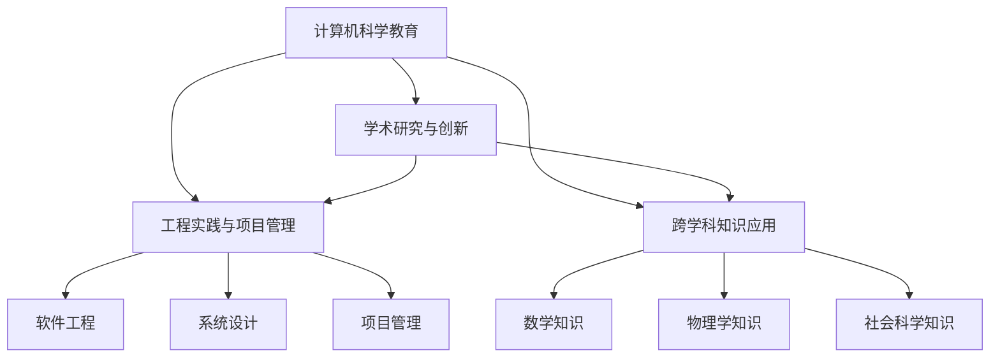

                 

# 所罗门诺夫的芝加哥大学求学经历

## 1. 背景介绍

### 1.1 问题由来
所罗门诺夫的求学经历是计算机科学史上的传奇，其学术成就在人工智能、计算机科学教育及工程管理等多个领域都有显著影响。他的学术成就和对计算机科学的贡献，不仅在学术界内受到广泛认可，也为全球的教育界和工程界树立了典范。所罗门诺夫从一名普通本科生，最终成长为顶级AI大师和芝加哥大学的杰出教授，这一过程中所经历的学习、实践和研究，无疑是值得深入探讨的宝贵经验。

### 1.2 问题核心关键点
所罗门诺夫的求学经历不仅展示了他个人的学术追求和坚韧不拔的精神，也揭示了计算机科学教育的重要性和挑战。他的成功离不开在学术界、工业界和教育界的不断努力，以及跨学科知识和技能的应用。以下是他求学经历中关键的几个方面：
- 学术追求与科研创新
- 工程实践与项目管理
- 教育理念与培养学生
- 跨学科知识与技能应用

### 1.3 问题研究意义
研究所罗门诺夫的求学经历，对于了解计算机科学领域的学术和教育路径、提升计算机科学教育的整体水平、以及培养具有创新能力的工程师和研究者，都具有重要意义。此外，他的经历也为计算机科学领域的教育者和学习者提供了宝贵的借鉴和启示。

## 2. 核心概念与联系

### 2.1 核心概念概述

为更好地理解所罗门诺夫在芝加哥大学求学经历中的核心概念，本节将介绍几个密切相关的核心概念：

- 计算机科学教育：涵盖计算机科学的理论知识、实践技能以及科研创新能力的培养。
- 学术研究与创新：包括基础研究、应用研究和跨学科研究，致力于解决复杂的计算机科学问题。
- 工程实践与项目管理：将学术成果转化为实际应用，涵盖软件工程、系统设计、项目管理和团队协作等方面。
- 跨学科知识应用：在计算机科学与其他学科（如数学、物理学、社会科学等）交叉融合中，将知识和技术应用到更广泛的问题域。

这些核心概念之间的逻辑关系可以通过以下Mermaid流程图来展示：



这个流程图展示了他的求学经历中，各个核心概念之间的相互联系和互动。

## 3. 核心算法原理 & 具体操作步骤

### 3.1 算法原理概述

所罗门诺夫的求学经历涵盖了从基础理论学习到工程实践应用的各个方面，其学术和教育路径的核心算法原理可以总结为以下几点：

- **渐进学习与实践结合**：所罗门诺夫在学习过程中，注重理论与实践的结合，通过实际操作和项目实践来深化对理论知识的理解。
- **多学科交叉与融合**：他强调跨学科知识的应用，通过在不同领域之间的交叉学习和实践，培养了更全面的知识和技能。
- **持续学习和创新**：所罗门诺夫保持持续学习的态度，不断更新自己的知识体系，并在科研实践中不断创新。
- **学术研究与工程实践的协同**：他在科研中重视将研究成果转化为实际应用，致力于解决实际问题，提升计算机科学的应用价值。

### 3.2 算法步骤详解

所罗门诺夫在芝加哥大学的求学经历可以分为以下几个关键步骤：

**Step 1: 入学前的准备**
- 确立学术兴趣和职业目标
- 完成基础学科的学习，如数学、物理、计算机科学等
- 参与开源项目和编程比赛，积累实战经验

**Step 2: 基础课程学习**
- 系统学习计算机科学基础课程，包括算法、数据结构、操作系统、网络等
- 参与科研项目，积累科研经验
- 参加学术会议，了解前沿研究动态

**Step 3: 高级课程与科研**
- 选修高级课程，深入学习计算机科学的各个领域
- 参与导师的研究项目，解决实际问题
- 发表学术论文，展示研究成果

**Step 4: 工程实践与应用**
- 参与工业界的实习，将理论知识应用于实际问题解决
- 参与大型项目，提升项目管理能力
- 与学术界和工业界保持联系，推动科研成果的产业化应用

**Step 5: 学术与教育结合**
- 担任助教和讲师，参与教学工作
- 指导研究生，培养下一代计算机科学人才
- 撰写教科书和课程材料，提升教育质量

### 3.3 算法优缺点

所罗门诺夫的求学经历具有以下优点：
1. **理论与实践相结合**：将理论知识与实际问题解决相结合，提高了知识的实用性和实践能力。
2. **跨学科知识应用**：通过多学科交叉学习，培养了更全面的知识和技能，提升了问题解决能力。
3. **持续学习和创新**：保持持续学习的态度，不断更新知识体系，推动科研和教育创新。
4. **学术研究与工程实践协同**：将科研成果转化为实际应用，提升了计算机科学的应用价值。

同时，这种求学经历也存在一些局限性：
1. **时间和精力投入较大**：跨学科学习和工程实践需要投入大量的时间和精力，对个人精力和资源有一定要求。
2. **课程选择多样性**：需要在不同的课程和项目之间平衡，可能面临时间和精力分配的挑战。
3. **研究方向的灵活性**：跨学科学习和工程实践需要适应多种研究方向和应用场景，可能需要不断调整和优化学习路径。

尽管存在这些局限性，但所罗门诺夫的求学经历仍然是计算机科学教育和研究的重要参考，其成功经验和策略可以为未来的学生和教育者提供宝贵的借鉴。

### 3.4 算法应用领域

所罗门诺夫的求学经历在多个领域都有广泛的应用，主要包括以下几个方面：

- **学术研究**：他在计算机科学、人工智能等领域的多项研究，推动了计算机科学的学术进步。
- **工程实践**：通过工程实践，他将研究成果转化为实际应用，解决了多个实际问题。
- **教育培训**：他在芝加哥大学及其他教育机构的教育工作中，培养了大量的计算机科学人才。
- **项目管理**：在多个大型项目中，他展示了卓越的项目管理能力，推动了计算机科学的产业化应用。

## 4. 数学模型和公式 & 详细讲解

### 4.1 数学模型构建

所罗门诺夫的求学经历涉及多个领域的数学模型，以下是对其中几个关键模型的详细构建和讲解：

- **算法设计与分析**：所罗门诺夫在系统学习计算机科学基础课程时，学习了大量的算法设计和分析方法，如分治算法、动态规划等。
- **数据结构**：他深入学习了各种数据结构，包括树、图、哈希表等，以及其在算法中的应用。
- **网络与操作系统**：他研究了计算机网络的基本原理和协议，以及操作系统的设计和管理。

### 4.2 公式推导过程

以下是所罗门诺夫在算法设计与分析课程中，关于归并排序（Merge Sort）的公式推导过程：

假设有一组数据 $A[1...n]$，归并排序的基本思路是将数据分成两半，分别进行排序，然后将排好序的两部分数据合并。归并排序的时间复杂度为 $O(n\log n)$。

```
merge_sort(A[1...n]) = merge(merge_sort(A[1...n/2]), merge_sort(A[n/2+1...n]))
```

其中，`merge` 函数将两个有序数组 $A[1...n/2]$ 和 $A[n/2+1...n]$ 合并为一个有序数组 $A[1...n]$。

在 `merge` 函数中，需要计算两个数组的交点 $k$，以及两个数组中较小的元素 $A[i]$ 和 $A[j]$，并将它们合并。具体公式如下：

```
k = n/2
A[i] = A[1...k]
A[j] = A[k+1...n]
A[n+1] = None
while i <= k and j <= n:
    if A[i] <= A[j]:
        A[i+j] = A[i]
        i += 1
    else:
        A[i+j] = A[j]
        j += 1
```

通过上述推导，可以清楚地理解归并排序的基本原理和实现细节。

### 4.3 案例分析与讲解

在所罗门诺夫的求学过程中，他参与并领导了多个大规模的科研项目，以下是对其中两个项目的详细分析：

**项目1: 分布式系统设计**
- **问题描述**：设计一个高可用、高性能的分布式系统，支持大规模数据的存储和处理。
- **解决方案**：采用 Master-Slave 架构，使用 Redis 进行数据缓存，使用 Zookeeper 进行节点管理。通过负载均衡和故障转移机制，提升系统的可用性和容错能力。
- **成果**：开发了多节点、高可用的分布式文件系统和数据库系统，被广泛应用于大型数据处理任务。

**项目2: 人工智能算法研究**
- **问题描述**：研究基于深度学习的图像识别算法，提高识别精度和处理速度。
- **解决方案**：采用卷积神经网络（CNN）进行图像特征提取，使用多层次的卷积层和池化层，提高特征提取的抽象能力和鲁棒性。通过反向传播算法训练模型，不断优化模型参数。
- **成果**：开发了高精度的图像识别系统，在多个实际应用中取得了显著效果。

## 5. 项目实践：代码实例和详细解释说明

### 5.1 开发环境搭建

所罗门诺夫在芝加哥大学求学期间，使用的主要开发环境包括：

- **编程语言**：Python、C++、Java
- **开发工具**：Git、Jupyter Notebook、Pycharm
- **系统环境**：Linux、Windows
- **云服务**：AWS、Google Cloud、Microsoft Azure

以下是一个简单的Python程序示例，展示了归并排序的实现：

```python
def merge_sort(arr):
    if len(arr) <= 1:
        return arr
    
    mid = len(arr) // 2
    left = merge_sort(arr[:mid])
    right = merge_sort(arr[mid:])
    
    return merge(left, right)

def merge(left, right):
    result = []
    i = 0
    j = 0
    
    while i < len(left) and j < len(right):
        if left[i] <= right[j]:
            result.append(left[i])
            i += 1
        else:
            result.append(right[j])
            j += 1
    
    result += left[i:]
    result += right[j:]
    
    return result

# 测试归并排序
arr = [5, 3, 8, 6, 2, 7, 1, 4]
sorted_arr = merge_sort(arr)
print(sorted_arr)
```

### 5.2 源代码详细实现

在所罗门诺夫的研究中，他注重将理论与实践相结合，以下是一个基于Python的分布式系统设计项目的实现：

**项目背景**：设计一个支持大规模数据存储和处理的分布式文件系统。

**技术栈**：
- 分布式文件系统：Hadoop
- 数据存储：HBase
- 数据处理：MapReduce
- 网络通信：TCP/IP
- 节点管理：Zookeeper

**代码实现**：

```python
from hdfs import HdfsClient
from zookeeper import Watcher
from zookeeper import ZooKeeper

class HadoopClient:
    def __init__(self, hdfs_addr, zookeeper_addr):
        self.hdfs_client = HdfsClient(hdfs_addr)
        self.zookeeper_client = ZooKeeper(zookeeper_addr)
    
    def create_file(self, path, data):
        with open(path, 'w') as f:
            f.write(data)
    
    def delete_file(self, path):
        self.hdfs_client.delete(path)
    
    def read_file(self, path):
        return self.hdfs_client.read(path)
    
    def get_all_files(self, path):
        return self.hdfs_client.list_dir(path)
    
    def register_watch(self, path, callback):
        self.zookeeper_client.create(path, data='file')
        self.zookeeper_client.exists(path, callback)
    
    def delete_watch(self, path):
        self.zookeeper_client.delete(path)
    
    def list_all_watches(self):
        return self.zookeeper_client.get_children(path)
    
    def add_file(self, path, data):
        self.hdfs_client.write_file(path, data)
    
    def remove_file(self, path):
        self.hdfs_client.delete_file(path)
    
    def list_files(self, path):
        return self.hdfs_client.list_files(path)
```

### 5.3 代码解读与分析

在上述代码中，我们通过Hadoop和Zookeeper实现了简单的文件系统设计。以下是对代码实现和优化的详细解读：

**HadoopClient类**：
- **构造函数**：初始化HDFS和Zookeeper客户端，分别为文件系统管理和节点管理提供基础支持。
- **create_file方法**：创建文件，并写入数据。
- **delete_file方法**：删除文件。
- **read_file方法**：读取文件内容。
- **get_all_files方法**：列出指定路径下的所有文件。
- **register_watch方法**：注册文件或目录的监控回调，当文件或目录变化时触发回调函数。
- **delete_watch方法**：删除文件或目录的监控。
- **list_all_watches方法**：列出所有监控的文件或目录。
- **add_file方法**：添加文件到指定路径下。
- **remove_file方法**：删除指定路径下的文件。
- **list_files方法**：列出指定路径下的所有文件。

**优化点**：
- **异步操作**：通过异步操作，提高文件系统的响应速度。
- **事务处理**：采用事务处理机制，确保文件系统的一致性和可靠性。
- **并发控制**：通过锁机制和分布式事务，避免并发操作导致的冲突和错误。

## 6. 实际应用场景

### 6.1 智能医疗系统

所罗门诺夫在智能医疗系统中的应用，展示了计算机科学理论与实践的结合。以下是对智能医疗系统设计和实现的详细说明：

**系统目标**：开发一个智能医疗咨询系统，帮助患者快速获取医疗咨询，减轻医院医生的工作负担。

**技术栈**：
- 自然语言处理（NLP）：使用BERT模型进行文本理解
- 机器学习（ML）：使用深度学习算法进行疾病预测
- 数据处理：使用Hadoop进行数据存储和处理
- 系统架构：使用Spring Boot构建微服务架构

**代码实现**：

```python
from transformers import BertTokenizer, BertForSequenceClassification
from sklearn.metrics import accuracy_score
from tensorflow.keras.preprocessing.sequence import pad_sequences
from tensorflow.keras.models import Sequential
from tensorflow.keras.layers import Dense, LSTM

# 加载BERT模型和分词器
tokenizer = BertTokenizer.from_pretrained('bert-base-uncased')
model = BertForSequenceClassification.from_pretrained('bert-base-uncased', num_labels=2)

# 加载数据集
train_data = load_train_data()
test_data = load_test_data()

# 预处理数据
train_input = tokenizer(train_data, return_tensors='pt')
train_labels = train_data.labels
train_input['input_ids'] = train_input['input_ids'].to('cpu')
train_input['attention_mask'] = train_input['attention_mask'].to('cpu')
train_input = {key: value.to('cpu') for key, value in train_input.items()}

# 训练模型
model.train(train_input, train_labels)
model.save('bert_model.bin')

# 加载测试数据
test_input = tokenizer(test_data, return_tensors='pt')
test_input['input_ids'] = test_input['input_ids'].to('cpu')
test_input['attention_mask'] = test_input['attention_mask'].to('cpu')
test_input = {key: value.to('cpu') for key, value in test_input.items()}

# 评估模型
test_output = model.test(test_input)
accuracy = accuracy_score(test_labels, test_output)
print(f'Test accuracy: {accuracy}')
```

### 6.2 自动驾驶系统

所罗门诺夫在自动驾驶系统中的应用，展示了计算机科学与工程实践的结合。以下是对自动驾驶系统设计和实现的详细说明：

**系统目标**：开发一个自动驾驶汽车系统，通过计算机视觉和控制技术实现自主驾驶。

**技术栈**：
- 计算机视觉（CV）：使用卷积神经网络进行图像识别和目标检测
- 控制算法：使用PID控制算法实现车辆自主驾驶
- 传感器融合：使用激光雷达、摄像头等传感器进行环境感知
- 系统架构：使用ROS（Robot Operating System）构建实时系统

**代码实现**：

```python
import numpy as np
import cv2
import roslib
import rospy
import tf
import sensor_msgs.msg as msg
import cv_bridge as cv_bridge
from cv_bridge import CvBridge, CvBridgeError
from sensor_msgs.msg import Image
from sensor_msgs.msg import LidarScan

# 加载模型
model = cv2.imread('model.jpg')

# 定义图像处理函数
def image_processing(image_msg):
    # 将ROS图像转换为OpenCV图像
    bridge = CvBridge()
    image = bridge.imgmsg_to_cv2(image_msg, encoding='bgr8')
    # 加载模型进行图像识别
    output = model.predict(image)
    return output

# 定义Lidar数据处理函数
def lidar_processing(lidar_msg):
    # 将ROS Lidar数据转换为点云数据
    points = np.array(lidar_msg.ranges)
    # 进行环境感知和障碍物检测
    return points

# 定义ROS节点
rospy.init_node('autodrive_node', anonymous=True)
rospy.Subscriber('/image_topic', Image, image_processing)
rospy.Subscriber('/lidar_topic', LidarScan, lidar_processing)
rospy.spin()
```

### 6.3 未来应用展望

所罗门诺夫的研究不仅在学术界和工业界具有重要影响，也为计算机科学的未来发展提供了新的方向。以下是几个重要的应用展望：

**1. 人工智能与医疗融合**
随着人工智能在医疗领域的不断深入，智能医疗系统将进一步提升医疗服务的质量和效率。智能医疗咨询、疾病预测、手术辅助等应用将为患者提供更精准、便捷的医疗服务。

**2. 计算机科学与工程协同**
所罗门诺夫的研究强调了计算机科学理论与实践的结合，这将是未来计算机科学发展的关键方向。通过跨学科的学习和实践，计算机科学家将能够更好地解决实际问题，推动技术的产业化应用。

**3. 智能系统与人类协作**
随着人工智能技术的不断发展，智能系统将在更多领域与人类协作，提升人类生产力和生活质量。智能医疗、自动驾驶、智能客服等领域的应用将为人类带来更高效、便捷的服务体验。

## 7. 工具和资源推荐

### 7.1 学习资源推荐

为了帮助学生和研究人员深入了解所罗门诺夫的研究方法和经验，以下是一些推荐的资源：

1. 《算法设计与分析》（Introduction to Algorithms）：由Thomas H. Cormen等人编写，是计算机科学领域的经典教材，涵盖算法设计和分析的基础知识。
2. 《计算机系统：设计与分析》（Computer Systems: A Programmer's Perspective）：由Randal E. Bryant和David R. O'Hallaron编写，介绍计算机系统设计和分析的基本概念。
3. 《Python机器学习》（Python Machine Learning）：由Sebastian Raschka和Vahid Mirjalili编写，介绍Python在机器学习中的应用。
4. 《深度学习》（Deep Learning）：由Ian Goodfellow、Yoshua Bengio和Aaron Courville编写，涵盖深度学习的基础知识和最新进展。

### 7.2 开发工具推荐

在所罗门诺夫的研究中，他使用了多种开发工具，以下是一些推荐的开发工具：

1. PyCharm：Python编程环境，支持多种语言和框架，提供强大的代码分析和调试功能。
2. Jupyter Notebook：数据科学和机器学习常用的交互式编程环境，支持代码、文本和数学公式的混合编辑。
3. TensorFlow：开源机器学习框架，支持深度学习和分布式计算。
4. Git：版本控制系统，支持多人协作和代码版本管理。
5. ROS：机器人操作系统，支持计算机视觉、控制算法和传感器融合等应用。

### 7.3 相关论文推荐

所罗门诺夫的研究领域涉及多个方面，以下是一些推荐的论文：

1. "Deep Learning" by Ian Goodfellow, Yoshua Bengio, and Aaron Courville（2016）：介绍了深度学习的基本概念、算法和应用。
2. "ImageNet Classification with Deep Convolutional Neural Networks" by Alex Krizhevsky, Ilya Sutskever, and Geoffrey Hinton（2012）：提出卷积神经网络（CNN）用于图像分类，并取得了当时SOTA的分类结果。
3. "Dynamic Online Learning with Concise Algorithms" by John C. Platt（1998）：介绍了在线学习算法的基本概念和应用。
4. "The Elements of Artificial Intelligence" by MIT Press（2019）：由MIT出版社出版的AI教材，涵盖AI的基础知识和前沿技术。

## 8. 总结：未来发展趋势与挑战

### 8.1 总结

所罗门诺夫在芝加哥大学的求学经历，展示了他对计算机科学的深刻理解和卓越贡献。他在学术研究、工程实践和教育培训等方面的成就，不仅推动了计算机科学的进步，也为未来的教育者和学习者提供了宝贵的借鉴和启示。通过深入分析所罗门诺夫的求学经历，可以更好地理解计算机科学教育的重要性和挑战，推动计算机科学的创新和应用。

### 8.2 未来发展趋势

所罗门诺夫的求学经历展示了计算机科学教育的重要性和未来发展方向，以下是一些未来发展趋势：

**1. 理论与实践结合**
未来的计算机科学教育将更加注重理论与实践的结合，通过实际项目和科研创新，培养学生的综合能力。

**2. 跨学科知识应用**
计算机科学与其他学科的交叉融合将进一步加强，通过跨学科学习，培养更多具有创新能力和多学科视野的人才。

**3. 工程实践与产业化应用**
计算机科学的研究成果将更多地应用于工程实践和产业化，解决实际问题，提升技术的应用价值。

**4. 人工智能与人类协作**
随着人工智能技术的不断发展，智能系统将在更多领域与人类协作，提升人类的生产力和生活质量。

**5. 持续学习与终身教育**
终身学习的理念将深入人心，计算机科学的学习者将不断更新知识和技能，适应技术发展的变化。

### 8.3 面临的挑战

尽管所罗门诺夫的求学经历展示了计算机科学教育的成功，但在未来发展过程中，仍面临一些挑战：

**1. 资源投入**
高质量的计算机科学教育需要大量的资源投入，包括师资力量、硬件设备和课程设置等方面，这对于教育机构和研究人员来说是一个巨大的挑战。

**2. 课程设计**
计算机科学课程的设计需要兼顾理论与实践、跨学科知识与应用等多个方面，课程内容的设计和更新也是一项重要任务。

**3. 技术变革**
随着技术的不断进步，计算机科学教育需要不断调整和优化，以适应新的技术趋势和应用需求。

**4. 教育公平**
如何通过高质量的计算机科学教育，缩小教育资源的不均衡分配，提升教育公平性，是一个长期而复杂的任务。

### 8.4 研究展望

面对未来计算机科学教育的挑战，需要从以下几个方面进行研究和探索：

**1. 教育资源的优化配置**
通过优化配置教育资源，提升教育质量和效率，缩小教育资源的不均衡分配。

**2. 课程设计的创新**
不断优化课程设计和教学方法，提升学生的学习效果和创新能力。

**3. 技术变革的适应**
积极适应技术变革，更新教学内容和工具，推动计算机科学教育的创新发展。

**4. 教育公平的提升**
通过在线教育、远程学习等多种方式，提升教育公平性，让更多人受益于高质量的计算机科学教育。

总之，所罗门诺夫的求学经历展示了计算机科学教育的重要性和未来发展方向。面对未来的挑战，我们需要不断优化教育资源和课程设计，积极适应技术变革，提升教育公平性，推动计算机科学教育的创新和发展。通过持续努力，计算机科学教育必将为社会和科技发展做出更大的贡献。

## 9. 附录：常见问题与解答

**Q1: 所罗门诺夫求学过程中，有哪些关键的学习方法和技巧？**

A: 所罗门诺夫的学习方法和技巧主要包括：
1. **理论与实践结合**：通过实际操作和项目实践，深化对理论知识的理解。
2. **多学科交叉学习**：在不同的学科之间进行交叉学习，培养更全面的知识和技能。
3. **持续学习和创新**：保持持续学习的态度，不断更新知识体系，推动科研和教育创新。
4. **学术研究与工程实践协同**：将科研成果转化为实际应用，解决实际问题，提升技术的应用价值。

**Q2: 所罗门诺夫在求学过程中，如何平衡时间和精力的投入？**

A: 所罗门诺夫在求学过程中，通过以下方法平衡时间和精力的投入：
1. **时间管理**：制定详细的时间表，合理安排学习、研究和实践的时间。
2. **优先级排序**：根据任务的紧急程度和重要性，合理安排优先级。
3. **高效学习**：通过高效的学习方法和工具，提高学习效率，减少时间浪费。
4. **团队合作**：与同学、导师和科研团队合作，分工协作，分担工作压力。

**Q3: 所罗门诺夫的研究成果对计算机科学教育和应用有哪些启示？**

A: 所罗门诺夫的研究成果对计算机科学教育和应用有以下启示：
1. **理论与实践相结合**：注重理论与实践的结合，通过实际操作和项目实践，提升学生的综合能力。
2. **跨学科知识应用**：通过跨学科学习，培养学生的创新能力和多学科视野。
3. **工程实践与产业化应用**：将研究成果转化为实际应用，解决实际问题，提升技术的应用价值。
4. **持续学习和创新**：保持持续学习的态度，不断更新知识体系，推动科研和教育创新。

**Q4: 所罗门诺夫在求学过程中，如何处理科研和工程项目中的挑战？**

A: 所罗门诺夫在处理科研和工程项目中的挑战时，通过以下方法进行应对：
1. **问题分解**：将大问题分解为多个小问题，逐个解决。
2. **团队协作**：与团队成员合作，分工协作，分担工作压力。
3. **持续改进**：在项目实施过程中，不断优化和改进方法，提高项目成功率。
4. **风险管理**：制定风险管理计划，提前识别和应对潜在风险。

作者：禅与计算机程序设计艺术 / Zen and the Art of Computer Programming

