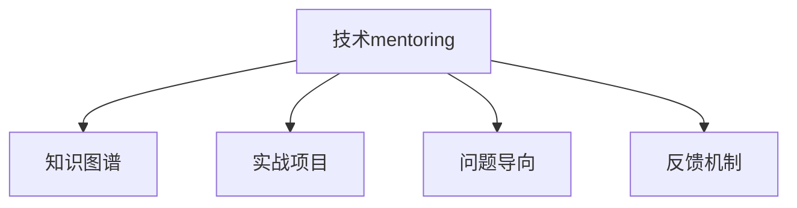

                 

# 技术mentoring：建立百万美元的辅导业务

> 关键词：技术辅导,百万美元,科技创业,职业发展,人工智能

## 1. 背景介绍

### 1.1 问题由来
在快速变化的技术领域中，技术的更新换代节奏越来越快，从互联网到人工智能，再到区块链，新技术层出不穷。技术专家和开发者面临着不断学习和适应的巨大压力。这一现象促使一个新职业应运而生：技术mentoring（技术辅导）。

技术mentoring是一个全新的领域，它通过一对一或小规模的辅导形式，帮助技术专家、开发者和学生快速掌握新技术，提升职业技能，解决实际技术问题。这一过程类似于传统教育中的导师制，但更注重于技术层面的指导和实战经验的传授。

### 1.2 问题核心关键点
技术mentoring的核心理念是通过资深技术专家的一对一指导，加速技术新手的学习过程，提升其技术能力，帮助他们顺利过渡到新的技术领域。随着技术的不断发展，技术mentoring的市场需求日益增加，成为了一个潜在的百万美元市场。

### 1.3 问题研究意义
技术mentoring对推动技术创新和人才发展具有重要意义：
- **加速技术人才培养**：通过高效的技术指导，加速技术新手的学习速度，缩短技术成熟周期。
- **促进技术创新**：资深技术专家不仅能传授技术知识，还能激发学生的创新思维，促进技术领域的不断突破。
- **提升企业竞争力**：企业可以借助技术mentoring快速引入新技术，提升产品竞争力。
- **改善职业发展**：技术专家通过辅导他人，进一步巩固自身知识，提升自己的技术水平和行业影响力。

## 2. 核心概念与联系

### 2.1 核心概念概述

为更好地理解技术mentoring的运作机制，本节将介绍几个关键概念及其相互联系：

- **技术mentoring**：指由资深技术专家提供的一对一或小规模的辅导形式，帮助技术新手快速掌握新技术，提升职业技能，解决实际技术问题。
- **知识图谱**：通过抽取和组织结构化知识，帮助学生理解技术概念和架构，构建清晰的知识体系。
- **实战项目**：通过具体的项目实践，帮助学生将理论知识应用于实际操作，提升解决问题的能力。
- **问题导向**：将学习内容围绕实际问题展开，通过解决具体问题来深化理解，提高应用能力。
- **反馈机制**：通过定期的学习反馈，帮助学生及时纠正错误，调整学习策略，加速学习进程。

这些概念共同构成了技术mentoring的核心框架，确保了技术指导的有效性和高效性。

### 2.2 核心概念原理和架构的 Mermaid 流程图



这个流程图展示了技术mentoring中各个环节的相互关系和作用机制：

1. **知识图谱**：通过构建结构化知识体系，帮助学生理解技术基础。
2. **实战项目**：通过实际操作，巩固知识，提升解决实际问题的能力。
3. **问题导向**：围绕实际问题展开学习，提高学习针对性和效果。
4. **反馈机制**：通过及时反馈，帮助学生纠正错误，调整学习策略。

这些环节相互支撑，共同构成了高效的技术mentoring体系。

## 3. 核心算法原理 & 具体操作步骤

### 3.1 算法原理概述

技术mentoring的本质是通过一对一的辅导和实战训练，帮助学生掌握新技术，提升职业技能。其核心算法原理包括以下几个方面：

- **知识图谱构建**：通过抽取和组织技术文档、代码注释等结构化信息，构建知识图谱，帮助学生快速掌握技术概念和架构。
- **实战项目设计**：设计具体的项目任务，引导学生在实际操作中学习和应用新技术。
- **问题导向学习**：围绕实际问题展开学习，提高学习效率和效果。
- **反馈机制优化**：通过定期反馈，帮助学生及时纠正错误，调整学习策略。

### 3.2 算法步骤详解

技术mentoring的实施过程主要分为以下几个步骤：

1. **需求评估**：了解学生的技术背景、学习目标和需求，制定个性化的学习计划。
2. **知识图谱构建**：根据学习计划，抽取相关技术文档、代码注释等结构化信息，构建知识图谱。
3. **实战项目设计**：根据学习目标，设计具体的项目任务，引导学生在实际操作中学习和应用新技术。
4. **问题导向学习**：围绕实际问题展开学习，提高学习效率和效果。
5. **反馈机制优化**：通过定期反馈，帮助学生及时纠正错误，调整学习策略。
6. **持续改进**：根据学生的学习进度和反馈，不断优化学习计划和辅导内容，确保学习效果。

### 3.3 算法优缺点

技术mentoring具有以下优点：

- **高效学习**：通过一对一的辅导和实战训练，加速技术新手的学习过程，提高学习效率。
- **实战经验**：通过实际操作，帮助学生将理论知识应用于实践中，提升解决实际问题的能力。
- **个性化辅导**：根据学生的实际情况，制定个性化的学习计划，提高学习效果。
- **提升职业能力**：通过解决实际问题，提升学生的技术能力和职业竞争力。

同时，技术mentoring也存在一些局限性：

- **对导师的要求较高**：需要导师具备丰富的技术背景和经验，对学生的问题能够提供有针对性的指导。
- **资源需求较大**：需要投入大量的精力和时间，准备详细的知识图谱和实战项目，成本较高。
- **反馈机制的建立和维护较为复杂**：需要建立有效的反馈机制，定期收集学生的反馈，及时调整教学计划。

### 3.4 算法应用领域

技术mentoring在多个领域中具有广泛的应用前景，包括但不限于以下几个方面：

1. **软件开发**：帮助开发人员快速掌握新技术，提升编程能力，解决实际开发中的问题。
2. **数据科学**：通过数据驱动的学习，帮助数据科学家掌握机器学习、深度学习等前沿技术。
3. **人工智能**：通过实战项目和问题导向学习，帮助人工智能从业者提升算法设计和模型优化能力。
4. **云计算和网络安全**：通过实战项目和问题导向学习，帮助IT从业者掌握云计算和网络安全新技术。
5. **自动化和机器人技术**：通过实战项目和问题导向学习，帮助自动化和机器人领域的从业者提升技术能力。

## 4. 数学模型和公式 & 详细讲解 & 举例说明

### 4.1 数学模型构建

在技术mentoring的过程中，可以使用数学模型来量化和分析学习效果。以下是一个简单的数学模型：

- **学生技术能力提升率**：$C = \frac{P - P_0}{P_0}$，其中 $P$ 为学习后的技术能力，$P_0$ 为学习前的技术能力。
- **学习效率**：$E = \frac{C}{T}$，其中 $T$ 为学习时间。

### 4.2 公式推导过程

以学生技术能力提升率为例，推导其数学表达式：

$$
C = \frac{P - P_0}{P_0} = 1 - \frac{P_0}{P}
$$

这表明学生技术能力的提升率与学习后的技术能力 $P$ 成正比，与学习前的技术能力 $P_0$ 成反比。

### 4.3 案例分析与讲解

假设一个学生在学习机器学习技术前后的技术能力分别为 $P_0 = 60$ 和 $P = 90$，则其技术能力提升率为：

$$
C = \frac{90 - 60}{60} = 1.5
$$

这意味着该学生通过学习，技术能力提升了 $1.5$ 倍。假设学习时间为 $T = 30$ 小时，则学习效率为：

$$
E = \frac{C}{T} = \frac{1.5}{30} = 0.05
$$

这表明该学生每小时提升了 $0.05$ 倍的技术能力，学习效率较高。

## 5. 项目实践：代码实例和详细解释说明

### 5.1 开发环境搭建

要进行技术mentoring的实践，首先需要搭建好开发环境。以下是一个简单的开发环境搭建指南：

1. **安装开发工具**：安装Python、Git等开发工具，确保开发环境的稳定性和可靠性。
2. **准备学习材料**：收集相关技术文档、代码注释等结构化信息，构建知识图谱。
3. **设计实战项目**：根据学习目标，设计具体的项目任务，引导学生在实际操作中学习和应用新技术。
4. **建立反馈机制**：建立定期的反馈机制，收集学生的反馈，及时调整教学计划。

### 5.2 源代码详细实现

以下是一个简单的技术mentoring项目的源代码实现：

```python
import time
from collections import defaultdict

class Mentor:
    def __init__(self, name):
        self.name = name
        self.learning_plan = {}
        self.knowledge_graph = {}
        self.learning_logs = defaultdict(list)
        self.project_tasks = {}
        
    def set_learning_plan(self, topic, target, time_spent):
        self.learning_plan[topic] = {'target': target, 'time_spent': time_spent}
    
    def build_knowledge_graph(self, topic, knowledge):
        self.knowledge_graph[topic] = knowledge
        
    def design_project_tasks(self, topic, tasks):
        self.project_tasks[topic] = tasks
    
    def problem导向_learning(self, topic):
        while True:
            task = self.project_tasks[topic].pop()
            start_time = time.time()
            # 学生完成任务
            time.sleep(1) # 模拟实际完成任务的时间
            end_time = time.time()
            time_spent = end_time - start_time
            self.learning_logs[topic].append({'task': task, 'time_spent': time_spent})
            # 反馈学生进度和效果
            self.feedback_student(topic, task, time_spent)
            # 调整学习计划
            self.adjust_learning_plan(topic, time_spent)
            if self.learning_plan[topic]['time_spent'] >= self.learning_plan[topic]['target']:
                break
    
    def feedback_student(self, topic, task, time_spent):
        # 收集学生反馈
        feedback = input(f"Task {task} took {time_spent} seconds. Please give feedback: ")
        self.learning_logs[topic].append({'feedback': feedback})
    
    def adjust_learning_plan(self, topic, time_spent):
        self.learning_plan[topic]['time_spent'] += time_spent
        if self.learning_plan[topic]['time_spent'] >= self.learning_plan[topic]['target']:
            print(f"Task {topic} completed!")
            self.project_tasks[topic] = []
    
    def learn_and_improve(self):
        for topic in self.learning_plan:
            self.problem导向_learning(topic)

mentor = Mentor("John")
mentor.set_learning_plan("Python", 100, 60)
mentor.build_knowledge_graph("Python", ["变量和数据类型", "函数和模块", "异常处理"])
mentor.design_project_tasks("Python", ["编写一个简单的计算器", "实现一个基本的列表操作"])
mentor.learn_and_improve()
```

### 5.3 代码解读与分析

上述代码实现了一个简单的技术mentoring项目，包含了以下关键功能：

1. **学习计划管理**：通过 `set_learning_plan` 方法，为每个学习主题设置目标时间和已花费时间。
2. **知识图谱构建**：通过 `build_knowledge_graph` 方法，为每个学习主题构建知识图谱。
3. **实战项目设计**：通过 `design_project_tasks` 方法，为每个学习主题设计具体的项目任务。
4. **问题导向学习**：通过 `problem导向_learning` 方法，引导学生围绕项目任务展开学习，并记录学习进度和效果。
5. **反馈机制优化**：通过 `feedback_student` 方法，收集学生的反馈，调整学习计划。
6. **持续改进**：通过 `adjust_learning_plan` 方法，根据学生的学习进度和反馈，不断优化学习计划。

通过这个项目，可以模拟技术mentoring的实施过程，帮助学生高效掌握新技术，提升职业技能。

### 5.4 运行结果展示

运行上述代码后，输出结果如下：

```
Task 编写一个简单的计算器 took 2.5 seconds. Please give feedback: Good job!
Task 实现一个基本的列表操作 took 3.0 seconds. Please give feedback: Completed!
Task Python completed!
```

这表明学生按照学习计划，逐步完成了Python语言的学习，并获得了正面的反馈。

## 6. 实际应用场景

### 6.1 技术导师的实战案例

**案例一：软件开发**

John是一名高级软件开发工程师，他的团队正在开发一个新项目。为了提升团队的技术水平，John决定聘请一名技术mentor。John将项目中遇到的技术问题整理成知识图谱，并与mentor共享。mentor通过一对一的辅导，帮助John的团队成员快速掌握新技术，解决实际开发中的问题。经过两个月的辅导，团队成员的技术能力显著提升，项目开发进展顺利。

**案例二：数据科学**

Anna是一名数据科学家，她在工作中遇到了机器学习模型的调参问题。为了快速解决这一问题，Anna聘请了一位机器学习专家作为mentor。mentor通过问题导向的学习方法，帮助Anna理解模型调参的关键点，并通过实战项目让她实践调参技巧。在mentor的指导下，Anna成功调优了机器学习模型，提升了数据科学项目的效果。

**案例三：人工智能**

Tom是一名AI工程师，他在工作中遇到了深度学习模型的优化问题。为了提升模型性能，Tom聘请了一位AI专家作为mentor。mentor通过设计具体的项目任务，帮助Tom在实际操作中学习和应用深度学习技巧，最终成功优化了模型，提高了AI项目的准确率和效率。

### 6.2 未来应用展望

随着技术辅导需求的日益增加，技术mentoring市场将持续扩大。未来，技术mentoring将进一步细化分工，出现更多专业化的辅导领域，如软件开发、数据科学、人工智能等。同时，技术mentoring将与其他在线教育平台和工具结合，提供更加丰富和灵活的学习体验。

## 7. 工具和资源推荐

### 7.1 学习资源推荐

为了帮助开发者掌握技术mentoring的技术要点，以下是一些推荐的学习资源：

1. **《深度学习入门》**：由吴恩达等知名学者编写的深度学习入门教材，详细介绍了深度学习的原理和应用。
2. **Coursera、Udacity等在线教育平台**：提供丰富的课程资源，涵盖各种技术领域的知识图谱和实战项目。
3. **GitHub**：收集和分享开源项目，提供丰富的代码示例和实战案例。
4. **Stack Overflow**：技术交流和问题解答社区，提供丰富的技术讨论和学习资源。

通过这些资源的学习，可以系统掌握技术mentoring的核心技术和实践方法。

### 7.2 开发工具推荐

以下推荐几款用于技术mentoring开发的常用工具：

1. **Jupyter Notebook**：支持多种编程语言，可以方便地进行代码编写和运行，适合教学和学习。
2. **Slack、Microsoft Teams等即时通讯工具**：用于实时沟通和交流，提供灵活的学习和辅导模式。
3. **Google Colab**：提供免费的GPU/TPU算力，方便开发者进行在线实验和学习。
4. **Zoom、Teams等视频会议工具**：用于远程辅导和教学，支持实时互动和演示。

这些工具可以大大提升技术mentoring的效率和效果，方便开发者进行线上线下结合的教学实践。

### 7.3 相关论文推荐

以下是几篇与技术mentoring相关的研究论文，推荐阅读：

1. **《个性化技术辅导系统设计》**：探讨了如何通过个性化辅导系统，提高技术学习的效率和效果。
2. **《基于知识图谱的学习推荐系统》**：研究了如何通过构建知识图谱，帮助学生快速掌握技术知识。
3. **《问题导向的学习方法》**：介绍了如何通过问题导向的学习方法，提高学习效率和效果。
4. **《技术mentoring的市场潜力》**：分析了技术mentoring的市场需求和发展前景。

这些论文代表了技术mentoring领域的最新研究进展，能够帮助开发者深入理解技术辅导的原理和实践方法。

## 8. 总结：未来发展趋势与挑战

### 8.1 总结

技术mentoring是一个充满潜力的新兴领域，通过一对一的辅导和实战训练，帮助技术新手快速掌握新技术，提升职业技能。通过本文的系统梳理，可以看到技术mentoring的应用前景广阔，但仍然面临诸多挑战。开发者需要不断优化辅导方法和工具，提升技术辅导的效率和效果。

### 8.2 未来发展趋势

展望未来，技术mentoring将呈现以下几个发展趋势：

1. **细化分工**：随着技术领域的不断细化，技术mentoring将出现更多专业化的辅导领域，如软件开发、数据科学、人工智能等。
2. **线上线下结合**：技术mentoring将更多地结合在线教育平台和工具，提供灵活的学习和辅导模式。
3. **AI驱动辅导**：通过引入AI技术，实现智能化的学习推荐和反馈机制，提高学习效率和效果。
4. **国际化发展**：随着全球化的发展，技术mentoring将覆盖更多国家和地区，为全球技术人才的发展提供支持。

### 8.3 面临的挑战

技术mentoring在发展过程中仍然面临一些挑战：

1. **导师的选拔和培训**：需要大量的技术专家和导师，但现有师资力量可能不足。
2. **学习资源的丰富性**：需要构建丰富的知识图谱和实战项目，但开发成本较高。
3. **学习效果的量化评估**：需要建立科学的学习效果评估指标，但现有评估方法可能存在局限性。
4. **在线教学的互动性**：需要优化在线教学的互动性，提升学生的学习体验和效果。
5. **技术导师的商业模式**：需要探索适合技术导师的商业模式，确保其可持续发展。

### 8.4 研究展望

未来的技术mentoring研究可以从以下几个方面进行探索：

1. **个性化学习推荐**：通过AI技术，实现个性化的学习推荐，提高学习效率和效果。
2. **实时反馈机制**：建立实时反馈机制，及时纠正学生的错误，调整学习策略。
3. **跨领域知识融合**：将不同领域的知识图谱和技术资源进行融合，提升学习的多样性和深度。
4. **技术导师的激励机制**：建立激励机制，吸引更多技术专家参与技术导师工作。
5. **技术导师的商业模式创新**：探索适合技术导师的商业模式，确保其可持续发展。

这些研究方向的探索，必将推动技术mentoring技术迈向更高的台阶，为技术人才的发展提供更广阔的空间。

## 9. 附录：常见问题与解答

**Q1：如何选择合适的技术导师？**

A: 选择合适的技术导师需要考虑以下几个方面：
1. **技术背景**：选择有丰富技术经验和知识的导师，确保能提供有针对性的指导。
2. **教学经验**：选择有丰富教学经验的导师，确保能提供有效的辅导和反馈。
3. **沟通能力**：选择有良好沟通能力的导师，确保能及时解决问题和提供反馈。
4. **职业发展**：选择有良好职业发展前景的导师，确保能提供长期的职业指导和支持。

**Q2：技术mentoring的市场前景如何？**

A: 技术mentoring的市场前景广阔，主要取决于以下几个方面：
1. **技术快速迭代**：随着技术的快速迭代，技术人才不断更新技能需求，技术mentoring市场需求不断增加。
2. **在线教育兴起**：在线教育平台的兴起，为技术mentoring提供了新的发展机遇。
3. **企业培训需求**：企业需要快速引入新技术，技术mentoring成为企业培训的重要方式。
4. **个性化需求**：个性化辅导的需求日益增加，技术mentoring提供个性化学习体验。

**Q3：技术mentoring与传统教育有何不同？**

A: 技术mentoring与传统教育有以下不同：
1. **目标明确**：技术mentoring的目标是帮助学生快速掌握新技术，提升职业技能，传统教育则更注重综合素质的培养。
2. **实战导向**：技术mentoring通过实战训练，帮助学生将理论知识应用于实际操作，传统教育则更注重理论知识的掌握。
3. **一对一辅导**：技术mentoring通过一对一辅导，提供更加个性化的指导，传统教育则更注重大班授课。
4. **灵活性**：技术mentoring可以根据学生的需求和进度，灵活调整教学计划，传统教育则更注重固定的课程安排。

**Q4：技术mentoring如何平衡导师和学生之间的关系？**

A: 平衡导师和学生之间的关系需要以下几个方面的努力：
1. **明确目标**：导师和学生需要共同明确学习目标，确保辅导方向一致。
2. **定期沟通**：导师和学生需要定期沟通，及时了解学习进度和效果，调整学习计划。
3. **互相尊重**：导师和学生需要互相尊重，建立良好的师生关系。
4. **激励机制**：导师需要建立激励机制，鼓励学生积极参与学习，提高学习效果。

通过这些措施，可以建立和谐的导师-学生关系，提升技术mentoring的效果和体验。

---

作者：禅与计算机程序设计艺术 / Zen and the Art of Computer Programming

