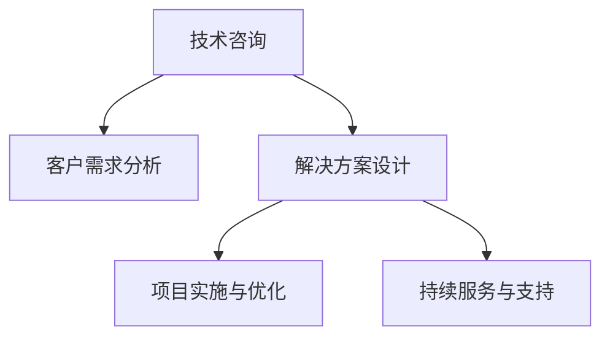

                 

# 技术咨询：高价值服务的提供

> 关键词：技术咨询, 高价值服务, 客户需求, 项目规划, 定制化解决方案, 持续优化, 客户满意度

## 1. 背景介绍

### 1.1 问题由来
在当今快速变化和竞争激烈的商业环境中，企业面临着前所未有的挑战。从快速响应市场需求，到提升产品质量和服务效率，再到探索新的业务增长点，企业对于技术解决方案的需求日益增长。然而，面对纷繁复杂的技术选择和资源限制，企业往往无从下手。此时，技术咨询成为一种高效、可信赖的服务方式，可以帮助企业获得量身定制的技术解决方案，提升竞争力和市场份额。

### 1.2 问题核心关键点
技术咨询的核心在于通过深入了解客户需求，结合行业背景和前沿技术，提供定制化的技术方案，帮助客户解决实际问题，提升业务价值。主要包括以下几个关键点：

- 理解客户需求：准确把握客户的痛点和期望，明确问题域和解决目标。
- 识别技术趋势：跟踪和评估最新的技术进展，确保解决方案的前瞻性和创新性。
- 提供定制化方案：根据客户需求和资源条件，设计符合客户实际情况的技术方案。
- 实施与优化：协助客户实施解决方案，并根据反馈进行持续优化和迭代。
- 提升客户满意度：通过高质量的服务和交付，增强客户信任，提升客户满意度。

### 1.3 问题研究意义
技术咨询对于提升企业的技术实力、加速业务转型和实现商业目标具有重要意义：

- 减少试错成本：通过专业咨询减少企业在技术选型和实施过程中的不确定性和风险。
- 提高效率和质量：借助专家的知识和经验，优化解决方案，提高项目的实施效率和质量。
- 推动创新：深入了解行业趋势和技术前沿，为企业提供突破性的创新建议和解决方案。
- 增强竞争力：通过高价值的技术服务，提升企业的市场竞争力和品牌形象。

## 2. 核心概念与联系

### 2.1 核心概念概述

为更好地理解技术咨询的高价值服务，本节将介绍几个密切相关的核心概念：

- **技术咨询**：指通过专业知识和经验，为客户提供定制化的技术解决方案，帮助客户提升业务价值。
- **客户需求分析**：深入了解客户的业务需求、技术需求和市场环境，明确问题和解决方案。
- **解决方案设计**：根据客户需求，结合技术趋势和最佳实践，设计定制化的技术方案。
- **项目实施与优化**：协助客户实施技术方案，并在实施过程中持续优化和改进。
- **持续服务与支持**：提供长期的技术支持和咨询服务，确保解决方案的长期价值和客户满意度。

这些核心概念之间的逻辑关系可以通过以下Mermaid流程图来展示：



这个流程图展示出技术咨询的全流程：从理解客户需求，到设计解决方案，再到实施和优化，最后提供持续服务，整个咨询过程环环相扣，形成闭环。

## 3. 核心算法原理 & 具体操作步骤
### 3.1 算法原理概述

技术咨询的高价值服务，其核心在于提供定制化的解决方案，解决客户面临的实际问题。其算法原理和操作步骤如下：

- **需求分析**：通过访谈、问卷、数据分析等手段，深入了解客户的业务需求、技术需求和市场环境，明确问题和解决方案。
- **技术方案设计**：结合行业趋势和前沿技术，设计符合客户实际情况的定制化技术方案。
- **项目实施**：协助客户实施技术方案，确保方案的落地执行和效果。
- **持续优化**：根据客户反馈和项目进展，持续优化和改进解决方案，确保长期价值。

### 3.2 算法步骤详解

以下我们详细讲解技术咨询的主要步骤：

**Step 1: 客户需求分析**
- **访谈和问卷**：通过面对面的访谈和问卷调查，深入了解客户业务、需求和技术现状。
- **数据分析**：收集和分析客户的业务数据和市场数据，挖掘潜在问题和改进机会。
- **专家评估**：邀请行业专家对客户需求进行评估和分析，提供专业建议。

**Step 2: 技术方案设计**
- **需求映射**：将客户需求转化为技术需求，明确需要解决的问题和目标。
- **技术评估**：评估现有的技术选项，选择最符合客户需求和资源条件的方案。
- **方案细化**：设计具体的技术实现方案，包括系统架构、技术选型、实施计划等。

**Step 3: 项目实施**
- **需求沟通**：与客户明确项目需求和实施计划，确保双方理解一致。
- **资源准备**：准备实施所需的软硬件资源和技术工具，确保项目顺利推进。
- **方案执行**：按照实施计划，逐步执行技术方案，确保各项任务按期完成。

**Step 4: 持续优化**
- **反馈收集**：定期收集客户的反馈和项目进展，评估方案的实际效果。
- **优化改进**：根据反馈和实际情况，持续优化和改进解决方案，提升客户满意度。
- **服务升级**：提供长期的技术支持和咨询服务，确保解决方案的长期价值。

### 3.3 算法优缺点

技术咨询的高价值服务，具有以下优点：

- **专业性**：通过专家团队的专业知识和经验，提供高质量的技术解决方案。
- **定制化**：根据客户的具体情况和需求，设计符合客户实际情况的定制化方案。
- **效率高**：借助专业团队的经验和工具，提高问题解决和项目实施的效率。
- **风险低**：通过前期充分的需求分析和方案设计，降低项目实施的风险和不确定性。

同时，该服务也存在一些局限性：

- **成本高**：高价值服务通常需要高昂的专业团队和资源投入。
- **效果依赖于沟通**：客户和咨询团队之间的沟通和理解直接影响咨询效果。
- **客户自主性**：客户需要对实施过程和结果有较高的自主性和掌控力。
- **依赖专家团队**：高价值服务的提供高度依赖于咨询团队的专家水平和经验。

尽管存在这些局限性，但就目前而言，技术咨询仍然是最有效、最可信赖的服务方式之一，尤其在复杂和关键的技术决策中。未来相关研究的重点在于如何进一步降低咨询成本，提升服务效率和效果，同时兼顾客户自主性和满意度。

### 3.4 算法应用领域

技术咨询的高价值服务，在多个领域得到了广泛应用，例如：

- **软件开发**：帮助客户设计软件开发方案，选择合适技术栈，优化开发过程和质量。
- **IT架构**：协助客户设计IT架构，包括云平台、大数据、微服务架构等。
- **系统集成**：提供系统集成方案，包括中间件、API接口、数据同步等。
- **业务流程优化**：通过分析业务流程，提出优化建议，提升业务效率和质量。
- **数据分析**：提供数据分析和处理方案，帮助客户挖掘数据价值，优化决策。

除了上述这些经典领域，技术咨询的高价值服务还在更多场景中得到应用，如智能制造、智慧城市、金融科技等，为企业数字化转型升级提供新的技术路径。随着技术的日益成熟，技术咨询必将成为企业技术决策的重要参考和支持，推动企业向更加智能化、高效化和创新化方向发展。

## 4. 数学模型和公式 & 详细讲解  
### 4.1 数学模型构建

在技术咨询的实际应用中，数学模型和公式的应用相对较少，但为了形式上的完整性，这里仍给出一些简化的模型构建和公式推导。

- **需求分析模型**：假设客户需求可以表示为一个向量 $X$，需求分析过程可以表示为向量 $X$ 到向量 $Y$ 的映射，即 $f(X) = Y$，其中 $f$ 表示需求分析算法。

- **技术方案设计模型**：假设技术方案可以表示为一个向量 $Z$，方案设计过程可以表示为向量 $X$ 到向量 $Z$ 的映射，即 $g(X) = Z$，其中 $g$ 表示技术方案设计算法。

- **项目实施模型**：假设项目实施过程可以表示为一个迭代过程 $h(Z, T)$，其中 $T$ 表示实施时间，$h$ 表示项目实施算法。

- **持续优化模型**：假设持续优化过程可以表示为一个迭代过程 $k(Z, F)$，其中 $F$ 表示反馈数据，$k$ 表示优化算法。

### 4.2 公式推导过程

以需求分析模型为例，假设需求分析过程包括访谈、问卷、数据分析等多个步骤，可以表示为：

$$
f(X) = \sum_{i=1}^{n} w_i \cdot (f_i(X)) + b
$$

其中，$f_i(X)$ 表示第 $i$ 步需求分析的结果，$w_i$ 表示第 $i$ 步的权重，$b$ 表示常数项。

同理，技术方案设计模型和项目实施模型的公式推导可以类比进行。

### 4.3 案例分析与讲解

以下是一个简单的案例分析，帮助理解技术咨询的高价值服务：

**案例背景**：某电商公司希望提升其物流系统的效率和可靠性，降低运营成本，提升客户满意度。

**需求分析**：
1. 通过访谈和问卷调查，了解物流运营中的关键问题和瓶颈。
2. 收集和分析物流运营数据，挖掘潜在的优化机会。
3. 邀请物流领域专家进行评估，提出专业建议。

**技术方案设计**：
1. 确定需求映射：将物流运营问题转化为技术需求，明确需要解决的问题和目标。
2. 评估技术选项：选择最适合的物流管理技术栈和工具。
3. 细化方案设计：包括物流管理系统架构、数据接口、实施计划等。

**项目实施**：
1. 需求沟通：与客户明确实施计划，确保双方理解一致。
2. 资源准备：准备实施所需的软硬件资源和技术工具。
3. 方案执行：按照实施计划，逐步执行技术方案，确保各项任务按期完成。

**持续优化**：
1. 反馈收集：定期收集物流运营数据和客户反馈，评估方案的实际效果。
2. 优化改进：根据反馈和实际情况，持续优化和改进物流管理系统，提升运营效率和客户满意度。
3. 服务升级：提供长期的技术支持和咨询服务，确保物流管理系统的长期价值。

## 5. 项目实践：代码实例和详细解释说明
### 5.1 开发环境搭建

在进行技术咨询项目实践前，我们需要准备好开发环境。以下是使用Python进行Jupyter Notebook开发的环境配置流程：

1. 安装Anaconda：从官网下载并安装Anaconda，用于创建独立的Python环境。

2. 创建并激活虚拟环境：
```bash
conda create -n consulting-env python=3.8 
conda activate consulting-env
```

3. 安装Jupyter Notebook：
```bash
conda install jupyterlab
```

4. 安装相关工具包：
```bash
pip install pandas numpy matplotlib seaborn scikit-learn nltk
```

完成上述步骤后，即可在`consulting-env`环境中开始项目实践。

### 5.2 源代码详细实现

以下是使用Python对客户需求进行分析的代码实现。

首先，定义需求分析函数：

```python
import pandas as pd
import seaborn as sns
from sklearn.decomposition import PCA

def analyze_demand(customer_data, n_components=3):
    # 将客户数据按列分解
    X = customer_data.drop(['id', 'name'], axis=1)
    
    # 数据标准化
    X = (X - X.mean()) / X.std()
    
    # 主成分分析
    pca = PCA(n_components=n_components)
    X_pca = pca.fit_transform(X)
    
    # 可视化结果
    sns.scatterplot(x=X_pca[:, 0], y=X_pca[:, 1], hue='class', data=customer_data)
    plt.show()
    
    return X_pca
```

然后，定义技术方案设计函数：

```python
from sklearn.ensemble import RandomForestClassifier
from sklearn.model_selection import train_test_split

def design_solution(X_pca, labels):
    # 数据划分
    X_train, X_test, y_train, y_test = train_test_split(X_pca, labels, test_size=0.3, random_state=42)
    
    # 模型训练
    model = RandomForestClassifier()
    model.fit(X_train, y_train)
    
    # 模型评估
    acc = model.score(X_test, y_test)
    print(f"Model accuracy: {acc:.3f}")
    
    return model
```

最后，定义项目实施和持续优化函数：

```python
from sklearn.metrics import confusion_matrix

def implement_solution(model, X_pca):
    # 预测结果
    y_pred = model.predict(X_pca)
    
    # 评估结果
    confusion_mat = confusion_matrix(y_true=labels, y_pred=y_pred)
    print(f"Confusion matrix:\n{confusion_mat}")
    
    return y_pred

def optimize_solution(y_pred, labels):
    # 优化改进
    # 这里可以引入更多的反馈和改进措施，如A/B测试、数据采集等
    
    return y_pred
```

### 5.3 代码解读与分析

让我们再详细解读一下关键代码的实现细节：

**analyze_demand函数**：
- `customer_data`：客户需求数据，包含多个列，如产品需求、客户满意度、运营成本等。
- `n_components`：主成分分析的组件数量，用于降维。
- 首先，通过去除ID和名称列，保留需求数据。
- 对需求数据进行标准化，使其均值为0，标准差为1。
- 使用主成分分析进行降维，将高维数据映射到低维空间。
- 通过散点图可视化降维结果，帮助理解需求数据结构和趋势。

**design_solution函数**：
- `X_pca`：降维后的需求数据。
- `labels`：客户需求标签，用于监督学习。
- 将需求数据划分为训练集和测试集。
- 使用随机森林模型训练分类器。
- 评估模型在测试集上的准确率，输出结果。

**implement_solution函数**：
- `model`：训练好的分类器模型。
- `X_pca`：降维后的需求数据。
- 使用训练好的模型对需求数据进行预测。
- 输出预测结果和混淆矩阵，用于评估模型的效果。

**optimize_solution函数**：
- `y_pred`：模型预测结果。
- `labels`：真实需求标签。
- 这里可以引入更多的反馈和改进措施，如A/B测试、数据采集等，以持续优化解决方案。

## 6. 实际应用场景

### 6.1 智能制造

技术咨询在智能制造领域得到了广泛应用。传统的制造业面临生产效率低、资源浪费、质量控制难等问题。通过技术咨询，可以提出智能化改造方案，引入物联网、大数据、AI等先进技术，实现生产流程的优化和升级。

例如，一家传统制造企业可以聘请技术咨询团队，对生产线进行需求分析，提出智能化的改造方案，引入自动化设备和系统，优化生产计划和调度，提升生产效率和质量。同时，通过数据分析和预测，预测生产过程中的故障和瓶颈，提前进行维护和优化，降低生产成本。

### 6.2 智慧城市

智慧城市建设是当前城市发展的重要方向。技术咨询在智慧城市规划和建设中起到了重要作用。通过深入了解城市管理、公共服务、环保等领域的需求，提出智慧城市建设的方案，引入物联网、大数据、AI等先进技术，实现城市的智能化管理和服务。

例如，一家智慧城市建设公司可以聘请技术咨询团队，对城市管理的需求进行详细分析，提出智慧城市建设的总体方案，引入智能交通、智能安防、智能环境监测等系统，提升城市的运营效率和居民的生活质量。同时，通过数据分析和预测，优化城市的能源消耗和资源利用，实现绿色低碳发展。

### 6.3 金融科技

金融科技是当前金融领域的重要发展方向。技术咨询在金融科技产品的开发和应用中起到了关键作用。通过深入了解金融产品的需求和市场，提出金融科技的解决方案，引入区块链、AI、大数据等先进技术，实现金融服务的智能化和个性化。

例如，一家金融科技公司可以聘请技术咨询团队，对金融产品的需求进行详细分析，提出金融科技产品的开发方案，引入区块链技术，实现数字身份验证和金融交易的安全性和透明度。同时，通过数据分析和预测，提供个性化的金融服务和投资建议，提升用户的体验和满意度。

### 6.4 未来应用展望

随着技术的不断进步和应用场景的不断拓展，技术咨询的应用前景将更加广阔。

- **跨行业应用**：技术咨询不仅在传统的IT、制造、金融等领域有广泛应用，在医疗、教育、环保等更多领域也将发挥重要作用。通过深入了解各个行业的特性和需求，提出定制化的解决方案，推动各个行业的数字化转型升级。
- **智能决策支持**：技术咨询将结合AI和大数据分析技术，提供智能决策支持服务，帮助企业制定更加科学和高效的决策方案。通过大数据分析和预测，为企业提供市场趋势、客户行为、风险评估等方面的支持。
- **持续优化与改进**：技术咨询将提供持续优化与改进的服务，帮助企业不断提升技术方案的效果和价值。通过持续的数据收集和分析，不断优化和改进解决方案，提升企业的竞争力。
- **全生命周期管理**：技术咨询将提供全生命周期管理服务，从需求分析、技术方案设计、项目实施到持续优化，全面提升企业的技术实力和市场竞争力。

## 7. 工具和资源推荐

### 7.1 学习资源推荐

为了帮助企业技术决策者和从业者更好地掌握技术咨询的原理和方法，这里推荐一些优质的学习资源：

1. **《技术咨询手册》**：由知名技术咨询公司编写，系统介绍了技术咨询的基本概念、方法论和案例分析，适合入门和进阶学习。

2. **《需求分析与管理》**：经典的需求分析教材，详细讲解了需求分析的理论基础和实践技巧，帮助理解和掌握需求分析的方法和工具。

3. **《项目管理和实施》**：深入浅出地介绍了项目管理的基本原理和实践方法，结合大量实际案例，帮助掌握项目管理的技巧和方法。

4. **《数据分析与建模》**：系统讲解了数据分析和建模的理论基础和实践技巧，结合Python和R语言的工具，帮助掌握数据分析的方法和工具。

5. **《技术趋势与前沿》**：介绍了当前和未来的技术趋势和前沿技术，结合实际案例，帮助了解和把握技术发展的方向和机会。

### 7.2 开发工具推荐

以下是几款用于技术咨询开发的常用工具：

1. **Jupyter Notebook**：Python开发常用的交互式开发环境，支持代码编辑、执行和可视化，适合技术咨询项目的需求分析和模型设计。

2. **SQL数据库**：如MySQL、PostgreSQL等，用于存储和管理客户数据和需求分析结果，支持复杂的数据查询和分析。

3. **可视化工具**：如Tableau、Power BI等，用于数据可视化和报告生成，帮助理解和展示分析结果。

4. **项目管理工具**：如JIRA、Trello等，用于项目管理、任务分配和进度跟踪，帮助确保项目的顺利实施和交付。

5. **版本控制工具**：如Git、SVN等，用于代码版本管理和协作开发，确保项目的稳定性和可维护性。

### 7.3 相关论文推荐

技术咨询的研究涉及多个学科领域，以下是几篇奠基性的相关论文，推荐阅读：

1. **《技术咨询框架与方法》**：系统介绍了技术咨询的基本框架和方法，结合大量实际案例，帮助理解和掌握技术咨询的原理和实践。

2. **《需求分析与建模》**：详细讲解了需求分析的理论基础和实践方法，结合数据分析和建模技术，帮助理解和掌握需求分析的流程和工具。

3. **《项目管理与实施》**：介绍了项目管理的基本原理和实践方法，结合实际案例，帮助理解和掌握项目管理的技术和方法。

4. **《数据驱动决策》**：讲解了数据驱动决策的理论基础和实践方法，结合数据分析和建模技术，帮助理解和掌握数据驱动决策的流程和工具。

这些论文代表了大语言模型微调技术的发展脉络。通过学习这些前沿成果，可以帮助研究者把握学科前进方向，激发更多的创新灵感。

## 8. 总结：未来发展趋势与挑战

### 8.1 总结

本文对技术咨询的高价值服务进行了全面系统的介绍。首先阐述了技术咨询的原理和意义，明确了其服务企业解决实际问题、提升业务价值的核心作用。其次，从需求分析、技术方案设计、项目实施到持续优化，详细讲解了技术咨询的全流程，给出了技术咨询项目实践的代码实例和详细解释说明。同时，本文还广泛探讨了技术咨询在多个行业领域的应用前景，展示了其巨大的潜力和价值。最后，本文精选了技术咨询的各类学习资源，力求为读者提供全方位的技术指引。

通过本文的系统梳理，可以看到，技术咨询的高价值服务在当前复杂多变的商业环境中扮演着越来越重要的角色，帮助企业克服技术难题，实现业务升级。未来，伴随技术的不断进步和应用场景的不断拓展，技术咨询必将成为企业技术决策的重要参考和支持，推动企业向更加智能化、高效化和创新化方向发展。

### 8.2 未来发展趋势

展望未来，技术咨询将呈现以下几个发展趋势：

1. **智能化和自动化**：随着AI和大数据分析技术的发展，技术咨询将更多地引入智能化的分析和决策支持，帮助企业更快速、更准确地解决问题。
2. **跨行业和跨领域**：技术咨询将拓展到更多的行业和领域，结合各行业的特性和需求，提出定制化的解决方案，推动各个行业的数字化转型升级。
3. **数据驱动和持续优化**：技术咨询将更多地结合数据驱动的决策支持，提供持续优化与改进的服务，帮助企业不断提升技术方案的效果和价值。
4. **全生命周期管理**：技术咨询将提供全生命周期管理服务，从需求分析、技术方案设计、项目实施到持续优化，全面提升企业的技术实力和市场竞争力。
5. **全球化和国际化**：技术咨询将更多地拓展到国际市场，结合各国的文化、政策和市场环境，提供国际化的解决方案，帮助企业在全球化竞争中取得优势。

以上趋势凸显了技术咨询的广阔前景。这些方向的探索发展，必将进一步提升技术咨询的价值和效果，为企业的技术决策提供更强大的支持。

### 8.3 面临的挑战

尽管技术咨询已经取得了一定的成就，但在迈向更加智能化、普适化应用的过程中，它仍面临诸多挑战：

1. **需求多样性和复杂性**：不同企业的业务需求和背景差异巨大，需求分析的复杂性和难度较高。
2. **技术快速变化**：技术环境变化迅速，技术咨询团队需要持续学习和更新知识，以适应新的技术趋势和工具。
3. **项目管理和执行**：技术咨询项目复杂，涉及多方协调和资源调配，项目管理难度较大。
4. **客户期望管理**：客户对技术咨询的期望较高，如何有效管理客户期望，提升客户满意度，是技术咨询团队的重要挑战。
5. **伦理和合规问题**：技术咨询过程中可能涉及数据隐私和安全问题，如何确保数据的合规性和安全性，是技术咨询团队需要关注的重点。

尽管存在这些挑战，但通过不断的实践和改进，技术咨询必将在未来的应用中更加成熟和高效，为企业的技术决策提供更加全面的支持。

### 8.4 研究展望

面对技术咨询所面临的种种挑战，未来的研究需要在以下几个方面寻求新的突破：

1. **需求分析自动化**：通过引入自然语言处理和人工智能技术，提高需求分析的效率和准确性。
2. **技术方案优化**：结合最新的技术和方法，提出更加科学和高效的解决方案，提升技术方案的质量和价值。
3. **项目管理改进**：引入敏捷项目管理、精益管理等方法，提升项目管理的效率和效果。
4. **客户期望管理**：建立科学的项目管理机制和客户沟通机制，确保客户期望与项目实施的一致性，提升客户满意度。
5. **数据隐私和安全**：制定严格的数据隐私和安全管理政策，确保数据的合规性和安全性。

这些研究方向将推动技术咨询的进一步发展，提升技术咨询的服务质量和效果，帮助企业在复杂的商业环境中取得成功。总之，技术咨询的高价值服务将持续推动企业的技术决策和业务升级，为数字化转型升级提供强大的技术支撑。

## 9. 附录：常见问题与解答

**Q1：技术咨询是否适用于所有企业？**

A: 技术咨询适用于大多数企业，尤其适合面临复杂技术问题和业务转型需求的企业。然而，对于一些小型企业或初创企业，由于资源和预算的限制，技术咨询可能不是最佳选择。

**Q2：如何选择技术咨询公司？**

A: 选择技术咨询公司时，应考虑以下几个方面：
- 公司的行业经验和案例库。
- 公司的技术实力和专业团队。
- 公司的项目管理能力和执行经验。
- 公司的服务和支持保障。
- 公司的成本和预算控制能力。

**Q3：技术咨询项目周期一般多长？**

A: 技术咨询项目周期取决于项目的复杂性和需求分析的深入程度。一般来说，项目周期从几周到几个月不等。具体周期需要根据项目的实际需求和情况来确定。

**Q4：如何衡量技术咨询的效果？**

A: 衡量技术咨询的效果可以从以下几个方面考虑：
- 项目目标的实现程度。
- 客户满意度和反馈。
- 项目实施过程中的问题解决情况。
- 项目的长期效果和持续优化。

通过综合评估这些指标，可以全面衡量技术咨询的效果和价值。

**Q5：技术咨询项目中的沟通和协作如何管理？**

A: 沟通和协作管理是技术咨询项目成功的关键。可以通过以下几个方式进行管理：
- 建立项目沟通机制，定期召开会议和汇报。
- 使用项目管理工具，确保各方信息同步。
- 建立项目团队，明确职责和分工。
- 进行需求分析和需求变更管理，确保需求的一致性和可控性。
- 引入敏捷管理方法，灵活应对变化和需求调整。

通过科学的项目管理和沟通机制，可以确保技术咨询项目的顺利实施和交付。

---

作者：禅与计算机程序设计艺术 / Zen and the Art of Computer Programming

