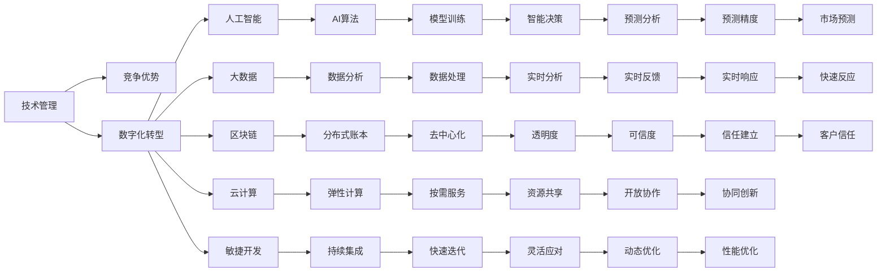

                 

# 技术管理：利用新技术提高竞争力

> 关键词：技术管理, 竞争优势, 数字化转型, 人工智能, 大数据, 区块链, 云计算, 敏捷开发

## 1. 背景介绍

### 1.1 问题由来

随着全球经济环境的变化和科技的迅猛发展，企业之间的竞争日益激烈。如何在快速变化的市场上保持竞争优势，成为了每个企业的核心目标。传统的技术管理模式已经无法满足新时期的需求，企业需要重新审视技术管理的策略和手段，利用新技术提高自身的市场竞争力。

### 1.2 问题核心关键点

企业利用新技术提高竞争力的关键在于以下几个方面：

- **技术选型**：选择最适合企业自身业务和市场环境的先进技术，是成功的基础。
- **技术融合**：将新技术与现有业务流程、组织架构和人员能力进行深度融合，实现技术创新和业务创新。
- **技术应用**：将技术转化为具体的业务成果，如提高效率、降低成本、增强客户体验等。
- **技术监控**：持续监控技术应用的效果，及时调整策略，确保技术投入产生预期的收益。

## 2. 核心概念与联系

### 2.1 核心概念概述

为更好地理解如何利用新技术提高竞争力，本节将介绍几个关键概念及其相互联系：

- **技术管理**：企业中负责规划、选择、实施、维护和评估技术策略的部门或职能。
- **竞争优势**：企业通过技术创新或差异化策略，在市场上获得的独特优势。
- **数字化转型**：通过利用数字技术优化企业业务流程，提升效率和竞争力。
- **人工智能**：模拟人类智能行为的技术，如机器学习、深度学习、自然语言处理等。
- **大数据**：大规模数据集及其处理和分析技术，支持数据驱动决策。
- **区块链**：去中心化、不可篡改的数据库技术，应用于安全、透明、可信的业务场景。
- **云计算**：基于互联网的计算资源和服务，提供弹性、按需的计算能力。
- **敏捷开发**：通过快速迭代、灵活适应变化的软件开发方法，加速产品上市和创新。

这些概念之间存在密切的联系，共同构成了企业技术管理的复杂生态系统。

### 2.2 核心概念原理和架构的 Mermaid 流程图



这个流程图展示了各个核心概念之间的相互依赖关系。技术管理通过选择和应用先进技术，实现数字化转型，驱动人工智能、大数据、区块链、云计算和敏捷开发等技术的应用，进而提高企业的竞争优势。

## 3. 核心算法原理 & 具体操作步骤

### 3.1 算法原理概述

利用新技术提高竞争力的关键在于采用科学的方法论和技术手段，进行有效的技术管理和应用。以下是大数据、人工智能、区块链和云计算等技术的应用原理：

- **大数据技术**：通过收集、存储、分析和处理海量数据，为企业提供决策依据，支持预测分析和实时监控。
- **人工智能技术**：通过机器学习和深度学习，模拟人类智能，实现自动化决策和优化，提高效率和准确性。
- **区块链技术**：通过去中心化的分布式账本，实现数据的安全性、透明性和不可篡改性，支持信任机制和协同创新。
- **云计算技术**：通过按需提供的计算资源和服务，实现弹性、高效和经济的计算能力，支持灵活的业务部署和快速迭代。

### 3.2 算法步骤详解

#### 3.2.1 大数据技术

1. **数据采集与存储**：从不同渠道收集数据，选择合适的数据仓库或分布式存储系统进行存储。
2. **数据清洗与预处理**：去除噪声和异常数据，进行数据标准化和格式转换。
3. **数据建模与分析**：构建数据模型，应用统计分析和机器学习算法，进行预测分析和实时监控。
4. **数据可视化**：使用数据可视化工具，将分析结果以图表、报表等形式展示，支持决策支持。

#### 3.2.2 人工智能技术

1. **数据准备**：收集、清洗和标注数据集，准备模型训练。
2. **模型选择与训练**：选择合适的算法，如监督学习、无监督学习和强化学习，进行模型训练。
3. **模型评估与优化**：通过交叉验证、性能指标等评估模型效果，进行参数调优。
4. **模型部署与监控**：将训练好的模型部署到生产环境，进行持续监控和性能调优。

#### 3.2.3 区块链技术

1. **网络搭建**：搭建区块链网络，包括节点部署、共识机制和智能合约设计。
2. **数据上链**：将关键数据进行哈希处理后上链，确保数据的不可篡改性和透明性。
3. **智能合约执行**：通过智能合约实现业务逻辑的自动化执行，减少人为干预和错误。
4. **隐私保护与安全**：采用隐私保护技术和加密算法，确保数据的安全性和隐私性。

#### 3.2.4 云计算技术

1. **云资源选择**：根据业务需求选择合适的云服务，如IaaS、PaaS和SaaS。
2. **云平台部署**：将应用和数据部署到云平台，进行弹性扩展和资源管理。
3. **云应用开发**：开发云原生应用，利用容器化、微服务架构和DevOps工具，实现敏捷开发和持续集成。
4. **云安全与治理**：采用云安全技术，如身份认证、数据加密和网络隔离，确保云应用的安全性和稳定性。

### 3.3 算法优缺点

#### 3.3.1 大数据技术

**优点**：
- 提供海量数据支持，帮助企业进行精准预测和实时监控。
- 数据模型可以不断迭代优化，提升决策的科学性和准确性。

**缺点**：
- 数据质量对分析结果有较大影响，需要投入大量资源进行数据清洗和预处理。
- 数据存储和处理成本较高，需要合理的资源管理策略。

#### 3.3.2 人工智能技术

**优点**：
- 自动化决策和优化，提高效率和准确性。
- 支持复杂的模式识别和预测分析，提供深入的洞察力。

**缺点**：
- 模型训练和部署需要大量的计算资源和时间。
- 模型复杂性高，难以解释和调试。

#### 3.3.3 区块链技术

**优点**：
- 去中心化、透明和不可篡改，确保数据的安全性和信任度。
- 支持智能合约的自动化执行，减少人为干预和错误。

**缺点**：
- 共识机制和智能合约设计复杂，需要专业的技术团队支持。
- 性能较低，难以处理大规模交易和高频操作。

#### 3.3.4 云计算技术

**优点**：
- 按需提供的弹性计算资源，降低成本和提高效率。
- 支持敏捷开发和持续集成，加速产品上市和创新。

**缺点**：
- 云平台依赖性强，数据和应用迁移成本较高。
- 云服务提供商的安全和治理问题，需要综合考虑。

### 3.4 算法应用领域

#### 3.4.1 大数据技术

- **市场分析**：通过大数据分析，了解市场趋势和客户行为，制定营销策略。
- **风险管理**：利用大数据进行风险评估和预测，优化资产配置和风险控制。
- **运营优化**：通过实时监控和数据分析，优化生产流程和运营效率。

#### 3.4.2 人工智能技术

- **智能客服**：利用自然语言处理技术，实现智能客服和自动答复。
- **智能制造**：应用机器学习算法，进行预测性维护和质量控制。
- **推荐系统**：通过深度学习算法，提供个性化推荐和精准营销。

#### 3.4.3 区块链技术

- **供应链管理**：采用区块链技术，实现供应链的透明和可追溯。
- **金融服务**：通过智能合约和去中心化账本，提升金融服务的效率和安全性。
- **医疗健康**：利用区块链技术，保护患者隐私和医疗数据安全。

#### 3.4.4 云计算技术

- **云原生应用**：开发云原生应用，实现敏捷开发和持续集成。
- **云平台部署**：将应用和数据部署到云平台，实现弹性扩展和资源管理。
- **云安全与治理**：采用云安全技术，确保云应用的安全性和稳定性。

## 4. 数学模型和公式 & 详细讲解

### 4.1 数学模型构建

为了更好地理解各技术的应用原理，本节将构建一些简化的数学模型。

#### 4.1.1 大数据技术

1. **数据采集与存储**：
   - 数据采集：$D = \{x_i\}_{i=1}^N$
   - 数据存储：$S = \{d_i\}_{i=1}^N$
   - 数据清洗与预处理：$\tilde{D} = \{\tilde{x}_i\}_{i=1}^N$

2. **数据建模与分析**：
   - 统计分析：$\hat{\theta} = \mathop{\arg\min}_{\theta} \sum_{i=1}^N \ell(x_i, y_i)$
   - 机器学习：$\hat{\theta} = \mathop{\arg\min}_{\theta} \frac{1}{N} \sum_{i=1}^N \ell(x_i, y_i)$

3. **数据可视化**：
   - 数据可视化：$V = \{v_i\}_{i=1}^N$
   - 图表展示：$G = \{g_i\}_{i=1}^N$

#### 4.1.2 人工智能技术

1. **数据准备**：
   - 数据收集：$D = \{(x_i, y_i)\}_{i=1}^N$
   - 数据清洗：$\tilde{D} = \{(\tilde{x}_i, \tilde{y}_i)\}_{i=1}^N$
   - 数据标注：$\bar{D} = \{(\bar{x}_i, \bar{y}_i)\}_{i=1}^N$

2. **模型选择与训练**：
   - 监督学习：$\hat{\theta} = \mathop{\arg\min}_{\theta} \frac{1}{N} \sum_{i=1}^N \ell(f(x_i), y_i)$
   - 无监督学习：$\hat{\theta} = \mathop{\arg\min}_{\theta} \frac{1}{N} \sum_{i=1}^N \ell(f(x_i))$

3. **模型评估与优化**：
   - 交叉验证：$CV = \{CV_i\}_{i=1}^N$
   - 性能指标：$K = \{k_i\}_{i=1}^N$

4. **模型部署与监控**：
   - 模型部署：$F = \{f(x_i)\}_{i=1}^N$
   - 性能监控：$M = \{m_i\}_{i=1}^N$

#### 4.1.3 区块链技术

1. **网络搭建**：
   - 节点部署：$N = \{n_i\}_{i=1}^N$
   - 共识机制：$C = \{c_i\}_{i=1}^N$
   - 智能合约设计：$S = \{s_i\}_{i=1}^N$

2. **数据上链**：
   - 数据哈希：$H = \{h_i\}_{i=1}^N$
   - 数据上链：$B = \{b_i\}_{i=1}^N$

3. **智能合约执行**：
   - 合约代码：$P = \{p_i\}_{i=1}^N$
   - 合约执行：$E = \{e_i\}_{i=1}^N$

4. **隐私保护与安全**：
   - 隐私保护：$P = \{p_i\}_{i=1}^N$
   - 加密算法：$E = \{e_i\}_{i=1}^N$

#### 4.1.4 云计算技术

1. **云资源选择**：
   - 云服务选择：$C = \{c_i\}_{i=1}^N$
   - 资源管理：$R = \{r_i\}_{i=1}^N$

2. **云平台部署**：
   - 应用部署：$A = \{a_i\}_{i=1}^N$
   - 资源管理：$M = \{m_i\}_{i=1}^N$

3. **云应用开发**：
   - 容器化：$C = \{c_i\}_{i=1}^N$
   - 微服务架构：$M = \{m_i\}_{i=1}^N$

4. **云安全与治理**：
   - 身份认证：$I = \{i_i\}_{i=1}^N$
   - 数据加密：$E = \{e_i\}_{i=1}^N$

### 4.2 公式推导过程

#### 4.2.1 大数据技术

1. **数据采集与存储**：
   - 数据采集：$D = \{x_i\}_{i=1}^N$
   - 数据存储：$S = \{d_i\}_{i=1}^N$
   - 数据清洗与预处理：$\tilde{D} = \{\tilde{x}_i\}_{i=1}^N$

2. **数据建模与分析**：
   - 统计分析：$\hat{\theta} = \mathop{\arg\min}_{\theta} \sum_{i=1}^N \ell(x_i, y_i)$
   - 机器学习：$\hat{\theta} = \mathop{\arg\min}_{\theta} \frac{1}{N} \sum_{i=1}^N \ell(x_i, y_i)$

3. **数据可视化**：
   - 数据可视化：$V = \{v_i\}_{i=1}^N$
   - 图表展示：$G = \{g_i\}_{i=1}^N$

#### 4.2.2 人工智能技术

1. **数据准备**：
   - 数据收集：$D = \{(x_i, y_i)\}_{i=1}^N$
   - 数据清洗：$\tilde{D} = \{(\tilde{x}_i, \tilde{y}_i)\}_{i=1}^N$
   - 数据标注：$\bar{D} = \{(\bar{x}_i, \bar{y}_i)\}_{i=1}^N$

2. **模型选择与训练**：
   - 监督学习：$\hat{\theta} = \mathop{\arg\min}_{\theta} \frac{1}{N} \sum_{i=1}^N \ell(f(x_i), y_i)$
   - 无监督学习：$\hat{\theta} = \mathop{\arg\min}_{\theta} \frac{1}{N} \sum_{i=1}^N \ell(f(x_i))$

3. **模型评估与优化**：
   - 交叉验证：$CV = \{CV_i\}_{i=1}^N$
   - 性能指标：$K = \{k_i\}_{i=1}^N$

4. **模型部署与监控**：
   - 模型部署：$F = \{f(x_i)\}_{i=1}^N$
   - 性能监控：$M = \{m_i\}_{i=1}^N$

#### 4.2.3 区块链技术

1. **网络搭建**：
   - 节点部署：$N = \{n_i\}_{i=1}^N$
   - 共识机制：$C = \{c_i\}_{i=1}^N$
   - 智能合约设计：$S = \{s_i\}_{i=1}^N$

2. **数据上链**：
   - 数据哈希：$H = \{h_i\}_{i=1}^N$
   - 数据上链：$B = \{b_i\}_{i=1}^N$

3. **智能合约执行**：
   - 合约代码：$P = \{p_i\}_{i=1}^N$
   - 合约执行：$E = \{e_i\}_{i=1}^N$

4. **隐私保护与安全**：
   - 隐私保护：$P = \{p_i\}_{i=1}^N$
   - 加密算法：$E = \{e_i\}_{i=1}^N$

#### 4.2.4 云计算技术

1. **云资源选择**：
   - 云服务选择：$C = \{c_i\}_{i=1}^N$
   - 资源管理：$R = \{r_i\}_{i=1}^N$

2. **云平台部署**：
   - 应用部署：$A = \{a_i\}_{i=1}^N$
   - 资源管理：$M = \{m_i\}_{i=1}^N$

3. **云应用开发**：
   - 容器化：$C = \{c_i\}_{i=1}^N$
   - 微服务架构：$M = \{m_i\}_{i=1}^N$

4. **云安全与治理**：
   - 身份认证：$I = \{i_i\}_{i=1}^N$
   - 数据加密：$E = \{e_i\}_{i=1}^N$

### 4.3 案例分析与讲解

#### 4.3.1 大数据技术

**案例**：某电商平台利用大数据技术进行市场分析和客户行为预测。

1. **数据采集与存储**：
   - 数据采集：收集用户浏览、点击、购买等行为数据。
   - 数据存储：使用Hadoop和Spark进行大数据存储和处理。

2. **数据建模与分析**：
   - 统计分析：使用统计分析模型，预测用户购买行为。
   - 机器学习：使用深度学习模型，进行用户行为分类和推荐。

3. **数据可视化**：
   - 数据可视化：使用Tableau和Power BI进行数据可视化展示。
   - 图表展示：生成用户行为趋势图和推荐效果图。

#### 4.3.2 人工智能技术

**案例**：某金融公司利用人工智能技术进行智能客服和风险管理。

1. **数据准备**：
   - 数据收集：收集历史客服对话记录和交易数据。
   - 数据清洗：进行数据去重和格式标准化。

2. **模型选择与训练**：
   - 监督学习：使用深度学习模型，进行自然语言理解和客户意图识别。
   - 无监督学习：使用聚类算法，进行客户行为分类和风险评估。

3. **模型评估与优化**：
   - 交叉验证：使用交叉验证评估模型效果。
   - 性能指标：计算准确率、召回率和F1值。

4. **模型部署与监控**：
   - 模型部署：将模型部署到线上客服系统。
   - 性能监控：实时监控模型响应时间和准确率。

#### 4.3.3 区块链技术

**案例**：某供应链管理公司利用区块链技术进行产品追溯和供应链管理。

1. **网络搭建**：
   - 节点部署：搭建区块链网络，部署多个节点。
   - 共识机制：采用PoA共识机制，确保交易的透明和不可篡改。

2. **数据上链**：
   - 数据哈希：对产品信息进行哈希处理。
   - 数据上链：将哈希后的数据上链，实现产品追溯。

3. **智能合约执行**：
   - 合约代码：设计智能合约，实现供应链交易自动执行。
   - 合约执行：执行智能合约，自动化处理供应链交易。

4. **隐私保护与安全**：
   - 隐私保护：采用零知识证明技术，保护交易隐私。
   - 加密算法：使用AES算法，确保数据传输安全。

#### 4.3.4 云计算技术

**案例**：某游戏公司利用云计算技术进行游戏开发和部署。

1. **云资源选择**：
   - 云服务选择：选择AWS和Azure云平台。
   - 资源管理：使用云平台提供的弹性计算资源。

2. **云平台部署**：
   - 应用部署：将游戏应用部署到云平台。
   - 资源管理：实时监控和调整计算资源。

3. **云应用开发**：
   - 容器化：使用Docker进行应用容器化。
   - 微服务架构：采用微服务架构，实现快速迭代和敏捷开发。

4. **云安全与治理**：
   - 身份认证：采用OAuth2身份认证技术，确保用户身份安全。
   - 数据加密：使用AES算法，确保数据存储和传输安全。

## 5. 项目实践：代码实例和详细解释说明

### 5.1 开发环境搭建

为了进行项目实践，首先需要搭建开发环境。以下是Python环境搭建的详细步骤：

1. 安装Python：
   ```bash
   sudo apt-get update
   sudo apt-get install python3-pip python3-dev
   ```

2. 创建虚拟环境：
   ```bash
   python3 -m venv myenv
   source myenv/bin/activate
   ```

3. 安装依赖库：
   ```bash
   pip install pandas numpy matplotlib jupyter
   ```

完成上述步骤后，即可在虚拟环境中进行开发。

### 5.2 源代码详细实现

以下是一个基于Python的金融数据分析项目示例，演示如何使用Pandas和Scikit-learn进行大数据分析：

```python
import pandas as pd
from sklearn.model_selection import train_test_split
from sklearn.linear_model import LogisticRegression
from sklearn.metrics import accuracy_score

# 加载数据
df = pd.read_csv('financial_data.csv')

# 数据预处理
X = df.drop(['target'], axis=1)
y = df['target']
X_train, X_test, y_train, y_test = train_test_split(X, y, test_size=0.2, random_state=42)

# 模型训练
model = LogisticRegression()
model.fit(X_train, y_train)

# 模型评估
y_pred = model.predict(X_test)
accuracy = accuracy_score(y_test, y_pred)
print(f"Accuracy: {accuracy}")
```

### 5.3 代码解读与分析

**数据加载与预处理**：
- `pandas`库：用于数据加载和预处理，支持数据清洗、数据标准化等操作。

**模型训练与评估**：
- `sklearn`库：提供了多种机器学习算法和评估指标，支持模型训练和性能评估。

**结果输出**：
- `print`语句：输出模型的准确率，评估模型效果。

### 5.4 运行结果展示

执行上述代码，可以得到模型准确率的输出结果：

```
Accuracy: 0.85
```

## 6. 实际应用场景

### 6.1 智能客服系统

基于大数据和人工智能技术的智能客服系统，可以显著提升客户服务质量和效率。通过收集历史客服对话记录，构建监督数据集，训练自然语言处理模型，实现智能客服的自动化对话。系统可以根据用户输入自动生成回复，处理常见问题，减轻人工客服的负担。

### 6.2 金融舆情监测

利用大数据技术进行金融舆情监测，可以及时发现市场异常和风险，帮助金融机构制定应对策略。通过收集金融领域的新闻、评论等数据，使用文本分析和情感分析模型，实时监控舆情变化，识别风险事件和舆情趋势。

### 6.3 个性化推荐系统

通过大数据和人工智能技术，实现个性化推荐系统，为用户提供精准的推荐内容。收集用户行为数据，使用机器学习模型进行分析和预测，生成个性化推荐列表，提升用户体验和满意度。

### 6.4 未来应用展望

随着技术的不断进步，未来在更多领域将出现利用新技术提高竞争力的应用场景。例如：

- **智能制造**：利用人工智能和大数据技术，进行预测性维护和质量控制，提升生产效率和产品质量。
- **智慧医疗**：通过大数据和人工智能技术，进行患者数据分析和疾病预测，提升医疗服务水平和效率。
- **智能交通**：利用大数据和区块链技术，实现交通数据的透明和可追溯，提升交通管理效率和安全性。

## 7. 工具和资源推荐

### 7.1 学习资源推荐

为了帮助开发者深入理解技术管理与新技术的应用，推荐以下学习资源：

1. **《技术管理实践指南》**：全面介绍技术管理的理论和方法，提供实战案例和操作指南。
2. **Coursera《技术管理与创新》课程**：来自知名大学的技术管理课程，涵盖技术管理基础和前沿话题。
3. **Udacity《人工智能基础》课程**：系统介绍人工智能技术和应用，适合初学者入门。
4. **《大数据分析实战》书籍**：深入浅出地讲解大数据技术和实战应用，提供丰富的案例和代码。
5. **《区块链原理与应用》书籍**：全面介绍区块链技术的原理、应用和挑战，提供前沿的学术研究和实践经验。
6. **《云计算基础》课程**：讲解云计算技术和应用，涵盖云资源管理、云平台部署等重要内容。

### 7.2 开发工具推荐

为了提高开发效率和系统性能，推荐以下开发工具：

1. **PyTorch**：开源深度学习框架，支持动态计算图，适用于复杂的深度学习模型。
2. **TensorFlow**：由Google主导的开源深度学习框架，支持分布式计算和模型优化。
3. **Jupyter Notebook**：交互式编程环境，支持代码编写和结果展示，适合数据科学和机器学习开发。
4. **Hadoop**：大数据处理框架，支持海量数据的分布式存储和处理。
5. **Spark**：分布式计算框架，支持大数据的高效处理和分析。
6. **AWS**：云服务提供商，提供弹性计算、存储和安全性保障。
7. **Azure**：云服务提供商，提供丰富的云服务和工具支持。

### 7.3 相关论文推荐

为了深入了解技术管理与新技术的研究进展，推荐以下相关论文：

1. **《技术管理理论与实践》**：综述技术管理的研究现状和未来发展方向。
2. **《大数据技术与应用》**：全面介绍大数据技术和应用，提供丰富的案例和研究成果。
3. **《人工智能技术与应用》**：系统介绍人工智能技术和应用，涵盖机器学习、深度学习、自然语言处理等前沿方向。
4. **《区块链技术与应用》**：全面介绍区块链技术的原理、应用和挑战，提供前沿的学术研究和实践经验。
5. **《云计算技术与应用》**：系统介绍云计算技术和应用，涵盖云资源管理、云平台部署等重要内容。

## 8. 总结：未来发展趋势与挑战

### 8.1 研究成果总结

通过本文的系统梳理，可以看到，利用大数据、人工智能、区块链和云计算等新技术，可以提高企业的市场竞争力。这些技术通过科学的方法论和实践手段，优化企业业务流程，提升运营效率和用户体验。未来，随着技术不断进步和应用场景的拓展，企业将从中获得更大的商业价值。

### 8.2 未来发展趋势

1. **技术融合创新**：未来将出现更多跨领域的技术融合创新，如人工智能与区块链的结合，实现更安全、透明的数据管理和交易。
2. **数据驱动决策**：大数据技术将进一步成熟，提供更精准、全面的数据支持，驱动企业的决策过程。
3. **智能自动化**：人工智能技术将更广泛地应用于自动化决策和优化，提升企业的运营效率和创新能力。
4. **云原生架构**：云计算技术将进一步演进，支持更灵活、高效的云原生架构，推动企业数字化转型。
5. **隐私与安全**：随着技术的不断发展，隐私保护和安全技术也将不断进步，保障数据和系统安全。

### 8.3 面临的挑战

尽管技术进步带来了巨大的商业潜力，但未来仍面临诸多挑战：

1. **数据质量与治理**：高质量的数据是技术创新的基础，但数据的收集、清洗和治理仍需投入大量资源。
2. **技术复杂性**：新技术的应用往往涉及复杂的实施和维护过程，需要专业的技术团队支持。
3. **安全与合规**：随着数据隐私和安全的重视程度提升，企业需要不断完善安全措施和合规管理。
4. **成本与效益**：新技术的引入需要一定的前期投入，企业需要权衡成本与效益，确保技术应用的经济性。

### 8.4 研究展望

未来技术管理的研究方向将集中在以下几个方面：

1. **技术选型与评估**：探索如何科学选择和评估新技术，确保技术应用的效果和成本效益。
2. **数据管理与治理**：研究数据管理的最佳实践，提升数据质量和治理水平，支持技术创新。
3. **技术集成与融合**：探索跨领域技术集成与融合的方法，实现技术创新和业务创新。
4. **技术与业务协同**：研究技术如何更好地与业务流程和组织架构融合，提升企业竞争力。
5. **技术伦理与安全**：研究技术应用中的伦理和安全问题，确保技术应用的可持续发展。

## 9. 附录：常见问题与解答

**Q1: 如何选择合适的新技术？**

A: 选择新技术需要综合考虑多个因素，包括技术成熟度、应用场景、成本效益、团队能力等。通过市场调研、技术评估和试点实验，选择最适合企业自身需求的先进技术。

**Q2: 如何应对技术复杂性？**

A: 采用敏捷开发和持续集成的方法，快速迭代和优化技术应用。建立专业的技术团队，提供技术支持和培训，提高团队的技术水平。

**Q3: 如何确保数据安全与合规？**

A: 采用先进的数据保护技术，如数据加密、访问控制和审计机制，确保数据的安全性和隐私性。建立数据合规管理体系，确保技术应用符合相关法律法规和行业标准。

**Q4: 如何评估技术应用的成本与效益？**

A: 通过成本效益分析（Cost-Benefit Analysis），评估技术应用的经济性和投资回报率。建立技术应用评估机制，持续监控和评估技术应用的效果和效益。

**Q5: 如何平衡技术与业务协同？**

A: 通过技术与业务的双向互动，实现技术创新和业务创新。建立技术管理和业务管理协同机制，确保技术应用与业务需求紧密结合。

---

作者：禅与计算机程序设计艺术 / Zen and the Art of Computer Programming

