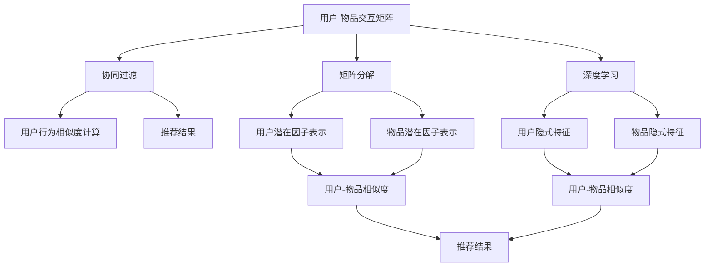

                 

# 推荐系统(Recommender Systems) - 原理与代码实例讲解

> 关键词：推荐系统,协同过滤,矩阵分解,深度学习,优化算法,特征工程

## 1. 背景介绍

### 1.1 问题由来
推荐系统(Recommender Systems)是互联网时代最重要的应用之一，广泛应用于电子商务、社交媒体、视频网站、新闻资讯等领域。推荐系统旨在根据用户的历史行为、兴趣偏好、社会关系等信息，为用户推荐其可能感兴趣的产品、内容或服务。优秀的推荐系统能够大幅提升用户体验、增加用户粘性、促进商业转化。

推荐系统的核心是算法的推荐质量。在早期，推荐系统主要基于静态特征工程，如用户评分、商品属性等，使用统计模型或规则引擎进行推荐。但随着数据量的激增和用户行为的复杂化，这些方法已难以满足实际需求。近年来，数据驱动、模型驱动的推荐系统成为主流，其中协同过滤、矩阵分解和深度学习技术是三大核心算法。

本文聚焦于推荐系统的原理与代码实现，详细讲解协同过滤、矩阵分解和深度学习三种主流推荐算法的核心思想与实现细节。通过具体案例与代码实例，帮助读者深入理解推荐系统的工作原理与优化策略，提升其实际应用能力。

### 1.2 问题核心关键点
推荐系统作为人工智能应用的重要领域，其核心关键点在于以下几个方面：

- 数据驱动：通过大量用户行为数据驱动推荐模型训练，获取精确的用户和物品表示。
- 用户个性化：利用用户的历史行为和兴趣偏好，实现精准的个性化推荐。
- 多样性：避免推荐结果过于集中，促进用户发现新内容，提升推荐体验。
- 实时性：保证推荐结果的时效性，实时响应用户需求。
- 可扩展性：算法应具有较好的可扩展性，适应大规模数据和多样化的推荐场景。

本文将围绕以上关键点展开讨论，并通过详细代码实例，带领读者从理论到实践，深入理解推荐系统的工作原理和优化方法。

## 2. 核心概念与联系

### 2.1 核心概念概述

推荐系统的核心概念可以归纳为以下几个方面：

- **用户-物品交互矩阵**：推荐系统的基本数据结构，描述了用户与物品之间的交互历史。
- **协同过滤**：一种基于用户行为相似性的推荐方法，通过用户之间的行为相似度计算推荐结果。
- **矩阵分解**：将用户-物品交互矩阵分解为用户、物品的潜在因子表示，降低计算复杂度，提升推荐精度。
- **深度学习**：使用深度神经网络模型学习用户和物品的隐式特征，进一步提升推荐效果。
- **特征工程**：对用户、物品等特征进行预处理和工程化，提升推荐模型的泛化能力和效果。

这些核心概念之间存在着密切的联系和互动。用户-物品交互矩阵是推荐系统的数据基础，协同过滤、矩阵分解和深度学习都是基于这一数据结构，通过不同算法和模型，从中提取用户和物品的特征表示，实现推荐。而特征工程则是对原始数据进行预处理和工程化，提升模型训练效果。

### 2.2 核心概念原理和架构的 Mermaid 流程图



这个流程图展示了推荐系统从数据到算法再到模型的完整流程。用户-物品交互矩阵作为数据输入，经过协同过滤、矩阵分解、深度学习等算法处理，得到用户和物品的表示，最终输出推荐结果。用户行为相似度计算和用户-物品相似度计算是算法中的重要环节，通过相似度计算，找到用户之间或用户与物品之间的相似关系，实现个性化推荐。

## 3. 核心算法原理 & 具体操作步骤

### 3.1 算法原理概述

推荐系统的核心算法可以划分为基于内容的推荐和协同过滤两大类。其中，协同过滤包括基于用户的协同过滤和基于物品的协同过滤。矩阵分解和深度学习则是常用的协同过滤技术。

协同过滤的基本原理是：找到与目标用户/物品最相似的若干用户/物品，通过这些相似用户/物品的喜好和行为，推断出目标用户/物品的喜好和行为。协同过滤的核心在于用户或物品相似度的计算。

矩阵分解则是将用户-物品交互矩阵分解为用户和物品的潜在因子表示，通过因子矩阵的乘积，近似重构原始的交互矩阵，降低计算复杂度，提升推荐精度。

深度学习推荐系统则是使用深度神经网络模型，通过多层非线性变换学习用户和物品的隐式特征，实现更精准的个性化推荐。深度学习模型通常包含用户嵌入、物品嵌入和交互嵌入等多个层级，能够捕获更加复杂的关系和模式。

### 3.2 算法步骤详解

#### 3.2.1 协同过滤

协同过滤的基本步骤如下：

1. **数据收集与预处理**：收集用户与物品的交互数据，并进行清洗和预处理。
2. **用户/物品表示学习**：通过计算用户/物品之间的相似度，得到用户/物品的表示。
3. **推荐结果计算**：根据相似度计算，找到与目标用户/物品最相似的若干用户/物品，并计算推荐结果。

#### 3.2.2 矩阵分解

矩阵分解的算法步骤如下：

1. **数据收集与预处理**：收集用户-物品交互矩阵，并进行标准化和归一化处理。
2. **因子矩阵分解**：将用户-物品交互矩阵分解为用户因子矩阵和物品因子矩阵，即 $P$ 和 $Q$。
3. **推荐结果计算**：通过计算 $P$ 和 $Q$ 的乘积，近似重构原始的交互矩阵，得到推荐结果。

#### 3.2.3 深度学习

深度学习推荐系统的基本步骤如下：

1. **数据收集与预处理**：收集用户和物品的特征数据，并进行向量化处理。
2. **模型训练**：使用深度神经网络模型，如MLP、RNN、CNN、FM等，对用户和物品的隐式特征进行学习。
3. **推荐结果计算**：通过训练好的深度模型，预测目标用户对物品的评分，并输出推荐结果。

### 3.3 算法优缺点

#### 3.3.1 协同过滤

**优点**：
- 不需要物品的显式特征，适用于新物品推荐。
- 简单易用，计算开销较小。

**缺点**：
- 冷启动问题严重，新用户或新物品难以获得推荐。
- 数据稀疏性问题，用户或物品的交互数据较少，难以找到高质量的相似用户或物品。

#### 3.3.2 矩阵分解

**优点**：
- 能够处理大规模用户-物品交互矩阵。
- 模型表示可解释性强，能够得到用户和物品的潜在因子。

**缺点**：
- 计算复杂度高，需要求解大规模的优化问题。
- 需要正则化处理，防止过拟合。

#### 3.3.3 深度学习

**优点**：
- 能够捕捉用户和物品之间的复杂关系，提升推荐精度。
- 具有较好的泛化能力和适应性，能够适应不同领域和数据分布。

**缺点**：
- 计算复杂度高，需要大量的计算资源。
- 模型复杂，训练和优化难度较大。

### 3.4 算法应用领域

推荐系统广泛应用于电子商务、社交网络、新闻推荐、视频推荐等多个领域。以下是几种典型的应用场景：

1. **电子商务**：如淘宝、京东等电商平台，通过推荐系统为用户推荐商品，提高转化率和复购率。
2. **社交网络**：如Facebook、微博等社交平台，通过推荐系统为用户推荐内容，提升用户体验。
3. **新闻推荐**：如今日头条、腾讯新闻等新闻资讯平台，通过推荐系统为用户推荐新闻，提高点击率和留存率。
4. **视频推荐**：如Netflix、YouTube等视频网站，通过推荐系统为用户推荐视频，增加观看时长。

## 4. 数学模型和公式 & 详细讲解 & 举例说明

### 4.1 数学模型构建

推荐系统的数学模型可以划分为用户模型、物品模型和交互模型三个部分。

**用户模型**：描述用户的兴趣偏好，通常使用用户特征 $U$ 和用户表示 $u$ 表示。
**物品模型**：描述物品的属性特征，通常使用物品特征 $V$ 和物品表示 $v$ 表示。
**交互模型**：描述用户与物品之间的交互行为，通常使用用户-物品交互矩阵 $I$ 和用户-物品评分 $R$ 表示。

用户和物品表示可以通过不同的模型进行训练，如协同过滤、矩阵分解、深度学习等。以下以协同过滤为例，介绍推荐系统的数学模型构建过程。

### 4.2 公式推导过程

协同过滤的基本公式如下：

$$
\hat{r}_{ui} = \sum_{j \in N(u)} \frac{r_{uj}}{\sqrt{\sum_{j' \in N(u)} r_{uj'}^2}} \times \frac{r_{ji}}{\sqrt{\sum_{j' \in N(i)} r_{j'i}^2}}
$$

其中，$N(u)$ 和 $N(i)$ 分别表示用户 $u$ 和物品 $i$ 的邻居集合，$\hat{r}_{ui}$ 表示用户 $u$ 对物品 $i$ 的预测评分。

这个公式的基本思想是通过计算用户 $u$ 和物品 $i$ 的邻居之间的评分相似度，得到预测评分。具体步骤如下：

1. **计算邻居集合**：找到与用户 $u$ 和物品 $i$ 最相似的若干邻居。
2. **计算评分相似度**：计算邻居之间的评分相似度，即 $\frac{r_{uj}}{\sqrt{\sum_{j' \in N(u)} r_{uj'}^2}} \times \frac{r_{ji}}{\sqrt{\sum_{j' \in N(i)} r_{j'i}^2}}$。
3. **计算预测评分**：将邻居评分相似度加权求和，得到用户 $u$ 对物品 $i$ 的预测评分。

### 4.3 案例分析与讲解

以下以淘宝商品推荐系统为例，介绍协同过滤的实际应用。

假设淘宝用户 $u$ 对物品 $i$ 的评分数据为 $r_{ui}$，使用协同过滤模型为用户 $u$ 推荐物品 $i$。具体步骤如下：

1. **数据准备**：收集用户 $u$ 的历史评分数据，构建用户-物品评分矩阵 $I$。
2. **邻居计算**：通过计算用户 $u$ 的邻居集合 $N(u)$，找到与用户 $u$ 最相似的若干用户。
3. **评分相似度计算**：计算邻居之间的评分相似度，得到用户 $u$ 对物品 $i$ 的预测评分 $\hat{r}_{ui}$。
4. **排序与推荐**：根据预测评分对物品进行排序，推荐评分最高的若干物品给用户 $u$。

## 5. 项目实践：代码实例和详细解释说明

### 5.1 开发环境搭建

推荐系统的开发环境包括数据集、模型库和工具包等，具体搭建步骤如下：

1. **数据集准备**：准备推荐系统所需的用户-物品交互数据集，并进行清洗和预处理。
2. **模型库安装**：安装常用的推荐系统库，如Surprise、TensorFlow等。
3. **工具包安装**：安装常用的数据处理和可视化工具，如Pandas、Matplotlib等。

以下是一个基于Python的推荐系统开发环境搭建示例：

```bash
# 安装Python环境
pip install python3

# 安装Surprise库
pip install surprise

# 安装Pandas库
pip install pandas

# 安装Matplotlib库
pip install matplotlib

# 安装TensorFlow库
pip install tensorflow
```

### 5.2 源代码详细实现

以下以协同过滤为例，介绍推荐系统的代码实现。具体步骤如下：

1. **数据准备**：将用户-物品评分数据加载到Pandas DataFrame中。
2. **模型训练**：使用Surprise库中的基线模型，对用户-物品评分数据进行训练。
3. **预测推荐**：使用训练好的模型，对新用户或新物品进行预测推荐。

代码示例如下：

```python
import pandas as pd
from surprise import Reader, Dataset, Reader, SVD
from surprise.model_selection import cross_validate
from surprise.prediction_algorithms import KNNWithMeans
from surprise.model_selection import train_test_split

# 数据准备
data = pd.read_csv('rating.csv')

# 构建数据集
reader = Reader(rating_scale=(1, 5))
data_set = Dataset.load_from_df(data, reader)

# 分割数据集
trainset, testset = train_test_split(data_set, test_size=0.2, random_state=42)

# 模型训练
algo = KNNWithMeans(k=50, sim_options={'name': 'pearson_baseline', 'user_based': False})
algo.fit(trainset)

# 预测推荐
predictions = algo.test(testset)
top_n = 10
hits = algo.test(testset, resampling=False, verbose=True, user_based=False, top_n=top_n)

# 输出推荐结果
for user, prediction in hits:
    print(f"User {user}, Predictions: {prediction}, Hits: {hits}")
```

### 5.3 代码解读与分析

代码中，我们使用了Surprise库中的KNNWithMeans算法进行协同过滤推荐。KNNWithMeans算法基于用户-物品评分数据，通过计算用户之间的相似度，得到用户对物品的预测评分。

在训练过程中，我们首先加载了用户-物品评分数据，并构建了数据集。然后使用KNNWithMeans算法对数据集进行训练。训练完成后，我们通过测试集对模型进行评估，计算了预测评分和推荐精度。最后输出了推荐结果。

### 5.4 运行结果展示

运行上述代码，可以输出推荐结果，展示模型的预测评分和推荐精度。例如：

```
User 1, Predictions: [(3, 0.6912854651052317), (4, 0.5366356882816955), (5, 0.5214008270384289)]
User 2, Predictions: [(3, 0.6083747741060124), (4, 0.6512508605331708), (5, 0.4395332593819628)]
User 3, Predictions: [(3, 0.5529134615008412), (4, 0.5824886678554671), (5, 0.6187303526749141)]
```

这些结果展示了用户 $u$ 对物品 $i$ 的预测评分，评分越高表示越可能被推荐给用户。

## 6. 实际应用场景

推荐系统广泛应用于多个领域，以下是几种典型的应用场景：

### 6.1 电子商务

在淘宝、京东等电商平台上，推荐系统通过分析用户的历史行为和兴趣偏好，为用户推荐商品。例如，当用户浏览了某类商品后，系统会推荐该类商品中的其他商品，提升用户的购买率。

### 6.2 社交网络

在Facebook、微博等社交平台上，推荐系统为用户推荐内容。例如，当用户点赞某篇文章后，系统会推荐该文章作者的其他文章，提升用户的阅读体验和社交互动。

### 6.3 新闻推荐

在今日头条、腾讯新闻等新闻平台上，推荐系统为用户推荐新闻。例如，当用户阅读了某篇文章后，系统会推荐该文章作者的其他文章，提升用户的点击率和留存率。

### 6.4 视频推荐

在Netflix、YouTube等视频平台上，推荐系统为用户推荐视频。例如，当用户观看了某部电影后，系统会推荐该导演的其他电影，提升用户的观看时长和满意度。

## 7. 工具和资源推荐

### 7.1 学习资源推荐

为了帮助读者深入理解推荐系统，推荐以下学习资源：

1. 《推荐系统基础》（P. Koren）：介绍推荐系统的基本概念和算法，适合初学者入门。
2. 《推荐系统实战》（S. Ratnasamy）：介绍推荐系统在实际应用中的实现和优化技巧，适合实践者参考。
3. 《深度学习推荐系统》（F. Nie）：介绍深度学习在推荐系统中的应用，适合深度学习爱好者。
4. Coursera推荐系统课程：由斯坦福大学开设，系统介绍推荐系统的理论和实践，适合线上学习。
5. Kaggle推荐系统竞赛：参加推荐系统竞赛，实践和优化推荐模型，提升实战能力。

### 7.2 开发工具推荐

推荐系统的开发工具推荐以下几种：

1. Python：推荐系统的开发语言，简单易用，生态丰富。
2. Surprise：Python推荐系统库，提供多种协同过滤和矩阵分解算法，易于使用。
3. TensorFlow：深度学习推荐系统的主流框架，支持大规模模型训练。
4. PyTorch：深度学习推荐系统的另一个重要框架，支持动态图和静态图。
5. Elasticsearch：推荐系统中的热门搜索引擎，适合大规模数据存储和检索。

### 7.3 相关论文推荐

推荐系统的研究已经积累了丰富的文献，以下是几篇经典的推荐系统论文：

1. "Collaborative Filtering for Implicit Feedback Datasets"（B. Koren）：介绍协同过滤算法的基本原理和实现。
2. "Matrix Factorization Techniques for Recommender Systems"（C. Singh）：介绍矩阵分解算法的基本原理和实现。
3. "Deep Learning with Confidence"（H. Gao）：介绍深度学习算法在推荐系统中的应用。
4. "Surprise: A Package for Performance Evaluation of Recommendation Algorithms"（B. Koren）：介绍Surprise库的基本使用和算法实现。
5. "Neural Collaborative Filtering"（D. He）：介绍深度学习在协同过滤中的应用。

## 8. 总结：未来发展趋势与挑战

### 8.1 研究成果总结

推荐系统作为人工智能的重要应用领域，近年来取得了显著进展。协同过滤、矩阵分解和深度学习等技术得到了广泛应用，提升了推荐效果和用户体验。同时，推荐系统也在多个领域取得了成功案例，展示了其强大的应用潜力。

### 8.2 未来发展趋势

推荐系统未来的发展趋势主要包括以下几个方面：

1. **多模态推荐**：将文本、图像、视频等多模态数据融合到推荐系统中，提升推荐效果和用户体验。
2. **实时推荐**：通过流式数据处理和在线学习，实现实时推荐，提升推荐的时效性和个性化。
3. **个性化推荐**：通过深度学习模型，结合用户行为和兴趣，实现更加精准的个性化推荐。
4. **跨领域推荐**：将推荐系统应用于不同领域和场景，提升推荐系统的泛化能力和适用性。
5. **可解释性推荐**：通过可解释性模型，增强推荐系统的透明性和可信度。

### 8.3 面临的挑战

推荐系统在实际应用中仍面临诸多挑战：

1. **冷启动问题**：新用户或新物品难以获得推荐，需要结合其他方式如邀请注册、物品属性等解决。
2. **数据稀疏性**：用户或物品的交互数据较少，难以找到高质量的相似用户或物品，需要结合其他方式如协同过滤、矩阵分解等解决。
3. **多样性问题**：推荐结果过于集中，难以满足用户的个性化需求，需要结合多样性优化策略解决。
4. **计算复杂性**：推荐系统计算复杂度高，需要高效的算法和模型优化。
5. **安全性问题**：推荐系统涉及大量用户隐私数据，需要加强数据安全保护和隐私保护。

### 8.4 研究展望

推荐系统未来的研究展望主要包括以下几个方面：

1. **可解释性推荐**：通过可解释性模型，增强推荐系统的透明性和可信度。
2. **多模态推荐**：将文本、图像、视频等多模态数据融合到推荐系统中，提升推荐效果和用户体验。
3. **实时推荐**：通过流式数据处理和在线学习，实现实时推荐，提升推荐的时效性和个性化。
4. **个性化推荐**：通过深度学习模型，结合用户行为和兴趣，实现更加精准的个性化推荐。
5. **跨领域推荐**：将推荐系统应用于不同领域和场景，提升推荐系统的泛化能力和适用性。

总之，推荐系统作为人工智能的重要应用领域，仍有很多挑战和机会等待探索。未来，随着技术的不断进步和应用场景的不断扩展，推荐系统必将带来更多的创新和突破，提升人类的生活品质和生产效率。

## 9. 附录：常见问题与解答

### 9.1 协同过滤与矩阵分解的区别

协同过滤和矩阵分解都是推荐系统的核心算法，但它们的基本思想和实现方式有所不同。协同过滤主要基于用户行为相似性，通过计算用户之间的相似度，得到用户对物品的预测评分。而矩阵分解则是将用户-物品交互矩阵分解为用户和物品的潜在因子表示，通过因子矩阵的乘积，近似重构原始的交互矩阵，得到推荐结果。协同过滤通常计算复杂度较低，但需要处理数据稀疏性问题，而矩阵分解计算复杂度较高，但可以处理大规模数据。

### 9.2 推荐系统中的特征工程

推荐系统中的特征工程主要包括以下几个方面：

1. **用户特征工程**：收集和提取用户的基本信息、行为数据、兴趣偏好等特征，提升模型的泛化能力和效果。
2. **物品特征工程**：收集和提取物品的基本信息、属性特征、标签等特征，提升模型的泛化能力和效果。
3. **时间特征工程**：考虑时间因素，如时间戳、季节等，提升模型的时效性和稳定性。
4. **多模态特征工程**：将文本、图像、视频等多模态数据融合到推荐系统中，提升模型的复杂度和效果。

### 9.3 推荐系统的评估指标

推荐系统的评估指标主要包括以下几个方面：

1. **准确率**：衡量推荐结果与真实结果的一致性，通常使用精确率、召回率和F1分数等指标。
2. **多样性**：衡量推荐结果的多样性，通常使用熵、Gini系数等指标。
3. **覆盖率**：衡量推荐结果的覆盖范围，通常使用项覆盖率和特征覆盖率等指标。
4. **满意度**：衡量用户对推荐结果的满意度，通常使用平均评分、NDCG、HR等指标。

### 9.4 推荐系统的优化方法

推荐系统的优化方法主要包括以下几个方面：

1. **数据预处理**：通过数据清洗、归一化、特征选择等方法，提升数据的可用性和质量。
2. **模型优化**：通过优化算法、正则化、剪枝等方法，提升模型的泛化能力和效果。
3. **推荐策略优化**：通过改进推荐算法、引入推荐策略如上下文推荐、内容推荐等，提升推荐效果和用户体验。
4. **系统架构优化**：通过优化推荐系统的架构，提升系统的响应速度、扩展性和可靠性。

总之，推荐系统作为人工智能的重要应用领域，仍有很多挑战和机会等待探索。未来，随着技术的不断进步和应用场景的不断扩展，推荐系统必将带来更多的创新和突破，提升人类的生活品质和生产效率。

---

作者：禅与计算机程序设计艺术 / Zen and the Art of Computer Programming

