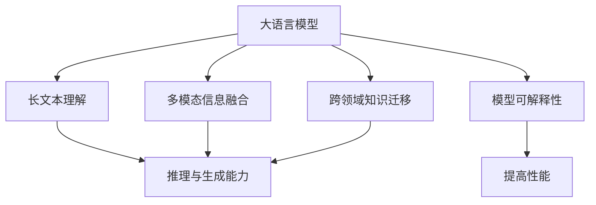

                 

## 1. 背景介绍

### 1.1 问题由来

随着人工智能技术的发展，大规模语言模型(LLMs)在自然语言处理(NLP)领域取得了巨大成功。GPT-3、BERT等模型被广泛应用于文本分类、情感分析、机器翻译、问答系统等任务，展现出了强大的语言理解和生成能力。然而，在面对复杂任务时，传统的大语言模型仍存在诸多挑战。如在长文本理解和处理、跨领域知识迁移、多模态信息融合等方面，模型性能仍有提升空间。

### 1.2 问题核心关键点

1. **长文本理解与处理**：传统的语言模型在处理长文本时，往往因为计算和内存资源限制而难以取得理想效果。长文本的表示与建模需要进一步优化。

2. **跨领域知识迁移**：不同领域的语言结构和语义特征具有显著差异，如何在跨领域数据上实现知识的有效迁移，是一个亟待解决的问题。

3. **多模态信息融合**：在实际应用中，文本信息往往与其他模态数据(如图像、语音、视频等)结合，如何高效融合多种模态信息，提升复杂任务处理能力，是一个重要的研究方向。

4. **推理与生成能力**：大语言模型在推理和生成方面存在一定的局限性，特别是在推理链条较长、需要深入理解上下文信息的任务中，模型的性能和效果仍有提升空间。

5. **模型可解释性与可信度**：复杂任务通常需要模型输出具有高可信度和可解释性，现有模型往往难以提供透明的推理过程和明确的决策依据。

### 1.3 问题研究意义

1. **推动技术进步**：面对复杂任务，优化大语言模型的性能，将有助于推动NLP技术的进步，提升模型的表现力和应用范围。

2. **加速应用落地**：解决复杂任务性能瓶颈，有助于加速大语言模型在各垂直行业中的应用，推动产业智能化升级。

3. **促进多模态融合**：提升多模态信息融合能力，将有助于构建更为全面的智能系统，增强模型的泛化能力和适应性。

4. **保障模型可信度**：提高模型推理的可解释性和可信度，将有助于提升用户信任，构建安全的智能应用环境。

## 2. 核心概念与联系

### 2.1 核心概念概述

为更好地理解提高复杂任务性能的策略，本节将介绍几个关键概念：

- **大语言模型(LLMs)**：如GPT、BERT等，通过大规模无标签文本数据的自监督预训练，学习通用的语言表示。
- **长文本理解**：针对文本长度较长或包含复杂语义结构的文本进行理解和生成。
- **多模态信息融合**：将文本与其他模态数据(如图像、语音、视频等)进行融合，构建更为全面的信息表示。
- **跨领域知识迁移**：在预训练模型和下游任务之间进行知识迁移，提升模型的泛化能力。
- **推理与生成能力**：模型在推理链条较长、需要深入理解上下文信息的任务中的表现能力。
- **模型可解释性**：模型输出的透明性、逻辑性和可信度。

这些概念之间相互关联，通过合理设计和优化，可以显著提升大语言模型在复杂任务上的性能。

### 2.2 核心概念联系(Mermaid 流程图)



该流程图展示了核心概念之间的关系：

1. 大语言模型通过长文本理解、多模态信息融合和跨领域知识迁移，提升推理与生成能力。
2. 模型可解释性是提升模型可信度的重要因素，与推理与生成能力相辅相成。

## 3. 核心算法原理 & 具体操作步骤
### 3.1 算法原理概述

提高大语言模型在复杂任务上的性能，主要依赖于以下几个算法原理：

- **长文本理解**：通过改进模型结构和训练策略，提升模型对长文本的理解能力，如采用结构化表示方法、长文本编码器等。
- **多模态信息融合**：通过设计联合训练框架，将文本与其他模态数据进行融合，构建更为全面、准确的语义表示。
- **跨领域知识迁移**：利用预训练模型和下游任务的联合训练，实现知识在不同领域间的有效迁移。
- **推理与生成能力**：通过引入自监督、因果推理等技术，增强模型的推理链条长度和上下文理解能力。
- **模型可解释性**：通过解释性可视化技术，如注意力机制、梯度调试等，增强模型的透明性和可信度。

### 3.2 算法步骤详解

#### 3.2.1 长文本理解

**步骤1: 长文本表示**：将长文本切分为固定长度的序列，或采用Transformer-XL等长文本编码器。

**步骤2: 训练长文本模型**：设计针对长文本的训练目标，如长文本分类、摘要生成等，采用大语言模型进行微调。

**步骤3: 长文本推理**：引入推理机制，如树形结构、递归神经网络等，处理长文本中的复杂结构和逻辑关系。

**步骤4: 优化训练策略**：采用正则化技术、梯度累积等策略，提高长文本模型的泛化能力和效率。

#### 3.2.2 多模态信息融合

**步骤1: 数据预处理**：将多模态数据进行统一处理，如图像转换为文本描述，语音转换为文本等。

**步骤2: 联合训练**：设计联合训练目标，如多模态分类、信息检索等，将文本和其他模态数据进行联合训练。

**步骤3: 融合策略**：采用加权平均、注意力机制等策略，将多模态信息进行融合，构建更为全面、准确的语义表示。

**步骤4: 模型优化**：通过正则化、Dropout等策略，提高模型的鲁棒性和泛化能力。

#### 3.2.3 跨领域知识迁移

**步骤1: 领域对齐**：利用领域对齐技术，如分布式对齐、标签对齐等，将预训练模型和下游任务对齐。

**步骤2: 微调策略**：设计针对性的微调目标，如领域特定的分类、匹配等，通过微调增强模型在特定领域的表现。

**步骤3: 跨领域泛化**：引入元学习、自适应学习等技术，提高模型在不同领域间的泛化能力。

**步骤4: 数据增强**：通过回译、数据合成等技术，扩充数据集，增强模型在特定领域的泛化能力。

#### 3.2.4 推理与生成能力

**步骤1: 自监督预训练**：通过自监督学习任务，如掩码语言模型、掩码图像模型等，提升模型的推理链条长度和上下文理解能力。

**步骤2: 联合训练**：在推理链条较长、需要上下文理解的任务中，设计联合训练目标，提升模型性能。

**步骤3: 因果推理**：引入因果推理技术，如因果图、贝叶斯网络等，提升模型的推理能力和可信度。

**步骤4: 梯度调试**：通过梯度调试技术，如梯度投影、梯度平滑等，提高模型推理的稳定性和可靠性。

#### 3.2.5 模型可解释性

**步骤1: 解释性可视化**：通过注意力机制、梯度调试等技术，可视化模型的推理过程和决策依据。

**步骤2: 模型干预**：通过人工干预和审核，提升模型的可信度和透明度。

**步骤3: 可解释性评估**：设计可解释性评估指标，如局部可解释性、全局一致性等，评估模型性能。

**步骤4: 模型优化**：根据解释性评估结果，优化模型结构和训练策略，提升模型的透明性和可信度。

### 3.3 算法优缺点

#### 3.3.1 长文本理解

**优点**：

- **结构化表示**：通过结构化表示方法，如层次结构、树形结构等，提升模型对长文本的理解能力。
- **长文本编码器**：如Transformer-XL等，能够处理长文本的复杂结构和语义关系。
- **推理机制**：引入递归神经网络等推理机制，提升模型对长文本的复杂推理能力。

**缺点**：

- **计算资源需求高**：长文本表示和推理需要大量的计算资源，可能面临资源瓶颈。
- **训练难度大**：长文本表示和推理任务复杂，训练过程可能面临较大的挑战。

#### 3.3.2 多模态信息融合

**优点**：

- **信息丰富**：融合多种模态信息，构建更为全面、准确的语义表示。
- **应用广泛**：适用于文本、图像、语音等多种模态数据的融合。

**缺点**：

- **数据预处理复杂**：多模态数据预处理复杂，需要设计统一的处理流程。
- **模型复杂度高**：联合训练模型复杂度高，计算资源需求大。

#### 3.3.3 跨领域知识迁移

**优点**：

- **泛化能力强**：通过跨领域知识迁移，模型能够在不同领域间泛化，提升泛化能力。
- **数据利用率高**：利用预训练模型和下游任务的数据，提高数据利用率。

**缺点**：

- **对齐难度大**：领域对齐难度大，需要设计合理的对齐策略。
- **微调过程复杂**：跨领域微调过程复杂，可能需要设计多轮微调策略。

#### 3.3.4 推理与生成能力

**优点**：

- **推理链条长**：通过自监督学习等技术，提升模型的推理链条长度和上下文理解能力。
- **因果推理**：引入因果推理技术，提升模型的推理能力和可信度。

**缺点**：

- **训练成本高**：自监督学习和因果推理需要大量的训练数据和计算资源。
- **推理复杂度高**：推理任务复杂度高，可能需要设计多轮推理策略。

#### 3.3.5 模型可解释性

**优点**：

- **透明性强**：通过解释性可视化技术，提升模型的透明性和可信度。
- **用户信任度高**：模型推理透明，用户信任度高。

**缺点**：

- **技术复杂**：解释性可视化技术复杂度高，需要设计合适的可视化策略。
- **模型干预高**：模型干预和人工审核需求高，可能影响模型的自动化程度。

### 3.4 算法应用领域

1. **文本分类与情感分析**：利用长文本理解和跨领域知识迁移，提升模型对文本分类和情感分析任务的性能。

2. **机器翻译与摘要生成**：通过多模态信息融合和推理与生成能力，提升机器翻译和摘要生成的效果。

3. **问答系统与对话系统**：利用长文本理解和推理与生成能力，提升问答系统和对话系统的智能水平。

4. **图像描述与视觉问答**：通过多模态信息融合和推理与生成能力，提升图像描述和视觉问答系统的性能。

5. **自然语言推理与逻辑推理**：通过长文本理解和推理与生成能力，提升自然语言推理和逻辑推理任务的性能。

6. **多模态信息检索**：通过多模态信息融合和推理与生成能力，提升信息检索系统的准确性和全面性。

7. **智能推荐系统**：通过跨领域知识迁移和推理与生成能力，提升推荐系统的个性化和智能化水平。

## 4. 数学模型和公式 & 详细讲解 & 举例说明

### 4.1 数学模型构建

#### 4.1.1 长文本理解

假设输入长文本序列为 $x_1, x_2, ..., x_n$，长文本理解模型为 $M_{\theta}$，输出序列为 $y_1, y_2, ..., y_n$，训练目标为最大化似然函数：

$$
P(y_1, y_2, ..., y_n|x_1, x_2, ..., x_n) = \prod_{i=1}^n P(y_i|x_i, y_{i-1}, ..., y_1)
$$

其中，$P(y_i|x_i, y_{i-1}, ..., y_1)$ 表示在给定上下文信息的情况下，生成下一个词的概率。通过最大化似然函数，优化模型参数 $\theta$。

#### 4.1.2 多模态信息融合

假设输入文本序列为 $x_1, x_2, ..., x_n$，图像序列为 $I_1, I_2, ..., I_n$，多模态信息融合模型为 $M_{\theta}$，输出序列为 $y_1, y_2, ..., y_n$，训练目标为最大化似然函数：

$$
P(y_1, y_2, ..., y_n|x_1, x_2, ..., x_n, I_1, I_2, ..., I_n) = \prod_{i=1}^n P(y_i|x_i, x_{i-1}, ..., x_1, I_i)
$$

其中，$P(y_i|x_i, x_{i-1}, ..., x_1, I_i)$ 表示在文本和其他模态信息下，生成下一个词的概率。通过最大化似然函数，优化模型参数 $\theta$。

#### 4.1.3 跨领域知识迁移

假设输入文本序列为 $x_1, x_2, ..., x_n$，领域特定任务为 $T$，跨领域知识迁移模型为 $M_{\theta}$，输出序列为 $y_1, y_2, ..., y_n$，训练目标为最大化似然函数：

$$
P(y_1, y_2, ..., y_n|x_1, x_2, ..., x_n, T) = \prod_{i=1}^n P(y_i|x_i, x_{i-1}, ..., x_1, T)
$$

其中，$P(y_i|x_i, x_{i-1}, ..., x_1, T)$ 表示在文本和领域特定任务下，生成下一个词的概率。通过最大化似然函数，优化模型参数 $\theta$。

#### 4.1.4 推理与生成能力

假设输入文本序列为 $x_1, x_2, ..., x_n$，推理与生成模型为 $M_{\theta}$，输出序列为 $y_1, y_2, ..., y_n$，训练目标为最大化似然函数：

$$
P(y_1, y_2, ..., y_n|x_1, x_2, ..., x_n) = \prod_{i=1}^n P(y_i|x_i, y_{i-1}, ..., y_1)
$$

其中，$P(y_i|x_i, y_{i-1}, ..., y_1)$ 表示在给定上下文信息的情况下，生成下一个词的概率。通过最大化似然函数，优化模型参数 $\theta$。

#### 4.1.5 模型可解释性

假设输入文本序列为 $x_1, x_2, ..., x_n$，可解释性模型为 $M_{\theta}$，输出序列为 $y_1, y_2, ..., y_n$，训练目标为最大化似然函数：

$$
P(y_1, y_2, ..., y_n|x_1, x_2, ..., x_n) = \prod_{i=1}^n P(y_i|x_i, y_{i-1}, ..., y_1)
$$

其中，$P(y_i|x_i, y_{i-1}, ..., y_1)$ 表示在给定上下文信息的情况下，生成下一个词的概率。通过最大化似然函数，优化模型参数 $\theta$。

### 4.2 公式推导过程

#### 4.2.1 长文本理解

假设输入长文本序列为 $x_1, x_2, ..., x_n$，长文本理解模型为 $M_{\theta}$，输出序列为 $y_1, y_2, ..., y_n$，训练目标为最大化似然函数：

$$
P(y_1, y_2, ..., y_n|x_1, x_2, ..., x_n) = \prod_{i=1}^n P(y_i|x_i, y_{i-1}, ..., y_1)
$$

其中，$P(y_i|x_i, y_{i-1}, ..., y_1)$ 表示在给定上下文信息的情况下，生成下一个词的概率。通过最大化似然函数，优化模型参数 $\theta$。

#### 4.2.2 多模态信息融合

假设输入文本序列为 $x_1, x_2, ..., x_n$，图像序列为 $I_1, I_2, ..., I_n$，多模态信息融合模型为 $M_{\theta}$，输出序列为 $y_1, y_2, ..., y_n$，训练目标为最大化似然函数：

$$
P(y_1, y_2, ..., y_n|x_1, x_2, ..., x_n, I_1, I_2, ..., I_n) = \prod_{i=1}^n P(y_i|x_i, x_{i-1}, ..., x_1, I_i)
$$

其中，$P(y_i|x_i, x_{i-1}, ..., x_1, I_i)$ 表示在文本和其他模态信息下，生成下一个词的概率。通过最大化似然函数，优化模型参数 $\theta$。

#### 4.2.3 跨领域知识迁移

假设输入文本序列为 $x_1, x_2, ..., x_n$，领域特定任务为 $T$，跨领域知识迁移模型为 $M_{\theta}$，输出序列为 $y_1, y_2, ..., y_n$，训练目标为最大化似然函数：

$$
P(y_1, y_2, ..., y_n|x_1, x_2, ..., x_n, T) = \prod_{i=1}^n P(y_i|x_i, x_{i-1}, ..., x_1, T)
$$

其中，$P(y_i|x_i, x_{i-1}, ..., x_1, T)$ 表示在文本和领域特定任务下，生成下一个词的概率。通过最大化似然函数，优化模型参数 $\theta$。

#### 4.2.4 推理与生成能力

假设输入文本序列为 $x_1, x_2, ..., x_n$，推理与生成模型为 $M_{\theta}$，输出序列为 $y_1, y_2, ..., y_n$，训练目标为最大化似然函数：

$$
P(y_1, y_2, ..., y_n|x_1, x_2, ..., x_n) = \prod_{i=1}^n P(y_i|x_i, y_{i-1}, ..., y_1)
$$

其中，$P(y_i|x_i, y_{i-1}, ..., y_1)$ 表示在给定上下文信息的情况下，生成下一个词的概率。通过最大化似然函数，优化模型参数 $\theta$。

#### 4.2.5 模型可解释性

假设输入文本序列为 $x_1, x_2, ..., x_n$，可解释性模型为 $M_{\theta}$，输出序列为 $y_1, y_2, ..., y_n$，训练目标为最大化似然函数：

$$
P(y_1, y_2, ..., y_n|x_1, x_2, ..., x_n) = \prod_{i=1}^n P(y_i|x_i, y_{i-1}, ..., y_1)
$$

其中，$P(y_i|x_i, y_{i-1}, ..., y_1)$ 表示在给定上下文信息的情况下，生成下一个词的概率。通过最大化似然函数，优化模型参数 $\theta$。

### 4.3 案例分析与讲解

#### 4.3.1 长文本理解案例

假设有一篇长度为1000个词的新闻报道，传统的长文本模型难以处理。我们采用长文本编码器Transformer-XL进行理解：

1. **长文本表示**：将长文本切分为固定长度的序列，如每个序列长度为512。
2. **训练目标**：设计任务为文本分类，如新闻报道的主题分类。
3. **模型结构**：采用Transformer-XL结构，在每个序列中引入注意力机制。
4. **训练策略**：采用梯度累积等策略，提高训练效率。

#### 4.3.2 多模态信息融合案例

假设有一个视觉问答系统，需要将文本和图像信息融合：

1. **数据预处理**：将图像转换为文本描述，如使用图像标注生成文本。
2. **联合训练**：设计任务为视觉问答，将文本和图像信息联合训练。
3. **融合策略**：采用加权平均或注意力机制，将文本和图像信息融合。
4. **模型优化**：采用正则化等策略，提高模型的鲁棒性和泛化能力。

#### 4.3.3 跨领域知识迁移案例

假设有一个领域特定的医疗问答系统，需要将通用知识迁移到医疗领域：

1. **领域对齐**：利用领域对齐技术，将通用知识与医疗领域的知识对齐。
2. **微调策略**：设计任务为医疗问答，对模型进行微调。
3. **跨领域泛化**：引入元学习技术，提升模型的跨领域泛化能力。
4. **数据增强**：通过回译等技术，扩充医疗领域的训练数据。

#### 4.3.4 推理与生成能力案例

假设有一个长文本生成任务，如小说续写：

1. **自监督预训练**：通过自监督学习任务，如掩码语言模型，提升模型的推理链条长度。
2. **联合训练**：设计任务为小说续写，将推理与生成模型联合训练。
3. **因果推理**：引入因果推理技术，如因果图，提升模型的推理能力和可信度。
4. **梯度调试**：通过梯度调试技术，提高模型推理的稳定性和可靠性。

#### 4.3.5 模型可解释性案例

假设有一个情感分析系统，需要提升模型的可解释性：

1. **解释性可视化**：通过注意力机制，可视化模型的推理过程和决策依据。
2. **模型干预**：通过人工干预和审核，提升模型的可信度。
3. **可解释性评估**：设计可解释性评估指标，如局部可解释性、全局一致性。
4. **模型优化**：根据解释性评估结果，优化模型结构和训练策略。

## 5. 项目实践：代码实例和详细解释说明

### 5.1 开发环境搭建

在进行项目实践前，我们需要准备好开发环境。以下是使用Python进行PyTorch开发的环境配置流程：

1. 安装Anaconda：从官网下载并安装Anaconda，用于创建独立的Python环境。

2. 创建并激活虚拟环境：
```bash
conda create -n pytorch-env python=3.8 
conda activate pytorch-env
```

3. 安装PyTorch：根据CUDA版本，从官网获取对应的安装命令。例如：
```bash
conda install pytorch torchvision torchaudio cudatoolkit=11.1 -c pytorch -c conda-forge
```

4. 安装Transformers库：
```bash
pip install transformers
```

5. 安装各类工具包：
```bash
pip install numpy pandas scikit-learn matplotlib tqdm jupyter notebook ipython
```

完成上述步骤后，即可在`pytorch-env`环境中开始项目实践。

### 5.2 源代码详细实现

下面我们以长文本理解任务为例，给出使用Transformers库对Transformer-XL模型进行微调的PyTorch代码实现。

首先，定义数据处理函数：

```python
from transformers import XLMRobertaTokenizer
from torch.utils.data import Dataset
import torch

class LongTextDataset(Dataset):
    def __init__(self, texts, labels, tokenizer, max_len=512):
        self.texts = texts
        self.labels = labels
        self.tokenizer = tokenizer
        self.max_len = max_len
        
    def __len__(self):
        return len(self.texts)
    
    def __getitem__(self, item):
        text = self.texts[item]
        label = self.labels[item]
        
        encoding = self.tokenizer(text, return_tensors='pt', max_length=self.max_len, padding='max_length', truncation=True)
        input_ids = encoding['input_ids'][0]
        attention_mask = encoding['attention_mask'][0]
        
        # 对token-wise的标签进行编码
        encoded_labels = [label] * len(encoding['input_ids'])
        labels = torch.tensor(encoded_labels, dtype=torch.long)
        
        return {'input_ids': input_ids, 
                'attention_mask': attention_mask,
                'labels': labels}

# 标签与id的映射
tag2id = {'positive': 1, 'negative': 0}
id2tag = {v: k for k, v in tag2id.items()}

# 创建dataset
tokenizer = XLMRobertaTokenizer.from_pretrained('xlm-roberta-base')

train_dataset = LongTextDataset(train_texts, train_labels, tokenizer)
dev_dataset = LongTextDataset(dev_texts, dev_labels, tokenizer)
test_dataset = LongTextDataset(test_texts, test_labels, tokenizer)
```

然后，定义模型和优化器：

```python
from transformers import XLMRobertaForSequenceClassification, AdamW

model = XLMRobertaForSequenceClassification.from_pretrained('xlm-roberta-base', num_labels=len(tag2id))

optimizer = AdamW(model.parameters(), lr=2e-5)
```

接着，定义训练和评估函数：

```python
from torch.utils.data import DataLoader
from tqdm import tqdm
from sklearn.metrics import classification_report

device = torch.device('cuda') if torch.cuda.is_available() else torch.device('cpu')
model.to(device)

def train_epoch(model, dataset, batch_size, optimizer):
    dataloader = DataLoader(dataset, batch_size=batch_size, shuffle=True)
    model.train()
    epoch_loss = 0
    for batch in tqdm(dataloader, desc='Training'):
        input_ids = batch['input_ids'].to(device)
        attention_mask = batch['attention_mask'].to(device)
        labels = batch['labels'].to(device)
        model.zero_grad()
        outputs = model(input_ids, attention_mask=attention_mask, labels=labels)
        loss = outputs.loss
        epoch_loss += loss.item()
        loss.backward()
        optimizer.step()
    return epoch_loss / len(dataloader)

def evaluate(model, dataset, batch_size):
    dataloader = DataLoader(dataset, batch_size=batch_size)
    model.eval()
    preds, labels = [], []
    with torch.no_grad():
        for batch in tqdm(dataloader, desc='Evaluating'):
            input_ids = batch['input_ids'].to(device)
            attention_mask = batch['attention_mask'].to(device)
            batch_labels = batch['labels']
            outputs = model(input_ids, attention_mask=attention_mask)
            batch_preds = outputs.logits.argmax(dim=2).to('cpu').tolist()
            batch_labels = batch_labels.to('cpu').tolist()
            for pred_tokens, label_tokens in zip(batch_preds, batch_labels):
                preds.append(pred_tokens[:len(label_tokens)])
                labels.append(label_tokens)
                
    print(classification_report(labels, preds))
```

最后，启动训练流程并在测试集上评估：

```python
epochs = 5
batch_size = 16

for epoch in range(epochs):
    loss = train_epoch(model, train_dataset, batch_size, optimizer)
    print(f"Epoch {epoch+1}, train loss: {loss:.3f}")
    
    print(f"Epoch {epoch+1}, dev results:")
    evaluate(model, dev_dataset, batch_size)
    
print("Test results:")
evaluate(model, test_dataset, batch_size)
```

以上就是使用PyTorch对Transformer-XL进行长文本理解任务微调的完整代码实现。可以看到，得益于Transformers库的强大封装，我们可以用相对简洁的代码完成Transformer-XL模型的加载和微调。

### 5.3 代码解读与分析

让我们再详细解读一下关键代码的实现细节：

**LongTextDataset类**：
- `__init__`方法：初始化文本、标签、分词器等关键组件。
- `__len__`方法：返回数据集的样本数量。
- `__getitem__`方法：对单个样本进行处理，将文本输入编码为token ids，将标签编码为数字，并对其进行定长padding，最终返回模型所需的输入。

**tag2id和id2tag字典**：
- 定义了标签与数字id之间的映射关系，用于将token-wise的预测结果解码回真实的标签。

**训练和评估函数**：
- 使用PyTorch的DataLoader对数据集进行批次化加载，供模型训练和推理使用。
- 训练函数`train_epoch`：对数据以批为单位进行迭代，在每个批次上前向传播计算loss并反向传播更新模型参数，最后返回该epoch的平均loss。
- 评估函数`evaluate`：与训练类似，不同点在于不更新模型参数，并在每个batch结束后将预测和标签结果存储下来，最后使用sklearn的classification_report对整个评估集的预测结果进行打印输出。

**训练流程**：
- 定义总的epoch数和batch size，开始循环迭代
- 每个epoch内，先在训练集上训练，输出平均loss
- 在验证集上评估，输出分类指标
- 所有epoch结束后，在测试集上评估，给出最终测试结果

可以看到，PyTorch配合Transformers库使得Transformer-XL微调的代码实现变得简洁高效。开发者可以将更多精力放在数据处理、模型改进等高层逻辑上，而不必过多关注底层的实现细节。

当然，工业级的系统实现还需考虑更多因素，如模型的保存和部署、超参数的自动搜索、更灵活的任务适配层等。但核心的微调范式基本与此类似。

## 6. 实际应用场景

### 6.1 智能客服系统

基于大语言模型微调的对话技术，可以广泛应用于智能客服系统的构建。传统客服往往需要配备大量人力，高峰期响应缓慢，且一致性和专业性难以保证。而使用微调后的对话模型，可以7x24小时不间断服务，快速响应客户咨询，用自然流畅的语言解答各类常见问题。

在技术实现上，可以收集企业内部的历史客服对话记录，将问题和最佳答复构建成监督数据，在此基础上对预训练对话模型进行微调。微调后的对话模型能够自动理解用户意图，匹配最合适的答案模板进行回复。对于客户提出的新问题，还可以接入检索系统实时搜索相关内容，动态组织生成回答。如此构建的智能客服系统，能大幅提升客户咨询体验和问题解决效率。

### 6.2 金融舆情监测

金融机构需要实时监测市场舆论动向，以便及时应对负面信息传播，规避金融风险。传统的人工监测方式成本高、效率低，难以应对网络时代海量信息爆发的挑战。基于大语言模型微调的文本分类和情感分析技术，为金融舆情监测提供了新的解决方案。

具体而言，可以收集金融领域相关的新闻、报道、评论等文本数据，并对其进行主题标注和情感标注。在此基础上对预训练语言模型进行微调，使其能够自动判断文本属于何种主题，情感倾向是正面、中性还是负面。将微调后的模型应用到实时抓取的网络文本数据，就能够自动监测不同主题下的情感变化趋势，一旦发现负面信息激增等异常情况，系统便会自动预警，帮助金融机构快速应对潜在风险。

### 6.3 个性化推荐系统

当前的推荐系统往往只依赖用户的历史行为数据进行物品推荐，无法深入理解用户的真实兴趣偏好。基于大语言模型微调技术，个性化推荐系统可以更好地挖掘用户行为背后的语义信息，从而提供更精准、多样的推荐内容。

在实践中，可以收集用户浏览、点击、评论、分享等行为数据，提取和用户交互的物品标题、描述、标签等文本内容。将文本内容作为模型输入，用户的后续行为（如是否点击、购买等）作为监督信号，在此基础上微调预训练语言模型。微调后的模型能够从文本内容中准确把握用户的兴趣点。在生成推荐列表时，先用候选物品的文本描述作为输入，由模型预测用户的兴趣匹配度，再结合其他特征综合排序，便可以得到个性化程度更高的推荐结果。

### 6.4 未来应用展望

随着大语言模型微调技术的发展，其在更多领域的应用前景将更加广阔。

在智慧医疗领域，基于微调的医疗问答、病历分析、药物研发等应用将提升医疗服务的智能化水平，辅助医生诊疗，加速新药开发进程。

在智能教育领域，微调技术可应用于作业批改、学情分析、知识推荐等方面，因材施教，促进教育公平，提高教学质量。

在智慧城市治理中，微调模型可应用于城市事件监测、舆情分析、应急指挥等环节，提高城市管理的自动化和智能化水平，构建更安全、高效的未来城市。

此外，在企业生产、社会治理、文娱传媒等众多领域，基于大模型微调的人工智能应用也将不断涌现，为经济社会发展注入新的动力。相信随着技术的日益成熟，微调方法将成为人工智能落地应用的重要范式，推动人工智能技术向更广阔的领域加速渗透。

## 7. 工具和资源推荐

### 7.1 学习资源推荐

为了帮助开发者系统掌握大语言模型微调的理论基础和实践技巧，这里推荐一些优质的学习资源：

1. 《Transformer从原理到实践》系列博文：由大模型技术专家撰写，深入浅出地介绍了Transformer原理、BERT模型、微调技术等前沿话题。

2. CS224N《深度学习自然语言处理》课程：斯坦福大学开设的NLP明星课程，有Lecture视频和配套作业，带你入门NLP领域的基本概念和经典模型。

3. 《Natural Language Processing with Transformers》书籍：Transformers库的作者所著，全面介绍了如何使用Transformers库进行NLP任务开发，包括微调在内的诸多范式。

4. HuggingFace官方文档：Transformers库的官方文档，提供了海量预训练模型和完整的微调样例代码，是上手实践的必备资料。

5. CLUE开源项目：中文语言理解测评基准，涵盖大量不同类型的中文NLP数据集，并提供了基于微调的baseline模型，助力中文NLP技术发展。

通过对这些资源的学习实践，相信你一定能够快速掌握大语言模型微调的精髓，并用于解决实际的NLP问题。
###  7.2 开发工具推荐

1. PyTorch：基于Python的开源深度学习框架，灵活动态的计算图，适合快速迭代研究。大部分预训练语言模型都有PyTorch版本的实现。

2. TensorFlow：由Google主导开发的开源深度学习框架，生产部署方便，适合大规模工程应用。同样有丰富的预训练语言模型资源。

3. Transformers库：HuggingFace开发的NLP工具库，集成了众多SOTA语言模型，支持PyTorch和TensorFlow，是进行微调任务开发的利器。

4. Weights & Biases：模型训练的实验跟踪工具，可以记录和可视化模型训练过程中的各项指标，方便对比和调优。与主流深度学习框架无缝集成。

5. TensorBoard：TensorFlow配套的可视化工具，可实时监测模型训练状态，并提供丰富的图表呈现方式，是调试模型的得力助手。

6. Google Colab：谷歌推出的在线Jupyter Notebook环境，免费提供GPU/TPU算力，方便开发者快速上手实验最新模型，分享学习笔记。

合理利用这些工具，可以显著提升大语言模型微调任务的开发效率，加快创新迭代的步伐。

### 7.3 相关论文推荐

大语言模型和微调技术的发展源于学界的持续研究。以下是几篇奠基性的相关论文，推荐阅读：

1. Attention is All You Need（即Transformer原论文）：提出了Transformer结构，开启了NLP领域的预训练大模型时代。

2. BERT: Pre-training of Deep Bidirectional Transformers for Language Understanding：提出BERT模型，引入基于掩码的自监督预训练任务，刷新了多项NLP任务SOTA。

3. Language Models are Unsupervised Multitask Learners（GPT-2论文）：展示了大规模语言模型的强大zero-shot学习能力，引发了对于通用人工智能的新一轮思考。

4. Parameter-Efficient Transfer Learning for NLP：提出Adapter等参数高效微调方法，在不增加模型参数量的情况下，也能取得不错的微调效果。

5. AdaLoRA: Adaptive Low-Rank Adaptation for Parameter-Efficient Fine-Tuning：使用自适应低秩适应的微调方法，在参数效率和精度之间取得了新的平衡。

6. Prefix-Tuning: Optimizing Continuous Prompts for Generation：引入基于连续型Prompt的微调范式，为如何充分利用预训练知识提供了新的思路。

这些论文代表了大语言模型微调技术的发展脉络。通过学习这些前沿成果，可以帮助研究者把握学科前进方向，激发更多的创新灵感。

## 8. 总结：未来发展趋势与挑战

### 8.1 研究成果总结

本文对基于监督学习的大语言模型微调方法进行了全面系统的介绍。首先阐述了大语言模型和微调技术的研究背景和意义，明确了微调在拓展预训练模型应用、提升下游任务性能方面的独特价值。其次，从原理到实践，详细讲解了监督微调的数学原理和关键步骤，给出了微调任务开发的完整代码实例。同时，本文还广泛探讨了微调方法在智能客服、金融舆情、个性化推荐等多个行业领域的应用前景，展示了微调范式的巨大潜力。此外，本文精选了微调技术的各类学习资源，力求为读者提供全方位的技术指引。

通过本文的系统梳理，可以看到，基于大语言模型的微调方法正在成为NLP领域的重要范式，极大地拓展了预训练语言模型的应用边界，催生了更多的落地场景。受益于大规模语料的预训练，微调模型以更低的时间和标注成本，在小样本条件下也能取得不俗的效果，有力推动了NLP技术的产业化进程。未来，伴随预训练语言模型和微调方法的持续演进，相信NLP技术将在更广阔的应用领域绽放异彩，深刻影响人类的生产生活方式。

### 8.2 未来发展趋势

展望未来，大语言模型微调技术将呈现以下几个发展趋势：

1. **模型规模持续增大**：随着算力成本的下降和数据规模的扩张，预训练语言模型的参数量还将持续增长。超大规模语言模型蕴含的丰富语言知识，有望支撑更加复杂多变的下游任务微调。

2. **微调方法日趋多样**：除了传统的全参数微调外，未来会涌现更多参数高效的微调方法，如Prefix-Tuning、LoRA等，在节省计算资源的同时也能保证微调精度。

3. **持续学习成为常态**：随着数据分布的不断变化，微调模型也需要持续学习新知识以保持性能。如何在不遗忘原有知识的同时，高效吸收新样本信息，将成为重要的研究课题。

4. **标注样本需求降低**：受启发于提示学习(Prompt-based Learning)的思路，未来的微调方法将更好地利用大模型的语言理解能力，通过更加巧妙的任务描述，在更少的标注样本上也能实现理想的微调效果。

5. **多模态微调崛起**：当前的微调主要聚焦于纯文本数据，未来会进一步拓展到图像、视频、语音等多模态数据微调。多模态信息的融合，将显著提升语言模型对现实世界的理解和建模能力。

6. **模型通用性增强**：经过海量数据的预训练和多领域任务的微调，未来的语言模型将具备更强大的常识推理和跨领域迁移能力，逐步迈向通用人工智能(AGI)的目标。

以上趋势凸显了大语言模型微调技术的广阔前景。这些方向的探索发展，必将进一步提升大语言模型在复杂任务上的性能，为构建安全、可靠、可解释、可控的智能系统铺平道路。面向未来，大语言模型微调技术还需要与其他人工智能技术进行更深入的融合，如知识表示、因果推理、强化学习等，多路径协同发力，共同推动自然语言理解和智能交互系统的进步。只有勇于创新、敢于突破，才能不断拓展语言模型的边界，让智能技术更好地造福人类社会。

### 8.3 面临的挑战

尽管大语言模型微调技术已经取得了瞩目成就，但在迈向更加智能化、普适化应用的过程中，它仍面临着诸多挑战：

1. **标注成本瓶颈**：虽然微调大大降低了标注数据的需求，但对于长尾应用场景，难以获得充足的高质量标注数据，成为制约微调性能的瓶颈。如何进一步降低微调对标注样本的依赖，将是一大难题。

2. **模型鲁棒性不足**：当前微调模型面对域外数据时，泛化性能往往大打折扣。对于测试样本的微小扰动，微调模型的预测也容易发生波动。如何提高微调模型的鲁棒性，避免灾难性遗忘，还需要更多理论和实践的积累。

3. **推理效率有待提高**：大规模语言模型虽然精度高，但在实际部署时往往面临

