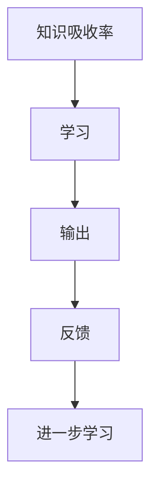

                 

## 1. 背景介绍

在信息爆炸的时代，知识的获取变得越来越容易，但知识的吸收与利用却成为了新的挑战。研究表明，大量且持续的知识输出是提高知识吸收率的关键。本文将探讨大量输出对知识吸收率提升的重要性，分析如何通过大量输出促进知识吸收，并展望其在教育、企业培训等领域的应用前景。

## 2. 核心概念与联系

### 2.1 核心概念概述

为更好地理解大量输出对知识吸收率提升的作用，本节将介绍几个关键概念：

- **知识吸收率（Knowledge Acquisition Rate, KAR）**：指个体在一定时间内掌握并能够应用新知识的比例。
- **学习（Learning）**：通过学习新知识来提高知识吸收率的过程。
- **输出（Output）**：将所学知识以各种形式表达出来的行为，如写作、教学、演讲等。
- **反馈（Feedback）**：学习过程中通过输出获取的反馈信息，用于指导后续学习。
- **深度学习（Deep Learning）**：一种基于神经网络的学习方法，通过大量数据和复杂模型进行深度特征提取，进而提升学习效果。

这些概念之间的逻辑关系可以通过以下Mermaid流程图来展示：



这个流程图展示了一个完整的学习循环：通过学习获取知识，通过输出表达知识，通过反馈指导学习，形成正反馈循环，不断提升知识吸收率。

### 2.2 核心概念原理和架构

知识吸收率的提升原理基于“费曼学习法”，该方法强调通过教学来加深理解。费曼学习法认为，学习的过程中，能够将所学知识教给他人，说明你已经真正理解并掌握了该知识。大量输出即是这一原理在现代学习中的具体应用。

深度学习模型中的“双向传播”和“自监督学习”也是大量输出的相关概念。双向传播通过前向和后向传播的方式，使得模型能够深度学习数据的特征，提高模型泛化能力；自监督学习通过大量无标签数据的预训练，让模型在未被标注的数据上学习知识，提升模型的泛化能力和学习效率。

这些原理和架构展示了大量输出在提高知识吸收率中的重要作用。通过大量输出，学习者可以更好地理解、掌握和应用所学知识，同时通过反馈进一步优化学习过程。

## 3. 核心算法原理 & 具体操作步骤

### 3.1 算法原理概述

大量输出的核心算法原理主要包括以下几个方面：

1. **信息提取**：通过深度学习模型对输入数据进行特征提取，构建高维特征表示。
2. **知识表达**：将提取的高维特征表示通过各种形式（如文字、图像、音频等）进行输出。
3. **反馈循环**：通过输出获取反馈信息，用于指导后续学习，形成正反馈循环，不断提升知识吸收率。

这些原理在知识吸收过程中起到了关键作用。通过信息提取和知识表达，学习者能够更好地理解和应用所学知识；通过反馈循环，学习者可以不断优化学习过程，提升学习效率。

### 3.2 算法步骤详解

大量输出的操作步骤主要包括以下几个步骤：

1. **数据准备**：收集大量无标签数据，进行数据预处理和特征提取。
2. **模型选择**：选择适合的深度学习模型进行特征提取和知识表达。
3. **知识输出**：通过文字、图像、音频等多种形式输出所学知识。
4. **反馈获取**：通过各种方式获取输出信息的反馈，如用户评价、测试成绩等。
5. **迭代学习**：根据反馈信息，不断调整学习策略和模型参数，优化学习效果。

### 3.3 算法优缺点

大量输出的算法优点包括：

- **高效性**：通过大量数据和复杂模型，可以快速获取知识的高维表示。
- **多样性**：通过多种形式的知识输出，提高学习的互动性和趣味性。
- **反馈有效性**：通过反馈信息指导后续学习，提高学习效率。

其缺点包括：

- **资源消耗大**：需要大量计算资源和数据支持，对硬件和网络要求较高。
- **模型复杂度高**：深度学习模型的复杂性增加了调试和优化的难度。
- **输出质量不确定**：知识输出形式的多样性可能导致输出质量不稳定，需要进行优化。

### 3.4 算法应用领域

大量输出的算法在多个领域中得到了广泛应用，例如：

- **教育**：通过在线教育平台，学生可以通过大量输出的方式学习新知识，并通过作业、测试等形式获取反馈，不断优化学习效果。
- **企业培训**：通过内部培训系统和外部学习平台，员工可以通过大量输出的方式掌握新技能，并通过项目实践和反馈不断提升学习效果。
- **学术研究**：通过论文发表、项目演示等方式，研究人员可以通过大量输出的方式分享研究成果，并通过同行评审和反馈不断优化研究过程。

## 4. 数学模型和公式 & 详细讲解 & 举例说明

### 4.1 数学模型构建

大量输出的数学模型可以基于深度学习模型构建，以Transformer模型为例，其数学模型如下：

$$
\text{Output} = \text{Transformer}(\text{Input}, \theta)
$$

其中，$\text{Input}$ 为输入数据，$\theta$ 为模型的参数。

### 4.2 公式推导过程

以Transformer模型为例，其前向传播过程包括编码器和解码器。编码器将输入数据进行编码，解码器将编码结果进行解码，得到输出结果。具体公式如下：

$$
\text{Encoder}(\text{Input}) = \text{Attention}(\text{Input}, \text{Query}, \text{Key}, \text{Value})
$$

$$
\text{Decoder}(\text{Encoder Output}) = \text{Attention}(\text{Encoder Output}, \text{Query}, \text{Key}, \text{Value}) + \text{Attention}(\text{Input}, \text{Query}, \text{Key}, \text{Value})
$$

其中，$\text{Attention}$ 表示注意力机制，$\text{Query}, \text{Key}, \text{Value}$ 为注意力机制的输入，用于计算注意力权重。

### 4.3 案例分析与讲解

以自然语言处理（NLP）中的文本分类任务为例，使用Transformer模型进行大量输出的过程如下：

1. **数据准备**：收集大量的文本数据，进行预处理，如分词、去除停用词等。
2. **模型选择**：选择Transformer模型进行特征提取。
3. **知识表达**：将提取的特征表示进行编码和解码，得到分类结果。
4. **知识输出**：将分类结果输出为文本形式，如分类标签。
5. **反馈获取**：通过测试数据和用户反馈获取分类结果的正确率。
6. **迭代学习**：根据反馈信息，调整模型参数和超参数，优化分类效果。

## 5. 项目实践：代码实例和详细解释说明

### 5.1 开发环境搭建

要进行大量输出的项目实践，需要以下开发环境：

1. **Python环境**：确保Python版本为3.8及以上。
2. **深度学习框架**：使用PyTorch或TensorFlow。
3. **数据集**：收集和处理大量文本数据，如新闻、论文等。
4. **GPU环境**：确保有足够的GPU资源进行模型训练和推理。

### 5.2 源代码详细实现

以下是一个使用PyTorch进行文本分类任务的代码示例：

```python
import torch
import torch.nn as nn
import torch.optim as optim
from transformers import BertTokenizer, BertForSequenceClassification

# 加载预训练模型和分词器
model_name = 'bert-base-uncased'
tokenizer = BertTokenizer.from_pretrained(model_name)
model = BertForSequenceClassification.from_pretrained(model_name, num_labels=2)

# 数据处理
def load_data(data_file):
    with open(data_file, 'r', encoding='utf-8') as f:
        lines = f.readlines()
    return [line.strip() for line in lines]

def preprocess_data(texts, labels):
    inputs = tokenizer(texts, padding='max_length', truncation=True, max_length=128)
    inputs = {k: torch.tensor(v) for k, v in inputs.items()}
    labels = torch.tensor(labels, dtype=torch.long)
    return inputs, labels

# 训练函数
def train(model, optimizer, train_data, valid_data, batch_size, num_epochs):
    device = torch.device('cuda' if torch.cuda.is_available() else 'cpu')
    model.to(device)

    # 定义损失函数和优化器
    criterion = nn.CrossEntropyLoss()
    optimizer = optim.AdamW(model.parameters(), lr=2e-5)

    # 训练循环
    for epoch in range(num_epochs):
        model.train()
        for inputs, labels in train_data:
            inputs = {k: v.to(device) for k, v in inputs.items()}
            labels = labels.to(device)
            optimizer.zero_grad()
            outputs = model(**inputs)
            loss = criterion(outputs, labels)
            loss.backward()
            optimizer.step()

        # 验证集评估
        model.eval()
        valid_loss = 0
        valid_correct = 0
        for inputs, labels in valid_data:
            inputs = {k: v.to(device) for k, v in inputs.items()}
            labels = labels.to(device)
            with torch.no_grad():
                outputs = model(**inputs)
                valid_loss += criterion(outputs, labels).item()
                valid_correct += torch.sum(outputs.argmax(1) == labels).item()

        print(f'Epoch {epoch+1}, train loss: {train_loss:.3f}, valid loss: {valid_loss:.3f}, valid acc: {valid_correct/len(valid_data):.3f}')

# 测试函数
def test(model, test_data):
    device = torch.device('cuda' if torch.cuda.is_available() else 'cpu')
    model.eval()

    test_loss = 0
    test_correct = 0
    for inputs, labels in test_data:
        inputs = {k: v.to(device) for k, v in inputs.items()}
        labels = labels.to(device)
        with torch.no_grad():
            outputs = model(**inputs)
            test_loss += criterion(outputs, labels).item()
            test_correct += torch.sum(outputs.argmax(1) == labels).item()

    print(f'Test loss: {test_loss:.3f}, test acc: {test_correct/len(test_data):.3f}')

# 加载数据集
train_data = preprocess_data(load_data('train.txt'), train_labels)
valid_data = preprocess_data(load_data('valid.txt'), valid_labels)
test_data = preprocess_data(load_data('test.txt'), test_labels)

# 训练模型
train(model, optimizer, train_data, valid_data, batch_size=16, num_epochs=5)

# 测试模型
test(model, test_data)
```

### 5.3 代码解读与分析

上述代码示例展示了使用Bert模型进行文本分类任务的流程。具体分析如下：

- **数据处理**：使用Bert分词器对文本进行分词和预处理，转换为模型所需的输入格式。
- **模型选择**：选择BertForSequenceClassification模型进行特征提取和分类。
- **训练函数**：通过AdamW优化器和交叉熵损失函数，对模型进行训练和验证。
- **测试函数**：在测试集上评估模型性能。

## 6. 实际应用场景

### 6.1 教育

在教育领域，大量输出可以通过在线教育平台和智能辅助教学系统实现。学生可以通过提交作业、参与讨论等方式进行大量输出，教师和系统可以提供即时反馈，帮助学生及时调整学习策略。这种互动式学习方式能够显著提高学生的学习效果。

### 6.2 企业培训

在企业培训中，大量输出可以通过内部培训系统实现。员工可以通过编写培训报告、参与项目实践等方式进行大量输出，系统可以提供自动化评估和反馈，帮助员工快速掌握新技能。这种实践式学习方式能够提高员工的学习效率和工作能力。

### 6.3 学术研究

在学术研究中，大量输出可以通过论文发表、项目演示等方式实现。研究人员可以通过输出研究成果和实验结果，获取同行的反馈和评价，不断优化研究过程。这种公开式学习方式能够加速学术交流和研究进展。

## 7. 工具和资源推荐

### 7.1 学习资源推荐

- **《深度学习》**：Ian Goodfellow等人著，全面介绍深度学习的理论和方法。
- **《机器学习实战》**：Peter Harrington著，通过实践项目讲解机器学习技术。
- **Coursera深度学习课程**：由Andrew Ng等人讲授，提供丰富的视频和作业资源。

### 7.2 开发工具推荐

- **PyTorch**：由Facebook开发的深度学习框架，灵活高效。
- **TensorFlow**：由Google开发的深度学习框架，广泛应用于企业应用。
- **Jupyter Notebook**：交互式的编程环境，支持Python、R等多种语言。

### 7.3 相关论文推荐

- **《深度学习》**：Ian Goodfellow等人著，全面介绍深度学习的理论和方法。
- **《机器学习实战》**：Peter Harrington著，通过实践项目讲解机器学习技术。
- **《机器学习》**：Tom Mitchell著，介绍机器学习的基本概念和算法。

## 8. 总结：未来发展趋势与挑战

### 8.1 未来发展趋势

未来，大量输出的应用前景将更加广阔。随着技术的不断进步，大量输出将更加智能化和自动化，进一步提升学习效果。以下是几个可能的发展趋势：

1. **个性化学习**：通过大数据和人工智能技术，实现个性化学习和推荐，提高学习效率和效果。
2. **跨领域学习**：通过跨领域知识融合，实现多学科知识的深度学习，提升学习深度和广度。
3. **社会化学习**：通过社交网络和社区平台，实现大规模的社会化学习和协作，提升学习互动性和趣味性。

### 8.2 面临的挑战

尽管大量输出的应用前景广阔，但也面临一些挑战：

1. **数据质量**：大量输出需要大量高质量数据，如何获取和处理数据是关键。
2. **计算资源**：大量输出需要大量的计算资源，如何优化资源使用是挑战。
3. **知识表达**：如何通过多种形式的知识输出，提高知识表达的有效性和可理解性。

### 8.3 研究展望

未来，大量输出技术需要在以下几个方面进行深入研究：

1. **多模态输出**：通过结合图像、音频等多种形式的知识输出，提升知识表达的多样性和有效性。
2. **自适应输出**：根据学习者的背景和需求，自适应地调整输出形式和内容。
3. **实时反馈**：通过实时获取反馈信息，实现快速调整学习策略和优化学习效果。

## 9. 附录：常见问题与解答

**Q1：大量输出和传统教学方法有何区别？**

A: 大量输出强调通过实践和表达来加深理解，而传统教学方法更侧重于讲授和灌输。大量输出更加注重学习者的自主性和互动性，能够显著提升学习效果。

**Q2：大量输出是否适用于所有学科？**

A: 大量输出适用于大部分学科，尤其是实践性和应用性强的学科，如工程、医学、艺术等。对于理论性较强的学科，如数学、物理等，大量输出需要结合理论学习进行。

**Q3：大量输出需要大量数据吗？**

A: 是的，大量输出需要大量的无标签数据进行预训练和特征提取，以便生成高维特征表示。这些数据可以通过网络爬虫、公开数据集等方式获取。

**Q4：大量输出是否需要高性能计算资源？**

A: 是的，大量输出需要大量的计算资源进行模型训练和推理，对于GPU、TPU等高性能设备需求较高。但可以通过模型压缩、优化算法等技术，降低计算资源消耗。

**Q5：大量输出的效果如何评估？**

A: 大量输出的效果可以通过模型评估指标（如准确率、F1-score等）进行评估。同时，还可以通过用户反馈和测试成绩等方式进行综合评估。

---

作者：禅与计算机程序设计艺术 / Zen and the Art of Computer Programming

