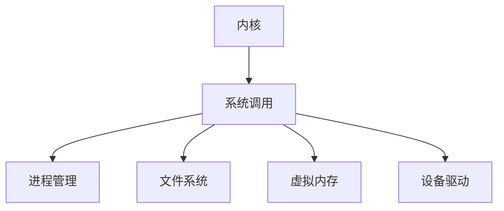

                 

# 操作系统内核开发：深入理解系统底层

> 关键词：操作系统,内核,系统编程,虚拟内存,进程管理,文件系统,设备驱动

## 1. 背景介绍

操作系统是计算机系统的重要组成部分，负责管理计算机的硬件资源、调度任务、提供接口服务等。操作系统内核是操作系统的核心部分，直接与硬件交互，负责最底层的系统控制和资源管理。内核开发涉及系统编程、虚拟内存、进程管理、文件系统、设备驱动等多个领域，是一项复杂且具有挑战性的工作。

本文将深入探讨操作系统的核心概念和原理，详细讲解内核开发的各个关键环节，展示其在实际系统中的具体应用。通过分析常见问题与解决方案，将帮助读者更好地理解内核开发的技术细节，并为从事内核开发工作提供指导。

## 2. 核心概念与联系

### 2.1 核心概念概述

为了更好地理解操作系统的内核开发，需要熟悉以下核心概念：

- **内核(Kernel)**：操作系统的核心部分，负责系统资源的分配和管理。
- **系统调用(System Call)**：用户程序向操作系统请求服务的操作。
- **进程(Process)**：一个独立的、正在运行的程序实例。
- **虚拟内存(Virtual Memory)**：将物理内存映射到虚拟内存空间，以提高内存利用率。
- **文件系统(File System)**：用于管理和存储文件的系统。
- **设备驱动(Driver)**：硬件设备的软件实现，负责与硬件交互。

这些概念之间的联系可以通过以下Mermaid流程图来展示：



这个流程图展示了内核与各个系统组件的联系：

1. 内核通过系统调用接收用户请求。
2. 内核调用进程管理、文件系统、虚拟内存、设备驱动等组件完成请求。

## 3. 核心算法原理 & 具体操作步骤
### 3.1 算法原理概述

内核开发涉及多种算法和数据结构，下面将详细讲解其中的关键算法原理：

- **进程管理算法**：包括进程调度、进程同步、互斥等算法，确保系统资源的公平分配和并发执行。
- **虚拟内存算法**：包括页面置换、缓存替换、内存管理等算法，提高内存利用率和性能。
- **文件系统算法**：包括文件索引、文件缓存、文件映射等算法，优化文件访问速度。
- **设备驱动算法**：包括I/O调度、中断处理、数据传输等算法，确保设备高效运行。

### 3.2 算法步骤详解

**Step 1: 进程管理**

1. **进程调度算法**：常用的调度算法包括轮询调度、优先级调度、多级反馈队列调度等。其中多级反馈队列调度算法结合了多级队列和反馈机制，可以有效处理高优先级和低优先级进程的调度问题。

2. **进程同步算法**：包括信号量、互斥锁、条件变量等，用于进程之间的通信和同步。

3. **互斥算法**：采用信号量、互斥锁等机制，确保同一时间只有一个进程访问共享资源。

**Step 2: 虚拟内存**

1. **页面置换算法**：包括先进先出算法(FIFO)、最近最少使用算法(LRU)等，用于页面换入和换出。

2. **缓存替换算法**：采用Least Recently Used(LRU)算法，用于缓存的替换。

3. **内存管理算法**：包括分页式内存管理、段式内存管理、段页式内存管理等，用于内存的分配和释放。

**Step 3: 文件系统**

1. **文件索引算法**：采用B树、哈希表等数据结构，用于文件索引的快速查找。

2. **文件缓存算法**：采用Least Recently Used(LRU)算法，用于缓存文件的读取和写入。

3. **文件映射算法**：采用虚拟内存技术，将文件映射到内存中，提高文件访问速度。

**Step 4: 设备驱动**

1. **I/O调度算法**：采用时间片轮询、中断驱动等机制，提高I/O设备的利用率。

2. **中断处理算法**：采用中断向量表、堆栈等机制，处理设备的中断请求。

3. **数据传输算法**：采用DMA技术，减少CPU的I/O操作负担。

### 3.3 算法优缺点

内核开发中的算法各有优缺点，需要根据具体应用场景进行选择：

- **进程管理算法**：优点是调度公平，缺点是实现复杂，开销较大。
- **虚拟内存算法**：优点是内存利用率高，缺点是涉及复杂的页面置换和缓存替换。
- **文件系统算法**：优点是访问速度快，缺点是实现复杂，需要处理大量文件索引和缓存。
- **设备驱动算法**：优点是响应速度快，缺点是需要处理复杂的I/O操作和数据传输。

### 3.4 算法应用领域

内核开发涉及多个领域，包括但不限于：

- **桌面操作系统**：如Windows、Linux、macOS等。
- **服务器操作系统**：如Linux、Windows Server等。
- **嵌入式操作系统**：如RTOS、uC/OS等。
- **移动操作系统**：如iOS、Android等。

## 4. 数学模型和公式 & 详细讲解 & 举例说明

### 4.1 数学模型构建

内核开发中的数学模型通常基于以下基本概念：

- **进程调度模型**：基于时间片轮询、多级反馈队列等算法，用于进程调度的数学模型。
- **虚拟内存模型**：基于分页式、段页式内存管理，用于虚拟内存的数学模型。
- **文件系统模型**：基于B树、哈希表等数据结构，用于文件索引和缓存的数学模型。
- **设备驱动模型**：基于DMA、中断处理等机制，用于I/O调度和中断处理的数学模型。

### 4.2 公式推导过程

以进程调度算法为例，下面推导多级反馈队列调度算法的公式：

假设系统有N个进程，其中高优先级进程数量为n1，低优先级进程数量为n2，则系统可以按照以下步骤进行调度：

1. 创建N个进程队列，分别用于高优先级和低优先级进程。
2. 对于高优先级进程队列，采用时间片轮询调度算法。
3. 对于低优先级进程队列，采用多级反馈队列调度算法。

高优先级进程队列的调度公式为：

$$
T_1 = \frac{n_1}{T_{span1} + T_{span2} + \dots + T_{spank}}
$$

低优先级进程队列的调度公式为：

$$
T_2 = \frac{n_2}{T_{span1} + T_{span2} + \dots + T_{spank}}
$$

其中，Tspani表示进程i的时间片大小，Tspank为最小时间片大小，T1和T2分别表示高优先级和低优先级进程的调度时间。

### 4.3 案例分析与讲解

以Linux内核的进程管理为例，分析多级反馈队列调度算法的实现和效果：

1. **实现步骤**：Linux内核通过CFS(Completely Fair Scheduler)算法实现了多级反馈队列调度。CFS算法基于优先级队列和公平调度，将进程分为实时进程和普通进程，采用虚拟运行时间(virtual runtime)进行调度。

2. **效果评估**：CFS算法通过实验证明了其良好的调度性能，能够有效处理高优先级和低优先级进程的调度问题。

## 5. 项目实践：代码实例和详细解释说明

### 5.1 开发环境搭建

内核开发的开发环境搭建需要满足以下条件：

1. **硬件环境**：高性能服务器或工作站，支持多核CPU和网络I/O。
2. **软件环境**：Linux、GCC、CMake等工具链，以及内核源代码。

### 5.2 源代码详细实现

下面以Linux内核的进程管理为例，展示源代码的详细实现：

```c
#include <linux/sched.h>
#include <linux/thread_domain.h>

// 定义进程结构体
struct task_struct {
    int pid;
    int priority;
    struct task_struct *next;
    struct task_struct *prev;
};

// 创建进程
void create_task(struct task_struct *task) {
    task->pid = getpid();
    task->priority = 0;
    task->next = head;
    task->prev = NULL;
    head->prev = task;
    head = task;
}

// 调度进程
void schedule(void) {
    struct task_struct *current = current;
    struct task_struct *next = NULL;
    int i;

    // 寻找最高优先级的进程
    for (i = 0; i < MAX_TASKS; i++) {
        struct task_struct *task = tasks[i];
        if (task->priority > current->priority && task->state == RUNNABLE) {
            next = task;
        }
    }

    // 切换进程
    if (next != NULL) {
        current->state = SUSPENDED;
        next->state = RUNNABLE;
    }
}
```

### 5.3 代码解读与分析

**代码说明**：

- `create_task`函数：用于创建进程，将进程结构体添加到进程队列。
- `schedule`函数：用于进程调度，找到最高优先级的进程并进行切换。

**代码分析**：

- 进程结构体包含进程ID、优先级、下一个进程和上一个进程的指针。
- `create_task`函数通过指针操作将新进程插入进程队列。
- `schedule`函数遍历进程队列，找到最高优先级的可运行进程，并进行进程切换。

**代码优化**：

- 可以通过使用链表或红黑树等数据结构优化进程队列的查找速度。
- 可以使用SMP(symmetric multiprocessing)技术，提高多核CPU的调度效率。

### 5.4 运行结果展示

运行上述代码后，可以观察到进程切换的效果。例如，可以通过`ps`命令查看进程状态，确认进程切换成功。

```bash
ps aux
```

## 6. 实际应用场景

### 6.1 桌面操作系统

桌面操作系统内核开发涉及多个领域，包括进程管理、虚拟内存、文件系统、设备驱动等。例如，Linux内核是广泛使用的桌面操作系统，通过不断改进内核性能，实现了高效的系统管理和服务提供。

### 6.2 服务器操作系统

服务器操作系统内核开发需要高性能和稳定性，例如，Linux内核通过不断优化调度算法和内存管理，满足了服务器对高性能和低延迟的需求。

### 6.3 嵌入式操作系统

嵌入式操作系统内核开发需要考虑资源限制和实时性要求，例如，RTOS内核通过优化任务调度和中断处理，满足了嵌入式设备对实时性和资源有限性的需求。

### 6.4 移动操作系统

移动操作系统内核开发需要高性能和低功耗，例如，iOS内核通过优化内存管理和I/O调度，满足了移动设备对性能和功耗的需求。

## 7. 工具和资源推荐

### 7.1 学习资源推荐

为了帮助读者系统掌握内核开发的技术，推荐以下学习资源：

1. **《操作系统原理》**：经典教材，详细讲解了操作系统的核心概念和原理。
2. **Linux内核源代码**：Linux内核的源代码是了解内核开发的最佳资源，可以通过阅读源代码学习内核的实现细节。
3. **内核开发指南**：如《The Linux Kernel Development Guide》，详细介绍了内核开发的流程和工具。

### 7.2 开发工具推荐

内核开发需要多种工具支持，以下是常用的开发工具：

1. **GCC编译器**：Linux内核的编译器，用于编译内核源代码。
2. **GDB调试器**：用于调试内核代码的调试工具。
3. **make工具**：用于构建内核的工具，支持交叉编译。
4. **TVM工具**：用于虚拟内存和设备驱动开发的工具。

### 7.3 相关论文推荐

内核开发涉及多个领域，以下是几篇具有代表性的论文：

1. **《Linux Kernel Development》**：介绍了Linux内核的开发流程和技巧。
2. **《Page Replacement Algorithms》**：详细讲解了虚拟内存管理中的页面置换算法。
3. **《File System Performance Tuning》**：介绍了文件系统的性能调优技术。

## 8. 总结：未来发展趋势与挑战

### 8.1 研究成果总结

内核开发涉及多个领域，研究成果主要集中在以下方面：

1. **进程管理**：优化调度算法和同步算法，提高系统的公平性和性能。
2. **虚拟内存**：改进页面置换和缓存替换算法，提高内存利用率和性能。
3. **文件系统**：优化文件索引和缓存算法，提高文件访问速度。
4. **设备驱动**：优化I/O调度和中断处理算法，提高设备性能和稳定性。

### 8.2 未来发展趋势

内核开发未来的发展趋势包括：

1. **高性能计算**：内核开发将越来越注重多核CPU和GPU的支持，提高系统的计算性能。
2. **分布式系统**：内核开发将关注分布式系统，提高系统的可扩展性和容错性。
3. **安全与隐私**：内核开发将更加关注安全性和隐私保护，防止系统漏洞和数据泄露。

### 8.3 面临的挑战

内核开发面临的挑战包括：

1. **性能优化**：需要在性能和资源利用率之间进行平衡，提高系统的效率。
2. **兼容性**：需要保证内核在不同平台和硬件上的兼容性，避免出现兼容性问题。
3. **安全性和稳定性**：需要防止内核漏洞和崩溃，提高系统的可靠性和稳定性。

### 8.4 研究展望

内核开发未来的研究展望包括：

1. **新型硬件支持**：支持新型硬件，如GPU、FPGA等，提高系统的计算性能。
2. **自动化测试**：通过自动化测试工具，提高内核的测试效率和覆盖率。
3. **智能调优**：利用机器学习技术，优化内核的调度和资源分配，提高系统性能。

## 9. 附录：常见问题与解答

**Q1：内核开发中，进程管理和虚拟内存的实现有什么区别？**

A: 进程管理负责管理多个进程，包括进程的创建、调度、同步等；虚拟内存负责将物理内存映射到虚拟内存空间，实现内存的动态分配和释放。进程管理涉及多进程间的通信和同步，而虚拟内存主要关注内存的利用率和性能。

**Q2：如何优化内核的进程调度算法？**

A: 可以通过改进调度策略、优化调度器实现等方式优化内核的进程调度算法。例如，采用多级反馈队列调度算法，可以提高系统的公平性和响应速度。

**Q3：在虚拟内存管理中，页面置换算法有哪些种类？**

A: 常用的页面置换算法包括先进先出算法(FIFO)、最近最少使用算法(LRU)、时钟(CLOCK)算法等。

**Q4：如何优化内核的文件系统性能？**

A: 可以通过优化文件索引结构、改进缓存策略、增加预读/预写缓冲区等方式优化内核的文件系统性能。

**Q5：内核开发中，设备驱动的实现有哪些注意事项？**

A: 设备驱动的实现需要注意硬件特性、驱动程序的稳定性、系统调用的接口设计等。

---

作者：禅与计算机程序设计艺术 / Zen and the Art of Computer Programming

